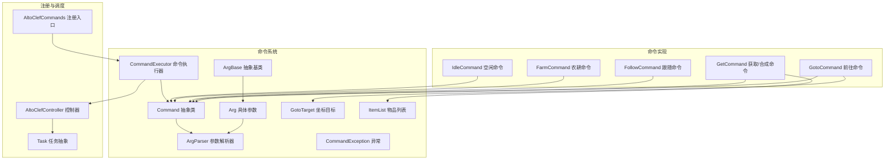
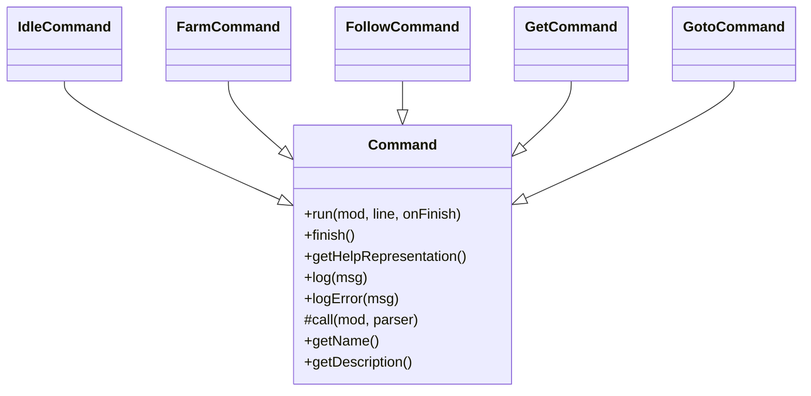
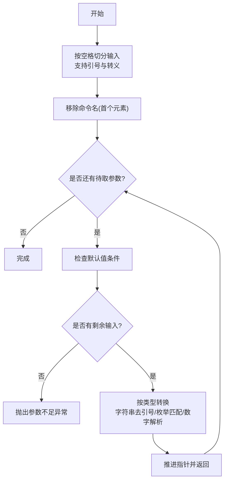
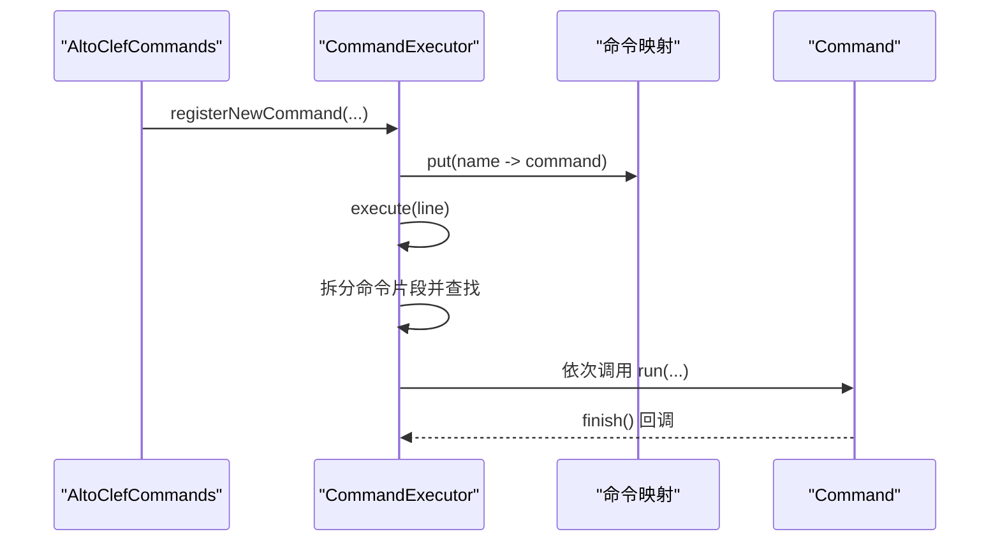
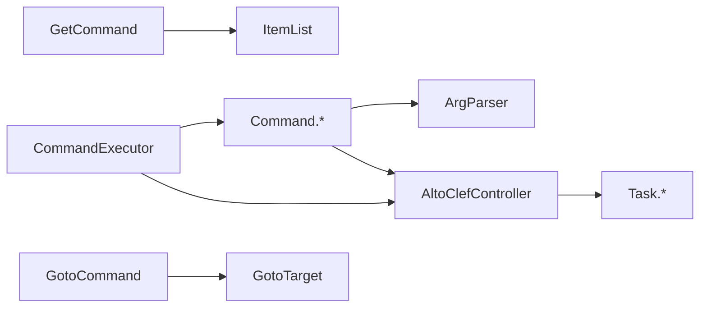

# 自定义命令开发

<cite>
**本文引用的文件**
- [Command.java](file://src/main/java/adris/altoclef/commandsystem/Command.java)
- [ArgBase.java](file://src/main/java/adris/altoclef/commandsystem/ArgBase.java)
- [Arg.java](file://src/main/java/adris/altoclef/commandsystem/Arg.java)
- [ArgParser.java](file://src/main/java/adris/altoclef/commandsystem/ArgParser.java)
- [CommandExecutor.java](file://src/main/java/adris/altoclef/commandsystem/CommandExecutor.java)
- [CommandException.java](file://src/main/java/adris/altoclef/commandsystem/CommandException.java)
- [GotoTarget.java](file://src/main/java/adris/altoclef/commandsystem/GotoTarget.java)
- [ItemList.java](file://src/main/java/adris/altoclef/commandsystem/ItemList.java)
- [IdleCommand.java](file://src/main/java/adris/altoclef/commands/IdleCommand.java)
- [FarmCommand.java](file://src/main/java/adris/altoclef/commands/FarmCommand.java)
- [FollowCommand.java](file://src/main/java/adris/altoclef/commands/FollowCommand.java)
- [GetCommand.java](file://src/main/java/adris/altoclef/commands/GetCommand.java)
- [GotoCommand.java](file://src/main/java/adris/altoclef/commands/GotoCommand.java)
- [AltoClefCommands.java](file://src/main/java/adris/altoclef/AltoClefCommands.java)
- [Task.java](file://src/main/java/adris/altoclef/tasksystem/Task.java)
</cite>

## 目录
1. [简介](#简介)
2. [项目结构](#项目结构)
3. [核心组件](#核心组件)
4. [架构总览](#架构总览)
5. [详细组件分析](#详细组件分析)
6. [依赖分析](#依赖分析)
7. [性能考虑](#性能考虑)
8. [故障排查指南](#故障排查指南)
9. [结论](#结论)
10. [附录：开发与测试清单](#附录开发与测试清单)

## 简介
本指南面向希望在项目中新增聊天命令的开发者，系统讲解命令类设计、参数解析与校验、运行时控制流、注册机制、帮助信息生成、异常处理与性能优化，并提供可直接对照的源码路径示例，帮助你快速上手并高质量完成自定义命令开发。

## 项目结构
命令系统位于模块“commandsystem”下，命令实现集中在“commands”包，命令注册入口在“AltoClefCommands”。命令最终通过控制器调度到具体任务系统（Task）执行。



图表来源
- [Command.java:6-61](file://src/main/java/adris/altoclef/commandsystem/Command.java#L6-L61)
- [ArgBase.java:5-44](file://src/main/java/adris/altoclef/commandsystem/ArgBase.java#L5-L44)
- [Arg.java:3-171](file://src/main/java/adris/altoclef/commandsystem/Arg.java#L3-L171)
- [ArgParser.java:6-106](file://src/main/java/adris/altoclef/commandsystem/ArgParser.java#L6-L106)
- [CommandExecutor.java:11-121](file://src/main/java/adris/altoclef/commandsystem/CommandExecutor.java#L11-L121)
- [GotoTarget.java:7-102](file://src/main/java/adris/altoclef/commandsystem/GotoTarget.java#L7-L102)
- [ItemList.java:9-90](file://src/main/java/adris/altoclef/commandsystem/ItemList.java#L9-L90)
- [IdleCommand.java:8-18](file://src/main/java/adris/altoclef/commands/IdleCommand.java#L8-L18)
- [FarmCommand.java:12-29](file://src/main/java/adris/altoclef/commands/FarmCommand.java#L12-L29)
- [FollowCommand.java:10-33](file://src/main/java/adris/altoclef/commands/FollowCommand.java#L10-L33)
- [GetCommand.java:16-79](file://src/main/java/adris/altoclef/commands/GetCommand.java#L16-L79)
- [GotoCommand.java:20-66](file://src/main/java/adris/altoclef/commands/GotoCommand.java#L20-L66)
- [AltoClefCommands.java:31-65](file://src/main/java/adris/altoclef/AltoClefCommands.java#L31-L65)
- [Task.java:8-181](file://src/main/java/adris/altoclef/tasksystem/Task.java#L8-L181)

章节来源
- [AltoClefCommands.java:31-65](file://src/main/java/adris/altoclef/AltoClefCommands.java#L31-L65)

## 核心组件
- 命令抽象层：Command 定义命令生命周期、帮助表示、日志记录与回调完成通知。
- 参数体系：ArgBase/Arg 提供类型安全的参数声明、默认值、数组模式与帮助表示；ArgParser 负责分词、参数提取与类型转换。
- 执行器：CommandExecutor 负责前缀识别、命令拆分、按顺序串行执行、异常包装与日志。
- 数据模型：GotoTarget、ItemList 将字符串解析为复杂业务对象，支持容错与提示。
- 任务系统：Task 作为执行单元，命令最终通过控制器调度到具体任务。

章节来源
- [Command.java:6-61](file://src/main/java/adris/altoclef/commandsystem/Command.java#L6-L61)
- [ArgBase.java:5-44](file://src/main/java/adris/altoclef/commandsystem/ArgBase.java#L5-L44)
- [Arg.java:3-171](file://src/main/java/adris/altoclef/commandsystem/Arg.java#L3-L171)
- [ArgParser.java:6-106](file://src/main/java/adris/altoclef/commandsystem/ArgParser.java#L6-L106)
- [CommandExecutor.java:11-121](file://src/main/java/adris/altoclef/commandsystem/CommandExecutor.java#L11-L121)
- [GotoTarget.java:7-102](file://src/main/java/adris/altoclef/commandsystem/GotoTarget.java#L7-L102)
- [ItemList.java:9-90](file://src/main/java/adris/altoclef/commandsystem/ItemList.java#L9-L90)
- [Task.java:8-181](file://src/main/java/adris/altoclef/tasksystem/Task.java#L8-L181)

## 架构总览
命令从输入到执行的关键流程如下：

```mermaid
sequenceDiagram
participant U as "用户"
participant CE as "CommandExecutor"
participant C as "Command"
participant AP as "ArgParser"
participant T as "Task(由控制器调度)"
U->>CE : 输入形如 "prefix cmd1;cmd2;..."
CE->>CE : 解析前缀与分号分隔的命令片段
CE->>C : 逐个查找并获取命令实例
CE->>C : 调用 run(controller, line, onFinish)
C->>AP : loadArgs(line, removeFirst=true)
C->>AP : get(Class<T>) 取出参数
C->>T : 构造并提交任务
T-->>C : 任务完成回调
C->>CE : finish() 回调
CE-->>U : 返回执行结果/错误信息
```

图表来源
- [CommandExecutor.java:58-76](file://src/main/java/adris/altoclef/commandsystem/CommandExecutor.java#L58-L76)
- [Command.java:19-24](file://src/main/java/adris/altoclef/commandsystem/Command.java#L19-L24)
- [ArgParser.java:57-96](file://src/main/java/adris/altoclef/commandsystem/ArgParser.java#L57-L96)
- [Task.java:17-50](file://src/main/java/adris/altoclef/tasksystem/Task.java#L17-L50)

## 详细组件分析

### 命令类设计与继承关系
- 继承关系：所有命令均继承自 Command 抽象类，重写受保护的 call(...) 方法以实现具体逻辑。
- 生命周期：run(...) 在内部完成参数加载与解析后调用 call(...)；完成后通过 finish() 回调通知执行器继续后续命令或结束。
- 日志与异常：通过 Command.log/logError 输出日志；统一抛出 CommandException 交由执行器包装并返回给用户。



图表来源
- [Command.java:6-61](file://src/main/java/adris/altoclef/commandsystem/Command.java#L6-L61)
- [IdleCommand.java:8-18](file://src/main/java/adris/altoclef/commands/IdleCommand.java#L8-L18)
- [FarmCommand.java:12-29](file://src/main/java/adris/altoclef/commands/FarmCommand.java#L12-L29)
- [FollowCommand.java:10-33](file://src/main/java/adris/altoclef/commands/FollowCommand.java#L10-L33)
- [GetCommand.java:16-79](file://src/main/java/adris/altoclef/commands/GetCommand.java#L16-L79)
- [GotoCommand.java:20-66](file://src/main/java/adris/altoclef/commands/GotoCommand.java#L20-L66)

章节来源
- [Command.java:19-51](file://src/main/java/adris/altoclef/commandsystem/Command.java#L19-L51)

### 参数解析与类型系统
- 参数声明：使用 Arg<T> 声明参数类型与名称，支持默认值、最小参数计数阈值、数组模式与帮助表示。
- 类型支持：内置支持枚举、字符串、整数、长整型、浮点数、双精度、ItemList、GotoTarget 等。
- 解析流程：ArgParser 将输入按空格切分为关键词，支持引号包裹与注释截断；按声明顺序取出参数并进行类型转换。
- 数组参数：当参数声明为数组时，剩余全部输入作为该参数值，适用于“物品列表”等场景。



图表来源
- [ArgParser.java:18-96](file://src/main/java/adris/altoclef/commandsystem/ArgParser.java#L18-L96)
- [Arg.java:97-154](file://src/main/java/adris/altoclef/commandsystem/Arg.java#L97-L154)

章节来源
- [ArgBase.java:5-44](file://src/main/java/adris/altoclef/commandsystem/ArgBase.java#L5-L44)
- [Arg.java:3-171](file://src/main/java/adris/altoclef/commandsystem/Arg.java#L3-L171)
- [ArgParser.java:6-106](file://src/main/java/adris/altoclef/commandsystem/ArgParser.java#L6-L106)

### 命令命名规范与帮助信息
- 命名规范：命令构造函数中传入唯一名称与简要描述；名称应简洁、语义明确且不重复。
- 帮助表示：getHelpRepresentation() 会根据参数声明输出命令模板，便于用户了解参数占位符与默认值。
- 示例参考：
  - [IdleCommand.java:9-11](file://src/main/java/adris/altoclef/commands/IdleCommand.java#L9-L11)
  - [FarmCommand.java:13-19](file://src/main/java/adris/altoclef/commands/FarmCommand.java#L13-L19)
  - [FollowCommand.java:11-15](file://src/main/java/adris/altoclef/commands/FollowCommand.java#L11-L15)
  - [GetCommand.java:17-23](file://src/main/java/adris/altoclef/commands/GetCommand.java#L17-L23)
  - [GotoCommand.java:24-30](file://src/main/java/adris/altoclef/commands/GotoCommand.java#L24-L30)

章节来源
- [Command.java:32-41](file://src/main/java/adris/altoclef/commandsystem/Command.java#L32-L41)

### 权限与前置条件控制
- 前置条件：命令可在 call(...) 中读取控制器状态（如拥有者、实体位置等），并在不满足条件时提前返回并记录警告。
- 示例参考：
  - [FollowCommand.java:18-31](file://src/main/java/adris/altoclef/commands/FollowCommand.java#L18-L31)
  - [GotoCommand.java:42-64](file://src/main/java/adris/altoclef/commands/GotoCommand.java#L42-L64)

章节来源
- [FollowCommand.java:18-31](file://src/main/java/adris/altoclef/commands/FollowCommand.java#L18-L31)
- [GotoCommand.java:42-64](file://src/main/java/adris/altoclef/commands/GotoCommand.java#L42-L64)

### 注册机制与执行链
- 注册入口：AltoClefCommands.init(...) 统一注册所有命令实例。
- 执行器：CommandExecutor 支持前缀识别、分号分隔的多命令串行执行、异常包装与日志记录。
- 执行链：每个命令执行完成后通过回调继续下一个命令，形成“命令链”。



图表来源
- [AltoClefCommands.java:32-62](file://src/main/java/adris/altoclef/AltoClefCommands.java#L32-L62)
- [CommandExecutor.java:20-56](file://src/main/java/adris/altoclef/commandsystem/CommandExecutor.java#L20-L56)

章节来源
- [AltoClefCommands.java:31-65](file://src/main/java/adris/altoclef/AltoClefCommands.java#L31-L65)
- [CommandExecutor.java:11-121](file://src/main/java/adris/altoclef/commandsystem/CommandExecutor.java#L11-L121)

### 不同类型命令的实现要点

- 简单命令（无参）
  - 设计要点：仅调用控制器执行一个无参任务，无需参数解析。
  - 参考实现：[IdleCommand.java:13-16](file://src/main/java/adris/altoclef/commands/IdleCommand.java#L13-L16)

- 带参数命令（单值）
  - 设计要点：声明 Arg<T> 参数，call 中解析并校验，再构造任务。
  - 参考实现：[FarmCommand.java:21-27](file://src/main/java/adris/altoclef/commands/FarmCommand.java#L21-L27)

- 复杂业务命令（多分支/条件）
  - 设计要点：在 call 中根据参数组合选择不同任务或策略，必要时进行距离/范围/权限校验。
  - 参考实现：[GetCommand.java:25-71](file://src/main/java/adris/altoclef/commands/GetCommand.java#L25-L71)、[GotoCommand.java:42-64](file://src/main/java/adris/altoclef/commands/GotoCommand.java#L42-L64)

- 高级参数（复合类型）
  - 设计要点：使用 GotoTarget/ItemList 等复合类型，利用其 parseRemainder 进行容错解析与提示。
  - 参考实现：[GotoTarget.java:22-69](file://src/main/java/adris/altoclef/commandsystem/GotoTarget.java#L22-L69)、[ItemList.java:16-88](file://src/main/java/adris/altoclef/commandsystem/ItemList.java#L16-L88)

章节来源
- [IdleCommand.java:8-18](file://src/main/java/adris/altoclef/commands/IdleCommand.java#L8-L18)
- [FarmCommand.java:12-29](file://src/main/java/adris/altoclef/commands/FarmCommand.java#L12-L29)
- [GetCommand.java:16-79](file://src/main/java/adris/altoclef/commands/GetCommand.java#L16-L79)
- [GotoCommand.java:20-66](file://src/main/java/adris/altoclef/commands/GotoCommand.java#L20-L66)
- [GotoTarget.java:7-102](file://src/main/java/adris/altoclef/commandsystem/GotoTarget.java#L7-L102)
- [ItemList.java:9-90](file://src/main/java/adris/altoclef/commandsystem/ItemList.java#L9-L90)

## 依赖分析
- 命令对参数系统的依赖：所有命令通过 Arg/ArgParser 获取参数，确保类型安全与一致的错误处理。
- 命令对控制器的依赖：命令通过控制器提交任务，任务系统负责实际执行。
- 执行器对命令表的依赖：通过名称映射查找命令，避免硬编码命令名。
- 复合参数对工具类的依赖：GotoTarget/ItemList 对枚举解析与模糊匹配进行封装。



图表来源
- [Command.java:6-61](file://src/main/java/adris/altoclef/commandsystem/Command.java#L6-L61)
- [ArgParser.java:6-106](file://src/main/java/adris/altoclef/commandsystem/ArgParser.java#L6-L106)
- [CommandExecutor.java:11-121](file://src/main/java/adris/altoclef/commandsystem/CommandExecutor.java#L11-L121)
- [GetCommand.java:16-79](file://src/main/java/adris/altoclef/commands/GetCommand.java#L16-L79)
- [GotoCommand.java:20-66](file://src/main/java/adris/altoclef/commands/GotoCommand.java#L20-L66)
- [ItemList.java:9-90](file://src/main/java/adris/altoclef/commandsystem/ItemList.java#L9-L90)
- [GotoTarget.java:7-102](file://src/main/java/adris/altoclef/commandsystem/GotoTarget.java#L7-L102)
- [Task.java:8-181](file://src/main/java/adris/altoclef/tasksystem/Task.java#L8-L181)

## 性能考虑
- 参数解析成本：ArgParser 的分词与类型转换为 O(n) 级别，建议避免在高频命令中使用过长的数组参数。
- 任务调度开销：命令最终委托任务执行，任务系统内部有子任务切换与中断判断，尽量减少不必要的任务切换。
- I/O 与网络：若命令涉及外部服务（如 LLM），应在命令层做超时与降级处理，避免阻塞主线程。
- 日志与调试：大量日志会影响性能，建议在非调试模式下降低日志级别。

## 故障排查指南
- 常见异常
  - 参数不足/过多：检查 ArgParser 的 get(...) 调用次数与命令帮助表示。
  - 类型解析失败：确认输入格式与类型匹配（如整数/浮点/枚举）。
  - 命令不存在：确认命令已在注册入口中注册且名称正确。
  - 复合参数解析失败：检查 GotoTarget/ItemList 的输入格式与容错提示。
- 排查步骤
  - 使用 getHelpRepresentation() 输出命令模板核对参数占位。
  - 在命令中添加有限的日志输出定位问题点。
  - 逐步拆分命令链（去掉分号分隔的其他命令）以缩小范围。
- 参考实现
  - [CommandException.java:3-12](file://src/main/java/adris/altoclef/commandsystem/CommandException.java#L3-L12)
  - [ArgParser.java:69-96](file://src/main/java/adris/altoclef/commandsystem/ArgParser.java#L69-L96)
  - [CommandExecutor.java:58-76](file://src/main/java/adris/altoclef/commandsystem/CommandExecutor.java#L58-L76)

章节来源
- [CommandException.java:3-12](file://src/main/java/adris/altoclef/commandsystem/CommandException.java#L3-L12)
- [ArgParser.java:69-96](file://src/main/java/adris/altoclef/commandsystem/ArgParser.java#L69-L96)
- [CommandExecutor.java:38-56](file://src/main/java/adris/altoclef/commandsystem/CommandExecutor.java#L38-L56)

## 结论
通过统一的命令抽象、强类型的参数系统与清晰的注册执行链，项目提供了稳定可靠的自定义命令扩展能力。遵循本文的命名规范、参数设计与异常处理最佳实践，即可高效地开发出功能完备、易于维护的聊天命令。

## 附录：开发与测试清单
- 开发步骤
  - 新建命令类继承 Command，声明参数与描述。
  - 实现 call(...)：解析参数、校验前置条件、构造并提交任务。
  - 在注册入口中加入新命令实例。
  - 编写帮助信息与示例，确保 getHelpRepresentation() 输出合理。
- 测试建议
  - 单命令测试：分别验证参数缺失、参数过多、类型错误、边界值。
  - 多命令链测试：验证分号分隔的命令链执行顺序与异常传播。
  - 边界场景：坐标越界、权限不足、任务冲突等。
- 调试技巧
  - 在命令中使用 log/logError 输出关键状态。
  - 使用 getHelpRepresentation() 快速核对命令模板。
  - 逐步拆分命令链定位问题。