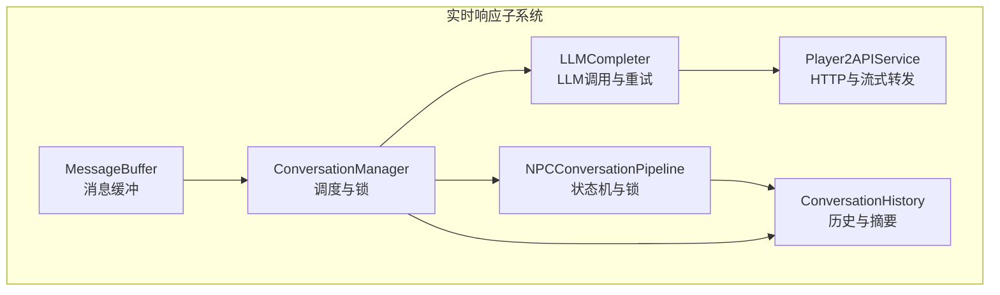
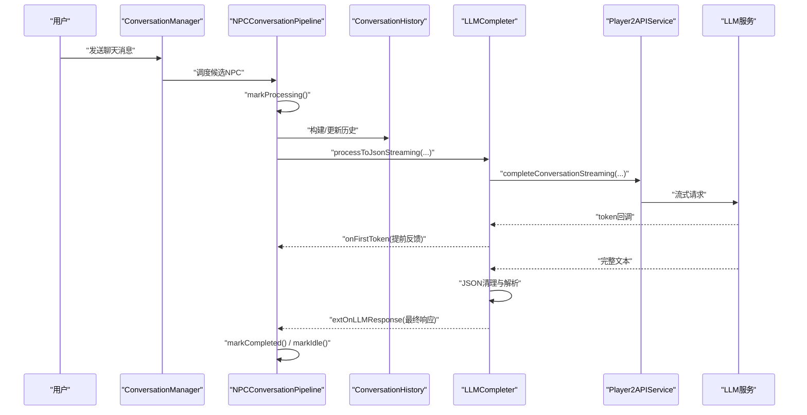
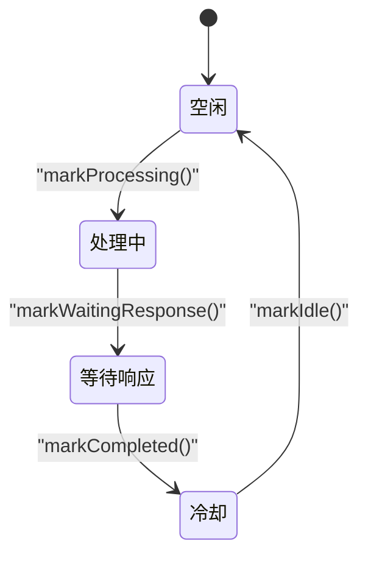
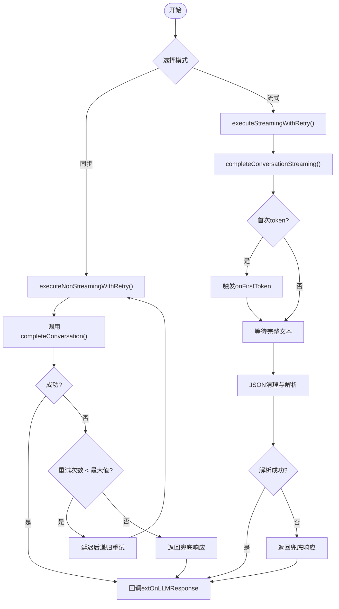
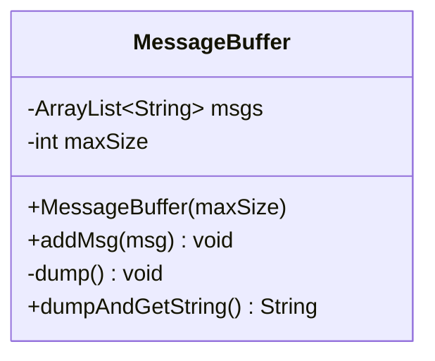
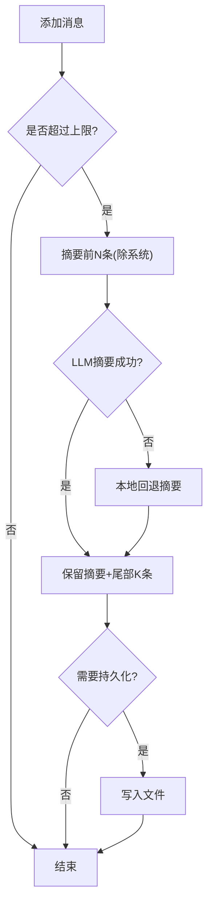
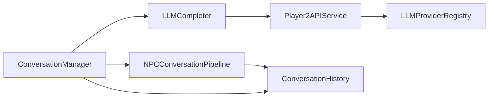

# 实时响应机制

<cite>
**本文引用的文件**
- [NPCConversationPipeline.java](file://src/main/java/adris/altoclef/player2api/NPCConversationPipeline.java)
- [LLMCompleter.java](file://src/main/java/adris/altoclef/player2api/LLMCompleter.java)
- [MessageBuffer.java](file://src/main/java/adris/altoclef/player2api/MessageBuffer.java)
- [ConversationManager.java](file://src/main/java/adris/altoclef/player2api/manager/ConversationManager.java)
- [ConversationHistory.java](file://src/main/java/adris/altoclef/player2api/ConversationHistory.java)
- [Player2APIService.java](file://src/main/java/adris/altoclef/player2api/Player2APIService.java)
</cite>

## 目录
1. [引言](#引言)
2. [项目结构](#项目结构)
3. [核心组件](#核心组件)
4. [架构总览](#架构总览)
5. [详细组件分析](#详细组件分析)
6. [依赖分析](#依赖分析)
7. [性能考虑](#性能考虑)
8. [故障排查指南](#故障排查指南)
9. [结论](#结论)
10. [附录](#附录)

## 引言
本文件围绕实时响应机制展开，聚焦于 NPC 对话流水线的实现与优化，涵盖消息预处理、LLM 调用、响应后处理等关键阶段，并深入解析 LLMCompleter 的增量响应处理机制（流式输出、响应拼接与错误恢复）、MessageBuffer 的缓冲区管理策略（响应缓存、延迟处理、批量发送），以及如何通过代码示例展示流式响应处理、响应缓冲管理与异步调用。同时提供扩展方法与性能优化建议，以及常见问题的解决方案。

## 项目结构
本机制涉及的模块主要位于 player2api 子包及其子模块中，核心文件如下：
- NPCConversationPipeline：单个 NPC 的对话状态机与锁管理
- LLMCompleter：LLM 调用与重试、流式回调、错误恢复
- MessageBuffer：消息缓冲与批量导出
- ConversationManager：全局对话调度、锁与队列管理
- ConversationHistory：对话历史管理、摘要与持久化
- Player2APIService：对外服务封装，负责 HTTP 请求与流式接口转发



图表来源
- [NPCConversationPipeline.java:14-194](file://src/main/java/adris/altoclef/player2api/NPCConversationPipeline.java#L14-L194)
- [LLMCompleter.java:17-318](file://src/main/java/adris/altoclef/player2api/LLMCompleter.java#L17-L318)
- [MessageBuffer.java:5-36](file://src/main/java/adris/altoclef/player2api/MessageBuffer.java#L5-L36)
- [ConversationManager.java:27-201](file://src/main/java/adris/altoclef/player2api/manager/ConversationManager.java#L27-L201)
- [ConversationHistory.java:16-299](file://src/main/java/adris/altoclef/player2api/ConversationHistory.java#L16-L299)
- [Player2APIService.java:35-274](file://src/main/java/adris/altoclef/player2api/Player2APIService.java#L35-L274)

章节来源
- [NPCConversationPipeline.java:14-194](file://src/main/java/adris/altoclef/player2api/NPCConversationPipeline.java#L14-L194)
- [LLMCompleter.java:17-318](file://src/main/java/adris/altoclef/player2api/LLMCompleter.java#L17-L318)
- [MessageBuffer.java:5-36](file://src/main/java/adris/altoclef/player2api/MessageBuffer.java#L5-L36)
- [ConversationManager.java:27-201](file://src/main/java/adris/altoclef/player2api/manager/ConversationManager.java#L27-L201)
- [ConversationHistory.java:16-299](file://src/main/java/adris/altoclef/player2api/ConversationHistory.java#L16-L299)
- [Player2APIService.java:35-274](file://src/main/java/adris/altoclef/player2api/Player2APIService.java#L35-L274)

## 核心组件
- NPCConversationPipeline：以状态机为核心，管理每个 NPC 的处理阶段（空闲、处理中、等待响应、冷却），并提供 per-NPC 锁与超时控制，避免全局阻塞。
- LLMCompleter：封装同步与流式 LLM 调用，内置重试与超时保护，支持首次 token 回调以提供即时反馈；对流式 JSON 进行清理与解析，失败时返回兜底响应。
- MessageBuffer：固定容量的消息缓冲器，支持先进先出滚动覆盖，便于批量导出或调试。
- ConversationManager：全局调度入口，负责用户消息分发、AI 间消息传播、优先级排序与提交执行。
- ConversationHistory：维护对话历史，支持上限截断、摘要生成与本地回退摘要，以及文件持久化。
- Player2APIService：统一对外服务，封装 HTTP 请求与流式接口转发，屏蔽底层 LLM 提供商差异。

章节来源
- [NPCConversationPipeline.java:14-194](file://src/main/java/adris/altoclef/player2api/NPCConversationPipeline.java#L14-L194)
- [LLMCompleter.java:17-318](file://src/main/java/adris/altoclef/player2api/LLMCompleter.java#L17-L318)
- [MessageBuffer.java:5-36](file://src/main/java/adris/altoclef/player2api/MessageBuffer.java#L5-L36)
- [ConversationManager.java:27-201](file://src/main/java/adris/altoclef/player2api/manager/ConversationManager.java#L27-L201)
- [ConversationHistory.java:16-299](file://src/main/java/adris/altoclef/player2api/ConversationHistory.java#L16-L299)
- [Player2APIService.java:35-274](file://src/main/java/adris/altoclef/player2api/Player2APIService.java#L35-L274)

## 架构总览
实时响应的整体流程如下：
- 用户输入经由 ConversationManager 接收并按规则分发至各 NPC 的 AgentConversationData 队列
- ConversationManager 根据优先级与可用性调度 NPCConversationPipeline 执行
- NPCConversationPipeline 在 PROCESSING 阶段构建 Prompt 并准备 ConversationHistory
- LLMCompleter 通过 Player2APIService 发起同步或流式 LLM 调用，触发 onFirstToken 提前反馈
- 流式响应到达后进行 JSON 清理与解析，失败则返回兜底响应
- 完成后进入 COOLDOWN 并释放锁，等待下次调度



图表来源
- [ConversationManager.java:152-190](file://src/main/java/adris/altoclef/player2api/manager/ConversationManager.java#L152-L190)
- [NPCConversationPipeline.java:156-186](file://src/main/java/adris/altoclef/player2api/NPCConversationPipeline.java#L156-L186)
- [LLMCompleter.java:193-303](file://src/main/java/adris/altoclef/player2api/LLMCompleter.java#L193-L303)
- [Player2APIService.java:109-118](file://src/main/java/adris/altoclef/player2api/Player2APIService.java#L109-L118)
- [ConversationHistory.java:181-212](file://src/main/java/adris/altoclef/player2api/ConversationHistory.java#L181-L212)

## 详细组件分析

### NPCConversationPipeline：状态机与锁管理
- 状态机：IDLE → PROCESSING → WAITING_RESPONSE → COOLDOWN，确保严格顺序与可观察性
- 锁管理：per-NPC 等待响应锁，带超时自动释放；冷却期防止频繁响应
- 调度判断：仅当状态为空闲、未锁定且冷却期已过才允许处理
- 生命周期：开始处理、标记等待响应（上锁）、完成（解锁+记录结束时间）、回到空闲



图表来源
- [NPCConversationPipeline.java:41-186](file://src/main/java/adris/altoclef/player2api/NPCConversationPipeline.java#L41-L186)

章节来源
- [NPCConversationPipeline.java:14-194](file://src/main/java/adris/altoclef/player2api/NPCConversationPipeline.java#L14-L194)

### LLMCompleter：增量响应与错误恢复
- 同步与流式两种模式：processToJson、processToString、processToJsonStreaming
- 流式处理：首次 token 触发 onFirstToken，随后收集完整文本并进行 JSON 清理与解析
- 错误恢复：最大重试次数与指数退避延迟；异常时返回兜底响应
- 超时保护：isAvailible 检测长时间占用并强制释放锁
- 锁配合：根据 isConversation 设置全局 ConversationManager.Lock，保证响应完成前不接受新请求



图表来源
- [LLMCompleter.java:27-97](file://src/main/java/adris/altoclef/player2api/LLMCompleter.java#L27-L97)
- [LLMCompleter.java:151-176](file://src/main/java/adris/altoclef/player2api/LLMCompleter.java#L151-L176)
- [LLMCompleter.java:240-303](file://src/main/java/adris/altoclef/player2api/LLMCompleter.java#L240-L303)

章节来源
- [LLMCompleter.java:17-318](file://src/main/java/adris/altoclef/player2api/LLMCompleter.java#L17-L318)

### MessageBuffer：缓冲区管理策略
- 固定容量滚动队列：超过上限时移除最早元素，保证内存占用可控
- 批量导出：dumpAndGetString 将当前缓冲拼接为字符串，随后清空缓冲
- 适用场景：日志调试、批量上报或临时聚合



图表来源
- [MessageBuffer.java:5-36](file://src/main/java/adris/altoclef/player2api/MessageBuffer.java#L5-L36)

章节来源
- [MessageBuffer.java:5-36](file://src/main/java/adris/altoclef/player2api/MessageBuffer.java#L5-L36)

### ConversationManager：调度与锁
- 全局锁：waitingForResponseLock 与超时控制，防止在未收到响应时重复触发
- 用户消息分发：支持“召唤关键词”广播给所有 NPC，否则仅发送给所属玩家的 NPC
- AI 间消息传播：基于距离过滤，避免无关 NPC 收到消息
- 调度循环：按优先级排序，尝试提交到并行调度器，直至不可用

```mermaid
sequenceDiagram
participant CM as "ConversationManager"
participant Q as "AgentConversationData队列"
participant S as "ParallelLLMScheduler"
participant P as "NPCConversationPipeline"
CM->>Q : "onUserChatMessage()/onAICharacterMessage()"
loop "遍历候选"
CM->>S : "trySubmit(pipeline,data,onChar,onErr)"
alt "提交成功"
S->>P : "执行处理"
else "不可用"
break
end
end
```

图表来源
- [ConversationManager.java:115-190](file://src/main/java/adris/altoclef/player2api/manager/ConversationManager.java#L115-L190)

章节来源
- [ConversationManager.java:27-201](file://src/main/java/adris/altoclef/player2api/manager/ConversationManager.java#L27-L201)

### ConversationHistory：历史与摘要
- 历史上限与截断：超过阈值时进行摘要，保留系统提示与尾部若干条
- 摘要策略：优先调用 LLM 摘要，失败则使用本地回退策略（抽取关键用户消息片段）
- 文件持久化：定期保存与加载，限制单次读取数量，避免过大文件影响性能
- 系统提示管理：支持动态更新系统提示，确保角色设定一致性



图表来源
- [ConversationHistory.java:48-93](file://src/main/java/adris/altoclef/player2api/ConversationHistory.java#L48-L93)
- [ConversationHistory.java:107-179](file://src/main/java/adris/altoclef/player2api/ConversationHistory.java#L107-L179)

章节来源
- [ConversationHistory.java:16-299](file://src/main/java/adris/altoclef/player2api/ConversationHistory.java#L16-L299)

### Player2APIService：流式接口与外部服务
- 同步/字符串/流式三种调用方式，统一包装请求体与响应解析
- 流式转发：委托给当前激活的 LLMProvider，实现跨提供商的一致接口
- TTS 与 STT：支持本地与远程模式，结合情绪状态动态调整语音参数
- 心跳与健康检查：周期性发送心跳，维持连接有效性

章节来源
- [Player2APIService.java:48-118](file://src/main/java/adris/altoclef/player2api/Player2APIService.java#L48-L118)
- [Player2APIService.java:120-256](file://src/main/java/adris/altoclef/player2api/Player2APIService.java#L120-L256)
- [Player2APIService.java:258-274](file://src/main/java/adris/altoclef/player2api/Player2APIService.java#L258-L274)

## 依赖分析
- 组件耦合
  - NPCConversationPipeline 依赖 ConversationManager.Lock 与调度器，确保并发安全
  - LLMCompleter 依赖 Player2APIService 与 ConversationHistory，负责异步与重试
  - ConversationManager 作为中枢，协调用户消息、AI 消息与调度
- 外部依赖
  - LLMProviderRegistry：提供流式实现，解耦具体提供商
  - Player2HTTPUtils：封装 HTTP 请求，屏蔽网络细节
- 循环依赖风险
  - 当前设计通过回调与单线程执行降低循环依赖概率；需避免在回调中直接反向触发调度



图表来源
- [ConversationManager.java:72-72](file://src/main/java/adris/altoclef/player2api/manager/ConversationManager.java#L72-L72)
- [Player2APIService.java:116-117](file://src/main/java/adris/altoclef/player2api/Player2APIService.java#L116-L117)
- [LLMCompleter.java:13-13](file://src/main/java/adris/altoclef/player2api/LLMCompleter.java#L13-L13)

章节来源
- [ConversationManager.java:27-201](file://src/main/java/adris/altoclef/player2api/manager/ConversationManager.java#L27-L201)
- [Player2APIService.java:35-274](file://src/main/java/adris/altoclef/player2api/Player2APIService.java#L35-L274)
- [LLMCompleter.java:17-318](file://src/main/java/adris/altoclef/player2api/LLMCompleter.java#L17-L318)

## 性能考虑
- 流式输出优先：使用 processToJsonStreaming 并在首次 token 时提供反馈，显著改善感知延迟
- 历史截断与摘要：ConversationHistory 的上限与摘要策略减少上下文长度，提升响应速度
- 固定容量缓冲：MessageBuffer 控制内存占用，避免堆积导致 GC 压力
- 重试与退避：LLMCompleter 的有限重试与延迟退避平衡稳定性与吞吐
- 冷却期与锁：NPCConversationPipeline 的冷却与 per-NPC 锁避免过度竞争与重复计算
- 并行调度：ConversationManager 与 ParallelLLMScheduler 结合，最大化资源利用率

## 故障排查指南
- LLMCompleter 一直不可用
  - 检查 isAvailible 是否因超时被强制重置
  - 查看日志中的“LLMCompleter.isProcessing timed out”警告
  - 章节来源: [LLMCompleter.java:305-317](file://src/main/java/adris/altoclef/player2api/LLMCompleter.java#L305-L317)
- 流式 JSON 解析失败
  - LLMCompleter 会在解析异常时返回兜底响应，检查日志中的“Failed to parse JSON”
  - 章节来源: [LLMCompleter.java:265-268](file://src/main/java/adris/altoclef/player2api/LLMCompleter.java#L265-L268)
- 响应长时间无反馈
  - 确认 NPCConversationPipeline 是否处于 WAITING_RESPONSE 且未超时
  - 检查 ConversationManager.Lock 是否被长期占用
  - 章节来源: [NPCConversationPipeline.java:94-105](file://src/main/java/adris/altoclef/player2api/NPCConversationPipeline.java#L94-L105), [ConversationManager.java:36-52](file://src/main/java/adris/altoclef/player2api/manager/ConversationManager.java#L36-L52)
- 历史过大导致性能下降
  - 检查 ConversationHistory 的摘要与持久化逻辑是否正常触发
  - 章节来源: [ConversationHistory.java:48-93](file://src/main/java/adris/altoclef/player2api/ConversationHistory.java#L48-L93)

## 结论
本机制通过状态机、锁与冷却期保障并发安全，借助流式 LLM 调用与 JSON 清理实现低延迟实时响应，并以历史摘要与固定容量缓冲优化性能。结合全局调度与错误恢复策略，系统在复杂场景下仍能保持稳定与高效。

## 附录

### 实现要点与最佳实践
- 流式响应处理
  - 使用 processToJsonStreaming 并传入 onFirstToken，在首次 token 到达时立即反馈
  - 章节来源: [LLMCompleter.java:193-238](file://src/main/java/adris/altoclef/player2api/LLMCompleter.java#L193-L238)
- 响应缓冲管理
  - 使用 MessageBuffer 管理临时消息，达到阈值或定时批量导出
  - 章节来源: [MessageBuffer.java:5-36](file://src/main/java/adris/altoclef/player2api/MessageBuffer.java#L5-L36)
- 异步调用与回调
  - LLMCompleter 在单线程执行器中串行处理，回调中释放锁与状态
  - 章节来源: [LLMCompleter.java:27-97](file://src/main/java/adris/altoclef/player2api/LLMCompleter.java#L27-L97)
- 扩展方法
  - 新增 LLM 提供商：通过 LLMProviderRegistry 注册新的流式实现
  - 增强历史管理：在 ConversationHistory 中增加更细粒度的摘要策略
  - 章节来源: [Player2APIService.java:116-117](file://src/main/java/adris/altoclef/player2api/Player2APIService.java#L116-L117), [ConversationHistory.java:78-93](file://src/main/java/adris/altoclef/player2api/ConversationHistory.java#L78-L93)