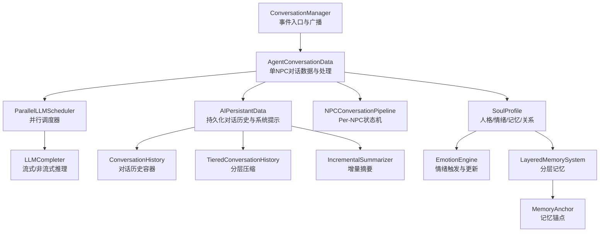
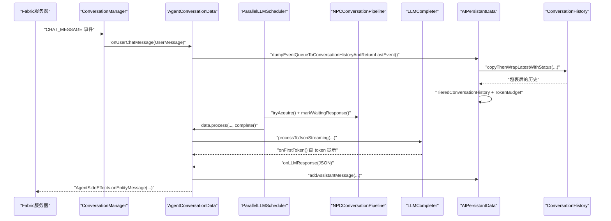
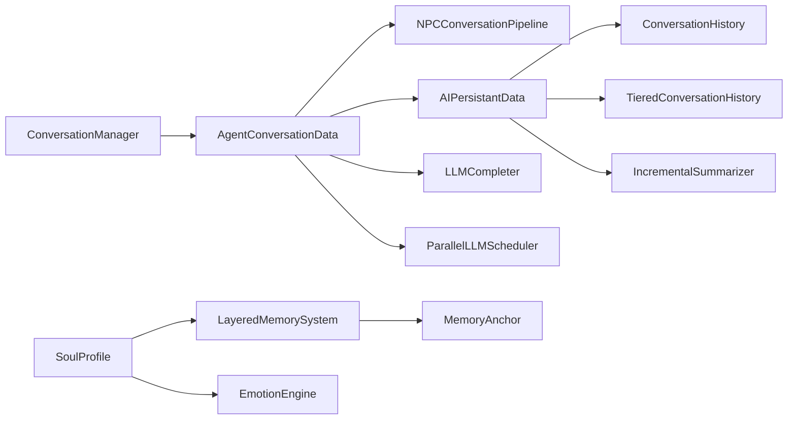

# 对话交互系统

<cite>
**本文引用的文件**
- [ConversationManager.java](file://src/main/java/adris/altoclef/player2api/manager/ConversationManager.java)
- [AgentConversationData.java](file://src/main/java/adris/altoclef/player2api/AgentConversationData.java)
- [TieredConversationHistory.java](file://src/main/java/adris/altoclef/player2api/context/TieredConversationHistory.java)
- [LayeredMemorySystem.java](file://src/main/java/adris/altoclef/player2api/memory/LayeredMemorySystem.java)
- [EmotionEngine.java](file://src/main/java/adris/altoclef/player2api/soul/EmotionEngine.java)
- [NPCConversationPipeline.java](file://src/main/java/adris/altoclef/player2api/NPCConversationPipeline.java)
- [LLMCompleter.java](file://src/main/java/adris/altoclef/player2api/LLMCompleter.java)
- [IncrementalSummarizer.java](file://src/main/java/adris/altoclef/player2api/context/IncrementalSummarizer.java)
- [SoulProfile.java](file://src/main/java/adris/altoclef/player2api/soul/SoulProfile.java)
- [MemoryAnchor.java](file://src/main/java/adris/altoclef/player2api/soul/MemoryAnchor.java)
- [ParallelLLMScheduler.java](file://src/main/java/adris/altoclef/player2api/ParallelLLMScheduler.java)
- [AIPersistantData.java](file://src/main/java/adris/altoclef/player2api/AIPersistantData.java)
- [Event.java](file://src/main/java/adris/altoclef/player2api/Event.java)
- [ConversationHistory.java](file://src/main/java/adris/altoclef/player2api/ConversationHistory.java)
</cite>

## 目录
1. [简介](#简介)
2. [项目结构](#项目结构)
3. [核心组件](#核心组件)
4. [架构总览](#架构总览)
5. [详细组件分析](#详细组件分析)
6. [依赖关系分析](#依赖关系分析)
7. [性能考量](#性能考量)
8. [故障排查指南](#故障排查指南)
9. [结论](#结论)
10. [附录](#附录)

## 简介
本文件面向“对话交互系统”的技术文档，聚焦于对话管理机制的设计与实现，涵盖以下关键主题：
- ConversationManager 的核心职责与事件分发
- AgentConversationData 的数据封装与处理优先级
- TieredConversationHistory 的层级化历史管理与压缩策略
- 对话上下文维护策略：短期记忆、长期记忆、情感状态对对话的影响
- 实时流式响应的实现机制：LLM 的增量响应处理、对话状态的动态更新、多轮对话连贯性保障
- 具体代码示例路径：如何处理不同类型的用户输入、如何管理对话状态、如何实现自然的对话流程
- 扩展与自定义策略：对话管道、记忆系统、情感引擎与调度器的扩展点

## 项目结构
对话交互系统围绕“NPC 对话”这一核心域展开，主要模块包括：
- 管理层：ConversationManager 负责事件入口、广播与调度
- 数据层：AgentConversationData 封装单 NPC 的对话队列与处理逻辑
- 历史与上下文：ConversationHistory、TieredConversationHistory、IncrementalSummarizer、TokenBudgetAllocator
- 认知与情感：SoulProfile、EmotionEngine、LayeredMemorySystem、MemoryAnchor
- 推理与调度：LLMCompleter、ParallelLLMScheduler、NPCConversationPipeline
- 事件模型：Event（用户消息、角色消息、信息消息）

图表来源
- [ConversationManager.java:27-201](file://src/main/java/adris/altoclef/player2api/manager/ConversationManager.java#L27-L201)
- [AgentConversationData.java:33-657](file://src/main/java/adris/altoclef/player2api/AgentConversationData.java#L33-L657)
- [ParallelLLMScheduler.java:17-188](file://src/main/java/adris/altoclef/player2api/ParallelLLMScheduler.java#L17-L188)
- [LLMCompleter.java:17-318](file://src/main/java/adris/altoclef/player2api/LLMCompleter.java#L17-L318)
- [AIPersistantData.java:24-149](file://src/main/java/adris/altoclef/player2api/AIPersistantData.java#L24-L149)
- [ConversationHistory.java:16-299](file://src/main/java/adris/altoclef/player2api/ConversationHistory.java#L16-L299)
- [TieredConversationHistory.java:9-178](file://src/main/java/adris/altoclef/player2api/context/TieredConversationHistory.java#L9-L178)
- [IncrementalSummarizer.java:12-159](file://src/main/java/adris/altoclef/player2api/context/IncrementalSummarizer.java#L12-L159)
- [NPCConversationPipeline.java:14-194](file://src/main/java/adris/altoclef/player2api/NPCConversationPipeline.java#L14-L194)
- [SoulProfile.java:15-226](file://src/main/java/adris/altoclef/player2api/soul/SoulProfile.java#L15-L226)
- [EmotionEngine.java:11-184](file://src/main/java/adris/altoclef/player2api/soul/EmotionEngine.java#L11-L184)
- [LayeredMemorySystem.java:10-172](file://src/main/java/adris/altoclef/player2api/memory/LayeredMemorySystem.java#L10-L172)
- [MemoryAnchor.java:8-83](file://src/main/java/adris/altoclef/player2api/soul/MemoryAnchor.java#L8-L83)

章节来源
- [ConversationManager.java:27-201](file://src/main/java/adris/altoclef/player2api/manager/ConversationManager.java#L27-L201)
- [AgentConversationData.java:33-657](file://src/main/java/adris/altoclef/player2api/AgentConversationData.java#L33-L657)

## 核心组件
- ConversationManager：负责注册聊天事件、解析用户消息、按“召唤/求救/普通”关键字广播至所有 NPC 或仅归属玩家的 NPC；协调调度器与 TTS 管理器。
- AgentConversationData：单 NPC 的对话数据容器，维护事件队列、处理优先级、最小响应间隔、强制救援/攻击/召唤拦截、问候绕过 LLM、情绪提醒注入、自动喂食等。
- NPCConversationPipeline：Per-NPC 状态机与锁，隔离等待响应与冷却期，避免全局阻塞。
- LLMCompleter：统一的 LLM 调用封装，支持非流式与流式两种模式，带重试与 JSON 清洗、首 token 提示回调。
- ParallelLLMScheduler：令牌桶限流 + 多实例并发，保障多 NPC 同时对话的吞吐与稳定性。
- AIPersistantData：持久化对话历史、系统提示更新、状态包裹、分层压缩与令牌预算控制。
- TieredConversationHistory：三层窗口（热/温/冷）+ 重要度评估 + 增量摘要，显著降低上下文开销。
- IncrementalSummarizer：冷区增量摘要，避免全量摘要带来的延迟与失败风险。
- SoulProfile/EmotionEngine/LayeredMemorySystem/MemoryAnchor：情感状态、人格矩阵、分层记忆与记忆锚点，驱动对话风格与行为一致性。

章节来源
- [ConversationManager.java:27-201](file://src/main/java/adris/altoclef/player2api/manager/ConversationManager.java#L27-L201)
- [AgentConversationData.java:33-657](file://src/main/java/adris/altoclef/player2api/AgentConversationData.java#L33-L657)
- [NPCConversationPipeline.java:14-194](file://src/main/java/adris/altoclef/player2api/NPCConversationPipeline.java#L14-L194)
- [LLMCompleter.java:17-318](file://src/main/java/adris/altoclef/player2api/LLMCompleter.java#L17-L318)
- [ParallelLLMScheduler.java:17-188](file://src/main/java/adris/altoclef/player2api/ParallelLLMScheduler.java#L17-L188)
- [AIPersistantData.java:24-149](file://src/main/java/adris/altoclef/player2api/AIPersistantData.java#L24-L149)
- [TieredConversationHistory.java:9-178](file://src/main/java/adris/altoclef/player2api/context/TieredConversationHistory.java#L9-L178)
- [IncrementalSummarizer.java:12-159](file://src/main/java/adris/altoclef/player2api/context/IncrementalSummarizer.java#L12-L159)
- [SoulProfile.java:15-226](file://src/main/java/adris/altoclef/player2api/soul/SoulProfile.java#L15-L226)
- [EmotionEngine.java:11-184](file://src/main/java/adris/altoclef/player2api/soul/EmotionEngine.java#L11-L184)
- [LayeredMemorySystem.java:10-172](file://src/main/java/adris/altoclef/player2api/memory/LayeredMemorySystem.java#L10-L172)
- [MemoryAnchor.java:8-83](file://src/main/java/adris/altoclef/player2api/soul/MemoryAnchor.java#L8-L83)

## 架构总览
对话交互系统采用“事件驱动 + 分层上下文 + 认知增强”的架构设计：
- 事件入口：Fabric 服务器聊天事件 → ConversationManager 解析 → AgentConversationData 入队
- 上下文构建：AIPersistantData 包裹世界/代理状态、记忆锚点、情绪提醒，结合分层压缩与令牌预算
- 推理执行：ParallelLLMScheduler 令牌桶 + 多实例 LLMCompleter 流式/非流式调用
- 状态更新：LLM 响应回调 → 更新对话历史 → 触发 Side Effects（TTS/动作/反馈）
- 认知闭环：SoulProfile/EmotionEngine/LayeredMemorySystem 持续影响后续对话风格与决策

图表来源
- [ConversationManager.java:59-189](file://src/main/java/adris/altoclef/player2api/manager/ConversationManager.java#L59-L189)
- [AgentConversationData.java:112-297](file://src/main/java/adris/altoclef/player2api/AgentConversationData.java#L112-L297)
- [ParallelLLMScheduler.java:104-132](file://src/main/java/adris/altoclef/player2api/ParallelLLMScheduler.java#L104-L132)
- [LLMCompleter.java:193-303](file://src/main/java/adris/altoclef/player2api/LLMCompleter.java#L193-L303)
- [AIPersistantData.java:68-128](file://src/main/java/adris/altoclef/player2api/AIPersistantData.java#L68-L128)
- [ConversationHistory.java:238-267](file://src/main/java/adris/altoclef/player2api/ConversationHistory.java#L238-L267)

## 详细组件分析

### ConversationManager：事件入口与广播
- 职责
  - 订阅 Fabric 聊天事件，封装为 UserMessage
  - 关键词识别：召唤/求救/攻击/救援等，决定广播范围（所有 NPC 或仅归属玩家）
  - 维护 NPC 队列映射，按优先级与等待状态调度
  - 注入每 tick 的处理与 TTS 管理
- 关键点
  - 召唤关键词广播至所有 NPC
  - 归属玩家匹配，避免跨玩家消息干扰
  - Lock 机制防止 onLLMResponse 未回调导致的重复处理

章节来源
- [ConversationManager.java:59-189](file://src/main/java/adris/altoclef/player2api/manager/ConversationManager.java#L59-L189)

### AgentConversationData：单 NPC 对话数据与处理
- 职责
  - 维护事件队列、处理优先级、最小响应间隔、强制救援/攻击/召唤拦截
  - 问候绕过 LLM，直接使用角色配置
  - 注入情绪提醒、世界/代理状态、调试消息
  - 自动喂食、救援两阶段、反馈去重、命令完成回调
- 关键点
  - 优先级计算：基于“上次处理时间 + 事件紧急度”
  - 强制响应：关键词拦截，立即取消当前任务并生成响应
  - 流式响应：首 token 提示“NPC 正在思考”，提升交互体验
  - 去重与容量控制：事件队列上限与重复检测

章节来源
- [AgentConversationData.java:86-297](file://src/main/java/adris/altoclef/player2api/AgentConversationData.java#L86-L297)
- [Event.java:17-64](file://src/main/java/adris/altoclef/player2api/Event.java#L17-L64)

### NPCConversationPipeline：Per-NPC 状态机与锁
- 状态机：IDLE → PROCESSING → WAITING_RESPONSE → COOLDOWN
- 锁：per-NPC 等待响应锁，超时自动释放
- 冷却：最小响应间隔，避免刷屏
- 作用：隔离单个 NPC 的等待与冷却，避免阻塞其他 NPC

章节来源
- [NPCConversationPipeline.java:14-194](file://src/main/java/adris/altoclef/player2api/NPCConversationPipeline.java#L14-L194)

### LLMCompleter：流式/非流式推理与重试
- 支持
  - 非流式：直接返回 JSON
  - 流式：首 token 回调 + 完整 JSON 解析
  - 重试机制：最多 N 次，指数退避
  - JSON 清洗：移除尾逗号，容错解析
- 错误处理：统一回调外部错误，释放锁

章节来源
- [LLMCompleter.java:17-318](file://src/main/java/adris/altoclef/player2api/LLMCompleter.java#L17-L318)

### ParallelLLMScheduler：令牌桶限流与多实例并发
- 令牌桶：每秒最大请求数，动态补充
- 多实例：3 个 LLMCompleter 并行，提升吞吐
- 调度：tryAcquire + 寻找空闲实例 + 标记等待响应 + 提交任务

章节来源
- [ParallelLLMScheduler.java:17-188](file://src/main/java/adris/altoclef/player2api/ParallelLLMScheduler.java#L17-L188)

### AIPersistantData：持久化历史与系统提示
- 功能
  - 将事件队列转为对话历史
  - 包裹世界/代理状态、调试消息、提醒字符串
  - 分层压缩 + 令牌预算控制
  - 更新系统提示（含命令指南）
- 作用：统一上下文构建，减少 LLM 负载

章节来源
- [AIPersistantData.java:24-149](file://src/main/java/adris/altoclef/player2api/AIPersistantData.java#L24-L149)

### TieredConversationHistory：分层压缩与重要度评估
- 三层窗口：热区（最近6条完整）、温区（6-18条按重要度压缩）、冷区（18+条强摘要）
- 重要度评估：用户指令、助手决策、系统状态、bodylang 反馈等
- 温区压缩：保留关键消息，普通消息合并为 mini 摘要
- 冷区摘要：增量摘要器或本地回退

章节来源
- [TieredConversationHistory.java:9-178](file://src/main/java/adris/altoclef/player2api/context/TieredConversationHistory.java#L9-L178)
- [IncrementalSummarizer.java:12-159](file://src/main/java/adris/altoclef/player2api/context/IncrementalSummarizer.java#L12-L159)

### ConversationHistory：对话历史容器与摘要
- 支持从文件加载/保存
- 自动摘要：达到阈值时对早期消息进行摘要，保留尾部若干条
- 包裹最新消息：加入世界/代理状态、提醒、调试消息

章节来源
- [ConversationHistory.java:16-299](file://src/main/java/adris/altoclef/player2api/ConversationHistory.java#L16-L299)

### 情感与记忆：SoulProfile、EmotionEngine、LayeredMemorySystem、MemoryAnchor
- 情绪：EmotionEngine 根据事件类型调整情绪强度与关系
- 记忆：MemoryAnchor 作为情感记忆锚点，LayeredMemorySystem 分层存储与晋升
- 注入：SoulProfile 将人格、情绪、记忆锚点、关系注入 LLM 提示，生成紧凑版提醒

章节来源
- [SoulProfile.java:15-226](file://src/main/java/adris/altoclef/player2api/soul/SoulProfile.java#L15-L226)
- [EmotionEngine.java:11-184](file://src/main/java/adris/altoclef/player2api/soul/EmotionEngine.java#L11-L184)
- [LayeredMemorySystem.java:10-172](file://src/main/java/adris/altoclef/player2api/memory/LayeredMemorySystem.java#L10-L172)
- [MemoryAnchor.java:8-83](file://src/main/java/adris/altoclef/player2api/soul/MemoryAnchor.java#L8-L83)

## 依赖关系分析
- 组件耦合
  - ConversationManager 依赖 AgentConversationData 与 ParallelLLMScheduler
  - AgentConversationData 依赖 AIPersistantData、NPCConversationPipeline、LLMCompleter
  - AIPersistantData 依赖 ConversationHistory、TieredConversationHistory、IncrementalSummarizer
  - SoulProfile 依赖 LayeredMemorySystem、MemoryAnchor、EmotionEngine
- 外部集成
  - Fabric 服务器聊天事件
  - LLM 服务（通过 Player2APIService，具体实现不在本仓库）

图表来源
- [ConversationManager.java:27-201](file://src/main/java/adris/altoclef/player2api/manager/ConversationManager.java#L27-L201)
- [AgentConversationData.java:33-657](file://src/main/java/adris/altoclef/player2api/AgentConversationData.java#L33-L657)
- [AIPersistantData.java:24-149](file://src/main/java/adris/altoclef/player2api/AIPersistantData.java#L24-L149)
- [TieredConversationHistory.java:9-178](file://src/main/java/adris/altoclef/player2api/context/TieredConversationHistory.java#L9-L178)
- [IncrementalSummarizer.java:12-159](file://src/main/java/adris/altoclef/player2api/context/IncrementalSummarizer.java#L12-L159)
- [SoulProfile.java:15-226](file://src/main/java/adris/altoclef/player2api/soul/SoulProfile.java#L15-L226)
- [LayeredMemorySystem.java:10-172](file://src/main/java/adris/altoclef/player2api/memory/LayeredMemorySystem.java#L10-L172)
- [EmotionEngine.java:11-184](file://src/main/java/adris/altoclef/player2api/soul/EmotionEngine.java#L11-L184)
- [MemoryAnchor.java:8-83](file://src/main/java/adris/altoclef/player2api/soul/MemoryAnchor.java#L8-L83)

## 性能考量
- 令牌桶限流：ParallelLLMScheduler 默认 10 req/s，可通过接口动态调整，避免 LLM 侧过载
- 分层压缩与摘要：TieredConversationHistory + IncrementalSummarizer 显著降低上下文长度，提高响应速度
- 最小响应间隔：AgentConversationData 与 NPCConversationPipeline 的冷却期避免刷屏与资源争用
- 首 token 提示：LLMCompleter 的 onFirstToken 回调即时反馈，改善感知延迟
- 去重与容量控制：事件队列上限与重复检测，防止内存膨胀

[本节为通用性能建议，不涉及特定文件分析]

## 故障排查指南
- LLM 超时/锁未释放
  - 现象：ConversationManager.Lock 或 LLMCompleter 长时间处于处理中
  - 排查：查看锁超时日志，确认 onLLMResponse 是否被正确回调
  - 参考
    - [ConversationManager.java:30-53](file://src/main/java/adris/altoclef/player2api/manager/ConversationManager.java#L30-L53)
    - [LLMCompleter.java:27-97](file://src/main/java/adris/altoclef/player2api/LLMCompleter.java#L27-L97)
- 流式响应解析失败
  - 现象：JSON 清洗失败，回落到兜底响应
  - 排查：检查 LLM 输出格式，确认 JSON 清洗逻辑
  - 参考
    - [LLMCompleter.java:240-303](file://src/main/java/adris/altoclef/player2api/LLMCompleter.java#L240-L303)
- 对话历史过长导致预算超限
  - 现象：历史被截断，早期内容丢失
  - 排查：调整 TokenBudgetAllocator 预算或优化提示词
  - 参考
    - [AIPersistantData.java:78-128](file://src/main/java/adris/altoclef/player2api/AIPersistantData.java#L78-L128)
- 情绪/记忆未生效
  - 现象：对话风格未随事件变化
  - 排查：确认 EmotionEngine.applyTrigger 是否被调用，SoulProfile.toPromptInjection 是否注入
  - 参考
    - [EmotionEngine.java:17-171](file://src/main/java/adris/altoclef/player2api/soul/EmotionEngine.java#L17-L171)
    - [SoulProfile.java:144-224](file://src/main/java/adris/altoclef/player2api/soul/SoulProfile.java#L144-L224)

章节来源
- [ConversationManager.java:30-53](file://src/main/java/adris/altoclef/player2api/manager/ConversationManager.java#L30-L53)
- [LLMCompleter.java:240-303](file://src/main/java/adris/altoclef/player2api/LLMCompleter.java#L240-L303)
- [AIPersistantData.java:78-128](file://src/main/java/adris/altoclef/player2api/AIPersistantData.java#L78-L128)
- [EmotionEngine.java:17-171](file://src/main/java/adris/altoclef/player2api/soul/EmotionEngine.java#L17-L171)
- [SoulProfile.java:144-224](file://src/main/java/adris/altoclef/player2api/soul/SoulProfile.java#L144-L224)

## 结论
本对话交互系统通过“事件驱动 + 分层上下文 + 认知增强”的设计，在保证实时性与稳定性的同时，实现了自然、连贯且富有情感色彩的多 NPC 对话体验。其关键优势包括：
- 分层压缩与令牌预算控制，有效降低 LLM 成本与延迟
- Per-NPC 状态机与锁，避免全局阻塞
- 情感与记忆系统，使对话风格与行为具备一致性与成长性
- 流式响应与首 token 提示，显著提升交互感知

[本节为总结性内容，不涉及特定文件分析]

## 附录

### 实时流式响应实现要点
- 流式调用：LLMCompleter.processToJsonStreaming
- 首 token 回调：onFirstToken 发送“NPC 正在思考…”提示
- JSON 解析：清洗尾逗号，容错解析
- 状态更新：onLLMResponse 中更新对话历史与 Side Effects

章节来源
- [LLMCompleter.java:193-303](file://src/main/java/adris/altoclef/player2api/LLMCompleter.java#L193-L303)
- [AgentConversationData.java:250-297](file://src/main/java/adris/altoclef/player2api/AgentConversationData.java#L250-L297)

### 对话上下文维护策略
- 短期记忆：事件队列 + 状态包裹 + 最小响应间隔
- 长期记忆：LayeredMemorySystem + MemoryAnchor + 晋升/淘汰
- 情感状态：EmotionEngine + SoulProfile 提醒注入

章节来源
- [AgentConversationData.java:210-242](file://src/main/java/adris/altoclef/player2api/AgentConversationData.java#L210-L242)
- [LayeredMemorySystem.java:74-88](file://src/main/java/adris/altoclef/player2api/memory/LayeredMemorySystem.java#L74-L88)
- [SoulProfile.java:213-224](file://src/main/java/adris/altoclef/player2api/soul/SoulProfile.java#L213-L224)

### 处理不同类型用户输入的示例路径
- 普通指令：ConversationManager.onUserChatMessage → AgentConversationData.onEvent → AIPersistantData.dumpEventQueueToConversationHistoryAndReturnLastEvent → LLM 推理
  - 参考
    - [ConversationManager.java:115-130](file://src/main/java/adris/altoclef/player2api/manager/ConversationManager.java#L115-L130)
    - [AgentConversationData.java:337-349](file://src/main/java/adris/altoclef/player2api/AgentConversationData.java#L337-L349)
    - [AIPersistantData.java:59-67](file://src/main/java/adris/altoclef/player2api/AIPersistantData.java#L59-L67)
- 召唤/求救：广播至所有 NPC，强制响应
  - 参考
    - [ConversationManager.java:94-124](file://src/main/java/adris/altoclef/player2api/manager/ConversationManager.java#L94-L124)
    - [AgentConversationData.java:578-646](file://src/main/java/adris/altoclef/player2api/AgentConversationData.java#L578-L646)
- 救援两阶段：先跟随主人，再清除威胁
  - 参考
    - [AgentConversationData.java:384-390](file://src/main/java/adris/altoclef/player2api/AgentConversationData.java#L384-L390)

### 扩展与自定义策略
- 新增对话触发器：在 AgentConversationData.tryForcedRescueResponse 中添加关键词与命令映射
  - 参考
    - [AgentConversationData.java:557-646](file://src/main/java/adris/altoclef/player2api/AgentConversationData.java#L557-L646)
- 自定义分层策略：修改 TieredConversationHistory.evaluateImportance 与压缩规则
  - 参考
    - [TieredConversationHistory.java:28-58](file://src/main/java/adris/altoclef/player2api/context/TieredConversationHistory.java#L28-L58)
- 调整限流速率：ParallelLLMScheduler.setMaxPermitsPerSecond
  - 参考
    - [ParallelLLMScheduler.java:176-186](file://src/main/java/adris/altoclef/player2api/ParallelLLMScheduler.java#L176-L186)
- 情绪影响对话风格：在 SoulProfile.toPromptInjection 或 toEmotionReminder 中注入
  - 参考
    - [SoulProfile.java:144-224](file://src/main/java/adris/altoclef/player2api/soul/SoulProfile.java#L144-L224)
    - [EmotionEngine.java:17-171](file://src/main/java/adris/altoclef/player2api/soul/EmotionEngine.java#L17-L171)