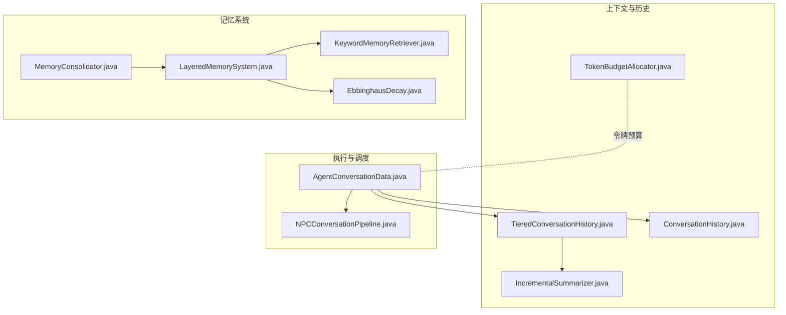
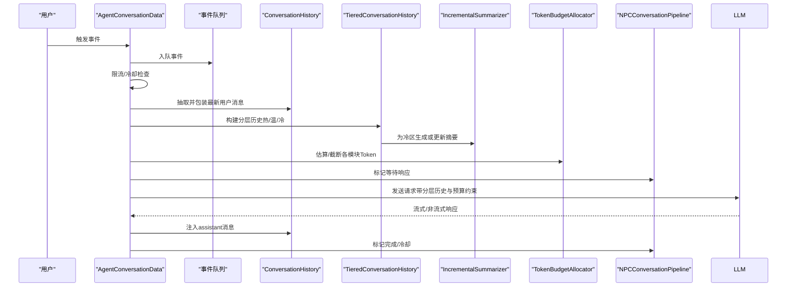
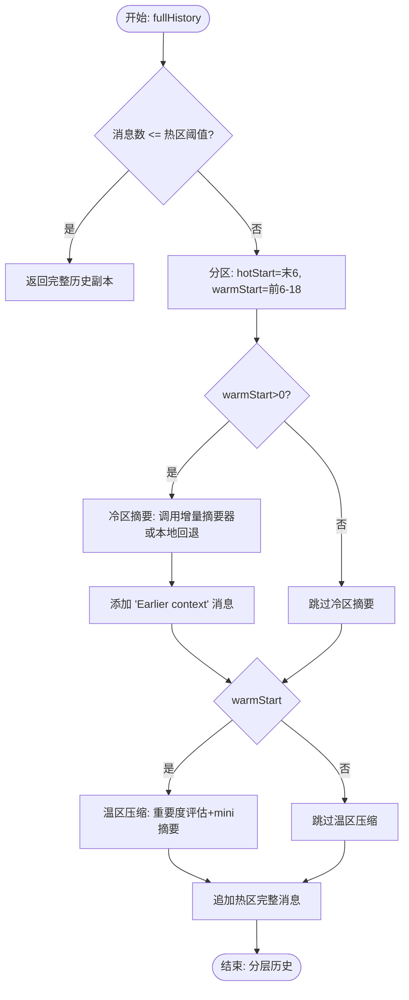
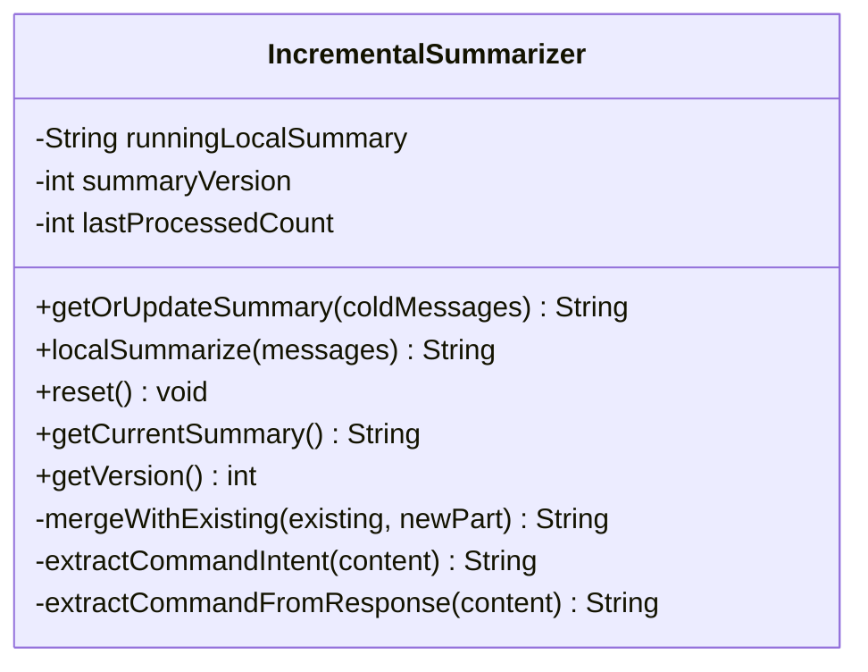
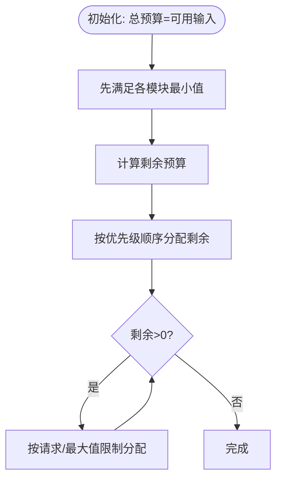
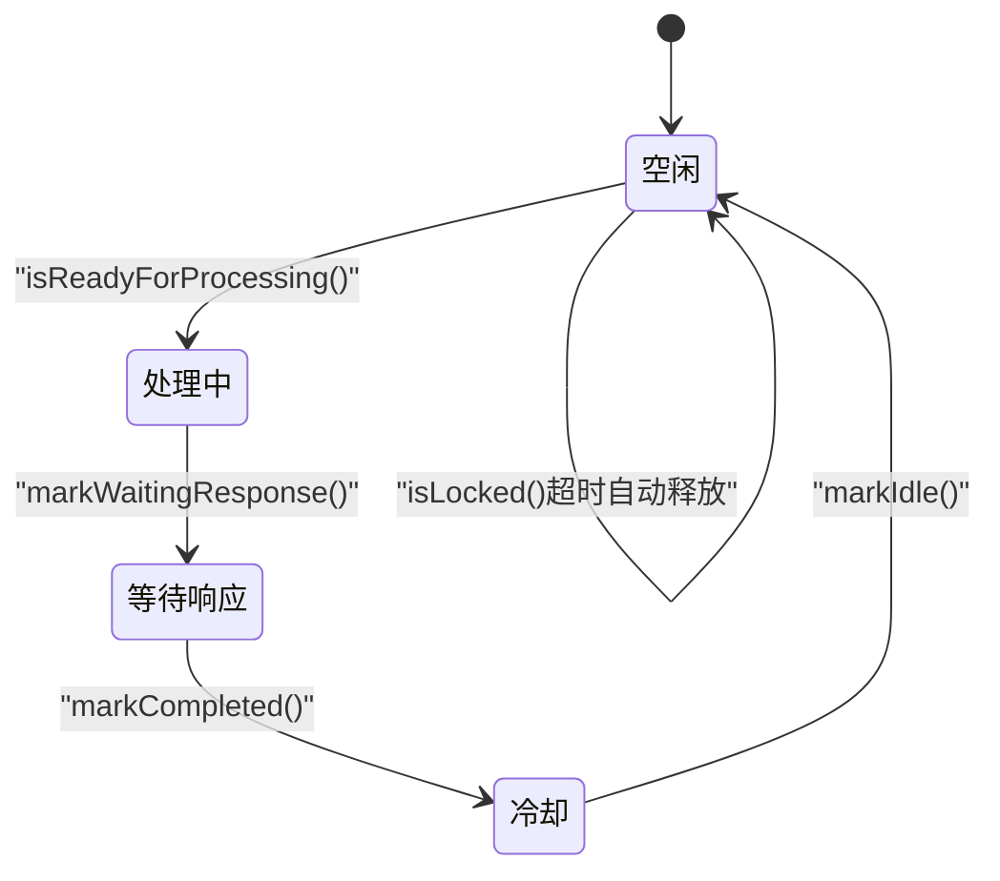
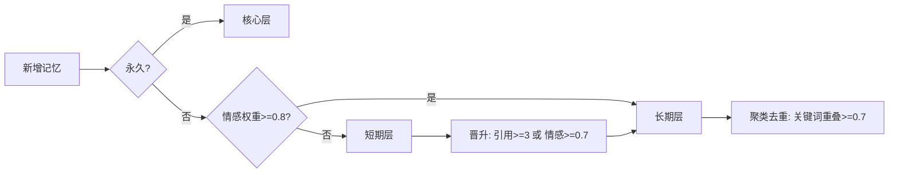
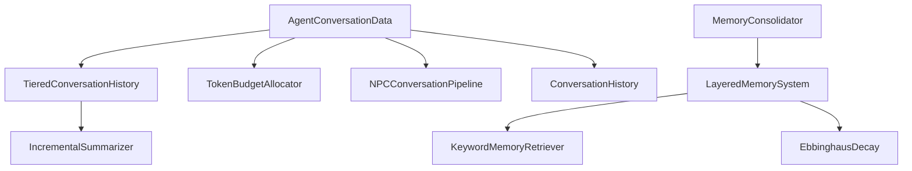

# 对话历史管理

<cite>
**本文档引用的文件**
- [TieredConversationHistory.java](file://src/main/java/adris/altoclef/player2api/context/TieredConversationHistory.java)
- [IncrementalSummarizer.java](file://src/main/java/adris/altoclef/player2api/context/IncrementalSummarizer.java)
- [TokenBudgetAllocator.java](file://src/main/java/adris/altoclef/player2api/context/TokenBudgetAllocator.java)
- [ConversationHistory.java](file://src/main/java/adris/altoclef/player2api/ConversationHistory.java)
- [AgentConversationData.java](file://src/main/java/adris/altoclef/player2api/AgentConversationData.java)
- [NPCConversationPipeline.java](file://src/main/java/adris/altoclef/player2api/NPCConversationPipeline.java)
- [LayeredMemorySystem.java](file://src/main/java/adris/altoclef/player2api/memory/LayeredMemorySystem.java)
- [MemoryConsolidator.java](file://src/main/java/adris/altoclef/player2api/memory/MemoryConsolidator.java)
- [KeywordMemoryRetriever.java](file://src/main/java/adris/altoclef/player2api/memory/KeywordMemoryRetriever.java)
- [EbbinghausDecay.java](file://src/main/java/adris/altoclef/player2api/memory/EbbinghausDecay.java)
</cite>

## 目录
1. [简介](#简介)
2. [项目结构](#项目结构)
3. [核心组件](#核心组件)
4. [架构总览](#架构总览)
5. [详细组件分析](#详细组件分析)
6. [依赖关系分析](#依赖关系分析)
7. [性能考量](#性能考量)
8. [故障排查指南](#故障排查指南)
9. [结论](#结论)
10. [附录](#附录)

## 简介
本文件面向对话历史管理子系统，聚焦以下三个关键技术构件：
- TieredConversationHistory：层级化历史管理，将对话历史划分为热区、温区、冷区三层，分别采用完整保留、压缩摘要、强摘要策略，结合增量摘要器实现高效的历史压缩与上下文注入。
- IncrementalSummarizer：增量摘要机制，对冷区历史进行“新增即摘要”，避免全量重算，支持本地摘要保底与可选的高质量摘要合并。
- TokenBudgetAllocator：令牌预算分配策略，依据模型上下文窗口与模块优先级，动态分配输入侧各模块的可用Token，提供估算与截断能力。

同时，文档补充了与之协同的记忆系统（短期/中期/长期）与对话管道（并发控制与冷却）相关内容，帮助读者全面理解从“输入到输出”的端到端流程。

## 项目结构
围绕对话历史管理的关键文件组织如下：
- 上下文与历史：TieredConversationHistory、IncrementalSummarizer、TokenBudgetAllocator、ConversationHistory
- 对话执行与调度：AgentConversationData、NPCConversationPipeline
- 记忆系统：LayeredMemorySystem、MemoryConsolidator、KeywordMemoryRetriever、EbbinghausDecay

**图表来源**
- [TieredConversationHistory.java:1-178](file://src/main/java/adris/altoclef/player2api/context/TieredConversationHistory.java#L1-L178)
- [IncrementalSummarizer.java:1-159](file://src/main/java/adris/altoclef/player2api/context/IncrementalSummarizer.java#L1-L159)
- [TokenBudgetAllocator.java:1-152](file://src/main/java/adris/altoclef/player2api/context/TokenBudgetAllocator.java#L1-L152)
- [ConversationHistory.java:1-299](file://src/main/java/adris/altoclef/player2api/ConversationHistory.java#L1-L299)
- [AgentConversationData.java:1-657](file://src/main/java/adris/altoclef/player2api/AgentConversationData.java#L1-L657)
- [NPCConversationPipeline.java:1-194](file://src/main/java/adris/altoclef/player2api/NPCConversationPipeline.java#L1-L194)
- [LayeredMemorySystem.java:1-172](file://src/main/java/adris/altoclef/player2api/memory/LayeredMemorySystem.java#L1-L172)
- [MemoryConsolidator.java:1-119](file://src/main/java/adris/altoclef/player2api/memory/MemoryConsolidator.java#L1-L119)
- [KeywordMemoryRetriever.java:1-142](file://src/main/java/adris/altoclef/player2api/memory/KeywordMemoryRetriever.java#L1-L142)
- [EbbinghausDecay.java:1-66](file://src/main/java/adris/altoclef/player2api/memory/EbbinghausDecay.java#L1-L66)

**章节来源**
- [TieredConversationHistory.java:1-178](file://src/main/java/adris/altoclef/player2api/context/TieredConversationHistory.java#L1-L178)
- [IncrementalSummarizer.java:1-159](file://src/main/java/adris/altoclef/player2api/context/IncrementalSummarizer.java#L1-L159)
- [TokenBudgetAllocator.java:1-152](file://src/main/java/adris/altoclef/player2api/context/TokenBudgetAllocator.java#L1-L152)
- [ConversationHistory.java:1-299](file://src/main/java/adris/altoclef/player2api/ConversationHistory.java#L1-L299)
- [AgentConversationData.java:1-657](file://src/main/java/adris/altoclef/player2api/AgentConversationData.java#L1-L657)
- [NPCConversationPipeline.java:1-194](file://src/main/java/adris/altoclef/player2api/NPCConversationPipeline.java#L1-L194)
- [LayeredMemorySystem.java:1-172](file://src/main/java/adris/altoclef/player2api/memory/LayeredMemorySystem.java#L1-L172)
- [MemoryConsolidator.java:1-119](file://src/main/java/adris/altoclef/player2api/memory/MemoryConsolidator.java#L1-L119)
- [KeywordMemoryRetriever.java:1-142](file://src/main/java/adris/altoclef/player2api/memory/KeywordMemoryRetriever.java#L1-L142)
- [EbbinghausDecay.java:1-66](file://src/main/java/adris/altoclef/player2api/memory/EbbinghausDecay.java#L1-L66)

## 核心组件
- TieredConversationHistory：定义三层窗口（热区6、温区12、冷区≥18），通过消息重要度评估与分区压缩策略，生成分层历史；冷区使用增量摘要器生成“Earlier context”摘要注入。
- IncrementalSummarizer：维护运行时摘要与版本，仅对新增冷区消息进行增量本地摘要，并与已有摘要合并，限制最大长度，提供重置接口。
- TokenBudgetAllocator：基于模型上下文窗口与安全余量，为九个模块设定最小/最大Token范围，先满足最小值，再按优先级分配剩余预算，提供Token估算与二分截断。

**章节来源**
- [TieredConversationHistory.java:13-109](file://src/main/java/adris/altoclef/player2api/context/TieredConversationHistory.java#L13-L109)
- [IncrementalSummarizer.java:14-42](file://src/main/java/adris/altoclef/player2api/context/IncrementalSummarizer.java#L14-L42)
- [TokenBudgetAllocator.java:11-95](file://src/main/java/adris/altoclef/player2api/context/TokenBudgetAllocator.java#L11-L95)

## 架构总览
下图展示了从事件入队到LLM请求、再到响应处理与历史注入的端到端流程，以及与历史压缩、令牌预算、记忆系统的协作关系。

**图表来源**
- [AgentConversationData.java:112-297](file://src/main/java/adris/altoclef/player2api/AgentConversationData.java#L112-L297)
- [TieredConversationHistory.java:66-109](file://src/main/java/adris/altoclef/player2api/context/TieredConversationHistory.java#L66-L109)
- [IncrementalSummarizer.java:25-42](file://src/main/java/adris/altoclef/player2api/context/IncrementalSummarizer.java#L25-L42)
- [TokenBudgetAllocator.java:51-95](file://src/main/java/adris/altoclef/player2api/context/TokenBudgetAllocator.java#L51-L95)
- [NPCConversationPipeline.java:137-178](file://src/main/java/adris/altoclef/player2api/NPCConversationPipeline.java#L137-L178)

## 详细组件分析

### TieredConversationHistory 层级化历史管理
- 三层窗口与分区
  - 热区：最近6条，完整保留，保证对即时上下文的高保真。
  - 温区：前6-18条，按重要度保留，将NORMAL消息压缩为mini摘要，丢弃LOW消息。
  - 冷区：前18+条，使用增量摘要器生成“Earlier context: ...”摘要注入，作为系统提示。
- 消息重要度评估
  - 关键词触发（如“记住/别忘/remember”）、包含命令执行结果、系统状态消息、bodylang反馈、实质性用户/助手消息等规则综合判定。
- 压缩与摘要
  - 温区压缩：CRITICAL/HIGH完整保留，NORMAL聚合成mini摘要，LOW丢弃。
  - 冷区摘要：优先使用增量摘要器，否则回退到本地摘要（拼接用户发言片段）。
- 返回结构
  - 结果顺序为：冷区摘要（如有）、温区压缩结果、热区完整消息。

**图表来源**
- [TieredConversationHistory.java:66-109](file://src/main/java/adris/altoclef/player2api/context/TieredConversationHistory.java#L66-L109)
- [TieredConversationHistory.java:114-139](file://src/main/java/adris/altoclef/player2api/context/TieredConversationHistory.java#L114-L139)
- [TieredConversationHistory.java:166-176](file://src/main/java/adris/altoclef/player2api/context/TieredConversationHistory.java#L166-L176)

**章节来源**
- [TieredConversationHistory.java:13-178](file://src/main/java/adris/altoclef/player2api/context/TieredConversationHistory.java#L13-L178)

### IncrementalSummarizer 增量摘要机制
- 增量策略
  - 仅处理新增冷区消息（基于上次处理计数），避免全量重算。
  - 本地摘要：抽取用户“意图”与助手“执行命令”，限制单次摘要长度，合并至运行时摘要。
- 关键信息提取
  - 用户消息：从可能包裹的JSON中提取原始userMessage字段，截取前50字符。
  - 助手消息：尝试提取JSON中的command字段，若非摘要文本则截取前30字符。
- 合并与长度控制
  - 运行时摘要与新片段合并，超过最大长度（约500token对应字符上限）时采用后截断策略。
- 版本与重置
  - 维护版本号与处理计数，支持重置以适配新的对话轮次。

**图表来源**
- [IncrementalSummarizer.java:12-159](file://src/main/java/adris/altoclef/player2api/context/IncrementalSummarizer.java#L12-L159)

**章节来源**
- [IncrementalSummarizer.java:14-159](file://src/main/java/adris/altoclef/player2api/context/IncrementalSummarizer.java#L14-L159)

### TokenBudgetAllocator 令牌预算分配策略
- 预算构成
  - 模型上下文窗口（qwen-turbo）：8192
  - 输出预留：800；安全余量：200
  - 可用输入预算：7192
- 模块优先级与范围
  - 核心规则、命令列表、人格描述、灵魂状态、历史摘要、锚定消息、对话历史、当前状态注入
  - 先满足各模块最小值，剩余按优先级（对话历史优先）分配，不超过最大值
- 估算与截断
  - 提供简易估算（中英混合）与二分查找截断，确保文本不超过预算

**图表来源**
- [TokenBudgetAllocator.java:51-95](file://src/main/java/adris/altoclef/player2api/context/TokenBudgetAllocator.java#L51-L95)
- [TokenBudgetAllocator.java:108-143](file://src/main/java/adris/altoclef/player2api/context/TokenBudgetAllocator.java#L108-L143)

**章节来源**
- [TokenBudgetAllocator.java:11-152](file://src/main/java/adris/altoclef/player2api/context/TokenBudgetAllocator.java#L11-L152)

### 与对话执行与调度的集成
- AgentConversationData
  - 事件队列与限流：最小响应间隔3秒，避免LLM刷屏；处理超时60秒自动恢复。
  - 强制响应拦截：针对救援/攻击/召唤等关键字，绕过LLM直接生成响应。
  - 场景化提示：将世界状态、代理状态、调试消息与提醒注入到最新用户消息中。
  - LLM调用：通过流式回调处理响应，注入assistant消息并触发后续副作用。
- NPCConversationPipeline
  - 状态机：IDLE/PROCESSING/WAITING_RESPONSE/COOLDOWN
  - 并发控制：每NPC独立锁，避免全局阻塞；超时自动释放；冷却期保障稳定性

**图表来源**
- [NPCConversationPipeline.java:41-186](file://src/main/java/adris/altoclef/player2api/NPCConversationPipeline.java#L41-L186)
- [AgentConversationData.java:112-297](file://src/main/java/adris/altoclef/player2api/AgentConversationData.java#L112-L297)

**章节来源**
- [AgentConversationData.java:86-297](file://src/main/java/adris/altoclef/player2api/AgentConversationData.java#L86-L297)
- [NPCConversationPipeline.java:14-194](file://src/main/java/adris/altoclef/player2api/NPCConversationPipeline.java#L14-L194)

### 记忆系统与历史管理的协同
- 分层记忆（短期/中期/长期）
  - 自动分层：永久记忆→长期→短期；情感权重高→长期；否则→短期
  - 晋升：短期中被多次引用或高情感权重的记忆晋升为长期
  - 选择：核心记忆全量注入，长期Top-N，短期按时效性补足
- 记忆聚类与去重
  - 基于关键词重叠（Jaccard）聚类，合并相似记忆并提升情感权重与引用次数
- 关键词检索
  - 提取中文分词与英文关键词，计算重叠度，结合情感权重与时效性评分
- 遗忘曲线
  - 艾宾浩斯模型：R = e^(-t/S)，S受情感权重与引用次数影响；低于阈值（默认2%）视为遗忘

**图表来源**
- [LayeredMemorySystem.java:30-96](file://src/main/java/adris/altoclef/player2api/memory/LayeredMemorySystem.java#L30-L96)
- [MemoryConsolidator.java:19-44](file://src/main/java/adris/altoclef/player2api/memory/MemoryConsolidator.java#L19-L44)
- [KeywordMemoryRetriever.java:79-105](file://src/main/java/adris/altoclef/player2api/memory/KeywordMemoryRetriever.java#L79-L105)
- [EbbinghausDecay.java:17-49](file://src/main/java/adris/altoclef/player2api/memory/EbbinghausDecay.java#L17-L49)

**章节来源**
- [LayeredMemorySystem.java:10-172](file://src/main/java/adris/altoclef/player2api/memory/LayeredMemorySystem.java#L10-L172)
- [MemoryConsolidator.java:9-119](file://src/main/java/adris/altoclef/player2api/memory/MemoryConsolidator.java#L9-L119)
- [KeywordMemoryRetriever.java:7-142](file://src/main/java/adris/altoclef/player2api/memory/KeywordMemoryRetriever.java#L7-L142)
- [EbbinghausDecay.java:5-66](file://src/main/java/adris/altoclef/player2api/memory/EbbinghausDecay.java#L5-L66)

## 依赖关系分析
- TieredConversationHistory 依赖 IncrementalSummarizer（可选）与消息对象（JSON结构）。
- IncrementalSummarizer 与 TokenBudgetAllocator 无直接耦合，但共同服务于对话历史的“压缩/估算”目标。
- AgentConversationData 串联事件队列、历史包装、分层历史构建、令牌预算估算与LLM调用。
- NPCConversationPipeline 为AgentConversationData提供并发与冷却控制。
- 记忆系统与历史管理解耦，但可为Prompt注入提供上下文支撑。

**图表来源**
- [AgentConversationData.java:112-297](file://src/main/java/adris/altoclef/player2api/AgentConversationData.java#L112-L297)
- [TieredConversationHistory.java:66-109](file://src/main/java/adris/altoclef/player2api/context/TieredConversationHistory.java#L66-L109)
- [IncrementalSummarizer.java:25-42](file://src/main/java/adris/altoclef/player2api/context/IncrementalSummarizer.java#L25-L42)
- [TokenBudgetAllocator.java:51-95](file://src/main/java/adris/altoclef/player2api/context/TokenBudgetAllocator.java#L51-L95)
- [NPCConversationPipeline.java:137-178](file://src/main/java/adris/altoclef/player2api/NPCConversationPipeline.java#L137-L178)
- [LayeredMemorySystem.java:100-129](file://src/main/java/adris/altoclef/player2api/memory/LayeredMemorySystem.java#L100-L129)
- [MemoryConsolidator.java:19-44](file://src/main/java/adris/altoclef/player2api/memory/MemoryConsolidator.java#L19-L44)
- [KeywordMemoryRetriever.java:79-105](file://src/main/java/adris/altoclef/player2api/memory/KeywordMemoryRetriever.java#L79-L105)
- [EbbinghausDecay.java:38-49](file://src/main/java/adris/altoclef/player2api/memory/EbbinghausDecay.java#L38-L49)

**章节来源**
- [AgentConversationData.java:112-297](file://src/main/java/adris/altoclef/player2api/AgentConversationData.java#L112-L297)
- [TieredConversationHistory.java:66-109](file://src/main/java/adris/altoclef/player2api/context/TieredConversationHistory.java#L66-L109)
- [IncrementalSummarizer.java:25-42](file://src/main/java/adris/altoclef/player2api/context/IncrementalSummarizer.java#L25-L42)
- [TokenBudgetAllocator.java:51-95](file://src/main/java/adris/altoclef/player2api/context/TokenBudgetAllocator.java#L51-L95)
- [NPCConversationPipeline.java:137-178](file://src/main/java/adris/altoclef/player2api/NPCConversationPipeline.java#L137-L178)
- [LayeredMemorySystem.java:100-129](file://src/main/java/adris/altoclef/player2api/memory/LayeredMemorySystem.java#L100-L129)
- [MemoryConsolidator.java:19-44](file://src/main/java/adris/altoclef/player2api/memory/MemoryConsolidator.java#L19-L44)
- [KeywordMemoryRetriever.java:79-105](file://src/main/java/adris/altoclef/player2api/memory/KeywordMemoryRetriever.java#L79-L105)
- [EbbinghausDecay.java:38-49](file://src/main/java/adris/altoclef/player2api/memory/EbbinghausDecay.java#L38-L49)

## 性能考量
- 增量摘要
  - 仅处理新增冷区消息，避免全量重算；本地摘要零LLM调用，失败率低。
- 分层压缩
  - 温区mini摘要与LOW消息丢弃，显著降低上下文长度。
- 令牌预算
  - 先满足最小值，再按优先级分配，确保关键模块（对话历史、当前状态）优先；提供二分截断，避免超长导致的重试成本。
- 并发与冷却
  - 每NPC独立锁与冷却期，避免LLM刷屏与全局阻塞；超时自动释放，提高鲁棒性。
- 记忆系统
  - 关键词检索<1ms延迟；聚类去重减少冗余；艾宾浩斯遗忘曲线真实模拟记忆衰减。

[本节为通用指导，无需特定文件引用]

## 故障排查指南
- LLM响应超时
  - 现象：等待响应锁超时（默认30秒），自动释放并恢复空闲。
  - 排查：检查网络与服务端负载；确认冷却期已过。
  - 参考
    - [NPCConversationPipeline.java:94-105](file://src/main/java/adris/altoclef/player2api/NPCConversationPipeline.java#L94-L105)
- LLM响应间隔过快
  - 现象：最小响应间隔（默认3秒）内重复触发。
  - 排查：检查上游事件频率与业务逻辑；适当放宽间隔。
  - 参考
    - [AgentConversationData.java:127-133](file://src/main/java/adris/altoclef/player2api/AgentConversationData.java#L127-L133)
- 冷区摘要为空
  - 现象：冷区摘要为空字符串，回退为本地摘要。
  - 排查：确认增量摘要器是否正确处理；检查消息格式（JSON包裹）。
  - 参考
    - [TieredConversationHistory.java:84-89](file://src/main/java/adris/altoclef/player2api/context/TieredConversationHistory.java#L84-L89)
    - [IncrementalSummarizer.java:25-42](file://src/main/java/adris/altoclef/player2api/context/IncrementalSummarizer.java#L25-L42)
- 令牌超限
  - 现象：上下文过长导致截断或失败。
  - 排查：使用估算方法评估长度；必要时降低模块分配或缩短文本。
  - 参考
    - [TokenBudgetAllocator.java:108-143](file://src/main/java/adris/altoclef/player2api/context/TokenBudgetAllocator.java#L108-L143)
- 记忆过多或重复
  - 现象：长期层容量上限导致淘汰或冗余。
  - 排查：启用聚类去重；检查情感权重与时效性评分。
  - 参考
    - [LayeredMemorySystem.java:50-70](file://src/main/java/adris/altoclef/player2api/memory/LayeredMemorySystem.java#L50-L70)
    - [MemoryConsolidator.java:19-44](file://src/main/java/adris/altoclef/player2api/memory/MemoryConsolidator.java#L19-L44)

**章节来源**
- [NPCConversationPipeline.java:94-105](file://src/main/java/adris/altoclef/player2api/NPCConversationPipeline.java#L94-L105)
- [AgentConversationData.java:127-133](file://src/main/java/adris/altoclef/player2api/AgentConversationData.java#L127-L133)
- [TieredConversationHistory.java:84-89](file://src/main/java/adris/altoclef/player2api/context/TieredConversationHistory.java#L84-L89)
- [IncrementalSummarizer.java:25-42](file://src/main/java/adris/altoclef/player2api/context/IncrementalSummarizer.java#L25-L42)
- [TokenBudgetAllocator.java:108-143](file://src/main/java/adris/altoclef/player2api/context/TokenBudgetAllocator.java#L108-L143)
- [LayeredMemorySystem.java:50-70](file://src/main/java/adris/altoclef/player2api/memory/LayeredMemorySystem.java#L50-L70)
- [MemoryConsolidator.java:19-44](file://src/main/java/adris/altoclef/player2api/memory/MemoryConsolidator.java#L19-L44)

## 结论
本系统通过“分层历史+增量摘要+令牌预算”的组合拳，在保证上下文完整性的同时，有效控制了上下文长度与计算开销。配合每NPC独立的对话管道与记忆系统的关键词检索、聚类去重与艾宾浩斯遗忘模型，实现了稳定、高效且具备长期记忆能力的对话历史管理方案。建议在生产环境中：
- 根据实际模型上下文窗口与业务需求调整三层阈值与模块预算；
- 在消息格式复杂（JSON包裹）时，确保增量摘要器的解析健壮性；
- 结合记忆系统为Prompt注入关键上下文，进一步提升对话质量与一致性。

[本节为总结性内容，无需特定文件引用]

## 附录

### 实现要点与最佳实践
- 分层存储
  - 将近期高频交互放入热区，中等重要度放入温区，远期历史放入冷区并通过摘要注入。
  - 参考
    - [TieredConversationHistory.java:13-109](file://src/main/java/adris/altoclef/player2api/context/TieredConversationHistory.java#L13-L109)
- 增量摘要处理
  - 仅对新增冷区消息进行摘要，避免重复计算；本地摘要作为保底，确保稳定性。
  - 参考
    - [IncrementalSummarizer.java:25-42](file://src/main/java/adris/altoclef/player2api/context/IncrementalSummarizer.java#L25-L42)
- 令牌使用效率优化
  - 先满足最小值，再按优先级分配；使用二分截断确保不超限。
  - 参考
    - [TokenBudgetAllocator.java:51-95](file://src/main/java/adris/altoclef/player2api/context/TokenBudgetAllocator.java#L51-L95)
    - [TokenBudgetAllocator.java:128-143](file://src/main/java/adris/altoclef/player2api/context/TokenBudgetAllocator.java#L128-L143)
- 历史数据注入
  - 将世界状态、代理状态、调试消息与提醒整合进最新用户消息，提升LLM决策质量。
  - 参考
    - [AgentConversationData.java:240-242](file://src/main/java/adris/altoclef/player2api/AgentConversationData.java#L240-L242)
    - [ConversationHistory.java:238-267](file://src/main/java/adris/altoclef/player2api/ConversationHistory.java#L238-L267)
- 并发与稳定性
  - 每NPC独立锁与冷却期，避免全局阻塞与刷屏；超时自动释放。
  - 参考
    - [NPCConversationPipeline.java:137-178](file://src/main/java/adris/altoclef/player2api/NPCConversationPipeline.java#L137-L178)

**章节来源**
- [TieredConversationHistory.java:13-109](file://src/main/java/adris/altoclef/player2api/context/TieredConversationHistory.java#L13-L109)
- [IncrementalSummarizer.java:25-42](file://src/main/java/adris/altoclef/player2api/context/IncrementalSummarizer.java#L25-L42)
- [TokenBudgetAllocator.java:51-95](file://src/main/java/adris/altoclef/player2api/context/TokenBudgetAllocator.java#L51-L95)
- [TokenBudgetAllocator.java:128-143](file://src/main/java/adris/altoclef/player2api/context/TokenBudgetAllocator.java#L128-L143)
- [AgentConversationData.java:240-242](file://src/main/java/adris/altoclef/player2api/AgentConversationData.java#L240-L242)
- [ConversationHistory.java:238-267](file://src/main/java/adris/altoclef/player2api/ConversationHistory.java#L238-L267)
- [NPCConversationPipeline.java:137-178](file://src/main/java/adris/altoclef/player2api/NPCConversationPipeline.java#L137-L178)