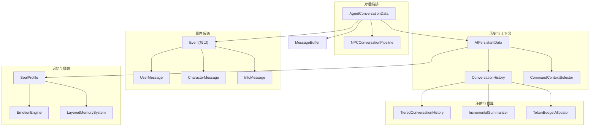
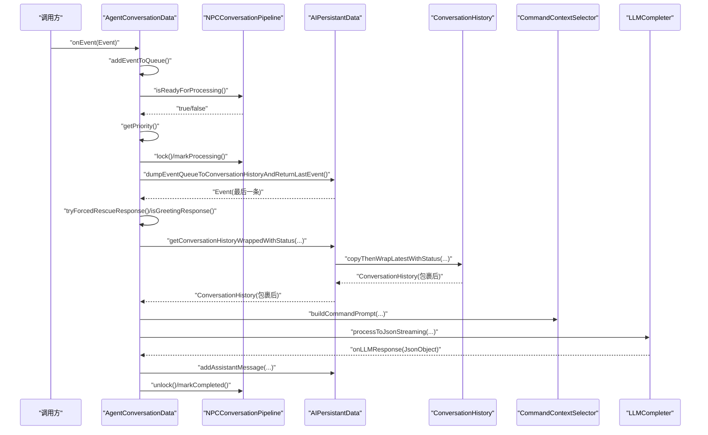
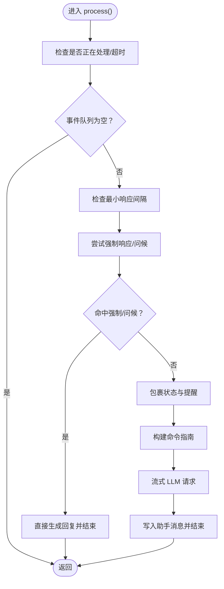
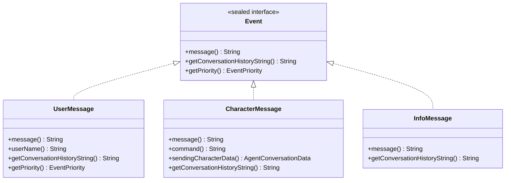
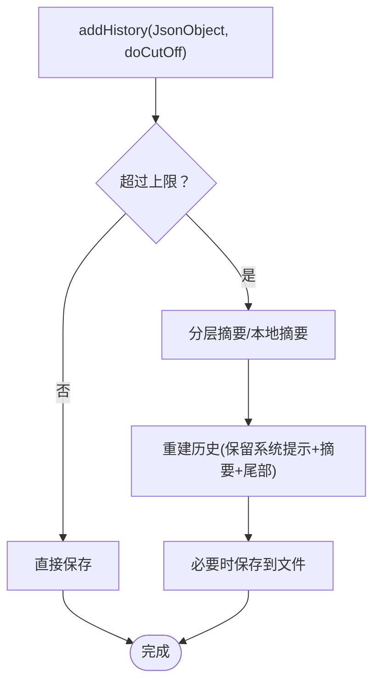
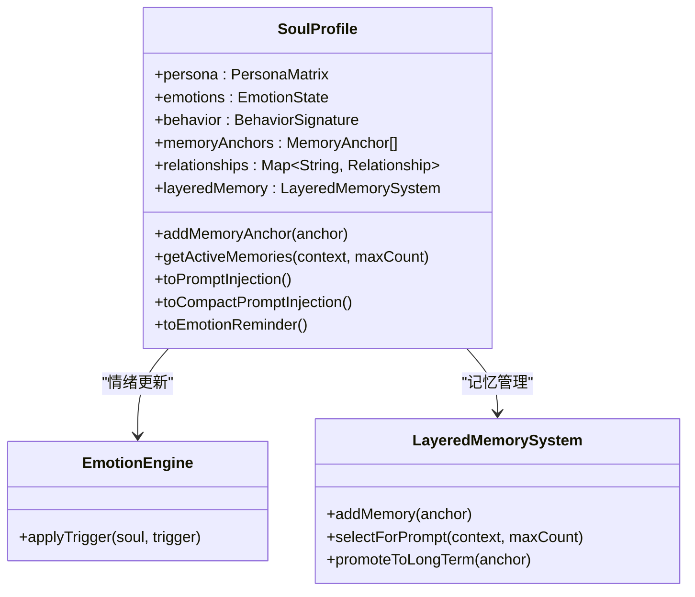
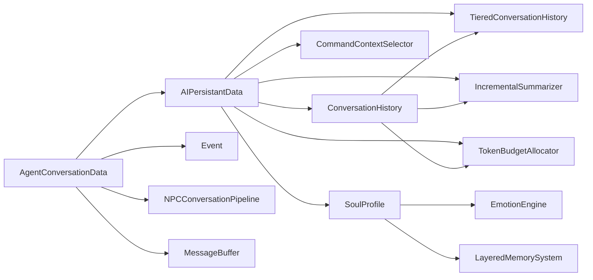

# 对话数据封装

<cite>
**本文档引用的文件**
- [AgentConversationData.java](file://src/main/java/adris/altoclef/player2api/AgentConversationData.java)
- [Event.java](file://src/main/java/adris/altoclef/player2api/Event.java)
- [ConversationHistory.java](file://src/main/java/adris/altoclef/player2api/ConversationHistory.java)
- [AIPersistantData.java](file://src/main/java/adris/altoclef/player2api/AIPersistantData.java)
- [NPCConversationPipeline.java](file://src/main/java/adris/altoclef/player2api/NPCConversationPipeline.java)
- [MessageBuffer.java](file://src/main/java/adris/altoclef/player2api/MessageBuffer.java)
- [SoulProfile.java](file://src/main/java/adris/altoclef/player2api/soul/SoulProfile.java)
- [EmotionEngine.java](file://src/main/java/adris/altoclef/player2api/soul/EmotionEngine.java)
- [LayeredMemorySystem.java](file://src/main/java/adris/altoclef/player2api/memory/LayeredMemorySystem.java)
- [CommandContextSelector.java](file://src/main/java/adris/altoclef/player2api/context/CommandContextSelector.java)
- [TieredConversationHistory.java](file://src/main/java/adris/altoclef/player2api/context/TieredConversationHistory.java)
- [IncrementalSummarizer.java](file://src/main/java/adris/altoclef/player2api/context/IncrementalSummarizer.java)
- [TokenBudgetAllocator.java](file://src/main/java/adris/altoclef/player2api/context/TokenBudgetAllocator.java)
</cite>

## 目录
1. [简介](#简介)
2. [项目结构](#项目结构)
3. [核心组件](#核心组件)
4. [架构总览](#架构总览)
5. [详细组件分析](#详细组件分析)
6. [依赖关系分析](#依赖关系分析)
7. [性能考量](#性能考量)
8. [故障排查指南](#故障排查指南)
9. [结论](#结论)
10. [附录](#附录)

## 简介
本文件围绕“对话数据封装”主题，系统梳理并深入解析以下内容：
- AgentConversationData 的设计架构与职责边界，包括对话状态管理、消息历史存储、NPC 属性绑定、事件队列与处理流程。
- Event 类型系统的设计，涵盖 UserMessage、CharacterMessage、InfoMessage 的语义与优先级机制。
- 对话历史的存储策略，包括短期记忆、长期记忆、情感状态对对话数据的影响。
- 数据序列化与反序列化的实现路径与注意事项。
- 扩展方法与自定义策略的实践指导。

## 项目结构
对话数据封装相关的核心代码位于 player2api 子包及其子模块中，主要由以下层次构成：
- 顶层对话编排：AgentConversationData、NPCConversationPipeline
- 事件类型系统：Event 接口及三种消息记录
- 历史与上下文：ConversationHistory、AIPersistantData、CommandContextSelector
- 记忆与情感：SoulProfile、EmotionEngine、LayeredMemorySystem
- 历史压缩与预算：TieredConversationHistory、IncrementalSummarizer、TokenBudgetAllocator
- 辅助缓冲：MessageBuffer

**图表来源**
- [AgentConversationData.java:33-657](file://src/main/java/adris/altoclef/player2api/AgentConversationData.java#L33-L657)
- [Event.java:3-65](file://src/main/java/adris/altoclef/player2api/Event.java#L3-L65)
- [ConversationHistory.java:16-299](file://src/main/java/adris/altoclef/player2api/ConversationHistory.java#L16-L299)
- [AIPersistantData.java:24-149](file://src/main/java/adris/altoclef/player2api/AIPersistantData.java#L24-L149)
- [NPCConversationPipeline.java:14-194](file://src/main/java/adris/altoclef/player2api/NPCConversationPipeline.java#L14-L194)
- [MessageBuffer.java:5-36](file://src/main/java/adris/altoclef/player2api/MessageBuffer.java#L5-L36)
- [SoulProfile.java:15-226](file://src/main/java/adris/altoclef/player2api/soul/SoulProfile.java#L15-L226)
- [EmotionEngine.java:11-184](file://src/main/java/adris/altoclef/player2api/soul/EmotionEngine.java#L11-L184)
- [LayeredMemorySystem.java:10-172](file://src/main/java/adris/altoclef/player2api/memory/LayeredMemorySystem.java#L10-L172)
- [CommandContextSelector.java:5-171](file://src/main/java/adris/altoclef/player2api/context/CommandContextSelector.java#L5-L171)
- [TieredConversationHistory.java:9-178](file://src/main/java/adris/altoclef/player2api/context/TieredConversationHistory.java#L9-L178)
- [IncrementalSummarizer.java:12-159](file://src/main/java/adris/altoclef/player2api/context/IncrementalSummarizer.java#L12-L159)
- [TokenBudgetAllocator.java:9-152](file://src/main/java/adris/altoclef/player2api/context/TokenBudgetAllocator.java#L9-L152)

**章节来源**
- [AgentConversationData.java:33-657](file://src/main/java/adris/altoclef/player2api/AgentConversationData.java#L33-L657)
- [Event.java:3-65](file://src/main/java/adris/altoclef/player2api/Event.java#L3-L65)
- [ConversationHistory.java:16-299](file://src/main/java/adris/altoclef/player2api/ConversationHistory.java#L16-L299)
- [AIPersistantData.java:24-149](file://src/main/java/adris/altoclef/player2api/AIPersistantData.java#L24-L149)
- [NPCConversationPipeline.java:14-194](file://src/main/java/adris/altoclef/player2api/NPCConversationPipeline.java#L14-L194)
- [MessageBuffer.java:5-36](file://src/main/java/adris/altoclef/player2api/MessageBuffer.java#L5-L36)
- [SoulProfile.java:15-226](file://src/main/java/adris/altoclef/player2api/soul/SoulProfile.java#L15-L226)
- [EmotionEngine.java:11-184](file://src/main/java/adris/altoclef/player2api/soul/EmotionEngine.java#L11-L184)
- [LayeredMemorySystem.java:10-172](file://src/main/java/adris/altoclef/player2api/memory/LayeredMemorySystem.java#L10-L172)
- [CommandContextSelector.java:5-171](file://src/main/java/adris/altoclef/player2api/context/CommandContextSelector.java#L5-L171)
- [TieredConversationHistory.java:9-178](file://src/main/java/adris/altoclef/player2api/context/TieredConversationHistory.java#L9-L178)
- [IncrementalSummarizer.java:12-159](file://src/main/java/adris/altoclef/player2api/context/IncrementalSummarizer.java#L12-L159)
- [TokenBudgetAllocator.java:9-152](file://src/main/java/adris/altoclef/player2api/context/TokenBudgetAllocator.java#L9-L152)

## 核心组件
- AgentConversationData：负责事件队列管理、对话优先级计算、强制响应与问候逻辑、LLM 请求构建与回调、情绪提醒注入、自动反馈与自动给予等。
- Event 类型系统：以密封接口 Event 为核心，提供 UserMessage、CharacterMessage、InfoMessage 三类消息记录，支持优先级判定与历史字符串格式化。
- ConversationHistory：维护对话历史列表，支持文件持久化、分层摘要、本地回退摘要、系统提示词注入、状态包裹与截断。
- AIPersistantData：持有 ConversationHistory、Character、SoulProfile，并负责历史转存、状态包裹、系统提示词更新与分层压缩。
- NPCConversationPipeline：为每个 NPC 维护独立的对话管道状态机，实现 per-NPC 锁、等待响应、冷却与调度控制。
- MessageBuffer：轻量消息缓冲，用于向对话历史注入系统调试信息。
- SoulProfile 与 EmotionEngine：提供人格矩阵、情绪状态、行为签名、记忆锚点与关系图谱，并根据事件触发器更新情绪与关系。
- LayeredMemorySystem：分层记忆系统，按核心/长期/短期三层组织记忆锚点，支持晋升与淘汰。
- CommandContextSelector：根据用户消息、世界状态与代理状态推断场景，动态构建命令提示词。
- TieredConversationHistory、IncrementalSummarizer、TokenBudgetAllocator：历史分层压缩、增量摘要与 Token 预算分配，保障上下文窗口与性能。

**章节来源**
- [AgentConversationData.java:33-657](file://src/main/java/adris/altoclef/player2api/AgentConversationData.java#L33-L657)
- [Event.java:3-65](file://src/main/java/adris/altoclef/player2api/Event.java#L3-L65)
- [ConversationHistory.java:16-299](file://src/main/java/adris/altoclef/player2api/ConversationHistory.java#L16-L299)
- [AIPersistantData.java:24-149](file://src/main/java/adris/altoclef/player2api/AIPersistantData.java#L24-L149)
- [NPCConversationPipeline.java:14-194](file://src/main/java/adris/altoclef/player2api/NPCConversationPipeline.java#L14-L194)
- [MessageBuffer.java:5-36](file://src/main/java/adris/altoclef/player2api/MessageBuffer.java#L5-L36)
- [SoulProfile.java:15-226](file://src/main/java/adris/altoclef/player2api/soul/SoulProfile.java#L15-L226)
- [EmotionEngine.java:11-184](file://src/main/java/adris/altoclef/player2api/soul/EmotionEngine.java#L11-L184)
- [LayeredMemorySystem.java:10-172](file://src/main/java/adris/altoclef/player2api/memory/LayeredMemorySystem.java#L10-L172)
- [CommandContextSelector.java:5-171](file://src/main/java/adris/altoclef/player2api/context/CommandContextSelector.java#L5-L171)
- [TieredConversationHistory.java:9-178](file://src/main/java/adris/altoclef/player2api/context/TieredConversationHistory.java#L9-L178)
- [IncrementalSummarizer.java:12-159](file://src/main/java/adris/altoclef/player2api/context/IncrementalSummarizer.java#L12-L159)
- [TokenBudgetAllocator.java:9-152](file://src/main/java/adris/altoclef/player2api/context/TokenBudgetAllocator.java#L9-L152)

## 架构总览
AgentConversationData 作为对话编排中枢，串联事件系统、历史管理、上下文构建、情感与记忆模块，并通过 NPCConversationPipeline 实现并发安全与调度控制。其处理流程如下：

**图表来源**
- [AgentConversationData.java:112-297](file://src/main/java/adris/altoclef/player2api/AgentConversationData.java#L112-L297)
- [AIPersistantData.java:59-128](file://src/main/java/adris/altoclef/player2api/AIPersistantData.java#L59-L128)
- [ConversationHistory.java:238-267](file://src/main/java/adris/altoclef/player2api/ConversationHistory.java#L238-L267)
- [CommandContextSelector.java:124-127](file://src/main/java/adris/altoclef/player2api/context/CommandContextSelector.java#L124-L127)
- [NPCConversationPipeline.java:137-178](file://src/main/java/adris/altoclef/player2api/NPCConversationPipeline.java#L137-L178)

## 详细组件分析

### AgentConversationData：对话编排与状态管理
- 事件队列与优先级：采用并发双端队列，支持重复事件去重、最大队列长度限制；优先级综合“距离上次处理时间”与“事件优先级等级”，避免过度竞争。
- 强制响应与问候：针对中文关键字（如“救命/救我/保护我/攻击/召唤”）进行拦截，绕过 LLM 直接生成回复与命令；问候逻辑在首次在线时直接使用角色配置，避免不必要的延迟。
- LLM 流式处理：构建历史摘要与状态包裹，注入情绪提醒与命令指南，回调中写入助手消息并触发 CharacterMessage 事件。
- 自动反馈与自动给予：基于命令完成/失败/取消进行情绪触发与反馈消息；对“get 食物”命令自动匹配并给予对应食物，具备冷却与库存校验。
- 管道集成：与 NPCConversationPipeline 协作，保证每 NPC 的锁、等待响应、冷却与调度互不影响。

**图表来源**
- [AgentConversationData.java:112-297](file://src/main/java/adris/altoclef/player2api/AgentConversationData.java#L112-L297)

**章节来源**
- [AgentConversationData.java:33-657](file://src/main/java/adris/altoclef/player2api/AgentConversationData.java#L33-L657)

### Event 类型系统：消息语义与优先级
- 密封接口 Event 定义统一消息契约，三种记录类型分别承载用户消息、其他 AI 消息与信息提示。
- UserMessage 支持中文关键词（如“救命/危险/过来/快来”）驱动优先级提升至 HIGH 或 CRITICAL，便于紧急场景快速响应。
- CharacterMessage 附带发送者引用，避免自反馈；InfoMessage 用于系统反馈与状态提示。

**图表来源**
- [Event.java:3-65](file://src/main/java/adris/altoclef/player2api/Event.java#L3-L65)

**章节来源**
- [Event.java:3-65](file://src/main/java/adris/altoclef/player2api/Event.java#L3-L65)

### ConversationHistory：历史存储与压缩
- 文件持久化：支持按角色名生成文件，加载与保存；摘要后保留尾部若干条消息，其余通过 LLM 或本地摘要替代。
- 状态包裹：将世界状态、代理状态、调试消息与提醒注入最新用户消息，形成更丰富的上下文。
- 截断与预算：结合 TokenBudgetAllocator 控制总体 Token，避免越界。

**图表来源**
- [ConversationHistory.java:48-76](file://src/main/java/adris/altoclef/player2api/ConversationHistory.java#L48-L76)
- [TieredConversationHistory.java:66-109](file://src/main/java/adris/altoclef/player2api/context/TieredConversationHistory.java#L66-L109)
- [IncrementalSummarizer.java:25-42](file://src/main/java/adris/altoclef/player2api/context/IncrementalSummarizer.java#L25-L42)

**章节来源**
- [ConversationHistory.java:16-299](file://src/main/java/adris/altoclef/player2api/ConversationHistory.java#L16-L299)
- [TieredConversationHistory.java:9-178](file://src/main/java/adris/altoclef/player2api/context/TieredConversationHistory.java#L9-L178)
- [IncrementalSummarizer.java:12-159](file://src/main/java/adris/altoclef/player2api/context/IncrementalSummarizer.java#L12-L159)
- [TokenBudgetAllocator.java:9-152](file://src/main/java/adris/altoclef/player2api/context/TokenBudgetAllocator.java#L9-L152)

### AIPersistantData：持久化上下文与系统提示
- 负责将事件队列转存为用户消息、包裹状态与提醒、构建分层历史、更新系统提示词。
- 与 CommandContextSelector 协作，动态注入命令指南，提升 LLM 的可执行性。

**章节来源**
- [AIPersistantData.java:24-149](file://src/main/java/adris/altoclef/player2api/AIPersistantData.java#L24-L149)
- [CommandContextSelector.java:124-127](file://src/main/java/adris/altoclef/player2api/context/CommandContextSelector.java#L124-L127)

### NPCConversationPipeline：并发与调度控制
- 独立锁与状态机：IDLE/PROCESSING/WAITING_RESPONSE/COOLDOWN，支持锁超时自动释放与最小响应间隔。
- per-NPC 锁：避免单个 NPC 阻塞其他 NPC 的响应。

**章节来源**
- [NPCConversationPipeline.java:14-194](file://src/main/java/adris/altoclef/player2api/NPCConversationPipeline.java#L14-L194)

### MessageBuffer：调试信息注入
- 用于将系统调试消息临时聚合，注入到对话历史中，辅助问题定位。

**章节来源**
- [MessageBuffer.java:5-36](file://src/main/java/adris/altoclef/player2api/MessageBuffer.java#L5-L36)

### 情感与记忆：SoulProfile 与 EmotionEngine
- SoulProfile：包含人格矩阵、情绪状态、行为签名、记忆锚点与关系图谱；提供紧凑与完整两种提示注入方式。
- EmotionEngine：根据事件触发器调整情绪强度与关系变化，支持自然衰减。

**图表来源**
- [SoulProfile.java:15-226](file://src/main/java/adris/altoclef/player2api/soul/SoulProfile.java#L15-L226)
- [EmotionEngine.java:11-184](file://src/main/java/adris/altoclef/player2api/soul/EmotionEngine.java#L11-L184)
- [LayeredMemorySystem.java:10-172](file://src/main/java/adris/altoclef/player2api/memory/LayeredMemorySystem.java#L10-L172)

**章节来源**
- [SoulProfile.java:15-226](file://src/main/java/adris/altoclef/player2api/soul/SoulProfile.java#L15-L226)
- [EmotionEngine.java:11-184](file://src/main/java/adris/altoclef/player2api/soul/EmotionEngine.java#L11-L184)
- [LayeredMemorySystem.java:10-172](file://src/main/java/adris/altoclef/player2api/memory/LayeredMemorySystem.java#L10-L172)

### 命令上下文与历史压缩
- CommandContextSelector：根据用户消息、世界状态与代理状态推断场景，动态拼装命令提示词。
- TieredConversationHistory：三层窗口（热/温/冷）压缩，保留关键消息，摘要普通消息，丢弃低价值消息。
- IncrementalSummarizer：增量摘要，降低 LLM 调用频率与成本。
- TokenBudgetAllocator：按模块优先级分配 Token，保障上下文窗口与稳定性。

**章节来源**
- [CommandContextSelector.java:5-171](file://src/main/java/adris/altoclef/player2api/context/CommandContextSelector.java#L5-L171)
- [TieredConversationHistory.java:9-178](file://src/main/java/adris/altoclef/player2api/context/TieredConversationHistory.java#L9-L178)
- [IncrementalSummarizer.java:12-159](file://src/main/java/adris/altoclef/player2api/context/IncrementalSummarizer.java#L12-L159)
- [TokenBudgetAllocator.java:9-152](file://src/main/java/adris/altoclef/player2api/context/TokenBudgetAllocator.java#L9-L152)

## 依赖关系分析
- AgentConversationData 依赖于 AIPersistantData、Event、NPCConversationPipeline、MessageBuffer、SoulProfile、EmotionEngine、CommandContextSelector、LLMCompleter 等。
- AIPersistantData 依赖于 ConversationHistory、CommandContextSelector、TokenBudgetAllocator、TieredConversationHistory、IncrementalSummarizer。
- ConversationHistory 依赖于 CommandContextSelector、TokenBudgetAllocator、IncrementalSummarizer。
- SoulProfile 依赖于 EmotionEngine、LayeredMemorySystem。
- NPCConversationPipeline 与 AgentConversationData 弱耦合，通过 UUID 与名称关联。

**图表来源**
- [AgentConversationData.java:33-657](file://src/main/java/adris/altoclef/player2api/AgentConversationData.java#L33-L657)
- [AIPersistantData.java:24-149](file://src/main/java/adris/altoclef/player2api/AIPersistantData.java#L24-L149)
- [ConversationHistory.java:16-299](file://src/main/java/adris/altoclef/player2api/ConversationHistory.java#L16-L299)
- [SoulProfile.java:15-226](file://src/main/java/adris/altoclef/player2api/soul/SoulProfile.java#L15-L226)
- [EmotionEngine.java:11-184](file://src/main/java/adris/altoclef/player2api/soul/EmotionEngine.java#L11-L184)
- [LayeredMemorySystem.java:10-172](file://src/main/java/adris/altoclef/player2api/memory/LayeredMemorySystem.java#L10-L172)
- [CommandContextSelector.java:5-171](file://src/main/java/adris/altoclef/player2api/context/CommandContextSelector.java#L5-L171)
- [TieredConversationHistory.java:9-178](file://src/main/java/adris/altoclef/player2api/context/TieredConversationHistory.java#L9-L178)
- [IncrementalSummarizer.java:12-159](file://src/main/java/adris/altoclef/player2api/context/IncrementalSummarizer.java#L12-L159)
- [TokenBudgetAllocator.java:9-152](file://src/main/java/adris/altoclef/player2api/context/TokenBudgetAllocator.java#L9-L152)

**章节来源**
- [AgentConversationData.java:33-657](file://src/main/java/adris/altoclef/player2api/AgentConversationData.java#L33-L657)
- [AIPersistantData.java:24-149](file://src/main/java/adris/altoclef/player2api/AIPersistantData.java#L24-L149)
- [ConversationHistory.java:16-299](file://src/main/java/adris/altoclef/player2api/ConversationHistory.java#L16-L299)
- [SoulProfile.java:15-226](file://src/main/java/adris/altoclef/player2api/soul/SoulProfile.java#L15-L226)
- [EmotionEngine.java:11-184](file://src/main/java/adris/altoclef/player2api/soul/EmotionEngine.java#L11-L184)
- [LayeredMemorySystem.java:10-172](file://src/main/java/adris/altoclef/player2api/memory/LayeredMemorySystem.java#L10-L172)
- [CommandContextSelector.java:5-171](file://src/main/java/adris/altoclef/player2api/context/CommandContextSelector.java#L5-L171)
- [TieredConversationHistory.java:9-178](file://src/main/java/adris/altoclef/player2api/context/TieredConversationHistory.java#L9-L178)
- [IncrementalSummarizer.java:12-159](file://src/main/java/adris/altoclef/player2api/context/IncrementalSummarizer.java#L12-L159)
- [TokenBudgetAllocator.java:9-152](file://src/main/java/adris/altoclef/player2api/context/TokenBudgetAllocator.java#L9-L152)

## 性能考量
- 并发与锁：通过 NPCConversationPipeline 的 per-NPC 锁与状态机，避免全局锁竞争，提高吞吐。
- 历史压缩：分层压缩与增量摘要显著降低 Token 使用，缓解上下文窗口压力。
- 最小响应间隔：避免 LLM 频繁调用，减少延迟抖动与资源消耗。
- 缓冲与去重：事件队列去重与长度限制，防止内存膨胀与重复处理。
- 情绪衰减：定期自然衰减，避免情绪长期占用上下文。

[本节为通用性能建议，不直接分析具体文件]

## 故障排查指南
- 处理超时：若 isProcessing 超过阈值仍未结束，系统会自动重置并记录警告，检查 LLM 回调是否正确触发 markCompleted。
- 强制响应未生效：确认关键字匹配逻辑与用户名归属；注意仅对主人消息进行拦截。
- 问候延迟：若玩家未上线，问候会被推迟；确认玩家实体加载后再触发问候。
- 历史截断异常：检查 TokenBudgetAllocator 分配与 TieredConversationHistory 压缩逻辑；必要时降低系统提示词长度。
- 情绪反馈异常：确认 EmotionEngine 触发器类型与 SoulProfile 是否正确加载。

**章节来源**
- [AgentConversationData.java:95-103](file://src/main/java/adris/altoclef/player2api/AgentConversationData.java#L95-L103)
- [NPCConversationPipeline.java:94-105](file://src/main/java/adris/altoclef/player2api/NPCConversationPipeline.java#L94-L105)
- [AIPersistantData.java:100-128](file://src/main/java/adris/altoclef/player2api/AIPersistantData.java#L100-L128)

## 结论
本对话数据封装体系以 AgentConversationData 为核心，结合事件系统、历史管理、情感与记忆模块，实现了高并发、可扩展且具备上下文压缩能力的对话编排框架。通过 per-NPC 管道与多种压缩/预算策略，系统在保证响应质量的同时兼顾性能与稳定性。

[本节为总结性内容，不直接分析具体文件]

## 附录

### 如何创建与管理对话数据
- 创建对话数据：通过 AgentConversationData 构造函数注入控制器实例，随后通过 onEvent 添加事件。
- 更新对话状态：调用 setWaitingForResponse(true/false) 与 getPipeline().markWaitingResponse()/markCompleted() 管理等待与完成状态。
- 注入系统提示：通过 AIPersistantData.updateSystemPrompt(...) 更新系统提示词。

**章节来源**
- [AgentConversationData.java:82-84](file://src/main/java/adris/altoclef/player2api/AgentConversationData.java#L82-L84)
- [NPCConversationPipeline.java:164-178](file://src/main/java/adris/altoclef/player2api/NPCConversationPipeline.java#L164-L178)
- [AIPersistantData.java:140-148](file://src/main/java/adris/altoclef/player2api/AIPersistantData.java#L140-L148)

### 如何实现数据序列化与反序列化
- 历史文件：ConversationHistory 支持读取与写入，按行存储 JSON 对象；加载时截断过长内容并限制条数。
- 系统提示：setBaseSystemPrompt 与 addHistory 自动维护系统提示位置。
- 建议：在需要跨会话保持上下文时，启用文件持久化并在启动时加载；否则使用内存模式。

**章节来源**
- [ConversationHistory.java:107-134](file://src/main/java/adris/altoclef/player2api/ConversationHistory.java#L107-L134)
- [ConversationHistory.java:136-179](file://src/main/java/adris/altoclef/player2api/ConversationHistory.java#L136-L179)
- [ConversationHistory.java:188-198](file://src/main/java/adris/altoclef/player2api/ConversationHistory.java#L188-L198)

### 对话历史的存储策略与情感影响
- 存储策略：短期记忆（最近消息）、长期记忆（高情感权重/晋升）、核心记忆（永久锚点）；分层选择与晋升机制保证上下文有效性。
- 情感影响：EmotionEngine 根据事件触发器更新情绪状态，SoulProfile 将主导情绪注入到提醒中，影响 LLM 的语气与用词。

**章节来源**
- [LayeredMemorySystem.java:101-129](file://src/main/java/adris/altoclef/player2api/memory/LayeredMemorySystem.java#L101-L129)
- [SoulProfile.java:216-224](file://src/main/java/adris/altoclef/player2api/soul/SoulProfile.java#L216-L224)
- [EmotionEngine.java:17-171](file://src/main/java/adris/altoclef/player2api/soul/EmotionEngine.java#L17-L171)

### 扩展方法与自定义策略
- 自定义事件优先级：在 Event.UserMessage.getPriority 中增加新的关键词与优先级分支。
- 自定义命令提示：在 CommandContextSelector 中扩展场景类型与命令包，或通过 AIPersistantData.updateSystemPrompt 注入自定义提示。
- 自定义历史压缩：在 TieredConversationHistory.evaluateImportance 中增加新的重要度判定规则。
- 自定义 Token 预算：在 TokenBudgetAllocator 中调整模块优先级与分配范围，适配不同模型上下文窗口。

**章节来源**
- [Event.java:27-39](file://src/main/java/adris/altoclef/player2api/Event.java#L27-L39)
- [CommandContextSelector.java:78-105](file://src/main/java/adris/altoclef/player2api/context/CommandContextSelector.java#L78-L105)
- [TieredConversationHistory.java:28-58](file://src/main/java/adris/altoclef/player2api/context/TieredConversationHistory.java#L28-L58)
- [TokenBudgetAllocator.java:51-95](file://src/main/java/adris/altoclef/player2api/context/TokenBudgetAllocator.java#L51-L95)