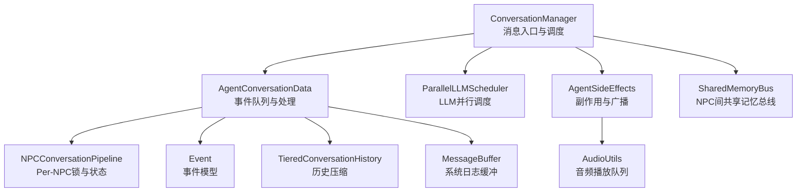
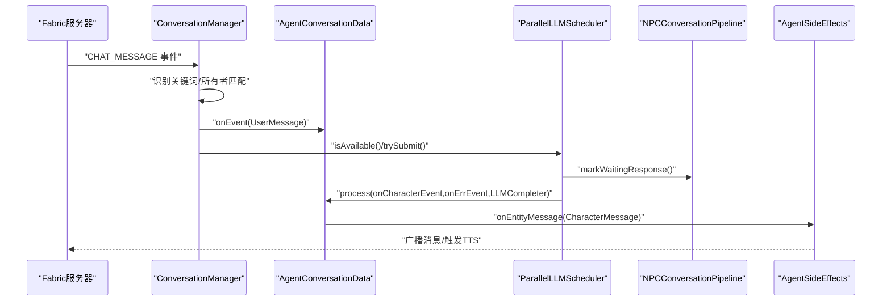
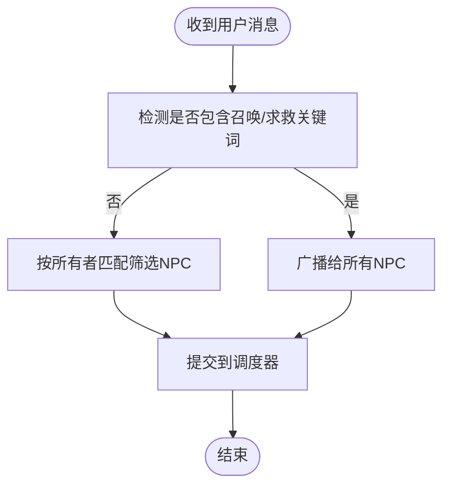
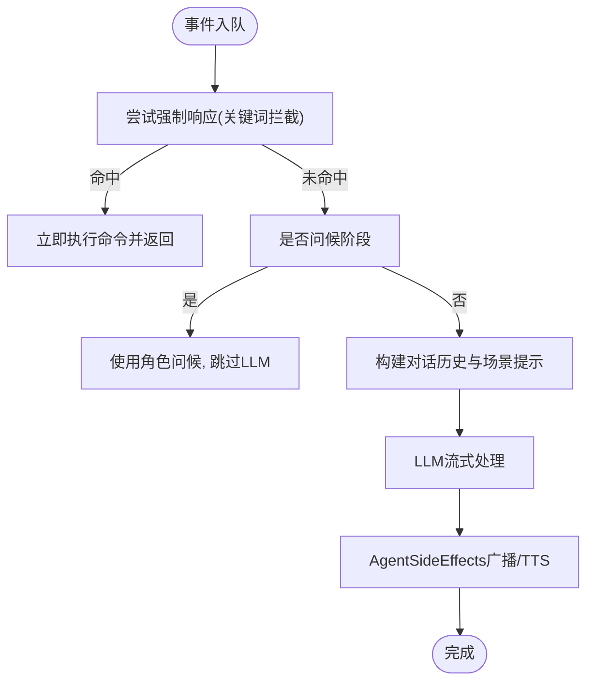
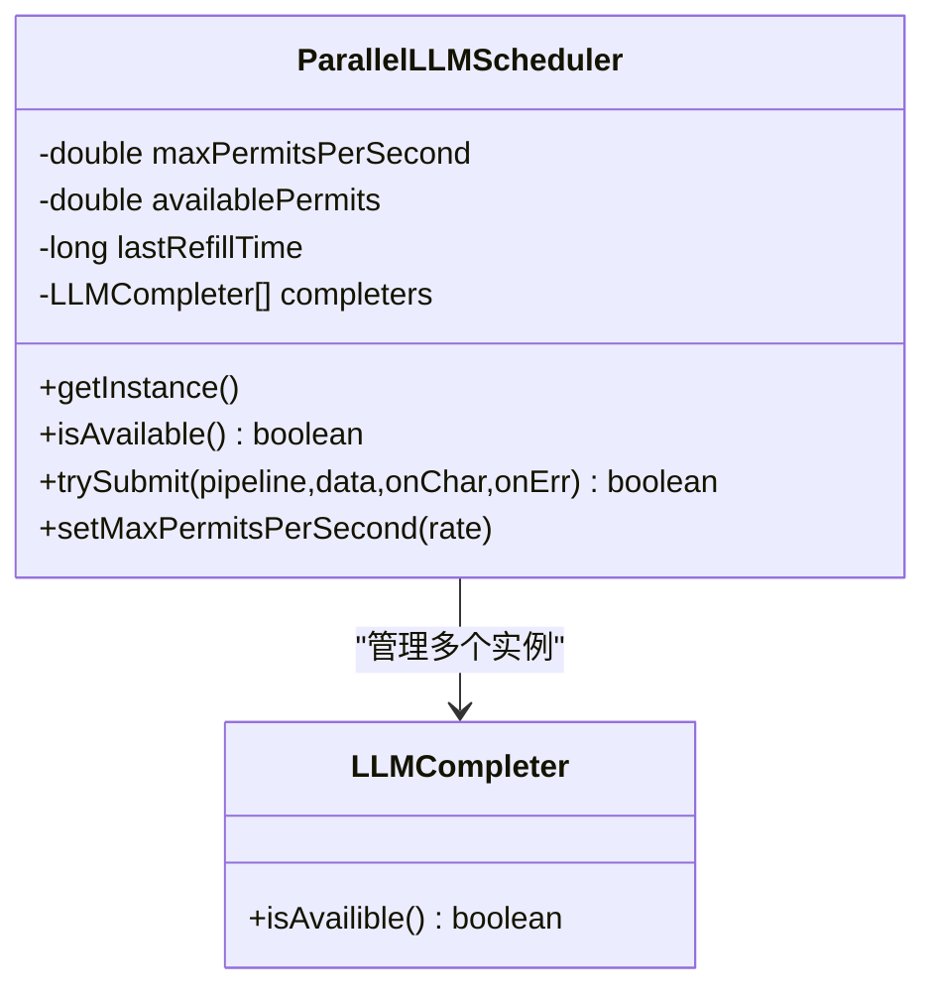
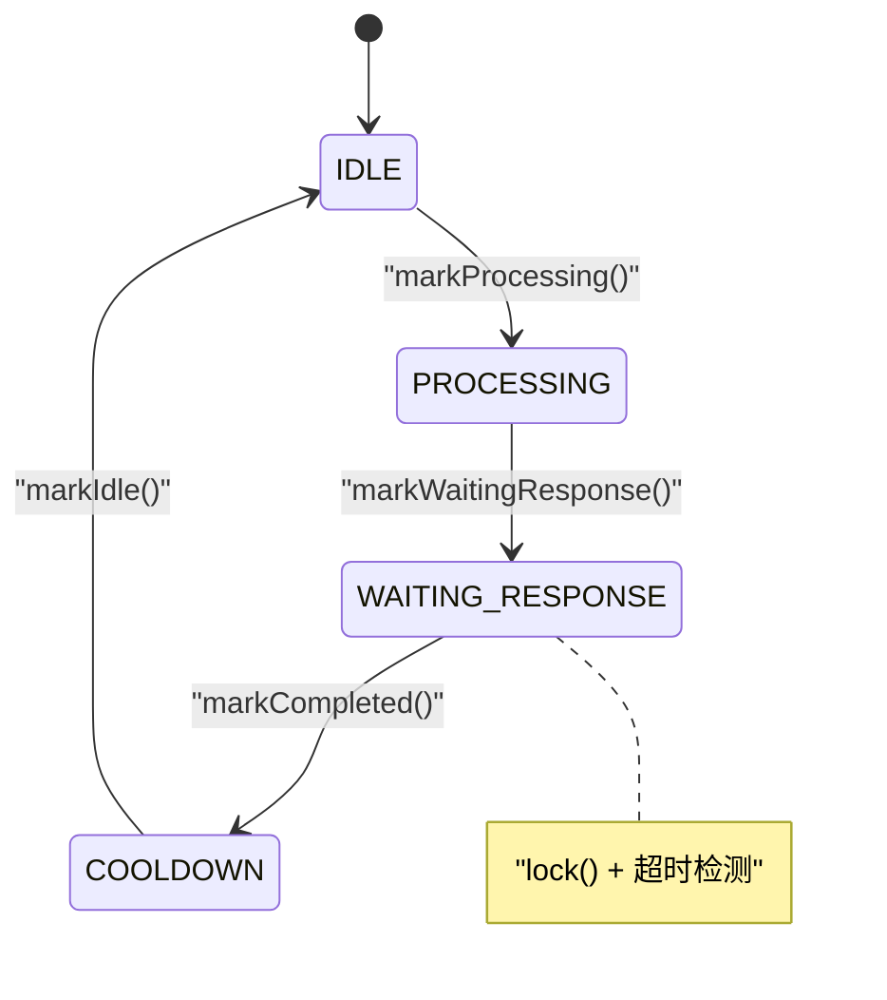
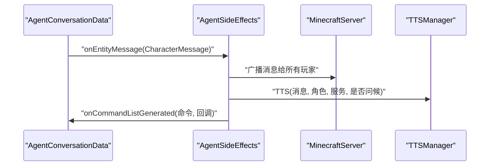
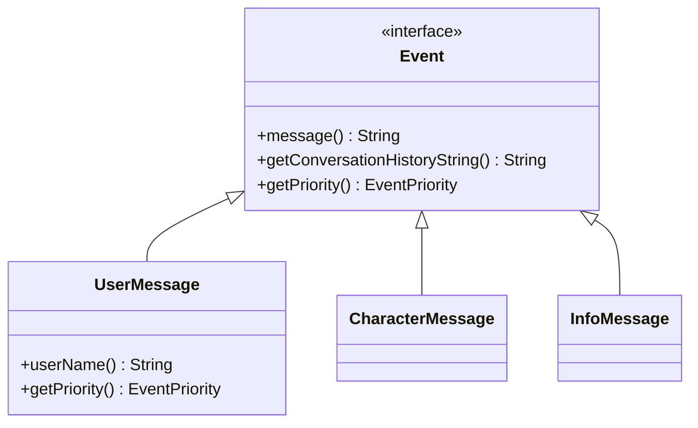
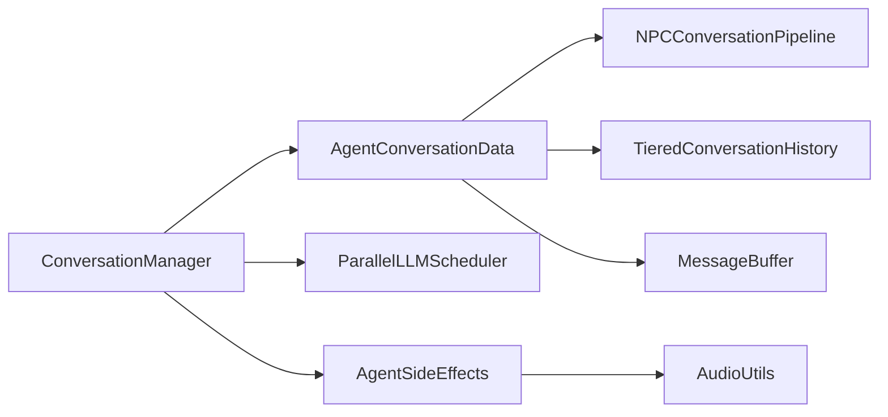

# 对话管理器

<cite>
**本文引用的文件**
- [ConversationManager.java](file://src/main/java/adris/altoclef/player2api/manager/ConversationManager.java)
- [AgentConversationData.java](file://src/main/java/adris/altoclef/player2api/AgentConversationData.java)
- [ParallelLLMScheduler.java](file://src/main/java/adris/altoclef/player2api/ParallelLLMScheduler.java)
- [NPCConversationPipeline.java](file://src/main/java/adris/altoclef/player2api/NPCConversationPipeline.java)
- [AgentSideEffects.java](file://src/main/java/adris/altoclef/player2api/AgentSideEffects.java)
- [Event.java](file://src/main/java/adris/altoclef/player2api/Event.java)
- [TieredConversationHistory.java](file://src/main/java/adris/altoclef/player2api/context/TieredConversationHistory.java)
- [SharedMemoryBus.java](file://src/main/java/adris/altoclef/player2api/memory/SharedMemoryBus.java)
- [HeartbeatManager.java](file://src/main/java/adris/altoclef/player2api/manager/HeartbeatManager.java)
- [MessageBuffer.java](file://src/main/java/adris/altoclef/player2api/MessageBuffer.java)
- [AudioUtils.java](file://src/main/java/adris/altoclef/player2api/utils/AudioUtils.java)
- [AI_NPC项目整体架构概览.md](file://docs/AI_NPC项目整体架构概览.md)
- [AI_NPC游戏指令系统重构.md](file://docs/AI_NPC游戏指令系统重构.md)
</cite>

## 目录
1. [简介](#简介)
2. [项目结构](#项目结构)
3. [核心组件](#核心组件)
4. [架构总览](#架构总览)
5. [详细组件分析](#详细组件分析)
6. [依赖关系分析](#依赖关系分析)
7. [性能考量](#性能考量)
8. [故障排查指南](#故障排查指南)
9. [结论](#结论)
10. [附录](#附录)

## 简介
本文件面向“对话管理器”的技术文档，围绕 ConversationManager 的核心架构与工作机制展开，重点覆盖以下方面：
- 对话队列管理：事件入队、优先级计算、去重与容量控制
- NPC 选择逻辑：基于优先级与锁状态的调度策略
- 消息路由策略：用户消息的关键词识别、所有者匹配、NPC 间广播与距离限制
- 对话锁机制：Lock 类与 Per-NPC 锁（Pipeline）的实现、超时与并发安全
- 用户消息处理流程：关键词检测、所有者匹配、消息广播、强制响应与两阶段救援
- 代码示例路径：初始化、消息处理、优先级调度
- 扩展方法与性能优化策略

## 项目结构
对话管理器位于 player2api 子模块中，围绕 ConversationManager 为中心，配合 AgentConversationData、ParallelLLMScheduler、NPCConversationPipeline、AgentSideEffects 等组件协同工作。

图示来源
- [ConversationManager.java:27-201](file://src/main/java/adris/altoclef/player2api/manager/ConversationManager.java#L27-L201)
- [AgentConversationData.java:33-657](file://src/main/java/adris/altoclef/player2api/AgentConversationData.java#L33-L657)
- [ParallelLLMScheduler.java:17-188](file://src/main/java/adris/altoclef/player2api/ParallelLLMScheduler.java#L17-L188)
- [NPCConversationPipeline.java:14-194](file://src/main/java/adris/altoclef/player2api/NPCConversationPipeline.java#L14-L194)
- [AgentSideEffects.java:21-184](file://src/main/java/adris/altoclef/player2api/AgentSideEffects.java#L21-L184)
- [Event.java:3-50](file://src/main/java/adris/altoclef/player2api/Event.java#L3-L50)
- [TieredConversationHistory.java:108-146](file://src/main/java/adris/altoclef/player2api/context/TieredConversationHistory.java#L108-L146)
- [MessageBuffer.java:5-35](file://src/main/java/adris/altoclef/player2api/MessageBuffer.java#L5-L35)
- [SharedMemoryBus.java:17-197](file://src/main/java/adris/altoclef/player2api/memory/SharedMemoryBus.java#L17-L197)
- [AudioUtils.java:37-68](file://src/main/java/adris/altoclef/player2api/utils/AudioUtils.java#L37-L68)

章节来源
- [ConversationManager.java:27-201](file://src/main/java/adris/altoclef/player2api/manager/ConversationManager.java#L27-L201)

## 核心组件
- ConversationManager：负责用户聊天事件接入、消息路由、NPC 选择与调度、TTS 注入等。
- AgentConversationData：每个 NPC 的事件队列、优先级计算、强制响应、命令反馈与自动喂食等。
- ParallelLLMScheduler：多 LLM 实例并行调度，内置令牌桶限流，避免过载。
- NPCConversationPipeline：Per-NPC 锁与状态机，替代全局锁，提升并发性。
- AgentSideEffects：消息广播、命令执行、TTS 触发与副作用处理。
- Event：统一的事件模型，支持用户消息、角色消息与信息消息，并定义事件优先级。
- TieredConversationHistory：对话历史压缩，降低 LLM 输入成本。
- SharedMemoryBus：NPC 间共享记忆总线，支持订阅与事件清理。
- MessageBuffer：系统日志缓冲，避免频繁输出。
- AudioUtils：音频播放队列，串行播放避免重叠。

章节来源
- [AgentConversationData.java:33-657](file://src/main/java/adris/altoclef/player2api/AgentConversationData.java#L33-L657)
- [ParallelLLMScheduler.java:17-188](file://src/main/java/adris/altoclef/player2api/ParallelLLMScheduler.java#L17-L188)
- [NPCConversationPipeline.java:14-194](file://src/main/java/adris/altoclef/player2api/NPCConversationPipeline.java#L14-L194)
- [AgentSideEffects.java:21-184](file://src/main/java/adris/altoclef/player2api/AgentSideEffects.java#L21-L184)
- [Event.java:3-50](file://src/main/java/adris/altoclef/player2api/Event.java#L3-L50)
- [TieredConversationHistory.java:108-146](file://src/main/java/adris/altoclef/player2api/context/TieredConversationHistory.java#L108-L146)
- [SharedMemoryBus.java:17-197](file://src/main/java/adris/altoclef/player2api/memory/SharedMemoryBus.java#L17-L197)
- [MessageBuffer.java:5-35](file://src/main/java/adris/altoclef/player2api/MessageBuffer.java#L5-L35)
- [AudioUtils.java:37-68](file://src/main/java/adris/altoclef/player2api/utils/AudioUtils.java#L37-L68)

## 架构总览
对话管理器采用“事件驱动 + 并行调度 + Per-NPC 锁”的架构：
- 事件入口：Fabric 服务器消息事件注册，转交至 ConversationManager.onUserChatMessage。
- 路由策略：识别“召唤/求救”关键词直接广播；否则按所有者匹配筛选目标 NPC。
- 调度策略：根据 AgentConversationData 的优先级排序，结合 ParallelLLMScheduler 的令牌桶与空闲 LLM 实例进行提交。
- 处理流程：AgentConversationData.process 调用 LLM 流式生成，触发 AgentSideEffects 广播与 TTS。
- 锁与并发：全局 Lock 已重构为 Per-NPC 的 NPCConversationPipeline，避免互相阻塞。

图示来源
- [ConversationManager.java:59-189](file://src/main/java/adris/altoclef/player2api/manager/ConversationManager.java#L59-L189)
- [AgentConversationData.java:112-297](file://src/main/java/adris/altoclef/player2api/AgentConversationData.java#L112-L297)
- [ParallelLLMScheduler.java:104-132](file://src/main/java/adris/altoclef/player2api/ParallelLLMScheduler.java#L104-L132)
- [NPCConversationPipeline.java:125-178](file://src/main/java/adris/altoclef/player2api/NPCConversationPipeline.java#L125-L178)
- [AgentSideEffects.java:40-64](file://src/main/java/adris/altoclef/player2api/AgentSideEffects.java#L40-L64)

## 详细组件分析

### 组件A：ConversationManager（对话管理器）
职责与关键点：
- 初始化与事件接入：注册 Fabric CHAT_MESSAGE 事件，转交到 onUserChatMessage。
- 消息路由：
  - 召唤/求救关键词：直接广播给所有 NPC（忽略所有者）。
  - 普通用户消息：仅发送给属于该玩家的 NPC（所有者匹配）。
- 距离限制：对 NPC 间消息保留距离限制，对用户消息移除距离限制（或可配置）。
- 调度：按优先级排序候选队列，结合 ParallelLLMScheduler 的可用性提交处理。
- 注入：injectOnTick 每 tick 调用 process 并注入 TTS。

图示来源
- [ConversationManager.java:94-130](file://src/main/java/adris/altoclef/player2api/manager/ConversationManager.java#L94-L130)
- [AI_NPC项目整体架构概览.md:1424-1468](file://docs/AI_NPC项目整体架构概览.md#L1424-L1468)

章节来源
- [ConversationManager.java:59-189](file://src/main/java/adris/altoclef/player2api/manager/ConversationManager.java#L59-L189)

### 组件B：AgentConversationData（NPC对话数据）
职责与关键点：
- 事件队列：ConcurrentLinkedDeque，最大长度限制，去重与容量控制。
- 优先级计算：基于上次处理时间与事件优先级，避免饥饿。
- 处理流程：
  - 强制响应：关键词拦截（救援/攻击/召唤），绕过 LLM，立即执行。
  - 问候：首次在线时直接使用角色问候，跳过 LLM。
  - LLM 流式响应：构建历史、注入场景提示、流式回调、副作用广播与 TTS。
- 命令反馈：去重、两阶段救援（先跟随后攻击）、自动喂食。
- 距离与所有者：提供距离查询与所有者匹配辅助。

图示来源
- [AgentConversationData.java:112-297](file://src/main/java/adris/altoclef/player2api/AgentConversationData.java#L112-L297)
- [AgentConversationData.java:578-646](file://src/main/java/adris/altoclef/player2api/AgentConversationData.java#L578-L646)

章节来源
- [AgentConversationData.java:33-657](file://src/main/java/adris/altoclef/player2api/AgentConversationData.java#L33-L657)

### 组件C：ParallelLLMScheduler（并行LLM调度器）
职责与关键点：
- 多实例管理：默认 3 个 LLMCompleter 实例，支持并行。
- 令牌桶限流：每秒最大请求数，默认 10，避免过载。
- 提交策略：先令牌桶获取，再寻找空闲实例，标记等待响应后提交处理。
- 可用性判断：综合令牌与实例空闲状态。

图示来源
- [ParallelLLMScheduler.java:17-188](file://src/main/java/adris/altoclef/player2api/ParallelLLMScheduler.java#L17-L188)

章节来源
- [ParallelLLMScheduler.java:17-188](file://src/main/java/adris/altoclef/player2api/ParallelLLMScheduler.java#L17-L188)

### 组件D：NPCConversationPipeline（Per-NPC对话管道）
职责与关键点：
- 状态机：IDLE、PROCESSING、WAITING_RESPONSE、COOLDOWN。
- 锁管理：Per-NPC 等待响应锁，带超时自动释放。
- 冷却期：最小响应间隔，避免频繁响应。
- 调度判断：IDLE 且未锁定且冷却完成才可处理。

图示来源
- [NPCConversationPipeline.java:41-194](file://src/main/java/adris/altoclef/player2api/NPCConversationPipeline.java#L41-L194)

章节来源
- [NPCConversationPipeline.java:14-194](file://src/main/java/adris/altoclef/player2api/NPCConversationPipeline.java#L14-L194)

### 组件E：AgentSideEffects（副作用与广播）
职责与关键点：
- 消息广播：向所有玩家显示 NPC 的角色消息。
- TTS 触发：根据消息内容与问候标志调用 TTS。
- 命令执行：解析命令前缀、持久化/静默命令、攻击覆盖、LookAtOwnerTask 自动执行等。
- 错误处理：统一错误日志。

图示来源
- [AgentSideEffects.java:40-144](file://src/main/java/adris/altoclef/player2api/AgentSideEffects.java#L40-L144)

章节来源
- [AgentSideEffects.java:21-184](file://src/main/java/adris/altoclef/player2api/AgentSideEffects.java#L21-L184)

### 组件F：事件模型与历史压缩
- Event：统一事件模型，支持用户消息、角色消息、信息消息，并定义优先级。
- TieredConversationHistory：对对话历史进行分层压缩，降低 LLM 成本。

图示来源
- [Event.java:3-50](file://src/main/java/adris/altoclef/player2api/Event.java#L3-L50)
- [TieredConversationHistory.java:108-146](file://src/main/java/adris/altoclef/player2api/context/TieredConversationHistory.java#L108-L146)

章节来源
- [Event.java:3-50](file://src/main/java/adris/altoclef/player2api/Event.java#L3-L50)
- [TieredConversationHistory.java:108-146](file://src/main/java/adris/altoclef/player2api/context/TieredConversationHistory.java#L108-L146)

### 组件G：扩展与性能优化
- 扩展方法：
  - 增加 NPC 名称路由：在消息中提取目标 NPC 名称，定向路由（参考重构文档）。
  - 配置化距离限制：在配置中设置用户消息与 NPC 间消息的距离阈值。
  - 共享记忆总线：通过 SharedMemoryBus 进行 NPC 间事件订阅与清理。
  - 心跳管理：HeartbeatManager 用于令牌心跳节流。
- 性能优化：
  - 令牌桶限流：避免 LLM 过载。
  - Per-NPC 锁：避免全局锁阻塞。
  - 历史压缩：减少 LLM 输入规模。
  - 命令反馈去重与冷却：避免重复反馈。
  - 音频串行播放：避免重叠与卡顿。

章节来源
- [AI_NPC游戏指令系统重构.md:632-668](file://docs/AI_NPC游戏指令系统重构.md#L632-L668)
- [AI_NPC项目整体架构概览.md:1424-1468](file://docs/AI_NPC项目整体架构概览.md#L1424-L1468)
- [SharedMemoryBus.java:17-197](file://src/main/java/adris/altoclef/player2api/memory/SharedMemoryBus.java#L17-L197)
- [HeartbeatManager.java:22-46](file://src/main/java/adris/altoclef/player2api/manager/HeartbeatManager.java#L22-L46)
- [AudioUtils.java:37-68](file://src/main/java/adris/altoclef/player2api/utils/AudioUtils.java#L37-L68)

## 依赖关系分析
- ConversationManager 依赖：
  - AgentConversationData：事件队列与处理
  - ParallelLLMScheduler：并行调度与限流
  - AgentSideEffects：副作用与广播
  - Event：事件模型
- AgentConversationData 依赖：
  - NPCConversationPipeline：Per-NPC 锁与状态
  - TieredConversationHistory：历史压缩
  - MessageBuffer：系统日志缓冲
  - Event：事件模型
- AgentSideEffects 依赖：
  - TTSManager（间接）：TTS 触发
  - AudioUtils：音频播放队列

图示来源
- [ConversationManager.java:27-201](file://src/main/java/adris/altoclef/player2api/manager/ConversationManager.java#L27-L201)
- [AgentConversationData.java:33-657](file://src/main/java/adris/altoclef/player2api/AgentConversationData.java#L33-L657)
- [ParallelLLMScheduler.java:17-188](file://src/main/java/adris/altoclef/player2api/ParallelLLMScheduler.java#L17-L188)
- [AgentSideEffects.java:21-184](file://src/main/java/adris/altoclef/player2api/AgentSideEffects.java#L21-L184)
- [NPCConversationPipeline.java:14-194](file://src/main/java/adris/altoclef/player2api/NPCConversationPipeline.java#L14-L194)
- [TieredConversationHistory.java:108-146](file://src/main/java/adris/altoclef/player2api/context/TieredConversationHistory.java#L108-L146)
- [MessageBuffer.java:5-35](file://src/main/java/adris/altoclef/player2api/MessageBuffer.java#L5-L35)
- [AudioUtils.java:37-68](file://src/main/java/adris/altoclef/player2api/utils/AudioUtils.java#L37-L68)

章节来源
- [ConversationManager.java:27-201](file://src/main/java/adris/altoclef/player2api/manager/ConversationManager.java#L27-L201)
- [AgentConversationData.java:33-657](file://src/main/java/adris/altoclef/player2api/AgentConversationData.java#L33-L657)

## 性能考量
- 令牌桶限流：通过 ParallelLLMScheduler 控制每秒请求数，避免 LLM 服务过载。
- 并发锁优化：将全局锁替换为 Per-NPC 锁，显著提升多 NPC 场景下的吞吐。
- 历史压缩：TieredConversationHistory 将普通消息摘要化，降低 LLM 成本。
- 命令反馈去重：避免重复反馈导致的额外 LLM 调用。
- 音频串行播放：AudioUtils 使用队列串行播放，避免音频重叠与资源争用。
- 调度冷却：最小响应间隔与冷却期，平衡响应速度与资源占用。

## 故障排查指南
- 无响应或延迟高
  - 检查 ParallelLLMScheduler 的令牌桶是否耗尽。
  - 查看 AgentConversationData 的 isProcessing 与 PROCESSING_TIMEOUT_MS 超时日志。
  - 确认 NPCConversationPipeline 的 isLocked 与超时释放。
- 广播异常
  - 检查 AgentSideEffects.onEntityMessage 的消息广播逻辑与 TTS 触发。
- 命令执行问题
  - 查看 AgentSideEffects.onCommandListGenerated 的命令解析与持久化/静默命令处理。
  - 关注命令完成回调中的两阶段救援与自动喂食逻辑。
- 日志与内存
  - 使用 MessageBuffer 与 TieredConversationHistory 控制日志与历史大小。
  - SharedMemoryBus 定期清理过期事件，避免内存膨胀。

章节来源
- [AgentSideEffects.java:40-144](file://src/main/java/adris/altoclef/player2api/AgentSideEffects.java#L40-L144)
- [AgentConversationData.java:112-297](file://src/main/java/adris/altoclef/player2api/AgentConversationData.java#L112-L297)
- [SharedMemoryBus.java:171-179](file://src/main/java/adris/altoclef/player2api/memory/SharedMemoryBus.java#L171-L179)

## 结论
对话管理器通过“事件驱动 + 并行调度 + Per-NPC 锁”的设计，在多 NPC 场景下实现了高并发、低耦合与可扩展的对话处理能力。结合历史压缩、令牌桶限流与命令反馈去重等优化手段，系统在性能与稳定性之间取得了良好平衡。未来可在消息路由（名称定向）与配置化距离限制方面进一步增强灵活性。

## 附录

### 代码示例路径（不含具体代码内容）
- 初始化对话管理器
  - [ConversationManager.init:59-70](file://src/main/java/adris/altoclef/player2api/manager/ConversationManager.java#L59-L70)
- 处理用户消息（关键词检测与所有者匹配）
  - [ConversationManager.onUserChatMessage:115-130](file://src/main/java/adris/altoclef/player2api/manager/ConversationManager.java#L115-L130)
- 处理 NPC 间消息（距离过滤与广播）
  - [ConversationManager.onAICharacterMessage:142-150](file://src/main/java/adris/altoclef/player2api/manager/ConversationManager.java#L142-L150)
- 调度与提交（优先级排序与令牌桶）
  - [ConversationManager.process:152-171](file://src/main/java/adris/altoclef/player2api/manager/ConversationManager.java#L152-L171)
  - [ParallelLLMScheduler.trySubmit:104-132](file://src/main/java/adris/altoclef/player2api/ParallelLLMScheduler.java#L104-L132)
- Per-NPC 锁与状态机
  - [NPCConversationPipeline.isLocked/markWaitingResponse/markCompleted:89-178](file://src/main/java/adris/altoclef/player2api/NPCConversationPipeline.java#L89-L178)
- 强制响应与两阶段救援
  - [AgentConversationData.tryForcedRescueResponse:578-646](file://src/main/java/adris/altoclef/player2api/AgentConversationData.java#L578-L646)
- 命令执行与反馈
  - [AgentSideEffects.onCommandListGenerated:70-144](file://src/main/java/adris/altoclef/player2api/AgentSideEffects.java#L70-L144)
- 历史压缩与系统日志缓冲
  - [TieredConversationHistory.compressWarmZone:114-139](file://src/main/java/adris/altoclef/player2api/context/TieredConversationHistory.java#L114-L139)
  - [MessageBuffer.dumpAndGetString:24-34](file://src/main/java/adris/altoclef/player2api/MessageBuffer.java#L24-L34)
- 配置化距离限制与消息路由（参考）
  - [AI_NPC项目整体架构概览.md:1424-1468](file://docs/AI_NPC项目整体架构概览.md#L1424-L1468)
- NPC 名称路由（参考）
  - [AI_NPC游戏指令系统重构.md:632-668](file://docs/AI_NPC游戏指令系统重构.md#L632-L668)