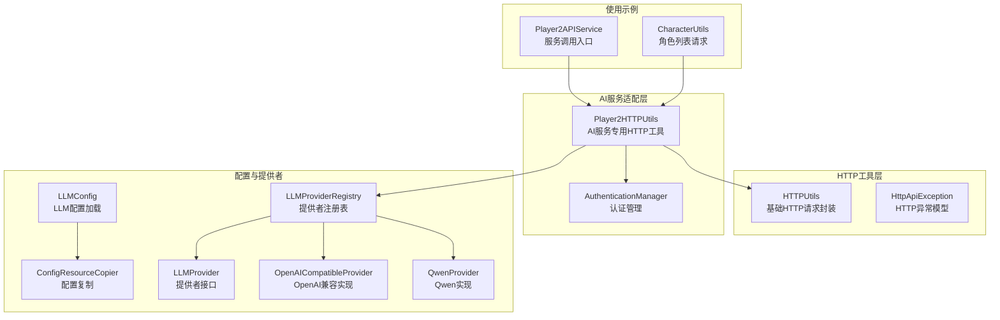
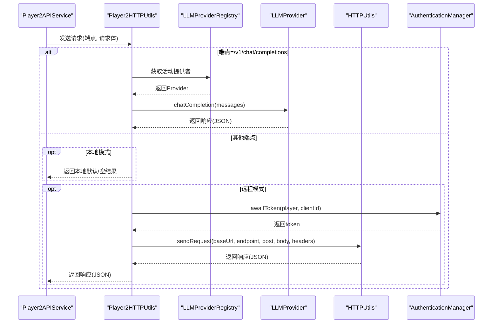
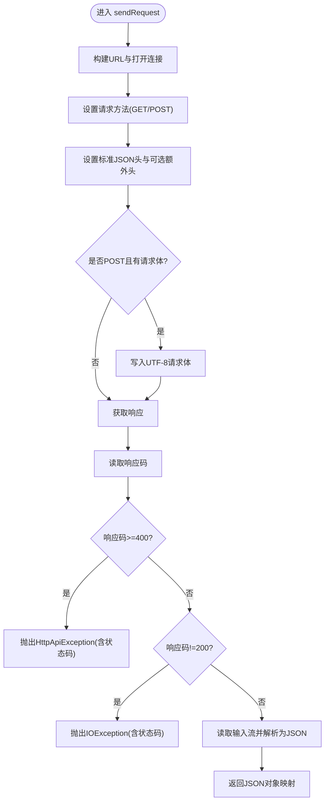
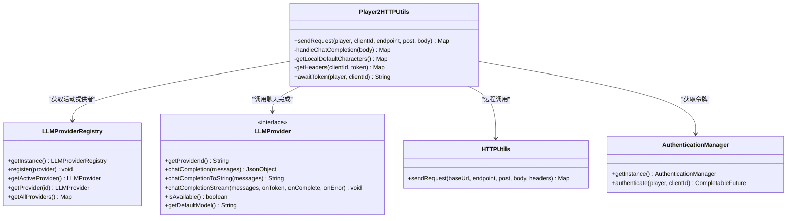
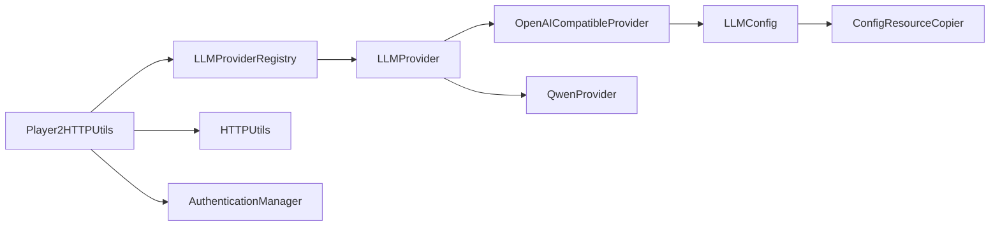

# HTTP工具类

<cite>
**本文档引用的文件**
- [HTTPUtils.java](file://src/main/java/adris/altoclef/player2api/utils/HTTPUtils.java)
- [HttpApiException.java](file://src/main/java/adris/altoclef/player2api/utils/HttpApiException.java)
- [Player2HTTPUtils.java](file://src/main/java/adris/altoclef/player2api/utils/Player2HTTPUtils.java)
- [ConfigResourceCopier.java](file://src/main/java/adris/altoclef/player2api/utils/ConfigResourceCopier.java)
- [Player2APIService.java](file://src/main/java/adris/altoclef/player2api/Player2APIService.java)
- [AuthenticationManager.java](file://src/main/java/adris/altoclef/player2api/auth/AuthenticationManager.java)
- [CharacterUtils.java](file://src/main/java/adris/altoclef/player2api/utils/CharacterUtils.java)
- [LLMConfig.java](file://src/main/java/adris/altoclef/player2api/llm/LLMConfig.java)
- [LLMProvider.java](file://src/main/java/adris/altoclef/player2api/llm/LLMProvider.java)
- [LLMProviderRegistry.java](file://src/main/java/adris/altoclef/player2api/llm/LLMProviderRegistry.java)
- [OpenAICompatibleProvider.java](file://src/main/java/adris/altoclef/player2api/llm/impl/OpenAICompatibleProvider.java)
- [QwenProvider.java](file://src/main/java/adris/altoclef/player2api/llm/impl/QwenProvider.java)
</cite>

## 目录
1. [简介](#简介)
2. [项目结构](#项目结构)
3. [核心组件](#核心组件)
4. [架构总览](#架构总览)
5. [详细组件分析](#详细组件分析)
6. [依赖分析](#依赖分析)
7. [性能考虑](#性能考虑)
8. [故障排查指南](#故障排查指南)
9. [结论](#结论)
10. [附录](#附录)

## 简介
本文件为HTTP工具类的全面技术文档，覆盖以下主题：
- HTTPUtils类：提供基础HTTP请求封装，支持GET/POST、请求头设置、响应解析与错误处理。
- HttpApiException异常类：统一HTTP API异常模型，便于上层进行错误分类与重试策略设计。
- Player2HTTPUtils类：面向AI服务的专用HTTP工具，负责认证、请求签名、路由与本地模式兼容。
- ConfigResourceCopier配置资源复制工具：确保运行时配置目录存在默认配置文件，简化部署与升级。
- 典型使用场景：异步请求、批量处理、连接池管理、网络超时、SSL与代理配置、限流与安全防护。

## 项目结构
HTTP工具类位于player2api/utils包下，围绕HTTP请求、异常处理、AI服务适配与配置管理形成清晰分层：
- 基础HTTP封装：HTTPUtils
- 异常模型：HttpApiException
- AI服务适配：Player2HTTPUtils（含认证、签名、路由）
- 配置管理：ConfigResourceCopier（配合LLMConfig）
- 使用示例：Player2APIService、AuthenticationManager、CharacterUtils
- LLM Provider体系：LLMProvider接口及OpenAI兼容实现，支撑本地/远程LLM调用

图表来源
- [HTTPUtils.java:20-88](file://src/main/java/adris/altoclef/player2api/utils/HTTPUtils.java#L20-L88)
- [HttpApiException.java:22-33](file://src/main/java/adris/altoclef/player2api/utils/HttpApiException.java#L22-L33)
- [Player2HTTPUtils.java:41-152](file://src/main/java/adris/altoclef/player2api/utils/Player2HTTPUtils.java#L41-L152)
- [AuthenticationManager.java:110-150](file://src/main/java/adris/altoclef/player2api/auth/AuthenticationManager.java#L110-L150)
- [ConfigResourceCopier.java:18-59](file://src/main/java/adris/altoclef/player2api/utils/ConfigResourceCopier.java#L18-L59)
- [LLMConfig.java:19-104](file://src/main/java/adris/altoclef/player2api/llm/LLMConfig.java#L19-L104)
- [LLMProvider.java:11-67](file://src/main/java/adris/altoclef/player2api/llm/LLMProvider.java#L11-L67)
- [LLMProviderRegistry.java:16-80](file://src/main/java/adris/altoclef/player2api/llm/LLMProviderRegistry.java#L16-L80)
- [OpenAICompatibleProvider.java:24-200](file://src/main/java/adris/altoclef/player2api/llm/impl/OpenAICompatibleProvider.java#L24-L200)
- [QwenProvider.java:11-22](file://src/main/java/adris/altoclef/player2api/llm/impl/QwenProvider.java#L11-L22)
- [Player2APIService.java:50-249](file://src/main/java/adris/altoclef/player2api/Player2APIService.java#L50-L249)
- [CharacterUtils.java:60-142](file://src/main/java/adris/altoclef/player2api/utils/CharacterUtils.java#L60-L142)

章节来源
- [HTTPUtils.java:20-88](file://src/main/java/adris/altoclef/player2api/utils/HTTPUtils.java#L20-L88)
- [Player2HTTPUtils.java:41-152](file://src/main/java/adris/altoclef/player2api/utils/Player2HTTPUtils.java#L41-L152)
- [ConfigResourceCopier.java:18-59](file://src/main/java/adris/altoclef/player2api/utils/ConfigResourceCopier.java#L18-L59)
- [LLMConfig.java:19-104](file://src/main/java/adris/altoclef/player2api/llm/LLMConfig.java#L19-L104)

## 核心组件
- HTTPUtils：提供sendRequest方法，支持GET/POST、自定义请求头、JSON请求体、响应解析与错误处理；对4xx/5xx抛出HttpApiException，其他非200抛出IOException。
- HttpApiException：继承IOException，携带HTTP状态码，便于上层区分网络错误与业务错误。
- Player2HTTPUtils：根据端点类型与配置模式（本地/远程）进行分流：
  - /v1/chat/completions：路由至LLMProvider实现，支持本地/远程LLM。
  - /v1/selected_characters：本地模式返回默认角色列表。
  - /v1/tts/*、/v1/stt/*：本地模式返回空结果，远程模式通过HTTPUtils调用player2.game API。
  - /v1/health：本地模式返回空结果，远程模式健康检查。
  - 认证：远程模式通过AuthenticationManager获取令牌并设置请求头。
- ConfigResourceCopier：确保运行时配置目录存在默认配置文件，避免首次启动缺失配置导致的初始化失败。

章节来源
- [HTTPUtils.java:23-55](file://src/main/java/adris/altoclef/player2api/utils/HTTPUtils.java#L23-L55)
- [HttpApiException.java:22-33](file://src/main/java/adris/altoclef/player2api/utils/HttpApiException.java#L22-L33)
- [Player2HTTPUtils.java:45-88](file://src/main/java/adris/altoclef/player2api/utils/Player2HTTPUtils.java#L45-L88)
- [ConfigResourceCopier.java:29-37](file://src/main/java/adris/altoclef/player2api/utils/ConfigResourceCopier.java#L29-L37)

## 架构总览
下图展示了AI服务调用的关键流程：服务层发起请求，工具层进行路由与认证，最终到达LLM提供者或远端API。

图表来源
- [Player2APIService.java:59-118](file://src/main/java/adris/altoclef/player2api/Player2APIService.java#L59-L118)
- [Player2HTTPUtils.java:45-88](file://src/main/java/adris/altoclef/player2api/utils/Player2HTTPUtils.java#L45-L88)
- [LLMProviderRegistry.java:49-70](file://src/main/java/adris/altoclef/player2api/llm/LLMProviderRegistry.java#L49-L70)
- [LLMProvider.java:21-38](file://src/main/java/adris/altoclef/player2api/llm/LLMProvider.java#L21-L38)
- [HTTPUtils.java:23-55](file://src/main/java/adris/altoclef/player2api/utils/HTTPUtils.java#L23-L55)
- [AuthenticationManager.java:133-142](file://src/main/java/adris/altoclef/player2api/auth/AuthenticationManager.java#L133-L142)

## 详细组件分析

### HTTPUtils组件分析
- 功能要点
  - 支持GET/POST请求，自动设置Content-Type与Accept为application/json。
  - 可选额外请求头，用于扩展认证或业务标识。
  - POST请求体为JSON字符串写入输出流。
  - 响应解析：统一读取输入流，解析为Gson JsonObject。
  - 错误处理：4xx/5xx抛出HttpApiException，包含状态码；其他非200抛出IOException。
- 性能与复杂度
  - 时间复杂度：O(n)，n为响应体字节数；空间复杂度：O(n)。
  - 未内置连接池与超时控制，需在上层或提供者层补充。
- 安全与健壮性
  - 仅设置标准JSON头，不包含敏感字段；异常包含响应体有助于诊断。
  - 输出流写入后未显式关闭，但使用try-with-resources可保证释放。

图表来源
- [HTTPUtils.java:23-87](file://src/main/java/adris/altoclef/player2api/utils/HTTPUtils.java#L23-L87)

章节来源
- [HTTPUtils.java:23-87](file://src/main/java/adris/altoclef/player2api/utils/HTTPUtils.java#L23-L87)

### HttpApiException异常类分析
- 设计目的
  - 统一HTTP API异常模型，便于上层区分网络错误与业务错误。
- 关键属性
  - statusCode：HTTP状态码，便于限流、熔断与重试策略。
- 使用建议
  - 对429/503等可重试状态码进行指数退避重试。
  - 对401/403进行认证刷新或降级处理。

章节来源
- [HttpApiException.java:22-33](file://src/main/java/adris/altoclef/player2api/utils/HttpApiException.java#L22-L33)

### Player2HTTPUtils组件分析
- 端点路由与模式切换
  - /v1/chat/completions：调用LLMProvider实现，支持本地/远程LLM。
  - /v1/selected_characters：本地模式返回默认角色列表；远程模式转发至player2.game。
  - /v1/tts/*、/v1/stt/*：本地模式返回空；远程模式通过HTTPUtils调用。
  - /v1/health：本地模式返回空；远程模式健康检查。
- 认证与请求头
  - 远程模式：awaitToken获取令牌，设置player2-game-key与Authorization头。
- 本地模式兼容
  - 通过LLMConfig判断当前提供者是否为远程模式，决定行为分支。

图表来源
- [Player2HTTPUtils.java:41-152](file://src/main/java/adris/altoclef/player2api/utils/Player2HTTPUtils.java#L41-L152)
- [LLMProvider.java:11-67](file://src/main/java/adris/altoclef/player2api/llm/LLMProvider.java#L11-L67)
- [LLMProviderRegistry.java:16-80](file://src/main/java/adris/altoclef/player2api/llm/LLMProviderRegistry.java#L16-L80)
- [HTTPUtils.java:23-55](file://src/main/java/adris/altoclef/player2api/utils/HTTPUtils.java#L23-L55)
- [AuthenticationManager.java:133-142](file://src/main/java/adris/altoclef/player2api/auth/AuthenticationManager.java#L133-L142)

章节来源
- [Player2HTTPUtils.java:45-152](file://src/main/java/adris/altoclef/player2api/utils/Player2HTTPUtils.java#L45-L152)

### ConfigResourceCopier组件分析
- 功能
  - 确保运行时配置目录存在指定配置文件；若不存在则从classpath复制默认模板。
- 应用场景
  - 首次启动自动补齐默认配置，避免因缺少配置导致初始化失败。
  - 与LLMConfig配合，统一管理LLM提供者配置文件。
- 日志与容错
  - 成功/失败均记录日志，异常被捕获并记录错误信息。

章节来源
- [ConfigResourceCopier.java:29-57](file://src/main/java/adris/altoclef/player2api/utils/ConfigResourceCopier.java#L29-L57)
- [LLMConfig.java:37-39](file://src/main/java/adris/altoclef/player2api/llm/LLMConfig.java#L37-L39)

### 使用示例与最佳实践

#### 异步请求与流式处理
- 流式聊天完成：通过LLMProvider.chatCompletionStream回调逐块接收token，适合实时对话。
- TTS/STT：本地模式下直接合成/识别；远程模式通过Player2HTTPUtils转发。

章节来源
- [Player2APIService.java:109-118](file://src/main/java/adris/altoclef/player2api/Player2APIService.java#L109-L118)
- [OpenAICompatibleProvider.java:143-200](file://src/main/java/adris/altoclef/player2api/llm/impl/OpenAICompatibleProvider.java#L143-L200)

#### 批量处理与连接池
- 当前HTTPUtils未内置连接池；可在OpenAICompatibleProvider中按需引入HttpClient连接池以提升吞吐。
- 批量请求建议：合并消息数组或使用队列+并发线程池，结合限流策略。

章节来源
- [OpenAICompatibleProvider.java:82-110](file://src/main/java/adris/altoclef/player2api/llm/impl/OpenAICompatibleProvider.java#L82-L110)

#### 网络超时、SSL与代理
- 超时：OpenAICompatibleProvider设置连接/读取超时为30秒，可根据网络环境调整。
- SSL：使用JDK默认信任管理器；如需自定义证书，可在更高层配置SSLContext。
- 代理：LLMConfig支持启用HTTP代理，OpenAICompatibleProvider自动应用代理设置。

章节来源
- [OpenAICompatibleProvider.java:101-102](file://src/main/java/adris/altoclef/player2api/llm/impl/OpenAICompatibleProvider.java#L101-L102)
- [OpenAICompatibleProvider.java:87-93](file://src/main/java/adris/altoclef/player2api/llm/impl/OpenAICompatibleProvider.java#L87-L93)
- [LLMConfig.java:88-98](file://src/main/java/adris/altoclef/player2api/llm/LLMConfig.java#L88-L98)

#### API限流与重试
- 限流：基于HttpApiException的statusCode识别429/503等限流信号。
- 重试：对幂等操作采用指数退避重试，最大重试次数与抖动策略需在上层配置。

章节来源
- [HttpApiException.java:30-32](file://src/main/java/adris/altoclef/player2api/utils/HttpApiException.java#L30-L32)
- [AuthenticationManager.java:117-127](file://src/main/java/adris/altoclef/player2api/auth/AuthenticationManager.java#L117-L127)

#### 数据传输安全
- 令牌传递：通过Authorization头与player2-game-key头传递，避免明文参数泄露。
- 本地模式：敏感信息在客户端处理，减少远端暴露面。

章节来源
- [Player2HTTPUtils.java:136-141](file://src/main/java/adris/altoclef/player2api/utils/Player2HTTPUtils.java#L136-L141)

## 依赖分析
- 组件耦合
  - Player2HTTPUtils依赖LLMProviderRegistry与LLMProvider，实现LLM调用解耦。
  - 远程模式依赖AuthenticationManager与HTTPUtils，形成清晰的认证与传输层分离。
- 外部依赖
  - Gson用于JSON解析与序列化。
  - JDK HttpURLConnection用于HTTP传输。
  - Log4j用于日志记录。

图表来源
- [Player2HTTPUtils.java:41-152](file://src/main/java/adris/altoclef/player2api/utils/Player2HTTPUtils.java#L41-L152)
- [LLMProviderRegistry.java:16-80](file://src/main/java/adris/altoclef/player2api/llm/LLMProviderRegistry.java#L16-L80)
- [LLMProvider.java:11-67](file://src/main/java/adris/altoclef/player2api/llm/LLMProvider.java#L11-L67)
- [OpenAICompatibleProvider.java:24-200](file://src/main/java/adris/altoclef/player2api/llm/impl/OpenAICompatibleProvider.java#L24-L200)
- [QwenProvider.java:11-22](file://src/main/java/adris/altoclef/player2api/llm/impl/QwenProvider.java#L11-L22)
- [LLMConfig.java:19-104](file://src/main/java/adris/altoclef/player2api/llm/LLMConfig.java#L19-L104)
- [ConfigResourceCopier.java:18-59](file://src/main/java/adris/altoclef/player2api/utils/ConfigResourceCopier.java#L18-L59)

## 性能考虑
- 连接复用：建议在OpenAICompatibleProvider中引入HttpClient连接池，减少TCP握手开销。
- 超时与背压：合理设置连接/读取超时，结合限流与队列长度控制内存占用。
- 日志成本：避免在高频路径打印大体积JSON，必要时截断日志。
- 代理与SSL：代理与SSL握手会增加延迟，建议在高并发场景下预热连接。

## 故障排查指南
- 常见错误与定位
  - HttpApiException：检查statusCode与响应体，定位上游错误原因。
  - IOException：检查网络连通性与端点可用性。
  - 认证轮询异常：关注轮询任务取消与异常分支处理。
- 本地/远程模式差异
  - 本地模式：TTS/STT返回空，角色列表使用默认值；检查LLMConfig.activeProvider。
  - 远程模式：确认AuthenticationManager已成功获取token并正确设置请求头。
- 配置缺失
  - 若配置文件未生成，请检查ConfigResourceCopier日志，确认classpath资源是否存在。

章节来源
- [AuthenticationManager.java:117-127](file://src/main/java/adris/altoclef/player2api/auth/AuthenticationManager.java#L117-L127)
- [Player2HTTPUtils.java:57-87](file://src/main/java/adris/altoclef/player2api/utils/Player2HTTPUtils.java#L57-L87)
- [ConfigResourceCopier.java:44-56](file://src/main/java/adris/altoclef/player2api/utils/ConfigResourceCopier.java#L44-L56)

## 结论
HTTP工具类通过简洁的封装实现了跨服务的HTTP通信能力，结合Player2HTTPUtils的模式切换与认证集成，满足了本地与远程两种部署形态的需求。配合LLMProvider体系与配置管理工具，形成了从请求路由、认证签名到响应解析的完整链路。建议在生产环境中引入连接池、完善的超时与重试策略，并加强日志与监控以提升稳定性与可观测性。

## 附录
- 代码片段路径示例（不含具体代码内容）
  - GET请求示例：[HTTPUtils.sendRequest(...):23-55](file://src/main/java/adris/altoclef/player2api/utils/HTTPUtils.java#L23-L55)
  - POST请求示例：[HTTPUtils.sendRequest(...):23-55](file://src/main/java/adris/altoclef/player2api/utils/HTTPUtils.java#L23-L55)
  - 异步流式聊天：[LLMProvider.chatCompletionStream(...):50-59](file://src/main/java/adris/altoclef/player2api/llm/LLMProvider.java#L50-L59)
  - OpenAI兼容实现：[OpenAICompatibleProvider.chatCompletion(...):112-141](file://src/main/java/adris/altoclef/player2api/llm/impl/OpenAICompatibleProvider.java#L112-L141)
  - 代理与超时设置：[OpenAICompatibleProvider.prepareConnection(...):51-110](file://src/main/java/adris/altoclef/player2api/llm/impl/OpenAICompatibleProvider.java#L51-L110)
  - 本地模式角色列表：[Player2HTTPUtils.getLocalDefaultCharacters(...):114-134](file://src/main/java/adris/altoclef/player2api/utils/Player2HTTPUtils.java#L114-L134)
  - 远程模式认证与请求头：[Player2HTTPUtils.awaitToken(...):143-150](file://src/main/java/adris/altoclef/player2api/utils/Player2HTTPUtils.java#L143-L150)、[Player2HTTPUtils.getHeaders(...):136-141](file://src/main/java/adris/altoclef/player2api/utils/Player2HTTPUtils.java#L136-L141)
  - 配置复制：[ConfigResourceCopier.ensureConfigExists(...):29-37](file://src/main/java/adris/altoclef/player2api/utils/ConfigResourceCopier.java#L29-L37)