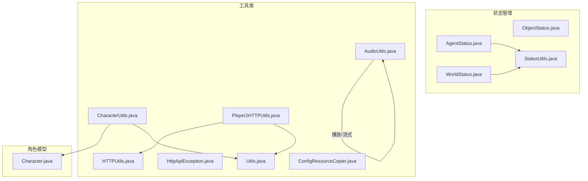
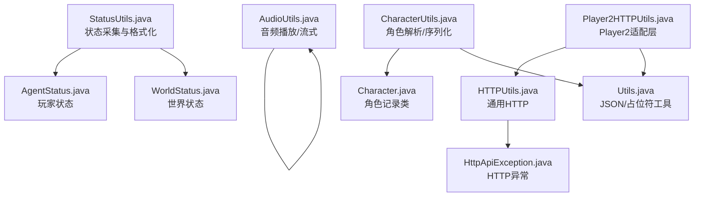
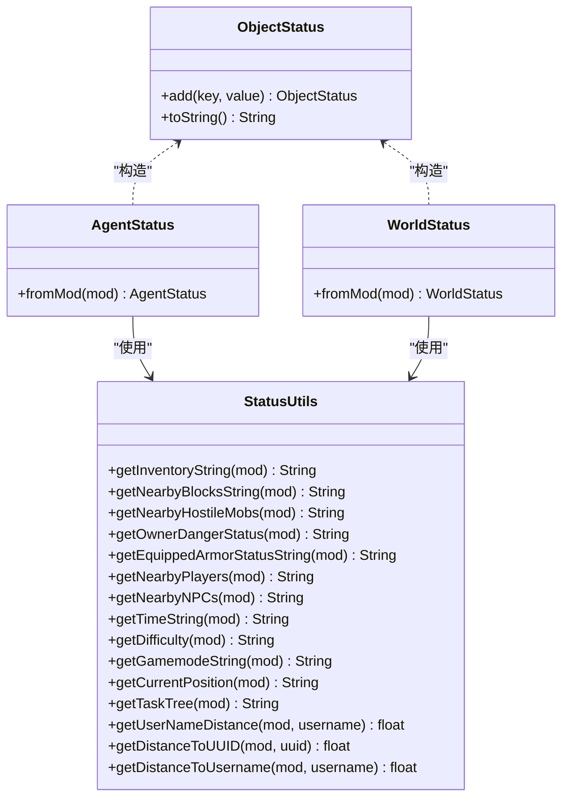
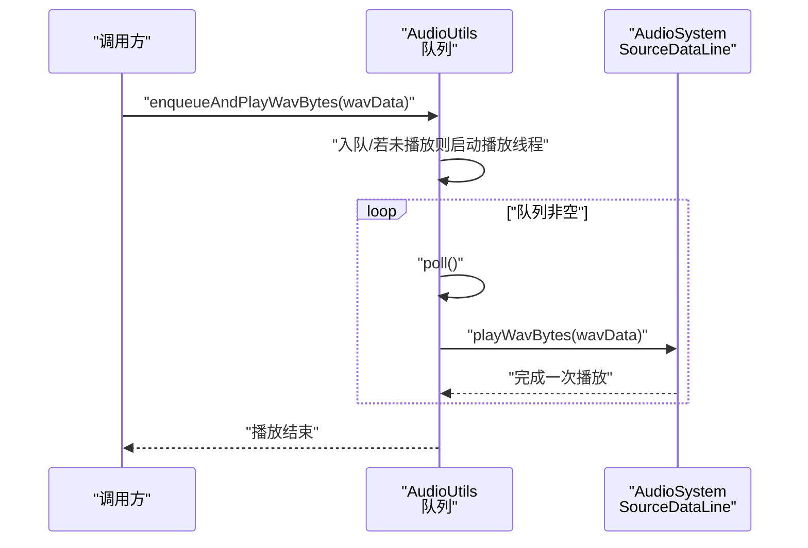
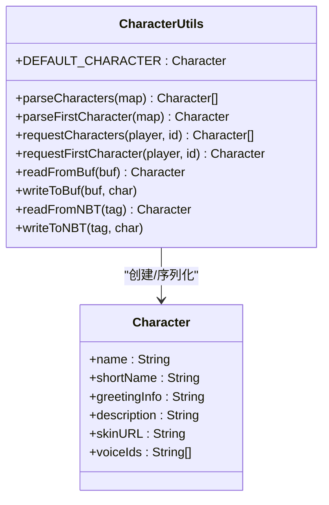
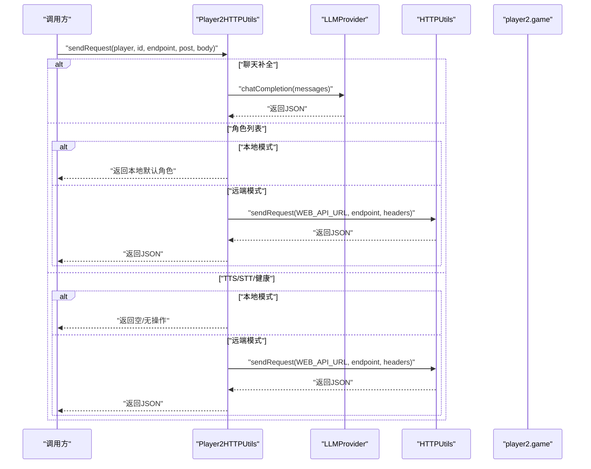
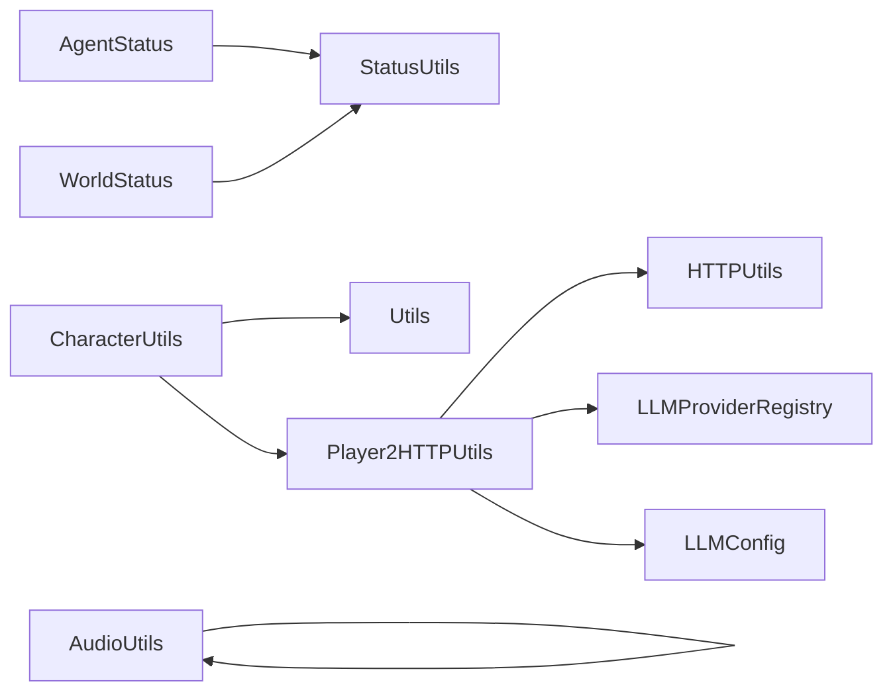

# 工具类与辅助系统

<cite>
**本文引用的文件**
- [AgentStatus.java](file://src/main/java/adris/altoclef/player2api/status/AgentStatus.java)
- [WorldStatus.java](file://src/main/java/adris/altoclef/player2api/status/WorldStatus.java)
- [StatusUtils.java](file://src/main/java/adris/altoclef/player2api/status/StatusUtils.java)
- [ObjectStatus.java](file://src/main/java/adris/altoclef/player2api/status/ObjectStatus.java)
- [AudioUtils.java](file://src/main/java/adris/altoclef/player2api/utils/AudioUtils.java)
- [CharacterUtils.java](file://src/main/java/adris/altoclef/player2api/utils/CharacterUtils.java)
- [HTTPUtils.java](file://src/main/java/adris/altoclef/player2api/utils/HTTPUtils.java)
- [Player2HTTPUtils.java](file://src/main/java/adris/altoclef/player2api/utils/Player2HTTPUtils.java)
- [HttpApiException.java](file://src/main/java/adris/altoclef/player2api/utils/HttpApiException.java)
- [Utils.java](file://src/main/java/adris/altoclef/player2api/utils/Utils.java)
- [Character.java](file://src/main/java/adris/altoclef/player2api/Character.java)
- [ConfigResourceCopier.java](file://src/main/java/adris/altoclef/player2api/utils/ConfigResourceCopier.java)
</cite>

## 目录
1. [简介](#简介)
2. [项目结构](#项目结构)
3. [核心组件](#核心组件)
4. [架构总览](#架构总览)
5. [详细组件分析](#详细组件分析)
6. [依赖关系分析](#依赖关系分析)
7. [性能考量](#性能考量)
8. [故障排查指南](#故障排查指南)
9. [结论](#结论)
10. [附录](#附录)

## 简介
本文件面向“工具类与辅助系统”，聚焦于状态管理与三大工具类：状态管理器（AgentStatus、WorldStatus、StatusUtils）、音频工具（AudioUtils）、角色工具（CharacterUtils）与HTTP工具（HTTPUtils）。文档将从设计原则、数据结构、调用流程、错误处理、性能优化、扩展方式等方面进行系统化说明，并提供常见使用场景与问题解决方案。

## 项目结构
工具类与辅助系统主要位于以下包内：
- 状态管理：adris.altoclef.player2api.status
- 工具类：adris.altoclef.player2api.utils
- 角色模型：adris.altoclef.player2api

图表来源
- [AgentStatus.java:1-24](file://src/main/java/adris/altoclef/player2api/status/AgentStatus.java#L1-L24)
- [WorldStatus.java:1-20](file://src/main/java/adris/altoclef/player2api/status/WorldStatus.java#L1-L20)
- [StatusUtils.java:1-322](file://src/main/java/adris/altoclef/player2api/status/StatusUtils.java#L1-L322)
- [ObjectStatus.java:1-27](file://src/main/java/adris/altoclef/player2api/status/ObjectStatus.java#L1-L27)
- [AudioUtils.java:1-170](file://src/main/java/adris/altoclef/player2api/utils/AudioUtils.java#L1-L170)
- [CharacterUtils.java:1-142](file://src/main/java/adris/altoclef/player2api/utils/CharacterUtils.java#L1-L142)
- [HTTPUtils.java:1-88](file://src/main/java/adris/altoclef/player2api/utils/HTTPUtils.java#L1-L88)
- [Player2HTTPUtils.java:1-148](file://src/main/java/adris/altoclef/player2api/utils/Player2HTTPUtils.java#L1-L148)
- [HttpApiException.java:1-33](file://src/main/java/adris/altoclef/player2api/utils/HttpApiException.java#L1-L33)
- [Utils.java:1-104](file://src/main/java/adris/altoclef/player2api/utils/Utils.java#L1-L104)
- [Character.java:1-22](file://src/main/java/adris/altoclef/player2api/Character.java#L1-L22)
- [ConfigResourceCopier.java:1-59](file://src/main/java/adris/altoclef/player2api/utils/ConfigResourceCopier.java#L1-L59)

章节来源
- [AgentStatus.java:1-24](file://src/main/java/adris/altoclef/player2api/status/AgentStatus.java#L1-L24)
- [WorldStatus.java:1-20](file://src/main/java/adris/altoclef/player2api/status/WorldStatus.java#L1-L20)
- [StatusUtils.java:1-322](file://src/main/java/adris/altoclef/player2api/status/StatusUtils.java#L1-L322)
- [ObjectStatus.java:1-27](file://src/main/java/adris/altoclef/player2api/status/ObjectStatus.java#L1-L27)
- [AudioUtils.java:1-170](file://src/main/java/adris/altoclef/player2api/utils/AudioUtils.java#L1-L170)
- [CharacterUtils.java:1-142](file://src/main/java/adris/altoclef/player2api/utils/CharacterUtils.java#L1-L142)
- [HTTPUtils.java:1-88](file://src/main/java/adris/altoclef/player2api/utils/HTTPUtils.java#L1-L88)
- [Player2HTTPUtils.java:1-148](file://src/main/java/adris/altoclef/player2api/utils/Player2HTTPUtils.java#L1-L148)
- [HttpApiException.java:1-33](file://src/main/java/adris/altoclef/player2api/utils/HttpApiException.java#L1-L33)
- [Utils.java:1-104](file://src/main/java/adris/altoclef/player2api/utils/Utils.java#L1-L104)
- [Character.java:1-22](file://src/main/java/adris/altoclef/player2api/Character.java#L1-L22)
- [ConfigResourceCopier.java:1-59](file://src/main/java/adris/altoclef/player2api/utils/ConfigResourceCopier.java#L1-L59)

## 核心组件
- 状态管理器
  - AgentStatus：封装玩家代理的状态快照，聚合位置、生命值、饥饿/饱和、物品栏、任务状态、氧气、护甲、游戏模式等字段。
  - WorldStatus：封装世界维度、天气、出生点、附近方块、敌对怪物、附近玩家/NPC、危险等级、难度、时间信息等。
  - StatusUtils：提供静态方法生成上述状态字符串，负责数据采集、格式化与裁剪（如近邻方块类型上限、最近敌对怪物数量限制），并提供距离查询等辅助能力。
  - ObjectStatus：轻量级键值容器，用于构建结构化状态字符串。
- 工具类
  - AudioUtils：提供队列化WAV音频播放、直接WAV播放、远程TTS流式播放（仅在远端模式下使用）。
  - CharacterUtils：解析/序列化角色对象（含Buf/NBT读写），并支持从HTTP接口拉取角色列表或返回本地默认角色。
  - HTTPUtils：通用HTTP请求封装，负责请求发送、响应解析与错误抛出（HttpApiException）。
  - Player2HTTPUtils：面向Player2 API的适配层，按当前LLM提供者模式（本地/远端）路由请求，处理鉴权头、字符集、端点白名单等。
  - Utils：通用JSON安全读取、占位符替换、JSON清洗、深拷贝等工具函数。
  - ConfigResourceCopier：确保运行时配置目录存在默认配置文件，避免首次启动缺失配置。

章节来源
- [AgentStatus.java:1-24](file://src/main/java/adris/altoclef/player2api/status/AgentStatus.java#L1-L24)
- [WorldStatus.java:1-20](file://src/main/java/adris/altoclef/player2api/status/WorldStatus.java#L1-L20)
- [StatusUtils.java:1-322](file://src/main/java/adris/altoclef/player2api/status/StatusUtils.java#L1-L322)
- [ObjectStatus.java:1-27](file://src/main/java/adris/altoclef/player2api/status/ObjectStatus.java#L1-L27)
- [AudioUtils.java:1-170](file://src/main/java/adris/altoclef/player2api/utils/AudioUtils.java#L1-L170)
- [CharacterUtils.java:1-142](file://src/main/java/adris/altoclef/player2api/utils/CharacterUtils.java#L1-L142)
- [HTTPUtils.java:1-88](file://src/main/java/adris/altoclef/player2api/utils/HTTPUtils.java#L1-L88)
- [Player2HTTPUtils.java:1-148](file://src/main/java/adris/altoclef/player2api/utils/Player2HTTPUtils.java#L1-L148)
- [Utils.java:1-104](file://src/main/java/adris/altoclef/player2api/utils/Utils.java#L1-L104)
- [Character.java:1-22](file://src/main/java/adris/altoclef/player2api/Character.java#L1-L22)
- [ConfigResourceCopier.java:1-59](file://src/main/java/adris/altoclef/player2api/utils/ConfigResourceCopier.java#L1-L59)

## 架构总览
工具类与辅助系统的交互关系如下：

图表来源
- [StatusUtils.java:1-322](file://src/main/java/adris/altoclef/player2api/status/StatusUtils.java#L1-L322)
- [AgentStatus.java:1-24](file://src/main/java/adris/altoclef/player2api/status/AgentStatus.java#L1-L24)
- [WorldStatus.java:1-20](file://src/main/java/adris/altoclef/player2api/status/WorldStatus.java#L1-L20)
- [AudioUtils.java:1-170](file://src/main/java/adris/altoclef/player2api/utils/AudioUtils.java#L1-L170)
- [CharacterUtils.java:1-142](file://src/main/java/adris/altoclef/player2api/utils/CharacterUtils.java#L1-L142)
- [HTTPUtils.java:1-88](file://src/main/java/adris/altoclef/player2api/utils/HTTPUtils.java#L1-L88)
- [Player2HTTPUtils.java:1-148](file://src/main/java/adris/altoclef/player2api/utils/Player2HTTPUtils.java#L1-L148)
- [HttpApiException.java:1-33](file://src/main/java/adris/altoclef/player2api/utils/HttpApiException.java#L1-L33)
- [Utils.java:1-104](file://src/main/java/adris/altoclef/player2api/utils/Utils.java#L1-L104)
- [Character.java:1-22](file://src/main/java/adris/altoclef/player2api/Character.java#L1-L22)

## 详细组件分析

### 状态管理器：AgentStatus、WorldStatus、StatusUtils
- 设计原则
  - 职责单一：每个状态类只负责自身领域的字段采集与格式化。
  - 可组合性：通过ObjectStatus作为中间结构，便于拼接与复用。
  - 数据裁剪：对高基数数据（如近邻方块类型、敌对怪物）进行上限控制，降低提示长度与开销。
- 关键实现要点
  - AgentStatus.fromMod：从控制器上下文采集玩家实时状态，包括位置、健康、食物/饱和、物品栏、任务状态、氧气、护甲、游戏模式。
  - WorldStatus.fromMod：采集天气、维度、出生点、近邻方块、敌对怪物、玩家/NPC、危险等级、难度、时间信息。
  - StatusUtils：提供大量静态方法，涵盖物品统计、维度/天气/出生点、任务状态、近邻实体/方块、氧气、护甲、玩家/NPC列表、危险评估、难度、时间、游戏模式、当前位置、任务树、距离查询等。
- 使用示例（路径引用）
  - 生成玩家状态：[AgentStatus.fromMod:7-22](file://src/main/java/adris/altoclef/player2api/status/AgentStatus.java#L7-L22)
  - 生成世界状态：[WorldStatus.fromMod:6-18](file://src/main/java/adris/altoclef/player2api/status/WorldStatus.java#L6-L18)
  - 物品栏统计：[StatusUtils.getInventoryString:29-51](file://src/main/java/adris/altoclef/player2api/status/StatusUtils.java#L29-L51)
  - 近邻方块统计：[StatusUtils.getNearbyBlocksString:81-119](file://src/main/java/adris/altoclef/player2api/status/StatusUtils.java#L81-L119)
  - 敌对怪物列表：[StatusUtils.getNearbyHostileMobs:125-154](file://src/main/java/adris/altoclef/player2api/status/StatusUtils.java#L125-L154)
  - 危险等级评估：[StatusUtils.getOwnerDangerStatus:168-193](file://src/main/java/adris/altoclef/player2api/status/StatusUtils.java#L168-L193)
  - 护甲状态：[StatusUtils.getEquippedArmorStatusString:195-226](file://src/main/java/adris/altoclef/player2api/status/StatusUtils.java#L195-L226)
  - 玩家/NPC列表：[StatusUtils.getNearbyPlayers:228-243](file://src/main/java/adris/altoclef/player2api/status/StatusUtils.java#L228-L243)、[StatusUtils.getNearbyNPCs:245-261](file://src/main/java/adris/altoclef/player2api/status/StatusUtils.java#L245-L261)
  - 时间/难度/模式：[StatusUtils.getTimeString:278-283](file://src/main/java/adris/altoclef/player2api/status/StatusUtils.java#L278-L283)、[StatusUtils.getDifficulty:274-276](file://src/main/java/adris/altoclef/player2api/status/StatusUtils.java#L274-L276)、[StatusUtils.getGamemodeString:285-287](file://src/main/java/adris/altoclef/player2api/status/StatusUtils.java#L285-L287)
  - 当前位置：[StatusUtils.getCurrentPosition:289-292](file://src/main/java/adris/altoclef/player2api/status/StatusUtils.java#L289-L292)
  - 任务树：[StatusUtils.getTaskTree:294-297](file://src/main/java/adris/altoclef/player2api/status/StatusUtils.java#L294-L297)
  - 距离查询：[StatusUtils.getUserNameDistance:263-272](file://src/main/java/adris/altoclef/player2api/status/StatusUtils.java#L263-L272)、[StatusUtils.getDistanceToUUID:299-312](file://src/main/java/adris/altoclef/player2api/status/StatusUtils.java#L299-L312)、[StatusUtils.getDistanceToUsername:314-320](file://src/main/java/adris/altoclef/player2api/status/StatusUtils.java#L314-L320)

图表来源
- [ObjectStatus.java:1-27](file://src/main/java/adris/altoclef/player2api/status/ObjectStatus.java#L1-L27)
- [AgentStatus.java:1-24](file://src/main/java/adris/altoclef/player2api/status/AgentStatus.java#L1-L24)
- [WorldStatus.java:1-20](file://src/main/java/adris/altoclef/player2api/status/WorldStatus.java#L1-L20)
- [StatusUtils.java:1-322](file://src/main/java/adris/altoclef/player2api/status/StatusUtils.java#L1-L322)

章节来源
- [AgentStatus.java:1-24](file://src/main/java/adris/altoclef/player2api/status/AgentStatus.java#L1-L24)
- [WorldStatus.java:1-20](file://src/main/java/adris/altoclef/player2api/status/WorldStatus.java#L1-L20)
- [StatusUtils.java:1-322](file://src/main/java/adris/altoclef/player2api/status/StatusUtils.java#L1-L322)
- [ObjectStatus.java:1-27](file://src/main/java/adris/altoclef/player2api/status/ObjectStatus.java#L1-L27)

### 音频工具：AudioUtils
- 功能概述
  - 队列化顺序播放WAV音频片段，避免重叠。
  - 直接播放WAV字节数组。
  - 远程TTS流式播放（仅在远端模式启用）。
- 关键实现要点
  - 播放队列：使用并发队列与异步线程保证串行播放。
  - WAV解码与输出：通过AudioSystem获取AudioInputStream，打开SourceDataLine并写入缓冲区。
  - 远程流式：构造JSON请求体，设置鉴权头，接收audio/wav并播放。
- 使用示例（路径引用）
  - 入队并播放：[AudioUtils.enqueueAndPlayWavBytes:49-57](file://src/main/java/adris/altoclef/player2api/utils/AudioUtils.java#L49-L57)
  - 直播放WAV：[AudioUtils.playWavBytes:76-104](file://src/main/java/adris/altoclef/player2api/utils/AudioUtils.java#L76-L104)
  - 远程流式播放：[AudioUtils.streamAudio:110-168](file://src/main/java/adris/altoclef/player2api/utils/AudioUtils.java#L110-L168)

图表来源
- [AudioUtils.java:37-104](file://src/main/java/adris/altoclef/player2api/utils/AudioUtils.java#L37-L104)

章节来源
- [AudioUtils.java:1-170](file://src/main/java/adris/altoclef/player2api/utils/AudioUtils.java#L1-L170)

### 角色工具：CharacterUtils 与角色模型：Character
- 功能概述
  - 解析来自HTTP响应的角色数组/首个角色，提供默认角色回退。
  - 支持Buf/NBT序列化/反序列化，便于网络传输与持久化。
  - 与Player2HTTPUtils协作，按模式返回本地默认角色或远端角色列表。
- 关键实现要点
  - JSON安全读取：使用Utils.getStringJsonSafely、Utils.getStringArrayJsonSafely。
  - 默认角色：DEFAULT_CHARACTER提供本地兜底。
  - Buf/NBT：read/write系列方法保证跨模块一致的数据交换。
- 使用示例（路径引用）
  - 解析角色数组：[CharacterUtils.parseCharacters:25-63](file://src/main/java/adris/altoclef/player2api/utils/CharacterUtils.java#L25-L63)
  - 获取首个角色：[CharacterUtils.parseFirstCharacter:20-23](file://src/main/java/adris/altoclef/player2api/utils/CharacterUtils.java#L20-L23)
  - 请求角色列表：[CharacterUtils.requestCharacters:65-72](file://src/main/java/adris/altoclef/player2api/utils/CharacterUtils.java#L65-L72)
  - 请求首个角色：[CharacterUtils.requestFirstCharacter:74-81](file://src/main/java/adris/altoclef/player2api/utils/CharacterUtils.java#L74-L81)
  - Buf读写：[CharacterUtils.readFromBuf/writeToBuf:83-110](file://src/main/java/adris/altoclef/player2api/utils/CharacterUtils.java#L83-L110)
  - NBT读写：[CharacterUtils.readFromNBT/writeToNBT:112-141](file://src/main/java/adris/altoclef/player2api/utils/CharacterUtils.java#L112-L141)
  - 角色模型：[Character:5-6](file://src/main/java/adris/altoclef/player2api/Character.java#L5-L6)

图表来源
- [Character.java:1-22](file://src/main/java/adris/altoclef/player2api/Character.java#L1-L22)
- [CharacterUtils.java:1-142](file://src/main/java/adris/altoclef/player2api/utils/CharacterUtils.java#L1-L142)

章节来源
- [CharacterUtils.java:1-142](file://src/main/java/adris/altoclef/player2api/utils/CharacterUtils.java#L1-L142)
- [Character.java:1-22](file://src/main/java/adris/altoclef/player2api/Character.java#L1-L22)

### HTTP工具：HTTPUtils 与 Player2HTTPUtils
- 功能概述
  - HTTPUtils：统一HTTP请求发送、响应解析、错误抛出（HttpApiException）。
  - Player2HTTPUtils：根据LLM提供者模式（本地/远端）路由请求；对特定端点（聊天、角色、TTS/STT、健康）进行差异化处理；在本地模式下返回空/默认结果。
- 关键实现要点
  - 错误处理：4xx及以上抛出HttpApiException，包含状态码；其他非200抛出IOException。
  - 路由策略：聊天补全交由LLMProvider；角色列表在本地模式返回默认；TTS/STT/健康在本地模式跳过。
  - 鉴权：awaitToken根据提供者决定是否需要远端鉴权。
- 使用示例（路径引用）
  - 发送请求（通用）：[HTTPUtils.sendRequest:23-55](file://src/main/java/adris/altoclef/player2api/utils/HTTPUtils.java#L23-L55)
  - 解析响应：[HTTPUtils.getJsonObject:57-87](file://src/main/java/adris/altoclef/player2api/utils/HTTPUtils.java#L57-L87)
  - Player2路由请求：[Player2HTTPUtils.sendRequest:45-88](file://src/main/java/adris/altoclef/player2api/utils/Player2HTTPUtils.java#L45-L88)
  - 聊天补全路由：[Player2HTTPUtils.handleChatCompletion:90-108](file://src/main/java/adris/altoclef/player2api/utils/Player2HTTPUtils.java#L90-L108)
  - 本地默认角色：[Player2HTTPUtils.getLocalDefaultCharacters:110-130](file://src/main/java/adris/altoclef/player2api/utils/Player2HTTPUtils.java#L110-L130)
  - 等待令牌：[Player2HTTPUtils.awaitToken:139-146](file://src/main/java/adris/altoclef/player2api/utils/Player2HTTPUtils.java#L139-L146)

图表来源
- [Player2HTTPUtils.java:41-88](file://src/main/java/adris/altoclef/player2api/utils/Player2HTTPUtils.java#L41-L88)
- [HTTPUtils.java:20-88](file://src/main/java/adris/altoclef/player2api/utils/HTTPUtils.java#L20-L88)

章节来源
- [HTTPUtils.java:1-88](file://src/main/java/adris/altoclef/player2api/utils/HTTPUtils.java#L1-L88)
- [Player2HTTPUtils.java:1-148](file://src/main/java/adris/altoclef/player2api/utils/Player2HTTPUtils.java#L1-L148)
- [HttpApiException.java:1-33](file://src/main/java/adris/altoclef/player2api/utils/HttpApiException.java#L1-L33)

### 辅助工具：Utils 与配置复制：ConfigResourceCopier
- Utils
  - 安全读取JSON字段与数组，占位符替换，JSON清洗（兼容非严格JSON），深拷贝，行分割等。
- ConfigResourceCopier
  - 在运行时配置目录（run/config/）不存在时，从classpath复制默认配置模板，避免首次启动缺失配置。

章节来源
- [Utils.java:1-104](file://src/main/java/adris/altoclef/player2api/utils/Utils.java#L1-L104)
- [ConfigResourceCopier.java:1-59](file://src/main/java/adris/altoclef/player2api/utils/ConfigResourceCopier.java#L1-L59)

## 依赖关系分析
- 组件耦合
  - AgentStatus/WorldStatus 依赖 StatusUtils 提供的采集方法。
  - CharacterUtils 依赖 Utils 的JSON安全读取与 Player2HTTPUtils 的HTTP请求。
  - Player2HTTPUtils 依赖 HTTPUtils 进行远端请求，并依赖 LLMProviderRegistry/LLMConfig 决策路由。
  - AudioUtils 独立性强，仅依赖Java标准库音频API。
- 外部依赖
  - Java标准库（java.net、javax.sound.sampled、com.google.gson）。
  - LLM提供者接口（LLMProvider）用于聊天补全路由。

图表来源
- [AgentStatus.java:1-24](file://src/main/java/adris/altoclef/player2api/status/AgentStatus.java#L1-L24)
- [WorldStatus.java:1-20](file://src/main/java/adris/altoclef/player2api/status/WorldStatus.java#L1-L20)
- [StatusUtils.java:1-322](file://src/main/java/adris/altoclef/player2api/status/StatusUtils.java#L1-L322)
- [CharacterUtils.java:1-142](file://src/main/java/adris/altoclef/player2api/utils/CharacterUtils.java#L1-L142)
- [Player2HTTPUtils.java:1-148](file://src/main/java/adris/altoclef/player2api/utils/Player2HTTPUtils.java#L1-L148)
- [HTTPUtils.java:1-88](file://src/main/java/adris/altoclef/player2api/utils/HTTPUtils.java#L1-L88)
- [Utils.java:1-104](file://src/main/java/adris/altoclef/player2api/utils/Utils.java#L1-L104)

## 性能考量
- 状态采集
  - 近邻方块类型限制（MAX_BLOCK_TYPES=15）与敌对怪物数量限制（取最近3个）可显著降低提示大小与CPU占用。
  - 物品栏统计采用Map聚合，避免重复遍历。
- 音频播放
  - 队列化串行播放避免重叠，减少CPU/GPU抖动。
  - 缓冲区大小（4096）平衡吞吐与延迟。
- HTTP请求
  - 本地模式下跳过TTS/STT/健康端点，减少网络开销。
  - 错误快速失败（4xx抛异常），避免无效重试。
- JSON处理
  - 安全读取与清洗减少异常分支，提升鲁棒性。

## 故障排查指南
- HTTP错误
  - 现象：抛出HttpApiException，包含状态码。
  - 排查：检查鉴权头（clientId/token）、端点合法性、网络连通性。
  - 参考：[HTTPUtils.getJsonObject:57-87](file://src/main/java/adris/altoclef/player2api/utils/HTTPUtils.java#L57-L87)、[HttpApiException:22-33](file://src/main/java/adris/altoclef/player2api/utils/HttpApiException.java#L22-L33)
- 音频播放异常
  - 现象：打印错误日志并返回。
  - 排查：确认WAV字节有效、音频格式匹配、音频设备可用。
  - 参考：[AudioUtils.playWavBytes:76-104](file://src/main/java/adris/altoclef/player2api/utils/AudioUtils.java#L76-L104)
- 角色解析失败
  - 现象：回退到默认角色或返回空数组。
  - 排查：检查API响应结构、必填字段（name/short_name）、voice_ids类型。
  - 参考：[CharacterUtils.parseCharacters:25-63](file://src/main/java/adris/altoclef/player2api/utils/CharacterUtils.java#L25-L63)
- 配置缺失
  - 现象：首次启动缺少配置文件。
  - 处理：使用ConfigResourceCopier自动复制默认模板至运行时目录。
  - 参考：[ConfigResourceCopier.ensureConfigExists:29-37](file://src/main/java/adris/altoclef/player2api/utils/ConfigResourceCopier.java#L29-L37)

章节来源
- [HTTPUtils.java:57-87](file://src/main/java/adris/altoclef/player2api/utils/HTTPUtils.java#L57-L87)
- [HttpApiException.java:22-33](file://src/main/java/adris/altoclef/player2api/utils/HttpApiException.java#L22-L33)
- [AudioUtils.java:76-104](file://src/main/java/adris/altoclef/player2api/utils/AudioUtils.java#L76-L104)
- [CharacterUtils.java:25-63](file://src/main/java/adris/altoclef/player2api/utils/CharacterUtils.java#L25-L63)
- [ConfigResourceCopier.java:29-37](file://src/main/java/adris/altoclef/player2api/utils/ConfigResourceCopier.java#L29-L37)

## 结论
本工具类与辅助系统以“职责清晰、可组合、可扩展”为核心设计原则，通过状态管理器提供简洁的状态快照，通过工具类覆盖音频、角色与HTTP等关键能力，并在本地/远端模式间灵活切换。建议在实际使用中遵循参数校验、错误捕获与性能裁剪的最佳实践，以获得稳定高效的体验。

## 附录
- 最佳实践
  - 状态采集：对高基数数据进行裁剪，避免提示膨胀。
  - 音频播放：使用队列化播放，合理设置缓冲区大小。
  - HTTP请求：优先本地模式，必要时再走远端；对错误进行分类处理。
  - 角色管理：始终提供默认角色回退，确保UI可用性。
- 常见问题与解决方案
  - 音频格式转换：AudioUtils直接播放WAV，不进行格式转换；如需转换，请在上游TTS服务完成后再传入WAV字节。
  - 网络请求处理：使用Player2HTTPUtils统一路由，避免直接调用底层HTTP细节；对4xx/5xx进行显式捕获与降级。
  - 状态同步：在高频更新场景下，建议缓存最近一次状态并在阈值后刷新，减少重复计算。