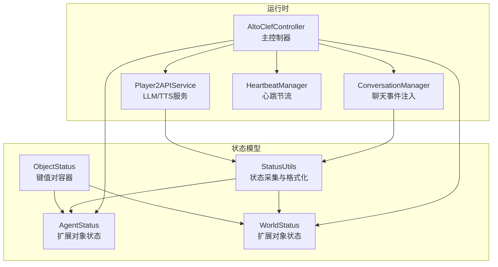
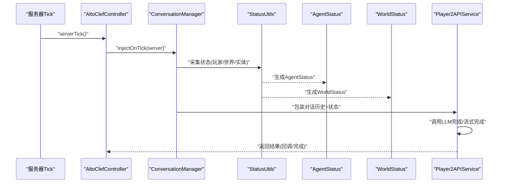
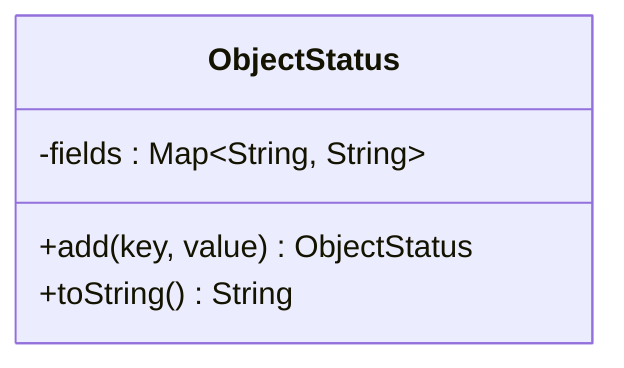
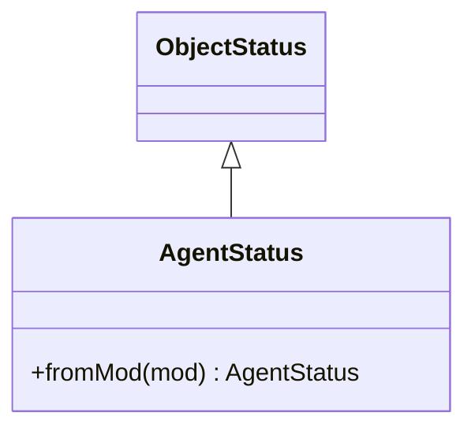
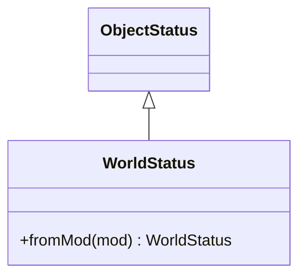
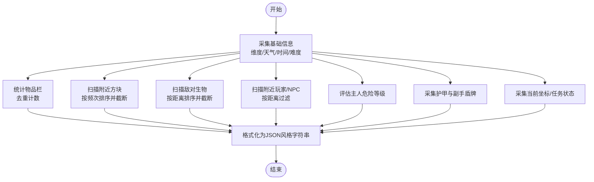
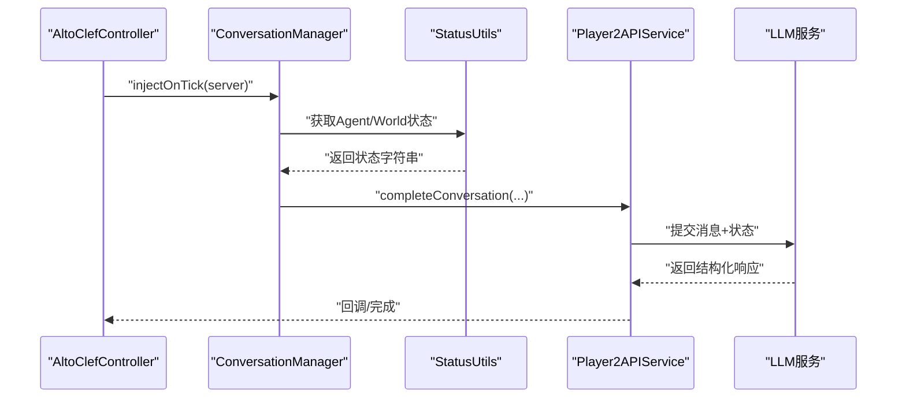
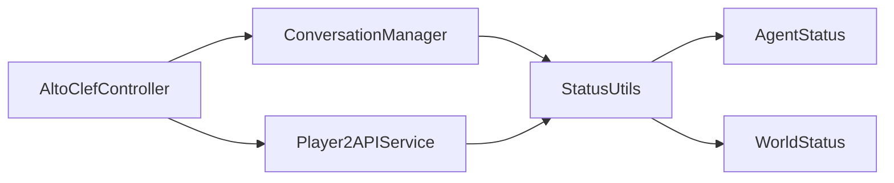

# 状态管理系统

<cite>
**本文引用的文件**
- [ObjectStatus.java](file://src/main/java/adris/altoclef/player2api/status/ObjectStatus.java)
- [AgentStatus.java](file://src/main/java/adris/altoclef/player2api/status/AgentStatus.java)
- [WorldStatus.java](file://src/main/java/adris/altoclef/player2api/status/WorldStatus.java)
- [StatusUtils.java](file://src/main/java/adris/altoclef/player2api/status/StatusUtils.java)
- [AltoClefController.java](file://src/main/java/adris/altoclef/AltoClefController.java)
- [ConversationManager.java](file://src/main/java/adris/altoclef/player2api/manager/ConversationManager.java)
- [Player2APIService.java](file://src/main/java/adris/altoclef/player2api/Player2APIService.java)
- [HeartbeatManager.java](file://src/main/java/adris/altoclef/player2api/manager/HeartbeatManager.java)
</cite>

## 目录
1. [引言](#引言)
2. [项目结构](#项目结构)
3. [核心组件](#核心组件)
4. [架构总览](#架构总览)
5. [详细组件分析](#详细组件分析)
6. [依赖分析](#依赖分析)
7. [性能考虑](#性能考虑)
8. [故障排查指南](#故障排查指南)
9. [结论](#结论)
10. [附录](#附录)

## 引言
本技术文档围绕状态管理系统展开，重点解析三类核心状态模型：AgentStatus（代理状态）、WorldStatus（世界状态）与 ObjectStatus（对象状态），以及 StatusUtils 工具类提供的状态采集与格式化能力。文档阐述状态管理在 AI NPC 系统中的作用机制，如何通过状态采集、封装与传递，确保 NPC 的感知与游戏世界保持同步；并给出状态查询、更新与监听的最佳实践，覆盖生命周期管理、冲突处理与性能优化策略，同时提供常见问题的解决方案与调试技巧。

## 项目结构
状态管理相关代码主要位于以下模块：
- 状态模型与工具：player2api/status 包含 ObjectStatus、AgentStatus、WorldStatus 与 StatusUtils
- 控制器与会话：AltoClefController 负责主循环与状态驱动；ConversationManager 负责聊天事件注入与会话调度；Player2APIService 负责与外部 LLM/TTS 服务交互
- 心跳与持久化：HeartbeatManager 提供心跳节流控制

图表来源
- [ObjectStatus.java:1-27](file://src/main/java/adris/altoclef/player2api/status/ObjectStatus.java#L1-L27)
- [AgentStatus.java:1-24](file://src/main/java/adris/altoclef/player2api/status/AgentStatus.java#L1-L24)
- [WorldStatus.java:1-20](file://src/main/java/adris/altoclef/player2api/status/WorldStatus.java#L1-L20)
- [StatusUtils.java:1-322](file://src/main/java/adris/altoclef/player2api/status/StatusUtils.java#L1-L322)
- [AltoClefController.java:1-200](file://src/main/java/adris/altoclef/AltoClefController.java#L1-L200)
- [ConversationManager.java:1-180](file://src/main/java/adris/altoclef/player2api/manager/ConversationManager.java#L1-L180)
- [Player2APIService.java:1-200](file://src/main/java/adris/altoclef/player2api/Player2APIService.java#L1-L200)
- [HeartbeatManager.java:1-46](file://src/main/java/adris/altoclef/player2api/manager/HeartbeatManager.java#L1-L46)

章节来源
- [AltoClefController.java:136-150](file://src/main/java/adris/altoclef/AltoClefController.java#L136-L150)
- [ConversationManager.java:147-165](file://src/main/java/adris/altoclef/player2api/manager/ConversationManager.java#L147-L165)

## 核心组件
- ObjectStatus：轻量级键值对容器，提供 add 与 toString 序列化输出，作为 AgentStatus 与 WorldStatus 的基类
- AgentStatus：面向“代理”（NPC）的状态聚合，包含位置、生命值、饥饿度、饱和度、物品栏、任务状态、氧气、护甲、游戏模式等
- WorldStatus：面向“世界”的状态聚合，包含天气、维度、重生点、附近方块、敌对生物、附近玩家、附近其他 NPC、主人危险等级、难度、时间信息等
- StatusUtils：状态采集与格式化工具集，提供从控制器上下文读取各类状态的方法，并以统一 JSON 风格字符串输出

章节来源
- [ObjectStatus.java:10-26](file://src/main/java/adris/altoclef/player2api/status/ObjectStatus.java#L10-L26)
- [AgentStatus.java:7-22](file://src/main/java/adris/altoclef/player2api/status/AgentStatus.java#L7-L22)
- [WorldStatus.java:6-18](file://src/main/java/adris/altoclef/player2api/status/WorldStatus.java#L6-L18)
- [StatusUtils.java:29-51](file://src/main/java/adris/altoclef/player2api/status/StatusUtils.java#L29-L51)

## 架构总览
状态管理贯穿“采集—封装—传递—消费”的闭环：
- 采集：由 StatusUtils 从控制器上下文读取当前世界与玩家数据
- 封装：AgentStatus/WorldStatus 基于 ObjectStatus 组合关键字段
- 传递：AltoClefController 在每 tick 中驱动 ConversationManager 注入事件，Player2APIService 将对话历史与状态包装后提交 LLM
- 消费：LLM 返回消息后，通过 Side Effects 对游戏世界产生实际影响（如移动、交互）

图表来源
- [AltoClefController.java:136-150](file://src/main/java/adris/altoclef/AltoClefController.java#L136-L150)
- [ConversationManager.java:147-165](file://src/main/java/adris/altoclef/player2api/manager/ConversationManager.java#L147-L165)
- [StatusUtils.java:29-51](file://src/main/java/adris/altoclef/player2api/status/StatusUtils.java#L29-L51)
- [AgentStatus.java:7-22](file://src/main/java/adris/altoclef/player2api/status/AgentStatus.java#L7-L22)
- [WorldStatus.java:6-18](file://src/main/java/adris/altoclef/player2api/status/WorldStatus.java#L6-L18)
- [Player2APIService.java:48-118](file://src/main/java/adris/altoclef/player2api/Player2APIService.java#L48-L118)

## 详细组件分析

### ObjectStatus 类设计与实现
- 设计理念：以不可变字符串键值对为核心，支持链式 add 并统一 toString 输出，便于快速拼接状态片段
- 数据结构：内部使用 HashMap 存储字段，线程安全方面依赖调用方保证
- 复杂度：add 为 O(1)，toString 遍历 O(N)
- 使用建议：仅存放最终可序列化的字符串值，避免在 toString 中进行昂贵计算

图表来源
- [ObjectStatus.java:1-27](file://src/main/java/adris/altoclef/player2api/status/ObjectStatus.java#L1-L27)

章节来源
- [ObjectStatus.java:10-26](file://src/main/java/adris/altoclef/player2api/status/ObjectStatus.java#L10-L26)

### AgentStatus：NPC 代理状态
- 职责：聚合与 NPC 直接相关的关键状态，如位置、健康、食物与饱和度、物品栏、当前任务、氧气、护甲、游戏模式
- 实现要点：基于 StatusUtils 的采集方法，将数值与描述性文本格式化为字符串键值对
- 同步策略：在每 tick 由控制器触发，结合 ConversationManager 注入事件，确保与世界状态一致

图表来源
- [AgentStatus.java:1-24](file://src/main/java/adris/altoclef/player2api/status/AgentStatus.java#L1-L24)
- [ObjectStatus.java:1-27](file://src/main/java/adris/altoclef/player2api/status/ObjectStatus.java#L1-L27)

章节来源
- [AgentStatus.java:7-22](file://src/main/java/adris/altoclef/player2api/status/AgentStatus.java#L7-L22)

### WorldStatus：世界环境状态
- 职责：聚合世界层面的状态，如天气、维度、重生点、附近方块类型分布、敌对生物、附近玩家与 NPC、主人危险等级、难度与时长信息
- 实现要点：通过半径裁剪与数量限制（如附近方块类型最多 N 种、敌对生物仅保留最近若干）降低提示词长度，提升 LLM 效率
- 性能考量：对实体扫描与排序进行阈值控制，避免大规模遍历导致卡顿

图表来源
- [WorldStatus.java:1-20](file://src/main/java/adris/altoclef/player2api/status/WorldStatus.java#L1-L20)
- [ObjectStatus.java:1-27](file://src/main/java/adris/altoclef/player2api/status/ObjectStatus.java#L1-L27)

章节来源
- [WorldStatus.java:6-18](file://src/main/java/adris/altoclef/player2api/status/WorldStatus.java#L6-L18)

### StatusUtils：状态采集与格式化工具
- 职责：提供统一的状态采集入口，将控制器上下文中的复杂对象转换为稳定的字符串表示
- 关键能力：
  - 物品栏统计与去重计数
  - 维度、天气、重生点、时间信息
  - 附近方块类型分布（按出现次数降序，限制种类数量）
  - 敌对生物与玩家/NPC 的近邻扫描与距离排序
  - 主人危险等级判定（死亡、危急、低血量、附近怪物、安全）
  - 护甲与副手盾牌状态
  - 当前坐标、任务树、难度、游戏模式等
- 性能优化：对大范围扫描设置半径与上限，对列表进行截断与排序，避免提示过载

图表来源
- [StatusUtils.java:29-51](file://src/main/java/adris/altoclef/player2api/status/StatusUtils.java#L29-L51)
- [StatusUtils.java:81-119](file://src/main/java/adris/altoclef/player2api/status/StatusUtils.java#L81-L119)
- [StatusUtils.java:125-154](file://src/main/java/adris/altoclef/player2api/status/StatusUtils.java#L125-L154)
- [StatusUtils.java:228-261](file://src/main/java/adris/altoclef/player2api/status/StatusUtils.java#L228-L261)
- [StatusUtils.java:168-193](file://src/main/java/adris/altoclef/player2api/status/StatusUtils.java#L168-L193)
- [StatusUtils.java:195-226](file://src/main/java/adris/altoclef/player2api/status/StatusUtils.java#L195-L226)
- [StatusUtils.java:289-292](file://src/main/java/adris/altoclef/player2api/status/StatusUtils.java#L289-L292)

章节来源
- [StatusUtils.java:29-51](file://src/main/java/adris/altoclef/player2api/status/StatusUtils.java#L29-L51)
- [StatusUtils.java:81-119](file://src/main/java/adris/altoclef/player2api/status/StatusUtils.java#L81-L119)
- [StatusUtils.java:125-154](file://src/main/java/adris/altoclef/player2api/status/StatusUtils.java#L125-L154)
- [StatusUtils.java:168-193](file://src/main/java/adris/altoclef/player2api/status/StatusUtils.java#L168-L193)
- [StatusUtils.java:195-226](file://src/main/java/adris/altoclef/player2api/status/StatusUtils.java#L195-L226)
- [StatusUtils.java:228-261](file://src/main/java/adris/altoclef/player2api/status/StatusUtils.java#L228-L261)
- [StatusUtils.java:289-292](file://src/main/java/adris/altoclef/player2api/status/StatusUtils.java#L289-L292)

### 状态在 AI NPC 系统中的作用机制
- 状态采集与封装：在每 tick 由控制器驱动，调用 StatusUtils 采集 AgentStatus 与 WorldStatus
- 事件注入与会话：ConversationManager 将用户消息与 NPC 内部事件注入队列，按优先级调度
- LLM 推理与响应：Player2APIService 将对话历史与最新状态一并提交 LLM，获得结构化回复
- 侧效应执行：根据 LLM 结果，通过 Side Effects 对游戏世界产生动作（移动、交互、说话等）

图表来源
- [AltoClefController.java:136-150](file://src/main/java/adris/altoclef/AltoClefController.java#L136-L150)
- [ConversationManager.java:147-165](file://src/main/java/adris/altoclef/player2api/manager/ConversationManager.java#L147-L165)
- [Player2APIService.java:48-118](file://src/main/java/adris/altoclef/player2api/Player2APIService.java#L48-L118)

章节来源
- [AltoClefController.java:136-150](file://src/main/java/adris/altoclef/AltoClefController.java#L136-L150)
- [ConversationManager.java:147-165](file://src/main/java/adris/altoclef/player2api/manager/ConversationManager.java#L147-L165)
- [Player2APIService.java:48-118](file://src/main/java/adris/altoclef/player2api/Player2APIService.java#L48-L118)

## 依赖分析
- 组件内聚与耦合
  - ObjectStatus 为纯数据容器，内聚高、耦合低
  - AgentStatus/WorldStatus 依赖 StatusUtils 进行状态采集，耦合集中在工具方法
  - 控制器与会话层通过接口解耦，控制器仅负责调度，状态采集与格式化独立于业务逻辑
- 外部依赖
  - 与 Minecraft 世界 API 的交互集中在 StatusUtils 中，避免状态模型直接依赖底层 API
  - Player2APIService 与 LLM/TTS 提供者解耦，通过注册表与配置切换

图表来源
- [StatusUtils.java:1-322](file://src/main/java/adris/altoclef/player2api/status/StatusUtils.java#L1-L322)
- [AgentStatus.java:1-24](file://src/main/java/adris/altoclef/player2api/status/AgentStatus.java#L1-L24)
- [WorldStatus.java:1-20](file://src/main/java/adris/altoclef/player2api/status/WorldStatus.java#L1-L20)
- [AltoClefController.java:1-200](file://src/main/java/adris/altoclef/AltoClefController.java#L1-L200)
- [ConversationManager.java:1-180](file://src/main/java/adris/altoclef/player2api/manager/ConversationManager.java#L1-L180)
- [Player2APIService.java:1-200](file://src/main/java/adris/altoclef/player2api/Player2APIService.java#L1-L200)

章节来源
- [AltoClefController.java:136-150](file://src/main/java/adris/altoclef/AltoClefController.java#L136-L150)
- [ConversationManager.java:147-165](file://src/main/java/adris/altoclef/player2api/manager/ConversationManager.java#L147-L165)
- [Player2APIService.java:48-118](file://src/main/java/adris/altoclef/player2api/Player2APIService.java#L48-L118)

## 性能考虑
- 扫描半径与上限
  - 附近方块类型：限制种类数量，避免提示词膨胀
  - 敌对生物与玩家/NPC：按距离排序并截断，减少无关实体干扰
- 计算复杂度控制
  - 对实体列表进行排序与截断，避免 O(N^2) 场景
  - 物品栏统计采用一次遍历与哈希计数，时间复杂度 O(N)
- I/O 与网络
  - 心跳节流：HeartbeatManager 通过时间戳控制发送频率，避免频繁请求
  - 流式对话：Player2APIService 支持流式完成，降低首 token 延迟带来的等待感
- 内存与序列化
  - ObjectStatus.toString 逐条拼接，建议在高频路径中复用已构建的字符串或缓存热点状态

章节来源
- [StatusUtils.java:78-119](file://src/main/java/adris/altoclef/player2api/status/StatusUtils.java#L78-L119)
- [StatusUtils.java:142-149](file://src/main/java/adris/altoclef/player2api/status/StatusUtils.java#L142-L149)
- [HeartbeatManager.java:30-41](file://src/main/java/adris/altoclef/player2api/manager/HeartbeatManager.java#L30-L41)
- [Player2APIService.java:109-118](file://src/main/java/adris/altoclef/player2api/Player2APIService.java#L109-L118)

## 故障排查指南
- 状态为空或异常
  - 症状：Agent/World 状态为空或不完整
  - 排查：确认 StatusUtils 的采集方法是否被正确调用；检查控制器 tick 是否正常执行
  - 参考路径：[AltoClefController.java:136-150](file://src/main/java/adris/altoclef/AltoClefController.java#L136-L150)
- 会话阻塞或无响应
  - 症状：消息无法下发或 LLM 无响应
  - 排查：检查 ConversationManager 的锁状态与可用 LLM 提供者；确认 Player2APIService 的请求体与响应格式
  - 参考路径：[ConversationManager.java:34-37](file://src/main/java/adris/altoclef/player2api/manager/ConversationManager.java#L34-L37), [Player2APIService.java:48-118](file://src/main/java/adris/altoclef/player2api/Player2APIService.java#L48-L118)
- 性能抖动
  - 症状：游戏帧率下降
  - 排查：检查附近实体扫描半径与截断逻辑；确认物品栏统计是否在高频路径重复计算
  - 参考路径：[StatusUtils.java:81-119](file://src/main/java/adris/altoclef/player2api/status/StatusUtils.java#L81-L119), [StatusUtils.java:125-154](file://src/main/java/adris/altoclef/player2api/status/StatusUtils.java#L125-L154)
- 心跳过于频繁
  - 症状：网络压力增大
  - 排查：检查 HeartbeatManager 的节流阈值与存储键
  - 参考路径：[HeartbeatManager.java:30-41](file://src/main/java/adris/altoclef/player2api/manager/HeartbeatManager.java#L30-L41)

章节来源
- [AltoClefController.java:136-150](file://src/main/java/adris/altoclef/AltoClefController.java#L136-L150)
- [ConversationManager.java:34-37](file://src/main/java/adris/altoclef/player2api/manager/ConversationManager.java#L34-L37)
- [Player2APIService.java:48-118](file://src/main/java/adris/altoclef/player2api/Player2APIService.java#L48-L118)
- [StatusUtils.java:81-119](file://src/main/java/adris/altoclef/player2api/status/StatusUtils.java#L81-L119)
- [StatusUtils.java:125-154](file://src/main/java/adris/altoclef/player2api/status/StatusUtils.java#L125-L154)
- [HeartbeatManager.java:30-41](file://src/main/java/adris/altoclef/player2api/manager/HeartbeatManager.java#L30-L41)

## 结论
状态管理系统通过简洁的 ObjectStatus 容器与强大的 StatusUtils 工具，实现了对 NPC 与世界状态的高效采集与格式化。配合控制器的 tick 驱动与会话层的事件注入，确保了状态与世界的同步与一致性。通过半径与上限控制、流式完成与心跳节流等策略，系统在功能完整性与性能之间取得了良好平衡。建议在实际部署中持续监控状态大小与 LLM 响应延迟，结合业务场景调整采样策略与缓存策略。

## 附录
- 最佳实践清单
  - 状态查询：优先使用 StatusUtils 的专用方法，避免直接访问底层 API
  - 状态更新：在控制器 tick 中集中采集，避免分散在各处造成重复计算
  - 状态监听：通过 ConversationManager 的事件队列与优先级机制实现异步处理
  - 生命周期管理：在 NPC 初始化阶段完成状态模型的构建与绑定，在停止阶段清理资源
  - 冲突处理：当多个来源同时修改同一字段时，采用“最后写入优先”或“合并策略”，并在日志中标注冲突
  - 性能优化：对大范围扫描设置合理阈值，尽量使用缓存与增量更新
- 常见问题速查
  - 状态为空：检查控制器 tick 与 StatusUtils 采集流程
  - 会话阻塞：检查锁状态与 LLM 提供者可用性
  - 卡顿：检查实体扫描半径与截断逻辑
  - 频繁心跳：调整 HeartbeatManager 的节流阈值