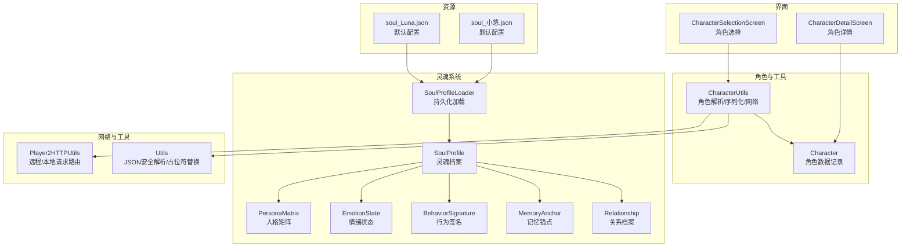
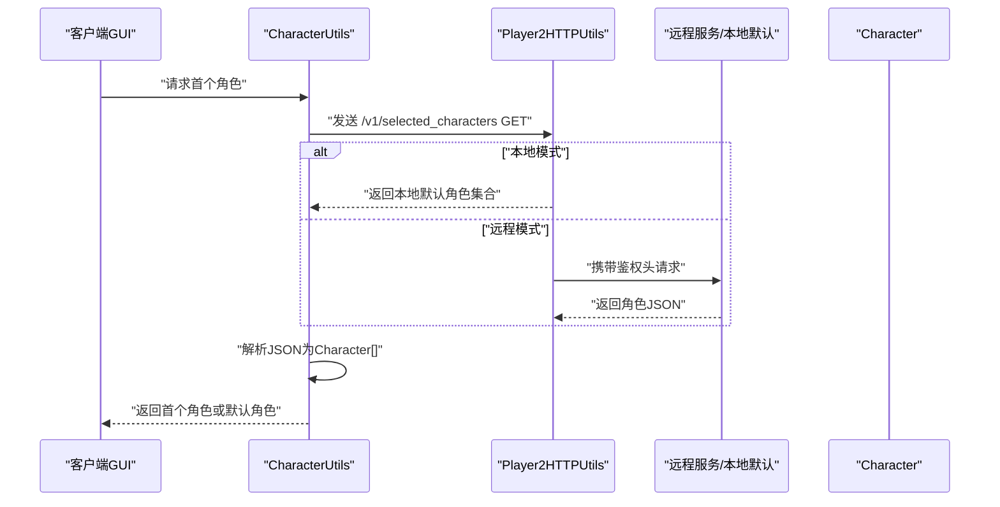
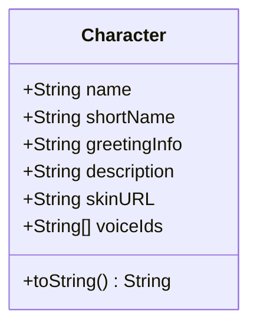
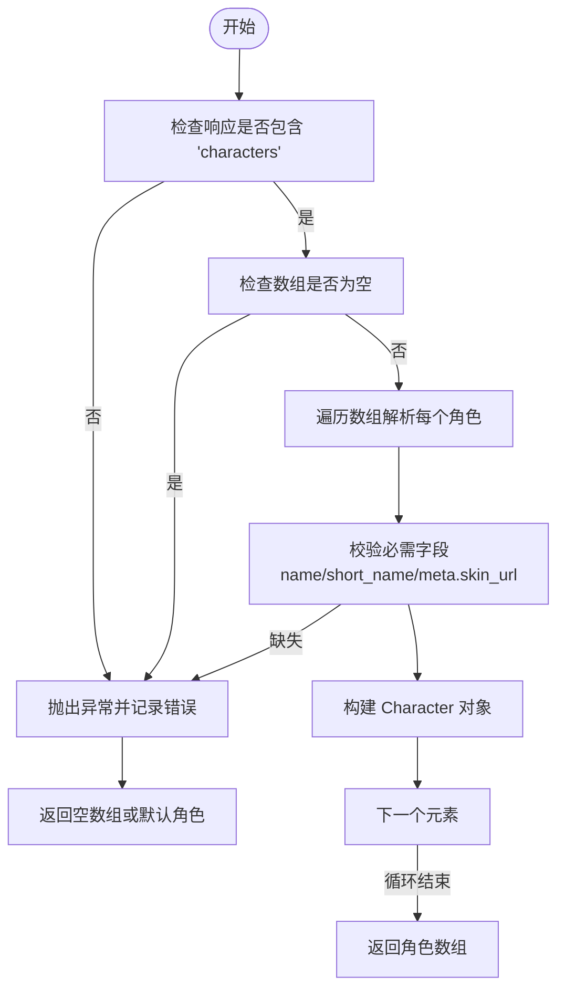
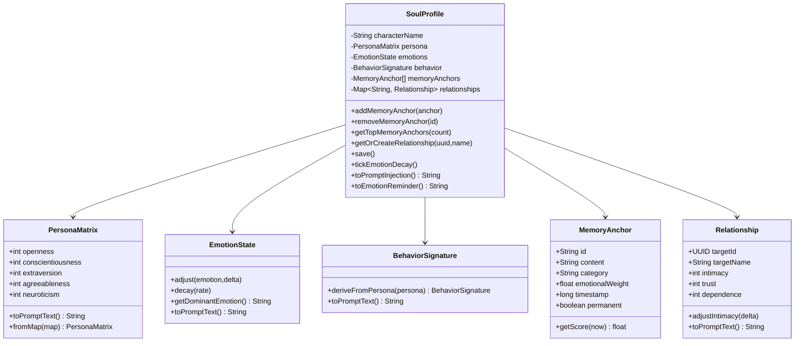
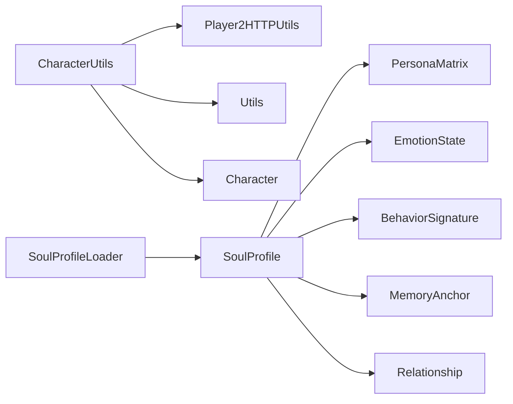

# 角色工具类

<cite>
**本文引用的文件**
- [CharacterUtils.java](file://src/main/java/adris/altoclef/player2api/utils/CharacterUtils.java)
- [Character.java](file://src/main/java/adris/altoclef/player2api/Character.java)
- [SoulProfile.java](file://src/main/java/adris/altoclef/player2api/soul/SoulProfile.java)
- [SoulProfileLoader.java](file://src/main/java/adris/altoclef/player2api/soul/SoulProfileLoader.java)
- [PersonaMatrix.java](file://src/main/java/adris/altoclef/player2api/soul/PersonaMatrix.java)
- [EmotionState.java](file://src/main/java/adris/altoclef/player2api/soul/EmotionState.java)
- [BehaviorSignature.java](file://src/main/java/adris/altoclef/player2api/soul/BehaviorSignature.java)
- [MemoryAnchor.java](file://src/main/java/adris/altoclef/player2api/soul/MemoryAnchor.java)
- [Relationship.java](file://src/main/java/adris/altoclef/player2api/soul/Relationship.java)
- [Player2HTTPUtils.java](file://src/main/java/adris/altoclef/player2api/utils/Player2HTTPUtils.java)
- [Utils.java](file://src/main/java/adris/altoclef/player2api/utils/Utils.java)
- [soul_Luna.json](file://src/main/resources/soul/soul_Luna.json)
- [soul_小悠.json](file://src/main/resources/soul/soul_小悠.json)
- [CharacterSelectionScreen.java](file://src/main/java/com/goodbird/player2npc/client/gui/CharacterSelectionScreen.java)
- [CharacterDetailScreen.java](file://src/main/java/com/goodbird/player2npc/client/gui/CharacterDetailScreen.java)
</cite>

## 目录
1. [简介](#简介)
2. [项目结构](#项目结构)
3. [核心组件](#核心组件)
4. [架构总览](#架构总览)
5. [详细组件分析](#详细组件分析)
6. [依赖分析](#依赖分析)
7. [性能考量](#性能考量)
8. [故障排查指南](#故障排查指南)
9. [结论](#结论)
10. [附录](#附录)

## 简介
本文件围绕角色工具类与角色系统展开，重点解释 CharacterUtils 类提供的角色操作能力（角色属性解析、角色信息验证、网络与本地序列化读写），并系统阐述 Character 数据结构设计、SoulProfile 与角色系统的关系及其对行为与外观的影响。文档同时给出角色创建、修改与查询的实践路径，说明角色工具类在 NPC 生成、角色切换与角色持久化中的应用，并覆盖角色数据验证规则、字符编码处理与国际化支持策略，以及数据一致性与性能优化建议。

## 项目结构
角色系统主要分布在以下模块：
- 角色数据与工具：Character、CharacterUtils
- 灵魂系统：SoulProfile、PersonaMatrix、EmotionState、BehaviorSignature、MemoryAnchor、Relationship、SoulProfileLoader
- 网络与本地适配：Player2HTTPUtils、Utils
- GUI 展示与交互：CharacterSelectionScreen、CharacterDetailScreen
- 默认配置样例：resources/soul 下的 JSON 模板

图表来源
- [CharacterUtils.java:15-142](file://src/main/java/adris/altoclef/player2api/utils/CharacterUtils.java#L15-L142)
- [Character.java:5-21](file://src/main/java/adris/altoclef/player2api/Character.java#L5-L21)
- [SoulProfile.java:14-174](file://src/main/java/adris/altoclef/player2api/soul/SoulProfile.java#L14-L174)
- [SoulProfileLoader.java:25-217](file://src/main/java/adris/altoclef/player2api/soul/SoulProfileLoader.java#L25-L217)
- [Player2HTTPUtils.java:41-152](file://src/main/java/adris/altoclef/player2api/utils/Player2HTTPUtils.java#L41-L152)
- [Utils.java:13-104](file://src/main/java/adris/altoclef/player2api/utils/Utils.java#L13-L104)
- [CharacterSelectionScreen.java:37-70](file://src/main/java/com/goodbird/player2npc/client/gui/CharacterSelectionScreen.java#L37-L70)
- [CharacterDetailScreen.java:18-31](file://src/main/java/com/goodbird/player2npc/client/gui/CharacterDetailScreen.java#L18-L31)
- [soul_Luna.json:1-61](file://src/main/resources/soul/soul_Luna.json#L1-L61)
- [soul_小悠.json:1-61](file://src/main/resources/soul/soul_小悠.json#L1-L61)

章节来源
- [CharacterUtils.java:15-142](file://src/main/java/adris/altoclef/player2api/utils/CharacterUtils.java#L15-L142)
- [Character.java:5-21](file://src/main/java/adris/altoclef/player2api/Character.java#L5-L21)
- [SoulProfile.java:14-174](file://src/main/java/adris/altoclef/player2api/soul/SoulProfile.java#L14-L174)
- [SoulProfileLoader.java:25-217](file://src/main/java/adris/altoclef/player2api/soul/SoulProfileLoader.java#L25-L217)
- [Player2HTTPUtils.java:41-152](file://src/main/java/adris/altoclef/player2api/utils/Player2HTTPUtils.java#L41-L152)
- [Utils.java:13-104](file://src/main/java/adris/altoclef/player2api/utils/Utils.java#L13-L104)
- [CharacterSelectionScreen.java:37-70](file://src/main/java/com/goodbird/player2npc/client/gui/CharacterSelectionScreen.java#L37-L70)
- [CharacterDetailScreen.java:18-31](file://src/main/java/com/goodbird/player2npc/client/gui/CharacterDetailScreen.java#L18-L31)
- [soul_Luna.json:1-61](file://src/main/resources/soul/soul_Luna.json#L1-L61)
- [soul_小悠.json:1-61](file://src/main/resources/soul/soul_小悠.json#L1-L61)

## 核心组件
- 角色数据结构：Character 是不可变记录类，封装角色名称、简称、问候语、描述、皮肤 URL 与语音 ID 数组。
- 角色工具：CharacterUtils 提供角色解析、网络请求、缓冲区与 NBT 序列化读写、默认角色回退等能力。
- 灵魂系统：SoulProfile 为核心状态容器，聚合 PersonaMatrix、EmotionState、BehaviorSignature、MemoryAnchor、Relationship，并负责持久化与提示注入。
- 网络与本地适配：Player2HTTPUtils 统一路由 LLM 请求与角色列表请求，支持本地模式返回默认角色。
- 工具与验证：Utils 提供 JSON 安全解析、数组转换、占位符替换等辅助；CharacterUtils 使用其安全读取字段。

章节来源
- [Character.java:5-21](file://src/main/java/adris/altoclef/player2api/Character.java#L5-L21)
- [CharacterUtils.java:15-142](file://src/main/java/adris/altoclef/player2api/utils/CharacterUtils.java#L15-L142)
- [SoulProfile.java:14-174](file://src/main/java/adris/altoclef/player2api/soul/SoulProfile.java#L14-L174)
- [Player2HTTPUtils.java:41-152](file://src/main/java/adris/altoclef/player2api/utils/Player2HTTPUtils.java#L41-L152)
- [Utils.java:13-104](file://src/main/java/adris/altoclef/player2api/utils/Utils.java#L13-L104)

## 架构总览
角色工具类在系统中的位置与交互如下：

图表来源
- [CharacterUtils.java:74-81](file://src/main/java/adris/altoclef/player2api/utils/CharacterUtils.java#L74-L81)
- [Player2HTTPUtils.java:45-88](file://src/main/java/adris/altoclef/player2api/utils/Player2HTTPUtils.java#L45-L88)
- [Player2HTTPUtils.java:114-134](file://src/main/java/adris/altoclef/player2api/utils/Player2HTTPUtils.java#L114-L134)

章节来源
- [CharacterUtils.java:74-81](file://src/main/java/adris/altoclef/player2api/utils/CharacterUtils.java#L74-L81)
- [Player2HTTPUtils.java:45-88](file://src/main/java/adris/altoclef/player2api/utils/Player2HTTPUtils.java#L45-L88)
- [Player2HTTPUtils.java:114-134](file://src/main/java/adris/altoclef/player2api/utils/Player2HTTPUtils.java#L114-L134)

## 详细组件分析

### 角色数据结构：Character
- 字段：name、shortName、greetingInfo、description、skinURL、voiceIds[]
- 特点：不可变记录类，提供 toString 便于日志输出与调试。
- 用途：作为角色工具类与 GUI 的统一载体，贯穿网络传输、缓冲区序列化与 NBT 存档。

图表来源
- [Character.java:5-21](file://src/main/java/adris/altoclef/player2api/Character.java#L5-L21)

章节来源
- [Character.java:5-21](file://src/main/java/adris/altoclef/player2api/Character.java#L5-L21)

### 角色工具类：CharacterUtils
- 角色解析与验证
  - parseCharacters：从响应映射中提取 characters 数组，逐项校验必需字段（name、short_name、meta.skin_url），缺失则抛出异常并回退为空数组。
  - parseFirstCharacter：返回首个角色，若无则返回默认角色。
- 网络请求
  - requestCharacters/requestFirstCharacter：调用 Player2HTTPUtils 发送 /v1/selected_characters 请求，本地模式直接返回本地默认角色集合。
- 序列化与反序列化
  - read/writeFromBuf：基于 FriendlyByteBuf 的 UTF 编码读写，保证跨网络传输一致性。
  - read/writeFromNBT：基于 CompoundTag/ListTag 的存档读写，支持模组持久化。
- 默认角色
  - DEFAULT_CHARACTER：内置默认角色，作为解析失败或网络异常时的兜底。

图表来源
- [CharacterUtils.java:25-63](file://src/main/java/adris/altoclef/player2api/utils/CharacterUtils.java#L25-L63)

章节来源
- [CharacterUtils.java:25-63](file://src/main/java/adris/altoclef/player2api/utils/CharacterUtils.java#L25-L63)
- [CharacterUtils.java:74-81](file://src/main/java/adris/altoclef/player2api/utils/CharacterUtils.java#L74-L81)
- [CharacterUtils.java:83-142](file://src/main/java/adris/altoclef/player2api/utils/CharacterUtils.java#L83-L142)

### 灵魂档案：SoulProfile 与角色系统的关系
- 设计目标：以“灵魂”为核心，承载 NPC 的人格、情绪、行为倾向、记忆锚点与关系图谱，驱动其行为与外观表现。
- 关键关系
  - PersonaMatrix：基于大五人格模型，决定初始与衍生行为签名。
  - EmotionState：8 种基础情绪，支持自然衰减与强度指导。
  - BehaviorSignature：从 PersonaMatrix 推导而来，可手动覆盖。
  - MemoryAnchor：重要情感事件的永久记忆锚点，按评分与时间衰减筛选。
  - Relationship：与玩家的亲密度、信任度、依赖度与称谓随互动演进。
- 提示注入：toPromptInjection 将人格、情绪、记忆锚点、关系与行为签名整合为 LLM 的系统提示注入片段；toEmotionReminder 输出当前主导情绪提醒。
- 持久化：SoulProfileLoader 负责从资源模板复制到运行时配置目录并保存/加载 JSON。

图表来源
- [SoulProfile.java:14-174](file://src/main/java/adris/altoclef/player2api/soul/SoulProfile.java#L14-L174)
- [PersonaMatrix.java:10-110](file://src/main/java/adris/altoclef/player2api/soul/PersonaMatrix.java#L10-L110)
- [EmotionState.java:9-128](file://src/main/java/adris/altoclef/player2api/soul/EmotionState.java#L9-L128)
- [BehaviorSignature.java:10-124](file://src/main/java/adris/altoclef/player2api/soul/BehaviorSignature.java#L10-L124)
- [MemoryAnchor.java:8-61](file://src/main/java/adris/altoclef/player2api/soul/MemoryAnchor.java#L8-L61)
- [Relationship.java:8-70](file://src/main/java/adris/altoclef/player2api/soul/Relationship.java#L8-L70)

章节来源
- [SoulProfile.java:14-174](file://src/main/java/adris/altoclef/player2api/soul/SoulProfile.java#L14-L174)
- [PersonaMatrix.java:10-110](file://src/main/java/adris/altoclef/player2api/soul/PersonaMatrix.java#L10-L110)
- [EmotionState.java:9-128](file://src/main/java/adris/altoclef/player2api/soul/EmotionState.java#L9-L128)
- [BehaviorSignature.java:10-124](file://src/main/java/adris/altoclef/player2api/soul/BehaviorSignature.java#L10-L124)
- [MemoryAnchor.java:8-61](file://src/main/java/adris/altoclef/player2api/soul/MemoryAnchor.java#L8-L61)
- [Relationship.java:8-70](file://src/main/java/adris/altoclef/player2api/soul/Relationship.java#L8-L70)

### 角色创建、修改与查询（实践路径）
- 创建/查询角色
  - 通过 CharacterUtils.requestFirstCharacter 或 requestCharacters 获取角色列表，本地模式将返回本地默认角色集合。
  - GUI 中 CharacterSelectionScreen 会异步加载并渲染角色卡片，点击后进入 CharacterDetailScreen 查看详情。
- 修改角色
  - 角色外观与行为由 SoulProfile 决定：可通过调整 PersonaMatrix、EmotionState、BehaviorSignature、MemoryAnchor 与 Relationship 来改变 NPC 的表现。
  - 使用 SoulProfileLoader.save 将当前状态保存至运行时配置目录下的 soul_{name}.json。
- 查询与注入
  - toPromptInjection 将当前灵魂状态注入 LLM 提示词，toEmotionReminder 输出情绪提醒，辅助对话与行为一致性。

章节来源
- [CharacterUtils.java:74-81](file://src/main/java/adris/altoclef/player2api/utils/CharacterUtils.java#L74-L81)
- [CharacterSelectionScreen.java:37-70](file://src/main/java/com/goodbird/player2npc/client/gui/CharacterSelectionScreen.java#L37-L70)
- [CharacterDetailScreen.java:18-31](file://src/main/java/com/goodbird/player2npc/client/gui/CharacterDetailScreen.java#L18-L31)
- [SoulProfileLoader.java:62-130](file://src/main/java/adris/altoclef/player2api/soul/SoulProfileLoader.java#L62-L130)
- [SoulProfile.java:133-172](file://src/main/java/adris/altoclef/player2api/soul/SoulProfile.java#L133-L172)

### 角色工具类的应用场景
- NPC 生成：通过角色列表与默认角色回退机制，确保即使网络异常也能生成可用 NPC。
- 角色切换：GUI 层基于 CharacterSelectionScreen 展示角色卡片，用户点击后进入详情页，底层依赖 CharacterUtils 的解析与序列化能力。
- 角色持久化：SoulProfileLoader 将角色的灵魂状态保存为 JSON 文件，重启后可恢复。

章节来源
- [CharacterUtils.java:74-81](file://src/main/java/adris/altoclef/player2api/utils/CharacterUtils.java#L74-L81)
- [CharacterSelectionScreen.java:37-70](file://src/main/java/com/goodbird/player2npc/client/gui/CharacterSelectionScreen.java#L37-L70)
- [SoulProfileLoader.java:62-130](file://src/main/java/adris/altoclef/player2api/soul/SoulProfileLoader.java#L62-L130)

### 数据验证规则、字符编码与国际化
- 数据验证
  - CharacterUtils 在解析角色 JSON 时严格校验必需字段，缺失即抛错并回退，避免空指针与不一致状态。
  - Utils 提供 getStringJsonSafely、getStringArrayJsonSafely 等安全读取方法，防止类型不匹配与空值异常。
- 字符编码
  - read/writeFromBuf 使用 UTF 编码，确保跨平台与跨版本兼容。
  - JSON 解析采用安全策略，支持从非标准格式中提取 JSON 对象或回退为消息包装对象。
- 国际化
  - 项目资源包含多语言 JSON（如 zh_cn.json、en_us.json），角色问候语与描述可配合本地化资源使用。

章节来源
- [CharacterUtils.java:25-63](file://src/main/java/adris/altoclef/player2api/utils/CharacterUtils.java#L25-L63)
- [Utils.java:23-88](file://src/main/java/adris/altoclef/player2api/utils/Utils.java#L23-L88)
- [Player2HTTPUtils.java:114-134](file://src/main/java/adris/altoclef/player2api/utils/Player2HTTPUtils.java#L114-L134)

## 依赖分析
- 角色工具类依赖
  - Player2HTTPUtils：统一请求路由，区分本地/远程模式。
  - Utils：JSON 安全解析与数组转换。
  - Character：作为数据载体。
- 灵魂系统内部耦合
  - SoulProfile 聚合 PersonaMatrix、EmotionState、BehaviorSignature、MemoryAnchor、Relationship，彼此通过 toPromptText 协作形成完整的提示注入。
- 持久化依赖
  - SoulProfileLoader 依赖 DirUtil 获取配置目录，依赖 Gson 进行 JSON 序列化。

图表来源
- [CharacterUtils.java:3-13](file://src/main/java/adris/altoclef/player2api/utils/CharacterUtils.java#L3-L13)
- [Player2HTTPUtils.java:20-28](file://src/main/java/adris/altoclef/player2api/utils/Player2HTTPUtils.java#L20-L28)
- [Utils.java:3-11](file://src/main/java/adris/altoclef/player2api/utils/Utils.java#L3-L11)
- [SoulProfile.java:19-54](file://src/main/java/adris/altoclef/player2api/soul/SoulProfile.java#L19-L54)
- [SoulProfileLoader.java:3-20](file://src/main/java/adris/altoclef/player2api/soul/SoulProfileLoader.java#L3-L20)

章节来源
- [CharacterUtils.java:3-13](file://src/main/java/adris/altoclef/player2api/utils/CharacterUtils.java#L3-L13)
- [Player2HTTPUtils.java:20-28](file://src/main/java/adris/altoclef/player2api/utils/Player2HTTPUtils.java#L20-L28)
- [Utils.java:3-11](file://src/main/java/adris/altoclef/player2api/utils/Utils.java#L3-L11)
- [SoulProfile.java:19-54](file://src/main/java/adris/altoclef/player2api/soul/SoulProfile.java#L19-L54)
- [SoulProfileLoader.java:3-20](file://src/main/java/adris/altoclef/player2api/soul/SoulProfileLoader.java#L3-L20)

## 性能考量
- 解析与序列化
  - JSON 解析采用安全策略，优先尝试直接解析，其次提取对象，最后回退为消息包装，减少异常开销。
  - Buffer/NBT 读写使用 UTF 编码与固定数组长度，避免重复扩容与字符串拼接。
- 灵魂状态更新
  - 情绪自然衰减按 30 秒周期进行，降低高频计算成本。
  - 记忆锚点清理按评分排序并限制上限，避免无限增长导致的检索与注入成本上升。
- GUI 渲染
  - 角色卡片按屏幕宽度动态布局，减少无效绘制区域。

章节来源
- [Utils.java:61-88](file://src/main/java/adris/altoclef/player2api/utils/Utils.java#L61-L88)
- [SoulProfile.java:120-126](file://src/main/java/adris/altoclef/player2api/soul/SoulProfile.java#L120-L126)
- [SoulProfile.java:81-91](file://src/main/java/adris/altoclef/player2api/soul/SoulProfile.java#L81-L91)
- [CharacterSelectionScreen.java:54-70](file://src/main/java/com/goodbird/player2npc/client/gui/CharacterSelectionScreen.java#L54-L70)

## 故障排查指南
- 角色解析失败
  - 现象：返回空数组或默认角色。
  - 排查：确认响应包含 characters 字段且非空；检查 name、short_name、meta.skin_url 是否存在；查看控制台错误日志。
- 网络请求异常
  - 现象：本地模式下返回空或默认角色。
  - 排查：确认本地模式开关与 Provider 配置；检查鉴权流程与 Token 获取。
- 持久化失败
  - 现象：保存/加载抛出异常。
  - 排查：确认配置目录可写；检查 JSON 结构与字段类型；核对文件名清洗逻辑（仅允许中文、英文、数字与下划线）。
- GUI 不显示角色
  - 现象：角色列表为空。
  - 排查：确认异步加载回调已设置；检查角色卡片创建逻辑与布局参数。

章节来源
- [CharacterUtils.java:25-63](file://src/main/java/adris/altoclef/player2api/utils/CharacterUtils.java#L25-L63)
- [Player2HTTPUtils.java:45-88](file://src/main/java/adris/altoclef/player2api/utils/Player2HTTPUtils.java#L45-L88)
- [SoulProfileLoader.java:42-56](file://src/main/java/adris/altoclef/player2api/soul/SoulProfileLoader.java#L42-L56)
- [CharacterSelectionScreen.java:37-51](file://src/main/java/com/goodbird/player2npc/client/gui/CharacterSelectionScreen.java#L37-L51)

## 结论
角色工具类与灵魂系统共同构成了角色的核心能力：前者负责角色数据的解析、网络与序列化，后者负责角色的人格、情绪、行为与记忆的建模与持久化。通过严格的验证规则、UTF 编码与安全 JSON 解析，系统在保证数据一致性的同时兼顾性能与可维护性。GUI 层提供直观的角色选择与详情展示，结合 SoulProfile 的提示注入能力，使 NPC 的行为与外观更贴近玩家预期。

## 附录
- 默认配置参考
  - [soul_Luna.json:1-61](file://src/main/resources/soul/soul_Luna.json#L1-L61)
  - [soul_小悠.json:1-61](file://src/main/resources/soul/soul_小悠.json#L1-L61)
- 相关实现路径
  - 角色解析与网络：[CharacterUtils.java:25-81](file://src/main/java/adris/altoclef/player2api/utils/CharacterUtils.java#L25-L81)、[Player2HTTPUtils.java:45-88](file://src/main/java/adris/altoclef/player2api/utils/Player2HTTPUtils.java#L45-L88)
  - 序列化与反序列化：[CharacterUtils.java:83-142](file://src/main/java/adris/altoclef/player2api/utils/CharacterUtils.java#L83-L142)
  - 灵魂状态与提示注入：[SoulProfile.java:133-172](file://src/main/java/adris/altoclef/player2api/soul/SoulProfile.java#L133-L172)
  - 持久化保存：[SoulProfileLoader.java:62-130](file://src/main/java/adris/altoclef/player2api/soul/SoulProfileLoader.java#L62-L130)