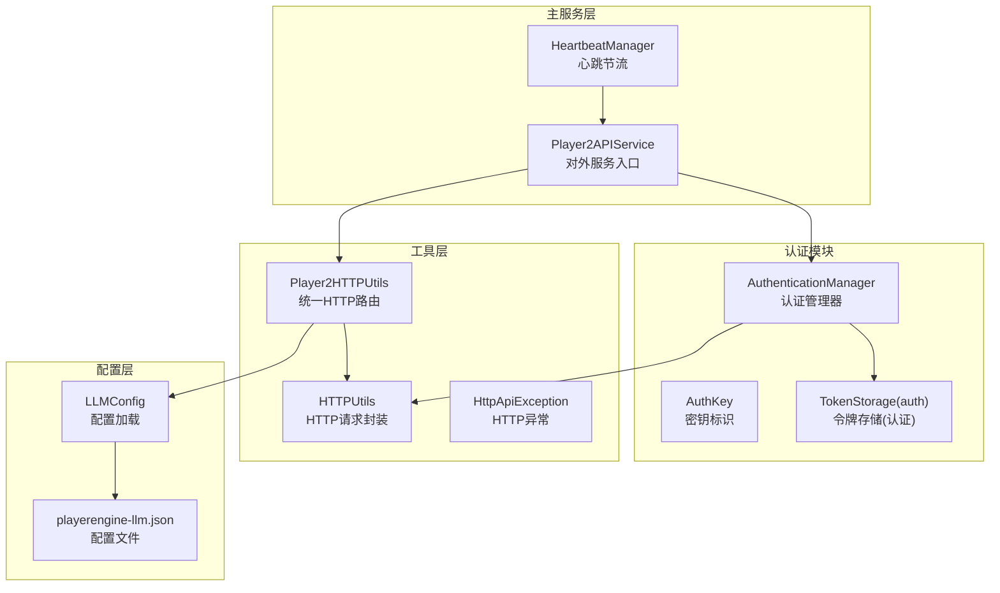
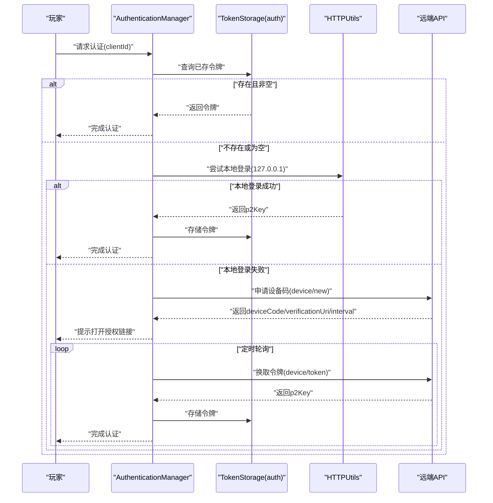
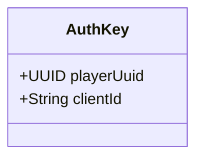
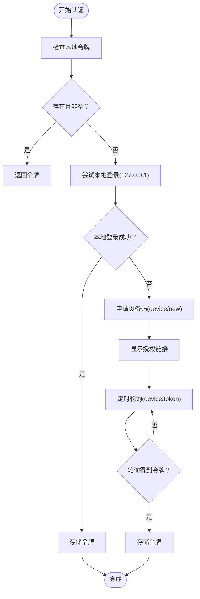
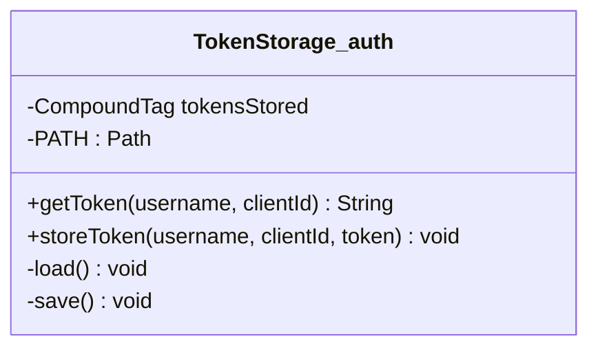
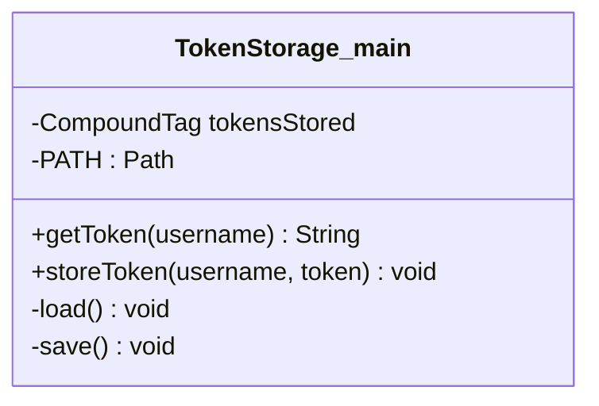
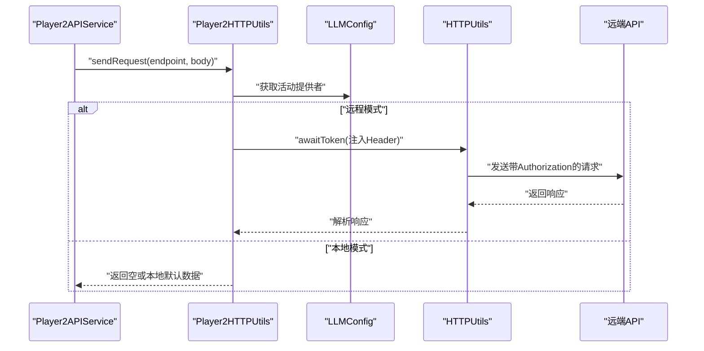
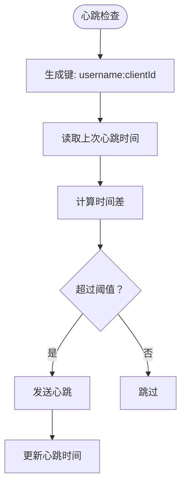
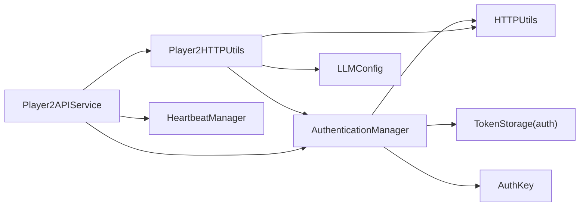

# 认证工具类

<cite>
**本文引用的文件**
- [AuthKey.java](file://src/main/java/adris/altoclef/player2api/auth/AuthKey.java)
- [AuthenticationManager.java](file://src/main/java/adris/altoclef/player2api/auth/AuthenticationManager.java)
- [TokenStorage.java（认证模块）](file://src/main/java/adris/altoclef/player2api/auth/TokenStorage.java)
- [TokenStorage.java（主模块）](file://src/main/java/adris/altoclef/player2api/TokenStorage.java)
- [HTTPUtils.java](file://src/main/java/adris/altoclef/player2api/utils/HTTPUtils.java)
- [HttpApiException.java](file://src/main/java/adris/altoclef/player2api/utils/HttpApiException.java)
- [Player2HTTPUtils.java](file://src/main/java/adris/altoclef/player2api/utils/Player2HTTPUtils.java)
- [Player2APIService.java](file://src/main/java/adris/altoclef/player2api/Player2APIService.java)
- [HeartbeatManager.java](file://src/main/java/adris/altoclef/player2api/manager/HeartbeatManager.java)
- [LLMConfig.java](file://src/main/java/adris/altoclef/player2api/llm/LLMConfig.java)
- [playerengine-llm.json](file://run/config/playerengine-llm.json)
</cite>

## 目录
1. [简介](#简介)
2. [项目结构](#项目结构)
3. [核心组件](#核心组件)
4. [架构总览](#架构总览)
5. [组件详解](#组件详解)
6. [依赖关系分析](#依赖关系分析)
7. [性能考量](#性能考量)
8. [故障排查指南](#故障排查指南)
9. [结论](#结论)
10. [附录](#附录)

## 简介
本文件面向认证工具类的技术文档，聚焦以下目标：
- 深入解释 AuthKey 类的密钥标识机制
- 详述 AuthenticationManager 的认证流程：用户认证、会话管理与权限验证
- 解析 TokenStorage 的令牌存储设计：加密、过期管理与自动刷新
- 对比“认证模块 TokenStorage”与“主模块 TokenStorage”的差异与适用场景
- 提供认证流程的代码路径示例：API 密钥配置、用户登录、令牌续期
- 总结安全最佳实践、密钥轮换策略与审计日志建议
- 解决认证失败、令牌过期与安全漏洞防护问题

## 项目结构
认证相关代码主要分布在 player2api 子模块中，采用分层与职责分离：
- auth 层：认证核心（AuthKey、AuthenticationManager、TokenStorage）
- utils 层：HTTP 工具（HTTPUtils、HttpApiException、Player2HTTPUtils）
- 主服务层：Player2APIService 统一对外接口，调度认证与请求
- 管理层：HeartbeatManager 负责心跳节流
- 配置层：LLMConfig 与配置文件负责提供者选择与密钥注入

图表来源
- [AuthenticationManager.java:18-150](file://src/main/java/adris/altoclef/player2api/auth/AuthenticationManager.java#L18-L150)
- [TokenStorage.java（认证模块）:11-58](file://src/main/java/adris/altoclef/player2api/auth/TokenStorage.java#L11-L58)
- [HTTPUtils.java:20-88](file://src/main/java/adris/altoclef/player2api/utils/HTTPUtils.java#L20-L88)
- [Player2HTTPUtils.java:41-152](file://src/main/java/adris/altoclef/player2api/utils/Player2HTTPUtils.java#L41-L152)
- [Player2APIService.java:35-274](file://src/main/java/adris/altoclef/player2api/Player2APIService.java#L35-L274)
- [HeartbeatManager.java:22-46](file://src/main/java/adris/altoclef/player2api/manager/HeartbeatManager.java#L22-L46)
- [LLMConfig.java:19-79](file://src/main/java/adris/altoclef/player2api/llm/LLMConfig.java#L19-L79)
- [playerengine-llm.json:1-79](file://run/config/playerengine-llm.json#L1-L79)

章节来源
- [AuthenticationManager.java:18-150](file://src/main/java/adris/altoclef/player2api/auth/AuthenticationManager.java#L18-L150)
- [Player2APIService.java:35-274](file://src/main/java/adris/altoclef/player2api/Player2APIService.java#L35-L274)

## 核心组件
- AuthKey：轻量级不可变标识，组合玩家 UUID 与客户端 ID，用于区分同一玩家在不同客户端下的独立认证上下文。
- AuthenticationManager：负责设备码认证流程、本地回环登录尝试、轮询等待授权完成，并将最终令牌持久化。
- TokenStorage（认证模块）：基于 NBT 文件的本地令牌存储，键空间为“用户名:clientId”，支持读取与保存。
- TokenStorage（主模块）：与认证模块同名但职责不同，存储单一“用户名”对应的令牌，用于主模块内部使用。
- HTTPUtils/Player2HTTPUtils：封装 HTTP 请求与响应解析；在远程模式下注入 Authorization 与自定义 Header。
- HeartbeatManager：按时间窗口节流发送健康心跳，避免频繁请求。
- LLMConfig 与配置文件：决定是否启用远程模式、提供者与密钥来源。

章节来源
- [AuthKey.java:1-5](file://src/main/java/adris/altoclef/player2api/auth/AuthKey.java#L1-L5)
- [AuthenticationManager.java:18-150](file://src/main/java/adris/altoclef/player2api/auth/AuthenticationManager.java#L18-L150)
- [TokenStorage.java（认证模块）:11-58](file://src/main/java/adris/altoclef/player2api/auth/TokenStorage.java#L11-L58)
- [TokenStorage.java（主模块）:11-55](file://src/main/java/adris/altoclef/player2api/TokenStorage.java#L11-L55)
- [HTTPUtils.java:20-88](file://src/main/java/adris/altoclef/player2api/utils/HTTPUtils.java#L20-L88)
- [Player2HTTPUtils.java:41-152](file://src/main/java/adris/altoclef/player2api/utils/Player2HTTPUtils.java#L41-L152)
- [HeartbeatManager.java:22-46](file://src/main/java/adris/altoclef/player2api/manager/HeartbeatManager.java#L22-L46)
- [LLMConfig.java:19-79](file://src/main/java/adris/altoclef/player2api/llm/LLMConfig.java#L19-L79)
- [playerengine-llm.json:1-79](file://run/config/playerengine-llm.json#L1-L79)

## 架构总览
认证系统采用“本地优先 + 设备码授权”的双通道策略：
- 优先尝试本地回环登录（127.0.0.1），成功即直接获取令牌并结束流程
- 若本地登录失败，则启动设备码授权流程，定时轮询换取令牌
- 成功后将令牌持久化至本地 NBT 文件，后续直接复用
- 远程模式下，所有对外请求均携带 Authorization 与自定义 Header

图表来源
- [AuthenticationManager.java:43-150](file://src/main/java/adris/altoclef/player2api/auth/AuthenticationManager.java#L43-L150)
- [HTTPUtils.java:23-88](file://src/main/java/adris/altoclef/player2api/utils/HTTPUtils.java#L23-L88)
- [TokenStorage.java（认证模块）:24-32](file://src/main/java/adris/altoclef/player2api/auth/TokenStorage.java#L24-L32)

## 组件详解

### AuthKey 类：密钥标识机制
- 结构：由玩家 UUID 与客户端 ID 组成的不可变记录类型
- 作用：作为认证上下文的唯一键，确保同一玩家在不同客户端下的令牌隔离
- 使用场景：映射进行中的认证任务、轮询任务、令牌存储键空间

图表来源
- [AuthKey.java:1-5](file://src/main/java/adris/altoclef/player2api/auth/AuthKey.java#L1-L5)

章节来源
- [AuthKey.java:1-5](file://src/main/java/adris/altoclef/player2api/auth/AuthKey.java#L1-L5)

### AuthenticationManager：认证管理器
- 功能要点
  - 本地回环登录优先：向本地服务发起登录请求，成功即完成认证
  - 设备码授权：失败时启动设备码流程，定时轮询换取令牌
  - 并发控制：对同一 AuthKey 的重复认证返回相同 Future，避免重复发起
  - 会话管理：通过线程池与定时调度器管理异步认证与轮询
  - 权限验证：对外请求统一由 Player2HTTPUtils 注入 Authorization 与 Header
- 关键流程
  - 查询本地令牌：若存在且非空，直接返回
  - 本地登录尝试：失败则进入设备码流程
  - 设备码申请与轮询：定时发送换取令牌请求，成功后完成认证并持久化
  - 异常处理：捕获 HTTP 异常并区分“authorization_pending”等状态

图表来源
- [AuthenticationManager.java:43-150](file://src/main/java/adris/altoclef/player2api/auth/AuthenticationManager.java#L43-L150)

章节来源
- [AuthenticationManager.java:18-150](file://src/main/java/adris/altoclef/player2api/auth/AuthenticationManager.java#L18-L150)

### TokenStorage（认证模块）：令牌存储系统
- 设计要点
  - 基于 NBT 文件的本地持久化，文件路径位于游戏目录
  - 键空间格式：“用户名:clientId”，支持多客户端/多玩家隔离
  - 读写操作：load 在构造时加载，save 在每次写入后同步落盘
- 与主模块 TokenStorage 的区别
  - 认证模块 TokenStorage：按“用户名:clientId”维度存储，适配多客户端场景
  - 主模块 TokenStorage：按“用户名”维度存储，用于主模块内部逻辑
- 与加密、过期管理的关系
  - 当前实现未对令牌内容进行加密存储
  - 未内置令牌过期校验逻辑，依赖外部 API 行为与业务侧策略

图表来源
- [TokenStorage.java（认证模块）:11-58](file://src/main/java/adris/altoclef/player2api/auth/TokenStorage.java#L11-L58)

章节来源
- [TokenStorage.java（认证模块）:11-58](file://src/main/java/adris/altoclef/player2api/auth/TokenStorage.java#L11-L58)

### TokenStorage（主模块）：主模块令牌存储
- 设计要点
  - 同样基于 NBT 文件的本地存储
  - 键空间为“用户名”，适用于单一令牌场景
- 使用场景
  - 主模块内部逻辑使用，不参与多客户端隔离
  - 与认证模块 TokenStorage 并行存在，职责不同

图表来源
- [TokenStorage.java（主模块）:11-55](file://src/main/java/adris/altoclef/player2api/TokenStorage.java#L11-L55)

章节来源
- [TokenStorage.java（主模块）:11-55](file://src/main/java/adris/altoclef/player2api/TokenStorage.java#L11-L55)

### HTTP 工具链：请求封装与异常处理
- HTTPUtils
  - 统一封装 HTTP 请求，支持 GET/POST、自定义 Header、错误响应解析
  - 将非 200 响应抛出 HttpApiException，便于上层区分处理
- Player2HTTPUtils
  - 根据 LLMConfig 判断是否为远程模式
  - 远程模式下注入 Authorization 与自定义 Header，并转发到远端 API
  - 本地模式下对部分端点返回空结果或本地默认数据

图表来源
- [Player2HTTPUtils.java:45-88](file://src/main/java/adris/altoclef/player2api/utils/Player2HTTPUtils.java#L45-L88)
- [HTTPUtils.java:23-88](file://src/main/java/adris/altoclef/player2api/utils/HTTPUtils.java#L23-L88)
- [LLMConfig.java:41-79](file://src/main/java/adris/altoclef/player2api/llm/LLMConfig.java#L41-L79)

章节来源
- [HTTPUtils.java:20-88](file://src/main/java/adris/altoclef/player2api/utils/HTTPUtils.java#L20-L88)
- [HttpApiException.java:18-33](file://src/main/java/adris/altoclef/player2api/utils/HttpApiException.java#L18-L33)
- [Player2HTTPUtils.java:41-152](file://src/main/java/adris/altoclef/player2api/utils/Player2HTTPUtils.java#L41-L152)
- [LLMConfig.java:19-79](file://src/main/java/adris/altoclef/player2api/llm/LLMConfig.java#L19-L79)

### 心跳管理：节流与持久化
- HeartbeatManager
  - 以“用户名:clientId”为键，记录最近一次心跳时间
  - 通过时间差判断是否需要发送心跳，避免过于频繁
  - 使用 NBT 持久化，随游戏存档一起保存

图表来源
- [HeartbeatManager.java:26-41](file://src/main/java/adris/altoclef/player2api/manager/HeartbeatManager.java#L26-L41)

章节来源
- [HeartbeatManager.java:1-46](file://src/main/java/adris/altoclef/player2api/manager/HeartbeatManager.java#L1-L46)

## 依赖关系分析
- AuthenticationManager 依赖
  - TokenStorage（认证模块）：读取/存储令牌
  - HTTPUtils：发起本地与远端 HTTP 请求
  - AuthKey：作为并发与轮询任务的键
- Player2HTTPUtils 依赖
  - LLMConfig：决定是否远程模式
  - HTTPUtils：实际发送请求
  - AuthenticationManager：在远程模式下获取令牌
- Player2APIService 依赖
  - Player2HTTPUtils：统一对外请求
  - AuthenticationManager：必要时触发认证
  - HeartbeatManager：周期性发送心跳

图表来源
- [AuthenticationManager.java:18-150](file://src/main/java/adris/altoclef/player2api/auth/AuthenticationManager.java#L18-L150)
- [Player2HTTPUtils.java:41-152](file://src/main/java/adris/altoclef/player2api/utils/Player2HTTPUtils.java#L41-L152)
- [Player2APIService.java:35-274](file://src/main/java/adris/altoclef/player2api/Player2APIService.java#L35-L274)
- [HeartbeatManager.java:22-46](file://src/main/java/adris/altoclef/player2api/manager/HeartbeatManager.java#L22-L46)
- [LLMConfig.java:19-79](file://src/main/java/adris/altoclef/player2api/llm/LLMConfig.java#L19-L79)

章节来源
- [AuthenticationManager.java:18-150](file://src/main/java/adris/altoclef/player2api/auth/AuthenticationManager.java#L18-L150)
- [Player2HTTPUtils.java:41-152](file://src/main/java/adris/altoclef/player2api/utils/Player2HTTPUtils.java#L41-L152)
- [Player2APIService.java:35-274](file://src/main/java/adris/altoclef/player2api/Player2APIService.java#L35-L274)
- [HeartbeatManager.java:22-46](file://src/main/java/adris/altoclef/player2api/manager/HeartbeatManager.java#L22-L46)
- [LLMConfig.java:19-79](file://src/main/java/adris/altoclef/player2api/llm/LLMConfig.java#L19-L79)

## 性能考量
- 线程模型
  - 认证线程池：缓存型线程池，适合突发认证请求
  - 轮询线程池：单线程定时调度，避免并发轮询竞争
- I/O 开销
  - NBT 文件读写：构造时加载、每次写入后保存，建议减少频繁写入
- 网络开销
  - 设备码轮询间隔由远端返回，应遵循最小间隔原则
  - 远程模式下统一注入 Header，避免重复拼接

## 故障排查指南
- 认证失败
  - 本地登录失败：检查本地服务可用性与端口可达性
  - 设备码轮询异常：关注 HttpApiException 中的“authorization_pending”状态，其他错误需进一步排查
  - 令牌无效：调用失效接口清空并重新认证
- 令牌过期
  - 当前实现未内置过期校验，建议在业务侧增加过期判断与自动刷新
- 安全漏洞防护
  - 令牌未加密存储：建议引入对称加密或平台密钥库
  - 配置泄露风险：确保配置文件不提交到公共仓库，定期轮换密钥
  - 日志敏感信息：避免在日志中输出令牌原文

章节来源
- [AuthenticationManager.java:35-41](file://src/main/java/adris/altoclef/player2api/auth/AuthenticationManager.java#L35-L41)
- [AuthenticationManager.java:89-95](file://src/main/java/adris/altoclef/player2api/auth/AuthenticationManager.java#L89-L95)
- [HttpApiException.java:18-33](file://src/main/java/adris/altoclef/player2api/utils/HttpApiException.java#L18-L33)

## 结论
该认证体系以“本地优先 + 设备码授权”为核心，结合本地 NBT 存储与远程模式下的统一请求封装，实现了跨客户端、跨场景的认证能力。建议在现有基础上补充令牌加密、过期校验与自动刷新机制，并完善安全与审计策略，以满足更严格的生产环境要求。

## 附录

### 认证流程代码示例（路径）
- API 密钥配置
  - 配置文件位置与字段参考：[playerengine-llm.json:1-79](file://run/config/playerengine-llm.json#L1-L79)
  - 配置加载与提供者选择：[LLMConfig.java:41-79](file://src/main/java/adris/altoclef/player2api/llm/LLMConfig.java#L41-L79)
- 用户登录
  - 触发认证入口：[Player2HTTPUtils.java:143-150](file://src/main/java/adris/altoclef/player2api/utils/Player2HTTPUtils.java#L143-L150)
  - 设备码流程与轮询：[AuthenticationManager.java:75-131](file://src/main/java/adris/altoclef/player2api/auth/AuthenticationManager.java#L75-L131)
- 令牌续期
  - 令牌存储与读取（认证模块）：[TokenStorage.java（认证模块）:24-32](file://src/main/java/adris/altoclef/player2api/auth/TokenStorage.java#L24-L32)
  - 令牌存储与读取（主模块）：[TokenStorage.java（主模块）:20-28](file://src/main/java/adris/altoclef/player2api/TokenStorage.java#L20-L28)
- 外部请求与鉴权
  - 远程模式注入 Authorization 与 Header：[Player2HTTPUtils.java:136-141](file://src/main/java/adris/altoclef/player2api/utils/Player2HTTPUtils.java#L136-L141)
  - 统一请求封装与异常处理：[HTTPUtils.java:23-88](file://src/main/java/adris/altoclef/player2api/utils/HTTPUtils.java#L23-L88)

### 安全最佳实践与密钥轮换策略
- 令牌加密存储
  - 建议使用对称加密算法（如 AES-GCM）对令牌进行加密后再写入 NBT
  - 密钥可通过平台密钥库或硬件安全模块（HSM）管理
- 密钥轮换
  - 定期轮换配置文件中的 API Key，避免长期不变
  - 在配置变更后，清理旧令牌并重新认证
- 审计日志
  - 记录认证事件（成功/失败）、轮询状态、心跳行为
  - 避免在日志中输出令牌原文，使用哈希摘要替代
- 风险防护
  - 限制本地回环服务的访问范围，仅监听 127.0.0.1
  - 对外请求增加超时与重试上限，防止资源耗尽