# 通用辅助工具

<cite>
**本文引用的文件**
- [AgentCommandUtils.java](file://src/main/java/adris/altoclef/player2api/AgentCommandUtils.java)
- [AgentConversationData.java](file://src/main/java/adris/altoclef/player2api/AgentConversationData.java)
- [AgentSideEffects.java](file://src/main/java/adris/altoclef/player2api/AgentSideEffects.java)
- [Event.java](file://src/main/java/adris/altoclef/player2api/Event.java)
- [MessageBuffer.java](file://src/main/java/adris/altoclef/player2api/MessageBuffer.java)
- [Prompts.java](file://src/main/java/adris/altoclef/player2api/Prompts.java)
- [CommandExamples.java](file://src/main/java/adris/altoclef/player2api/CommandExamples.java)
- [ConversationHistory.java](file://src/main/java/adris/altoclef/player2api/ConversationHistory.java)
- [LLMCompleter.java](file://src/main/java/adris/altoclef/player2api/LLMCompleter.java)
- [AgentStatus.java](file://src/main/java/adris/altoclef/player2api/status/AgentStatus.java)
- [WorldStatus.java](file://src/main/java/adris/altoclef/player2api/status/WorldStatus.java)
- [Utils.java](file://src/main/java/adris/altoclef/player2api/utils/Utils.java)
</cite>

## 目录
1. [简介](#简介)
2. [项目结构](#项目结构)
3. [核心组件](#核心组件)
4. [架构总览](#架构总览)
5. [详细组件分析](#详细组件分析)
6. [依赖分析](#依赖分析)
7. [性能考虑](#性能考虑)
8. [故障排查指南](#故障排查指南)
9. [结论](#结论)
10. [附录](#附录)

## 简介
本文件面向“通用辅助工具”模块，聚焦于以下关键能力：
- 命令工具类：对物品目标进行库存计数增强，便于后续任务规划与执行。
- 对话数据管理：维护事件队列、上下文包装、强制响应（救援/攻击/召唤）、问候与反馈去重、情绪提醒注入等。
- 副作用处理：将AI生成的命令映射到实际游戏行为，驱动控制器执行任务并上报完成状态。
- 事件系统：定义事件类型与优先级，支持用户消息、角色消息与信息消息的统一抽象。
- 消息缓冲区：对系统调试消息进行有限容量缓存与聚合输出。
- 提示词与示例：提供AI-NPC系统提示词模板、中文到命令映射、命令示例库，保障指令一致性与可解释性。
- LLM完成器：封装同步/流式LLM调用，带并发锁与超时保护，负责将对话历史转为结构化响应。

## 项目结构
该模块位于 player2api 子包，围绕“事件—对话—副作用—LLM”的闭环展开，配合状态注入与提示词模板，形成可扩展的AI-NPC交互层。

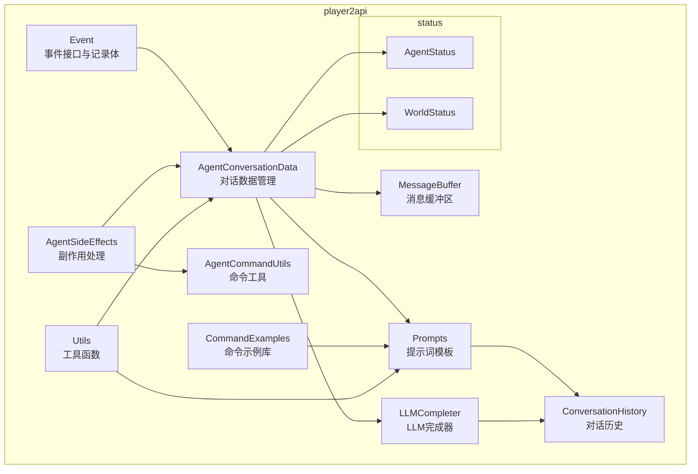

图表来源
- [AgentConversationData.java:32-81](file://src/main/java/adris/altoclef/player2api/AgentConversationData.java#L32-L81)
- [Event.java:3-64](file://src/main/java/adris/altoclef/player2api/Event.java#L3-L64)
- [AgentSideEffects.java:21-64](file://src/main/java/adris/altoclef/player2api/AgentSideEffects.java#L21-L64)
- [MessageBuffer.java:5-35](file://src/main/java/adris/altoclef/player2api/MessageBuffer.java#L5-L35)
- [Prompts.java:10-237](file://src/main/java/adris/altoclef/player2api/Prompts.java#L10-L237)
- [CommandExamples.java:5-33](file://src/main/java/adris/altoclef/player2api/CommandExamples.java#L5-L33)
- [ConversationHistory.java:16-42](file://src/main/java/adris/altoclef/player2api/ConversationHistory.java#L16-L42)
- [LLMCompleter.java:16-94](file://src/main/java/adris/altoclef/player2api/LLMCompleter.java#L16-L94)
- [AgentStatus.java:6-22](file://src/main/java/adris/altoclef/player2api/status/AgentStatus.java#L6-L22)
- [WorldStatus.java:5-18](file://src/main/java/adris/altoclef/player2api/status/WorldStatus.java#L5-L18)
- [Utils.java:13-103](file://src/main/java/adris/altoclef/player2api/utils/Utils.java#L13-L103)

章节来源
- [AgentConversationData.java:32-81](file://src/main/java/adris/altoclef/player2api/AgentConversationData.java#L32-L81)
- [AgentSideEffects.java:21-64](file://src/main/java/adris/altoclef/player2api/AgentSideEffects.java#L21-L64)
- [Event.java:3-64](file://src/main/java/adris/altoclef/player2api/Event.java#L3-L64)
- [MessageBuffer.java:5-35](file://src/main/java/adris/altoclef/player2api/MessageBuffer.java#L5-L35)
- [Prompts.java:10-237](file://src/main/java/adris/altoclef/player2api/Prompts.java#L10-L237)
- [CommandExamples.java:5-33](file://src/main/java/adris/altoclef/player2api/CommandExamples.java#L5-L33)
- [ConversationHistory.java:16-42](file://src/main/java/adris/altoclef/player2api/ConversationHistory.java#L16-L42)
- [LLMCompleter.java:16-94](file://src/main/java/adris/altoclef/player2api/LLMCompleter.java#L16-L94)
- [AgentStatus.java:6-22](file://src/main/java/adris/altoclef/player2api/status/AgentStatus.java#L6-L22)
- [WorldStatus.java:5-18](file://src/main/java/adris/altoclef/player2api/status/WorldStatus.java#L5-L18)
- [Utils.java:13-103](file://src/main/java/adris/altoclef/player2api/utils/Utils.java#L13-L103)

## 核心组件
- 命令工具类：对物品目标列表进行库存计数增强，返回新的目标数组，便于任务规划时考虑已有库存。
- 对话数据管理：维护事件队列、上下文包装、强制救援/攻击/召唤响应、问候与反馈去重、最小响应间隔、情绪提醒注入、系统调试消息聚合。
- 副作用处理：将AI生成的命令字符串映射为实际游戏行为，处理完成/错误/取消回调，支持静默命令与持久命令策略。
- 事件系统：定义事件接口与三种记录体，支持优先级判定（高危/紧急/快速响应）。
- 消息缓冲区：固定容量的消息队列，满载时丢弃最早消息，支持导出为字符串。
- 提示词模板：提供AI-NPC系统提示词、中文到命令映射、构建结构提示词、命令列表注入与占位符替换。
- 命令示例库：提供常用命令的标准示例，用于提示词中展示。
- 对话历史：封装对话历史的增删、摘要、文件落盘/加载、系统提示词注入与状态包裹。
- LLM完成器：封装同步/流式LLM调用，带并发锁与超时保护，负责将对话历史转为结构化响应。
- 状态注入：AgentStatus与WorldStatus将运行时状态注入到对话历史中，供LLM决策参考。

章节来源
- [AgentCommandUtils.java:8-19](file://src/main/java/adris/altoclef/player2api/AgentCommandUtils.java#L8-L19)
- [AgentConversationData.java:32-81](file://src/main/java/adris/altoclef/player2api/AgentConversationData.java#L32-L81)
- [AgentSideEffects.java:21-64](file://src/main/java/adris/altoclef/player2api/AgentSideEffects.java#L21-L64)
- [Event.java:3-64](file://src/main/java/adris/altoclef/player2api/Event.java#L3-L64)
- [MessageBuffer.java:5-35](file://src/main/java/adris/altoclef/player2api/MessageBuffer.java#L5-L35)
- [Prompts.java:10-237](file://src/main/java/adris/altoclef/player2api/Prompts.java#L10-L237)
- [CommandExamples.java:5-33](file://src/main/java/adris/altoclef/player2api/CommandExamples.java#L5-L33)
- [ConversationHistory.java:16-42](file://src/main/java/adris/altoclef/player2api/ConversationHistory.java#L16-L42)
- [LLMCompleter.java:16-94](file://src/main/java/adris/altoclef/player2api/LLMCompleter.java#L16-L94)
- [AgentStatus.java:6-22](file://src/main/java/adris/altoclef/player2api/status/AgentStatus.java#L6-L22)
- [WorldStatus.java:5-18](file://src/main/java/adris/altoclef/player2api/status/WorldStatus.java#L5-L18)
- [Utils.java:13-103](file://src/main/java/adris/altoclef/player2api/utils/Utils.java#L13-L103)

## 架构总览
下图展示了从事件进入、对话上下文构建、LLM推理、副作用执行到反馈回传的完整流程。

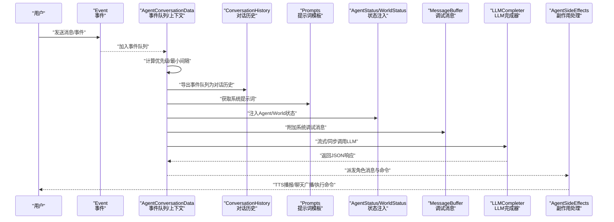

图表来源
- [AgentConversationData.java:109-272](file://src/main/java/adris/altoclef/player2api/AgentConversationData.java#L109-L272)
- [LLMCompleter.java:96-211](file://src/main/java/adris/altoclef/player2api/LLMCompleter.java#L96-L211)
- [AgentSideEffects.java:40-64](file://src/main/java/adris/altoclef/player2api/AgentSideEffects.java#L40-L64)
- [Prompts.java:203-237](file://src/main/java/adris/altoclef/player2api/Prompts.java#L203-L237)
- [AgentStatus.java:6-22](file://src/main/java/adris/altoclef/player2api/status/AgentStatus.java#L6-L22)
- [WorldStatus.java:5-18](file://src/main/java/adris/altoclef/player2api/status/WorldStatus.java#L5-L18)
- [MessageBuffer.java:24-34](file://src/main/java/adris/altoclef/player2api/MessageBuffer.java#L24-L34)

## 详细组件分析

### AgentCommandUtils 命令工具类
- 职责：对物品目标数组进行库存增强，统计目标物品在当前库存中的数量并返回新数组。
- 输入：控制器实例与物品目标数组。
- 输出：增强后的物品目标数组。
- 典型用途：在任务规划前，结合已有库存决定是否仍需采集或合成。

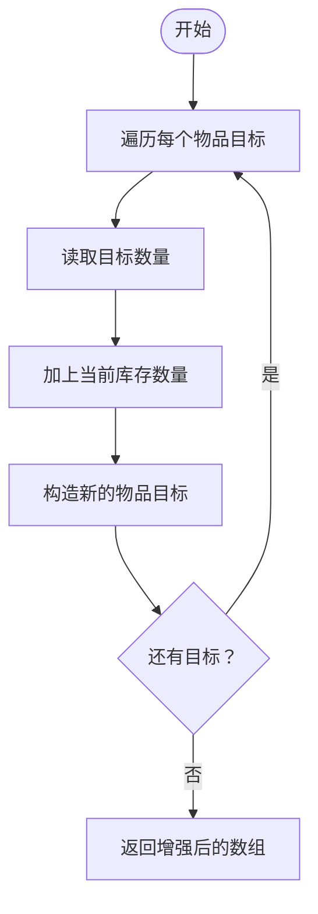

图表来源
- [AgentCommandUtils.java:8-19](file://src/main/java/adris/altoclef/player2api/AgentCommandUtils.java#L8-L19)

章节来源
- [AgentCommandUtils.java:8-19](file://src/main/java/adris/altoclef/player2api/AgentCommandUtils.java#L8-L19)

### AgentConversationData 对话数据管理
- 事件队列与优先级：基于时间戳与事件优先级计算综合权重，避免并发与过度刷屏。
- 上下文包装：将世界状态、代理状态、调试消息与提醒注入到对话历史中，供LLM决策。
- 强制响应：当检测到救援/攻击/召唤关键词时，绕过LLM直接生成响应并执行，支持两阶段救援（先回到主人身边，再清除威胁）。
- 问候与反馈：首次问候直接使用角色配置；命令完成反馈进行去重与冷却控制。
- 最小响应间隔：限制LLM响应频率，避免刷屏。
- 调试消息聚合：通过MessageBuffer收集系统消息，最终以JSON数组形式注入到对话历史。

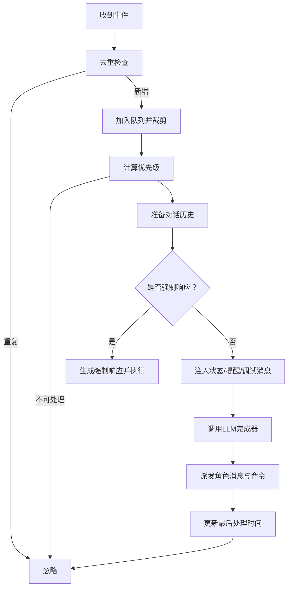

图表来源
- [AgentConversationData.java:88-106](file://src/main/java/adris/altoclef/player2api/AgentConversationData.java#L88-L106)
- [AgentConversationData.java:140-272](file://src/main/java/adris/altoclef/player2api/AgentConversationData.java#L140-L272)
- [AgentConversationData.java:511-588](file://src/main/java/adris/altoclef/player2api/AgentConversationData.java#L511-L588)

章节来源
- [AgentConversationData.java:32-81](file://src/main/java/adris/altoclef/player2api/AgentConversationData.java#L32-L81)
- [AgentConversationData.java:109-272](file://src/main/java/adris/altoclef/player2api/AgentConversationData.java#L109-L272)
- [AgentConversationData.java:511-588](file://src/main/java/adris/altoclef/player2api/AgentConversationData.java#L511-L588)
- [MessageBuffer.java:5-35](file://src/main/java/adris/altoclef/player2api/MessageBuffer.java#L5-L35)
- [AgentStatus.java:6-22](file://src/main/java/adris/altoclef/player2api/status/AgentStatus.java#L6-L22)
- [WorldStatus.java:5-18](file://src/main/java/adris/altoclef/player2api/status/WorldStatus.java#L5-L18)

### AgentSideEffects 副作用处理
- 角色消息处理：将角色消息广播给在线玩家，触发TTS播报，并将命令部分交由命令执行器处理。
- 命令执行：自动补全命令前缀，处理特殊命令（如@idle、@stop），对持久命令与静默命令进行差异化处理。
- 玩家覆盖：当玩家发出攻击命令时临时抑制防御逃跑，命令结束后恢复。
- 完成/错误回调：命令完成后触发LookAtOwnerTask，错误时同样触发并上报状态。

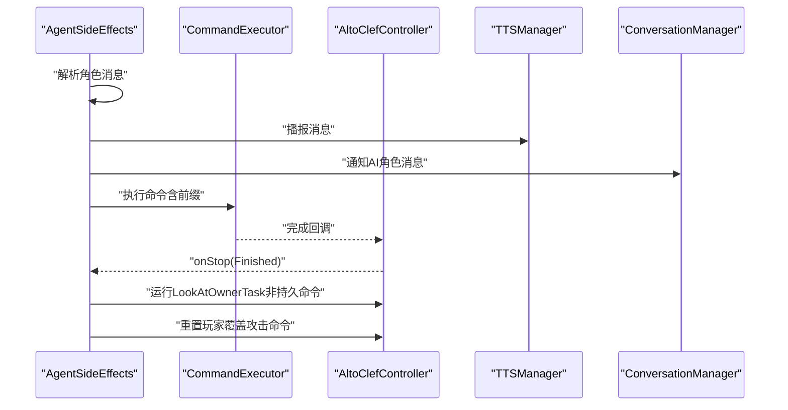

图表来源
- [AgentSideEffects.java:40-64](file://src/main/java/adris/altoclef/player2api/AgentSideEffects.java#L40-L64)
- [AgentSideEffects.java:70-144](file://src/main/java/adris/altoclef/player2api/AgentSideEffects.java#L70-L144)

章节来源
- [AgentSideEffects.java:21-64](file://src/main/java/adris/altoclef/player2api/AgentSideEffects.java#L21-L64)
- [AgentSideEffects.java:70-144](file://src/main/java/adris/altoclef/player2api/AgentSideEffects.java#L70-L144)

### Event 事件系统
- 接口与记录体：定义事件接口与三种记录体（用户消息、角色消息、信息消息）。
- 优先级：根据内容关键字动态调整优先级（高危/紧急/快速响应），便于对话数据管理进行调度。

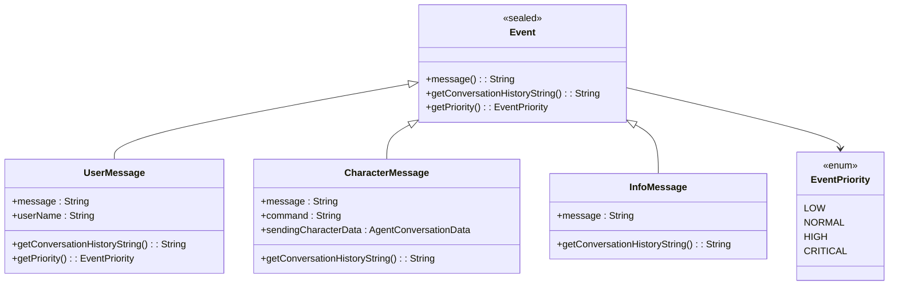

图表来源
- [Event.java:3-64](file://src/main/java/adris/altoclef/player2api/Event.java#L3-L64)

章节来源
- [Event.java:3-64](file://src/main/java/adris/altoclef/player2api/Event.java#L3-L64)

### MessageBuffer 消息缓冲区
- 功能：固定容量的队列，满载时丢弃最旧消息，支持导出为字符串。
- 用途：将系统调试消息聚合后注入到对话历史，减少LLM上下文冗余。

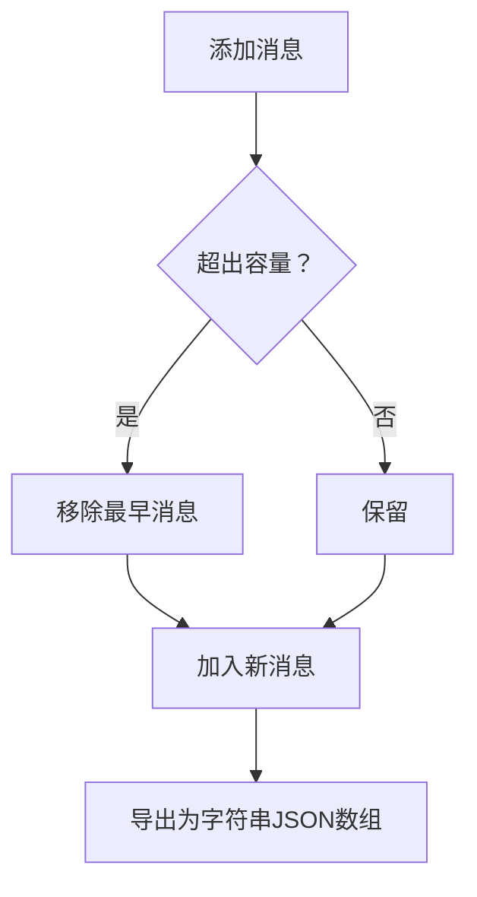

图表来源
- [MessageBuffer.java:5-35](file://src/main/java/adris/altoclef/player2api/MessageBuffer.java#L5-L35)

章节来源
- [MessageBuffer.java:5-35](file://src/main/java/adris/altoclef/player2api/MessageBuffer.java#L5-L35)

### Prompts 提示词模板与 CommandExamples 命令示例库
- 提示词模板：包含系统提示词、中文到命令映射、构建结构提示词、占位符替换逻辑。
- 命令示例库：提供常用命令的标准示例，用于在提示词中展示。

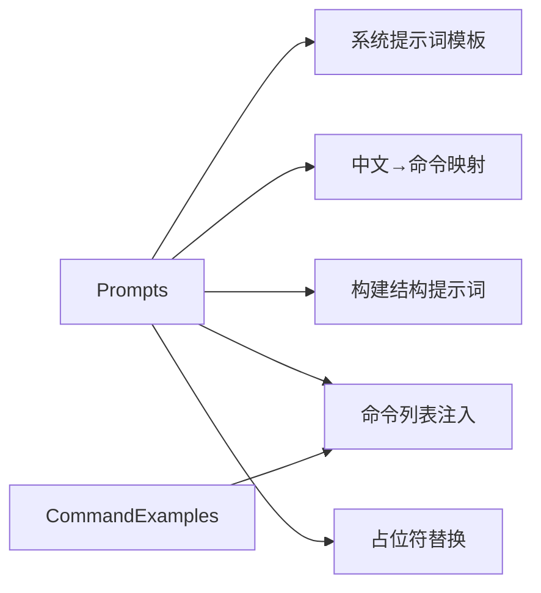

图表来源
- [Prompts.java:10-237](file://src/main/java/adris/altoclef/player2api/Prompts.java#L10-L237)
- [CommandExamples.java:5-33](file://src/main/java/adris/altoclef/player2api/CommandExamples.java#L5-L33)

章节来源
- [Prompts.java:10-237](file://src/main/java/adris/altoclef/player2api/Prompts.java#L10-L237)
- [CommandExamples.java:5-33](file://src/main/java/adris/altoclef/player2api/CommandExamples.java#L5-L33)

### ConversationHistory 对话历史
- 功能：维护对话历史、摘要、文件落盘/加载、系统提示词注入与状态包裹。
- 策略：超过阈值时对早期消息进行摘要并保留尾部，定期保存至文件。

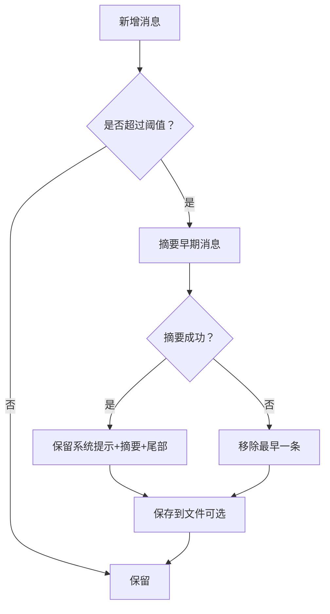

图表来源
- [ConversationHistory.java:48-94](file://src/main/java/adris/altoclef/player2api/ConversationHistory.java#L48-L94)
- [ConversationHistory.java:96-168](file://src/main/java/adris/altoclef/player2api/ConversationHistory.java#L96-L168)

章节来源
- [ConversationHistory.java:16-42](file://src/main/java/adris/altoclef/player2api/ConversationHistory.java#L16-L42)
- [ConversationHistory.java:48-94](file://src/main/java/adris/altoclef/player2api/ConversationHistory.java#L48-L94)
- [ConversationHistory.java:96-168](file://src/main/java/adris/altoclef/player2api/ConversationHistory.java#L96-L168)

### LLMCompleter LLM完成器
- 功能：封装同步/流式LLM调用，带并发锁与超时保护，负责将对话历史转为结构化响应。
- 流式特性：首token回调用于即时反馈，最终解析完整JSON响应。

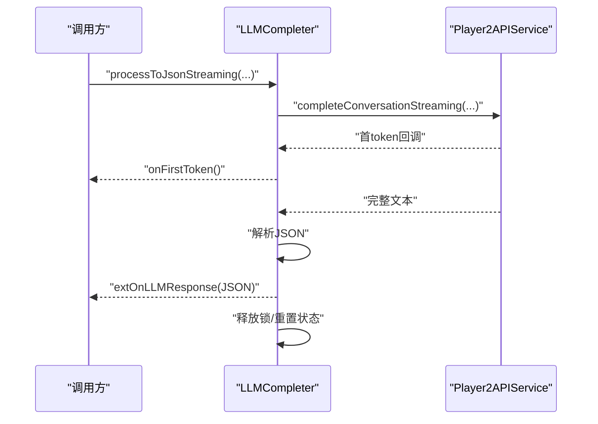

图表来源
- [LLMCompleter.java:121-211](file://src/main/java/adris/altoclef/player2api/LLMCompleter.java#L121-L211)

章节来源
- [LLMCompleter.java:16-94](file://src/main/java/adris/altoclef/player2api/LLMCompleter.java#L16-L94)
- [LLMCompleter.java:121-211](file://src/main/java/adris/altoclef/player2api/LLMCompleter.java#L121-L211)

## 依赖分析
- 组件耦合：
  - AgentConversationData 依赖 Event、Prompts、AgentStatus、WorldStatus、MessageBuffer、LLMCompleter。
  - AgentSideEffects 依赖 CommandExecutor、TTSManager、ConversationManager。
  - Prompts 依赖 CommandExamples 与 Utils。
  - ConversationHistory 依赖 Utils 与 Player2APIService。
  - LLMCompleter 依赖 ExecutorService 与 ConversationManager.Lock。
- 内聚性：各组件职责清晰，事件、对话、副作用、LLM分别独立，通过接口与回调解耦。
- 外部依赖：日志框架、Gson、线程池、服务器玩家列表等。

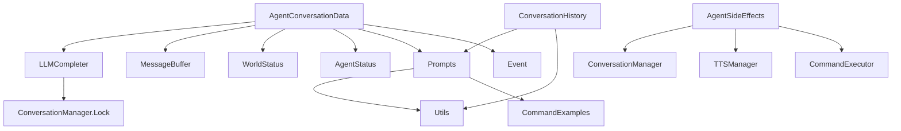

图表来源
- [AgentConversationData.java:16-30](file://src/main/java/adris/altoclef/player2api/AgentConversationData.java#L16-L30)
- [AgentSideEffects.java:6-18](file://src/main/java/adris/altoclef/player2api/AgentSideEffects.java#L6-L18)
- [Prompts.java:6-8](file://src/main/java/adris/altoclef/player2api/Prompts.java#L6-L8)
- [ConversationHistory.java:3-6](file://src/main/java/adris/altoclef/player2api/ConversationHistory.java#L3-L6)
- [LLMCompleter.java:3-14](file://src/main/java/adris/altoclef/player2api/LLMCompleter.java#L3-L14)

章节来源
- [AgentConversationData.java:16-30](file://src/main/java/adris/altoclef/player2api/AgentConversationData.java#L16-L30)
- [AgentSideEffects.java:6-18](file://src/main/java/adris/altoclef/player2api/AgentSideEffects.java#L6-L18)
- [Prompts.java:6-8](file://src/main/java/adris/altoclef/player2api/Prompts.java#L6-L8)
- [ConversationHistory.java:3-6](file://src/main/java/adris/altoclef/player2api/ConversationHistory.java#L3-L6)
- [LLMCompleter.java:3-14](file://src/main/java/adris/altoclef/player2api/LLMCompleter.java#L3-L14)

## 性能考虑
- 队列与缓存：
  - 事件队列最大长度限制，避免无限增长。
  - MessageBuffer固定容量，满载丢弃最旧消息，降低LLM上下文开销。
- 并发与锁：
  - LLMCompleter单线程执行并加锁，避免并发冲突；超时自动恢复。
- 响应节流：
  - 最小响应间隔与反馈冷却，避免频繁TTS与UI刷新。
- 状态注入：
  - 将Agent/World状态与调试消息以紧凑JSON形式注入，减少冗余描述。
- 建议：
  - 合理设置事件队列与MessageBuffer大小，平衡上下文完整性与性能。
  - 对高频命令采用静默模式，减少反馈噪声。
  - 在大规模对话场景下启用历史摘要，控制消息长度。

## 故障排查指南
- LLM响应异常：
  - 检查流式解析是否抛出JSON解析异常，确认模型输出格式符合要求。
  - 查看锁状态与超时日志，必要时重启Completer。
- 命令执行失败：
  - 查看副作用处理的错误回调，确认命令前缀与参数是否正确。
  - 检查持久命令与静默命令策略，避免误触发LookAtOwnerTask。
- 对话卡顿：
  - 检查事件队列是否积压，确认最小响应间隔是否生效。
  - 查看强制响应逻辑是否被频繁触发导致任务中断。
- 文件落盘异常：
  - 检查历史文件写入权限与磁盘空间，确认摘要失败时的降级策略。

章节来源
- [LLMCompleter.java:131-211](file://src/main/java/adris/altoclef/player2api/LLMCompleter.java#L131-L211)
- [AgentSideEffects.java:133-143](file://src/main/java/adris/altoclef/player2api/AgentSideEffects.java#L133-L143)
- [AgentConversationData.java:123-129](file://src/main/java/adris/altoclef/player2api/AgentConversationData.java#L123-L129)
- [ConversationHistory.java:96-168](file://src/main/java/adris/altoclef/player2api/ConversationHistory.java#L96-L168)

## 结论
该通用辅助工具通过事件—对话—副作用—LLM的闭环设计，实现了对AI-NPC行为的可控编排与高效执行。其关键优势在于：
- 清晰的职责划分与接口抽象，便于扩展与维护。
- 健壮的上下文管理与状态注入，提升LLM决策质量。
- 完备的并发控制与节流策略，保障系统稳定性。
- 可配置的提示词与示例库，确保指令一致性与可解释性。

## 附录
- 使用示例与最佳实践（路径指引）：
  - 增强物品目标：[AgentCommandUtils.addPresentItemsToTargets:9-18](file://src/main/java/adris/altoclef/player2api/AgentCommandUtils.java#L9-L18)
  - 添加事件到队列：[AgentConversationData.onEvent:312-314](file://src/main/java/adris/altoclef/player2api/AgentConversationData.java#L312-L314)
  - 强制救援响应：[AgentConversationData.tryForcedRescueResponse:511-588](file://src/main/java/adris/altoclef/player2api/AgentConversationData.java#L511-L588)
  - 执行命令并上报：[AgentSideEffects.onCommandListGenerated:70-144](file://src/main/java/adris/altoclef/player2api/AgentSideEffects.java#L70-L144)
  - 流式LLM调用：[LLMCompleter.processToJsonStreaming:121-211](file://src/main/java/adris/altoclef/player2api/LLMCompleter.java#L121-L211)
  - 注入系统提示词：[Prompts.getAINPCSystemPrompt:203-237](file://src/main/java/adris/altoclef/player2api/Prompts.java#L203-L237)
  - 命令示例查询：[CommandExamples.getExample:30-32](file://src/main/java/adris/altoclef/player2api/CommandExamples.java#L30-L32)
  - 状态注入：[AgentStatus.fromMod:7-22](file://src/main/java/adris/altoclef/player2api/status/AgentStatus.java#L7-L22)、[WorldStatus.fromMod:6-18](file://src/main/java/adris/altoclef/player2api/status/WorldStatus.java#L6-L18)
  - JSON解析与占位符替换：[Utils.parseCleanedJson:61-88](file://src/main/java/adris/altoclef/player2api/utils/Utils.java#L61-L88)、[Utils.replacePlaceholders:14-21](file://src/main/java/adris/altoclef/player2api/utils/Utils.java#L14-L21)