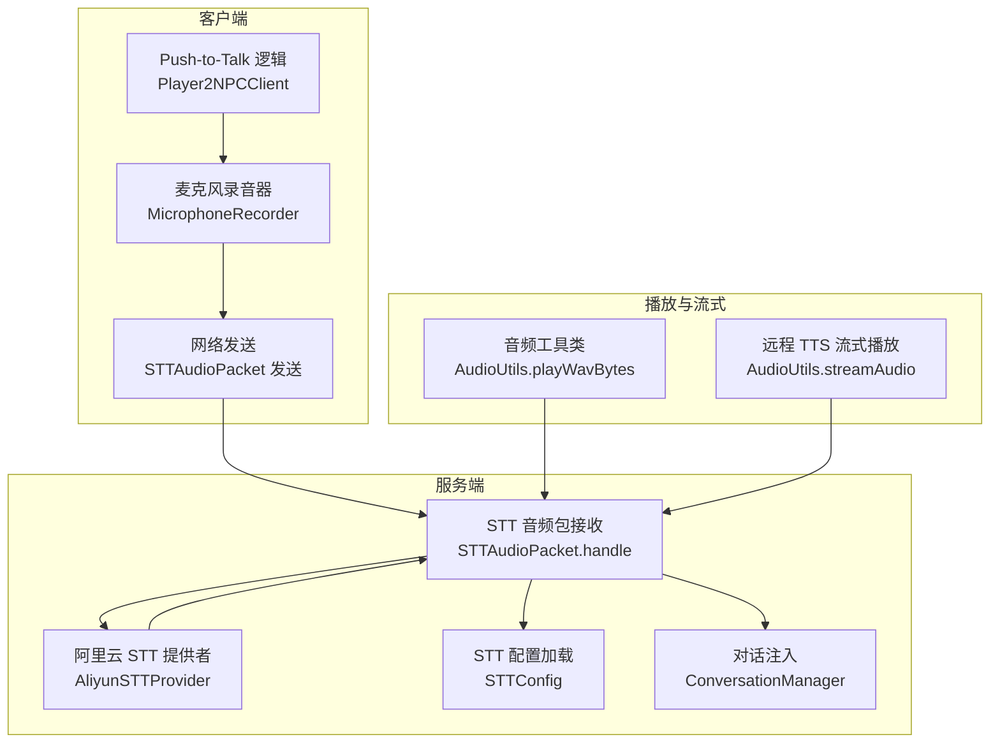
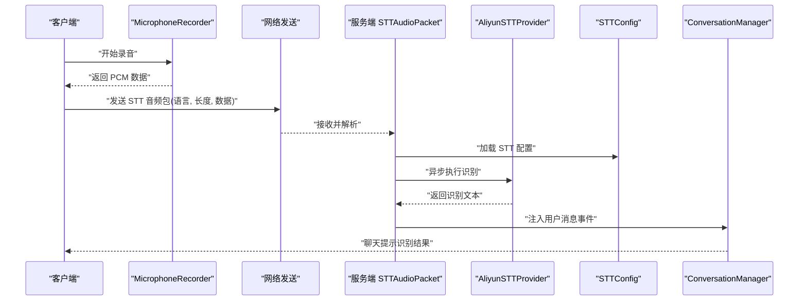
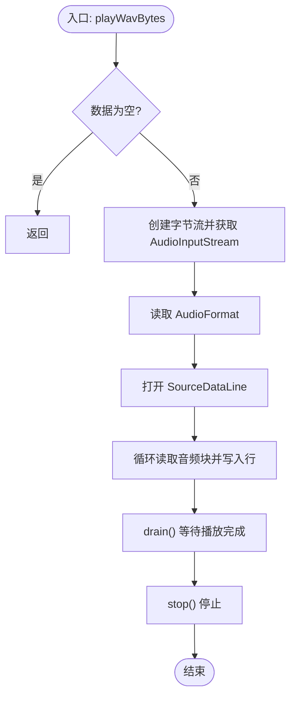
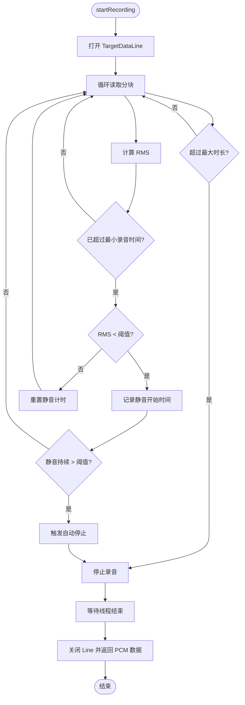
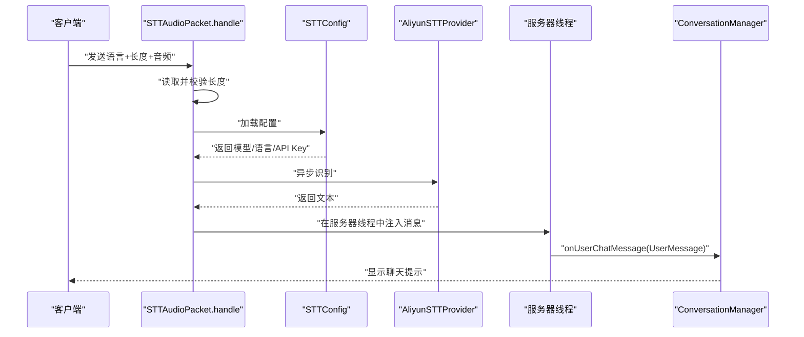
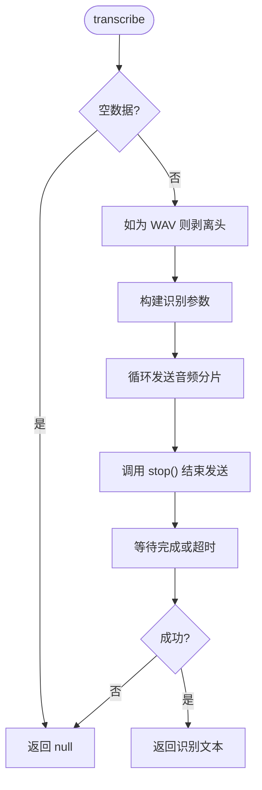
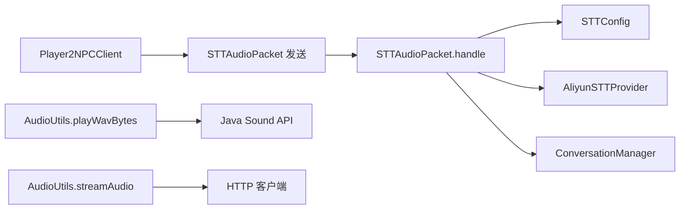

# 音频工具类

<cite>
**本文引用的文件**
- [AudioUtils.java](file://src/main/java/adris/altoclef/player2api/utils/AudioUtils.java)
- [MicrophoneRecorder.java](file://src/main/java/com/goodbird/player2npc/client/audio/MicrophoneRecorder.java)
- [STTAudioPacket.java](file://src/main/java/com/goodbird/player2npc/network/STTAudioPacket.java)
- [AliyunSTTProvider.java](file://src/main/java/adris/altoclef/player2api/stt/AliyunSTTProvider.java)
- [STTConfig.java](file://src/main/java/adris/altoclef/player2api/stt/STTConfig.java)
- [TTSConfig.java](file://src/main/java/adris/altoclef/player2api/tts/TTSConfig.java)
- [playerengine-llm-default.json](file://build/resources/main/playerengine-llm-default.json)
- [playerengine-llm.json](file://run/config/playerengine-llm.json)
- [Player2NPCClient.java](file://src/main/java/com/goodbird/player2npc/Player2NPCClient.java)
</cite>

## 目录
1. [简介](#简介)
2. [项目结构](#项目结构)
3. [核心组件](#核心组件)
4. [架构总览](#架构总览)
5. [详细组件分析](#详细组件分析)
6. [依赖分析](#依赖分析)
7. [性能考虑](#性能考虑)
8. [故障排查指南](#故障排查指南)
9. [结论](#结论)
10. [附录](#附录)

## 简介
本技术文档围绕音频工具类与音频处理链路展开，重点覆盖以下方面：
- AudioUtils 类提供的音频处理能力：WAV 播放、队列化串行播放、以及远程 TTS 流式播放接口。
- MicrophoneRecorder 麦克风录音系统：PCM 采集、缓冲区管理、实时录音、VAD 自动停止与静音检测。
- STTAudioPacket 音频包在网络层的序列化与反序列化、服务端处理流程与 STT 识别集成。
- 音频编解码参数配置、采样率设置与质量优化建议。
- 音频延迟、音质损失与兼容性问题的解决方案与最佳实践。

## 项目结构
音频相关代码主要分布在如下模块：
- 客户端音频采集与网络发送：com.goodbird.player2npc.client.audio.MicrophoneRecorder、com.goodbird.player2npc.Player2NPCClient
- 服务端 STT 处理：com.goodbird.player2npc.network.STTAudioPacket、adris.altoclef.player2api.stt.AliyunSTTProvider
- 音频播放与流式处理：adris.altoclef.player2api.utils.AudioUtils
- 配置与参数：adris.altoclef.player2api.stt.STTConfig、adris.altoclef.player2api.tts.TTSConfig、playerengine-llm.json 默认模板

**图表来源**
- [Player2NPCClient.java:64-163](file://src/main/java/com/goodbird/player2npc/Player2NPCClient.java#L64-L163)
- [MicrophoneRecorder.java:1-199](file://src/main/java/com/goodbird/player2npc/client/audio/MicrophoneRecorder.java#L1-L199)
- [STTAudioPacket.java:1-134](file://src/main/java/com/goodbird/player2npc/network/STTAudioPacket.java#L1-L134)
- [AliyunSTTProvider.java:1-172](file://src/main/java/adris/altoclef/player2api/stt/AliyunSTTProvider.java#L1-L172)
- [AudioUtils.java:1-170](file://src/main/java/adris/altoclef/player2api/utils/AudioUtils.java#L1-L170)

**章节来源**
- [Player2NPCClient.java:64-163](file://src/main/java/com/goodbird/player2npc/Player2NPCClient.java#L64-L163)
- [MicrophoneRecorder.java:1-199](file://src/main/java/com/goodbird/player2npc/client/audio/MicrophoneRecorder.java#L1-L199)
- [STTAudioPacket.java:1-134](file://src/main/java/com/goodbird/player2npc/network/STTAudioPacket.java#L1-L134)
- [AliyunSTTProvider.java:1-172](file://src/main/java/adris/altoclef/player2api/stt/AliyunSTTProvider.java#L1-L172)
- [AudioUtils.java:1-170](file://src/main/java/adris/altoclef/player2api/utils/AudioUtils.java#L1-L170)

## 核心组件
- AudioUtils：提供 WAV 播放、队列化串行播放、远程 TTS 流式播放接口；支持从字节数组直接播放 WAV 数据。
- MicrophoneRecorder：以 16kHz、16bit、Mono 的 PCM 格式进行实时录音，内置 VAD（Voice Activity Detection）自动停止逻辑，支持最大时长限制。
- STTAudioPacket：定义客户端到服务端的 STT 音频包格式（UTF 语言 + VarInt 长度 + 字节流），并在服务端异步执行 STT 识别，将结果注入对话系统。
- AliyunSTTProvider：基于 DashScope 的实时语音转写（Gummy 模型），支持 PCM/WAV 输入，按约 100ms 分片发送，等待识别完成。
- STTConfig/TTSConfig：从 playerengine-llm.json 中加载 STT/TTS 配置，支持 API Key 回退策略与默认值。
- 配置文件：playerengine-llm-default.json 与运行时配置 playerengine-llm.json，定义了 TTS/STT 的模型、语言、音色、速率、音高等参数。

**章节来源**
- [AudioUtils.java:37-170](file://src/main/java/adris/altoclef/player2api/utils/AudioUtils.java#L37-L170)
- [MicrophoneRecorder.java:21-199](file://src/main/java/com/goodbird/player2npc/client/audio/MicrophoneRecorder.java#L21-L199)
- [STTAudioPacket.java:28-134](file://src/main/java/com/goodbird/player2npc/network/STTAudioPacket.java#L28-L134)
- [AliyunSTTProvider.java:23-172](file://src/main/java/adris/altoclef/player2api/stt/AliyunSTTProvider.java#L23-L172)
- [STTConfig.java:13-78](file://src/main/java/adris/altoclef/player2api/stt/STTConfig.java#L13-L78)
- [TTSConfig.java:13-102](file://src/main/java/adris/altoclef/player2api/tts/TTSConfig.java#L13-L102)
- [playerengine-llm-default.json:52-77](file://build/resources/main/playerengine-llm-default.json#L52-L77)
- [playerengine-llm.json:52-77](file://run/config/playerengine-llm.json#L52-L77)

## 架构总览
音频处理链路由“客户端录音 → 网络传输 → 服务端识别 → 对话注入”构成，同时提供本地播放与远程流式播放能力。

**图表来源**
- [Player2NPCClient.java:64-163](file://src/main/java/com/goodbird/player2npc/Player2NPCClient.java#L64-L163)
- [STTAudioPacket.java:39-121](file://src/main/java/com/goodbird/player2npc/network/STTAudioPacket.java#L39-L121)
- [AliyunSTTProvider.java:47-154](file://src/main/java/adris/altoclef/player2api/stt/AliyunSTTProvider.java#L47-L154)
- [STTConfig.java:31-59](file://src/main/java/adris/altoclef/player2api/stt/STTConfig.java#L31-L59)

## 详细组件分析

### AudioUtils 组件分析
- 功能要点
  - 队列化串行播放：将多个 WAV 片段入队，避免重叠播放，保证顺序性。
  - 直接播放 WAV：从字节数组读取 WAV 流，打开目标音频行进行播放。
  - 远程 TTS 流式播放：向 player2.game 发起流式请求，边接收边播放。
- 关键参数
  - 缓冲区大小：默认 4096 字节。
  - WAV 解码：通过 AudioSystem 获取 AudioInputStream 并根据格式打开 SourceDataLine。
- 错误处理
  - 异常捕获并输出错误信息，避免主线程阻塞。
- 使用场景
  - 本地播放 CosyVoice 合成后的 WAV。
  - 远程模式下的流式 TTS 播放。

**图表来源**
- [AudioUtils.java:76-104](file://src/main/java/adris/altoclef/player2api/utils/AudioUtils.java#L76-L104)

**章节来源**
- [AudioUtils.java:37-170](file://src/main/java/adris/altoclef/player2api/utils/AudioUtils.java#L37-L170)

### MicrophoneRecorder 组件分析
- 录音格式
  - 采样率：16kHz；位深：16bit；声道：Mono；字节序：小端；符号：有符号。
- 录音流程
  - 打开 TargetDataLine，启动录音线程，按 3200 字节分块读取并写入缓冲区。
  - 计算最近分块的 RMS 声压级，用于 VAD 判定。
  - 静音判定：超过最小录音时间后，若连续静音超过阈值则自动停止。
  - 最大录音时长：60 秒，防止无限录音。
- 线程与同步
  - 录音线程为守护线程，停止时等待最多 2 秒。
  - 方法采用同步锁，确保状态一致性。
- 关键参数
  - VAD 参数：最小录音时间、静音持续阈值、RMS 阈值。
  - 分块大小：约 100ms（3200 字节）。

**图表来源**
- [MicrophoneRecorder.java:62-153](file://src/main/java/com/goodbird/player2npc/client/audio/MicrophoneRecorder.java#L62-L153)

**章节来源**
- [MicrophoneRecorder.java:21-199](file://src/main/java/com/goodbird/player2npc/client/audio/MicrophoneRecorder.java#L21-L199)

### STTAudioPacket 组件分析
- 网络包格式（客户端 → 服务端）
  - UTF：语言标识（如 zh）。
  - VarInt：音频长度。
  - Bytes：音频数据（PCM 或 WAV）。
- 服务端处理流程
  - 读取包内字段，记录日志。
  - 长度校验：小于最小字节数（约 1 秒）则拒绝并提示。
  - 异步执行 STT：加载 STTConfig，校验可用性与 API Key，调用 AliyunSTTProvider 进行识别。
  - 结果注入：通过服务器线程将识别文本注入对话系统，并向玩家显示聊天提示。
- 关键参数
  - 最小音频字节数：约 32000 字节（1 秒 16kHz、16bit、Mono）。
  - 异步线程名前缀：STT-Worker-玩家名。

**图表来源**
- [STTAudioPacket.java:39-121](file://src/main/java/com/goodbird/player2npc/network/STTAudioPacket.java#L39-L121)
- [AliyunSTTProvider.java:47-154](file://src/main/java/adris/altoclef/player2api/stt/AliyunSTTProvider.java#L47-L154)
- [STTConfig.java:31-59](file://src/main/java/adris/altoclef/player2api/stt/STTConfig.java#L31-L59)

**章节来源**
- [STTAudioPacket.java:28-134](file://src/main/java/com/goodbird/player2npc/network/STTAudioPacket.java#L28-L134)

### AliyunSTTProvider 组件分析
- 输入格式
  - 接受 PCM 或 WAV（内部会剥离 WAV 头）。
  - 采样率固定为 16kHz，格式为 pcm。
- 识别流程
  - 构建识别参数（模型、语言、采样率、是否启用转写）。
  - 将 PCM 数据按约 100ms 分片发送，每片间隔约 20ms 控制 CPU 使用。
  - 调用 stop() 表示音频发送结束，等待识别完成或超时。
- 可用性检查
  - API Key 必须存在且非占位符字符串。

**图表来源**
- [AliyunSTTProvider.java:47-154](file://src/main/java/adris/altoclef/player2api/stt/AliyunSTTProvider.java#L47-L154)

**章节来源**
- [AliyunSTTProvider.java:17-172](file://src/main/java/adris/altoclef/player2api/stt/AliyunSTTProvider.java#L17-L172)

### 配置与参数
- STT 配置（STTConfig）
  - 默认模型：gummy-chat-v1；默认语言：zh。
  - API Key 回退：优先使用独立的 STT apiKey，否则回退到 qwen 提供者的 apiKey。
- TTS 配置（TTSConfig）
  - 默认模型：cosyvoice-v3-flash；默认音色：longanhuan；默认音量：50；默认语速/音调：1.0。
  - API Key 回退：优先使用独立的 tts apiKey，否则回退到 qwen 提供者的 apiKey。
- 默认配置模板（playerengine-llm-default.json）
  - 提供完整的字段注释与可选项，便于开发者理解各参数含义。
- 运行时配置（playerengine-llm.json）
  - 开发者实际部署时的配置文件，包含有效 API Key。

**章节来源**
- [STTConfig.java:13-78](file://src/main/java/adris/altoclef/player2api/stt/STTConfig.java#L13-L78)
- [TTSConfig.java:13-102](file://src/main/java/adris/altoclef/player2api/tts/TTSConfig.java#L13-L102)
- [playerengine-llm-default.json:52-77](file://build/resources/main/playerengine-llm-default.json#L52-L77)
- [playerengine-llm.json:52-77](file://run/config/playerengine-llm.json#L52-L77)

## 依赖分析
- 客户端到服务端
  - Player2NPCClient 通过自定义命名空间的网络通道发送 STTAudioPacket。
  - STTAudioPacket 在服务端异步执行 STT，不阻塞网络线程。
- 服务端到识别
  - STTAudioPacket 依赖 STTConfig 与 AliyunSTTProvider。
  - AliyunSTTProvider 依赖 DashScope SDK 与 WebSocket 接口。
- 播放链路
  - AudioUtils.playWavBytes 依赖 Java Sound API（AudioSystem、AudioFormat、SourceDataLine）。
  - AudioUtils.streamAudio 依赖 HTTP 客户端与 player2.game API。

**图表来源**
- [Player2NPCClient.java:150-158](file://src/main/java/com/goodbird/player2npc/Player2NPCClient.java#L150-L158)
- [STTAudioPacket.java:39-121](file://src/main/java/com/goodbird/player2npc/network/STTAudioPacket.java#L39-L121)
- [AliyunSTTProvider.java:47-154](file://src/main/java/adris/altoclef/player2api/stt/AliyunSTTProvider.java#L47-L154)
- [AudioUtils.java:76-104](file://src/main/java/adris/altoclef/player2api/utils/AudioUtils.java#L76-L104)

**章节来源**
- [Player2NPCClient.java:150-158](file://src/main/java/com/goodbird/player2npc/Player2NPCClient.java#L150-L158)
- [STTAudioPacket.java:39-121](file://src/main/java/com/goodbird/player2npc/network/STTAudioPacket.java#L39-L121)
- [AliyunSTTProvider.java:47-154](file://src/main/java/adris/altoclef/player2api/stt/AliyunSTTProvider.java#L47-L154)
- [AudioUtils.java:76-104](file://src/main/java/adris/altoclef/player2api/utils/AudioUtils.java#L76-L104)

## 性能考虑
- 录音与播放
  - 分块大小：3200 字节（约 100ms）平衡延迟与 CPU 占用。
  - 播放缓冲：4096 字节，减少 write 调用次数。
- 识别吞吐
  - 分片间隔约 20ms，避免 CPU 过载，同时保持识别流畅。
  - 识别完成后 drain() 确保缓冲清空。
- 网络与线程
  - 服务端 STT 在独立线程执行，避免阻塞网络线程。
  - 使用服务器 execute 将 UI 更新切回主线程。
- 配置优化
  - 选择更轻量的模型（如 gummy-chat-v1）以降低识别延迟。
  - 合理设置语速与音调，避免过高的速率导致识别准确率下降。

[本节为通用性能建议，不直接分析具体文件]

## 故障排查指南
- 录音不可用
  - 检查麦克风可用性与权限；确认系统音频设备正常。
  - 若 isMicrophoneAvailable 返回 false，需更换设备或驱动。
- 录音太短被拒绝
  - 服务端要求至少约 1 秒（32000 字节）；检查客户端分块大小与静音阈值设置。
- 识别失败或无结果
  - 确认 STTConfig 已启用且 API Key 配置正确。
  - 检查 AliyunSTTProvider 是否可用（API Key 非占位符）。
  - 网络异常或超时：适当延长等待时间或检查代理设置。
- 播放无声或卡顿
  - 检查 AudioFormat 与 SourceDataLine 打开是否成功。
  - 确认缓冲区大小与分块大小匹配（建议使用默认值）。
- 兼容性问题
  - 不同平台的音频驱动差异可能导致采样率或格式不匹配；统一使用 16kHz/16bit/Mono。
  - 若出现延迟，尝试增大分块大小或减少分片发送频率。

**章节来源**
- [MicrophoneRecorder.java:49-56](file://src/main/java/com/goodbird/player2npc/client/audio/MicrophoneRecorder.java#L49-L56)
- [STTAudioPacket.java:57-63](file://src/main/java/com/goodbird/player2npc/network/STTAudioPacket.java#L57-L63)
- [AliyunSTTProvider.java:168-170](file://src/main/java/adris/altoclef/player2api/stt/AliyunSTTProvider.java#L168-L170)
- [AudioUtils.java:76-104](file://src/main/java/adris/altoclef/player2api/utils/AudioUtils.java#L76-L104)

## 结论
该音频工具链以简洁稳定的组件实现了从录音、网络传输到识别与播放的完整闭环。通过统一的 PCM 格式（16kHz/16bit/Mono）、合理的分块策略与异步处理，兼顾了实时性与可靠性。配合 playerengine-llm.json 的灵活配置，用户可在不同场景下优化延迟、音质与成本。

[本节为总结性内容，不直接分析具体文件]

## 附录
- 音频录制、播放、传输的完整流程示例（步骤说明）
  - 录制：客户端初始化 MicrophoneRecorder，按 PTT 触发 startRecording；录音线程持续读取分块并写入缓冲，VAD 判定静音后自动停止或手动释放按键停止。
  - 发送：客户端构造 STTAudioPacket（语言、长度、音频），通过网络通道发送至服务端。
  - 识别：服务端 handle 解析包体，校验长度与配置，异步调用 AliyunSTTProvider 执行识别，将结果注入对话系统并提示玩家。
  - 播放：若为本地 TTS 合成，使用 AudioUtils.playWavBytes 播放；若为远程流式 TTS，使用 AudioUtils.streamAudio。
- 配置参考
  - STT：模型、语言、启用开关、API Key。
  - TTS：模型、音色、音量、语速、音调、启用开关、API Key。
  - 默认模板与运行时配置文件路径见“章节来源”。

**章节来源**
- [Player2NPCClient.java:64-163](file://src/main/java/com/goodbird/player2npc/Player2NPCClient.java#L64-L163)
- [STTAudioPacket.java:39-121](file://src/main/java/com/goodbird/player2npc/network/STTAudioPacket.java#L39-L121)
- [AliyunSTTProvider.java:47-154](file://src/main/java/adris/altoclef/player2api/stt/AliyunSTTProvider.java#L47-L154)
- [AudioUtils.java:49-168](file://src/main/java/adris/altoclef/player2api/utils/AudioUtils.java#L49-L168)
- [playerengine-llm-default.json:52-77](file://build/resources/main/playerengine-llm-default.json#L52-L77)
- [playerengine-llm.json:52-77](file://run/config/playerengine-llm.json#L52-L77)