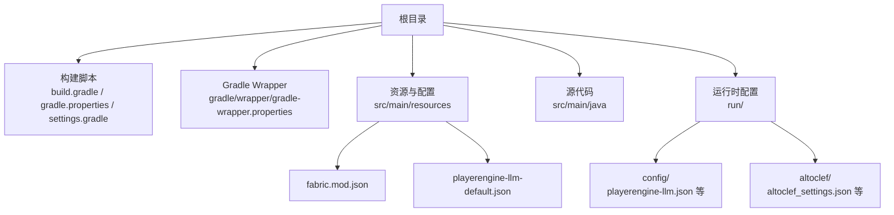
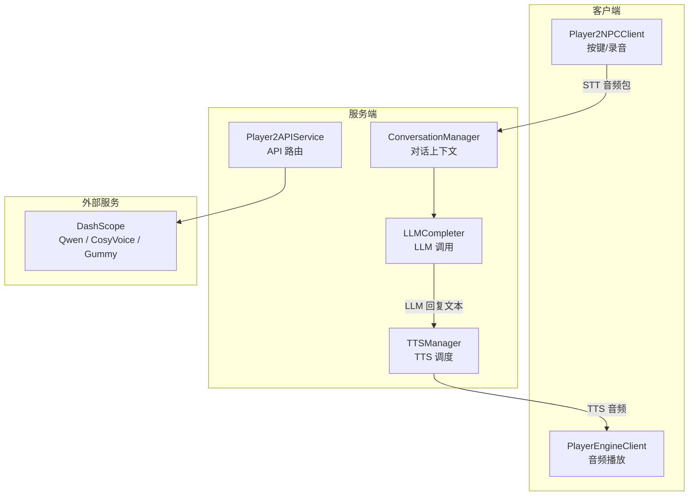
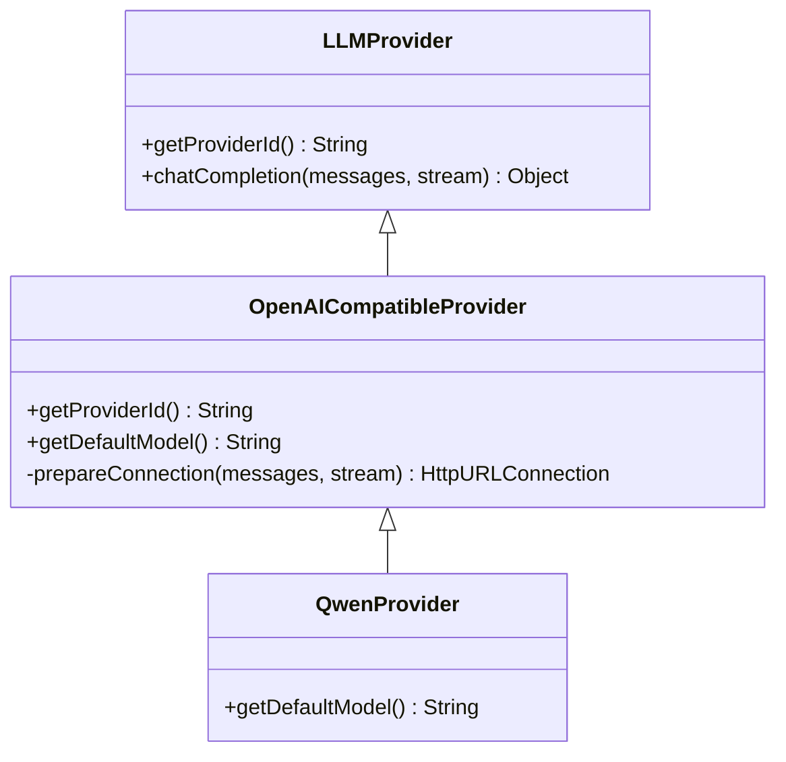
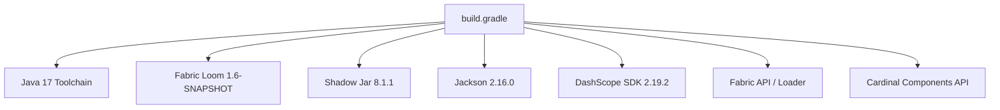

# 快速开始

<cite>
**本文引用的文件**
- [README.md](file://README.md)
- [build.gradle](file://build.gradle)
- [gradle.properties](file://gradle.properties)
- [settings.gradle](file://settings.gradle)
- [gradle-wrapper.properties](file://gradle/wrapper/gradle-wrapper.properties)
- [fabric.mod.json](file://src/main/resources/fabric.mod.json)
- [playerengine-llm-default.json](file://src/main/resources/playerengine-llm-default.json)
- [altoclef_settings.json](file://run/altoclef/altoclef_settings.json)
- [LLMConfig.java](file://src/main/java/adris/altoclef/player2api/llm/LLMConfig.java)
- [QwenProvider.java](file://src/main/java/adris/altoclef/player2api/llm/impl/QwenProvider.java)
- [OpenAICompatibleProvider.java](file://src/main/java/adris/altoclef/player2api/llm/impl/OpenAICompatibleProvider.java)
- [AliyunTTSProvider.java](file://src/main/java/adris/altoclef/player2api/tts/AliyunTTSProvider.java)
- [AliyunSTTProvider.java](file://src/main/java/adris/altoclef/player2api/stt/AliyunSTTProvider.java)
- [STTConfig.java](file://src/main/java/adris/altoclef/player2api/stt/STTConfig.java)
</cite>

## 目录
1. [简介](#简介)
2. [项目结构](#项目结构)
3. [核心组件](#核心组件)
4. [架构总览](#架构总览)
5. [详细组件分析](#详细组件分析)
6. [依赖分析](#依赖分析)
7. [性能考虑](#性能考虑)
8. [故障排查指南](#故障排查指南)
9. [结论](#结论)
10. [附录](#附录)

## 简介
本指南面向首次接触 Minecraft AI Player2NPC（基于 Fabric 的 AI NPC Mod）的新手开发者，帮助你在最短时间内完成环境准备、依赖安装、首次构建与启动，并掌握关键配置文件的使用方法。项目支持 Minecraft 1.20.1，使用 Java 17 与 Gradle 8.x，集成了基于 DashScope 的 LLM、TTS、STT 能力，支持自然语言对话与语音交互。

## 项目结构
该仓库采用 Fabric Mod 的标准工程布局，核心模块与资源分布如下：
- 构建脚本与配置：build.gradle、gradle.properties、settings.gradle、gradle/wrapper/gradle-wrapper.properties
- 资源与配置：src/main/resources（包含 fabric.mod.json、playerengine-llm-default.json 等）
- 源代码：src/main/java（包含 AI NPC、LLM、TTS、STT、Baritone 寻路等子模块）
- 运行时配置：run/ 目录（首次运行后生成）

**图表来源**
- [build.gradle:1-135](file://build.gradle#L1-L135)
- [gradle.properties:1-35](file://gradle.properties#L1-L35)
- [settings.gradle:1-28](file://settings.gradle#L1-L28)
- [gradle-wrapper.properties:1-6](file://gradle/wrapper/gradle-wrapper.properties#L1-L6)
- [fabric.mod.json:1-48](file://src/main/resources/fabric.mod.json#L1-L48)
- [playerengine-llm-default.json:1-89](file://src/main/resources/playerengine-llm-default.json#L1-L89)

**章节来源**
- [build.gradle:1-135](file://build.gradle#L1-L135)
- [gradle.properties:1-35](file://gradle.properties#L1-L35)
- [settings.gradle:1-28](file://settings.gradle#L1-L28)
- [gradle-wrapper.properties:1-6](file://gradle/wrapper/gradle-wrapper.properties#L1-L6)
- [fabric.mod.json:1-48](file://src/main/resources/fabric.mod.json#L1-L48)
- [playerengine-llm-default.json:1-89](file://src/main/resources/playerengine-llm-default.json#L1-L89)

## 核心组件
- 构建与运行环境
  - Java 17 强制要求，Gradle 8.x（使用 Wrapper）
  - Minecraft 1.20.1，Fabric Loader 与 Fabric API
- AI NPC 与 LLM
  - 基于 PlayerEngine（Baritone 分支）的 AI NPC 引擎
  - LLM Provider 架构，默认接入阿里云 DashScope（Qwen）
- 语音能力
  - TTS：阿里云 CosyVoice（DashScope）
  - STT：阿里云 Gummy（DashScope）
- 配置体系
  - playerengine-llm.json：LLM/TTS/STT 主配置
  - altoclef_settings.json：Bot 行为配置
  - 其余子系统配置与运行时状态文件自动生成

**章节来源**
- [README.md:46-56](file://README.md#L46-L56)
- [README.md:101-111](file://README.md#L101-L111)
- [README.md:162-222](file://README.md#L162-L222)
- [README.md:224-244](file://README.md#L224-L244)
- [README.md:245-277](file://README.md#L245-L277)

## 架构总览
Player2NPC 的核心运行链路围绕“客户端-服务端”交互展开：客户端负责麦克风录音与音频播放，服务端负责对话管理、LLM 推理与 TTS/STT 调用。

**图表来源**
- [README.md:496-529](file://README.md#L496-L529)
- [README.md:613-626](file://README.md#L613-L626)
- [README.md:634-651](file://README.md#L634-L651)

## 详细组件分析

### 环境与依赖要求
- Java 17：Minecraft 1.20.1 强制要求，且与 Gradle 8.10 兼容性限制，不支持 Java 18+
- Gradle 8.x：使用 Wrapper，无需手动安装
- Minecraft 1.20.1：由 Fabric Loom 自动下载
- 网络：首次构建需下载依赖，运行时访问 DashScope API
- 操作系统：macOS / Linux / Windows
- 磁盘空间：约 2–3 GB（首次构建）

**章节来源**
- [README.md:46-56](file://README.md#L46-L56)
- [README.md:57-99](file://README.md#L57-L99)
- [build.gradle:9](file://build.gradle#L9)
- [gradle-wrapper.properties:1-6](file://gradle/wrapper/gradle-wrapper.properties#L1-L6)
- [gradle.properties:26](file://gradle.properties#L26)

### 安装与首次构建
- 步骤概览
  1) 安装并指定 Java 17（参考 README 的平台指引）
  2) 获取 DashScope API Key（千问 + CosyVoice 共用）
  3) 克隆仓库并进入目录
  4) 一键构建并启动客户端：./gradlew clean runClient
- 首次构建说明
  - 自动下载 Minecraft 1.20.1、Fabric 依赖、DashScope SDK
  - 构建成功后自动打开游戏窗口
  - 后续运行可省略 clean：./gradlew runClient

**章节来源**
- [README.md:101-111](file://README.md#L101-L111)
- [README.md:112-135](file://README.md#L112-L135)
- [README.md:145-157](file://README.md#L145-L157)

### 配置文件详解

#### LLM & TTS & STT 配置 — playerengine-llm.json
- 位置：运行时生成于 <游戏目录>/config/playerengine-llm.json（开发模式为 run/config/playerengine-llm.json）
- 关键字段
  - activeProvider：当前 LLM 提供商（如 qwen）
  - providers.qwen.apiKey：DashScope API Key（必填）
  - providers.qwen.model：千问模型（如 qwen-plus）
  - tts.enabled：是否启用 TTS
  - tts.apiKey：TTS 专用 Key（留空则复用 qwen 的 API Key）
  - tts.model / tts.voice：CosyVoice 模型与音色（需版本匹配）
  - stt.enabled / stt.model / stt.language：STT 开关、模型与语言
  - proxy：HTTP 代理（网络受限时使用）

**章节来源**
- [README.md:162-222](file://README.md#L162-L222)
- [playerengine-llm-default.json:1-89](file://src/main/resources/playerengine-llm-default.json#L1-L89)

#### Bot 行为配置 — altoclef_settings.json
- 位置：运行时生成于 <游戏目录>/altoclef/altoclef_settings.json（开发模式为 run/altoclef/altoclef_settings.json）
- 主要可配项
  - commandPrefix：Bot 指令前缀
  - logLevel：日志级别
  - autoEat / mobDefense / autoMLGBucket：自动行为开关
  - throwAwayUnusedItems / importantItems：丢弃策略
  - homeBasePosition：基地坐标
  - idleCommand：空闲时执行的指令

**章节来源**
- [README.md:224-244](file://README.md#L224-L244)
- [altoclef_settings.json:1-48](file://run/altoclef/altoclef_settings.json#L1-L48)

#### 子系统配置与运行时状态
- 子系统配置（自动生成）：altoclef/configs/ 下的若干 JSON 文件
- 运行时状态：config/ 下的 chatclef_config.json 与 NPC 对话历史文件

**章节来源**
- [README.md:245-277](file://README.md#L245-L277)

### LLM Provider 架构与接入
- Provider 接口与注册
  - LLMProvider.java：Provider 接口
  - LLMProviderRegistry.java：Provider 注册表
  - LLMConfig.java：配置加载与实例化
- 内置实现
  - QwenProvider：继承 OpenAICompatibleProvider，使用 DashScope OpenAI 兼容接口
  - OpenAICompatibleProvider：通用 OpenAI 兼容实现，支持流式/非流式调用
- 接入新 Provider 的步骤
  1) 创建实现类（继承 OpenAICompatibleProvider 或实现 LLMProvider）
  2) 在注册表中注册
  3) 在 playerengine-llm.json 的 providers 中添加配置并设置 activeProvider

**图表来源**
- [OpenAICompatibleProvider.java:42-71](file://src/main/java/adris/altoclef/player2api/llm/impl/OpenAICompatibleProvider.java#L42-L71)
- [QwenProvider.java:1-21](file://src/main/java/adris/altoclef/player2api/llm/impl/QwenProvider.java#L1-L21)
- [LLMConfig.java:1-52](file://src/main/java/adris/altoclef/player2api/llm/LLMConfig.java#L1-L52)

**章节来源**
- [README.md:564-612](file://README.md#L564-L612)
- [QwenProvider.java:1-21](file://src/main/java/adris/altoclef/player2api/llm/impl/QwenProvider.java#L1-L21)
- [OpenAICompatibleProvider.java:42-71](file://src/main/java/adris/altoclef/player2api/llm/impl/OpenAICompatibleProvider.java#L42-L71)
- [LLMConfig.java:1-52](file://src/main/java/adris/altoclef/player2api/llm/LLMConfig.java#L1-L52)

### TTS 语音合成架构
- Provider：AliyunTTSProvider（DashScope CosyVoice）
- 调用链路
  - AgentSideEffects.onEntityMessage() → TTSManager.TTS() → Player2APIService.textToSpeech() → AliyunTTSProvider.synthesize() → DashScope WebSocket → 返回 WAV 音频 → 客户端播放
- 配置要点
  - tts.enabled：是否启用
  - tts.model / tts.voice：模型与音色版本需匹配
  - tts.volume / tts.speechRate / tts.pitchRate：音量与语速/音调

**章节来源**
- [README.md:613-626](file://README.md#L613-L626)
- [AliyunTTSProvider.java:1-32](file://src/main/java/adris/altoclef/player2api/tts/AliyunTTSProvider.java#L1-L32)
- [playerengine-llm-default.json:52-67](file://src/main/resources/playerengine-llm-default.json#L52-L67)

### STT 语音识别架构
- Provider：AliyunSTTProvider（DashScope Gummy）
- 调用链路
  - 客户端按键触发录音 → 发送 STTAudioPacket → 服务端 STTConfig.load() + AliyunSTTProvider.transcribe() → 返回识别文字 → ConversationManager 注入对话
- 配置要点
  - stt.enabled：是否启用
  - stt.model / stt.language：模型与语言
  - 录音时长与 VAD 断句行为

**章节来源**
- [README.md:634-651](file://README.md#L634-L651)
- [AliyunSTTProvider.java:1-33](file://src/main/java/adris/altoclef/player2api/stt/AliyunSTTProvider.java#L1-L33)
- [STTConfig.java:61-77](file://src/main/java/adris/altoclef/player2api/stt/STTConfig.java#L61-L77)
- [README.md:354-394](file://README.md#L354-L394)

## 依赖分析
- 构建工具链
  - Fabric Loom 1.6-SNAPSHOT、Shadow 8.1.1
  - Gradle Wrapper 8.10
- 运行时依赖
  - Jackson 2.16.0（JSON 处理）
  - DashScope SDK Java 2.19.2（TTS/STT）
  - Fabric API、Cardinal Components API（Mod 依赖）
- Java 版本约束
  - Java Toolchain 指定为 17

**图表来源**
- [build.gradle:1-135](file://build.gradle#L1-L135)
- [gradle-wrapper.properties:1-6](file://gradle/wrapper/gradle-wrapper.properties#L1-L6)

**章节来源**
- [build.gradle:1-135](file://build.gradle#L1-L135)
- [gradle-wrapper.properties:1-6](file://gradle/wrapper/gradle-wrapper.properties#L1-L6)

## 性能考虑
- 首次构建耗时较长，建议使用稳定的网络或配置镜像源
- LLM 调用默认在独立线程池执行，避免阻塞主线程
- TTS/STT 采用 WebSocket 与 DashScope 服务通信，注意网络延迟与带宽
- 可根据需求调整模型与温度参数以平衡质量与速度

[本节为通用建议，无需特定文件引用]

## 故障排查指南
- Java 版本不兼容
  - 症状：Unsupported class file major version
  - 处理：确保 JAVA_HOME 指向 Java 17，或在 gradle.properties 中设置 org.gradle.java.home
- 网络依赖下载失败
  - 症状：Could not resolve dependencies
  - 处理：检查网络连接，配置 Gradle 代理或阿里云 Maven 镜像
- 编译错误
  - 症状：Execution failed for task ':compileJava'
  - 处理：回滚改动或执行 ./gradlew clean 后重新构建
- 构建卡在下载依赖
  - 处理：配置阿里云 Maven 镜像加速
- 运行时问题
  - 401/403：检查 DashScope API Key 是否有效
  - NPC 有文字无语音：检查 tts.enabled 与日志中 AliyunTTS 相关输出
  - STT 识别为空：检查录音时长（≥0.5 秒）、麦克风权限与语言设置

**章节来源**
- [README.md:136-157](file://README.md#L136-L157)
- [README.md:456-491](file://README.md#L456-L491)

## 结论
通过本快速开始指南，你已经完成了环境准备、依赖安装、首次构建与启动，并掌握了 playerengine-llm.json、altoclef_settings.json 等关键配置文件的使用方法。建议在开发过程中：
- 将 API Key 保存在安全位置，不要提交到仓库
- 根据网络与成本选择合适的模型与参数
- 如需扩展，遵循 Provider 架构接入新的 LLM/TTS/STT 服务

[本节为总结，无需特定文件引用]

## 附录

### 快速操作清单
- 安装 Java 17 并设置 JAVA_HOME
- 获取 DashScope API Key
- 克隆仓库并进入目录
- ./gradlew clean runClient 首次构建
- 打开游戏，按 H 生成 NPC，按 T 或 V 与 NPC 交互

**章节来源**
- [README.md:112-135](file://README.md#L112-L135)
- [README.md:397-442](file://README.md#L397-L442)