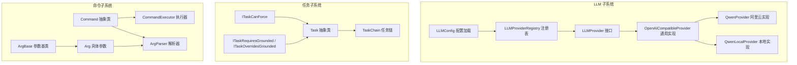
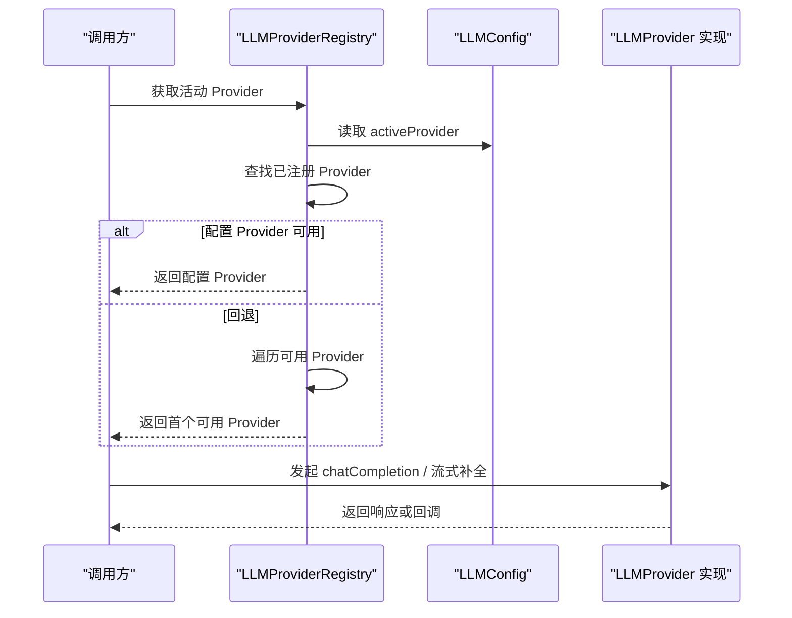
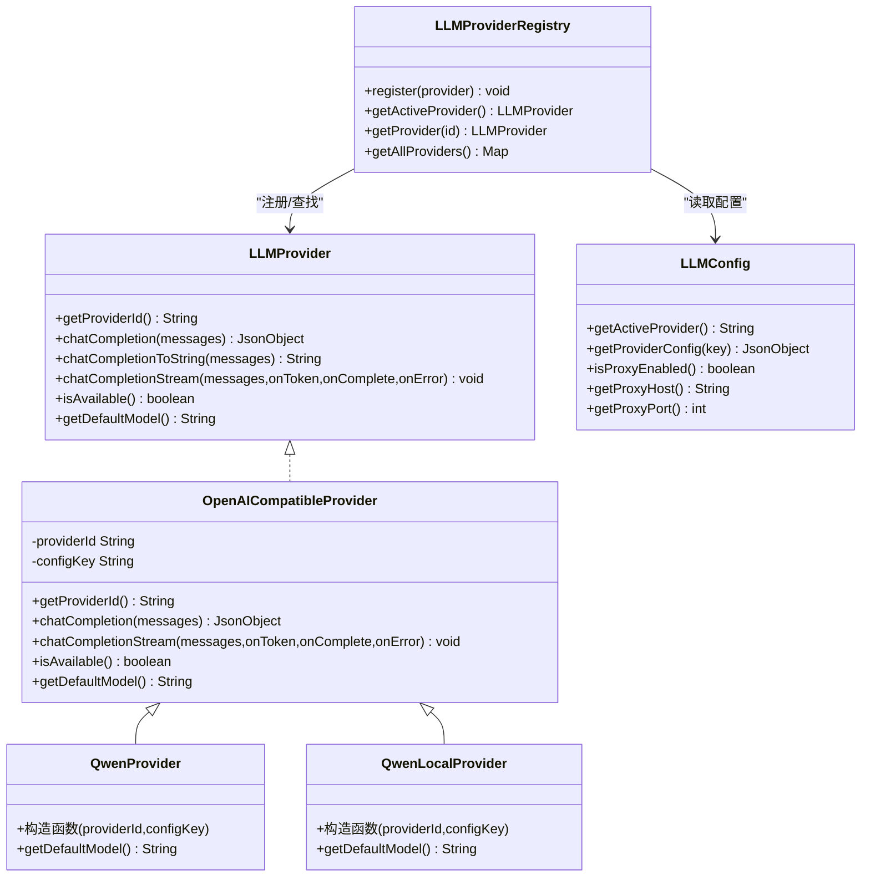
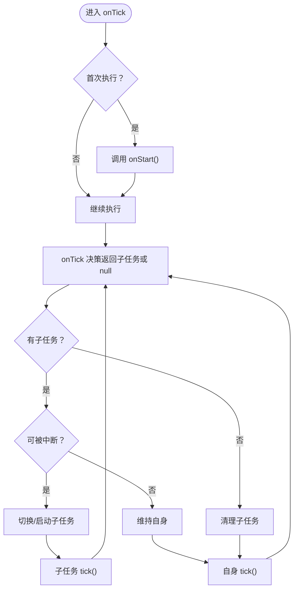
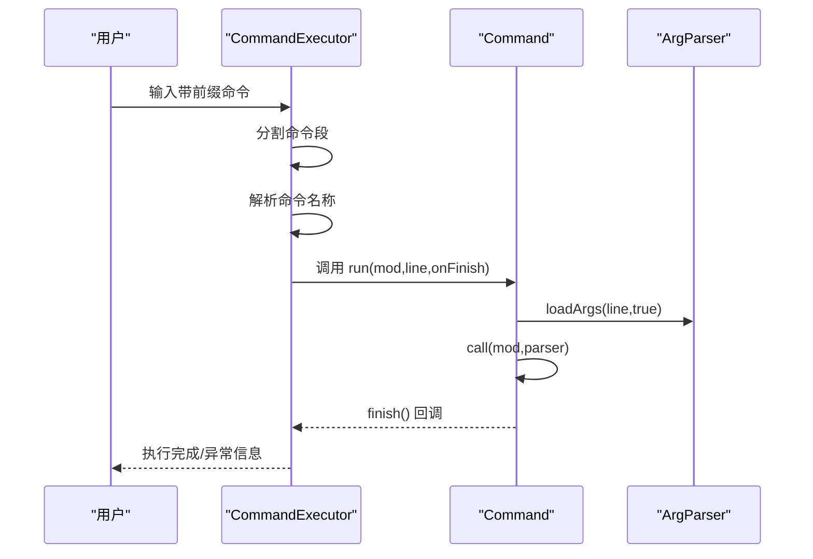
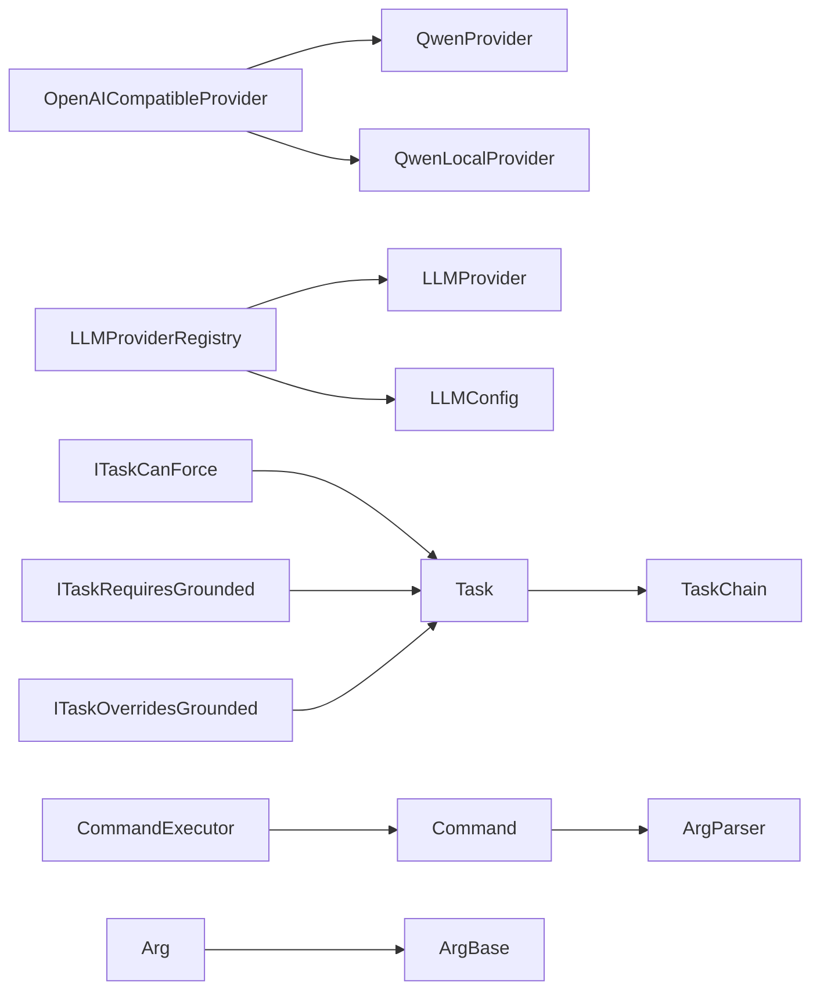

# 扩展开发指南

<cite>
**本文引用的文件**   
- [LLMProvider.java](file://src/main/java/adris/altoclef/player2api/llm/LLMProvider.java)
- [LLMProviderRegistry.java](file://src/main/java/adris/altoclef/player2api/llm/LLMProviderRegistry.java)
- [LLMConfig.java](file://src/main/java/adris/altoclef/player2api/llm/LLMConfig.java)
- [OpenAICompatibleProvider.java](file://src/main/java/adris/altoclef/player2api/llm/impl/OpenAICompatibleProvider.java)
- [QwenProvider.java](file://src/main/java/adris/altoclef/player2api/llm/impl/QwenProvider.java)
- [QwenLocalProvider.java](file://src/main/java/adris/altoclef/player2api/llm/impl/QwenLocalProvider.java)
- [playerengine-llm-default.json](file://src/main/resources/playerengine-llm-default.json)
- [Task.java](file://src/main/java/adris/altoclef/tasksystem/Task.java)
- [TaskChain.java](file://src/main/java/adris/altoclef/tasksystem/TaskChain.java)
- [ExampleTask.java](file://src/main/java/adris/altoclef/tasks/examples/ExampleTask.java)
- [Command.java](file://src/main/java/adris/altoclef/commandsystem/Command.java)
- [ArgParser.java](file://src/main/java/adris/altoclef/commandsystem/ArgParser.java)
- [ArgBase.java](file://src/main/java/adris/altoclef/commandsystem/ArgBase.java)
- [Arg.java](file://src/main/java/adris/altoclef/commandsystem/Arg.java)
- [CommandExecutor.java](file://src/main/java/adris/altoclef/commandsystem/CommandExecutor.java)
- [ITaskCanForce.java](file://src/main/java/adris/altoclef/tasksystem/ITaskCanForce.java)
- [ITaskRequiresGrounded.java](file://src/main/java/adris/altoclef/tasksystem/ITaskRequiresGrounded.java)
- [ITaskOverridesGrounded.java](file://src/main/java/adris/altoclef/tasksystem/ITaskOverridesGrounded.java)
</cite>

## 目录
1. [简介](#简介)
2. [项目结构](#项目结构)
3. [核心组件](#核心组件)
4. [架构总览](#架构总览)
5. [详细组件分析](#详细组件分析)
6. [依赖分析](#依赖分析)
7. [性能考量](#性能考量)
8. [故障排查指南](#故障排查指南)
9. [结论](#结论)
10. [附录](#附录)

## 简介
本指南面向希望为项目添加新扩展的开发者，涵盖以下主题：
- 新增 LLM Provider：Provider 接口实现要求、配置文件扩展方法、注册机制使用
- 自定义任务类型：Task 抽象类继承、任务执行逻辑、任务状态与中断策略
- 自定义命令：Command 接口实现、参数解析、命令权限与前缀控制
- 插件化架构：扩展点设计原则、接口契约、版本兼容性
- 示例与最佳实践：常见扩展需求的实现路径、测试与发布维护建议

## 项目结构
项目采用分层+功能域混合组织方式：
- player2api 子系统负责 LLM/TTS/STT 等能力，其中 llm 子包提供统一的 Provider 接口与注册表
- tasksystem 子系统提供任务生命周期与链式调度框架
- commandsystem 子系统提供命令解析与执行框架
- resources 中包含默认配置文件，用于初始化与演示

**图表来源**
- [LLMProvider.java:11-66](file://src/main/java/adris/altoclef/player2api/llm/LLMProvider.java#L11-L66)
- [LLMProviderRegistry.java:16-79](file://src/main/java/adris/altoclef/player2api/llm/LLMProviderRegistry.java#L16-L79)
- [LLMConfig.java:19-89](file://src/main/java/adris/altoclef/player2api/llm/LLMConfig.java#L19-L89)
- [OpenAICompatibleProvider.java:24-225](file://src/main/java/adris/altoclef/player2api/llm/impl/OpenAICompatibleProvider.java#L24-L225)
- [QwenProvider.java:11-21](file://src/main/java/adris/altoclef/player2api/llm/impl/QwenProvider.java#L11-L21)
- [QwenLocalProvider.java:12-22](file://src/main/java/adris/altoclef/player2api/llm/impl/QwenLocalProvider.java#L12-L22)
- [Task.java:8-180](file://src/main/java/adris/altoclef/tasksystem/Task.java#L8-L180)
- [TaskChain.java:7-50](file://src/main/java/adris/altoclef/tasksystem/TaskChain.java#L7-L50)
- [Command.java:6-60](file://src/main/java/adris/altoclef/commandsystem/Command.java#L6-L60)
- [ArgParser.java:6-105](file://src/main/java/adris/altoclef/commandsystem/ArgParser.java#L6-L105)
- [ArgBase.java:5-43](file://src/main/java/adris/altoclef/commandsystem/ArgBase.java#L5-L43)
- [Arg.java:3-170](file://src/main/java/adris/altoclef/commandsystem/Arg.java#L3-L170)
- [CommandExecutor.java:11-120](file://src/main/java/adris/altoclef/commandsystem/CommandExecutor.java#L11-L120)

**章节来源**
- [LLMProvider.java:1-67](file://src/main/java/adris/altoclef/player2api/llm/LLMProvider.java#L1-L67)
- [LLMProviderRegistry.java:1-80](file://src/main/java/adris/altoclef/player2api/llm/LLMProviderRegistry.java#L1-L80)
- [LLMConfig.java:1-116](file://src/main/java/adris/altoclef/player2api/llm/LLMConfig.java#L1-L116)
- [OpenAICompatibleProvider.java:1-226](file://src/main/java/adris/altoclef/player2api/llm/impl/OpenAICompatibleProvider.java#L1-L226)
- [QwenProvider.java:1-22](file://src/main/java/adris/altoclef/player2api/llm/impl/QwenProvider.java#L1-L22)
- [QwenLocalProvider.java:1-23](file://src/main/java/adris/altoclef/player2api/llm/impl/QwenLocalProvider.java#L1-L23)
- [Task.java:1-181](file://src/main/java/adris/altoclef/tasksystem/Task.java#L1-L181)
- [TaskChain.java:1-51](file://src/main/java/adris/altoclef/tasksystem/TaskChain.java#L1-L51)
- [Command.java:1-61](file://src/main/java/adris/altoclef/commandsystem/Command.java#L1-L61)
- [ArgParser.java:1-106](file://src/main/java/adris/altoclef/commandsystem/ArgParser.java#L1-L106)
- [ArgBase.java:1-44](file://src/main/java/adris/altoclef/commandsystem/ArgBase.java#L1-L44)
- [Arg.java:1-171](file://src/main/java/adris/altoclef/commandsystem/Arg.java#L1-L171)
- [CommandExecutor.java:1-121](file://src/main/java/adris/altoclef/commandsystem/CommandExecutor.java#L1-L121)

## 核心组件
- LLM Provider 统一接口与注册表
  - LLMProvider：定义统一的 Provider 能力，包括唯一标识、聊天补全、流式补全、可用性检查、默认模型等
  - LLMProviderRegistry：单例注册表，内置注册多个 Provider，并支持按配置选择活动 Provider
  - LLMConfig：从配置文件加载 Provider、代理、TTS、STT 等配置
- 任务系统
  - Task：抽象任务生命周期（开始/结束/停止/失败/中断）、调试状态、子任务嵌套与优先级判断
  - TaskChain：任务链抽象，负责收集当前 Tick 的任务树、优先级与激活状态
  - ITaskCanForce/ITaskRequiresGrounded/ITaskOverridesGrounded：任务强制打断与地面状态约束
- 命令系统
  - Command：命令抽象，封装参数解析器、帮助表示、日志输出、完成回调
  - ArgBase/Arg：参数基类与具体参数类型，支持默认值、数组、枚举、复杂类型解析
  - ArgParser：命令行解析器，支持引号、注释、默认参数策略
  - CommandExecutor：命令执行器，支持多段命令链式执行、异常传播与前缀控制

**章节来源**
- [LLMProvider.java:11-66](file://src/main/java/adris/altoclef/player2api/llm/LLMProvider.java#L11-L66)
- [LLMProviderRegistry.java:16-79](file://src/main/java/adris/altoclef/player2api/llm/LLMProviderRegistry.java#L16-L79)
- [LLMConfig.java:19-115](file://src/main/java/adris/altoclef/player2api/llm/LLMConfig.java#L19-L115)
- [Task.java:8-180](file://src/main/java/adris/altoclef/tasksystem/Task.java#L8-L180)
- [TaskChain.java:7-50](file://src/main/java/adris/altoclef/tasksystem/TaskChain.java#L7-L50)
- [ITaskCanForce.java:1-5](file://src/main/java/adris/altoclef/tasksystem/ITaskCanForce.java#L1-L5)
- [ITaskRequiresGrounded.java:1-15](file://src/main/java/adris/altoclef/tasksystem/ITaskRequiresGrounded.java#L1-L15)
- [ITaskOverridesGrounded.java:1-4](file://src/main/java/adris/altoclef/tasksystem/ITaskOverridesGrounded.java#L1-L4)
- [Command.java:6-60](file://src/main/java/adris/altoclef/commandsystem/Command.java#L6-L60)
- [ArgBase.java:5-43](file://src/main/java/adris/altoclef/commandsystem/ArgBase.java#L5-L43)
- [Arg.java:3-170](file://src/main/java/adris/altoclef/commandsystem/Arg.java#L3-L170)
- [ArgParser.java:6-105](file://src/main/java/adris/altoclef/commandsystem/ArgParser.java#L6-L105)
- [CommandExecutor.java:11-120](file://src/main/java/adris/altoclef/commandsystem/CommandExecutor.java#L11-L120)

## 架构总览
下图展示了 LLM Provider 的扩展点与注册流程，以及配置驱动的 Provider 选择策略。

**图表来源**
- [LLMProviderRegistry.java:49-70](file://src/main/java/adris/altoclef/player2api/llm/LLMProviderRegistry.java#L49-L70)
- [LLMConfig.java:93-98](file://src/main/java/adris/altoclef/player2api/llm/LLMConfig.java#L93-L98)
- [LLMProvider.java:21-66](file://src/main/java/adris/altoclef/player2api/llm/LLMProvider.java#L21-L66)

## 详细组件分析

### LLM Provider 扩展开发
- 接口契约
  - 必须实现：唯一 Provider ID、聊天补全（非流式与流式）、可用性检查、默认模型名
  - 默认行为：提供字符串版聊天补全便捷方法与流式回退实现
- 通用实现参考
  - OpenAICompatibleProvider：统一构建请求体、连接、代理、错误处理、SSE 流式解析
  - QwenProvider/QwenLocalProvider：通过构造函数覆写 Provider ID 与配置键，保持通用逻辑
- 注册与选择
  - 在 LLMProviderRegistry 中注册新 Provider；若未显式注册，可在首次访问时由注册表自动注册内置 Provider
  - 通过 LLMConfig 的 activeProvider 字段选择活动 Provider，不在线时自动回退到第一个可用 Provider
- 配置文件扩展
  - 在配置文件中新增 Provider 节点，设置 enabled、apiUrl、apiKey、model、maxTokens、temperature 等
  - 支持代理配置（enabled/host/port）

**图表来源**
- [LLMProvider.java:11-66](file://src/main/java/adris/altoclef/player2api/llm/LLMProvider.java#L11-L66)
- [OpenAICompatibleProvider.java:24-225](file://src/main/java/adris/altoclef/player2api/llm/impl/OpenAICompatibleProvider.java#L24-L225)
- [QwenProvider.java:11-21](file://src/main/java/adris/altoclef/player2api/llm/impl/QwenProvider.java#L11-L21)
- [QwenLocalProvider.java:12-22](file://src/main/java/adris/altoclef/player2api/llm/impl/QwenLocalProvider.java#L12-L22)
- [LLMProviderRegistry.java:16-79](file://src/main/java/adris/altoclef/player2api/llm/LLMProviderRegistry.java#L16-L79)
- [LLMConfig.java:19-115](file://src/main/java/adris/altoclef/player2api/llm/LLMConfig.java#L19-L115)

**章节来源**
- [LLMProvider.java:11-66](file://src/main/java/adris/altoclef/player2api/llm/LLMProvider.java#L11-L66)
- [OpenAICompatibleProvider.java:24-225](file://src/main/java/adris/altoclef/player2api/llm/impl/OpenAICompatibleProvider.java#L24-L225)
- [QwenProvider.java:11-21](file://src/main/java/adris/altoclef/player2api/llm/impl/QwenProvider.java#L11-L21)
- [QwenLocalProvider.java:12-22](file://src/main/java/adris/altoclef/player2api/llm/impl/QwenLocalProvider.java#L12-L22)
- [LLMProviderRegistry.java:32-70](file://src/main/java/adris/altoclef/player2api/llm/LLMProviderRegistry.java#L32-L70)
- [LLMConfig.java:54-89](file://src/main/java/adris/altoclef/player2api/llm/LLMConfig.java#L54-L89)
- [playerengine-llm-default.json:1-89](file://src/main/resources/playerengine-llm-default.json#L1-L89)

### 自定义任务类型开发
- 继承与生命周期
  - 继承 Task，实现 onStart/onTick/onStop/isEqual/toDebugString 等抽象方法
  - 使用 setDebugState 控制调试输出；通过 stop/interrupt/fail 管理任务终止与失败
- 子任务与中断策略
  - onTick 可返回子任务以嵌套执行；通过 canBeInterrupted 判断是否允许被更高优先级任务打断
  - ITaskCanForce/ITaskRequiresGrounded/ITaskOverridesGrounded 提供强制打断与地面状态约束
- 任务链与优先级
  - TaskChain 提供优先级与激活状态抽象；Task 维护任务树可视化输出
- 开发示例
  - ExampleTask 展示了条件分支、资源检查、移动与放置等组合逻辑

**图表来源**
- [Task.java:17-164](file://src/main/java/adris/altoclef/tasksystem/Task.java#L17-L164)
- [TaskChain.java:16-30](file://src/main/java/adris/altoclef/tasksystem/TaskChain.java#L16-L30)
- [ITaskCanForce.java:1-5](file://src/main/java/adris/altoclef/tasksystem/ITaskCanForce.java#L1-L5)
- [ITaskRequiresGrounded.java:5-14](file://src/main/java/adris/altoclef/tasksystem/ITaskRequiresGrounded.java#L5-L14)
- [ITaskOverridesGrounded.java:1-4](file://src/main/java/adris/altoclef/tasksystem/ITaskOverridesGrounded.java#L1-L4)

**章节来源**
- [Task.java:17-180](file://src/main/java/adris/altoclef/tasksystem/Task.java#L17-L180)
- [TaskChain.java:16-50](file://src/main/java/adris/altoclef/tasksystem/TaskChain.java#L16-L50)
- [ITaskCanForce.java:1-5](file://src/main/java/adris/altoclef/tasksystem/ITaskCanForce.java#L1-L5)
- [ITaskRequiresGrounded.java:1-15](file://src/main/java/adris/altoclef/tasksystem/ITaskRequiresGrounded.java#L1-L15)
- [ITaskOverridesGrounded.java:1-4](file://src/main/java/adris/altoclef/tasksystem/ITaskOverridesGrounded.java#L1-L4)
- [ExampleTask.java:12-67](file://src/main/java/adris/altoclef/tasks/examples/ExampleTask.java#L12-L67)

### 自定义命令开发
- 命令实现
  - 继承 Command，构造函数传入名称、描述与参数列表；重写 call 方法执行业务逻辑
  - 使用 ArgParser 解析参数，finish 回调通知执行完成
- 参数解析
  - ArgBase/Arg 支持基本类型、枚举、数组、复杂类型（ItemList/GotoTarget）
  - ArgParser 支持引号包裹、反斜杠转义、注释截断、默认值策略
- 执行与权限
  - CommandExecutor 负责注册命令、解析命令链、执行与异常传播
  - 命令前缀由 mod 设置决定，支持带/不带前缀的执行

**图表来源**
- [CommandExecutor.java:58-76](file://src/main/java/adris/altoclef/commandsystem/CommandExecutor.java#L58-L76)
- [Command.java:19-30](file://src/main/java/adris/altoclef/commandsystem/Command.java#L19-L30)
- [ArgParser.java:57-96](file://src/main/java/adris/altoclef/commandsystem/ArgParser.java#L57-L96)
- [Arg.java:151-154](file://src/main/java/adris/altoclef/commandsystem/Arg.java#L151-L154)

**章节来源**
- [Command.java:6-60](file://src/main/java/adris/altoclef/commandsystem/Command.java#L6-L60)
- [ArgParser.java:6-105](file://src/main/java/adris/altoclef/commandsystem/ArgParser.java#L6-L105)
- [ArgBase.java:5-43](file://src/main/java/adris/altoclef/commandsystem/ArgBase.java#L5-L43)
- [Arg.java:3-170](file://src/main/java/adris/altoclef/commandsystem/Arg.java#L3-L170)
- [CommandExecutor.java:11-120](file://src/main/java/adris/altoclef/commandsystem/CommandExecutor.java#L11-L120)

## 依赖分析
- LLM Provider 依赖关系
  - OpenAICompatibleProvider 作为通用实现，被 QwenProvider 与 QwenLocalProvider 继承
  - LLMProviderRegistry 维护 Provider 映射，依赖 LLMConfig 获取配置
- 任务系统依赖关系
  - Task 与 TaskChain 彼此协作；ITaskCanForce/ITaskRequiresGrounded/ITaskOverridesGrounded 为任务打断与约束提供扩展点
- 命令系统依赖关系
  - CommandExecutor 依赖 Command 与 ArgParser；Arg 依赖 ArgBase 与具体类型解析

**图表来源**
- [OpenAICompatibleProvider.java:24-225](file://src/main/java/adris/altoclef/player2api/llm/impl/OpenAICompatibleProvider.java#L24-L225)
- [QwenProvider.java:11-21](file://src/main/java/adris/altoclef/player2api/llm/impl/QwenProvider.java#L11-L21)
- [QwenLocalProvider.java:12-22](file://src/main/java/adris/altoclef/player2api/llm/impl/QwenLocalProvider.java#L12-L22)
- [LLMProviderRegistry.java:16-79](file://src/main/java/adris/altoclef/player2api/llm/LLMProviderRegistry.java#L16-L79)
- [LLMConfig.java:19-115](file://src/main/java/adris/altoclef/player2api/llm/LLMConfig.java#L19-L115)
- [Task.java:8-180](file://src/main/java/adris/altoclef/tasksystem/Task.java#L8-L180)
- [TaskChain.java:7-50](file://src/main/java/adris/altoclef/tasksystem/TaskChain.java#L7-L50)
- [ITaskCanForce.java:1-5](file://src/main/java/adris/altoclef/tasksystem/ITaskCanForce.java#L1-L5)
- [ITaskRequiresGrounded.java:1-15](file://src/main/java/adris/altoclef/tasksystem/ITaskRequiresGrounded.java#L1-L15)
- [ITaskOverridesGrounded.java:1-4](file://src/main/java/adris/altoclef/tasksystem/ITaskOverridesGrounded.java#L1-L4)
- [CommandExecutor.java:11-120](file://src/main/java/adris/altoclef/commandsystem/CommandExecutor.java#L11-L120)
- [ArgParser.java:6-105](file://src/main/java/adris/altoclef/commandsystem/ArgParser.java#L6-L105)
- [Arg.java:3-170](file://src/main/java/adris/altoclef/commandsystem/Arg.java#L3-L170)
- [ArgBase.java:5-43](file://src/main/java/adris/altoclef/commandsystem/ArgBase.java#L5-L43)

**章节来源**
- [LLMProviderRegistry.java:32-70](file://src/main/java/adris/altoclef/player2api/llm/LLMProviderRegistry.java#L32-L70)
- [LLMConfig.java:54-89](file://src/main/java/adris/altoclef/player2api/llm/LLMConfig.java#L54-L89)
- [Task.java:17-164](file://src/main/java/adris/altoclef/tasksystem/Task.java#L17-L164)
- [CommandExecutor.java:58-76](file://src/main/java/adris/altoclef/commandsystem/CommandExecutor.java#L58-L76)

## 性能考量
- LLM Provider
  - 合理设置 maxTokens 与 temperature，避免过大导致超时或过小影响响应质量
  - 使用流式补全提升首 token 延迟体验；注意 SSE 数据解析的健壮性
  - 代理配置仅在必要时开启，减少额外网络开销
- 任务系统
  - 避免频繁创建临时任务对象；合理利用任务相等性判断减少重复执行
  - 子任务链尽量短而清晰，避免深层嵌套导致调试与中断复杂度上升
- 命令系统
  - 参数解析应尽量避免昂贵操作；对复杂类型解析进行缓存或延迟计算

## 故障排查指南
- LLM Provider
  - 无可用 Provider：检查配置文件中 activeProvider 是否存在且 isAvailable 返回 true；查看注册表日志
  - API 错误：关注 HTTP 状态码与错误流内容；确认 apiKey、apiUrl、model 配置正确
  - 代理问题：确认代理 host/port 启用状态与可达性
- 任务系统
  - 任务无法停止/中断：检查 shouldForce 与地面状态约束；确保 onStop 正确释放资源
  - 调试输出异常：核对 setDebugState 的更新时机与去抖动
- 命令系统
  - 参数解析异常：检查 Arg 类型支持范围与默认值策略；确认引号与转义规则
  - 命令不存在：确认命令名称大小写与前缀匹配

**章节来源**
- [LLMProviderRegistry.java:49-70](file://src/main/java/adris/altoclef/player2api/llm/LLMProviderRegistry.java#L49-L70)
- [OpenAICompatibleProvider.java:112-141](file://src/main/java/adris/altoclef/player2api/llm/impl/OpenAICompatibleProvider.java#L112-L141)
- [LLMConfig.java:100-110](file://src/main/java/adris/altoclef/player2api/llm/LLMConfig.java#L100-L110)
- [Task.java:78-124](file://src/main/java/adris/altoclef/tasksystem/Task.java#L78-L124)
- [ArgParser.java:69-96](file://src/main/java/adris/altoclef/commandsystem/ArgParser.java#L69-L96)
- [CommandExecutor.java:94-111](file://src/main/java/adris/altoclef/commandsystem/CommandExecutor.java#L94-L111)

## 结论
本指南提供了从接口契约到实现细节、从配置扩展到注册选择的完整路径。遵循统一的 Provider 接口、任务生命周期与命令解析规范，可快速、安全地扩展新能力并融入现有生态。建议在开发过程中充分利用默认实现与注册表机制，结合配置文件与日志定位问题，确保扩展的稳定性与可维护性。

## 附录
- 新增 LLM Provider 的步骤清单
  - 实现 LLMProvider 或继承 OpenAICompatibleProvider
  - 在 LLMProviderRegistry 中注册 Provider（如需）
  - 在配置文件中新增 Provider 节点并设置 activeProvider
  - 编写最小可验证用例，检查可用性与流式补全
- 新增自定义任务的步骤清单
  - 继承 Task 并实现生命周期方法
  - 设计合理的子任务链与中断策略
  - 使用 setDebugState 输出关键状态，便于调试
- 新增自定义命令的步骤清单
  - 继承 Command，定义参数类型与默认值
  - 在 CommandExecutor 中注册命令
  - 编写命令帮助与异常提示