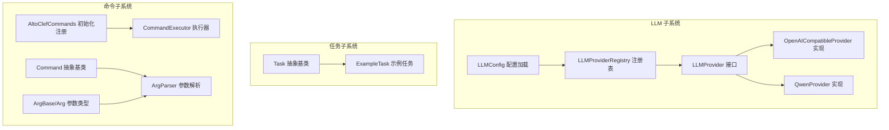
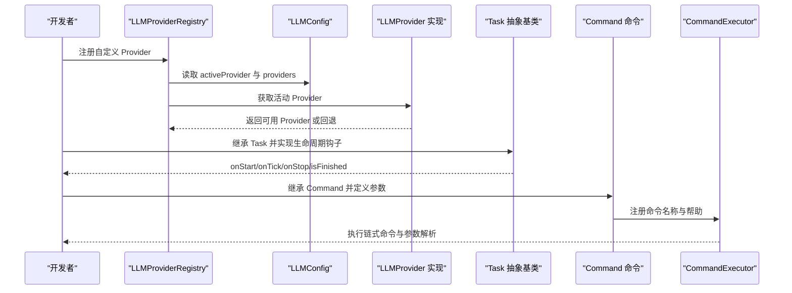
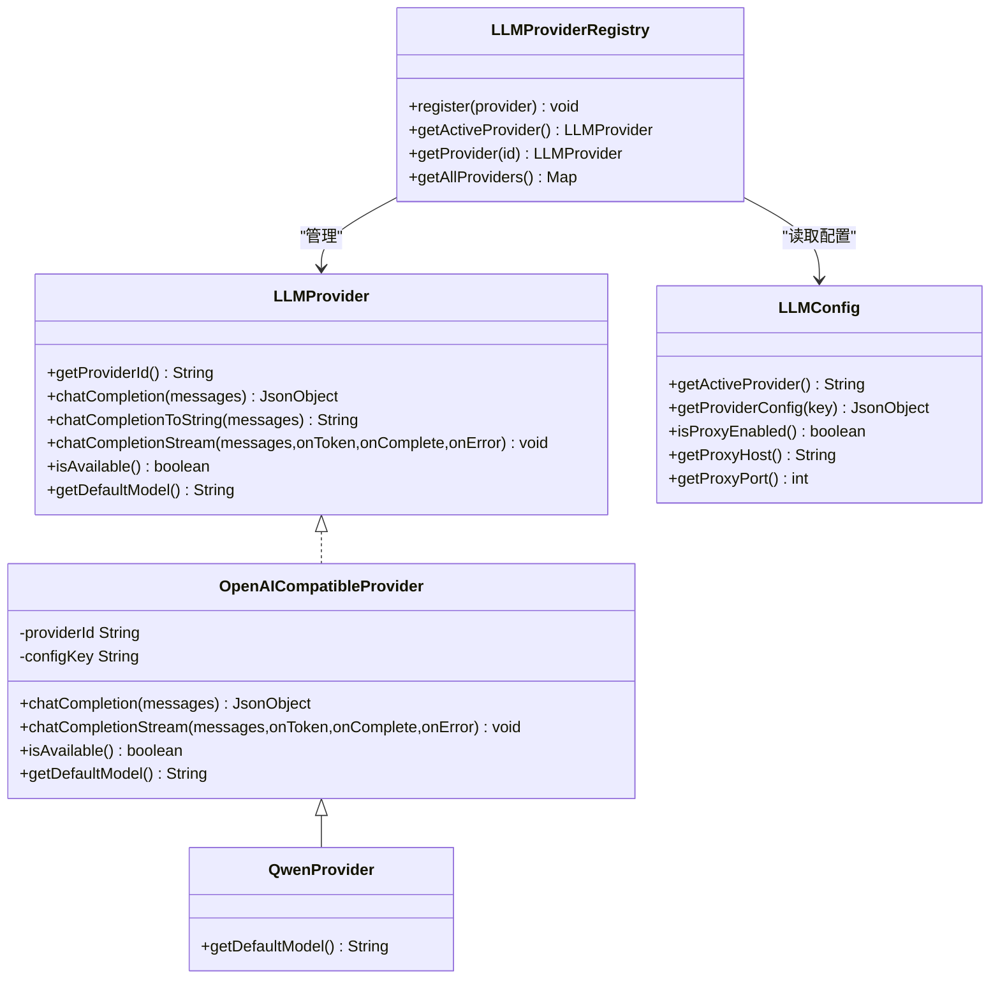
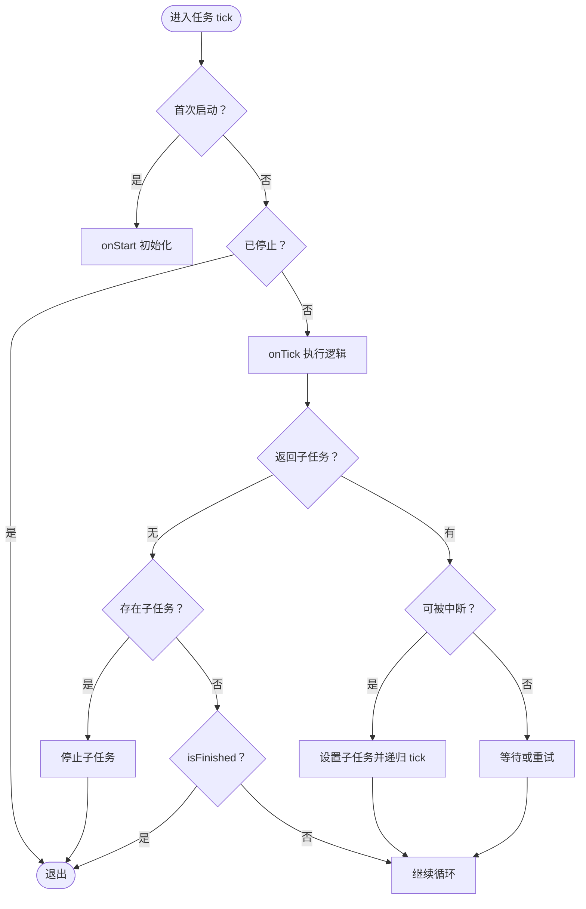
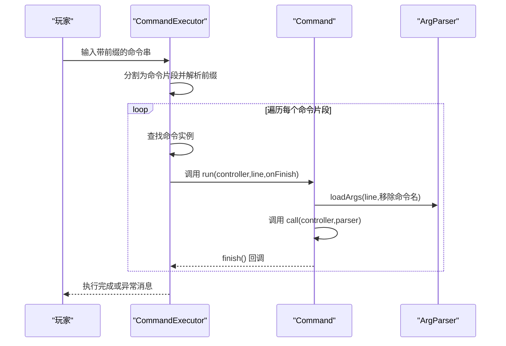
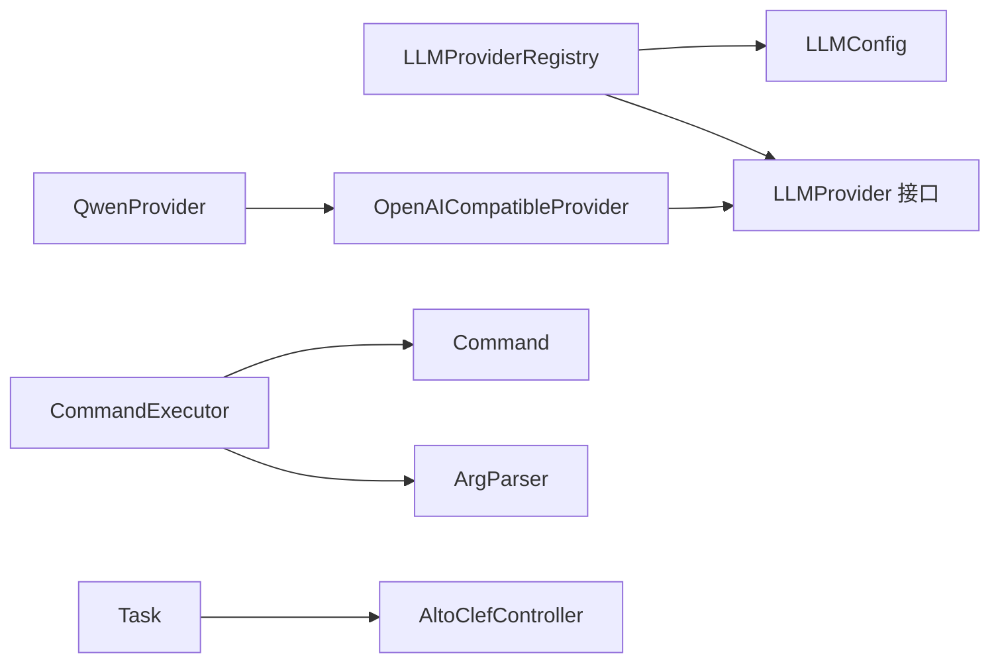

# 扩展开发指南

<cite>
**本文引用的文件**
- [LLMProvider.java](file://src/main/java/adris/altoclef/player2api/llm/LLMProvider.java)
- [LLMProviderRegistry.java](file://src/main/java/adris/altoclef/player2api/llm/LLMProviderRegistry.java)
- [LLMConfig.java](file://src/main/java/adris/altoclef/player2api/llm/LLMConfig.java)
- [OpenAICompatibleProvider.java](file://src/main/java/adris/altoclef/player2api/llm/impl/OpenAICompatibleProvider.java)
- [QwenProvider.java](file://src/main/java/adris/altoclef/player2api/llm/impl/QwenProvider.java)
- [playerengine-llm-default.json](file://src/main/resources/playerengine-llm-default.json)
- [Task.java](file://src/main/java/adris/altoclef/tasksystem/Task.java)
- [ExampleTask.java](file://src/main/java/adris/altoclef/tasks/examples/ExampleTask.java)
- [Command.java](file://src/main/java/adris/altoclef/commandsystem/Command.java)
- [ArgParser.java](file://src/main/java/adris/altoclef/commandsystem/ArgParser.java)
- [ArgBase.java](file://src/main/java/adris/altoclef/commandsystem/ArgBase.java)
- [Arg.java](file://src/main/java/adris/altoclef/commandsystem/Arg.java)
- [CommandExecutor.java](file://src/main/java/adris/altoclef/commandsystem/CommandExecutor.java)
- [AltoClefCommands.java](file://src/main/java/adris/altoclef/AltoClefCommands.java)
</cite>

## 目录
1. [简介](#简介)
2. [项目结构](#项目结构)
3. [核心组件](#核心组件)
4. [架构总览](#架构总览)
5. [详细组件分析](#详细组件分析)
6. [依赖分析](#依赖分析)
7. [性能考虑](#性能考虑)
8. [故障排查指南](#故障排查指南)
9. [结论](#结论)
10. [附录](#附录)

## 简介
本指南面向希望扩展 AI NPC 项目的开发者，围绕以下主题提供从零到一的完整开发路径与最佳实践：
- 自定义 LLM Provider 的实现方式、注册机制与配置方法
- 自定义任务的开发流程：任务基类继承、实现规范与注册方式
- 自定义命令的开发：命令实现、参数解析与注册方法
- 具体扩展示例、接口说明与最佳实践
- 调试技巧、测试方法与性能优化建议
- 常见问题：接口实现、依赖注入与兼容性问题

## 项目结构
本项目采用模块化分层组织，核心扩展点集中在以下模块：
- LLM 抽象与实现：统一接口、注册表、配置加载与多种 Provider 实现
- 任务系统：抽象任务基类与具体任务示例
- 命令系统：命令基类、参数解析器与命令执行器

图表来源
- [LLMProvider.java:11-66](file://src/main/java/adris/altoclef/player2api/llm/LLMProvider.java#L11-L66)
- [LLMConfig.java:19-103](file://src/main/java/adris/altoclef/player2api/llm/LLMConfig.java#L19-L103)
- [LLMProviderRegistry.java:16-79](file://src/main/java/adris/altoclef/player2api/llm/LLMProviderRegistry.java#L16-L79)
- [OpenAICompatibleProvider.java:24-220](file://src/main/java/adris/altoclef/player2api/llm/impl/OpenAICompatibleProvider.java#L24-L220)
- [QwenProvider.java:11-21](file://src/main/java/adris/altoclef/player2api/llm/impl/QwenProvider.java#L11-L21)
- [Task.java:8-180](file://src/main/java/adris/altoclef/tasksystem/Task.java#L8-L180)
- [ExampleTask.java:12-67](file://src/main/java/adris/altoclef/tasks/examples/ExampleTask.java#L12-L67)
- [Command.java:6-60](file://src/main/java/adris/altoclef/commandsystem/Command.java#L6-L60)
- [ArgParser.java:6-105](file://src/main/java/adris/altoclef/commandsystem/ArgParser.java#L6-L105)
- [ArgBase.java:5-43](file://src/main/java/adris/altoclef/commandsystem/ArgBase.java#L5-L43)
- [Arg.java:3-170](file://src/main/java/adris/altoclef/commandsystem/Arg.java#L3-L170)
- [CommandExecutor.java:11-120](file://src/main/java/adris/altoclef/commandsystem/CommandExecutor.java#L11-L120)
- [AltoClefCommands.java:29-58](file://src/main/java/adris/altoclef/AltoClefCommands.java#L29-L58)

章节来源
- [LLMProvider.java:11-66](file://src/main/java/adris/altoclef/player2api/llm/LLMProvider.java#L11-L66)
- [LLMConfig.java:19-103](file://src/main/java/adris/altoclef/player2api/llm/LLMConfig.java#L19-L103)
- [LLMProviderRegistry.java:16-79](file://src/main/java/adris/altoclef/player2api/llm/LLMProviderRegistry.java#L16-L79)
- [OpenAICompatibleProvider.java:24-220](file://src/main/java/adris/altoclef/player2api/llm/impl/OpenAICompatibleProvider.java#L24-L220)
- [QwenProvider.java:11-21](file://src/main/java/adris/altoclef/player2api/llm/impl/QwenProvider.java#L11-L21)
- [Task.java:8-180](file://src/main/java/adris/altoclef/tasksystem/Task.java#L8-L180)
- [ExampleTask.java:12-67](file://src/main/java/adris/altoclef/tasks/examples/ExampleTask.java#L12-L67)
- [Command.java:6-60](file://src/main/java/adris/altoclef/commandsystem/Command.java#L6-L60)
- [ArgParser.java:6-105](file://src/main/java/adris/altoclef/commandsystem/ArgParser.java#L6-L105)
- [ArgBase.java:5-43](file://src/main/java/adris/altoclef/commandsystem/ArgBase.java#L5-L43)
- [Arg.java:3-170](file://src/main/java/adris/altoclef/commandsystem/Arg.java#L3-L170)
- [CommandExecutor.java:11-120](file://src/main/java/adris/altoclef/commandsystem/CommandExecutor.java#L11-L120)
- [AltoClefCommands.java:29-58](file://src/main/java/adris/altoclef/AltoClefCommands.java#L29-L58)

## 核心组件
- LLMProvider：统一的 LLM 抽象接口，定义提供者标识、聊天补全、流式输出、可用性检查与默认模型等能力
- LLMConfig：负责从配置文件加载 LLM 提供者配置，支持代理、TTS、STT 等子配置
- LLMProviderRegistry：单例注册表，内置注册多个 Provider，并根据配置选择活动 Provider
- OpenAICompatibleProvider：通用 OpenAI 兼容 API 的 Provider 实现，支持流式与非流式请求、代理、参数校验
- QwenProvider：基于 OpenAI 兼容实现的阿里云 Qwen Provider，覆盖提供者 ID、配置键与默认模型
- Task：任务抽象基类，定义生命周期钩子、中断/停止、超时判断与任务树可视化
- ExampleTask：任务开发示例，展示如何组合子任务与状态判断
- Command：命令抽象基类，封装参数解析、帮助表示、日志记录与执行回调
- ArgParser/ArgBase/Arg：参数解析体系，支持类型转换、默认值、数组参数与帮助信息
- CommandExecutor：命令执行器，支持链式命令、前缀匹配与异常传播
- AltoClefCommands：命令初始化入口，集中注册所有可用命令

章节来源
- [LLMProvider.java:11-66](file://src/main/java/adris/altoclef/player2api/llm/LLMProvider.java#L11-L66)
- [LLMConfig.java:19-103](file://src/main/java/adris/altoclef/player2api/llm/LLMConfig.java#L19-L103)
- [LLMProviderRegistry.java:16-79](file://src/main/java/adris/altoclef/player2api/llm/LLMProviderRegistry.java#L16-L79)
- [OpenAICompatibleProvider.java:24-220](file://src/main/java/adris/altoclef/player2api/llm/impl/OpenAICompatibleProvider.java#L24-L220)
- [QwenProvider.java:11-21](file://src/main/java/adris/altoclef/player2api/llm/impl/QwenProvider.java#L11-L21)
- [Task.java:8-180](file://src/main/java/adris/altoclef/tasksystem/Task.java#L8-L180)
- [ExampleTask.java:12-67](file://src/main/java/adris/altoclef/tasks/examples/ExampleTask.java#L12-L67)
- [Command.java:6-60](file://src/main/java/adris/altoclef/commandsystem/Command.java#L6-L60)
- [ArgParser.java:6-105](file://src/main/java/adris/altoclef/commandsystem/ArgParser.java#L6-L105)
- [ArgBase.java:5-43](file://src/main/java/adris/altoclef/commandsystem/ArgBase.java#L5-L43)
- [Arg.java:3-170](file://src/main/java/adris/altoclef/commandsystem/Arg.java#L3-L170)
- [CommandExecutor.java:11-120](file://src/main/java/adris/altoclef/commandsystem/CommandExecutor.java#L11-L120)
- [AltoClefCommands.java:29-58](file://src/main/java/adris/altoclef/AltoClefCommands.java#L29-L58)

## 架构总览
下图展示了扩展开发的关键交互：配置加载、Provider 注册、任务生命周期与命令执行链路。

图表来源
- [LLMProviderRegistry.java:49-70](file://src/main/java/adris/altoclef/player2api/llm/LLMProviderRegistry.java#L49-L70)
- [LLMConfig.java:54-77](file://src/main/java/adris/altoclef/player2api/llm/LLMConfig.java#L54-L77)
- [OpenAICompatibleProvider.java:206-219](file://src/main/java/adris/altoclef/player2api/llm/impl/OpenAICompatibleProvider.java#L206-L219)
- [Task.java:17-126](file://src/main/java/adris/altoclef/tasksystem/Task.java#L17-L126)
- [Command.java:13-51](file://src/main/java/adris/altoclef/commandsystem/Command.java#L13-L51)
- [CommandExecutor.java:20-76](file://src/main/java/adris/altoclef/commandsystem/CommandExecutor.java#L20-L76)

## 详细组件分析

### LLM Provider 扩展开发
- 设计目标
  - 统一不同 LLM 后端的调用接口，屏蔽差异
  - 支持流式与非流式响应，便于实时 UI 展示
  - 可插拔注册与配置驱动，便于切换与回退
- 关键接口与职责
  - LLMProvider：提供唯一标识、聊天补全、流式输出、可用性与默认模型
  - LLMConfig：集中管理配置文件路径、代理、TTS/STT 子配置与重载
  - LLMProviderRegistry：单例注册表，内置注册与按配置选择活动 Provider
  - OpenAICompatibleProvider：通用 OpenAI 兼容实现，支持代理、参数校验与流式解析
  - QwenProvider：覆盖提供者 ID、配置键与默认模型，继承通用逻辑
- 开发步骤
  1) 新建类实现 LLMProvider，至少实现提供者标识、聊天补全、可用性与默认模型
  2) 在 LLMProviderRegistry 中注册你的 Provider（或在首次访问时自动注册）
  3) 在配置文件中添加对应 Provider 的 enabled、apiUrl、apiKey、model、maxTokens、temperature 等字段
  4) 如需流式输出，重写 chatCompletionStream 并正确解析 SSE 数据块
  5) 使用 LLMConfig.getInstance().getActiveProvider() 与 getProviderConfig(key) 读取配置
- 配置要点
  - 配置文件位于 config/playerengine-llm.json（开发/生产环境均通过工具复制默认配置）
  - 支持代理开关与 host/port
  - 支持 TTS/STT 子配置，可在 Provider 内部按需读取
- 示例参考
  - [OpenAICompatibleProvider.java:24-220](file://src/main/java/adris/altoclef/player2api/llm/impl/OpenAICompatibleProvider.java#L24-L220)
  - [QwenProvider.java:11-21](file://src/main/java/adris/altoclef/player2api/llm/impl/QwenProvider.java#L11-L21)
  - [playerengine-llm-default.json:1-89](file://src/main/resources/playerengine-llm-default.json#L1-L89)

图表来源
- [LLMProvider.java:11-66](file://src/main/java/adris/altoclef/player2api/llm/LLMProvider.java#L11-L66)
- [OpenAICompatibleProvider.java:24-220](file://src/main/java/adris/altoclef/player2api/llm/impl/OpenAICompatibleProvider.java#L24-L220)
- [QwenProvider.java:11-21](file://src/main/java/adris/altoclef/player2api/llm/impl/QwenProvider.java#L11-L21)
- [LLMConfig.java:19-103](file://src/main/java/adris/altoclef/player2api/llm/LLMConfig.java#L19-L103)
- [LLMProviderRegistry.java:16-79](file://src/main/java/adris/altoclef/player2api/llm/LLMProviderRegistry.java#L16-L79)

章节来源
- [LLMProvider.java:11-66](file://src/main/java/adris/altoclef/player2api/llm/LLMProvider.java#L11-L66)
- [LLMConfig.java:19-103](file://src/main/java/adris/altoclef/player2api/llm/LLMConfig.java#L19-L103)
- [LLMProviderRegistry.java:16-79](file://src/main/java/adris/altoclef/player2api/llm/LLMProviderRegistry.java#L16-L79)
- [OpenAICompatibleProvider.java:24-220](file://src/main/java/adris/altoclef/player2api/llm/impl/OpenAICompatibleProvider.java#L24-L220)
- [QwenProvider.java:11-21](file://src/main/java/adris/altoclef/player2api/llm/impl/QwenProvider.java#L11-L21)
- [playerengine-llm-default.json:1-89](file://src/main/resources/playerengine-llm-default.json#L1-L89)

### 自定义任务开发
- 设计目标
  - 将复杂行为拆分为可组合、可中断、可重入的任务单元
  - 提供清晰的生命周期钩子与调试状态输出
- 关键接口与职责
  - Task：定义 onStart/onTick/onStop/isFinished/isEqual/toString 等核心方法；支持子任务嵌套与中断策略
  - ExampleTask：演示如何组合子任务（如获取物品、移动到位置、放置方块）与状态判断
- 开发步骤
  1) 继承 Task，实现 onStart/onTick/onStop/isFinished/isEqual
  2) 在 onTick 中返回子任务或 null 表示完成
  3) 使用 controller 访问世界、库存、行为等上下文
  4) 通过 setDebugState 输出调试状态，便于定位问题
  5) 在需要时调用 fail(reason) 主动失败
- 最佳实践
  - 子任务优先使用 TaskCatalogue 或现有任务组合，避免重复造轮子
  - 对于可中断任务，遵循 canBeInterrupted 规则，尊重 ITaskCanForce 等接口
  - 使用 thisOrChildAreTimedOut 判断是否需要超时处理
- 示例参考
  - [Task.java:8-180](file://src/main/java/adris/altoclef/tasksystem/Task.java#L8-L180)
  - [ExampleTask.java:12-67](file://src/main/java/adris/altoclef/tasks/examples/ExampleTask.java#L12-L67)

图表来源
- [Task.java:17-180](file://src/main/java/adris/altoclef/tasksystem/Task.java#L17-L180)

章节来源
- [Task.java:8-180](file://src/main/java/adris/altoclef/tasksystem/Task.java#L8-L180)
- [ExampleTask.java:12-67](file://src/main/java/adris/altoclef/tasks/examples/ExampleTask.java#L12-L67)

### 自定义命令开发
- 设计目标
  - 提供简洁的命令定义语法，支持多参数类型、默认值与帮助信息
  - 支持链式命令（以分号分隔），统一异常处理与日志输出
- 关键接口与职责
  - Command：定义命令名称、描述、参数解析与执行回调
  - ArgParser：解析命令行，支持引号、注释、数组参数与默认值策略
  - ArgBase/Arg：参数类型系统，支持枚举、数值、字符串、ItemList、GotoTarget 等
  - CommandExecutor：注册命令、解析前缀、执行链式命令与异常传播
  - AltoClefCommands：集中注册所有命令
- 开发步骤
  1) 定义命令类继承 Command，构造函数传入 name/description 与若干 Arg
  2) 在 run 方法中通过 ArgParser 解析参数并调用 call
  3) 在 call 中实现业务逻辑，必要时调用 finish 回调
  4) 在 AltoClefCommands.init 中注册新命令
  5) 使用 getHelpRepresentation 输出帮助信息
- 参数解析要点
  - 引号内空格保留，反斜杠可转义特殊字符
  - 支持默认值与最小参数阈值，不足时使用默认
  - 数组参数（asArray）一次性消费剩余参数
- 示例参考
  - [Command.java:6-60](file://src/main/java/adris/altoclef/commandsystem/Command.java#L6-L60)
  - [ArgParser.java:6-105](file://src/main/java/adris/altoclef/commandsystem/ArgParser.java#L6-L105)
  - [ArgBase.java:5-43](file://src/main/java/adris/altoclef/commandsystem/ArgBase.java#L5-L43)
  - [Arg.java:3-170](file://src/main/java/adris/altoclef/commandsystem/Arg.java#L3-L170)
  - [CommandExecutor.java:11-120](file://src/main/java/adris/altoclef/commandsystem/CommandExecutor.java#L11-L120)
  - [AltoClefCommands.java:29-58](file://src/main/java/adris/altoclef/AltoClefCommands.java#L29-L58)

图表来源
- [CommandExecutor.java:58-76](file://src/main/java/adris/altoclef/commandsystem/CommandExecutor.java#L58-L76)
- [Command.java:19-24](file://src/main/java/adris/altoclef/commandsystem/Command.java#L19-L24)
- [ArgParser.java:57-96](file://src/main/java/adris/altoclef/commandsystem/ArgParser.java#L57-L96)

章节来源
- [Command.java:6-60](file://src/main/java/adris/altoclef/commandsystem/Command.java#L6-L60)
- [ArgParser.java:6-105](file://src/main/java/adris/altoclef/commandsystem/ArgParser.java#L6-L105)
- [ArgBase.java:5-43](file://src/main/java/adris/altoclef/commandsystem/ArgBase.java#L5-L43)
- [Arg.java:3-170](file://src/main/java/adris/altoclef/commandsystem/Arg.java#L3-L170)
- [CommandExecutor.java:11-120](file://src/main/java/adris/altoclef/commandsystem/CommandExecutor.java#L11-L120)
- [AltoClefCommands.java:29-58](file://src/main/java/adris/altoclef/AltoClefCommands.java#L29-L58)

## 依赖分析
- 组件耦合
  - LLMProviderRegistry 依赖 LLMConfig 读取配置，依赖具体 Provider 实现
  - OpenAICompatibleProvider 依赖 LLMConfig 读取 provider 配置，依赖 Gson 进行 JSON 序列化/反序列化
  - CommandExecutor 依赖 Command 与 ArgParser，维护命令表
  - Task 依赖控制器上下文与子任务系统
- 外部依赖
  - 配置文件：playerengine-llm.json（默认模板来自资源目录）
  - 日志：Log4j
  - JSON 工具：Gson
- 循环依赖
  - 当前设计未发现循环依赖；Provider 与注册表通过接口解耦

图表来源
- [LLMProviderRegistry.java:16-79](file://src/main/java/adris/altoclef/player2api/llm/LLMProviderRegistry.java#L16-L79)
- [LLMConfig.java:19-103](file://src/main/java/adris/altoclef/player2api/llm/LLMConfig.java#L19-L103)
- [OpenAICompatibleProvider.java:24-220](file://src/main/java/adris/altoclef/player2api/llm/impl/OpenAICompatibleProvider.java#L24-L220)
- [QwenProvider.java:11-21](file://src/main/java/adris/altoclef/player2api/llm/impl/QwenProvider.java#L11-L21)
- [CommandExecutor.java:11-120](file://src/main/java/adris/altoclef/commandsystem/CommandExecutor.java#L11-L120)
- [Command.java:6-60](file://src/main/java/adris/altoclef/commandsystem/Command.java#L6-L60)
- [ArgParser.java:6-105](file://src/main/java/adris/altoclef/commandsystem/ArgParser.java#L6-L105)
- [Task.java:8-180](file://src/main/java/adris/altoclef/tasksystem/Task.java#L8-L180)

章节来源
- [LLMProviderRegistry.java:16-79](file://src/main/java/adris/altoclef/player2api/llm/LLMProviderRegistry.java#L16-L79)
- [LLMConfig.java:19-103](file://src/main/java/adris/altoclef/player2api/llm/LLMConfig.java#L19-L103)
- [OpenAICompatibleProvider.java:24-220](file://src/main/java/adris/altoclef/player2api/llm/impl/OpenAICompatibleProvider.java#L24-L220)
- [QwenProvider.java:11-21](file://src/main/java/adris/altoclef/player2api/llm/impl/QwenProvider.java#L11-L21)
- [CommandExecutor.java:11-120](file://src/main/java/adris/altoclef/commandsystem/CommandExecutor.java#L11-L120)
- [Command.java:6-60](file://src/main/java/adris/altoclef/commandsystem/Command.java#L6-L60)
- [ArgParser.java:6-105](file://src/main/java/adris/altoclef/commandsystem/ArgParser.java#L6-L105)
- [Task.java:8-180](file://src/main/java/adris/altoclef/tasksystem/Task.java#L8-L180)

## 性能考虑
- LLM Provider
  - 流式输出优先：在支持 SSE 的后端上启用流式，减少首字延迟（TTFT）与总等待时间
  - 合理设置 maxTokens 与 temperature：避免过大的请求体与不稳定的输出
  - 代理与连接超时：根据网络环境调整连接与读取超时，避免阻塞主线程
  - 缓存与回退：在注册表中实现回退策略，确保主 Provider 不可用时快速切换
- 任务系统
  - 子任务粒度：将复杂任务拆分为细粒度子任务，提升中断与重入效率
  - 调试状态：合理使用 setDebugState，避免频繁 IO 导致卡顿
  - 超时控制：利用 TimeoutWanderTask 等机制防止死循环
- 命令系统
  - 参数解析：尽量使用默认值与最小参数阈值，减少错误重试
  - 链式命令：避免过长的命令链导致栈深过大，必要时拆分

## 故障排查指南
- LLM Provider 无法加载或不可用
  - 检查配置文件中 enabled、apiKey、apiUrl 是否正确
  - 查看注册表回退逻辑与日志输出
  - 参考路径：[LLMConfig.java:54-77](file://src/main/java/adris/altoclef/player2api/llm/LLMConfig.java#L54-L77)，[LLMProviderRegistry.java:49-70](file://src/main/java/adris/altoclef/player2api/llm/LLMProviderRegistry.java#L49-L70)
- 流式输出异常
  - 确认后端支持 SSE，检查数据块解析与 [DONE] 结束标记
  - 参考路径：[OpenAICompatibleProvider.java:140-204](file://src/main/java/adris/altoclef/player2api/llm/impl/OpenAICompatibleProvider.java#L140-L204)
- 任务无法停止或中断
  - 检查 canBeInterrupted 与 ITaskCanForce 接口实现
  - 参考路径：[Task.java:152-164](file://src/main/java/adris/altoclef/tasksystem/Task.java#L152-L164)
- 命令参数解析失败
  - 检查参数类型与默认值设置，确认数组参数与最小参数阈值
  - 参考路径：[Arg.java:97-154](file://src/main/java/adris/altoclef/commandsystem/Arg.java#L97-L154)，[ArgParser.java:69-96](file://src/main/java/adris/altoclef/commandsystem/ArgParser.java#L69-L96)
- 命令注册冲突
  - 确保命令名称唯一，避免重复注册
  - 参考路径：[CommandExecutor.java:20-28](file://src/main/java/adris/altoclef/commandsystem/CommandExecutor.java#L20-L28)

章节来源
- [LLMConfig.java:54-77](file://src/main/java/adris/altoclef/player2api/llm/LLMConfig.java#L54-L77)
- [LLMProviderRegistry.java:49-70](file://src/main/java/adris/altoclef/player2api/llm/LLMProviderRegistry.java#L49-L70)
- [OpenAICompatibleProvider.java:140-204](file://src/main/java/adris/altoclef/player2api/llm/impl/OpenAICompatibleProvider.java#L140-L204)
- [Task.java:152-164](file://src/main/java/adris/altoclef/tasksystem/Task.java#L152-L164)
- [Arg.java:97-154](file://src/main/java/adris/altoclef/commandsystem/Arg.java#L97-L154)
- [ArgParser.java:69-96](file://src/main/java/adris/altoclef/commandsystem/ArgParser.java#L69-L96)
- [CommandExecutor.java:20-28](file://src/main/java/adris/altoclef/commandsystem/CommandExecutor.java#L20-L28)

## 结论
通过统一的接口、可插拔的注册机制与完善的配置体系，本项目为扩展开发提供了清晰的路径与强大的工具集。遵循本文档的实现规范、最佳实践与排错建议，开发者可以高效地实现自定义 LLM Provider、任务与命令，并在保证稳定性的同时获得良好的性能表现。

## 附录
- 配置文件位置与默认模板
  - 配置文件：config/playerengine-llm.json（由工具复制默认模板）
  - 默认模板：playerengine-llm-default.json
  - 参考路径：[playerengine-llm-default.json:1-89](file://src/main/resources/playerengine-llm-default.json#L1-L89)，[LLMConfig.java:37-39](file://src/main/java/adris/altoclef/player2api/llm/LLMConfig.java#L37-L39)
- 命令初始化入口
  - 参考路径：[AltoClefCommands.java:29-58](file://src/main/java/adris/altoclef/AltoClefCommands.java#L29-L58)