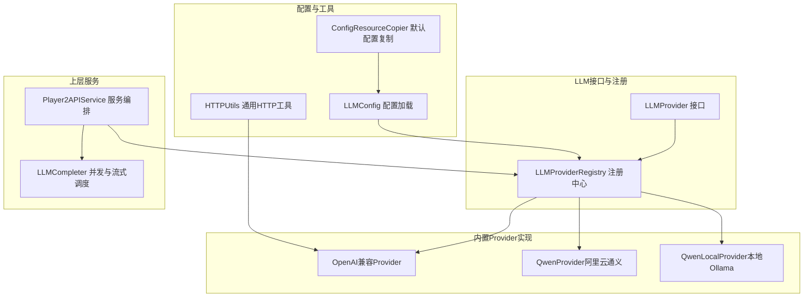
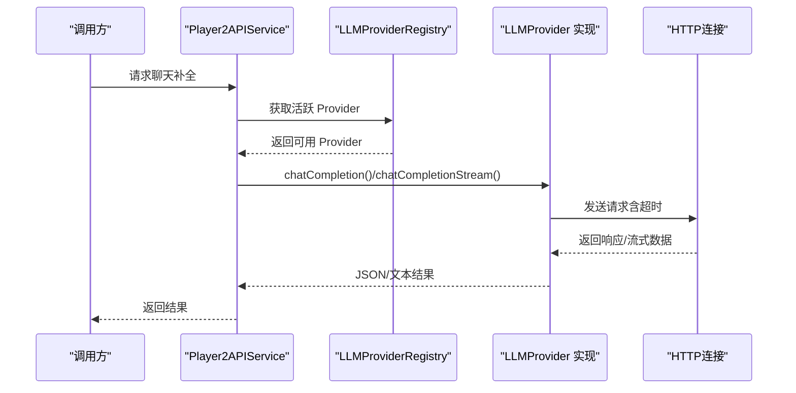
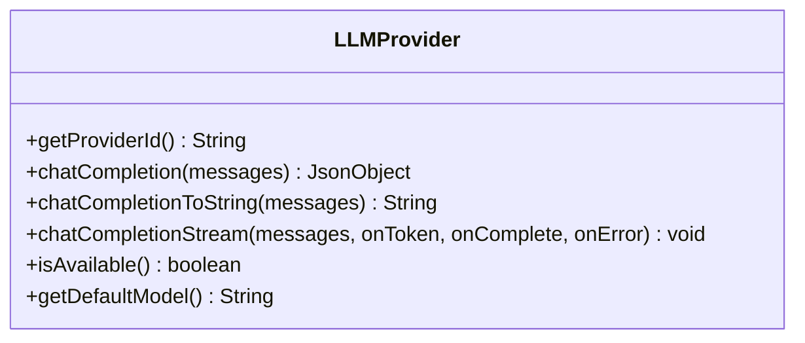
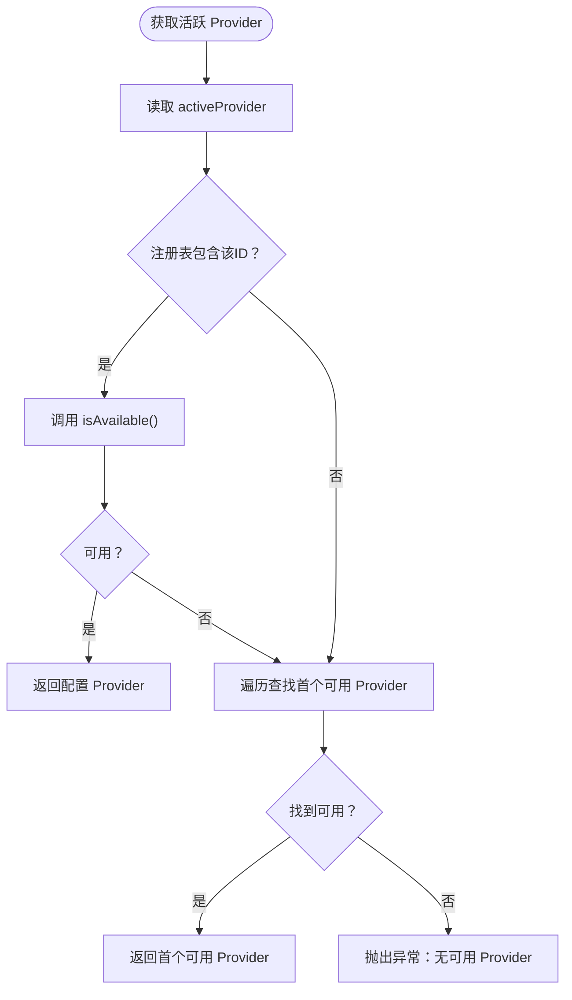
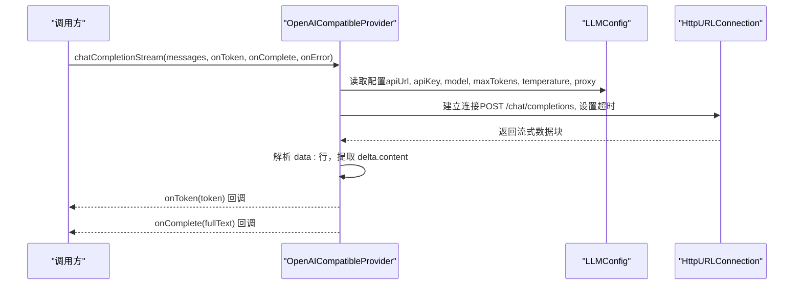
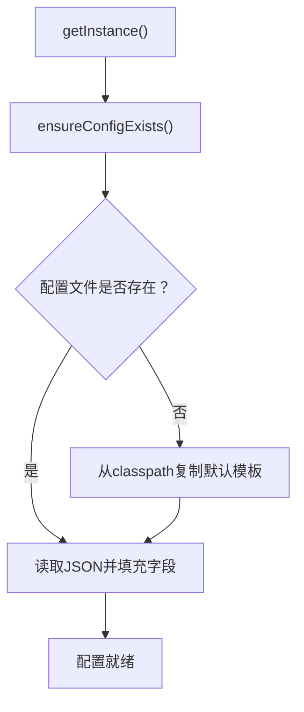
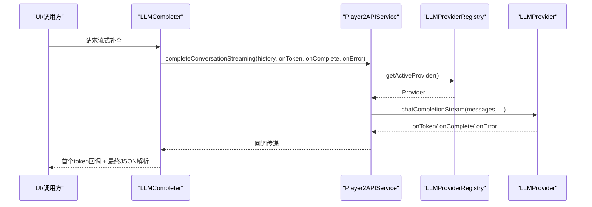
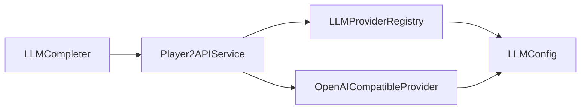

# 自定义LLM Provider开发

<cite>
**本文引用的文件**
- [LLMProvider.java](file://src/main/java/adris/altoclef/player2api/llm/LLMProvider.java)
- [LLMProviderRegistry.java](file://src/main/java/adris/altoclef/player2api/llm/LLMProviderRegistry.java)
- [OpenAICompatibleProvider.java](file://src/main/java/adris/altoclef/player2api/llm/impl/OpenAICompatibleProvider.java)
- [QwenProvider.java](file://src/main/java/adris/altoclef/player2api/llm/impl/QwenProvider.java)
- [QwenLocalProvider.java](file://src/main/java/adris/altoclef/player2api/llm/impl/QwenLocalProvider.java)
- [LLMConfig.java](file://src/main/java/adris/altoclef/player2api/llm/LLMConfig.java)
- [playerengine-llm-default.json](file://build/resources/main/playerengine-llm-default.json)
- [ConfigResourceCopier.java](file://src/main/java/adris/altoclef/player2api/utils/ConfigResourceCopier.java)
- [HTTPUtils.java](file://src/main/java/adris/altoclef/player2api/utils/HTTPUtils.java)
- [Player2APIService.java](file://src/main/java/adris/altoclef/player2api/Player2APIService.java)
- [LLMCompleter.java](file://src/main/java/adris/altoclef/player2api/LLMCompleter.java)
</cite>

## 目录
1. [简介](#简介)
2. [项目结构](#项目结构)
3. [核心组件](#核心组件)
4. [架构总览](#架构总览)
5. [详细组件分析](#详细组件分析)
6. [依赖关系分析](#依赖关系分析)
7. [性能考量](#性能考量)
8. [故障排查指南](#故障排查指南)
9. [结论](#结论)
10. [附录](#附录)

## 简介
本指南面向希望为项目添加自定义大语言模型（LLM）Provider的开发者，围绕统一的 LLMProvider 接口展开，系统讲解以下内容：
- LLMProvider 接口五大核心方法：getProviderId()、chatCompletion()、chatCompletionStream()、isAvailable()、getDefaultModel()
- Provider 注册机制：LLMProviderRegistry 的注册流程、唯一标识符命名规范与配置文件关联
- 完整实现示例：阿里云通义千问、OpenAI 兼容接口、本地 Ollama 模型
- 最佳实践：错误处理、超时控制、并发安全、性能优化
- 配置文件设置、API 密钥管理、调试技巧

## 项目结构
与 LLM Provider 相关的关键模块分布如下：
- 接口与注册中心：adris.altoclef.player2api.llm
- 内置 Provider 实现：adris.altoclef.player2api.llm.impl
- 配置加载与复制：adris.altoclef.player2api.llm 与 utils
- 上层服务编排：adris.altoclef.player2api

**图表来源**
- [LLMProvider.java:11-66](file://src/main/java/adris/altoclef/player2api/llm/LLMProvider.java#L11-L66)
- [LLMProviderRegistry.java:16-79](file://src/main/java/adris/altoclef/player2api/llm/LLMProviderRegistry.java#L16-L79)
- [OpenAICompatibleProvider.java:24-224](file://src/main/java/adris/altoclef/player2api/llm/impl/OpenAICompatibleProvider.java#L24-L224)
- [QwenProvider.java:11-21](file://src/main/java/adris/altoclef/player2api/llm/impl/QwenProvider.java#L11-L21)
- [QwenLocalProvider.java:12-22](file://src/main/java/adris/altoclef/player2api/llm/impl/QwenLocalProvider.java#L12-L22)
- [LLMConfig.java:19-103](file://src/main/java/adris/altoclef/player2api/llm/LLMConfig.java#L19-L103)
- [ConfigResourceCopier.java:18-58](file://src/main/java/adris/altoclef/player2api/utils/ConfigResourceCopier.java#L18-L58)
- [HTTPUtils.java:20-87](file://src/main/java/adris/altoclef/player2api/utils/HTTPUtils.java#L20-L87)
- [Player2APIService.java:35-203](file://src/main/java/adris/altoclef/player2api/Player2APIService.java#L35-L203)
- [LLMCompleter.java:16-207](file://src/main/java/adris/altoclef/player2api/LLMCompleter.java#L16-L207)

**章节来源**
- [LLMProvider.java:11-66](file://src/main/java/adris/altoclef/player2api/llm/LLMProvider.java#L11-L66)
- [LLMProviderRegistry.java:16-79](file://src/main/java/adris/altoclef/player2api/llm/LLMProviderRegistry.java#L16-L79)
- [LLMConfig.java:19-103](file://src/main/java/adris/altoclef/player2api/llm/LLMConfig.java#L19-L103)

## 核心组件
本节聚焦 LLMProvider 接口的五大方法及其职责边界。

- getProviderId()
  - 返回 Provider 唯一标识符，用于注册表映射与配置选择
  - 示例：OpenAI 兼容实现返回固定标识；子类可覆写以适配不同厂商或本地服务
- chatCompletion(messages)
  - 发送聊天补全请求，返回原始响应 JSON（OpenAI 兼容格式）
  - 调用方负责解析 choices/message/content
- chatCompletionToString(messages)
  - 默认实现：基于 chatCompletion() 解析助手回复文本
  - 若响应格式异常，抛出带 Provider 信息的异常
- chatCompletionStream(messages, onToken, onComplete, onError)
  - 流式补全回调：逐块推送 token，首次回调表示首字节到达（TTFT）
  - 默认实现回退至非流式一次性交付，建议子类重写以支持真实流式
- isAvailable()
  - 可用性检查：依据配置开关、API Key 状态等判断 Provider 是否可使用
- getDefaultModel()
  - 返回该 Provider 的默认模型名称，便于配置缺省

最佳实践要点：
- 错误处理：对 HTTP 状态码、SSE 数据块解析失败进行捕获与上报
- 超时控制：连接与读取超时应合理设置，避免阻塞线程
- 并发安全：注册表与配置加载采用单例与同步策略
- 性能优化：避免重复解析 JSON，缓存常用配置项，限制最大 token 数

**章节来源**
- [LLMProvider.java:13-65](file://src/main/java/adris/altoclef/player2api/llm/LLMProvider.java#L13-L65)
- [OpenAICompatibleProvider.java:109-223](file://src/main/java/adris/altoclef/player2api/llm/impl/OpenAICompatibleProvider.java#L109-L223)

## 架构总览
下图展示从上层服务到 Provider 的调用链路与注册中心协作关系：

**图表来源**
- [Player2APIService.java:48-118](file://src/main/java/adris/altoclef/player2api/Player2APIService.java#L48-L118)
- [LLMProviderRegistry.java:49-70](file://src/main/java/adris/altoclef/player2api/llm/LLMProviderRegistry.java#L49-L70)
- [OpenAICompatibleProvider.java:51-138](file://src/main/java/adris/altoclef/player2api/llm/impl/OpenAICompatibleProvider.java#L51-L138)

## 详细组件分析

### 组件A：LLMProvider 接口与默认行为
- 设计意图：统一不同 LLM 后端的接入方式，屏蔽差异
- 关键点：
  - 默认流式实现回退到非流式，子类应覆盖以获得真实流式体验
  - chatCompletionToString 对响应格式有严格假设，需确保上游返回 OpenAI 兼容格式

**图表来源**
- [LLMProvider.java:11-66](file://src/main/java/adris/altoclef/player2api/llm/LLMProvider.java#L11-L66)

**章节来源**
- [LLMProvider.java:13-65](file://src/main/java/adris/altoclef/player2api/llm/LLMProvider.java#L13-L65)

### 组件B：LLMProviderRegistry 注册中心
- 单例模式：首次访问自动注册内置 Provider
- 注册流程：
  - register(new QwenProvider())
  - register(new OpenAICompatibleProvider())
  - register(new QwenLocalProvider())
- 获取活跃 Provider：
  - 优先匹配配置中的 activeProvider
  - 若不可用则遍历第一个可用 Provider
  - 若均不可用，抛出明确异常提示检查配置

**图表来源**
- [LLMProviderRegistry.java:49-70](file://src/main/java/adris/altoclef/player2api/llm/LLMProviderRegistry.java#L49-L70)

**章节来源**
- [LLMProviderRegistry.java:32-70](file://src/main/java/adris/altoclef/player2api/llm/LLMProviderRegistry.java#L32-L70)

### 组件C：OpenAI 兼容 Provider（通用实现）
- 支持任意遵循 OpenAI /v1/chat/completions 的后端（OpenAI、Azure、Ollama、LM Studio 等）
- 关键特性：
  - 动态读取配置：apiUrl、apiKey、model、maxTokens、temperature
  - 支持代理：根据 LLMConfig 判断是否启用代理
  - 非流式：读取完整响应并解析 JSON
  - 流式：解析 SSE 数据块，提取 choices[0].delta.content
  - 可用性：要求 enabled 且 apiKey 非空且非占位符
  - 默认模型：gpt-4-turbo-preview

**图表来源**
- [OpenAICompatibleProvider.java:51-208](file://src/main/java/adris/altoclef/player2api/llm/impl/OpenAICompatibleProvider.java#L51-L208)
- [LLMConfig.java:81-98](file://src/main/java/adris/altoclef/player2api/llm/LLMConfig.java#L81-L98)

**章节来源**
- [OpenAICompatibleProvider.java:24-224](file://src/main/java/adris/altoclef/player2api/llm/impl/OpenAICompatibleProvider.java#L24-L224)
- [LLMConfig.java:54-77](file://src/main/java/adris/altoclef/player2api/llm/LLMConfig.java#L54-L77)

### 组件D：阿里云通义千问 Provider
- 继承 OpenAICompatibleProvider，仅覆写：
  - providerId：qwen
  - configKey：qwen
  - getDefaultModel：qwen-plus
- 默认 API 地址：DashScope 兼容模式

**章节来源**
- [QwenProvider.java:11-21](file://src/main/java/adris/altoclef/player2api/llm/impl/QwenProvider.java#L11-L21)

### 组件E：本地 Ollama Provider
- 继承 OpenAICompatibleProvider，覆写：
  - providerId：qwen_local
  - configKey：qwen_local
  - getDefaultModel：qwen2.5:7b
- 默认地址：http://localhost:11434/v1

**章节来源**
- [QwenLocalProvider.java:12-22](file://src/main/java/adris/altoclef/player2api/llm/impl/QwenLocalProvider.java#L12-L22)

### 组件F：配置加载与默认模板
- LLMConfig 负责：
  - 通过 ConfigResourceCopier 将默认模板复制到运行时配置目录
  - 加载 activeProvider、providers、proxy、tts、stt 等配置段
- 默认模板包含多 Provider 的示例配置与注释，便于快速上手

**图表来源**
- [LLMConfig.java:37-77](file://src/main/java/adris/altoclef/player2api/llm/LLMConfig.java#L37-L77)
- [ConfigResourceCopier.java:29-57](file://src/main/java/adris/altoclef/player2api/utils/ConfigResourceCopier.java#L29-L57)
- [playerengine-llm-default.json:1-89](file://build/resources/main/playerengine-llm-default.json#L1-L89)

**章节来源**
- [LLMConfig.java:19-103](file://src/main/java/adris/altoclef/player2api/llm/LLMConfig.java#L19-L103)
- [ConfigResourceCopier.java:18-58](file://src/main/java/adris/altoclef/player2api/utils/ConfigResourceCopier.java#L18-L58)
- [playerengine-llm-default.json:6-43](file://build/resources/main/playerengine-llm-default.json#L6-L43)

### 组件G：上层服务编排与并发
- Player2APIService：
  - 非流式：构造 messages 数组，调用外部 HTTP 接口，解析 choices/message/content
  - 流式：委托 LLMProviderRegistry 获取活跃 Provider，直接转发流式回调
- LLMCompleter：
  - 使用单线程池串行处理 LLM 请求，避免并发冲突
  - 提供 processToJson、processToString、processToJsonStreaming 三种模式
  - 对首次 token 回调提供 onFirstToken，便于 UI 提前反馈

**图表来源**
- [Player2APIService.java:109-118](file://src/main/java/adris/altoclef/player2api/Player2APIService.java#L109-L118)
- [LLMCompleter.java:174-202](file://src/main/java/adris/altoclef/player2api/LLMCompleter.java#L174-L202)
- [LLMProviderRegistry.java:49-70](file://src/main/java/adris/altoclef/player2api/llm/LLMProviderRegistry.java#L49-L70)

**章节来源**
- [Player2APIService.java:48-118](file://src/main/java/adris/altoclef/player2api/Player2APIService.java#L48-L118)
- [LLMCompleter.java:16-207](file://src/main/java/adris/altoclef/player2api/LLMCompleter.java#L16-L207)

## 依赖关系分析
- 组件耦合：
  - LLMProviderRegistry 依赖 LLMConfig 获取 activeProvider，并持有 Provider 实例映射
  - OpenAICompatibleProvider 依赖 LLMConfig 读取各 Provider 的配置项
  - Player2APIService 依赖 LLMProviderRegistry 选择 Provider，并在流式场景直接调用 Provider
- 外部依赖：
  - HTTP 连接：java.net.HttpURLConnection
  - JSON 解析：Gson
  - 日志：Log4j

**图表来源**
- [LLMProviderRegistry.java:49-70](file://src/main/java/adris/altoclef/player2api/llm/LLMProviderRegistry.java#L49-L70)
- [OpenAICompatibleProvider.java:52-106](file://src/main/java/adris/altoclef/player2api/llm/impl/OpenAICompatibleProvider.java#L52-L106)
- [Player2APIService.java:109-118](file://src/main/java/adris/altoclef/player2api/Player2APIService.java#L109-L118)
- [LLMCompleter.java:174-202](file://src/main/java/adris/altoclef/player2api/LLMCompleter.java#L174-L202)

**章节来源**
- [LLMProviderRegistry.java:16-79](file://src/main/java/adris/altoclef/player2api/llm/LLMProviderRegistry.java#L16-L79)
- [OpenAICompatibleProvider.java:24-224](file://src/main/java/adris/altoclef/player2api/llm/impl/OpenAICompatibleProvider.java#L24-L224)
- [Player2APIService.java:35-118](file://src/main/java/adris/altoclef/player2api/Player2APIService.java#L35-L118)
- [LLMCompleter.java:16-207](file://src/main/java/adris/altoclef/player2api/LLMCompleter.java#L16-L207)

## 性能考量
- 连接与读取超时：OpenAICompatibleProvider 已设置连接与读取超时，建议根据网络环境调整
- 流式传输：优先使用流式接口以提升首字节时间（TTFT）体验
- JSON 解析：避免重复解析，尽量在 Provider 层完成一次解析并在上层复用
- 并发控制：使用单线程池串行化 LLM 请求，减少竞争与资源争用
- 代理与网络：在受限环境下启用代理，但注意代理延迟对 TTFT 的影响

[本节为通用指导，不直接分析具体文件]

## 故障排查指南
- 无可用 Provider
  - 现象：抛出“无可用 Provider”异常
  - 排查：确认 activeProvider 对应的 Provider 是否 isAvailable() 为真；检查配置文件对应段落 enabled 与 apiKey
- HTTP 错误码
  - 现象：非 2xx 状态码时抛出异常
  - 排查：查看日志中的状态码与错误响应体；核对 apiEndpoint、apiKey、网络连通性
- SSE 流解析失败
  - 现象：解析 data: 行失败或 choices 结构不符
  - 排查：确认后端返回格式符合 OpenAI 兼容规范；检查网络中断导致的数据截断
- 首字节时间过长
  - 现象：onToken 回调迟迟不触发
  - 排查：检查网络质量、代理延迟、后端冷启动；考虑切换到非流式或优化后端部署
- 配置未生效
  - 现象：修改配置后未生效
  - 排查：确认运行时配置目录已存在并正确复制了默认模板；重启服务使配置生效

**章节来源**
- [LLMProviderRegistry.java:69](file://src/main/java/adris/altoclef/player2api/llm/LLMProviderRegistry.java#L69)
- [OpenAICompatibleProvider.java:126-137](file://src/main/java/adris/altoclef/player2api/llm/impl/OpenAICompatibleProvider.java#L126-L137)
- [OpenAICompatibleProvider.java:147-161](file://src/main/java/adris/altoclef/player2api/llm/impl/OpenAICompatibleProvider.java#L147-L161)
- [LLMConfig.java:74-76](file://src/main/java/adris/altoclef/player2api/llm/LLMConfig.java#L74-L76)

## 结论
通过统一的 LLMProvider 接口与 LLMProviderRegistry 注册中心，项目实现了对多种 LLM 后端的无缝集成。开发者只需继承 OpenAICompatibleProvider 或实现 LLMProvider 接口，即可快速接入新的 Provider。配合完善的配置体系与流式处理能力，可在保证性能与用户体验的同时，灵活适配不同部署环境与业务需求。

[本节为总结性内容，不直接分析具体文件]

## 附录

### A. Provider 注册机制与命名规范
- 唯一标识符命名规范
  - 使用小写字母与短横线组合，避免特殊字符
  - 建议采用“厂商名/服务名”的形式，如 qwen、openai、ollama-local
- 注册流程
  - 在 LLMProviderRegistry.registerBuiltins() 中注册
  - 通过 getProviderId() 与配置段 key 对应
- 配置文件关联
  - activeProvider 指定当前使用的 Provider
  - providers 下的同名段落承载该 Provider 的具体配置

**章节来源**
- [LLMProviderRegistry.java:32-38](file://src/main/java/adris/altoclef/player2api/llm/LLMProviderRegistry.java#L32-L38)
- [LLMConfig.java:58-62](file://src/main/java/adris/altoclef/player2api/llm/LLMConfig.java#L58-L62)

### B. 完整实现示例（步骤说明）

- 示例A：阿里云通义千问
  - 继承 OpenAICompatibleProvider，覆写构造函数与 getDefaultModel
  - 在配置文件中启用 qwen 段，填写 apiKey 与 model
  - 使用默认 API 地址（DashScope 兼容模式）

  **章节来源**
  - [QwenProvider.java:11-21](file://src/main/java/adris/altoclef/player2api/llm/impl/QwenProvider.java#L11-L21)
  - [playerengine-llm-default.json:19-27](file://build/resources/main/playerengine-llm-default.json#L19-L27)

- 示例B：OpenAI 兼容接口
  - 继承 OpenAICompatibleProvider，覆写构造函数与 getDefaultModel
  - 在配置文件中启用 openai 段，填写 apiKey 与 model
  - 如需访问海外服务，可启用 proxy 段

  **章节来源**
  - [OpenAICompatibleProvider.java:24-35](file://src/main/java/adris/altoclef/player2api/llm/impl/OpenAICompatibleProvider.java#L24-L35)
  - [playerengine-llm-default.json:28-36](file://build/resources/main/playerengine-llm-default.json#L28-L36)
  - [LLMConfig.java:88-98](file://src/main/java/adris/altoclef/player2api/llm/LLMConfig.java#L88-L98)

- 示例C：本地 Ollama 模型
  - 继承 OpenAICompatibleProvider，覆写构造函数与 getDefaultModel
  - 在配置文件中启用 qwen_local 段，确保本地服务已启动
  - 默认地址 http://localhost:11434/v1

  **章节来源**
  - [QwenLocalProvider.java:12-22](file://src/main/java/adris/altoclef/player2api/llm/impl/QwenLocalProvider.java#L12-L22)
  - [playerengine-llm-default.json:9-18](file://build/resources/main/playerengine-llm-default.json#L9-L18)

### C. 配置文件设置与 API 密钥管理
- 配置文件位置与复制
  - 默认模板位于 resources/playerengine-llm-default.json
  - 运行时从 classpath 复制到运行时配置目录，确保首次启动即生成
- 关键配置项
  - activeProvider：当前活跃 Provider
  - providers.{providerId}：各 Provider 的启用状态、API 地址、模型、maxTokens、temperature
  - proxy：HTTP 代理（可选）
  - tts/stt：语音合成与识别配置（与 LLM 无关，但与 NPC 功能相关）
- API 密钥管理
  - 不要在公共仓库中提交密钥
  - 使用占位符或环境变量注入（若扩展支持），避免硬编码

**章节来源**
- [LLMConfig.java:37-77](file://src/main/java/adris/altoclef/player2api/llm/LLMConfig.java#L37-L77)
- [ConfigResourceCopier.java:29-57](file://src/main/java/adris/altoclef/player2api/utils/ConfigResourceCopier.java#L29-L57)
- [playerengine-llm-default.json:6-89](file://build/resources/main/playerengine-llm-default.json#L6-L89)

### D. 调试技巧
- 开启详细日志：关注请求与响应日志，定位格式问题
- 分步验证：先验证非流式接口，再验证流式接口
- 网络诊断：使用 curl 或 Postman 验证后端 endpoint 与鉴权
- 首字节时间：在 Provider 层打印 TTFT 时间，评估网络与后端性能
- 配置热更新：修改配置后重启服务，确保配置生效

[本节为通用指导，不直接分析具体文件]