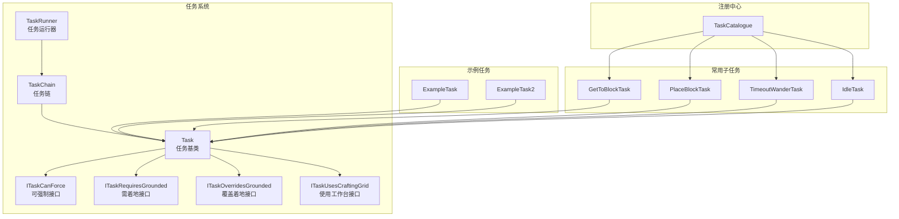
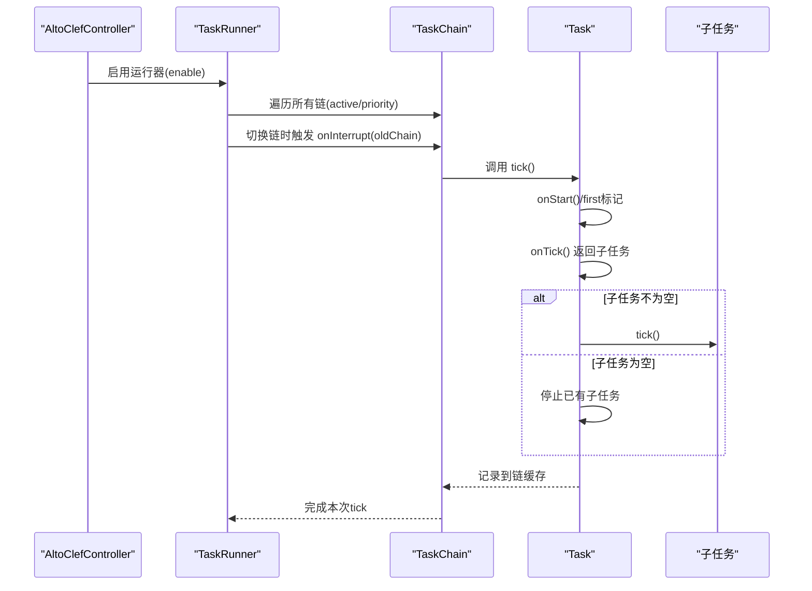
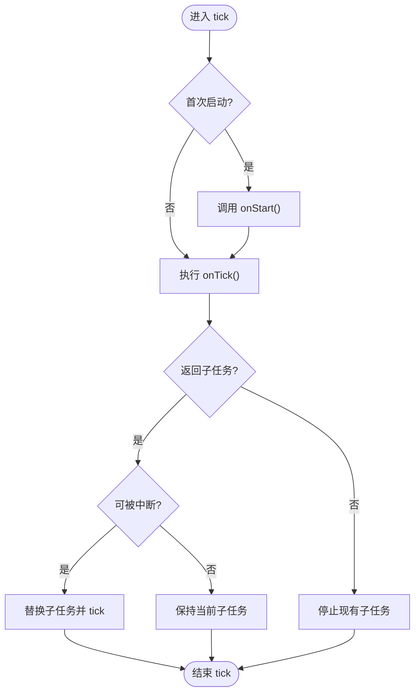
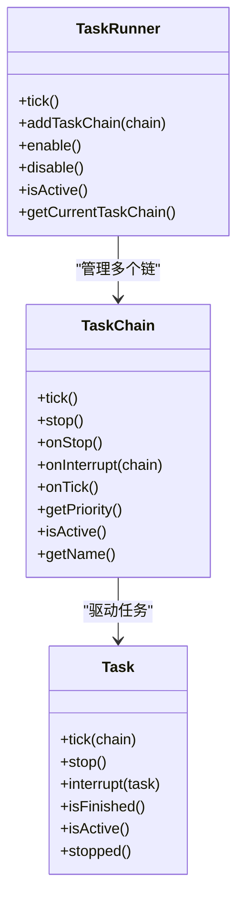
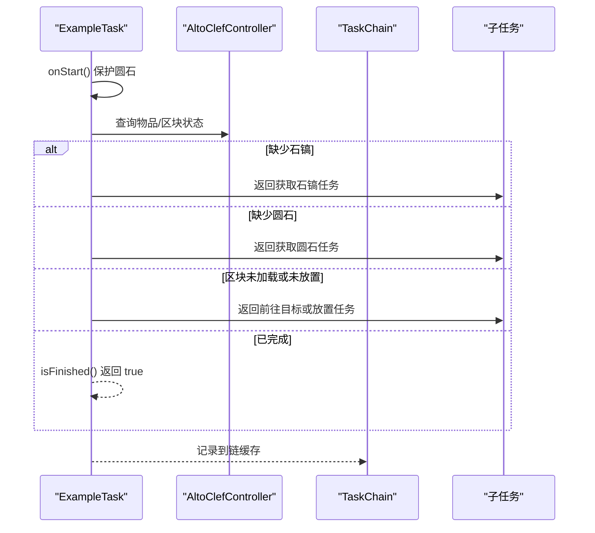
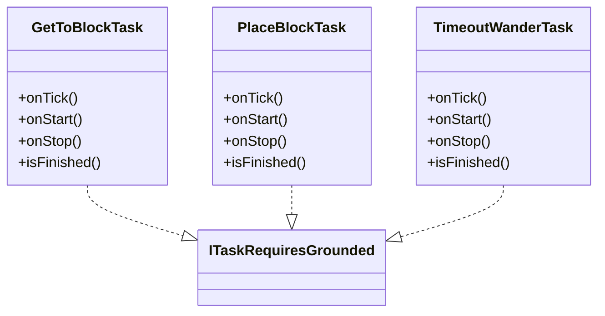
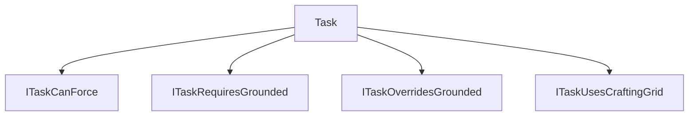

# 自定义任务开发

<cite>
**本文引用的文件**
- [Task.java](file://src/main/java/adris/altoclef/tasksystem/Task.java)
- [TaskRunner.java](file://src/main/java/adris/altoclef/tasksystem/TaskRunner.java)
- [TaskChain.java](file://src/main/java/adris/altoclef/tasksystem/TaskChain.java)
- [TaskCatalogue.java](file://src/main/java/adris/altoclef/TaskCatalogue.java)
- [ExampleTask.java](file://src/main/java/adris/altoclef/tasks/examples/ExampleTask.java)
- [ExampleTask2.java](file://src/main/java/adris/altoclef/tasks/examples/ExampleTask2.java)
- [GetToBlockTask.java](file://src/main/java/adris/altoclef/tasks/movement/GetToBlockTask.java)
- [PlaceBlockTask.java](file://src/main/java/adris/altoclef/tasks/construction/PlaceBlockTask.java)
- [TimeoutWanderTask.java](file://src/main/java/adris/altoclef/tasks/movement/TimeoutWanderTask.java)
- [IdleTask.java](file://src/main/java/adris/altoclef/tasks/movement/IdleTask.java)
- [ITaskCanForce.java](file://src/main/java/adris/altoclef/tasksystem/ITaskCanForce.java)
- [ITaskRequiresGrounded.java](file://src/main/java/adris/altoclef/tasksystem/ITaskRequiresGrounded.java)
- [ITaskOverridesGrounded.java](file://src/main/java/adris/altoclef/tasksystem/ITaskOverridesGrounded.java)
- [ITaskUsesCraftingGrid.java](file://src/main/java/adris/altoclef/tasksystem/ITaskUsesCraftingGrid.java)
</cite>

## 目录
1. [简介](#简介)
2. [项目结构](#项目结构)
3. [核心组件](#核心组件)
4. [架构总览](#架构总览)
5. [详细组件分析](#详细组件分析)
6. [依赖分析](#依赖分析)
7. [性能考虑](#性能考虑)
8. [故障排查指南](#故障排查指南)
9. [结论](#结论)
10. [附录](#附录)

## 简介
本指南面向希望在该代码库中开发“自定义任务”的开发者，围绕任务系统的核心抽象与运行机制，系统讲解以下内容：
- Task 基类的关键方法：isActive()、isFinished()、onTick()、onRender()（注：当前实现未提供 onRender 回调）、onLostFocus()（注：当前实现未提供 onLostFocus 回调）。
- 任务实现规范：状态管理、异常处理、进度跟踪、资源清理。
- 任务注册与优先级：TaskCatalogue 注册机制、任务优先级设置与依赖关系管理。
- 任务调度原理：TaskRunner 的工作机制、并发控制与中断处理。
- 实战示例：简单示例 ExampleTask 与复杂示例 ExampleTask2 的实现分析。
- 最佳实践：性能优化、内存管理、调试技巧与测试方法。

## 项目结构
任务系统位于模块路径 adris/altoclef/tasksystem 下，核心类包括 Task、TaskChain、TaskRunner；示例任务位于 tasks/examples；常用子任务如移动与放置等位于 tasks/movement、tasks/construction 等包；任务注册入口为 TaskCatalogue。

**图表来源**
- [Task.java:1-181](file://src/main/java/adris/altoclef/tasksystem/Task.java#L1-L181)
- [TaskChain.java:1-51](file://src/main/java/adris/altoclef/tasksystem/TaskChain.java#L1-L51)
- [TaskRunner.java:1-98](file://src/main/java/adris/altoclef/tasksystem/TaskRunner.java#L1-L98)
- [ITaskCanForce.java:1-6](file://src/main/java/adris/altoclef/tasksystem/ITaskCanForce.java#L1-L6)
- [ITaskRequiresGrounded.java:1-16](file://src/main/java/adris/altoclef/tasksystem/ITaskRequiresGrounded.java#L1-L16)
- [ITaskOverridesGrounded.java:1-5](file://src/main/java/adris/altoclef/tasksystem/ITaskOverridesGrounded.java#L1-L5)
- [ITaskUsesCraftingGrid.java:1-5](file://src/main/java/adris/altoclef/tasksystem/ITaskUsesCraftingGrid.java#L1-L5)
- [ExampleTask.java:1-68](file://src/main/java/adris/altoclef/tasks/examples/ExampleTask.java#L1-L68)
- [ExampleTask2.java:1-70](file://src/main/java/adris/altoclef/tasks/examples/ExampleTask2.java#L1-L70)
- [GetToBlockTask.java:1-106](file://src/main/java/adris/altoclef/tasks/movement/GetToBlockTask.java#L1-L106)
- [PlaceBlockTask.java:1-208](file://src/main/java/adris/altoclef/tasks/construction/PlaceBlockTask.java#L1-L208)
- [TimeoutWanderTask.java:1-291](file://src/main/java/adris/altoclef/tasks/movement/TimeoutWanderTask.java#L1-L291)
- [IdleTask.java:1-37](file://src/main/java/adris/altoclef/tasks/movement/IdleTask.java#L1-L37)
- [TaskCatalogue.java:1-1031](file://src/main/java/adris/altoclef/TaskCatalogue.java#L1-L1031)

**章节来源**
- [Task.java:1-181](file://src/main/java/adris/altoclef/tasksystem/Task.java#L1-L181)
- [TaskChain.java:1-51](file://src/main/java/adris/altoclef/tasksystem/TaskChain.java#L1-L51)
- [TaskRunner.java:1-98](file://src/main/java/adris/altoclef/tasksystem/TaskRunner.java#L1-L98)
- [TaskCatalogue.java:1-1031](file://src/main/java/adris/altoclef/TaskCatalogue.java#L1-L1031)

## 核心组件
本节聚焦任务系统的核心抽象与职责边界：
- Task：任务生命周期与状态机的抽象，负责启动、每 tick 执行、子任务切换、停止与中断、调试状态输出与树形结构展示。
- TaskChain：任务链抽象，封装优先级、活跃状态、名称、tick 与停止行为，并向 TaskRunner 注册自身。
- TaskRunner：全局调度器，按优先级选择当前活跃链，处理链间中断与状态报告，支持启用/禁用与链列表管理。
- 接口族：ITaskCanForce、ITaskRequiresGrounded、ITaskOverridesGrounded、ITaskUsesCraftingGrid，用于声明任务的可中断性、着地要求、是否覆盖着地以及是否使用工作台等特性。

关键点：
- Task 的 isFinished() 默认返回 false，具体任务需覆盖以表达完成条件。
- Task 的 isActive() 返回内部活动标志，表示任务已启动且未停止。
- 当前实现未提供 onRender() 与 onLostFocus() 回调，若需要可在子类中扩展或通过控制器事件接入。

**章节来源**
- [Task.java:106-116](file://src/main/java/adris/altoclef/tasksystem/Task.java#L106-L116)
- [Task.java:110-112](file://src/main/java/adris/altoclef/tasksystem/Task.java#L110-L112)
- [TaskChain.java:32-36](file://src/main/java/adris/altoclef/tasksystem/TaskChain.java#L32-L36)
- [TaskRunner.java:22-58](file://src/main/java/adris/altoclef/tasksystem/TaskRunner.java#L22-L58)
- [ITaskCanForce.java:3-5](file://src/main/java/adris/altoclef/tasksystem/ITaskCanForce.java#L3-L5)
- [ITaskRequiresGrounded.java:5-15](file://src/main/java/adris/altoclef/tasksystem/ITaskRequiresGrounded.java#L5-L15)
- [ITaskOverridesGrounded.java:3-4](file://src/main/java/adris/altoclef/tasksystem/ITaskOverridesGrounded.java#L3-L4)
- [ITaskUsesCraftingGrid.java:3-4](file://src/main/java/adris/altoclef/tasksystem/ITaskUsesCraftingGrid.java#L3-L4)

## 架构总览
下图展示了任务系统从注册到运行的整体流程：TaskCatalogue 提供任务工厂与查询；TaskChain 将任务组织为链；TaskRunner 按优先级选择链并驱动其 tick；Task 在 tick 中根据条件返回子任务并进行子任务切换与中断。

**图表来源**
- [TaskRunner.java:22-58](file://src/main/java/adris/altoclef/tasksystem/TaskRunner.java#L22-L58)
- [TaskChain.java:16-24](file://src/main/java/adris/altoclef/tasksystem/TaskChain.java#L16-L24)
- [Task.java:17-50](file://src/main/java/adris/altoclef/tasksystem/Task.java#L17-L50)

**章节来源**
- [TaskRunner.java:22-58](file://src/main/java/adris/altoclef/tasksystem/TaskRunner.java#L22-L58)
- [TaskChain.java:16-24](file://src/main/java/adris/altoclef/tasksystem/TaskChain.java#L16-L24)
- [Task.java:17-50](file://src/main/java/adris/altoclef/tasksystem/Task.java#L17-L50)

## 详细组件分析

### Task 基类与生命周期
- 启动与状态
  - onStart()：首次 tick 时调用，用于初始化行为（如 push 行为栈、保护物品等）。
  - isActive()：返回任务是否处于活动状态。
  - isFinished()：默认返回 false，子类需覆盖以表达完成条件。
- 每 tick 执行
  - onTick()：返回新的子任务或 null；若返回新子任务且满足中断条件，则替换当前子任务并驱动其 tick。
  - 调试状态：通过 setDebugState() 设置状态字符串，toString() 输出调试信息。
- 停止与中断
  - stop()/stop(interruptTask)：停止当前任务及子任务，重置 first/active/stopped 标志。
  - interrupt(interruptTask)：仅中断当前任务及其子任务，不改变 first 标志。
  - canBeInterrupted(...)：基于 ITaskCanForce/ITaskRequiresGrounded/ITaskOverridesGrounded 决定是否允许中断。
- 子任务管理
  - 支持子任务树形结构，thisOrChildSatisfies() 用于遍历子任务树并匹配谓词（例如检测超时漫步）。
  - getTaskTree() 输出任务树的层级结构，便于调试。

**图表来源**
- [Task.java:17-50](file://src/main/java/adris/altoclef/tasksystem/Task.java#L17-L50)
- [Task.java:152-164](file://src/main/java/adris/altoclef/tasksystem/Task.java#L152-L164)

**章节来源**
- [Task.java:17-181](file://src/main/java/adris/altoclef/tasksystem/Task.java#L17-L181)

### TaskChain 与 TaskRunner
- TaskChain
  - 维护控制器实例与任务缓存列表，提供 onStop/onTick 抽象钩子，暴露 getPriority()/isActive()/getName() 供调度器使用。
  - addTaskToChain() 将当前 tick 中产生的任务加入缓存，便于链路追踪与状态报告。
- TaskRunner
  - 选择最高优先级的活跃链，处理链间中断（调用链的 onInterrupt），并维护 statusReport。
  - enable()/disable() 控制运行器状态，禁用时会弹出行为栈并停止所有链。

**图表来源**
- [TaskRunner.java:9-98](file://src/main/java/adris/altoclef/tasksystem/TaskRunner.java#L9-L98)
- [TaskChain.java:7-51](file://src/main/java/adris/altoclef/tasksystem/TaskChain.java#L7-L51)
- [Task.java:8-181](file://src/main/java/adris/altoclef/tasksystem/Task.java#L8-L181)

**章节来源**
- [TaskChain.java:16-44](file://src/main/java/adris/altoclef/tasksystem/TaskChain.java#L16-L44)
- [TaskRunner.java:22-84](file://src/main/java/adris/altoclef/tasksystem/TaskRunner.java#L22-L84)

### 任务注册与优先级：TaskCatalogue
- 作用
  - 维护资源/任务映射表，提供 getItemTask()/getItemTask(Item)/taskExists() 等查询方法。
  - 通过 put()/simple()/mine()/crop()/smelt()/smith()/mob()/woodTasks() 等静态方法批量注册任务条目。
- 优先级与依赖
  - 任务本身不直接声明优先级；优先级由 TaskChain.getPriority() 决定，通常由上层策略或命令系统设置。
  - 依赖关系通过 onTick() 返回的子任务体现（如 GetToBlockTask 依赖 DefaultGoToDimensionTask）。

**图表来源**
- [TaskCatalogue.java:150-176](file://src/main/java/adris/altoclef/TaskCatalogue.java#L150-L176)
- [TaskCatalogue.java:396-800](file://src/main/java/adris/altoclef/TaskCatalogue.java#L396-L800)

**章节来源**
- [TaskCatalogue.java:150-176](file://src/main/java/adris/altoclef/TaskCatalogue.java#L150-L176)
- [TaskCatalogue.java:396-800](file://src/main/java/adris/altoclef/TaskCatalogue.java#L396-L800)

### 示例任务：ExampleTask 与 ExampleTask2
- ExampleTask
  - 目标：收集足够数量的石镐、获得圆石、在指定位置放置圆石。
  - 关键点：在 onStart() 中保护圆石；onTick() 分支判断：先收集石镐，再收集圆石，再判断目标区块是否加载并放置；isFinished() 综合判断两个条件。
  - 与 TaskCatalogue 的交互：通过 getItemTask() 获取所需物品。
- ExampleTask2
  - 目标：在找到橡木原木后，走到原木上方空位站立。
  - 关键点：onStart() 中避免破坏树叶/原木；onTick() 若未发现原木则 TimeoutWanderTask 浪漫漫步；找到原木后计算上方空位作为目标；isFinished() 判断玩家是否到达目标。

**图表来源**
- [ExampleTask.java:21-47](file://src/main/java/adris/altoclef/tasks/examples/ExampleTask.java#L21-L47)
- [Task.java:17-50](file://src/main/java/adris/altoclef/tasksystem/Task.java#L17-L50)

**章节来源**
- [ExampleTask.java:12-68](file://src/main/java/adris/altoclef/tasks/examples/ExampleTask.java#L12-L68)
- [ExampleTask2.java:14-70](file://src/main/java/adris/altoclef/tasks/examples/ExampleTask2.java#L14-L70)

### 常用子任务：移动与放置
- GetToBlockTask
  - 目标：到达指定方块坐标；支持维度切换与楼梯偏好；当长时间“已完成”时自动 TimeoutWanderTask。
  - 特性：实现 ITaskRequiresGrounded，确保在空中/游泳/攀爬时不被强制中断。
- PlaceBlockTask
  - 目标：放置结构方块；内置材料不足时自动收集；失败多次后尝试替代路径（如先上到上方再放置）。
  - 特性：实现 ITaskRequiresGrounded；在 onStop() 中释放构建器控制权。
- TimeoutWanderTask
  - 目标：在一定时间内随机漫步，绕过障碍物与危险实体；支持“探索模式”与范围扩展。
  - 特性：实现 ITaskRequiresGrounded；内置阻塞方块识别与解困任务。

**图表来源**
- [GetToBlockTask.java:14-106](file://src/main/java/adris/altoclef/tasks/movement/GetToBlockTask.java#L14-L106)
- [PlaceBlockTask.java:27-208](file://src/main/java/adris/altoclef/tasks/construction/PlaceBlockTask.java#L27-L208)
- [TimeoutWanderTask.java:30-291](file://src/main/java/adris/altoclef/tasks/movement/TimeoutWanderTask.java#L30-L291)
- [ITaskRequiresGrounded.java:5-15](file://src/main/java/adris/altoclef/tasksystem/ITaskRequiresGrounded.java#L5-L15)

**章节来源**
- [GetToBlockTask.java:39-98](file://src/main/java/adris/altoclef/tasks/movement/GetToBlockTask.java#L39-L98)
- [PlaceBlockTask.java:68-139](file://src/main/java/adris/altoclef/tasks/construction/PlaceBlockTask.java#L68-L139)
- [TimeoutWanderTask.java:164-200](file://src/main/java/adris/altoclef/tasks/movement/TimeoutWanderTask.java#L164-L200)

## 依赖分析
- 任务接口族
  - ITaskCanForce：决定是否允许中断。
  - ITaskRequiresGrounded：在非着地/非游泳/非攀爬状态下阻止中断。
  - ITaskOverridesGrounded：覆盖着地限制，允许在空中/游泳时中断。
  - ITaskUsesCraftingGrid：声明使用工作台网格的任务。
- 任务与控制器
  - Task 持有 AltoClefController 引用，通过 controller 访问行为栈、存储、世界、输入控制等。
- 任务与子任务
  - 通过 onTick() 返回 Task 或 null 实现子任务切换；子任务树通过 sub 字段串联。

**图表来源**
- [Task.java:152-164](file://src/main/java/adris/altoclef/tasksystem/Task.java#L152-L164)
- [ITaskCanForce.java:3-5](file://src/main/java/adris/altoclef/tasksystem/ITaskCanForce.java#L3-L5)
- [ITaskRequiresGrounded.java:5-15](file://src/main/java/adris/altoclef/tasksystem/ITaskRequiresGrounded.java#L5-L15)
- [ITaskOverridesGrounded.java:3-4](file://src/main/java/adris/altoclef/tasksystem/ITaskOverridesGrounded.java#L3-L4)
- [ITaskUsesCraftingGrid.java:3-4](file://src/main/java/adris/altoclef/tasksystem/ITaskUsesCraftingGrid.java#L3-L4)

**章节来源**
- [Task.java:152-164](file://src/main/java/adris/altoclef/tasksystem/Task.java#L152-L164)

## 性能考虑
- 任务粒度与组合
  - 将复杂目标拆分为多个短任务（如移动、放置、收集），减少单任务状态复杂度。
- 调度与优先级
  - 使用 TaskChain.getPriority() 合理设置优先级，避免频繁链切换导致的中断开销。
- 子任务中断策略
  - 通过 ITaskCanForce/ITaskRequiresGrounded/ITaskOverridesGrounded 精准控制中断，减少不必要的 stop/interrupt 次数。
- 进度检查与超时
  - 使用 MovementProgressChecker 与 TimeoutWanderTask 防止卡死，提升鲁棒性。
- 资源与内存
  - 避免在 onTick() 中创建临时对象过多；复用 TaskCatalogue 生成的通用任务；在 onStop() 中及时释放外部资源（如构建器）。

[本节为通用指导，无需特定文件来源]

## 故障排查指南
- 任务未完成
  - 检查 isFinished() 条件是否正确覆盖；确认 onTick() 是否返回了正确的子任务序列。
- 任务无法中断
  - 检查是否实现了 ITaskCanForce/ITaskRequiresGrounded；确认中断候选任务是否实现了 ITaskOverridesGrounded。
- 链切换频繁
  - 检查 TaskChain.getPriority() 设置；必要时降低优先级波动。
- 任务卡住
  - 使用 TimeoutWanderTask 作为兜底；检查 MovementProgressChecker 是否被正确更新。
- 调试信息
  - 使用 setDebugState() 与 toString() 输出调试状态；利用 getTaskTree() 查看任务树。

**章节来源**
- [Task.java:98-104](file://src/main/java/adris/altoclef/tasksystem/Task.java#L98-L104)
- [Task.java:166-179](file://src/main/java/adris/altoclef/tasksystem/Task.java#L166-L179)
- [TimeoutWanderTask.java:164-200](file://src/main/java/adris/altoclef/tasks/movement/TimeoutWanderTask.java#L164-L200)

## 结论
该任务系统通过 Task/TaskChain/TaskRunner 的分层设计，提供了清晰的任务生命周期管理与灵活的调度机制。借助 TaskCatalogue 的任务工厂能力与 ITaskCanForce 等接口族，开发者可以快速构建从简单到复杂的任务组合。遵循本文的状态管理、异常处理、进度跟踪与资源清理规范，结合示例任务的实现思路，即可高效开发高质量的自定义任务。

[本节为总结，无需特定文件来源]

## 附录

### 开发规范速查
- 状态管理
  - 在 onStart() 初始化行为栈与保护项；在 onStop()/interrupt() 清理并恢复行为栈。
- 异常处理
  - 在 onTick() 中对异常分支返回兜底任务（如 TimeoutWanderTask）。
- 进度跟踪
  - 使用 MovementProgressChecker 与定时器辅助判定卡顿与超时。
- 资源清理
  - 在 onStop()/onInterrupt() 释放外部资源（如构建器、输入控制）。

**章节来源**
- [Task.java:58-96](file://src/main/java/adris/altoclef/tasksystem/Task.java#L58-L96)
- [PlaceBlockTask.java:142-144](file://src/main/java/adris/altoclef/tasks/construction/PlaceBlockTask.java#L142-L144)

### 示例任务参考路径
- [ExampleTask.java:12-68](file://src/main/java/adris/altoclef/tasks/examples/ExampleTask.java#L12-L68)
- [ExampleTask2.java:14-70](file://src/main/java/adris/altoclef/tasks/examples/ExampleTask2.java#L14-L70)
- [GetToBlockTask.java:14-106](file://src/main/java/adris/altoclef/tasks/movement/GetToBlockTask.java#L14-L106)
- [PlaceBlockTask.java:27-208](file://src/main/java/adris/altoclef/tasks/construction/PlaceBlockTask.java#L27-L208)
- [TimeoutWanderTask.java:30-291](file://src/main/java/adris/altoclef/tasks/movement/TimeoutWanderTask.java#L30-L291)
- [IdleTask.java:6-37](file://src/main/java/adris/altoclef/tasks/movement/IdleTask.java#L6-L37)