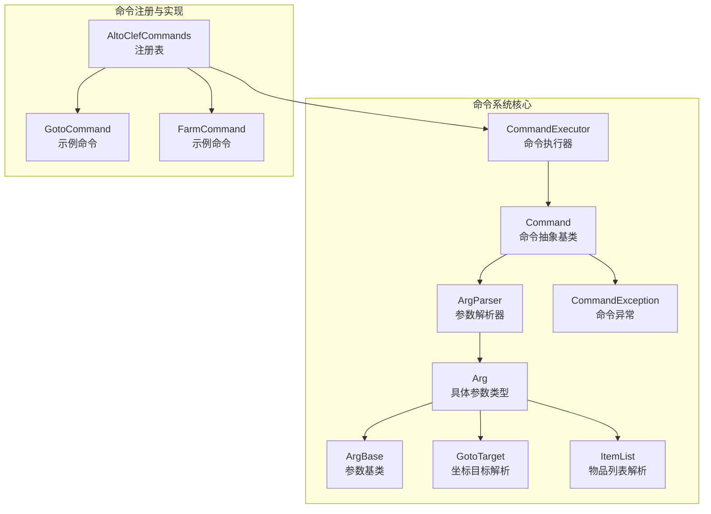
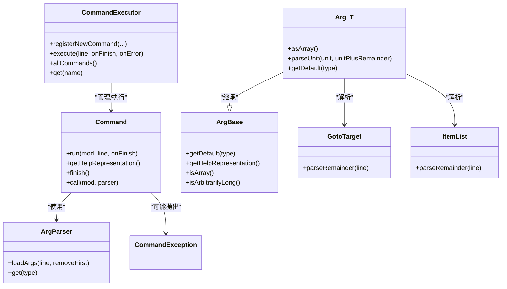

# 自定义命令开发

<cite>
**本文引用的文件**
- [Command.java](file://src/main/java/adris/altoclef/commandsystem/Command.java)
- [ArgParser.java](file://src/main/java/adris/altoclef/commandsystem/ArgParser.java)
- [ArgBase.java](file://src/main/java/adris/altoclef/commandsystem/ArgBase.java)
- [Arg.java](file://src/main/java/adris/altoclef/commandsystem/Arg.java)
- [GotoTarget.java](file://src/main/java/adris/altoclef/commandsystem/GotoTarget.java)
- [ItemList.java](file://src/main/java/adris/altoclef/commandsystem/ItemList.java)
- [CommandExecutor.java](file://src/main/java/adris/altoclef/commandsystem/CommandExecutor.java)
- [AltoClefCommands.java](file://src/main/java/adris/altoclef/AltoClefCommands.java)
- [GotoCommand.java](file://src/main/java/adris/altoclef/commands/GotoCommand.java)
- [FarmCommand.java](file://src/main/java/adris/altoclef/commands/FarmCommand.java)
- [CommandException.java](file://src/main/java/adris/altoclef/commandsystem/CommandException.java)
- [Dimension.java](file://src/main/java/adris/altoclef/util/Dimension.java)
</cite>

## 目录
1. [简介](#简介)
2. [项目结构](#项目结构)
3. [核心组件](#核心组件)
4. [架构总览](#架构总览)
5. [详细组件分析](#详细组件分析)
6. [依赖分析](#依赖分析)
7. [性能考量](#性能考量)
8. [故障排查指南](#故障排查指南)
9. [结论](#结论)
10. [附录](#附录)

## 简介
本指南面向希望在该模组中开发“自定义命令”的开发者，系统讲解命令系统的实现与扩展方式。内容覆盖：
- 命令基类 Command 的执行流程与接口：execute（执行）、getSyntax（语法）、getDescription（描述）、getExample（示例）
- 参数解析机制：ArgParser 的工作原理、参数类型、验证规则与错误处理
- 命令注册流程：AltoClefCommands 注册表、命令别名与权限控制的接入点
- 完整命令实现示例：GotoCommand 与 FarmCommand 的实现剖析
- 命令执行上下文：CommandExecutor 的执行环境、参数传递与返回值处理
- 最佳实践：用户体验、错误提示、帮助系统与性能优化
- 调试技巧与测试方法

## 项目结构
命令系统主要位于以下包与文件中：
- 命令系统核心：commandsystem 包下的 Command、ArgParser、Arg、ArgBase、GotoTarget、ItemList、CommandExecutor、CommandException
- 命令注册：AltoClefCommands.init 将具体命令注册到控制器的命令执行器
- 具体命令：commands 包下包含多个命令实现，如 GotoCommand、FarmCommand 等



图表来源
- [Command.java:1-61](file://src/main/java/adris/altoclef/commandsystem/Command.java#L1-L61)
- [ArgParser.java:1-106](file://src/main/java/adris/altoclef/commandsystem/ArgParser.java#L1-L106)
- [ArgBase.java:1-44](file://src/main/java/adris/altoclef/commandsystem/ArgBase.java#L1-L44)
- [Arg.java:1-171](file://src/main/java/adris/altoclef/commandsystem/Arg.java#L1-L171)
- [GotoTarget.java:1-102](file://src/main/java/adris/altoclef/commandsystem/GotoTarget.java#L1-L102)
- [ItemList.java:1-90](file://src/main/java/adris/altoclef/commandsystem/ItemList.java#L1-L90)
- [CommandExecutor.java:1-121](file://src/main/java/adris/altoclef/commandsystem/CommandExecutor.java#L1-L121)
- [AltoClefCommands.java:1-59](file://src/main/java/adris/altoclef/AltoClefCommands.java#L1-L59)
- [GotoCommand.java:1-66](file://src/main/java/adris/altoclef/commands/GotoCommand.java#L1-L66)
- [FarmCommand.java:1-29](file://src/main/java/adris/altoclef/commands/FarmCommand.java#L1-L29)

章节来源
- [Command.java:1-61](file://src/main/java/adris/altoclef/commandsystem/Command.java#L1-L61)
- [ArgParser.java:1-106](file://src/main/java/adris/altoclef/commandsystem/ArgParser.java#L1-L106)
- [ArgBase.java:1-44](file://src/main/java/adris/altoclef/commandsystem/ArgBase.java#L1-L44)
- [Arg.java:1-171](file://src/main/java/adris/altoclef/commandsystem/Arg.java#L1-L171)
- [GotoTarget.java:1-102](file://src/main/java/adris/altoclef/commandsystem/GotoTarget.java#L1-L102)
- [ItemList.java:1-90](file://src/main/java/adris/altoclef/commandsystem/ItemList.java#L1-L90)
- [CommandExecutor.java:1-121](file://src/main/java/adris/altoclef/commandsystem/CommandExecutor.java#L1-L121)
- [AltoClefCommands.java:1-59](file://src/main/java/adris/altoclef/AltoClefCommands.java#L1-L59)
- [GotoCommand.java:1-66](file://src/main/java/adris/altoclef/commands/GotoCommand.java#L1-L66)
- [FarmCommand.java:1-29](file://src/main/java/adris/altoclef/commands/FarmCommand.java#L1-L29)

## 核心组件
本节聚焦命令系统的关键构件及其职责。

- Command 抽象基类
  - 提供 run(...) 执行入口，负责加载参数并调用受保护的 call(...) 实际执行逻辑
  - 提供 getHelpRepresentation() 生成帮助语法表示
  - 提供日志与完成回调工具方法
  - 子类需实现 call(...) 与构造函数中的参数定义

- ArgParser 参数解析器
  - 将输入行按空格拆分为“关键字单元”，支持引号包裹与注释截断
  - 按参数定义顺序从输入中取值，支持默认值、数组参数与剩余参数
  - 提供 get(...) 获取指定类型的参数值，并进行数量与类型校验

- Arg<T> 具体参数类型
  - 支持 String、Integer、Float、Double、Long、枚举、ItemList、GotoTarget 等
  - 提供默认值、最小参数数触发默认值、是否数组、是否任意长度等语义
  - parseUnit(...) 完成字符串到目标类型的转换与校验

- CommandExecutor 命令执行器
  - 维护命令名称到命令实例的映射
  - 解析用户输入，支持分号分隔的多段链式命令
  - 串行执行各命令，捕获异常并回传给调用方

- GotoTarget 与 ItemList
  - GotoTarget：解析多种坐标形式与维度参数，输出统一的目标对象
  - ItemList：解析物品清单，支持“物品 名称/数量”与数组格式，并进行任务目录校验与模糊匹配

章节来源
- [Command.java:6-61](file://src/main/java/adris/altoclef/commandsystem/Command.java#L6-L61)
- [ArgParser.java:6-106](file://src/main/java/adris/altoclef/commandsystem/ArgParser.java#L6-L106)
- [ArgBase.java:5-44](file://src/main/java/adris/altoclef/commandsystem/ArgBase.java#L5-L44)
- [Arg.java:3-171](file://src/main/java/adris/altoclef/commandsystem/Arg.java#L3-L171)
- [CommandExecutor.java:11-121](file://src/main/java/adris/altoclef/commandsystem/CommandExecutor.java#L11-L121)
- [GotoTarget.java:7-102](file://src/main/java/adris/altoclef/commandsystem/GotoTarget.java#L7-L102)
- [ItemList.java:9-90](file://src/main/java/adris/altoclef/commandsystem/ItemList.java#L9-L90)

## 架构总览
命令系统采用“命令注册 → 输入解析 → 参数绑定 → 任务执行”的流水线式架构。用户输入以命令前缀开头，可包含多个由分号分隔的子命令；每个子命令通过 CommandExecutor 查找并执行，参数由 ArgParser 与 Arg<T> 完成解析与校验。

```mermaid
sequenceDiagram
participant U as "用户"
participant EX as "CommandExecutor"
participant MAP as "命令映射"
participant C as "Command"
participant P as "ArgParser"
participant T as "任务/行为"
U->>EX : 输入带前缀的命令行
EX->>EX : 去除前缀并按";"拆分
EX->>MAP : 查找命令实例
MAP-->>EX : 返回命令或异常
EX->>C : 调用 run(mod, line, onFinish)
C->>P : loadArgs(line, removeFirst=true)
C->>C : 调用 call(mod, parser)
C->>P : parser.get(Type)
P-->>C : 返回解析后的参数值
C->>T : 创建并运行任务/行为
T-->>C : 完成回调
C-->>EX : finish()
EX-->>U : 回调通知或异常消息
```

图表来源
- [CommandExecutor.java:58-76](file://src/main/java/adris/altoclef/commandsystem/CommandExecutor.java#L58-L76)
- [Command.java:19-24](file://src/main/java/adris/altoclef/commandsystem/Command.java#L19-L24)
- [ArgParser.java:57-96](file://src/main/java/adris/altoclef/commandsystem/ArgParser.java#L57-L96)

## 详细组件分析

### Command 基类与执行流程
- execute 与执行逻辑
  - run(...) 负责初始化执行上下文（mod、onFinish），加载参数并调用 call(...)
  - call(...) 由子类实现，读取参数并通过控制器运行任务
  - finish() 在任务完成后回调，确保链式命令的顺序执行

- 语法与描述
  - 构造函数接收命令名与描述，并注入参数定义
  - getHelpRepresentation() 将命令名与参数占位符拼接为帮助语法

- 示例与最佳实践
  - 建议在构造函数中提供清晰的参数占位符与简短描述
  - 在 call(...) 中尽早进行边界检查与安全限制（如距离限制）

章节来源
- [Command.java:13-61](file://src/main/java/adris/altoclef/commandsystem/Command.java#L13-L61)

### ArgParser 参数解析器
- 关键能力
  - splitLineIntoKeywords(...) 支持引号包裹、反斜杠转义与注释截断
  - loadArgs(...) 将输入拆分为单位数组并重置计数器
  - get(Class<T>) 按参数定义顺序取值，支持默认值、数组参数与剩余参数

- 验证与错误处理
  - 参数数量超限/不足时抛出 CommandException
  - 类型转换失败时抛出 CommandException
  - 数组参数会一次性消耗剩余所有参数

- 复杂度
  - 拆分与解析均为 O(n)（n 为输入长度）

章节来源
- [ArgParser.java:18-55](file://src/main/java/adris/altoclef/commandsystem/ArgParser.java#L18-L55)
- [ArgParser.java:57-96](file://src/main/java/adris/altoclef/commandsystem/ArgParser.java#L57-L96)

### Arg<T> 参数类型与验证
- 支持类型
  - 基础类型：String、Integer、Float、Double、Long
  - 枚举：自动大小写不敏感匹配，提供可用值列表
  - 特殊类型：ItemList、GotoTarget（任意长度）

- 默认值与最小参数触发
  - 可配置 hasDefault/minArgCountToUseDefault，在参数不足时返回默认值

- 错误处理
  - 不支持的类型直接抛出异常
  - 数字解析失败时抛出异常
  - 枚举值不在候选集合时抛出异常

章节来源
- [Arg.java:10-35](file://src/main/java/adris/altoclef/commandsystem/Arg.java#L10-L35)
- [Arg.java:97-149](file://src/main/java/adris/altoclef/commandsystem/Arg.java#L97-L149)
- [Arg.java:162-169](file://src/main/java/adris/altoclef/commandsystem/Arg.java#L162-L169)

### CommandExecutor 命令执行器
- 命令注册
  - registerNewCommand(...) 将命令加入内部映射，重复名称会记录警告

- 命令解析与执行
  - isClientCommand(...) 判断是否以命令前缀开头
  - execute(...) 去前缀、按分号拆分、查找命令、串行执行
  - 异常捕获后包装帮助信息并回调给调用方

- 性能与并发
  - 单线程串行执行，避免状态竞争
  - 建议在上层进行并发控制与队列化

章节来源
- [CommandExecutor.java:20-28](file://src/main/java/adris/altoclef/commandsystem/CommandExecutor.java#L20-L28)
- [CommandExecutor.java:34-76](file://src/main/java/adris/altoclef/commandsystem/CommandExecutor.java#L34-L76)
- [CommandExecutor.java:94-111](file://src/main/java/adris/altoclef/commandsystem/CommandExecutor.java#L94-L111)

### GotoTarget 与 ItemList 解析
- GotoTarget
  - 支持“(x,y,z,dimension)”或“x y z dimension”等形式
  - 自动识别维度枚举，支持仅 Y/XZ/XYZ/无参数等模式
  - 提供坐标类型枚举用于后续任务选择

- ItemList
  - 支持“[name count, ...]”与“name count”两种形式
  - 对不存在的任务名进行模糊匹配并给出建议
  - 输出 ItemTarget 数组供任务消费

章节来源
- [GotoTarget.java:22-69](file://src/main/java/adris/altoclef/commandsystem/GotoTarget.java#L22-L69)
- [ItemList.java:16-88](file://src/main/java/adris/altoclef/commandsystem/ItemList.java#L16-L88)
- [Dimension.java:3-7](file://src/main/java/adris/altoclef/util/Dimension.java#L3-L7)

### 命令注册表与别名/权限
- 注册表
  - AltoClefCommands.init(...) 将一组命令注册到控制器的 CommandExecutor
  - 可在此处集中管理命令启用/禁用与顺序

- 别名与权限
  - 当前实现未见显式别名与权限控制代码
  - 如需扩展，可在 CommandExecutor 或 Command 层增加别名映射与权限检查钩子

章节来源
- [AltoClefCommands.java:30-57](file://src/main/java/adris/altoclef/AltoClefCommands.java#L30-L57)
- [CommandExecutor.java:113-119](file://src/main/java/adris/altoclef/commandsystem/CommandExecutor.java#L113-L119)

### 完整命令实现示例：GotoCommand
- 语法与描述
  - 命令名与描述在构造函数中定义
  - 参数为 GotoTarget，支持多种坐标/维度组合

- 执行逻辑
  - 解析 GotoTarget 后根据类型选择不同任务
  - 增加“距离守卫”：若目标距离所有者过远，则改为跟随所有者
  - 通过控制器运行任务并在完成后回调 finish()

- 任务选择
  - XYZ → 坐标块移动
  - XZ → 平面到达
  - Y → 指定高度
  - NONE → 仅维度切换

章节来源
- [GotoCommand.java:24-30](file://src/main/java/adris/altoclef/commands/GotoCommand.java#L24-L30)
- [GotoCommand.java:32-39](file://src/main/java/adris/altoclef/commands/GotoCommand.java#L32-L39)
- [GotoCommand.java:42-64](file://src/main/java/adris/altoclef/commands/GotoCommand.java#L42-L64)

### 完整命令实现示例：FarmCommand
- 语法与描述
  - 命令名为 farm，参数为半径范围（Integer）
  - 描述包含使用示例

- 执行逻辑
  - 读取范围参数，基于当前实体位置创建 FarmTask
  - 通过控制器运行任务并在完成后回调 finish()

章节来源
- [FarmCommand.java:13-19](file://src/main/java/adris/altoclef/commands/FarmCommand.java#L13-L19)
- [FarmCommand.java:21-27](file://src/main/java/adris/altoclef/commands/FarmCommand.java#L21-L27)

### 命令执行上下文：CommandExecutor 与参数传递
- 上下文
  - CommandExecutor 持有 AltoClefController，作为命令执行的全局上下文
  - run(...) 将 mod、原始行与完成回调传递给命令

- 参数传递
  - Command 将解析后的参数通过 ArgParser.get(...) 提供给 call(...)
  - 支持默认值与数组参数一次性取尽

- 返回值处理
  - 通过 onFinish 回调通知上层执行完成
  - CommandExecutor 串行执行多段命令，保证顺序一致性

章节来源
- [CommandExecutor.java:16-18](file://src/main/java/adris/altoclef/commandsystem/CommandExecutor.java#L16-L18)
- [Command.java:19-24](file://src/main/java/adris/altoclef/commandsystem/Command.java#L19-L24)
- [ArgParser.java:69-96](file://src/main/java/adris/altoclef/commandsystem/ArgParser.java#L69-L96)

## 依赖分析
命令系统核心组件之间的依赖关系如下：



图表来源
- [Command.java:6-61](file://src/main/java/adris/altoclef/commandsystem/Command.java#L6-L61)
- [ArgParser.java:6-106](file://src/main/java/adris/altoclef/commandsystem/ArgParser.java#L6-L106)
- [ArgBase.java:5-44](file://src/main/java/adris/altoclef/commandsystem/ArgBase.java#L5-L44)
- [Arg.java:3-171](file://src/main/java/adris/altoclef/commandsystem/Arg.java#L3-L171)
- [GotoTarget.java:22-69](file://src/main/java/adris/altoclef/commandsystem/GotoTarget.java#L22-L69)
- [ItemList.java:16-88](file://src/main/java/adris/altoclef/commandsystem/ItemList.java#L16-L88)
- [CommandExecutor.java:11-121](file://src/main/java/adris/altoclef/commandsystem/CommandExecutor.java#L11-L121)
- [CommandException.java:3-12](file://src/main/java/adris/altoclef/commandsystem/CommandException.java#L3-L12)

## 性能考量
- 参数解析复杂度
  - ArgParser 的拆分与解析为 O(n)，适合大多数命令场景
- 任务执行
  - 命令执行器串行执行，避免并发冲突；如需并行，应在上层进行编排
- 日志与异常
  - 使用 Log4j 记录关键事件；异常包装帮助信息，便于定位问题
- 用户体验
  - 提供简洁的 getHelpRepresentation 与合理的默认值，减少用户输入负担

## 故障排查指南
- 常见错误与定位
  - 参数过多/过少：检查 ArgParser 的数量校验与默认值触发条件
  - 类型转换失败：确认输入格式与 Arg<T> 支持的类型
  - 未知命令：检查 CommandExecutor 的命令映射与前缀配置
  - 任务名不存在：ItemList 的模糊匹配会给出建议，优先修正拼写

- 调试技巧
  - 在命令的 call(...) 中打印关键参数与中间结果
  - 使用 CommandExecutor 的异常回调获取完整帮助信息
  - 逐步缩小输入范围，验证参数解析链路

章节来源
- [ArgParser.java:69-96](file://src/main/java/adris/altoclef/commandsystem/ArgParser.java#L69-L96)
- [Arg.java:97-149](file://src/main/java/adris/altoclef/commandsystem/Arg.java#L97-L149)
- [CommandExecutor.java:58-76](file://src/main/java/adris/altoclef/commandsystem/CommandExecutor.java#L58-L76)
- [ItemList.java:42-50](file://src/main/java/adris/altoclef/commandsystem/ItemList.java#L42-L50)

## 结论
该命令系统以 Command 为核心，结合 ArgParser 与 Arg<T> 实现了灵活而健壮的参数解析与校验；CommandExecutor 提供统一的执行入口与链式命令支持。通过 GotoCommand 与 FarmCommand 的实现示例，开发者可以快速上手自定义命令的开发。建议在扩展时遵循“明确语法、合理默认值、完善错误提示、关注性能与安全性”的原则。

## 附录
- 开发步骤建议
  - 定义命令类，继承 Command，声明参数与描述
  - 在 AltoClefCommands.init 中注册新命令
  - 在 call(...) 中实现业务逻辑，必要时引入任务系统
  - 编写测试用例，覆盖正常路径与异常路径
- 帮助系统
  - 使用 getHelpRepresentation 自动生成帮助语法
  - 在命令描述中提供典型用法与注意事项