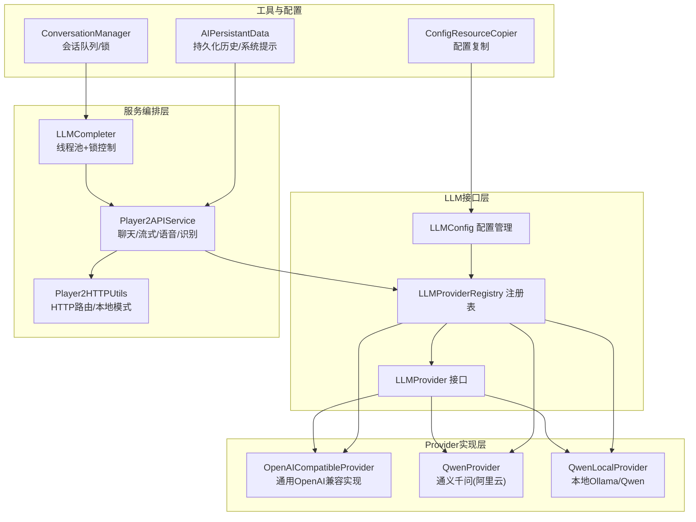
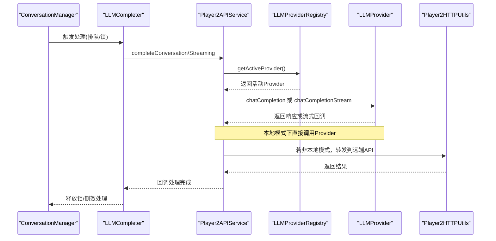
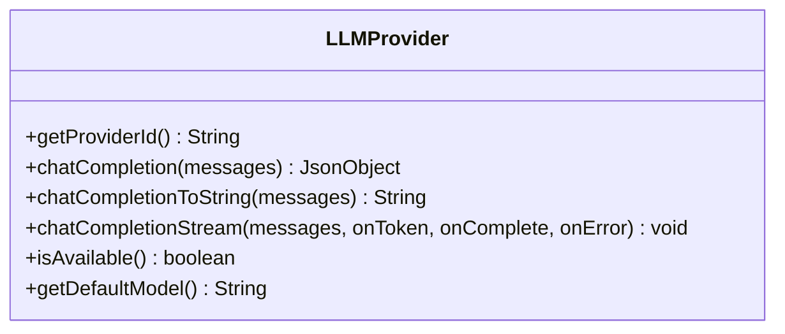
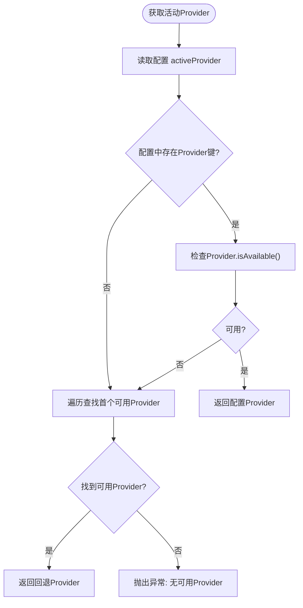
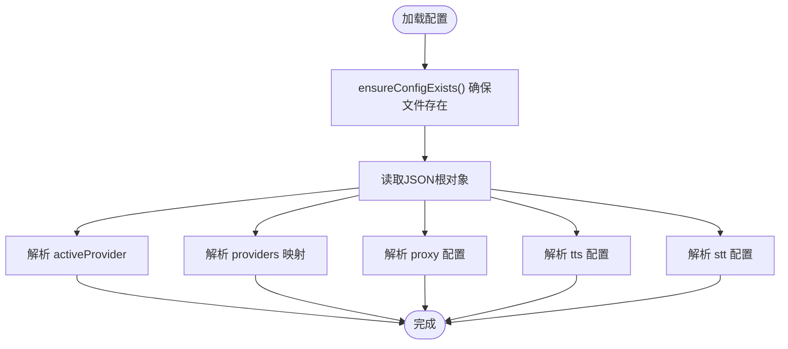
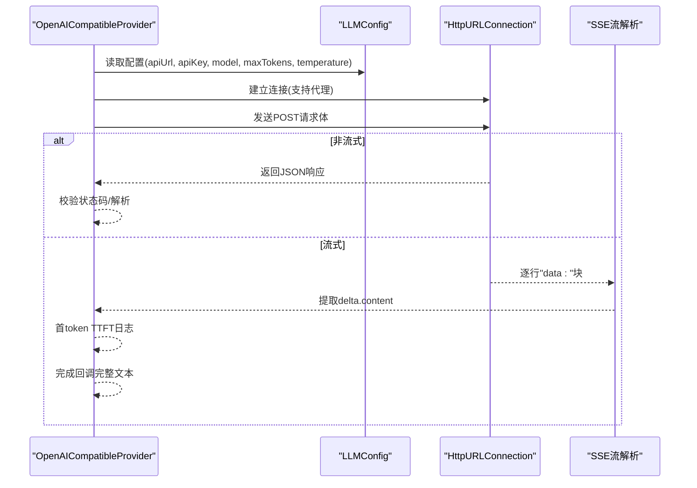
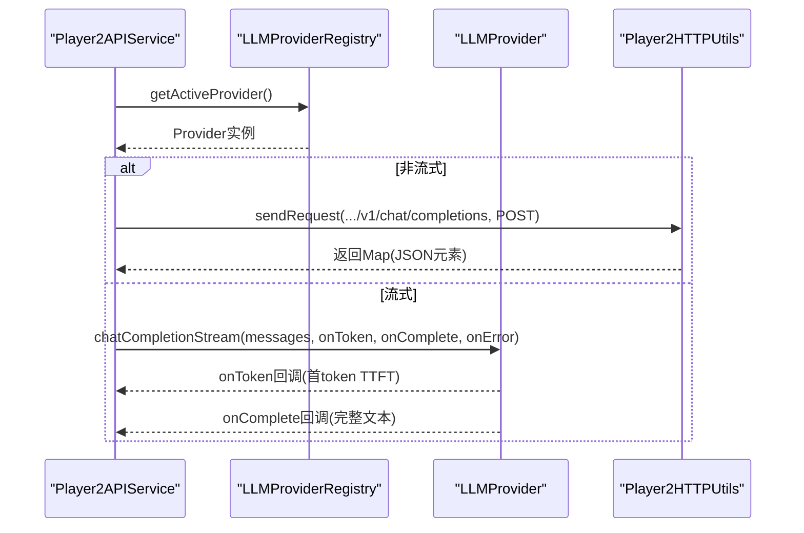
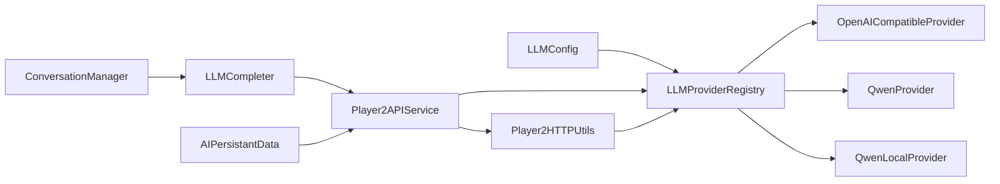

# LLM集成架构

<cite>
**本文档引用的文件**
- [LLMProvider.java](file://src/main/java/adris/altoclef/player2api/llm/LLMProvider.java)
- [LLMProviderRegistry.java](file://src/main/java/adris/altoclef/player2api/llm/LLMProviderRegistry.java)
- [LLMConfig.java](file://src/main/java/adris/altoclef/player2api/llm/LLMConfig.java)
- [OpenAICompatibleProvider.java](file://src/main/java/adris/altoclef/player2api/llm/impl/OpenAICompatibleProvider.java)
- [QwenProvider.java](file://src/main/java/adris/altoclef/player2api/llm/impl/QwenProvider.java)
- [QwenLocalProvider.java](file://src/main/java/adris/altoclef/player2api/llm/impl/QwenLocalProvider.java)
- [Player2APIService.java](file://src/main/java/adris/altoclef/player2api/Player2APIService.java)
- [Player2HTTPUtils.java](file://src/main/java/adris/altoclef/player2api/utils/Player2HTTPUtils.java)
- [LLMCompleter.java](file://src/main/java/adris/altoclef/player2api/LLMCompleter.java)
- [ConfigResourceCopier.java](file://src/main/java/adris/altoclef/player2api/utils/ConfigResourceCopier.java)
- [playerengine-llm-default.json](file://src/main/resources/playerengine-llm-default.json)
- [ConversationManager.java](file://src/main/java/adris/altoclef/player2api/manager/ConversationManager.java)
- [AIPersistantData.java](file://src/main/java/adris/altoclef/player2api/AIPersistantData.java)
</cite>

## 目录
1. [简介](#简介)
2. [项目结构](#项目结构)
3. [核心组件](#核心组件)
4. [架构总览](#架构总览)
5. [详细组件分析](#详细组件分析)
6. [依赖关系分析](#依赖关系分析)
7. [性能考虑](#性能考虑)
8. [故障排除指南](#故障排除指南)
9. [结论](#结论)
10. [附录](#附录)

## 简介
本文件面向LLM集成架构，系统化阐述统一抽象接口LLMProvider的设计理念与实现机制，包括聊天补全、流式传输、可用性检查等核心能力；详解LLMProviderRegistry注册表的注册流程与动态切换策略；解析LLMConfig配置管理系统如何通过Fabric配置目录API进行参数设置、模型选择与性能调优；并给出Provider接口与Fabric组件系统的集成方式、自定义Provider实现最佳实践与常见陷阱规避方法。文档同时提供可视化架构图与序列图，帮助读者快速把握系统全貌与关键流程。

## 项目结构
LLM集成相关代码主要集中在以下模块：
- LLM接口与注册表：统一抽象与动态加载
- 具体Provider实现：OpenAI兼容、通义千问、本地Ollama
- 配置管理：基于Fabric配置目录的配置加载与热重载
- 服务编排：Player2APIService与LLMCompleter协调LLM请求与流式回调
- 工具与辅助：HTTP路由、配置复制、会话管理

图表来源
- [LLMProvider.java:11-66](file://src/main/java/adris/altoclef/player2api/llm/LLMProvider.java#L11-L66)
- [LLMProviderRegistry.java:16-79](file://src/main/java/adris/altoclef/player2api/llm/LLMProviderRegistry.java#L16-L79)
- [LLMConfig.java:19-103](file://src/main/java/adris/altoclef/player2api/llm/LLMConfig.java#L19-L103)
- [OpenAICompatibleProvider.java:24-224](file://src/main/java/adris/altoclef/player2api/llm/impl/OpenAICompatibleProvider.java#L24-L224)
- [QwenProvider.java:11-21](file://src/main/java/adris/altoclef/player2api/llm/impl/QwenProvider.java#L11-L21)
- [QwenLocalProvider.java:12-22](file://src/main/java/adris/altoclef/player2api/llm/impl/QwenLocalProvider.java#L12-L22)
- [Player2APIService.java:35-274](file://src/main/java/adris/altoclef/player2api/Player2APIService.java#L35-L274)
- [Player2HTTPUtils.java:41-151](file://src/main/java/adris/altoclef/player2api/utils/Player2HTTPUtils.java#L41-L151)
- [LLMCompleter.java:16-207](file://src/main/java/adris/altoclef/player2api/LLMCompleter.java#L16-L207)
- [ConfigResourceCopier.java:18-58](file://src/main/java/adris/altoclef/player2api/utils/ConfigResourceCopier.java#L18-L58)
- [ConversationManager.java:27-180](file://src/main/java/adris/altoclef/player2api/manager/ConversationManager.java#L27-L180)
- [AIPersistantData.java:12-71](file://src/main/java/adris/altoclef/player2api/AIPersistantData.java#L12-L71)

章节来源
- [LLMProvider.java:11-66](file://src/main/java/adris/altoclef/player2api/llm/LLMProvider.java#L11-L66)
- [LLMProviderRegistry.java:16-79](file://src/main/java/adris/altoclef/player2api/llm/LLMProviderRegistry.java#L16-L79)
- [LLMConfig.java:19-103](file://src/main/java/adris/altoclef/player2api/llm/LLMConfig.java#L19-L103)

## 核心组件
- LLMProvider接口：定义统一的Provider能力边界，包括唯一标识、聊天补全、流式补全、可用性检查与默认模型。
- LLMProviderRegistry注册表：单例注册表，内置注册多个Provider，并根据配置动态选择活动Provider，支持回退逻辑。
- LLMConfig配置管理：负责从Fabric配置目录读取/复制默认配置，解析activeProvider与各Provider配置，支持代理、TTS、STT等子配置。
- OpenAICompatibleProvider：通用OpenAI兼容实现，封装HTTP请求构建、连接建立、SSE流式解析、可用性判断与默认模型。
- 具体Provider：QwenProvider与QwenLocalProvider继承通用实现，仅覆盖providerId、configKey与默认模型。
- Player2APIService：对外服务入口，封装聊天、流式、TTS、STT、心跳等能力，协调LLMCompleter与HTTP路由。
- LLMCompleter：线程池驱动的任务调度器，负责并发安全与会话锁控制，支持JSON与字符串两种输出形式及流式回调。
- Player2HTTPUtils：HTTP路由工具，区分本地模式与远程模式，将/v1/chat/completions路由至可配置Provider，其他端点按模式处理。
- ConfigResourceCopier：确保运行时配置目录存在配置文件，不存在则从classpath复制默认模板。
- ConversationManager：会话队列与锁管理，协调用户消息、AI消息传播与侧效处理。
- AIPersistantData：持久化会话历史与系统提示，支持清理与更新。

章节来源
- [LLMProvider.java:11-66](file://src/main/java/adris/altoclef/player2api/llm/LLMProvider.java#L11-L66)
- [LLMProviderRegistry.java:16-79](file://src/main/java/adris/altoclef/player2api/llm/LLMProviderRegistry.java#L16-L79)
- [LLMConfig.java:19-103](file://src/main/java/adris/altoclef/player2api/llm/LLMConfig.java#L19-L103)
- [OpenAICompatibleProvider.java:24-224](file://src/main/java/adris/altoclef/player2api/llm/impl/OpenAICompatibleProvider.java#L24-L224)
- [QwenProvider.java:11-21](file://src/main/java/adris/altoclef/player2api/llm/impl/QwenProvider.java#L11-L21)
- [QwenLocalProvider.java:12-22](file://src/main/java/adris/altoclef/player2api/llm/impl/QwenLocalProvider.java#L12-L22)
- [Player2APIService.java:35-274](file://src/main/java/adris/altoclef/player2api/Player2APIService.java#L35-L274)
- [LLMCompleter.java:16-207](file://src/main/java/adris/altoclef/player2api/LLMCompleter.java#L16-L207)
- [Player2HTTPUtils.java:41-151](file://src/main/java/adris/altoclef/player2api/utils/Player2HTTPUtils.java#L41-L151)
- [ConfigResourceCopier.java:18-58](file://src/main/java/adris/altoclef/player2api/utils/ConfigResourceCopier.java#L18-L58)
- [ConversationManager.java:27-180](file://src/main/java/adris/altoclef/player2api/manager/ConversationManager.java#L27-L180)
- [AIPersistantData.java:12-71](file://src/main/java/adris/altoclef/player2api/AIPersistantData.java#L12-L71)

## 架构总览
下图展示从会话管理到Provider选择与HTTP路由的关键交互流程，体现“统一接口 + 动态注册 + 可配置路由”的设计思想。

图表来源
- [ConversationManager.java:136-165](file://src/main/java/adris/altoclef/player2api/manager/ConversationManager.java#L136-L165)
- [LLMCompleter.java:79-203](file://src/main/java/adris/altoclef/player2api/LLMCompleter.java#L79-L203)
- [Player2APIService.java:109-118](file://src/main/java/adris/altoclef/player2api/Player2APIService.java#L109-L118)
- [LLMProviderRegistry.java:49-70](file://src/main/java/adris/altoclef/player2api/llm/LLMProviderRegistry.java#L49-L70)
- [Player2HTTPUtils.java:45-88](file://src/main/java/adris/altoclef/player2api/utils/Player2HTTPUtils.java#L45-L88)

## 详细组件分析

### LLMProvider接口设计
- 统一抽象：以ProviderId标识唯一性，提供chatCompletion与chatCompletionStream两类能力，isAvailable用于可用性检查，getDefaultModel用于默认模型选择。
- 默认实现：chatCompletionToString与chatCompletionStream提供便捷方法与回退实现，便于具体Provider覆盖。
- 设计要点：接口最小化、默认行为可覆盖、错误信息明确，便于上层统一处理。

图表来源
- [LLMProvider.java:11-66](file://src/main/java/adris/altoclef/player2api/llm/LLMProvider.java#L11-L66)

章节来源
- [LLMProvider.java:11-66](file://src/main/java/adris/altoclef/player2api/llm/LLMProvider.java#L11-L66)

### LLMProviderRegistry注册表与动态加载
- 单例与内置注册：首次访问时自动注册内置Provider（通义千问、OpenAI兼容、本地Ollama/Qwen）。
- 活动Provider选择：优先使用配置中的activeProvider，若不可用则遍历查找第一个可用Provider作为回退。
- 查询与枚举：提供按ID查询与全部Provider枚举，便于调试与扩展。

图表来源
- [LLMProviderRegistry.java:49-70](file://src/main/java/adris/altoclef/player2api/llm/LLMProviderRegistry.java#L49-L70)

章节来源
- [LLMProviderRegistry.java:16-79](file://src/main/java/adris/altoclef/player2api/llm/LLMProviderRegistry.java#L16-L79)

### LLMConfig配置管理系统
- 配置文件定位：通过ConfigResourceCopier确保运行时配置目录存在，不存在则从classpath复制默认模板。
- 解析与分发：解析activeProvider、providers、proxy、tts、stt等字段，分别供Provider选择、代理设置、语音与识别配置使用。
- 热重载：提供reload方法，便于运行时重新加载配置。

图表来源
- [LLMConfig.java:54-77](file://src/main/java/adris/altoclef/player2api/llm/LLMConfig.java#L54-L77)
- [ConfigResourceCopier.java:29-57](file://src/main/java/adris/altoclef/player2api/utils/ConfigResourceCopier.java#L29-L57)

章节来源
- [LLMConfig.java:19-103](file://src/main/java/adris/altoclef/player2api/llm/LLMConfig.java#L19-L103)
- [ConfigResourceCopier.java:18-58](file://src/main/java/adris/altoclef/player2api/utils/ConfigResourceCopier.java#L18-L58)
- [playerengine-llm-default.json:1-89](file://src/main/resources/playerengine-llm-default.json#L1-L89)

### OpenAICompatibleProvider通用实现
- 请求构建：从LLMConfig读取apiUrl、apiKey、model、maxTokens、temperature等参数，构造OpenAI兼容的请求体。
- 连接与超时：支持HTTP代理，设置连接与读取超时，发送POST请求。
- 非流式响应：读取响应流，校验状态码，解析JSON并返回。
- 流式SSE：逐行解析"data:"前缀，提取delta.content，首token触发TTFT日志，完成后回调完整文本。
- 可用性检查：要求enabled为true且apiKey非空且不为占位符。
- 默认模型：提供默认模型名称，具体Provider可覆盖。

图表来源
- [OpenAICompatibleProvider.java:51-208](file://src/main/java/adris/altoclef/player2api/llm/impl/OpenAICompatibleProvider.java#L51-L208)
- [LLMConfig.java:79-86](file://src/main/java/adris/altoclef/player2api/llm/LLMConfig.java#L79-L86)

章节来源
- [OpenAICompatibleProvider.java:24-224](file://src/main/java/adris/altoclef/player2api/llm/impl/OpenAICompatibleProvider.java#L24-L224)

### 具体Provider实现
- QwenProvider：继承OpenAICompatibleProvider，providerId与configKey为"qwen"，默认模型为"qwen-plus"。
- QwenLocalProvider：继承OpenAICompatibleProvider，providerId与configKey为"qwen_local"，默认模型为"qwen2.5:7b"，适合本地Ollama或兼容服务。

章节来源
- [QwenProvider.java:11-21](file://src/main/java/adris/altoclef/player2api/llm/impl/QwenProvider.java#L11-L21)
- [QwenLocalProvider.java:12-22](file://src/main/java/adris/altoclef/player2api/llm/impl/QwenLocalProvider.java#L12-L22)

### Player2APIService服务编排
- 聊天补全：completeConversation与completeConversationToString将ConversationHistory转换为messages数组，调用Player2HTTPUtils发送请求。
- 流式补全：completeConversationStreaming直接委托给LLMProviderRegistry.get().chatCompletionStream，实现端到端流式。
- TTS/STT：根据本地/远程模式选择AliyunTTSProvider或Fabric网络包，结合情绪系统动态调整语音参数。
- 心跳：sendHeartbeat与trySendHeartbeat用于健康检查。

图表来源
- [Player2APIService.java:48-118](file://src/main/java/adris/altoclef/player2api/Player2APIService.java#L48-L118)
- [Player2HTTPUtils.java:90-112](file://src/main/java/adris/altoclef/player2api/utils/Player2HTTPUtils.java#L90-L112)

章节来源
- [Player2APIService.java:35-274](file://src/main/java/adris/altoclef/player2api/Player2APIService.java#L35-L274)
- [Player2HTTPUtils.java:41-151](file://src/main/java/adris/altoclef/player2api/utils/Player2HTTPUtils.java#L41-L151)

### LLMCompleter线程池与锁控制
- 并发安全：单线程执行器保证LLM请求串行化，避免竞态。
- 会话锁：通过ConversationManager.Lock防止在LLM响应回调前再次触发处理。
- 流式回调：支持onFirstToken、onComplete、onError回调，解析流式文本为JSON。

章节来源
- [LLMCompleter.java:16-207](file://src/main/java/adris/altoclef/player2api/LLMCompleter.java#L16-L207)
- [ConversationManager.java:30-37](file://src/main/java/adris/altoclef/player2api/manager/ConversationManager.java#L30-L37)

### 配置文件格式与参数说明
- activeProvider：当前活动Provider标识，支持"qwen_local"、"qwen"、"openai"、"player2-remote"。
- providers：各Provider配置，包含enabled、apiUrl、apiKey、model、maxTokens、temperature等。
- proxy：HTTP代理设置，enabled、host、port。
- tts/stt：TTS与STT子配置，包含启用开关、模型、语言、音色、语速、音高等。
- progressVoice：任务进度语音播报间隔范围。

章节来源
- [playerengine-llm-default.json:1-89](file://src/main/resources/playerengine-llm-default.json#L1-L89)

## 依赖关系分析
- 组件耦合：LLMProviderRegistry依赖LLMConfig进行Provider选择；OpenAICompatibleProvider依赖LLMConfig读取配置；Player2APIService依赖LLMProviderRegistry与Player2HTTPUtils；LLMCompleter依赖ConversationManager锁。
- 外部依赖：HTTP连接、Gson解析、Fabric网络API、日志框架。
- 循环依赖：未发现循环依赖，职责清晰。

图表来源
- [LLMConfig.java:79-86](file://src/main/java/adris/altoclef/player2api/llm/LLMConfig.java#L79-L86)
- [LLMProviderRegistry.java:49-70](file://src/main/java/adris/altoclef/player2api/llm/LLMProviderRegistry.java#L49-L70)
- [OpenAICompatibleProvider.java:52-57](file://src/main/java/adris/altoclef/player2api/llm/impl/OpenAICompatibleProvider.java#L52-L57)
- [Player2APIService.java:109-118](file://src/main/java/adris/altoclef/player2api/Player2APIService.java#L109-L118)
- [Player2HTTPUtils.java:90-99](file://src/main/java/adris/altoclef/player2api/utils/Player2HTTPUtils.java#L90-L99)
- [LLMCompleter.java:79-88](file://src/main/java/adris/altoclef/player2api/LLMCompleter.java#L79-L88)
- [ConversationManager.java:140-144](file://src/main/java/adris/altoclef/player2api/manager/ConversationManager.java#L140-L144)
- [AIPersistantData.java:43-51](file://src/main/java/adris/altoclef/player2api/AIPersistantData.java#L43-L51)

章节来源
- [LLMProviderRegistry.java:16-79](file://src/main/java/adris/altoclef/player2api/llm/LLMProviderRegistry.java#L16-L79)
- [Player2HTTPUtils.java:41-151](file://src/main/java/adris/altoclef/player2api/utils/Player2HTTPUtils.java#L41-L151)

## 性能考虑
- 流式传输：优先使用流式接口，减少首token等待时间与内存占用。
- 超时与代理：合理设置连接/读取超时，必要时启用代理以提升海外服务可达性。
- 线程池：LLMCompleter单线程串行化处理，避免并发竞争；可根据业务需求评估多线程策略。
- 缓存与回退：注册表提供回退逻辑，建议在配置中预置多个Provider以提高可用性。
- 日志与监控：利用日志记录关键指标（TTFT、响应大小、错误类型），便于性能分析与问题定位。

## 故障排除指南
- 无可用Provider：当配置的Provider不可用且无其他可用Provider时，注册表会抛出异常。检查activeProvider与各Provider的enabled与apiKey配置。
- HTTP错误：OpenAICompatibleProvider在非2xx状态码时抛出异常，检查apiUrl、apiKey与网络连通性。
- 流式解析失败：SSE解析失败时记录警告，确认上游服务支持SSE并正确返回"data:"块。
- 本地/远程模式差异：本地模式下TTS/STT端点返回空，健康检查也为空；远程模式才调用远端API。
- 会话锁阻塞：若LLMCompleter处于isProcessing状态，后续请求会被忽略；检查外部回调是否正常触发。

章节来源
- [LLMProviderRegistry.java:69-70](file://src/main/java/adris/altoclef/player2api/llm/LLMProviderRegistry.java#L69-L70)
- [OpenAICompatibleProvider.java:126-129](file://src/main/java/adris/altoclef/player2api/llm/impl/OpenAICompatibleProvider.java#L126-L129)
- [OpenAICompatibleProvider.java:191-193](file://src/main/java/adris/altoclef/player2api/llm/impl/OpenAICompatibleProvider.java#L191-L193)
- [Player2HTTPUtils.java:64-77](file://src/main/java/adris/altoclef/player2api/utils/Player2HTTPUtils.java#L64-L77)
- [LLMCompleter.java:30-33](file://src/main/java/adris/altoclef/player2api/LLMCompleter.java#L30-L33)

## 结论
本LLM集成架构通过统一接口与注册表实现了Provider的动态加载与无缝切换，配合可配置的HTTP路由与流式传输机制，既满足本地离线场景（Ollama/Qwen），也兼容云端与远程服务。配置管理与Fabric配置目录API确保了跨开发/生产环境的一致性。通过ConversationManager与LLMCompleter的协作，系统在并发与会话一致性方面具备良好保障。建议在生产环境中为每个Provider准备备用配置，并启用流式传输以优化用户体验。

## 附录

### 自定义Provider实现最佳实践
- 继承策略：推荐继承OpenAICompatibleProvider，仅覆盖providerId、configKey与getDefaultModel。
- 配置键：在playerengine-llm.json的providers中新增对应键，包含enabled、apiUrl、apiKey、model、maxTokens、temperature等。
- 注册流程：在LLMProviderRegistry.registerBuiltins()中添加register(new YourProvider())。
- 可用性检查：遵循isAvailable规则，确保apiKey有效且非占位符。
- 错误处理：提供清晰的异常信息，便于上层统一处理与日志追踪。

章节来源
- [QwenProvider.java:11-21](file://src/main/java/adris/altoclef/player2api/llm/impl/QwenProvider.java#L11-L21)
- [QwenLocalProvider.java:12-22](file://src/main/java/adris/altoclef/player2api/llm/impl/QwenLocalProvider.java#L12-L22)
- [LLMProviderRegistry.java:32-38](file://src/main/java/adris/altoclef/player2api/llm/LLMProviderRegistry.java#L32-L38)
- [playerengine-llm-default.json:1-89](file://src/main/resources/playerengine-llm-default.json#L1-L89)