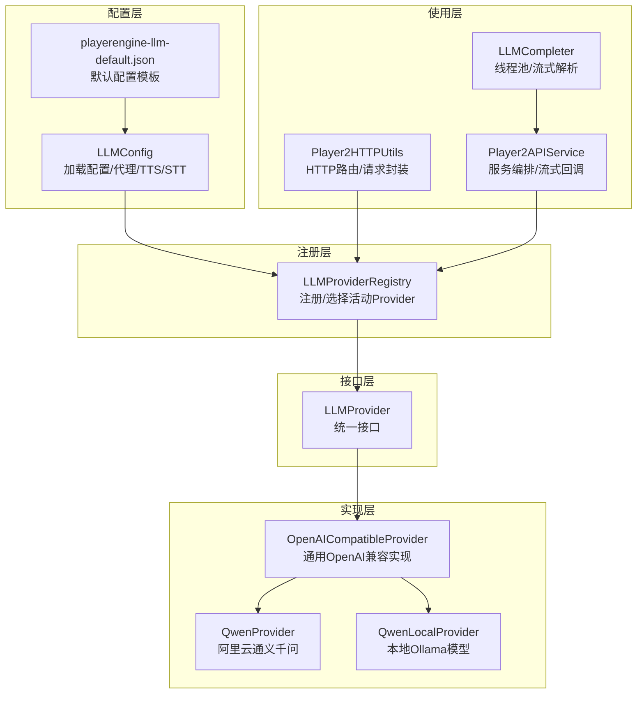
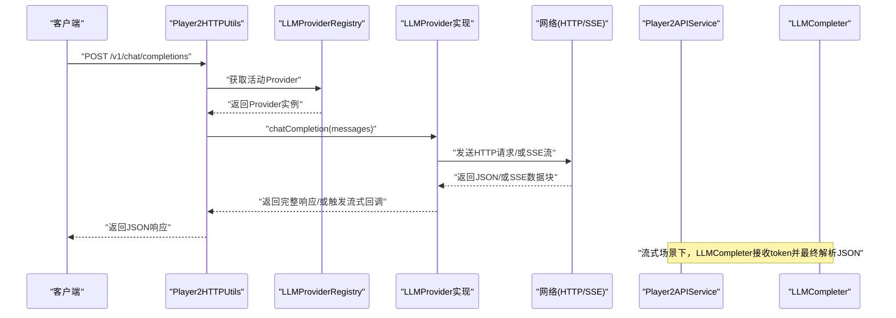
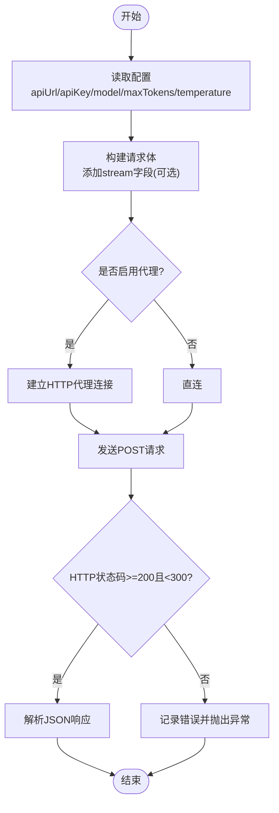
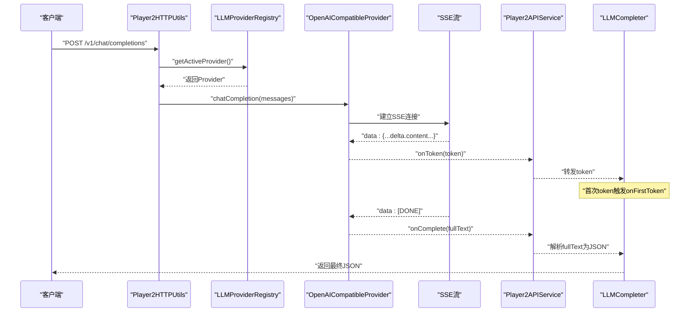
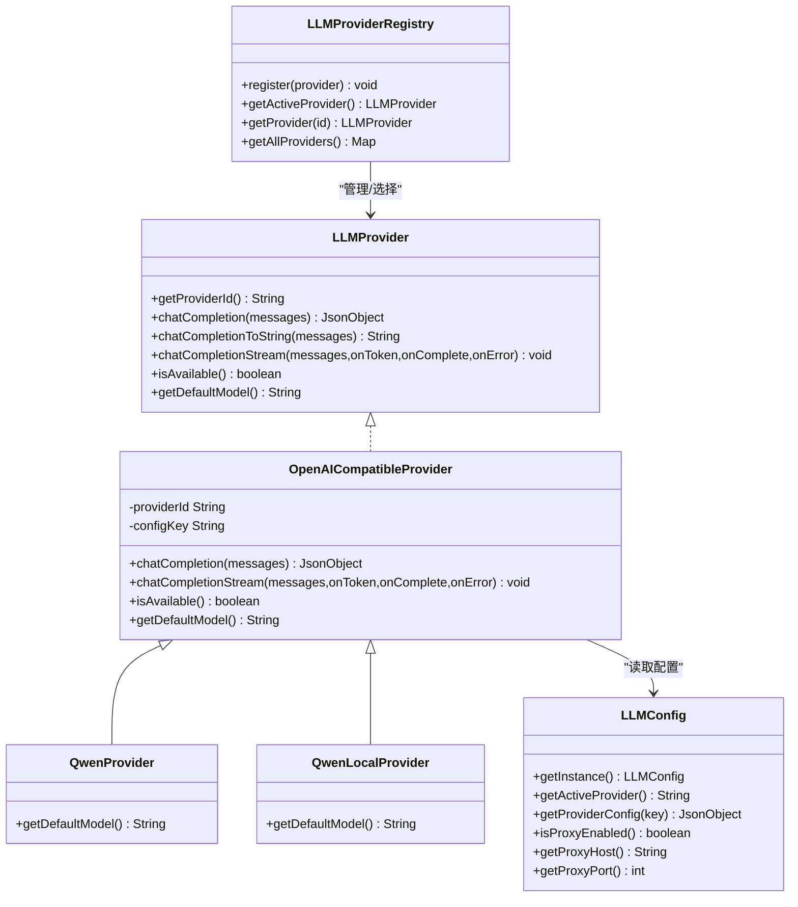

# 具体LLM实现

<cite>
**本文引用的文件**
- [LLMProvider.java](file://src/main/java/adris/altoclef/player2api/llm/LLMProvider.java)
- [OpenAICompatibleProvider.java](file://src/main/java/adris/altoclef/player2api/llm/impl/OpenAICompatibleProvider.java)
- [QwenProvider.java](file://src/main/java/adris/altoclef/player2api/llm/impl/QwenProvider.java)
- [QwenLocalProvider.java](file://src/main/java/adris/altoclef/player2api/llm/impl/QwenLocalProvider.java)
- [LLMConfig.java](file://src/main/java/adris/altoclef/player2api/llm/LLMConfig.java)
- [LLMProviderRegistry.java](file://src/main/java/adris/altoclef/player2api/llm/LLMProviderRegistry.java)
- [playerengine-llm-default.json](file://src/main/resources/playerengine-llm-default.json)
- [Player2HTTPUtils.java](file://src/main/java/adris/altoclef/player2api/utils/Player2HTTPUtils.java)
- [Player2APIService.java](file://src/main/java/adris/altoclef/player2api/Player2APIService.java)
- [LLMCompleter.java](file://src/main/java/adris/altoclef/player2api/LLMCompleter.java)
</cite>

## 目录
1. [简介](#简介)
2. [项目结构](#项目结构)
3. [核心组件](#核心组件)
4. [架构总览](#架构总览)
5. [详细组件分析](#详细组件分析)
6. [依赖分析](#依赖分析)
7. [性能考虑](#性能考虑)
8. [故障排除指南](#故障排除指南)
9. [结论](#结论)
10. [附录](#附录)

## 简介
本文件面向“具体LLM实现”的技术文档，聚焦于三种实际可用的LLM Provider：阿里云通义千问（QwenProvider）、OpenAI兼容实现（OpenAICompatibleProvider）与本地Ollama模型（QwenLocalProvider）。文档将从架构设计、配置体系、数据流与处理逻辑、错误处理与调试技巧等方面进行深入说明，并提供各Provider的使用示例路径、迁移建议与最佳实践。

## 项目结构
围绕LLM能力，项目采用“统一接口 + 可插拔实现 + 配置驱动 + 注册中心”的分层组织方式：
- 统一接口层：定义LLMProvider规范，屏蔽不同后端差异
- 实现层：OpenAI兼容抽象与具体Provider（QwenProvider、QwenLocalProvider）
- 配置层：LLMConfig负责加载与解析配置文件，支持代理、TTS/STT等扩展配置
- 注册层：LLMProviderRegistry集中管理Provider，按配置选择活动Provider并提供回退策略
- 使用层：通过Player2HTTPUtils与Player2APIService路由请求、触发流式/非流式对话

图表来源
- [LLMConfig.java:19-77](file://src/main/java/adris/altoclef/player2api/llm/LLMConfig.java#L19-L77)
- [LLMProviderRegistry.java:16-79](file://src/main/java/adris/altoclef/player2api/llm/LLMProviderRegistry.java#L16-L79)
- [LLMProvider.java:11-66](file://src/main/java/adris/altoclef/player2api/llm/LLMProvider.java#L11-L66)
- [OpenAICompatibleProvider.java:24-224](file://src/main/java/adris/altoclef/player2api/llm/impl/OpenAICompatibleProvider.java#L24-L224)
- [QwenProvider.java:11-21](file://src/main/java/adris/altoclef/player2api/llm/impl/QwenProvider.java#L11-L21)
- [QwenLocalProvider.java:12-22](file://src/main/java/adris/altoclef/player2api/llm/impl/QwenLocalProvider.java#L12-L22)
- [Player2HTTPUtils.java:90-112](file://src/main/java/adris/altoclef/player2api/utils/Player2HTTPUtils.java#L90-L112)
- [Player2APIService.java:110-118](file://src/main/java/adris/altoclef/player2api/Player2APIService.java#L110-L118)
- [LLMCompleter.java:16-208](file://src/main/java/adris/altoclef/player2api/LLMCompleter.java#L16-L208)

章节来源
- [LLMConfig.java:19-104](file://src/main/java/adris/altoclef/player2api/llm/LLMConfig.java#L19-L104)
- [LLMProviderRegistry.java:16-79](file://src/main/java/adris/altoclef/player2api/llm/LLMProviderRegistry.java#L16-L79)
- [playerengine-llm-default.json:1-89](file://src/main/resources/playerengine-llm-default.json#L1-L89)

## 核心组件
- LLMProvider：统一接口，定义Provider标识、聊天补全（含流式）、可用性检查与默认模型名
- OpenAICompatibleProvider：通用OpenAI兼容实现，负责构建请求体、发送HTTP请求、处理SSE流式响应、代理支持、参数校验与超时控制
- QwenProvider：继承OpenAICompatibleProvider，重写Provider ID、配置键与默认模型，适配阿里云DashScope兼容接口
- QwenLocalProvider：继承OpenAICompatibleProvider，重写Provider ID、配置键与默认模型，适配本地Ollama/LM Studio等OpenAI兼容服务
- LLMConfig：单例配置加载器，解析playerengine-llm.json，支持代理、TTS/STT配置
- LLMProviderRegistry：Provider注册与选择，按配置优先，不可用时回退第一个可用Provider
- 使用入口：Player2HTTPUtils与Player2APIService分别负责HTTP路由与服务编排；LLMCompleter负责线程池调度与流式结果解析

章节来源
- [LLMProvider.java:11-66](file://src/main/java/adris/altoclef/player2api/llm/LLMProvider.java#L11-L66)
- [OpenAICompatibleProvider.java:24-224](file://src/main/java/adris/altoclef/player2api/llm/impl/OpenAICompatibleProvider.java#L24-L224)
- [QwenProvider.java:11-21](file://src/main/java/adris/altoclef/player2api/llm/impl/QwenProvider.java#L11-L21)
- [QwenLocalProvider.java:12-22](file://src/main/java/adris/altoclef/player2api/llm/impl/QwenLocalProvider.java#L12-L22)
- [LLMConfig.java:19-104](file://src/main/java/adris/altoclef/player2api/llm/LLMConfig.java#L19-L104)
- [LLMProviderRegistry.java:16-79](file://src/main/java/adris/altoclef/player2api/llm/LLMProviderRegistry.java#L16-L79)
- [Player2HTTPUtils.java:90-112](file://src/main/java/adris/altoclef/player2api/utils/Player2HTTPUtils.java#L90-L112)
- [Player2APIService.java:110-118](file://src/main/java/adris/altoclef/player2api/Player2APIService.java#L110-L118)
- [LLMCompleter.java:16-208](file://src/main/java/adris/altoclef/player2api/LLMCompleter.java#L16-L208)

## 架构总览
下图展示从HTTP请求到Provider执行再到流式回调的关键流程：

图表来源
- [Player2HTTPUtils.java:90-112](file://src/main/java/adris/altoclef/player2api/utils/Player2HTTPUtils.java#L90-L112)
- [LLMProviderRegistry.java:49-70](file://src/main/java/adris/altoclef/player2api/llm/LLMProviderRegistry.java#L49-L70)
- [OpenAICompatibleProvider.java:109-138](file://src/main/java/adris/altoclef/player2api/llm/impl/OpenAICompatibleProvider.java#L109-L138)
- [Player2APIService.java:110-118](file://src/main/java/adris/altoclef/player2api/Player2APIService.java#L110-L118)
- [LLMCompleter.java:116-203](file://src/main/java/adris/altoclef/player2api/LLMCompleter.java#L116-L203)

## 详细组件分析

### 组件：LLMProvider接口
- 角色：统一抽象，屏蔽不同Provider差异
- 关键点：
  - 提供唯一Provider ID
  - chatCompletion(messages)返回OpenAI兼容格式的完整响应
  - chatCompletionToString(messages)便捷提取助手回复文本
  - chatCompletionStream(messages, onToken, onComplete, onError)默认回退至非流式，子类可覆盖
  - isAvailable()用于可用性检查
  - getDefaultModel()返回默认模型名

章节来源
- [LLMProvider.java:11-66](file://src/main/java/adris/altoclef/player2api/llm/LLMProvider.java#L11-L66)

### 组件：OpenAICompatibleProvider（通用OpenAI兼容实现）
- 角色：所有OpenAI兼容Provider的基类，负责：
  - 从LLMConfig读取apiUrl、apiKey、model、maxTokens、temperature等参数
  - 构建OpenAI兼容请求体（含stream字段）
  - 发送HTTP请求，支持代理（HTTP）
  - 解析非流式响应，记录日志
  - 流式SSE解析：逐行读取"data:"前缀，解析delta.content，首token记录TTFT
  - 参数范围约束（max_tokens限幅）
  - 可用性判断：enabled且apiKey非空且非占位符
- 性能与可靠性：
  - 连接与读取超时配置
  - 日志详尽，便于问题定位
  - 错误状态码统一抛出异常

图表来源
- [OpenAICompatibleProvider.java:51-138](file://src/main/java/adris/altoclef/player2api/llm/impl/OpenAICompatibleProvider.java#L51-L138)

章节来源
- [OpenAICompatibleProvider.java:24-224](file://src/main/java/adris/altoclef/player2api/llm/impl/OpenAICompatibleProvider.java#L24-L224)

### 组件：QwenProvider（阿里云通义千问）
- 角色：基于OpenAI兼容协议的Qwen实现
- 关键点：
  - Provider ID为"qwen"，配置键为"qwen"
  - 默认模型：qwen-plus
  - 默认API端点：DashScope兼容模式URL
- 适用场景：国内用户稳定、低延迟、成本可控

章节来源
- [QwenProvider.java:11-21](file://src/main/java/adris/altoclef/player2api/llm/impl/QwenProvider.java#L11-L21)

### 组件：QwenLocalProvider（本地Ollama模型）
- 角色：本地OpenAI兼容服务（如Ollama）的Qwen实现
- 关键点：
  - Provider ID为"qwen_local"，配置键为"qwen_local"
  - 默认模型：qwen2.5:7b
  - 默认API端点：http://localhost:11434/v1
- 适用场景：离线推理、隐私保护、低延迟本地交互

章节来源
- [QwenLocalProvider.java:12-22](file://src/main/java/adris/altoclef/player2api/llm/impl/QwenLocalProvider.java#L12-L22)

### 组件：LLMConfig（配置加载器）
- 角色：单例配置加载器，负责：
  - 从Fabric配置目录加载playerengine-llm.json
  - 若不存在则从classpath复制默认模板
  - 提供activeProvider、providers、proxy、tts、stt等配置读取
  - 代理开关、主机、端口读取
- 重要配置项（节选）：
  - activeProvider：当前活动Provider
  - providers.qwen_local/openai/qwen/provider2-remote：各Provider开关、apiUrl、apiKey、model、maxTokens、temperature
  - proxy.enabled/host/port：HTTP代理
  - tts/stt：TTS/STT配置（与LLM同级）

章节来源
- [LLMConfig.java:19-104](file://src/main/java/adris/altoclef/player2api/llm/LLMConfig.java#L19-L104)
- [playerengine-llm-default.json:6-43](file://src/main/resources/playerengine-llm-default.json#L6-L43)

### 组件：LLMProviderRegistry（Provider注册与选择）
- 角色：Provider注册中心，负责：
  - 首次访问时注册内置Provider（Qwen、OpenAI兼容、QwenLocal）
  - 根据配置获取活动Provider，若不可用则回退第一个可用Provider
  - 提供按ID获取Provider与全部Provider列表
- 选择策略：优先配置，其次可用性

章节来源
- [LLMProviderRegistry.java:16-79](file://src/main/java/adris/altoclef/player2api/llm/LLMProviderRegistry.java#L16-L79)

### 组件：使用入口（Player2HTTPUtils / Player2APIService / LLMCompleter）
- Player2HTTPUtils：将HTTP请求路由到活动Provider，非流式直接返回JSON
- Player2APIService：在流式场景下调用Provider的流式接口，接收token增量与最终完成回调
- LLMCompleter：线程池调度，流式场景下首次token触发回调，最终解析完整JSON

图表来源
- [Player2HTTPUtils.java:90-112](file://src/main/java/adris/altoclef/player2api/utils/Player2HTTPUtils.java#L90-L112)
- [Player2APIService.java:110-118](file://src/main/java/adris/altoclef/player2api/Player2APIService.java#L110-L118)
- [OpenAICompatibleProvider.java:140-208](file://src/main/java/adris/altoclef/player2api/llm/impl/OpenAICompatibleProvider.java#L140-L208)
- [LLMCompleter.java:116-203](file://src/main/java/adris/altoclef/player2api/LLMCompleter.java#L116-L203)

章节来源
- [Player2HTTPUtils.java:90-112](file://src/main/java/adris/altoclef/player2api/utils/Player2HTTPUtils.java#L90-L112)
- [Player2APIService.java:110-118](file://src/main/java/adris/altoclef/player2api/Player2APIService.java#L110-L118)
- [LLMCompleter.java:16-208](file://src/main/java/adris/altoclef/player2api/LLMCompleter.java#L16-L208)

## 依赖分析
- 继承关系：
  - QwenProvider/QwenLocalProvider均继承OpenAICompatibleProvider
  - OpenAICompatibleProvider实现LLMProvider
- 耦合关系：
  - Provider依赖LLMConfig读取配置
  - 注册中心依赖Provider实现类进行注册
  - 使用层通过注册中心获取Provider，避免对具体实现的直接耦合
- 外部依赖：
  - HTTP(S)连接（含代理）
  - Gson JSON解析
  - Log4j日志

图表来源
- [LLMProvider.java:11-66](file://src/main/java/adris/altoclef/player2api/llm/LLMProvider.java#L11-L66)
- [OpenAICompatibleProvider.java:24-224](file://src/main/java/adris/altoclef/player2api/llm/impl/OpenAICompatibleProvider.java#L24-L224)
- [QwenProvider.java:11-21](file://src/main/java/adris/altoclef/player2api/llm/impl/QwenProvider.java#L11-L21)
- [QwenLocalProvider.java:12-22](file://src/main/java/adris/altoclef/player2api/llm/impl/QwenLocalProvider.java#L12-L22)
- [LLMConfig.java:19-104](file://src/main/java/adris/altoclef/player2api/llm/LLMConfig.java#L19-L104)
- [LLMProviderRegistry.java:16-79](file://src/main/java/adris/altoclef/player2api/llm/LLMProviderRegistry.java#L16-L79)

章节来源
- [OpenAICompatibleProvider.java:24-224](file://src/main/java/adris/altoclef/player2api/llm/impl/OpenAICompatibleProvider.java#L24-L224)
- [QwenProvider.java:11-21](file://src/main/java/adris/altoclef/player2api/llm/impl/QwenProvider.java#L11-L21)
- [QwenLocalProvider.java:12-22](file://src/main/java/adris/altoclef/player2api/llm/impl/QwenLocalProvider.java#L12-L22)
- [LLMConfig.java:19-104](file://src/main/java/adris/altoclef/player2api/llm/LLMConfig.java#L19-L104)
- [LLMProviderRegistry.java:16-79](file://src/main/java/adris/altoclef/player2api/llm/LLMProviderRegistry.java#L16-L79)

## 性能考虑
- 连接与读取超时：已设置连接超时与读取超时，避免长时间阻塞
- 流式传输：SSE流式返回可尽早感知首token（TTFT），改善用户体验
- 参数限制：maxTokens在[1, 65536]范围内，防止过大请求导致资源浪费
- 代理支持：在受限网络环境下可通过HTTP代理访问远端服务
- 线程模型：LLMCompleter使用单线程执行器串行化LLM调用，避免并发竞争；流式回调在Provider内部线程中触发，外部需注意线程安全

章节来源
- [OpenAICompatibleProvider.java:98-100](file://src/main/java/adris/altoclef/player2api/llm/impl/OpenAICompatibleProvider.java#L98-L100)
- [OpenAICompatibleProvider.java:59-62](file://src/main/java/adris/altoclef/player2api/llm/impl/OpenAICompatibleProvider.java#L59-L62)
- [OpenAICompatibleProvider.java:140-208](file://src/main/java/adris/altoclef/player2api/llm/impl/OpenAICompatibleProvider.java#L140-L208)
- [LLMCompleter.java:19-208](file://src/main/java/adris/altoclef/player2api/LLMCompleter.java#L19-L208)

## 故障排除指南
- 无法找到可用Provider
  - 现象：抛出“无可用Provider”异常
  - 排查：确认配置文件中至少一个Provider的enabled为true且apiKey有效
  - 参考
    - [LLMProviderRegistry.java:69-70](file://src/main/java/adris/altoclef/player2api/llm/LLMProviderRegistry.java#L69-L70)
    - [LLMConfig.java:54-77](file://src/main/java/adris/altoclef/player2api/llm/LLMConfig.java#L54-L77)
- HTTP状态码异常
  - 现象：日志记录HTTP错误并抛出异常
  - 排查：检查apiUrl、apiKey、网络连通性、代理设置
  - 参考
    - [OpenAICompatibleProvider.java:126-130](file://src/main/java/adris/altoclef/player2api/llm/impl/OpenAICompatibleProvider.java#L126-L130)
    - [OpenAICompatibleProvider.java:151-161](file://src/main/java/adris/altoclef/player2api/llm/impl/OpenAICompatibleProvider.java#L151-L161)
- SSE流解析失败
  - 现象：日志提示SSE数据块解析失败
  - 排查：确认后端返回符合SSE格式；检查网络稳定性
  - 参考
    - [OpenAICompatibleProvider.java:191-194](file://src/main/java/adris/altoclef/player2api/llm/impl/OpenAICompatibleProvider.java#L191-L194)
- 本地Ollama未启动或端口不正确
  - 现象：连接超时或拒绝
  - 排查：确认本地Ollama服务已启动，端口与配置一致
  - 参考
    - [QwenLocalProvider.java:12-22](file://src/main/java/adris/altoclef/player2api/llm/impl/QwenLocalProvider.java#L12-L22)
    - [playerengine-llm-default.json:10-18](file://src/main/resources/playerengine-llm-default.json#L10-L18)
- 阿里云API Key无效
  - 现象：isAvailable返回false或请求被拒
  - 排查：确认apiKey非空且非占位符，网络可达DashScope
  - 参考
    - [OpenAICompatibleProvider.java:211-218](file://src/main/java/adris/altoclef/player2api/llm/impl/OpenAICompatibleProvider.java#L211-L218)
    - [QwenProvider.java:11-21](file://src/main/java/adris/altoclef/player2api/llm/impl/QwenProvider.java#L11-L21)
- OpenAI代理设置
  - 现象：国内访问OpenAI失败
  - 排查：启用proxy并正确填写host/port
  - 参考
    - [LLMConfig.java:88-98](file://src/main/java/adris/altoclef/player2api/llm/LLMConfig.java#L88-L98)
    - [OpenAICompatibleProvider.java:84-90](file://src/main/java/adris/altoclef/player2api/llm/impl/OpenAICompatibleProvider.java#L84-L90)

## 结论
该实现以统一接口为核心，通过OpenAI兼容抽象屏蔽不同后端差异，结合配置驱动与注册中心实现灵活切换。QwenProvider适合国内稳定低延迟场景，QwenLocalProvider满足离线与隐私需求，OpenAICompatibleProvider为其他兼容服务提供通用适配。配合完善的日志、超时与流式回调机制，可在多种部署环境中获得一致的使用体验。

## 附录

### 各Provider特点对比与适用场景
- QwenProvider（阿里云通义）
  - 特点：国内可用、低延迟、成本可控
  - 适用：国内用户、需要稳定服务的场景
  - 默认模型：qwen-plus
  - 参考
    - [QwenProvider.java:11-21](file://src/main/java/adris/altoclef/player2api/llm/impl/QwenProvider.java#L11-L21)
- QwenLocalProvider（本地Ollama）
  - 特点：离线、隐私、低延迟
  - 适用：本地开发、隐私敏感、无外网
  - 默认模型：qwen2.5:7b
  - 参考
    - [QwenLocalProvider.java:12-22](file://src/main/java/adris/altoclef/player2api/llm/impl/QwenLocalProvider.java#L12-L22)
- OpenAICompatibleProvider（通用）
  - 特点：可适配任意OpenAI兼容服务
  - 适用：自建服务、第三方兼容服务
  - 参考
    - [OpenAICompatibleProvider.java:24-224](file://src/main/java/adris/altoclef/player2api/llm/impl/OpenAICompatibleProvider.java#L24-L224)

### 配置最佳实践
- 选择活动Provider：根据网络与隐私需求在playerengine-llm.json中设置activeProvider
- API Key管理：不要提交API Key到仓库，使用默认模板作为参考
- 代理设置：国内访问OpenAI时启用proxy
- 模型与参数：合理设置maxTokens与temperature，兼顾质量与性能
- 参考
  - [playerengine-llm-default.json:6-43](file://src/main/resources/playerengine-llm-default.json#L6-L43)
  - [LLMConfig.java:54-77](file://src/main/java/adris/altoclef/player2api/llm/LLMConfig.java#L54-L77)

### 使用示例（路径指引）
- 非流式聊天补全
  - 请求路由：[Player2HTTPUtils.java:90-112](file://src/main/java/adris/altoclef/player2api/utils/Player2HTTPUtils.java#L90-L112)
  - Provider调用：[OpenAICompatibleProvider.java:109-138](file://src/main/java/adris/altoclef/player2api/llm/impl/OpenAICompatibleProvider.java#L109-L138)
- 流式聊天补全
  - Provider调用：[OpenAICompatibleProvider.java:140-208](file://src/main/java/adris/altoclef/player2api/llm/impl/OpenAICompatibleProvider.java#L140-L208)
  - 服务编排：[Player2APIService.java:110-118](file://src/main/java/adris/altoclef/player2api/Player2APIService.java#L110-L118)
  - 结果解析：[LLMCompleter.java:174-203](file://src/main/java/adris/altoclef/player2api/LLMCompleter.java#L174-L203)

### 迁移方法
- 从OpenAI迁移到QwenProvider
  - 步骤：将openai配置项复制到qwen配置，替换apiUrl为DashScope兼容端点，更新apiKey
  - 参考
    - [QwenProvider.java:11-21](file://src/main/java/adris/altoclef/player2api/llm/impl/QwenProvider.java#L11-L21)
    - [playerengine-llm-default.json:19-27](file://src/main/resources/playerengine-llm-default.json#L19-L27)
- 从远端迁移到本地Ollama
  - 步骤：启用qwen_local，确保Ollama服务运行，模型拉取完成
  - 参考
    - [QwenLocalProvider.java:12-22](file://src/main/java/adris/altoclef/player2api/llm/impl/QwenLocalProvider.java#L12-L22)
    - [playerengine-llm-default.json:9-18](file://src/main/resources/playerengine-llm-default.json#L9-L18)