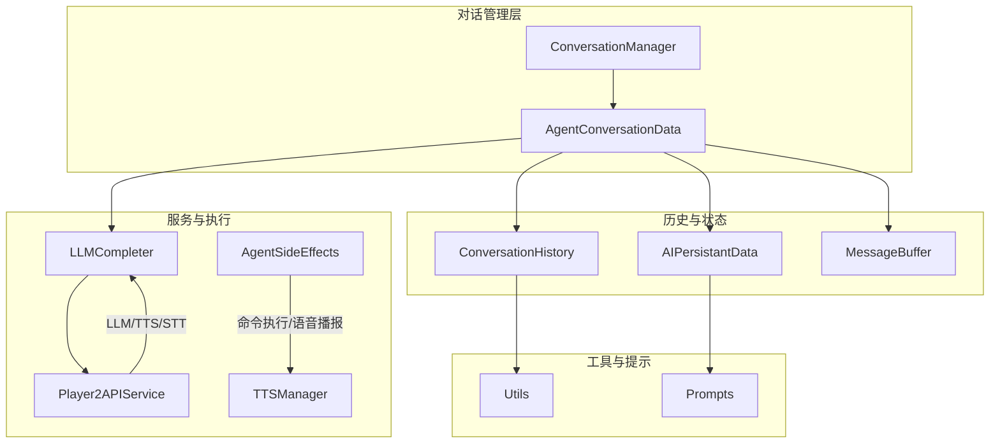
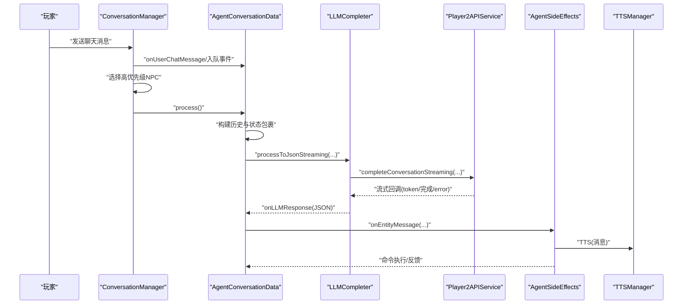
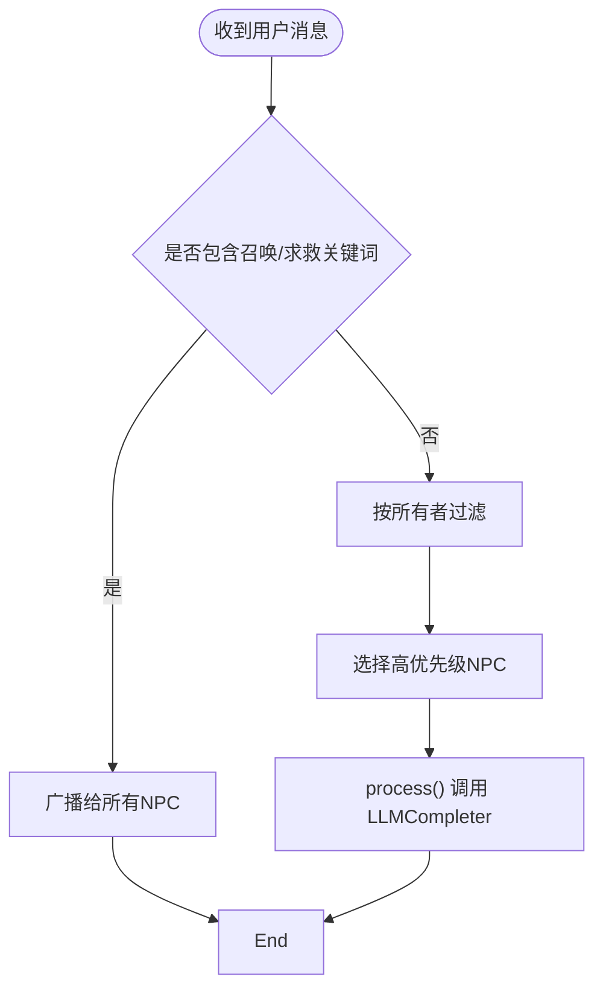
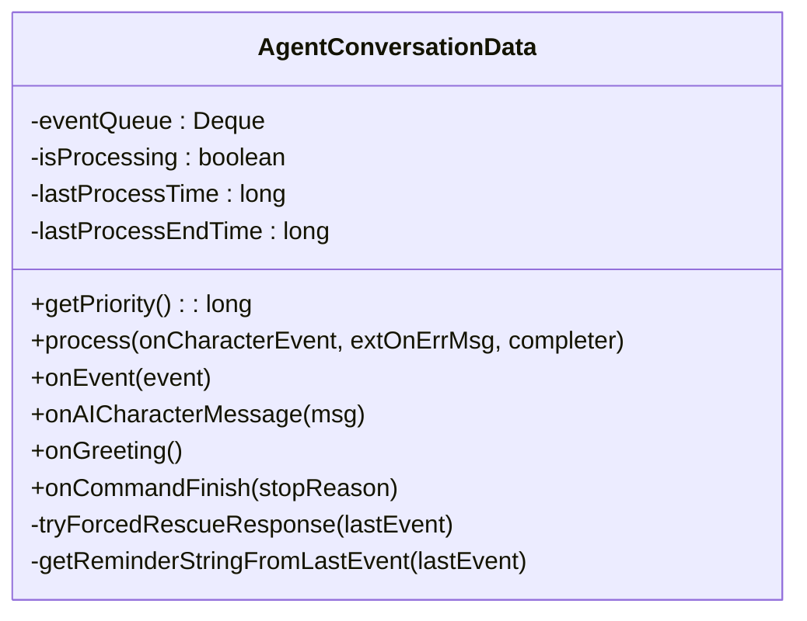
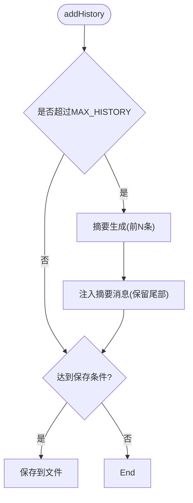
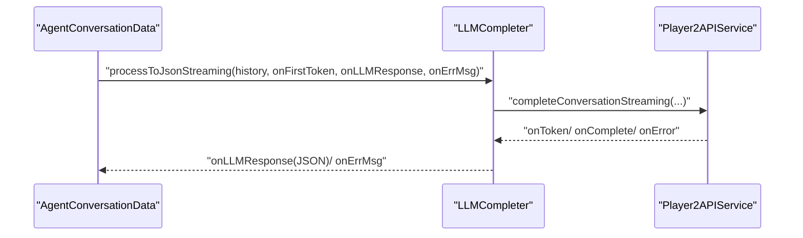
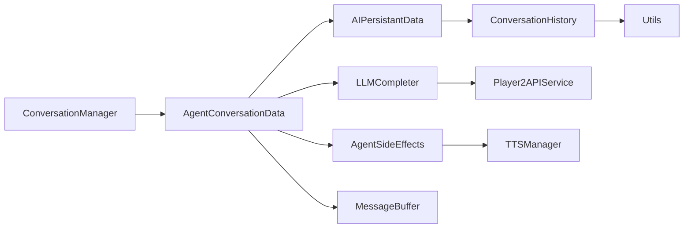

# 对话管理系统

<cite>
**本文引用的文件**
- [ConversationManager.java](file://src/main/java/adris/altoclef/player2api/manager/ConversationManager.java)
- [AgentConversationData.java](file://src/main/java/adris/altoclef/player2api/AgentConversationData.java)
- [ConversationHistory.java](file://src/main/java/adris/altoclef/player2api/ConversationHistory.java)
- [LLMCompleter.java](file://src/main/java/adris/altoclef/player2api/LLMCompleter.java)
- [Player2APIService.java](file://src/main/java/adris/altoclef/player2api/Player2APIService.java)
- [AIPersistantData.java](file://src/main/java/adris/altoclef/player2api/AIPersistantData.java)
- [Event.java](file://src/main/java/adris/altoclef/player2api/Event.java)
- [AgentSideEffects.java](file://src/main/java/adris/altoclef/player2api/AgentSideEffects.java)
- [TTSManager.java](file://src/main/java/adris/altoclef/player2api/manager/TTSManager.java)
- [MessageBuffer.java](file://src/main/java/adris/altoclef/player2api/MessageBuffer.java)
- [Utils.java](file://src/main/java/adris/altoclef/player2api/utils/Utils.java)
- [Prompts.java](file://src/main/java/adris/altoclef/player2api/Prompts.java)
- [README.md](file://README.md)
</cite>

## 目录
1. [简介](#简介)
2. [项目结构](#项目结构)
3. [核心组件](#核心组件)
4. [架构总览](#架构总览)
5. [详细组件分析](#详细组件分析)
6. [依赖关系分析](#依赖关系分析)
7. [性能考量](#性能考量)
8. [故障排查指南](#故障排查指南)
9. [结论](#结论)
10. [附录](#附录)

## 简介
本技术文档围绕对话管理系统展开，重点解析 ConversationManager 的核心功能、对话会话管理与多轮对话处理机制，以及 ConversationHistory 的历史记录存储、消息序列管理与上下文维护策略。同时深入阐述 AgentConversationData 的数据结构设计、对话状态跟踪与内存管理机制，并覆盖对话生命周期管理、消息格式标准化与并发安全处理。文档还解释与 LLM Provider 的集成方式、流式响应处理与错误恢复机制，并提供最佳实践、性能优化建议与常见问题解决方案。

## 项目结构
对话管理相关代码集中在 player2api 子模块中，采用分层设计：
- 管理层：ConversationManager 负责全局事件调度与 NPC 间消息广播
- 数据层：AgentConversationData 维护单个 NPC 的事件队列与处理状态
- 历史层：ConversationHistory 负责消息序列与上下文摘要
- 服务层：Player2APIService 封装 LLM/TTS/STT 调用
- 执行层：AgentSideEffects 将 LLM 响应转化为游戏内的命令与语音
- 工具层：LLMCompleter 提供线程池与流式回调封装；Utils 提供 JSON 解析与工具方法

图表来源
- [ConversationManager.java:27-206](file://src/main/java/adris/altoclef/player2api/manager/ConversationManager.java#L27-L206)
- [AgentConversationData.java:31-562](file://src/main/java/adris/altoclef/player2api/AgentConversationData.java#L31-L562)
- [ConversationHistory.java:16-288](file://src/main/java/adris/altoclef/player2api/ConversationHistory.java#L16-L288)
- [LLMCompleter.java:16-226](file://src/main/java/adris/altoclef/player2api/LLMCompleter.java#L16-L226)
- [Player2APIService.java:35-274](file://src/main/java/adris/altoclef/player2api/Player2APIService.java#L35-L274)
- [AgentSideEffects.java:21-184](file://src/main/java/adris/altoclef/player2api/AgentSideEffects.java#L21-L184)
- [TTSManager.java:35-168](file://src/main/java/adris/altoclef/player2api/manager/TTSManager.java#L35-L168)
- [MessageBuffer.java:5-36](file://src/main/java/adris/altoclef/player2api/MessageBuffer.java#L5-L36)
- [Utils.java:13-104](file://src/main/java/adris/altoclef/player2api/utils/Utils.java#L13-L104)
- [Prompts.java:10-200](file://src/main/java/adris/altoclef/player2api/Prompts.java#L10-L200)

章节来源
- [README.md:494-562](file://README.md#L494-L562)

## 核心组件
- ConversationManager：全局对话调度器，负责用户消息捕获、NPC 间广播、优先级选择与 LLM 处理触发，以及 TTS 管理注入
- AgentConversationData：单个 NPC 的事件队列与处理状态，包含优先级计算、强制响应拦截、问候绕过、最小响应间隔、情绪提醒注入、状态包裹与流式 LLM 处理
- ConversationHistory：对话历史记录，支持最大长度截断、摘要生成、文件持久化、系统提示注入与最新消息包装
- LLMCompleter：LLM 调用封装，提供同步与流式两种处理路径，带超时与锁机制，保证并发安全
- Player2APIService：服务层封装，统一 LLM/TTS/STT 调用，支持远程与本地模式，提供心跳与 STT 控制
- AgentSideEffects：副作用执行器，负责消息广播、命令执行、反馈与 TTS 触发
- TTSManager：TTS 调度与锁，提供句子级流水线、序列号去重、全局冷却与估计结束时间
- MessageBuffer：消息缓冲，用于将系统调试信息注入到最新用户消息中
- Utils：通用工具，提供 JSON 安全解析、占位符替换、深拷贝等
- Prompts：系统提示模板，包含 NPC 人设、指令映射、及时反馈原则等

章节来源
- [ConversationManager.java:27-206](file://src/main/java/adris/altoclef/player2api/manager/ConversationManager.java#L27-L206)
- [AgentConversationData.java:31-562](file://src/main/java/adris/altoclef/player2api/AgentConversationData.java#L31-L562)
- [ConversationHistory.java:16-288](file://src/main/java/adris/altoclef/player2api/ConversationHistory.java#L16-L288)
- [LLMCompleter.java:16-226](file://src/main/java/adris/altoclef/player2api/LLMCompleter.java#L16-L226)
- [Player2APIService.java:35-274](file://src/main/java/adris/altoclef/player2api/Player2APIService.java#L35-L274)
- [AgentSideEffects.java:21-184](file://src/main/java/adris/altoclef/player2api/AgentSideEffects.java#L21-L184)
- [TTSManager.java:35-168](file://src/main/java/adris/altoclef/player2api/manager/TTSManager.java#L35-L168)
- [MessageBuffer.java:5-36](file://src/main/java/adris/altoclef/player2api/MessageBuffer.java#L5-L36)
- [Utils.java:13-104](file://src/main/java/adris/altoclef/player2api/utils/Utils.java#L13-L104)
- [Prompts.java:10-200](file://src/main/java/adris/altoclef/player2api/Prompts.java#L10-L200)

## 架构总览
对话管理采用“事件驱动 + 状态机”的架构：
- 事件来源：用户聊天消息（Fabric 事件）、AI NPC 消息、系统调试消息
- 事件汇聚：AgentConversationData 维护事件队列，按优先级与时间戳计算处理权重
- 上下文构建：AIPersistantData 将事件队列转为 ConversationHistory，并注入世界状态、代理状态、提醒与调试信息
- LLM 处理：LLMCompleter 在独立线程池中调用 Player2APIService，支持流式回调与首 token 提示
- 副作用执行：AgentSideEffects 将 LLM 响应转化为命令执行与语音播报，TTSManager 控制 TTS 流水线
- 生命周期：从事件入队到命令执行完成，贯穿问候绕过、强制响应拦截、最小响应间隔、情绪触发与自动喂食等策略

图表来源
- [ConversationManager.java:114-191](file://src/main/java/adris/altoclef/player2api/manager/ConversationManager.java#L114-L191)
- [AgentConversationData.java:101-264](file://src/main/java/adris/altoclef/player2api/AgentConversationData.java#L101-L264)
- [LLMCompleter.java:121-211](file://src/main/java/adris/altoclef/player2api/LLMCompleter.java#L121-L211)
- [Player2APIService.java:109-118](file://src/main/java/adris/altoclef/player2api/Player2APIService.java#L109-L118)
- [AgentSideEffects.java:40-64](file://src/main/java/adris/altoclef/player2api/AgentSideEffects.java#L40-L64)
- [TTSManager.java:94-153](file://src/main/java/adris/altoclef/player2api/manager/TTSManager.java#L94-L153)

## 详细组件分析

### ConversationManager：全局对话调度与广播
- 初始化与事件订阅：通过 Fabric 事件注册监听聊天消息，统一转交至 onUserChatMessage
- 用户消息处理：支持“召唤/求救”关键词广播给所有 NPC；普通消息按所有者匹配过滤
- NPC 间消息广播：根据距离阈值（64 格）向邻近 NPC 转发 AI NPC 消息
- 优先级选择与处理：遍历所有 AgentConversationData，按优先级与时间戳选择最高优先级 NPC 进行 LLM 处理
- 并发安全：通过 Lock 机制防止 onLLMResponse 未完成时再次处理，超时自动释放
- 注入周期：injectOnTick 每 tick 调用 process 并注入 TTS 管理

图表来源
- [ConversationManager.java:94-150](file://src/main/java/adris/altoclef/player2api/manager/ConversationManager.java#L94-L150)

章节来源
- [ConversationManager.java:27-206](file://src/main/java/adris/altoclef/player2api/manager/ConversationManager.java#L27-L206)

### AgentConversationData：单 NPC 事件队列与处理状态
- 事件队列：ConcurrentLinkedDeque 保证并发安全；最大长度限制与重复事件去重
- 优先级计算：基于 lastProcessTime 与事件优先级（低/常/高/危），避免频繁处理
- 最小响应间隔：3 秒，防止 LLM 回复刷屏
- 强制响应拦截：针对“救命/保护我/攻击/召唤”等关键词，绕过 LLM 直接生成响应（两阶段救援/召回）
- 问候绕过：首次消息直接使用角色问候信息，不走 LLM
- 状态包裹：将世界状态、代理状态、提醒与调试信息注入最新用户消息
- 流式 LLM 处理：支持首 token 提示与 JSON 解析，异常时记录错误并释放处理锁
- 命令反馈与情绪：命令完成/错误/取消分别触发反馈与情绪触发；自动喂食与两阶段救援

图表来源
- [AgentConversationData.java:31-562](file://src/main/java/adris/altoclef/player2api/AgentConversationData.java#L31-L562)

章节来源
- [AgentConversationData.java:31-562](file://src/main/java/adris/altoclef/player2api/AgentConversationData.java#L31-L562)

### ConversationHistory：历史记录与上下文摘要
- 数据结构：List<JsonObject> 存储消息序列，首条为系统提示
- 最大长度与截断：超过阈值时进行摘要，保留尾部若干条，定期保存到文件
- 摘要生成：调用 Player2APIService 完成摘要，异常时回退为空字符串
- 文件持久化：按需保存/加载，限制最大行数与内容长度
- 系统提示注入：支持更新系统提示
- 最新消息包装：将世界状态、代理状态、提醒与调试信息包装进最新用户消息

图表来源
- [ConversationHistory.java:48-94](file://src/main/java/adris/altoclef/player2api/ConversationHistory.java#L48-L94)

章节来源
- [ConversationHistory.java:16-288](file://src/main/java/adris/altoclef/player2api/ConversationHistory.java#L16-L288)

### LLMCompleter：LLM 调用封装与流式处理
- 线程池：单线程执行，避免并发竞争
- 同步与流式：分别提供 JSON 与字符串两种处理路径
- 流式处理：支持 onFirstToken 与 onComplete 回调，首 token 触发早期反馈
- 错误处理：捕获异常并回调外部错误处理器，最终释放锁
- 超时与锁：isProcessing 与超时检测，防止长时间占用

图表来源
- [LLMCompleter.java:121-211](file://src/main/java/adris/altoclef/player2api/LLMCompleter.java#L121-L211)
- [Player2APIService.java:109-118](file://src/main/java/adris/altoclef/player2api/Player2APIService.java#L109-L118)

章节来源
- [LLMCompleter.java:16-226](file://src/main/java/adris/altoclef/player2api/LLMCompleter.java#L16-L226)
- [Player2APIService.java:35-274](file://src/main/java/adris/altoclef/player2api/Player2APIService.java#L35-L274)

### Player2APIService：服务层封装与 Provider 集成
- LLM：统一将消息数组发送至 LLM Provider，支持字符串与 JSON 两种返回
- 流式：委托 LLMProviderRegistry 获取当前 Provider，执行流式回调
- TTS：本地模式通过 AliyunTTSProvider 合成音频并通过网络包发送到客户端；远程模式通过网络包触发客户端流式播放
- STT：启动/停止语音识别，返回识别文本
- 心跳：定时发送健康检查请求

章节来源
- [Player2APIService.java:35-274](file://src/main/java/adris/altoclef/player2api/Player2APIService.java#L35-L274)

### AgentSideEffects：副作用执行与命令调度
- 文字消息广播：将 NPC 消息广播给附近玩家
- 命令执行：解析命令前缀，执行命令并在完成/错误/取消时回调 onCommandFinish
- 情绪与行为：根据命令类型触发情绪触发与行为（如主动型 NPC 的问候替代 idle）
- TTS 触发：根据消息与是否问候决定是否播放语音

章节来源
- [AgentSideEffects.java:21-184](file://src/main/java/adris/altoclef/player2api/AgentSideEffects.java#L21-L184)

### TTSManager：TTS 调度与锁控制
- 序列号去重：currentSequence 防止过期任务继续播放
- 句子级流水线：按句分割，逐句合成与发送，降低延迟
- 冷却与去重：全局冷却与消息去重，避免语音刷屏
- 锁与估计：基于字符数估算播放时长，到期自动释放锁

章节来源
- [TTSManager.java:35-168](file://src/main/java/adris/altoclef/player2api/manager/TTSManager.java#L35-L168)

### MessageBuffer：系统调试消息注入
- 简单环形缓冲：最多保留固定数量的系统消息，拼接为字符串注入最新用户消息

章节来源
- [MessageBuffer.java:5-36](file://src/main/java/adris/altoclef/player2api/MessageBuffer.java#L5-L36)

### Utils 与 Prompts：工具与提示模板
- Utils：提供 JSON 安全解析、占位符替换、深拷贝与抛出函数接口
- Prompts：定义 NPC 人设、指令映射、及时反馈原则、命令优先级与沉默规则等

章节来源
- [Utils.java:13-104](file://src/main/java/adris/altoclef/player2api/utils/Utils.java#L13-L104)
- [Prompts.java:10-200](file://src/main/java/adris/altoclef/player2api/Prompts.java#L10-L200)

## 依赖关系分析
- ConversationManager 依赖 AgentConversationData（队列与处理）、LLMCompleter（LLM 调用）、AgentSideEffects（副作用）、TTSManager（TTS 注入）
- AgentConversationData 依赖 AIPersistantData（历史与系统提示）、ConversationHistory（上下文构建）、LLMCompleter（流式处理）、AgentSideEffects（命令执行）、MessageBuffer（调试注入）
- ConversationHistory 依赖 Utils（JSON 解析与深拷贝）、Player2APIService（摘要与保存）
- LLMCompleter 依赖 Player2APIService（LLM 调用）、ConversationManager.Lock（并发锁）
- Player2APIService 依赖 LLMProviderRegistry（Provider 选择）、AliyunTTSProvider（本地 TTS）、TTSConfig（TTS 配置）、STTConfig（STT 配置）
- AgentSideEffects 依赖 AgentConversationData（回调）、TTSManager（TTS）

图表来源
- [ConversationManager.java:27-206](file://src/main/java/adris/altoclef/player2api/manager/ConversationManager.java#L27-L206)
- [AgentConversationData.java:31-562](file://src/main/java/adris/altoclef/player2api/AgentConversationData.java#L31-L562)
- [AIPersistantData.java:12-71](file://src/main/java/adris/altoclef/player2api/AIPersistantData.java#L12-L71)
- [ConversationHistory.java:16-288](file://src/main/java/adris/altoclef/player2api/ConversationHistory.java#L16-L288)
- [LLMCompleter.java:16-226](file://src/main/java/adris/altoclef/player2api/LLMCompleter.java#L16-L226)
- [Player2APIService.java:35-274](file://src/main/java/adris/altoclef/player2api/Player2APIService.java#L35-L274)
- [AgentSideEffects.java:21-184](file://src/main/java/adris/altoclef/player2api/AgentSideEffects.java#L21-L184)
- [TTSManager.java:35-168](file://src/main/java/adris/altoclef/player2api/manager/TTSManager.java#L35-L168)
- [MessageBuffer.java:5-36](file://src/main/java/adris/altoclef/player2api/MessageBuffer.java#L5-L36)
- [Utils.java:13-104](file://src/main/java/adris/altoclef/player2api/utils/Utils.java#L13-L104)

## 性能考量
- 线程模型：LLMCompleter 使用单线程池，避免并发竞争；TTSManager 使用单线程执行器，句子级流水线降低延迟
- 去重与冷却：TTSManager 的序列号去重与全局冷却有效防止语音刷屏；AgentConversationData 的最小响应间隔避免 LLM 回复风暴
- 历史截断：ConversationHistory 的最大长度与摘要机制控制上下文大小，减少 API 成本与延迟
- 首 token 提示：LLMCompleter 的 onFirstToken 回调提升感知延迟，改善用户体验
- 并发安全：ConcurrentLinkedDeque 与锁机制（ConversationManager.Lock、LLMCompleter.isProcessing）保障多 NPC 并发下的稳定性

## 故障排查指南
- LLM 无响应或超时
  - 检查 LLMCompleter.isAvailible 与 ConversationManager.Lock 状态
  - 查看日志中“Called complete conversation”“Finished complete conversation”等关键词
- TTS 无声或合成失败
  - 检查 TTSManager.isLocked 与估计结束时间；确认 TTS 配置与 API Key
  - 查看日志中“[AliyunTTS] Synthesizing text”“TTS audio sent to client”
- STT 识别为空或失败
  - 检查录音时长与麦克风权限；查看“[STT] Recognition returned empty”“[AliyunSTT] Final result”
- 命令执行异常
  - 查看 AgentSideEffects 的错误回调与 onCommandFinish；确认命令前缀与持久性命令规则
- 历史文件异常
  - 检查 ConversationHistory 的文件保存/加载逻辑与异常回退

章节来源
- [LLMCompleter.java:213-225](file://src/main/java/adris/altoclef/player2api/LLMCompleter.java#L213-L225)
- [TTSManager.java:155-167](file://src/main/java/adris/altoclef/player2api/manager/TTSManager.java#L155-L167)
- [Player2APIService.java:120-231](file://src/main/java/adris/altoclef/player2api/Player2APIService.java#L120-L231)
- [AgentSideEffects.java:133-143](file://src/main/java/adris/altoclef/player2api/AgentSideEffects.java#L133-L143)
- [ConversationHistory.java:96-168](file://src/main/java/adris/altoclef/player2api/ConversationHistory.java#L96-L168)

## 结论
对话管理系统通过清晰的分层设计与严格的并发控制，实现了从事件入队、上下文构建、LLM 处理到副作用执行的完整闭环。AgentConversationData 的优先级与强制响应拦截机制确保关键场景的即时响应；ConversationHistory 的摘要与持久化策略平衡了上下文质量与性能；LLMCompleter 的流式处理与锁机制提升了用户体验与系统稳定性；TTSManager 的句子级流水线与冷却策略避免了语音刷屏。结合最佳实践与性能优化建议，系统能够在复杂多 NPC 场景下保持高效、稳定与可扩展。

## 附录
- 最佳实践
  - 合理设置最小响应间隔与历史长度，避免过度消耗 API 与内存
  - 使用“召唤/求救”关键词时注意所有者匹配与两阶段救援流程
  - 在高并发场景下，优先使用流式 LLM 与句子级 TTS，降低延迟
  - 定期清理历史文件，避免过大文件影响加载性能
- 常见问题
  - API Key 无效：检查配置文件与 DashScope 控制台状态
  - 语音合成失败：确认 TTS 配置与模型/音色版本匹配
  - STT 识别失败：确保录音时长与麦克风权限，检查网络代理设置
  - 命令执行异常：检查命令前缀与持久性规则，关注错误回调