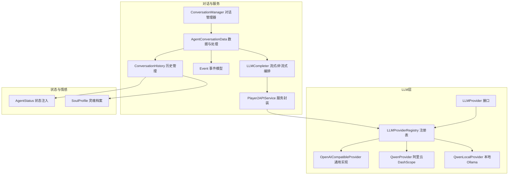
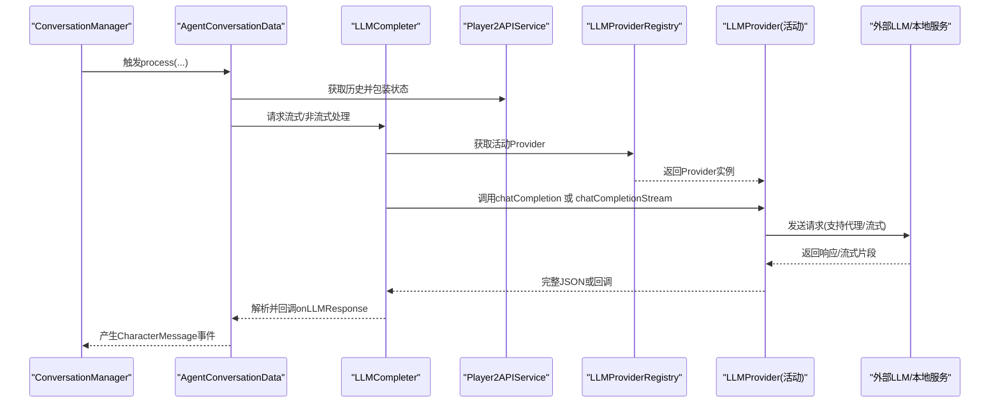
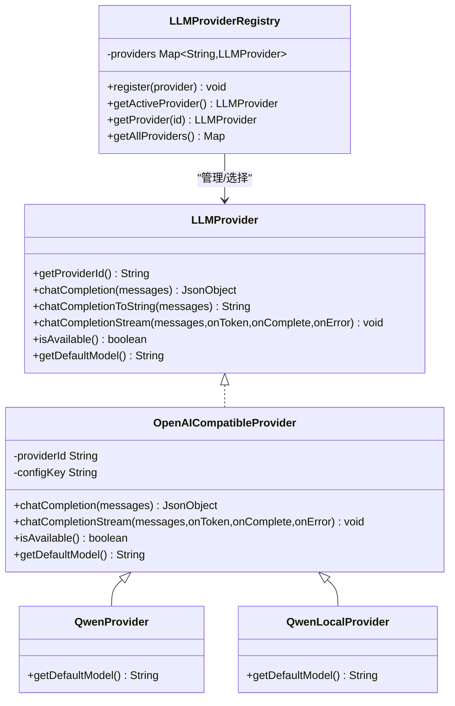
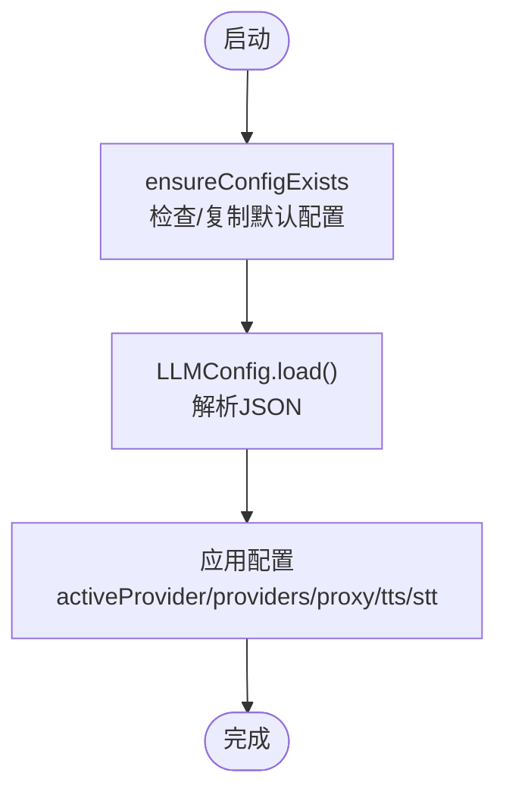
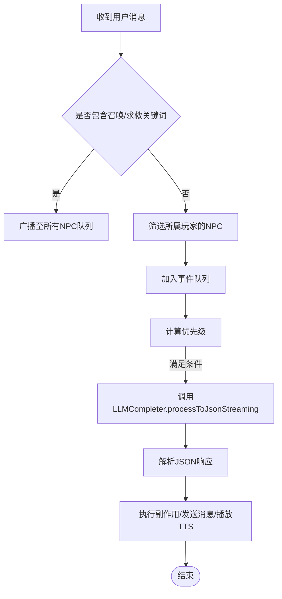
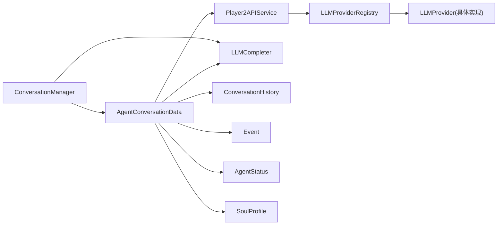

# 智能对话系统

<cite>
**本文引用的文件**
- [LLMProvider.java](file://src/main/java/adris/altoclef/player2api/llm/LLMProvider.java)
- [LLMProviderRegistry.java](file://src/main/java/adris/altoclef/player2api/llm/LLMProviderRegistry.java)
- [LLMConfig.java](file://src/main/java/adris/altoclef/player2api/llm/LLMConfig.java)
- [OpenAICompatibleProvider.java](file://src/main/java/adris/altoclef/player2api/llm/impl/OpenAICompatibleProvider.java)
- [QwenProvider.java](file://src/main/java/adris/altoclef/player2api/llm/impl/QwenProvider.java)
- [QwenLocalProvider.java](file://src/main/java/adris/altoclef/player2api/llm/impl/QwenLocalProvider.java)
- [LLMCompleter.java](file://src/main/java/adris/altoclef/player2api/LLMCompleter.java)
- [Player2APIService.java](file://src/main/java/adris/altoclef/player2api/Player2APIService.java)
- [ConversationManager.java](file://src/main/java/adris/altoclef/player2api/manager/ConversationManager.java)
- [AgentConversationData.java](file://src/main/java/adris/altoclef/player2api/AgentConversationData.java)
- [ConversationHistory.java](file://src/main/java/adris/altoclef/player2api/ConversationHistory.java)
- [Event.java](file://src/main/java/adris/altoclef/player2api/Event.java)
- [AgentStatus.java](file://src/main/java/adris/altoclef/player2api/status/AgentStatus.java)
- [SoulProfile.java](file://src/main/java/adris/altoclef/player2api/soul/SoulProfile.java)
- [playerengine-llm-default.json](file://src/main/resources/playerengine-llm-default.json)
- [ConfigResourceCopier.java](file://src/main/java/adris/altoclef/player2api/utils/ConfigResourceCopier.java)
</cite>

## 目录
1. [简介](#简介)
2. [项目结构](#项目结构)
3. [核心组件](#核心组件)
4. [架构总览](#架构总览)
5. [详细组件分析](#详细组件分析)
6. [依赖分析](#依赖分析)
7. [性能考虑](#性能考虑)
8. [故障排查指南](#故障排查指南)
9. [结论](#结论)
10. [附录](#附录)

## 简介
本技术文档面向“智能对话系统”，聚焦于以下方面：
- LLM Provider策略模式架构与Provider注册表机制
- 配置管理与运行时加载
- 具体LLM实现（阿里云通义千问、OpenAI兼容实现、本地Ollama模型）的集成方式
- 对话管理器ConversationManager的工作原理、对话历史管理
- AgentConversationData的数据结构与处理流程
- 与TTS/STT等其他组件的集成关系
- 常见问题与性能优化建议

## 项目结构
围绕LLM与对话的核心模块主要分布在以下包内：
- player2api/llm：LLM Provider接口、注册表与具体实现
- player2api：对话管理、历史管理、事件模型、服务封装
- player2api/manager：对话调度与生命周期管理
- player2api/status：状态注入（Agent/World）
- player2api/soul：NPC灵魂系统（人格、情绪、记忆、关系）
- resources：默认配置模板

图表来源
- [LLMProvider.java:11-66](file://src/main/java/adris/altoclef/player2api/llm/LLMProvider.java#L11-L66)
- [LLMProviderRegistry.java:16-79](file://src/main/java/adris/altoclef/player2api/llm/LLMProviderRegistry.java#L16-L79)
- [OpenAICompatibleProvider.java:24-221](file://src/main/java/adris/altoclef/player2api/llm/impl/OpenAICompatibleProvider.java#L24-L221)
- [QwenProvider.java:11-22](file://src/main/java/adris/altoclef/player2api/llm/impl/QwenProvider.java#L11-L22)
- [QwenLocalProvider.java:12-23](file://src/main/java/adris/altoclef/player2api/llm/impl/QwenLocalProvider.java#L12-L23)
- [Player2APIService.java:35-274](file://src/main/java/adris/altoclef/player2api/Player2APIService.java#L35-L274)
- [ConversationManager.java:27-180](file://src/main/java/adris/altoclef/player2api/manager/ConversationManager.java#L27-L180)
- [AgentConversationData.java:31-547](file://src/main/java/adris/altoclef/player2api/AgentConversationData.java#L31-L547)
- [ConversationHistory.java:16-269](file://src/main/java/adris/altoclef/player2api/ConversationHistory.java#L16-L269)
- [Event.java:3-65](file://src/main/java/adris/altoclef/player2api/Event.java#L3-L65)
- [AgentStatus.java:6-24](file://src/main/java/adris/altoclef/player2api/status/AgentStatus.java#L6-L24)
- [SoulProfile.java:14-174](file://src/main/java/adris/altoclef/player2api/soul/SoulProfile.java#L14-L174)

章节来源
- [LLMProvider.java:1-67](file://src/main/java/adris/altoclef/player2api/llm/LLMProvider.java#L1-L67)
- [LLMProviderRegistry.java:1-80](file://src/main/java/adris/altoclef/player2api/llm/LLMProviderRegistry.java#L1-L80)
- [LLMConfig.java:1-104](file://src/main/java/adris/altoclef/player2api/llm/LLMConfig.java#L1-L104)
- [OpenAICompatibleProvider.java:1-221](file://src/main/java/adris/altoclef/player2api/llm/impl/OpenAICompatibleProvider.java#L1-L221)
- [QwenProvider.java:1-22](file://src/main/java/adris/altoclef/player2api/llm/impl/QwenProvider.java#L1-L22)
- [QwenLocalProvider.java:1-23](file://src/main/java/adris/altoclef/player2api/llm/impl/QwenLocalProvider.java#L1-L23)
- [Player2APIService.java:1-274](file://src/main/java/adris/altoclef/player2api/Player2APIService.java#L1-L274)
- [ConversationManager.java:1-180](file://src/main/java/adris/altoclef/player2api/manager/ConversationManager.java#L1-L180)
- [AgentConversationData.java:1-547](file://src/main/java/adris/altoclef/player2api/AgentConversationData.java#L1-L547)
- [ConversationHistory.java:1-269](file://src/main/java/adris/altoclef/player2api/ConversationHistory.java#L1-L269)
- [Event.java:1-65](file://src/main/java/adris/altoclef/player2api/Event.java#L1-L65)
- [AgentStatus.java:1-24](file://src/main/java/adris/altoclef/player2api/status/AgentStatus.java#L1-L24)
- [SoulProfile.java:1-174](file://src/main/java/adris/altoclef/player2api/soul/SoulProfile.java#L1-L174)
- [playerengine-llm-default.json:1-89](file://src/main/resources/playerengine-llm-default.json#L1-L89)
- [ConfigResourceCopier.java:1-59](file://src/main/java/adris/altoclef/player2api/utils/ConfigResourceCopier.java#L1-L59)

## 核心组件
- LLMProvider接口：统一抽象，定义提供者标识、聊天补全、流式补全、可用性与默认模型等能力。
- LLMProviderRegistry注册表：单例，内置注册多个Provider，并根据配置选择活动Provider；支持回退逻辑。
- LLMConfig配置：负责从运行时配置目录加载playerengine-llm.json，提供活跃Provider与各Provider配置读取。
- OpenAICompatibleProvider通用实现：遵循OpenAI /v1/chat/completions格式，支持代理、流式SSE、超参控制。
- 具体Provider：
  - QwenProvider：阿里云DashScope通义千问，继承通用实现，覆盖ID与默认模型。
  - QwenLocalProvider：本地Ollama或其他OpenAI兼容服务，覆盖ID与默认模型。
- Player2APIService：对外部服务的封装，负责将ConversationHistory转换为请求体，调用远程或本地LLM；同时负责TTS/STT。
- LLMCompleter：线程池驱动的编排器，负责锁控制、回调转发、流式解析与错误处理。
- ConversationManager：全局对话入口，订阅聊天事件，调度AgentConversationData队列，注入每tick处理。
- AgentConversationData：每个NPC的对话数据与处理单元，包含事件队列、优先级计算、强制响应、问候绕过、状态注入、情绪提醒、自动反馈与救援两阶段等。
- ConversationHistory：对话历史容器，支持系统提示注入、摘要压缩、文件持久化与状态包装。
- Event：事件模型（用户消息、角色消息、信息消息），带优先级判定。
- AgentStatus/SoulProfile：状态注入与情感提醒，增强对话上下文。

章节来源
- [LLMProvider.java:11-66](file://src/main/java/adris/altoclef/player2api/llm/LLMProvider.java#L11-L66)
- [LLMProviderRegistry.java:16-79](file://src/main/java/adris/altoclef/player2api/llm/LLMProviderRegistry.java#L16-L79)
- [LLMConfig.java:19-104](file://src/main/java/adris/altoclef/player2api/llm/LLMConfig.java#L19-L104)
- [OpenAICompatibleProvider.java:24-221](file://src/main/java/adris/altoclef/player2api/llm/impl/OpenAICompatibleProvider.java#L24-L221)
- [QwenProvider.java:11-22](file://src/main/java/adris/altoclef/player2api/llm/impl/QwenProvider.java#L11-L22)
- [QwenLocalProvider.java:12-23](file://src/main/java/adris/altoclef/player2api/llm/impl/QwenLocalProvider.java#L12-L23)
- [Player2APIService.java:35-274](file://src/main/java/adris/altoclef/player2api/Player2APIService.java#L35-L274)
- [LLMCompleter.java:16-208](file://src/main/java/adris/altoclef/player2api/LLMCompleter.java#L16-L208)
- [ConversationManager.java:27-180](file://src/main/java/adris/altoclef/player2api/manager/ConversationManager.java#L27-L180)
- [AgentConversationData.java:31-547](file://src/main/java/adris/altoclef/player2api/AgentConversationData.java#L31-L547)
- [ConversationHistory.java:16-269](file://src/main/java/adris/altoclef/player2api/ConversationHistory.java#L16-L269)
- [Event.java:3-65](file://src/main/java/adris/altoclef/player2api/Event.java#L3-L65)
- [AgentStatus.java:6-24](file://src/main/java/adris/altoclef/player2api/status/AgentStatus.java#L6-L24)
- [SoulProfile.java:14-174](file://src/main/java/adris/altoclef/player2api/soul/SoulProfile.java#L14-L174)

## 架构总览
系统采用“策略模式 + 注册表 + 配置驱动”的解耦架构：
- Provider通过接口抽象，注册表集中管理，运行时按配置选择活动Provider。
- Player2APIService作为服务门面，既可调用远程API，也可委托注册表的活动Provider进行本地流式推理。
- ConversationManager负责事件接入与调度，AgentConversationData负责单NPC的对话状态与处理，ConversationHistory负责上下文与摘要。
- LLMCompleter负责线程与锁控制，确保并发安全与用户体验（首Token提示、错误回调）。

图表来源
- [ConversationManager.java:98-165](file://src/main/java/adris/altoclef/player2api/manager/ConversationManager.java#L98-L165)
- [AgentConversationData.java:89-249](file://src/main/java/adris/altoclef/player2api/AgentConversationData.java#L89-L249)
- [LLMCompleter.java:91-203](file://src/main/java/adris/altoclef/player2api/LLMCompleter.java#L91-L203)
- [Player2APIService.java:109-118](file://src/main/java/adris/altoclef/player2api/Player2APIService.java#L109-L118)
- [LLMProviderRegistry.java:49-70](file://src/main/java/adris/altoclef/player2api/llm/LLMProviderRegistry.java#L49-L70)
- [OpenAICompatibleProvider.java:109-204](file://src/main/java/adris/altoclef/player2api/llm/impl/OpenAICompatibleProvider.java#L109-L204)

## 详细组件分析

### LLM Provider策略模式与注册表
- 策略模式要点
  - LLMProvider定义统一接口：提供者ID、聊天补全、流式补全、可用性判断、默认模型。
  - OpenAICompatibleProvider提供通用实现：构建请求体、连接建立、代理支持、SSE流式解析、超参校验。
  - 具体Provider（QwenProvider、QwenLocalProvider）仅覆写ID与默认模型，继承通用逻辑。
- 注册表机制
  - 单例注册内置Provider（Qwen、OpenAI兼容、本地Qwen）。
  - 按配置选择活动Provider，若不可用则回退至首个可用Provider。
  - 提供按ID检索与全部Provider导出，便于调试与扩展。

图表来源
- [LLMProvider.java:11-66](file://src/main/java/adris/altoclef/player2api/llm/LLMProvider.java#L11-L66)
- [OpenAICompatibleProvider.java:24-221](file://src/main/java/adris/altoclef/player2api/llm/impl/OpenAICompatibleProvider.java#L24-L221)
- [QwenProvider.java:11-22](file://src/main/java/adris/altoclef/player2api/llm/impl/QwenProvider.java#L11-L22)
- [QwenLocalProvider.java:12-23](file://src/main/java/adris/altoclef/player2api/llm/impl/QwenLocalProvider.java#L12-L23)
- [LLMProviderRegistry.java:16-79](file://src/main/java/adris/altoclef/player2api/llm/LLMProviderRegistry.java#L16-L79)

章节来源
- [LLMProvider.java:11-66](file://src/main/java/adris/altoclef/player2api/llm/LLMProvider.java#L11-L66)
- [OpenAICompatibleProvider.java:24-221](file://src/main/java/adris/altoclef/player2api/llm/impl/OpenAICompatibleProvider.java#L24-L221)
- [QwenProvider.java:11-22](file://src/main/java/adris/altoclef/player2api/llm/impl/QwenProvider.java#L11-L22)
- [QwenLocalProvider.java:12-23](file://src/main/java/adris/altoclef/player2api/llm/impl/QwenLocalProvider.java#L12-L23)
- [LLMProviderRegistry.java:16-79](file://src/main/java/adris/altoclef/player2api/llm/LLMProviderRegistry.java#L16-L79)

### 配置管理与默认模板
- 配置加载
  - 使用ConfigResourceCopier确保运行时配置目录存在playerengine-llm.json，不存在则从classpath复制默认模板。
  - LLMConfig单例加载配置，支持重载；读取activeProvider、providers、proxy、tts、stt等字段。
- 默认模板
  - 默认启用qwen_local（本地Ollama），提供qwen与openai的示例配置项，以及代理、TTS、STT、进度语音等配置段落。
- 最佳实践
  - 修改配置后需重启生效；不要将API Key提交到公共仓库；代理仅在需要访问海外服务时开启。

图表来源
- [ConfigResourceCopier.java:29-57](file://src/main/java/adris/altoclef/player2api/utils/ConfigResourceCopier.java#L29-L57)
- [LLMConfig.java:54-77](file://src/main/java/adris/altoclef/player2api/llm/LLMConfig.java#L54-L77)
- [playerengine-llm-default.json:1-89](file://src/main/resources/playerengine-llm-default.json#L1-L89)

章节来源
- [ConfigResourceCopier.java:18-59](file://src/main/java/adris/altoclef/player2api/utils/ConfigResourceCopier.java#L18-L59)
- [LLMConfig.java:19-104](file://src/main/java/adris/altoclef/player2api/llm/LLMConfig.java#L19-L104)
- [playerengine-llm-default.json:1-89](file://src/main/resources/playerengine-llm-default.json#L1-L89)

### 具体LLM实现集成方式
- 阿里云通义千问（QwenProvider）
  - 继承OpenAICompatibleProvider，提供providerId="qwen"与默认模型"qwen-plus"。
  - 通过LLMConfig读取"qwen"键下的配置（apiUrl、apiKey、model、maxTokens、temperature）。
- OpenAI兼容实现（OpenAICompatibleProvider）
  - 通用逻辑：构造请求体、设置Authorization、支持代理、超时、maxTokens与temperature范围约束。
  - 非流式：读取HTTP响应并解析为JsonObject。
  - 流式：解析SSE"data:"片段，逐片回调onToken，最终回调onComplete。
  - 可用性：要求enabled为true且apiKey非空且不为占位符。
- 本地Ollama模型（QwenLocalProvider）
  - 继承OpenAICompatibleProvider，提供providerId="qwen_local"与默认模型"qwen2.5:7b"。
  - 默认apiUrl指向本地11434端口，适合离线推理与隐私场景。

章节来源
- [QwenProvider.java:11-22](file://src/main/java/adris/altoclef/player2api/llm/impl/QwenProvider.java#L11-L22)
- [OpenAICompatibleProvider.java:51-221](file://src/main/java/adris/altoclef/player2api/llm/impl/OpenAICompatibleProvider.java#L51-L221)
- [QwenLocalProvider.java:12-23](file://src/main/java/adris/altoclef/player2api/llm/impl/QwenLocalProvider.java#L12-L23)
- [LLMConfig.java:81-86](file://src/main/java/adris/altoclef/player2api/llm/LLMConfig.java#L81-L86)

### 对话管理器与AgentConversationData
- ConversationManager
  - 初始化订阅服务器聊天事件，解析用户消息并路由到对应NPC队列。
  - 支持“召唤/求救”关键词广播至所有NPC；普通消息仅路由给所属玩家的NPC。
  - 每tick调度LLMCompleter，注入TTS管理器，保证并发安全与节流。
- AgentConversationData
  - 事件队列与优先级：基于时间戳与事件优先级计算，避免过度竞争。
  - 强制响应：对“救援/攻击/召唤”等关键词进行两阶段处理（先跟随/召回，再清理威胁）。
  - 问候绕过：首次在线时直接使用角色配置问候，避免LLM开销。
  - 状态注入：将AgentStatus、WorldStatus、调试消息与情绪提醒注入最新用户消息。
  - 自动反馈与自动喂食：基于命令完成结果进行反馈与自动给予食物。
  - 最小响应间隔：避免LLM被刷屏调用，提升稳定性与成本控制。

图表来源
- [ConversationManager.java:98-145](file://src/main/java/adris/altoclef/player2api/manager/ConversationManager.java#L98-L145)
- [AgentConversationData.java:89-249](file://src/main/java/adris/altoclef/player2api/AgentConversationData.java#L89-L249)

章节来源
- [ConversationManager.java:27-180](file://src/main/java/adris/altoclef/player2api/manager/ConversationManager.java#L27-L180)
- [AgentConversationData.java:31-547](file://src/main/java/adris/altoclef/player2api/AgentConversationData.java#L31-L547)

### 对话历史管理与状态注入
- ConversationHistory
  - 支持系统提示注入、用户/助手消息添加、摘要压缩（超过阈值时对早期对话做摘要并保留尾部）。
  - 文件持久化：周期性写入磁盘，支持从文件加载以延续会话。
  - 状态包装：copyThenWrapLatestWithStatus将世界状态、代理状态、调试消息与提醒注入最新用户消息内容。
- AgentStatus/WorldStatus
  - AgentStatus包含位置、生命值、饥饿度、饱和度、物品栏、任务状态、氧气、护甲、游戏模式等。
  - WorldStatus由外部状态工具生成，注入到历史中帮助LLM决策。
- 情绪提醒（SoulProfile）
  - toEmotionReminder生成简短提醒，影响LLM回复语气与措辞。
  - toPromptInjection将人格、情绪、记忆锚点、关系与行为签名注入系统提示。

章节来源
- [ConversationHistory.java:16-269](file://src/main/java/adris/altoclef/player2api/ConversationHistory.java#L16-L269)
- [AgentStatus.java:6-24](file://src/main/java/adris/altoclef/player2api/status/AgentStatus.java#L6-L24)
- [SoulProfile.java:130-172](file://src/main/java/adris/altoclef/player2api/soul/SoulProfile.java#L130-L172)

### 与TTS/STT的集成
- TTS（语音合成）
  - Player2APIService根据是否为本地模式选择不同路径：本地模式使用阿里云TTS并通过Fabric网络发送音频；远程模式通过流式TTS通道。
  - 情绪感知：根据SoulProfile的情绪状态动态调整语速与音调，提升表达力。
- STT（语音识别）
  - startSTT/stopSTT通过HTTP调用远程服务，返回识别文本供后续对话处理。

章节来源
- [Player2APIService.java:120-256](file://src/main/java/adris/altoclef/player2api/Player2APIService.java#L120-L256)

## 依赖分析
- 组件耦合
  - AgentConversationData依赖Player2APIService、ConversationHistory、Event、LLMCompleter、AgentStatus、SoulProfile。
  - Player2APIService依赖LLMProviderRegistry与LLMConfig，间接依赖具体Provider实现。
  - LLMCompleter依赖LLMProviderRegistry与Player2APIService，负责并发与锁控制。
  - ConversationManager依赖AgentConversationData与LLMCompleter，负责全局调度。
- 外部依赖
  - HTTP连接（OpenAICompatibleProvider）、SSE流式解析、Fabric网络包、日志框架。

图表来源
- [AgentConversationData.java:31-547](file://src/main/java/adris/altoclef/player2api/AgentConversationData.java#L31-L547)
- [Player2APIService.java:35-274](file://src/main/java/adris/altoclef/player2api/Player2APIService.java#L35-L274)
- [LLMCompleter.java:16-208](file://src/main/java/adris/altoclef/player2api/LLMCompleter.java#L16-L208)
- [LLMProviderRegistry.java:16-79](file://src/main/java/adris/altoclef/player2api/llm/LLMProviderRegistry.java#L16-L79)

章节来源
- [AgentConversationData.java:31-547](file://src/main/java/adris/altoclef/player2api/AgentConversationData.java#L31-L547)
- [Player2APIService.java:35-274](file://src/main/java/adris/altoclef/player2api/Player2APIService.java#L35-L274)
- [LLMCompleter.java:16-208](file://src/main/java/adris/altoclef/player2api/LLMCompleter.java#L16-L208)
- [LLMProviderRegistry.java:16-79](file://src/main/java/adris/altoclef/player2api/llm/LLMProviderRegistry.java#L16-L79)

## 性能考虑
- 并发与锁
  - LLMCompleter使用单线程执行器与内部状态标志，避免重复处理；ConversationManager.Lock在对话期间设置全局锁，防止竞态。
- 响应节流
  - AgentConversationData设置最小响应间隔，避免频繁调用LLM导致延迟与成本上升。
- 流式体验
  - OpenAICompatibleProvider与LLMCompleter均支持流式SSE，首Token回调用于即时反馈（如显示“NPC正在思考…”）。
- 历史压缩
  - ConversationHistory在达到阈值时对早期对话做摘要，减少上下文长度，提高响应速度与成本效率。
- 代理与超时
  - OpenAICompatibleProvider支持HTTP代理与合理超时，避免阻塞与异常风暴。

章节来源
- [LLMCompleter.java:17-208](file://src/main/java/adris/altoclef/player2api/LLMCompleter.java#L17-L208)
- [AgentConversationData.java:66-110](file://src/main/java/adris/altoclef/player2api/AgentConversationData.java#L66-L110)
- [OpenAICompatibleProvider.java:76-107](file://src/main/java/adris/altoclef/player2api/llm/impl/OpenAICompatibleProvider.java#L76-L107)
- [ConversationHistory.java:48-94](file://src/main/java/adris/altoclef/player2api/ConversationHistory.java#L48-L94)

## 故障排查指南
- “无可用LLM提供者”
  - 检查activeProvider对应的配置是否enabled且apiKey有效；查看注册表日志确认已注册Provider。
  - 参考：[LLMProviderRegistry.java:49-70](file://src/main/java/adris/altoclef/player2api/llm/LLMProviderRegistry.java#L49-L70)
- “配置加载失败”
  - 确认运行时配置目录存在playerengine-llm.json；默认模板是否成功复制。
  - 参考：[ConfigResourceCopier.java:29-57](file://src/main/java/adris/altoclef/player2api/utils/ConfigResourceCopier.java#L29-L57)，[LLMConfig.java:54-77](file://src/main/java/adris/altoclef/player2api/llm/LLMConfig.java#L54-L77)
- “流式SSE解析错误”
  - 检查远端服务是否正确返回SSE"data:"片段；关注首Token日志与最终完成回调。
  - 参考：[OpenAICompatibleProvider.java:140-204](file://src/main/java/adris/altoclef/player2api/llm/impl/OpenAICompatibleProvider.java#L140-L204)，[LLMCompleter.java:174-203](file://src/main/java/adris/altoclef/player2api/LLMCompleter.java#L174-L203)
- “TTS无法播放”
  - 本地模式需配置有效的TTS apiKey与模型；远程模式需确认客户端连接与网络。
  - 参考：[Player2APIService.java:120-231](file://src/main/java/adris/altoclef/player2api/Player2APIService.java#L120-L231)
- “对话卡顿/无响应”
  - 检查最小响应间隔、事件队列大小、Provider可用性与网络状况。
  - 参考：[AgentConversationData.java:66-110](file://src/main/java/adris/altoclef/player2api/AgentConversationData.java#L66-L110)，[LLMProviderRegistry.java:49-70](file://src/main/java/adris/altoclef/player2api/llm/LLMProviderRegistry.java#L49-L70)

章节来源
- [LLMProviderRegistry.java:49-70](file://src/main/java/adris/altoclef/player2api/llm/LLMProviderRegistry.java#L49-L70)
- [ConfigResourceCopier.java:29-57](file://src/main/java/adris/altoclef/player2api/utils/ConfigResourceCopier.java#L29-L57)
- [LLMConfig.java:54-77](file://src/main/java/adris/altoclef/player2api/llm/LLMConfig.java#L54-L77)
- [OpenAICompatibleProvider.java:140-204](file://src/main/java/adris/altoclef/player2api/llm/impl/OpenAICompatibleProvider.java#L140-L204)
- [LLMCompleter.java:174-203](file://src/main/java/adris/altoclef/player2api/LLMCompleter.java#L174-L203)
- [Player2APIService.java:120-231](file://src/main/java/adris/altoclef/player2api/Player2APIService.java#L120-L231)
- [AgentConversationData.java:66-110](file://src/main/java/adris/altoclef/player2api/AgentConversationData.java#L66-L110)

## 结论
本系统通过策略模式与注册表实现了Provider的灵活替换与统一抽象，结合配置驱动与运行时加载，使得阿里云通义千问、OpenAI兼容与本地Ollama模型无缝接入。对话管理器与AgentConversationData提供了完善的事件驱动与状态注入机制，配合历史压缩与流式体验，兼顾性能与交互质量。建议在生产环境中启用摘要压缩、合理设置最小响应间隔与代理配置，并持续监控Provider可用性与TTS/STT链路健康度。

## 附录
- 配置参数说明（摘自默认模板）
  - activeProvider：当前使用的LLM提供商（qwen_local/qwen/openai/player2-remote）
  - providers.qwen_local：本地Ollama配置（enabled、apiUrl、apiKey、model、maxTokens、temperature）
  - providers.qwen：阿里云DashScope通义千问配置
  - providers.openai：OpenAI GPT配置
  - proxy：HTTP代理（enabled/host/port）
  - tts：TTS配置（enabled、apiKey、model、voice、volume、speechRate、pitchRate）
  - stt：STT配置（enabled、model、language）
  - progressVoice：任务进度语音播报配置（enabled、intervalMin、intervalMax）

章节来源
- [playerengine-llm-default.json:6-88](file://src/main/resources/playerengine-llm-default.json#L6-L88)