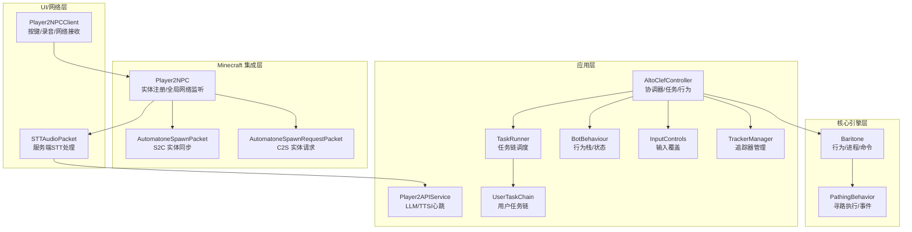
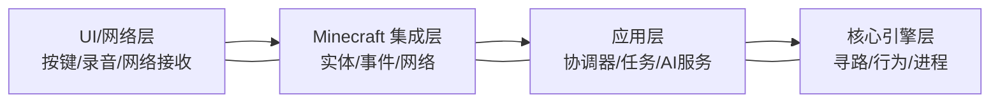
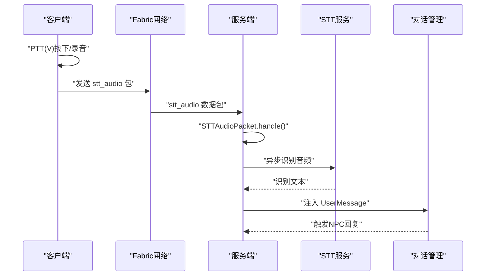
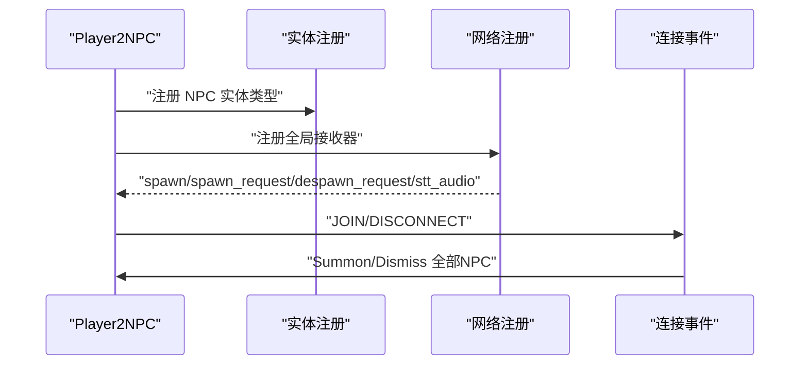
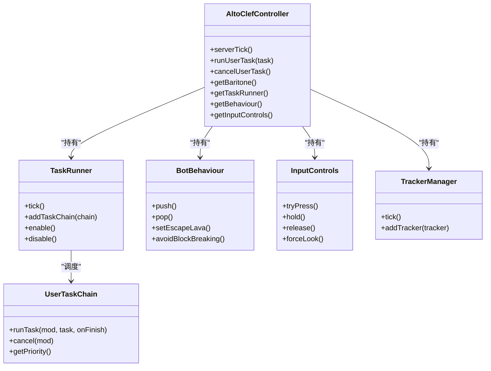
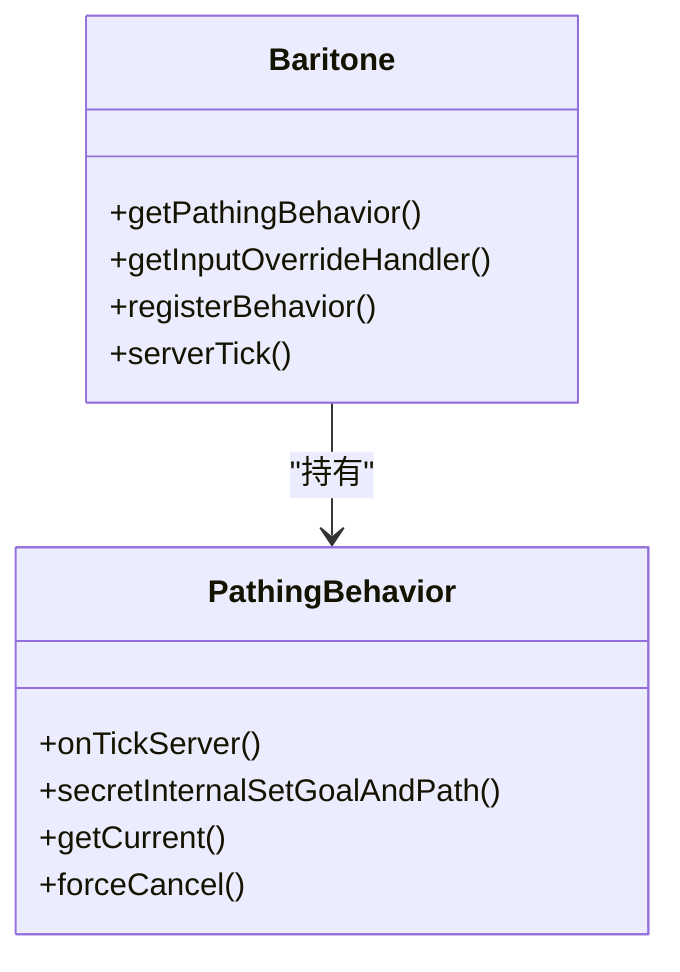
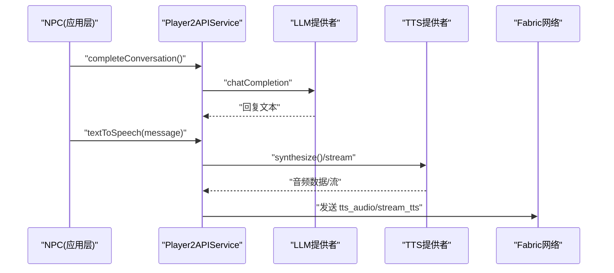
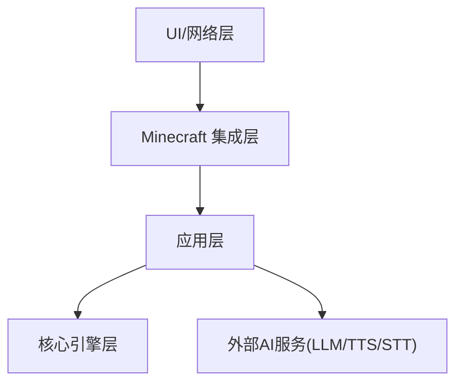

# 四层分层架构设计

<cite>
**本文引用的文件**
- [AltoClefController.java](file://src/main/java/adris/altoclef/AltoClefController.java)
- [Baritone.java](file://src/main/java/baritone/Baritone.java)
- [Player2NPC.java](file://src/main/java/com/goodbird/player2npc/Player2NPC.java)
- [Player2NPCClient.java](file://src/main/java/com/goodbird/player2npc/Player2NPCClient.java)
- [AutomatoneSpawnRequestPacket.java](file://src/main/java/com/goodbird/player2npc/network/AutomatoneSpawnRequestPacket.java)
- [AutomatonSpawnPacket.java](file://src/main/java/com/goodbird/player2npc/network/AutomatonSpawnPacket.java)
- [STTAudioPacket.java](file://src/main/java/com/goodbird/player2npc/network/STTAudioPacket.java)
- [Player2APIService.java](file://src/main/java/adris/altoclef/player2api/Player2APIService.java)
- [TaskRunner.java](file://src/main/java/adris/altoclef/tasksystem/TaskRunner.java)
- [InputControls.java](file://src/main/java/adris/altoclef/control/InputControls.java)
- [TrackerManager.java](file://src/main/java/adris/altoclef/trackers/TrackerManager.java)
- [BotBehaviour.java](file://src/main/java/adris/altoclef/BotBehaviour.java)
- [PathingBehavior.java](file://src/main/java/baritone/behavior/PathingBehavior.java)
- [UserTaskChain.java](file://src/main/java/adris/altoclef/chains/UserTaskChain.java)
- [README.md](file://README.md)
</cite>

## 目录
1. [引言](#引言)
2. [项目结构](#项目结构)
3. [核心组件](#核心组件)
4. [架构总览](#架构总览)
5. [详细组件分析](#详细组件分析)
6. [依赖分析](#依赖分析)
7. [性能考虑](#性能考虑)
8. [故障排除指南](#故障排除指南)
9. [结论](#结论)
10. [附录](#附录)

## 引言
本架构文档面向四层分层架构，围绕 UI/网络层、Minecraft 集成层、应用层、核心引擎层进行系统化梳理。重点阐明：
- 各层职责与边界
- 层间接口规范与数据流
- 关键协调器 AltoClefController 的作用机制
- 核心引擎层路径规划实现（Baritone）
- Fabric 网络层通信机制
- 错误处理策略与性能优化建议

## 项目结构
项目采用模块化分层组织：
- UI/网络层：负责图形界面、按键绑定、音频录制与网络收发
- Minecraft 集成层：实体注册、渲染、事件桥接
- 应用层：业务编排、任务调度、AI 服务集成
- 核心引擎层：寻路与行为控制（Baritone）

**图示来源**
- [Player2NPCClient.java:1-164](file://src/main/java/com/goodbird/player2npc/Player2NPCClient.java#L1-L164)
- [Player2NPC.java:1-67](file://src/main/java/com/goodbird/player2npc/Player2NPC.java#L1-L67)
- [AutomatoneSpawnRequestPacket.java:1-67](file://src/main/java/com/goodbird/player2npc/network/AutomatoneSpawnRequestPacket.java#L1-L67)
- [AutomatonSpawnPacket.java:1-120](file://src/main/java/com/goodbird/player2npc/network/AutomatonSpawnPacket.java#L1-L120)
- [STTAudioPacket.java:1-134](file://src/main/java/com/goodbird/player2npc/network/STTAudioPacket.java#L1-L134)
- [AltoClefController.java:1-456](file://src/main/java/adris/altoclef/AltoClefController.java#L1-L456)
- [Player2APIService.java:1-274](file://src/main/java/adris/altoclef/player2api/Player2APIService.java#L1-L274)
- [TaskRunner.java:1-98](file://src/main/java/adris/altoclef/tasksystem/TaskRunner.java#L1-L98)
- [UserTaskChain.java:1-236](file://src/main/java/adris/altoclef/chains/UserTaskChain.java#L1-L236)
- [BotBehaviour.java:1-343](file://src/main/java/adris/altoclef/BotBehaviour.java#L1-L343)
- [InputControls.java:1-54](file://src/main/java/adris/altoclef/control/InputControls.java#L1-L54)
- [TrackerManager.java:1-42](file://src/main/java/adris/altoclef/trackers/TrackerManager.java#L1-L42)
- [Baritone.java:1-187](file://src/main/java/baritone/Baritone.java#L1-L187)
- [PathingBehavior.java:1-526](file://src/main/java/baritone/behavior/PathingBehavior.java#L1-L526)

**章节来源**
- [README.md:494-562](file://README.md#L494-L562)

## 核心组件
- AltoClefController：应用层协调器，统一管理任务、行为、输入、追踪器、Baritone 设置与 AI 服务，负责每 tick 的调度与生存监控。
- Baritone：核心引擎层，封装路径、行为、进程、命令与输入覆盖，提供 PathingBehavior 执行寻路。
- Player2NPC/Client：Minecraft 集成层与 UI/网络层，负责实体注册、按键绑定、PTT 录音、网络包收发。
- Player2APIService：应用层 AI 服务集成，封装 LLM/TTS/STT/心跳等对外服务调用。
- TaskRunner/UserTaskChain：应用层任务调度与用户任务链，负责任务优先级、距离监控与空闲态切换。
- InputControls/TrackerManager/BotBehaviour：应用层输入覆盖、追踪器生命周期与行为状态栈。

**章节来源**
- [AltoClefController.java:53-456](file://src/main/java/adris/altoclef/AltoClefController.java#L53-L456)
- [Baritone.java:34-187](file://src/main/java/baritone/Baritone.java#L34-L187)
- [Player2NPC.java:25-67](file://src/main/java/com/goodbird/player2npc/Player2NPC.java#L25-L67)
- [Player2NPCClient.java:23-164](file://src/main/java/com/goodbird/player2npc/Player2NPCClient.java#L23-L164)
- [Player2APIService.java:35-274](file://src/main/java/adris/altoclef/player2api/Player2APIService.java#L35-L274)
- [TaskRunner.java:9-98](file://src/main/java/adris/altoclef/tasksystem/TaskRunner.java#L9-L98)
- [UserTaskChain.java:14-236](file://src/main/java/adris/altoclef/chains/UserTaskChain.java#L14-L236)
- [InputControls.java:11-54](file://src/main/java/adris/altoclef/control/InputControls.java#L11-L54)
- [TrackerManager.java:6-42](file://src/main/java/adris/altoclef/trackers/TrackerManager.java#L6-L42)
- [BotBehaviour.java:22-343](file://src/main/java/adris/altoclef/BotBehaviour.java#L22-L343)

## 架构总览
四层架构边界与交互：
- UI/网络层：负责按键与录音（PTT/VAD）、网络包收发（STT、实体同步），与应用层通过服务接口对接。
- Minecraft 集成层：实体注册、渲染、连接事件，承载网络注册与全局事件转发。
- 应用层：任务编排、行为控制、AI 服务集成，协调 Baritone 与外部服务。
- 核心引擎层：寻路与行为执行，提供路径计算、执行与事件派发。

[本图为概念示意，不直接映射具体文件，故不附“图示来源”]

## 详细组件分析

### UI/网络层（按键与 STT 流程）
- 客户端按键绑定：H 打开角色选择界面；V 为 PTT（Push-to-Talk），结合 GLFW 原生状态检测保证稳定。
- 录音与发送：录音达到最小长度后发送 stt_audio 包至服务端；服务端异步识别并注入对话系统。
- 实体同步：服务端广播 spawn 包，客户端创建 NPC 实体并同步其状态。

**图示来源**
- [Player2NPCClient.java:36-124](file://src/main/java/com/goodbird/player2npc/Player2NPCClient.java#L36-L124)
- [STTAudioPacket.java:39-121](file://src/main/java/com/goodbird/player2npc/network/STTAudioPacket.java#L39-L121)

**章节来源**
- [Player2NPCClient.java:23-164](file://src/main/java/com/goodbird/player2npc/Player2NPCClient.java#L23-L164)
- [STTAudioPacket.java:28-134](file://src/main/java/com/goodbird/player2npc/network/STTAudioPacket.java#L28-L134)

### Minecraft 集成层（实体与网络）
- 实体注册：注册 NPC 实体类型，设置尺寸、跟踪范围与更新频率。
- 全局网络：注册 spawn、spawn_request、despawn_request、stt_audio 等包处理器。
- 连接事件：玩家加入/断开时，自动召唤/解散所有 NPC。

**图示来源**
- [Player2NPC.java:48-65](file://src/main/java/com/goodbird/player2npc/Player2NPC.java#L48-L65)

**章节来源**
- [Player2NPC.java:25-67](file://src/main/java/com/goodbird/player2npc/Player2NPC.java#L25-L67)

### 应用层（协调器与任务）
- AltoClefController：统一持有 Baritone、任务运行器、行为栈、输入控制、追踪器与 AI 服务；每 tick 调度任务、追踪器与生存监控。
- TaskRunner：多任务链优先级调度，当前链切换时触发中断回调。
- UserTaskChain：用户任务链，具备距离监控与自动返回、进度语音反馈、空闲态切换。
- BotBehaviour：行为状态栈，支持压栈/弹栈、全局启发式与避让策略。
- InputControls：输入覆盖与强制按键，确保寻路与行为期间的输入一致性。
- TrackerManager：追踪器生命周期管理，游戏状态切换时重置与脏标记。

**图示来源**
- [AltoClefController.java:101-152](file://src/main/java/adris/altoclef/AltoClefController.java#L101-L152)
- [TaskRunner.java:17-98](file://src/main/java/adris/altoclef/tasksystem/TaskRunner.java#L17-L98)
- [UserTaskChain.java:37-236](file://src/main/java/adris/altoclef/chains/UserTaskChain.java#L37-L236)
- [BotBehaviour.java:224-343](file://src/main/java/adris/altoclef/BotBehaviour.java#L224-L343)
- [InputControls.java:16-54](file://src/main/java/adris/altoclef/control/InputControls.java#L16-L54)
- [TrackerManager.java:11-42](file://src/main/java/adris/altoclef/trackers/TrackerManager.java#L11-L42)

**章节来源**
- [AltoClefController.java:154-221](file://src/main/java/adris/altoclef/AltoClefController.java#L154-L221)
- [TaskRunner.java:22-98](file://src/main/java/adris/altoclef/tasksystem/TaskRunner.java#L22-L98)
- [UserTaskChain.java:66-236](file://src/main/java/adris/altoclef/chains/UserTaskChain.java#L66-L236)
- [BotBehaviour.java:187-223](file://src/main/java/adris/altoclef/BotBehaviour.java#L187-L223)
- [InputControls.java:20-54](file://src/main/java/adris/altoclef/control/InputControls.java#L20-L54)
- [TrackerManager.java:15-42](file://src/main/java/adris/altoclef/trackers/TrackerManager.java#L15-L42)

### 核心引擎层（路径规划与行为）
- Baritone：聚合路径、行为、进程、命令与输入覆盖，提供 PathingControlManager 与 PathingBehavior。
- PathingBehavior：负责路径计算、执行、事件派发与安全取消，支持多段路径拼接与前瞻规划。

**图示来源**
- [Baritone.java:34-187](file://src/main/java/baritone/Baritone.java#L34-L187)
- [PathingBehavior.java:29-526](file://src/main/java/baritone/behavior/PathingBehavior.java#L29-L526)

**章节来源**
- [Baritone.java:58-187](file://src/main/java/baritone/Baritone.java#L58-L187)
- [PathingBehavior.java:67-324](file://src/main/java/baritone/behavior/PathingBehavior.java#L67-L324)

### AI 集成层（LLM/TTS/STT/心跳）
- Player2APIService：封装 LLM 对话、TTS 合成、STT 启动/停止、心跳上报；支持本地与远程两种 TTS 模式。
- 网络包：服务端通过 Fabric 网络发送 TTS 音频包或远程流式 TTS 包到客户端。

**图示来源**
- [Player2APIService.java:48-231](file://src/main/java/adris/altoclef/player2api/Player2APIService.java#L48-L231)

**章节来源**
- [Player2APIService.java:35-274](file://src/main/java/adris/altoclef/player2api/Player2APIService.java#L35-L274)

## 依赖分析
- 层间耦合
  - UI/网络层依赖 Minecraft/Fabric 网络 API，与应用层通过服务接口解耦。
  - Minecraft 集成层依赖实体注册与网络注册，向上承接应用层。
  - 应用层依赖核心引擎层（Baritone）与外部 AI 服务，向下管理任务与行为。
  - 核心引擎层内部模块化良好，PathingBehavior 与 Baritone 通过接口解耦。
- 外部依赖
  - LLM/TTS/STT 服务通过 HTTP/WebSocket 调用，应用层统一抽象。
  - Fabric 网络包 ID 与消息格式在应用层集中管理，避免散落配置。

[本图为概念示意，不直接映射具体文件，故不附“图示来源”]

**章节来源**
- [Player2NPC.java:29-33](file://src/main/java/com/goodbird/player2npc/Player2NPC.java#L29-L33)
- [Player2APIService.java:23-32](file://src/main/java/adris/altoclef/player2api/Player2APIService.java#L23-L32)

## 性能考虑
- 寻路与任务调度
  - PathingBehavior 使用线程池执行路径计算，避免阻塞服务器 Tick。
  - TaskRunner 采用优先级选择当前链，减少无效切换成本。
- 网络与 I/O
  - STT 识别在后台线程执行，避免阻塞服务器线程；客户端 PTT 使用 VAD 自动断句，降低包数量。
  - TTS 本地合成与远程流式合成双通道，根据配置选择最优路径。
- 内存与状态
  - BotBehaviour 使用状态栈，避免频繁修改全局设置；InputControls 采用队列与集合管理按键状态，降低开销。
  - TrackerManager 在游戏状态切换时批量重置，减少无效追踪。

[本节为通用指导，不直接分析具体文件，故不附“章节来源”]

## 故障排除指南
- STT 识别失败
  - 检查音频长度是否小于最小阈值；确认 API Key 配置；查看服务端日志中的识别结果与错误信息。
- TTS 无声
  - 检查 TTS 配置启用状态与 API Key；确认本地模式下 DashScope CosyVoice 权限；远程模式检查网络包是否到达客户端。
- 寻路异常
  - 查看 PathingBehavior 事件队列与日志；确认目标位置与可达性；检查是否处于安全取消状态。
- 任务链冲突
  - 检查 UserTaskChain 优先级与距离监控逻辑；确认是否被其他链抢占；必要时调用 forceCancel 清理。

**章节来源**
- [STTAudioPacket.java:57-121](file://src/main/java/com/goodbird/player2npc/network/STTAudioPacket.java#L57-L121)
- [Player2APIService.java:120-231](file://src/main/java/adris/altoclef/player2api/Player2APIService.java#L120-L231)
- [PathingBehavior.java:52-74](file://src/main/java/baritone/behavior/PathingBehavior.java#L52-L74)
- [UserTaskChain.java:73-115](file://src/main/java/adris/altoclef/chains/UserTaskChain.java#L73-L115)

## 结论
该四层架构以应用层协调器为核心，将 UI/网络、Minecraft 集成、AI 服务与核心引擎清晰分离，既保证了模块内聚、层间低耦合，又通过统一的服务接口与网络协议实现了高效的数据流转与错误处理。AltoClefController 作为协调器，承担了任务调度、行为控制与生存监控的关键职责；Baritone 作为核心引擎层，提供了稳定的路径规划能力；Fabric 网络层则保障了跨端通信的可靠性与可扩展性。

[本节为总结性内容，不直接分析具体文件，故不附“章节来源”]

## 附录
- 关键网络包 ID 与用途
  - spawn_automatone：服务端向客户端同步 NPC 实体状态
  - request_spawn_automatone：客户端请求生成 NPC
  - request_despawn_automatone：客户端请求移除 NPC
  - stt_audio：客户端向服务端发送录音数据

**章节来源**
- [Player2NPC.java:29-33](file://src/main/java/com/goodbird/player2npc/Player2NPC.java#L29-L33)
- [AutomatonSpawnPacket.java:26-98](file://src/main/java/com/goodbird/player2npc/network/AutomatonSpawnPacket.java#L26-L98)
- [AutomatoneSpawnRequestPacket.java:24-66](file://src/main/java/com/goodbird/player2npc/network/AutomatoneSpawnRequestPacket.java#L24-L66)
- [STTAudioPacket.java:28-40](file://src/main/java/com/goodbird/player2npc/network/STTAudioPacket.java#L28-L40)