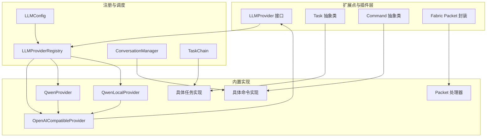
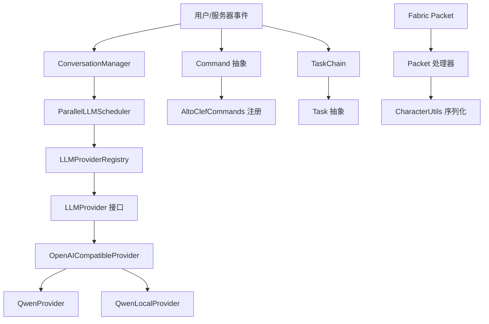
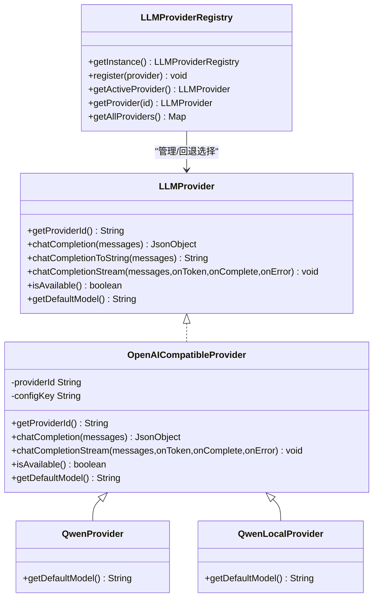
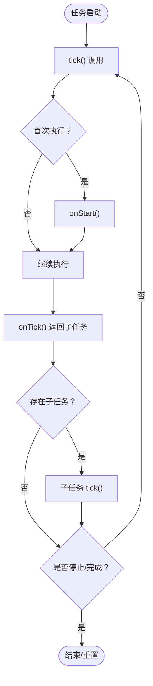
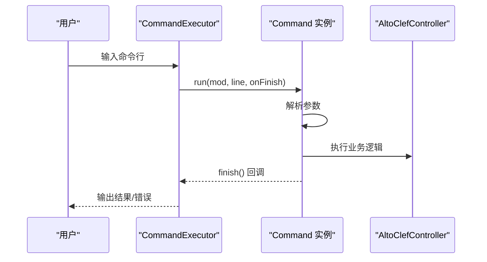
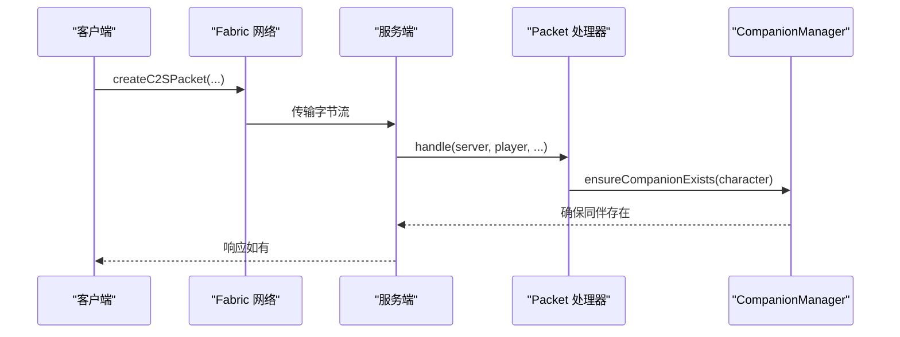
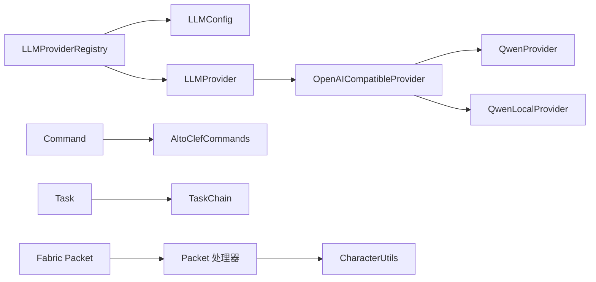

# 扩展点与插件机制

<cite>
**本文引用的文件**
- [LLMProvider.java](file://src/main/java/adris/altoclef/player2api/llm/LLMProvider.java)
- [LLMProviderRegistry.java](file://src/main/java/adris/altoclef/player2api/llm/LLMProviderRegistry.java)
- [OpenAICompatibleProvider.java](file://src/main/java/adris/altoclef/player2api/llm/impl/OpenAICompatibleProvider.java)
- [QwenProvider.java](file://src/main/java/adris/altoclef/player2api/llm/impl/QwenProvider.java)
- [QwenLocalProvider.java](file://src/main/java/adris/altoclef/player2api/llm/impl/QwenLocalProvider.java)
- [LLMConfig.java](file://src/main/java/adris/altoclef/player2api/llm/LLMConfig.java)
- [playerengine-llm-default.json](file://src/main/resources/playerengine-llm-default.json)
- [Task.java](file://src/main/java/adris/altoclef/tasksystem/Task.java)
- [TaskChain.java](file://src/main/java/adris/altoclef/tasksystem/TaskChain.java)
- [Command.java](file://src/main/java/adris/altoclef/commandsystem/Command.java)
- [AltoClefCommands.java](file://src/main/java/adris/altoclef/AltoClefCommands.java)
- [ConversationManager.java](file://src/main/java/adris/altoclef/player2api/manager/ConversationManager.java)
- [AutomatoneSpawnRequestPacket.java](file://src/main/java/com/goodbird/player2npc/network/AutomatoneSpawnRequestPacket.java)
- [CharacterUtils.java](file://src/main/java/adris/altoclef/player2api/utils/CharacterUtils.java)
</cite>

## 目录
1. [引言](#引言)
2. [项目结构](#项目结构)
3. [核心组件](#核心组件)
4. [架构总览](#架构总览)
5. [详细组件分析](#详细组件分析)
6. [依赖分析](#依赖分析)
7. [性能考量](#性能考量)
8. [故障排查指南](#故障排查指南)
9. [结论](#结论)
10. [附录](#附录)

## 引言
本文件面向希望在 AI NPC 项目中进行扩展与插件化开发的工程师，系统性阐述以下扩展点与机制：
- LLM Provider 插件接口与注册中心
- 自定义任务类型扩展点
- 聊天命令扩展点
- 网络通信扩展点
并围绕这些扩展点给出接口规范、生命周期管理、插件隔离策略、版本兼容性与安全注意事项，辅以开发指南、最佳实践与常见问题解决方案。

## 项目结构
从扩展性角度，项目的关键模块如下：
- LLM 子系统：统一的 LLMProvider 接口与注册中心，内置多种 Provider 实现（OpenAI 兼容、Qwen、本地 Ollama 等）
- 任务系统：抽象任务 Task 与任务链 TaskChain，支持任务树与优先级调度
- 命令系统：Command 抽象与命令注册入口，便于新增聊天命令
- 对话与消息：ConversationManager 统一处理用户消息与 AI 回复分发
- 网络通信：Fabric Packet 封装与处理流程，支持客户端-服务端消息传递
- 配置与资源：playerengine-llm-default.json 提供 LLM/TTS/STT 等配置模板

图表来源
- [LLMProvider.java:11-66](file://src/main/java/adris/altoclef/player2api/llm/LLMProvider.java#L11-L66)
- [LLMProviderRegistry.java:16-79](file://src/main/java/adris/altoclef/player2api/llm/LLMProviderRegistry.java#L16-L79)
- [OpenAICompatibleProvider.java:24-225](file://src/main/java/adris/altoclef/player2api/llm/impl/OpenAICompatibleProvider.java#L24-L225)
- [QwenProvider.java:11-21](file://src/main/java/adris/altoclef/player2api/llm/impl/QwenProvider.java#L11-L21)
- [QwenLocalProvider.java:12-22](file://src/main/java/adris/altoclef/player2api/llm/impl/QwenLocalProvider.java#L12-L22)
- [Task.java:8-180](file://src/main/java/adris/altoclef/tasksystem/Task.java#L8-L180)
- [TaskChain.java:7-50](file://src/main/java/adris/altoclef/tasksystem/TaskChain.java#L7-L50)
- [Command.java:6-60](file://src/main/java/adris/altoclef/commandsystem/Command.java#L6-L60)
- [AltoClefCommands.java:31-63](file://src/main/java/adris/altoclef/AltoClefCommands.java#L31-L63)
- [ConversationManager.java:27-200](file://src/main/java/adris/altoclef/player2api/manager/ConversationManager.java#L27-L200)
- [AutomatoneSpawnRequestPacket.java:24-66](file://src/main/java/com/goodbird/player2npc/network/AutomatoneSpawnRequestPacket.java#L24-L66)

章节来源
- [LLMProvider.java:11-66](file://src/main/java/adris/altoclef/player2api/llm/LLMProvider.java#L11-L66)
- [LLMProviderRegistry.java:16-79](file://src/main/java/adris/altoclef/player2api/llm/LLMProviderRegistry.java#L16-L79)
- [OpenAICompatibleProvider.java:24-225](file://src/main/java/adris/altoclef/player2api/llm/impl/OpenAICompatibleProvider.java#L24-L225)
- [QwenProvider.java:11-21](file://src/main/java/adris/altoclef/player2api/llm/impl/QwenProvider.java#L11-L21)
- [QwenLocalProvider.java:12-22](file://src/main/java/adris/altoclef/player2api/llm/impl/QwenLocalProvider.java#L12-L22)
- [Task.java:8-180](file://src/main/java/adris/altoclef/tasksystem/Task.java#L8-L180)
- [TaskChain.java:7-50](file://src/main/java/adris/altoclef/tasksystem/TaskChain.java#L7-L50)
- [Command.java:6-60](file://src/main/java/adris/altoclef/commandsystem/Command.java#L6-L60)
- [AltoClefCommands.java:31-63](file://src/main/java/adris/altoclef/AltoClefCommands.java#L31-L63)
- [ConversationManager.java:27-200](file://src/main/java/adris/altoclef/player2api/manager/ConversationManager.java#L27-L200)
- [AutomatoneSpawnRequestPacket.java:24-66](file://src/main/java/com/goodbird/player2npc/network/AutomatoneSpawnRequestPacket.java#L24-L66)

## 核心组件
- LLM Provider 插件接口与注册中心
  - LLMProvider 定义统一接口，包括唯一标识、聊天补全、流式输出、可用性检查与默认模型等能力
  - LLMProviderRegistry 提供单例注册中心，内置注册与回退选择逻辑
  - OpenAICompatibleProvider 作为通用 OpenAI 兼容实现，支持任意遵循 OpenAI /v1/chat/completions 的服务
  - QwenProvider 与 QwenLocalProvider 通过继承 OpenAICompatibleProvider 实现不同配置键与默认模型
- 任务系统扩展点
  - Task 抽象类定义生命周期钩子与中断/停止/重置等控制方法
  - TaskChain 提供任务链的调度与优先级管理
- 聊天命令扩展点
  - Command 抽象类定义命令解析、执行与完成回调
  - AltoClefCommands 作为命令注册入口，集中注册内置命令
- 网络通信扩展点
  - Fabric Packet 封装与处理器，支持客户端-服务端消息传递
  - CharacterUtils 提供角色数据在网络与 NBT 间的序列化/反序列化工具

章节来源
- [LLMProvider.java:11-66](file://src/main/java/adris/altoclef/player2api/llm/LLMProvider.java#L11-L66)
- [LLMProviderRegistry.java:16-79](file://src/main/java/adris/altoclef/player2api/llm/LLMProviderRegistry.java#L16-L79)
- [OpenAICompatibleProvider.java:24-225](file://src/main/java/adris/altoclef/player2api/llm/impl/OpenAICompatibleProvider.java#L24-L225)
- [QwenProvider.java:11-21](file://src/main/java/adris/altoclef/player2api/llm/impl/QwenProvider.java#L11-L21)
- [QwenLocalProvider.java:12-22](file://src/main/java/adris/altoclef/player2api/llm/impl/QwenLocalProvider.java#L12-L22)
- [Task.java:8-180](file://src/main/java/adris/altoclef/tasksystem/Task.java#L8-L180)
- [TaskChain.java:7-50](file://src/main/java/adris/altoclef/tasksystem/TaskChain.java#L7-L50)
- [Command.java:6-60](file://src/main/java/adris/altoclef/commandsystem/Command.java#L6-L60)
- [AltoClefCommands.java:31-63](file://src/main/java/adris/altoclef/AltoClefCommands.java#L31-L63)
- [AutomatoneSpawnRequestPacket.java:24-66](file://src/main/java/com/goodbird/player2npc/network/AutomatoneSpawnRequestPacket.java#L24-L66)
- [CharacterUtils.java:15-141](file://src/main/java/adris/altoclef/player2api/utils/CharacterUtils.java#L15-L141)

## 架构总览
下图展示了扩展点之间的交互关系与数据流：

图表来源
- [ConversationManager.java:27-200](file://src/main/java/adris/altoclef/player2api/manager/ConversationManager.java#L27-L200)
- [LLMProviderRegistry.java:16-79](file://src/main/java/adris/altoclef/player2api/llm/LLMProviderRegistry.java#L16-L79)
- [LLMProvider.java:11-66](file://src/main/java/adris/altoclef/player2api/llm/LLMProvider.java#L11-L66)
- [OpenAICompatibleProvider.java:24-225](file://src/main/java/adris/altoclef/player2api/llm/impl/OpenAICompatibleProvider.java#L24-L225)
- [QwenProvider.java:11-21](file://src/main/java/adris/altoclef/player2api/llm/impl/QwenProvider.java#L11-L21)
- [QwenLocalProvider.java:12-22](file://src/main/java/adris/altoclef/player2api/llm/impl/QwenLocalProvider.java#L12-L22)
- [Command.java:6-60](file://src/main/java/adris/altoclef/commandsystem/Command.java#L6-L60)
- [AltoClefCommands.java:31-63](file://src/main/java/adris/altoclef/AltoClefCommands.java#L31-L63)
- [Task.java:8-180](file://src/main/java/adris/altoclef/tasksystem/Task.java#L8-L180)
- [TaskChain.java:7-50](file://src/main/java/adris/altoclef/tasksystem/TaskChain.java#L7-L50)
- [AutomatoneSpawnRequestPacket.java:24-66](file://src/main/java/com/goodbird/player2npc/network/AutomatoneSpawnRequestPacket.java#L24-L66)
- [CharacterUtils.java:15-141](file://src/main/java/adris/altoclef/player2api/utils/CharacterUtils.java#L15-L141)

## 详细组件分析

### LLM Provider 插件机制
- 接口规范
  - getProviderId：返回唯一标识（如 qwen、openai、qwen_local）
  - chatCompletion：发送聊天补全请求并返回原始 JSON
  - chatCompletionToString：便捷提取助手回复文本
  - chatCompletionStream：流式输出回调 onToken/onComplete/onError
  - isAvailable：判断配置可用性
  - getDefaultModel：返回默认模型名
- 注册与回退
  - LLMProviderRegistry 单例持有注册表，首次访问时自动注册内置 Provider
  - getActiveProvider：优先使用配置的 Provider，不可用时回退到首个可用 Provider
- 实现示例
  - OpenAICompatibleProvider：统一处理 OpenAI 兼容 API 的连接、鉴权、代理、请求体构建与响应解析
  - QwenProvider：继承 OpenAICompatibleProvider，覆盖 providerId 与默认模型
  - QwenLocalProvider：本地 Ollama/类似服务，覆盖默认模型与 API 地址
- 生命周期
  - 注册阶段：由 LLMProviderRegistry 在初始化时完成
  - 使用阶段：通过 LLMConfig 获取配置，结合 isAvailable 进行可用性校验
  - 错误处理：HTTP 错误码、无效响应格式、超时等均抛出异常或回调错误
- 版本兼容性
  - 通过统一的 OpenAI 兼容接口适配不同服务端点，避免直接耦合特定 SDK
  - 默认模型与参数（maxTokens、temperature）可通过配置文件调整
- 安全考虑
  - 配置项包含 apiKey、apiUrl、代理等敏感信息，应避免提交至公开仓库
  - 默认模板提供注释提示，强调密钥保密与网络访问限制

图表来源
- [LLMProvider.java:11-66](file://src/main/java/adris/altoclef/player2api/llm/LLMProvider.java#L11-L66)
- [OpenAICompatibleProvider.java:24-225](file://src/main/java/adris/altoclef/player2api/llm/impl/OpenAICompatibleProvider.java#L24-L225)
- [QwenProvider.java:11-21](file://src/main/java/adris/altoclef/player2api/llm/impl/QwenProvider.java#L11-L21)
- [QwenLocalProvider.java:12-22](file://src/main/java/adris/altoclef/player2api/llm/impl/QwenLocalProvider.java#L12-L22)
- [LLMProviderRegistry.java:16-79](file://src/main/java/adris/altoclef/player2api/llm/LLMProviderRegistry.java#L16-L79)

章节来源
- [LLMProvider.java:11-66](file://src/main/java/adris/altoclef/player2api/llm/LLMProvider.java#L11-L66)
- [LLMProviderRegistry.java:16-79](file://src/main/java/adris/altoclef/player2api/llm/LLMProviderRegistry.java#L16-L79)
- [OpenAICompatibleProvider.java:24-225](file://src/main/java/adris/altoclef/player2api/llm/impl/OpenAICompatibleProvider.java#L24-L225)
- [QwenProvider.java:11-21](file://src/main/java/adris/altoclef/player2api/llm/impl/QwenProvider.java#L11-L21)
- [QwenLocalProvider.java:12-22](file://src/main/java/adris/altoclef/player2api/llm/impl/QwenLocalProvider.java#L12-L22)

### 自定义任务类型扩展
- 扩展点
  - 继承 Task 并实现 onStart/onTick/onStop/isEqual/toDebugString 等抽象方法
  - 通过 TaskChain 管理任务优先级与调度
- 生命周期
  - tick：进入/更新/子任务切换/调试状态输出
  - stop/interrupt/reset：停止、打断与重置
  - isFinished/isActive/stopped：状态查询
- 最佳实践
  - 明确任务边界与可中断条件，合理使用 canBeInterrupted 与 ITaskCanForce
  - 在 onTick 中返回子任务以形成任务树，避免一次性长阻塞
  - 使用 setDebugState 输出调试信息，便于排障

图表来源
- [Task.java:17-180](file://src/main/java/adris/altoclef/tasksystem/Task.java#L17-L180)
- [TaskChain.java:16-50](file://src/main/java/adris/altoclef/tasksystem/TaskChain.java#L16-L50)

章节来源
- [Task.java:8-180](file://src/main/java/adris/altoclef/tasksystem/Task.java#L8-L180)
- [TaskChain.java:7-50](file://src/main/java/adris/altoclef/tasksystem/TaskChain.java#L7-L50)

### 聊天命令扩展
- 扩展点
  - 继承 Command，实现 call 方法完成参数解析与业务执行
  - 通过 AltoClefCommands.init 集中注册新命令
- 参数解析
  - ArgParser 负责解析命令行参数，支持帮助表示与错误输出
- 生命周期
  - run：装载参数、调用 call、完成后回调 onFinish
  - log/logError：统一日志输出
- 最佳实践
  - 命令名称与描述清晰，参数顺序与类型明确
  - 在 call 内部进行权限与前置条件校验，失败时抛出 CommandException
  - 使用 finish 回调通知上层执行完成

图表来源
- [Command.java:19-60](file://src/main/java/adris/altoclef/commandsystem/Command.java#L19-L60)
- [AltoClefCommands.java:32-63](file://src/main/java/adris/altoclef/AltoClefCommands.java#L32-L63)

章节来源
- [Command.java:6-60](file://src/main/java/adris/altoclef/commandsystem/Command.java#L6-L60)
- [AltoClefCommands.java:31-63](file://src/main/java/adris/altoclef/AltoClefCommands.java#L31-L63)

### 网络通信扩展
- 扩展点
  - Fabric Packet：定义 PacketType、读写序列化与处理器 handle
  - CharacterUtils：提供角色数据在网络缓冲区与对象之间的序列化/反序列化
- 数据流
  - 客户端构造包体 -> 发送 C2S -> 服务端 handle -> 业务处理（如确保同伴存在）

图表来源
- [AutomatoneSpawnRequestPacket.java:24-66](file://src/main/java/com/goodbird/player2npc/network/AutomatoneSpawnRequestPacket.java#L24-L66)
- [CharacterUtils.java:83-110](file://src/main/java/adris/altoclef/player2api/utils/CharacterUtils.java#L83-L110)

章节来源
- [AutomatoneSpawnRequestPacket.java:24-66](file://src/main/java/com/goodbird/player2npc/network/AutomatoneSpawnRequestPacket.java#L24-L66)
- [CharacterUtils.java:15-141](file://src/main/java/adris/altoclef/player2api/utils/CharacterUtils.java#L15-L141)

## 依赖分析
- 组件内聚与耦合
  - LLMProviderRegistry 与 LLMConfig 之间存在强耦合（配置驱动可用性与回退），但通过接口隔离了具体实现
  - OpenAICompatibleProvider 作为通用实现被多个具体 Provider 复用，体现良好复用性
  - Command 与 CommandExecutor 通过注册入口集中管理，便于扩展
  - Task 与 TaskChain 形成清晰的层次结构，职责分离明确
- 外部依赖
  - Fabric API 用于网络通信
  - Gson 用于 JSON 序列化
  - Log4j 用于日志记录
- 循环依赖
  - 当前结构未发现循环依赖；若新增跨模块引用，需谨慎评估

图表来源
- [LLMProviderRegistry.java:16-79](file://src/main/java/adris/altoclef/player2api/llm/LLMProviderRegistry.java#L16-L79)
- [LLMConfig.java](file://src/main/java/adris/altoclef/player2api/llm/LLMConfig.java)
- [LLMProvider.java:11-66](file://src/main/java/adris/altoclef/player2api/llm/LLMProvider.java#L11-L66)
- [OpenAICompatibleProvider.java:24-225](file://src/main/java/adris/altoclef/player2api/llm/impl/OpenAICompatibleProvider.java#L24-L225)
- [QwenProvider.java:11-21](file://src/main/java/adris/altoclef/player2api/llm/impl/QwenProvider.java#L11-L21)
- [QwenLocalProvider.java:12-22](file://src/main/java/adris/altoclef/player2api/llm/impl/QwenLocalProvider.java#L12-L22)
- [Command.java:6-60](file://src/main/java/adris/altoclef/commandsystem/Command.java#L6-L60)
- [AltoClefCommands.java:31-63](file://src/main/java/adris/altoclef/AltoClefCommands.java#L31-L63)
- [Task.java:8-180](file://src/main/java/adris/altoclef/tasksystem/Task.java#L8-L180)
- [TaskChain.java:7-50](file://src/main/java/adris/altoclef/tasksystem/TaskChain.java#L7-L50)
- [AutomatoneSpawnRequestPacket.java:24-66](file://src/main/java/com/goodbird/player2npc/network/AutomatoneSpawnRequestPacket.java#L24-L66)
- [CharacterUtils.java:15-141](file://src/main/java/adris/altoclef/player2api/utils/CharacterUtils.java#L15-L141)

## 性能考量
- LLM 调用
  - 流式输出：优先使用 chatCompletionStream 以提升首 token 延迟体验
  - 请求体参数：maxTokens、temperature 等应在配置中合理设置，避免过大导致超时或成本过高
  - 代理与网络：国内访问海外服务建议开启代理，减少网络抖动对响应时间的影响
- 任务调度
  - 任务链优先级与活跃度控制：通过 TaskChain.getPriority 与 isActive 精准调度
  - 子任务粒度：将长任务拆分为细分子任务，避免长时间阻塞主线程
- 命令执行
  - 参数解析与前置校验：尽早失败，减少无效计算
  - 日志级别：生产环境适当降低日志量，避免 I/O 成为瓶颈

## 故障排查指南
- LLM Provider 不可用
  - 检查配置文件中对应 provider 的 enabled、apiKey、apiUrl 是否正确
  - 若配置 provider 不可用，确认回退逻辑是否成功选择其他可用 provider
- 流式输出异常
  - 确认服务端是否支持 SSE 格式；若不支持，将回落到非流式输出
  - 观察 onToken/onComplete/onError 回调是否触发，定位网络或解析问题
- 任务卡死或无法中断
  - 检查子任务是否满足 canBeInterrupted 条件
  - 确保 onStop 中清理资源，避免悬挂状态
- 命令执行失败
  - 捕获 CommandException 并输出错误信息
  - 使用 logError 输出详细上下文，便于定位参数或权限问题
- 网络通信
  - 确认 PacketType.id 与客户端/服务端一致
  - 检查 CharacterUtils 的序列化字段是否匹配

章节来源
- [LLMProviderRegistry.java:49-70](file://src/main/java/adris/altoclef/player2api/llm/LLMProviderRegistry.java#L49-L70)
- [OpenAICompatibleProvider.java:144-209](file://src/main/java/adris/altoclef/player2api/llm/impl/OpenAICompatibleProvider.java#L144-L209)
- [Task.java:58-96](file://src/main/java/adris/altoclef/tasksystem/Task.java#L58-L96)
- [Command.java:47-51](file://src/main/java/adris/altoclef/commandsystem/Command.java#L47-L51)
- [AutomatoneSpawnRequestPacket.java:57-66](file://src/main/java/com/goodbird/player2npc/network/AutomatoneSpawnRequestPacket.java#L57-L66)
- [CharacterUtils.java:83-110](file://src/main/java/adris/altoclef/player2api/utils/CharacterUtils.java#L83-L110)

## 结论
本项目通过统一接口与注册中心实现了 LLM Provider 的可插拔扩展；通过抽象任务与命令体系提供了任务与命令的扩展点；通过 Fabric Packet 与工具类实现了网络通信扩展。配合完善的配置与日志体系，开发者可以安全、稳定地扩展新功能。建议在扩展时遵循接口契约、最小化耦合、做好错误处理与性能优化。

## 附录
- 开发指南与最佳实践
  - LLM Provider
    - 新增 Provider 时，尽量复用 OpenAICompatibleProvider 的通用逻辑，仅覆盖必要差异
    - 在 playerengine-llm-default.json 中添加配置项，并提供合理的默认值
    - 严格校验 isAvailable，避免空密钥或错误地址导致的异常
  - 任务扩展
    - 明确任务职责边界，避免在 onTick 中做重计算
    - 合理使用子任务与优先级，保证调度公平性
  - 命令扩展
    - 命令命名与参数设计保持一致性，提供清晰的帮助信息
    - 在 call 中进行充分校验，失败即抛出异常
  - 网络扩展
    - Packet 的 id 必须全局唯一且保持客户端/服务端一致
    - 序列化字段与版本升级需向后兼容
- 常见问题
  - Provider 无法加载：检查配置 enabled 与 apiKey，确认网络可达
  - 流式输出无回调：确认服务端支持 SSE，或接受非流式回退
  - 任务不中断：检查子任务是否实现 ITaskCanForce 或满足中断条件
  - 命令不生效：确认已通过 AltoClefCommands 注册，且参数解析无误
  - 网络包解析失败：核对字段数量与顺序，确保 CharacterUtils 读写一致