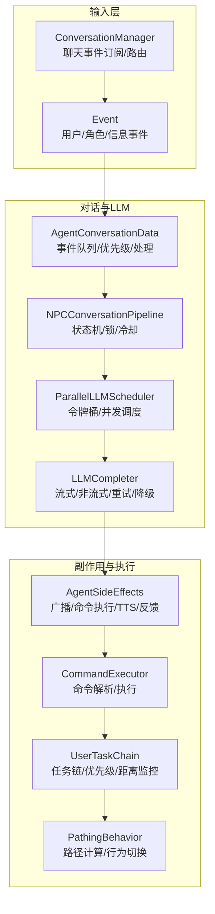
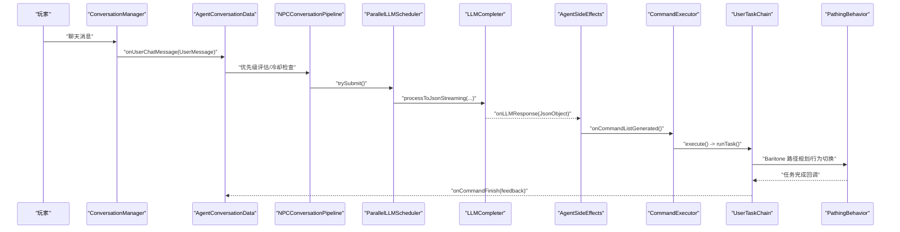
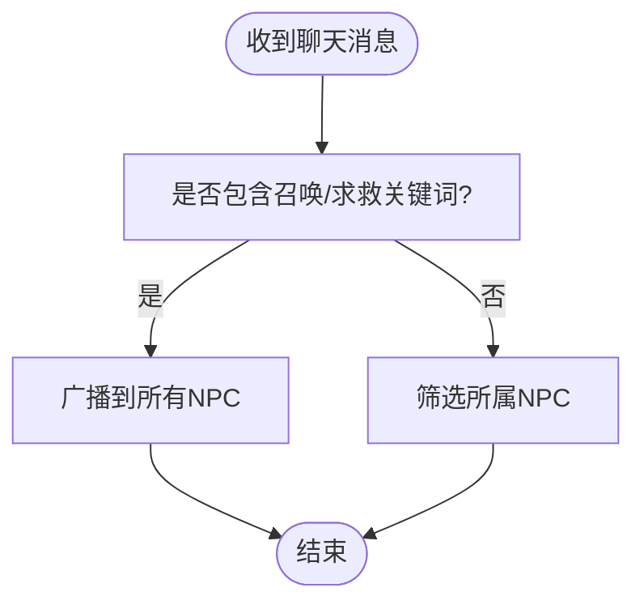
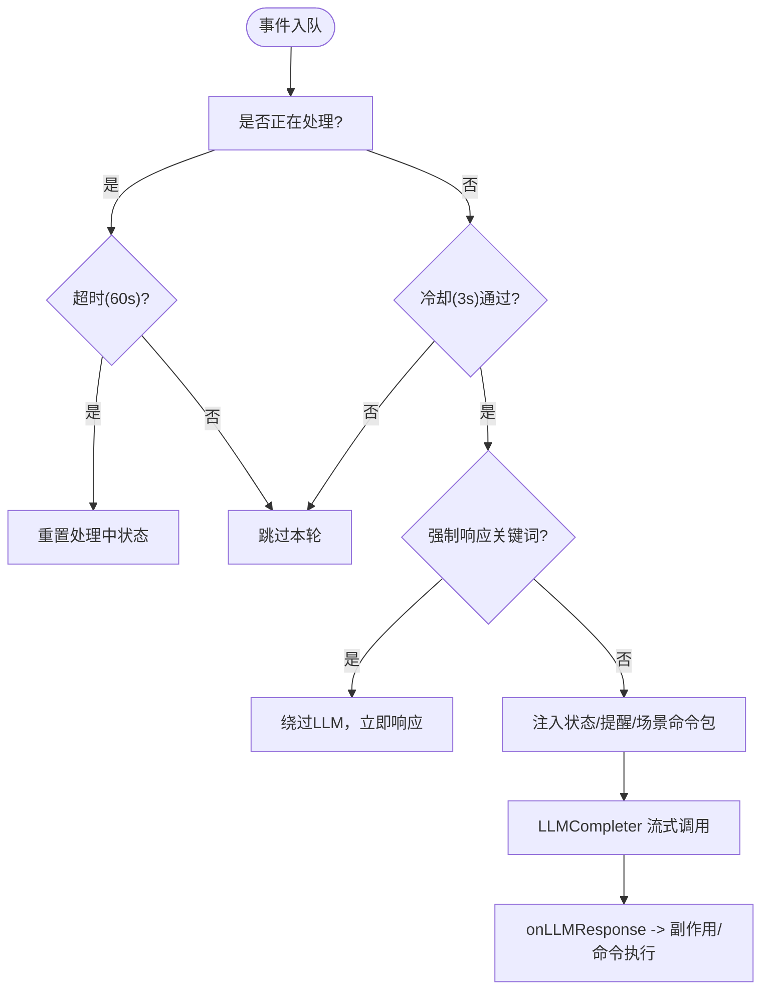
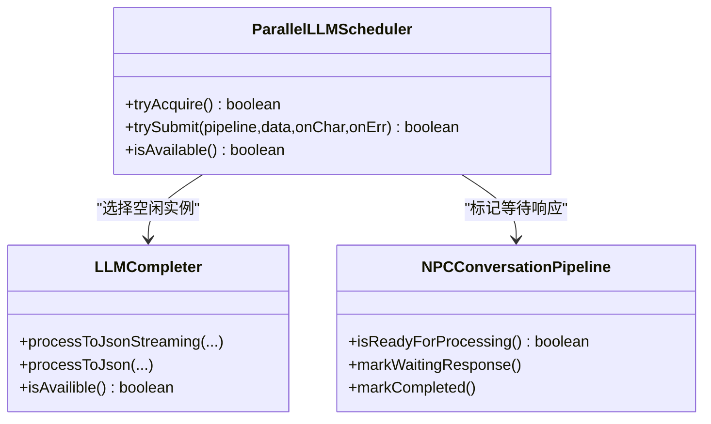
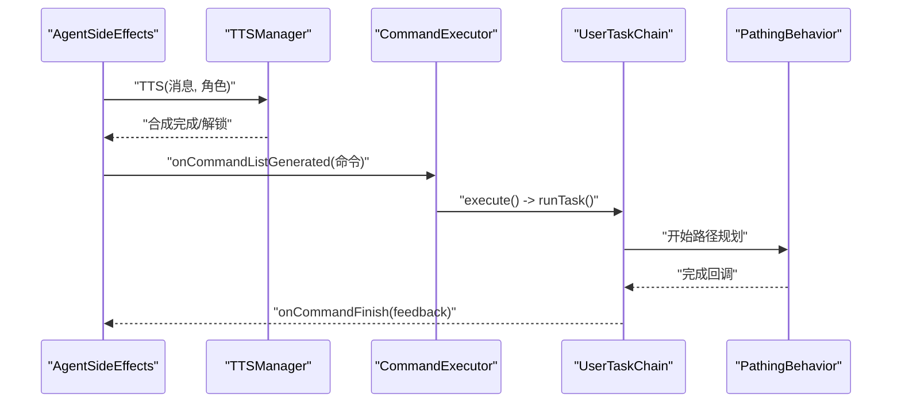
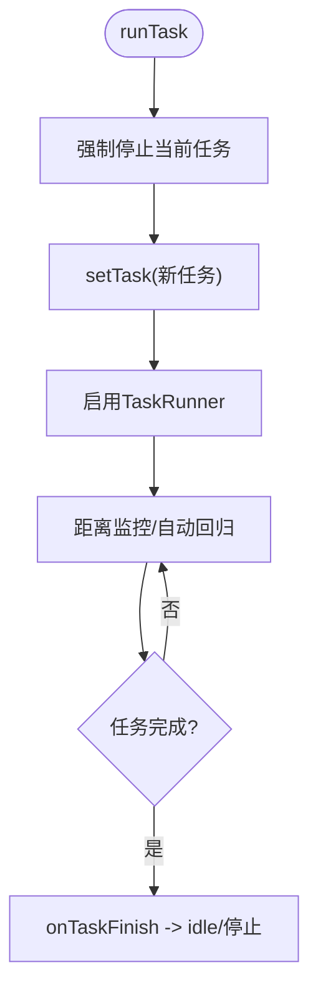

# 数据流与控制流

<cite>
**本文引用的文件**
- [README.md](file://README.md)
- [AI_NPC项目整体架构概览.md](file://docs/AI_NPC项目整体架构概览.md)
- [AI_NPC游戏指令系统重构.md](file://docs/AI_NPC游戏指令系统重构.md)
- [AgentConversationData.java](file://src/main/java/adris/altoclef/player2api/AgentConversationData.java)
- [LLMCompleter.java](file://src/main/java/adris/altoclef/player2api/LLMCompleter.java)
- [ConversationManager.java](file://src/main/java/adris/altoclef/player2api/manager/ConversationManager.java)
- [NPCConversationPipeline.java](file://src/main/java/adris/altoclef/player2api/NPCConversationPipeline.java)
- [AgentSideEffects.java](file://src/main/java/adris/altoclef/player2api/AgentSideEffects.java)
- [Event.java](file://src/main/java/adris/altoclef/player2api/Event.java)
- [UserTaskChain.java](file://src/main/java/adris/altoclef/chains/UserTaskChain.java)
- [CommandExecutor.java](file://src/main/java/adris/altoclef/commandsystem/CommandExecutor.java)
- [ParallelLLMScheduler.java](file://src/main/java/adris/altoclef/player2api/ParallelLLMScheduler.java)
- [CommandContextSelector.java](file://src/main/java/adris/altoclef/player2api/context/CommandContextSelector.java)
- [WorldStatus.java](file://src/main/java/adris/altoclef/player2api/status/WorldStatus.java)
- [TTSManager.java](file://src/main/java/adris/altoclef/player2api/manager/TTSManager.java)
- [PathingBehavior.java](file://src/main/java/baritone/behavior/PathingBehavior.java)
</cite>

## 目录
1. [引言](#引言)
2. [项目结构](#项目结构)
3. [核心组件](#核心组件)
4. [架构总览](#架构总览)
5. [详细组件分析](#详细组件分析)
6. [依赖分析](#依赖分析)
7. [性能考量](#性能考量)
8. [故障排查指南](#故障排查指南)
9. [结论](#结论)
10. [附录](#附录)

## 引言
本文件围绕“数据流与控制流”对 PlayerEngine（AI NPC）系统进行深入剖析，覆盖从用户输入到 NPC 执行的完整链路：聊天命令解析、LLM 请求处理、任务调度执行、路径规划计算等。文档重点说明：
- 数据在各组件间的传递格式与边界
- 控制流的触发机制、异步处理模式与状态管理
- 缓存策略与同步机制
- 错误传播路径、回滚与恢复策略
- 性能监控与调试建议

## 项目结构
该项目采用模块化分层组织，核心围绕“玩家输入—对话管理—LLM—副作用—命令执行—任务链—路径规划”的闭环展开。关键模块包括：
- 玩家输入与事件：聊天事件订阅、事件封装与优先级
- 对话管理：消息路由、NPC 管道状态机、并发调度
- LLM 侧：Completer、流式/非流式调用、重试与降级
- 副作用：广播聊天、TTS、命令执行、反馈入队
- 任务链：用户任务链、优先级抢占、距离监控与自动回归
- 路径规划：Baritone 行为驱动

图表来源
- [ConversationManager.java:59-189](file://src/main/java/adris/altoclef/player2api/manager/ConversationManager.java#L59-L189)
- [AgentConversationData.java:112-297](file://src/main/java/adris/altoclef/player2api/AgentConversationData.java#L112-L297)
- [NPCConversationPipeline.java:137-186](file://src/main/java/adris/altoclef/player2api/NPCConversationPipeline.java#L137-L186)
- [ParallelLLMScheduler.java:104-132](file://src/main/java/adris/altoclef/player2api/ParallelLLMScheduler.java#L104-L132)
- [LLMCompleter.java:193-303](file://src/main/java/adris/altoclef/player2api/LLMCompleter.java#L193-L303)
- [AgentSideEffects.java:40-144](file://src/main/java/adris/altoclef/player2api/AgentSideEffects.java#L40-L144)
- [CommandExecutor.java:58-84](file://src/main/java/adris/altoclef/commandsystem/CommandExecutor.java#L58-L84)
- [UserTaskChain.java:144-214](file://src/main/java/adris/altoclef/chains/UserTaskChain.java#L144-L214)
- [PathingBehavior.java:116-140](file://src/main/java/baritone/behavior/PathingBehavior.java#L116-L140)

章节来源
- [README.md:334-410](file://README.md#L334-L410)
- [AI_NPC项目整体架构概览.md:701-773](file://docs/AI_NPC项目整体架构概览.md#L701-L773)

## 核心组件
- 事件与优先级：统一的事件接口与优先级判定，支持用户紧急/高优/普通消息分流。
- 对话数据：维护事件队列、最小响应间隔、强制救援/问候绕过、情绪提醒注入。
- NPC 管道：将全局锁拆分为每 NPC 独立锁，避免相互阻塞；状态机驱动冷却与等待响应。
- 并行调度：令牌桶限流 + 空闲 LLMCompleter 选择，保障吞吐与稳定性。
- LLM 完成器：流式/非流式两种模式，首 token 提示、重试与降级响应。
- 副作用：广播聊天、TTS 合成、命令执行、任务完成反馈入队。
- 命令执行：命令解析、前缀规范化、递归执行、错误/取消回调。
- 用户任务链：任务优先级、距离监控、自动回归、进度语音播报。
- 路径行为：路径计算与行为切换，支持抢占与队列衔接。

章节来源
- [Event.java:17-63](file://src/main/java/adris/altoclef/player2api/Event.java#L17-L63)
- [AgentConversationData.java:88-109](file://src/main/java/adris/altoclef/player2api/AgentConversationData.java#L88-L109)
- [NPCConversationPipeline.java:137-186](file://src/main/java/adris/altoclef/player2api/NPCConversationPipeline.java#L137-L186)
- [ParallelLLMScheduler.java:104-132](file://src/main/java/adris/altoclef/player2api/ParallelLLMScheduler.java#L104-L132)
- [LLMCompleter.java:193-303](file://src/main/java/adris/altoclef/player2api/LLMCompleter.java#L193-L303)
- [AgentSideEffects.java:40-144](file://src/main/java/adris/altoclef/player2api/AgentSideEffects.java#L40-L144)
- [CommandExecutor.java:58-84](file://src/main/java/adris/altoclef/commandsystem/CommandExecutor.java#L58-L84)
- [UserTaskChain.java:144-214](file://src/main/java/adris/altoclef/chains/UserTaskChain.java#L144-L214)
- [PathingBehavior.java:116-140](file://src/main/java/baritone/behavior/PathingBehavior.java#L116-L140)

## 架构总览
下图展示了从用户输入到 NPC 执行的完整数据流与时序：

图表来源
- [ConversationManager.java:115-189](file://src/main/java/adris/altoclef/player2api/manager/ConversationManager.java#L115-L189)
- [AgentConversationData.java:112-297](file://src/main/java/adris/altoclef/player2api/AgentConversationData.java#L112-L297)
- [NPCConversationPipeline.java:137-186](file://src/main/java/adris/altoclef/player2api/NPCConversationPipeline.java#L137-L186)
- [ParallelLLMScheduler.java:104-132](file://src/main/java/adris/altoclef/player2api/ParallelLLMScheduler.java#L104-L132)
- [LLMCompleter.java:193-303](file://src/main/java/adris/altoclef/player2api/LLMCompleter.java#L193-L303)
- [AgentSideEffects.java:40-144](file://src/main/java/adris/altoclef/player2api/AgentSideEffects.java#L40-L144)
- [CommandExecutor.java:58-84](file://src/main/java/adris/altoclef/commandsystem/CommandExecutor.java#L58-L84)
- [UserTaskChain.java:144-214](file://src/main/java/adris/altoclef/chains/UserTaskChain.java#L144-L214)
- [PathingBehavior.java:116-140](file://src/main/java/baritone/behavior/PathingBehavior.java#L116-L140)

## 详细组件分析

### 组件A：聊天输入与事件路由
- 事件类型：用户消息、角色消息、信息消息；用户消息支持紧急/高优/普通优先级。
- 路由策略：召唤/求救关键词广播至所有 NPC；否则仅投递给所属 NPC。
- 距离过滤：基于最大距离阈值筛选可接收消息的 NPC。

图表来源
- [ConversationManager.java:115-130](file://src/main/java/adris/altoclef/player2api/manager/ConversationManager.java#L115-L130)
- [Event.java:17-63](file://src/main/java/adris/altoclef/player2api/Event.java#L17-L63)

章节来源
- [ConversationManager.java:59-130](file://src/main/java/adris/altoclef/player2api/manager/ConversationManager.java#L59-L130)
- [Event.java:17-63](file://src/main/java/adris/altoclef/player2api/Event.java#L17-L63)

### 组件B：对话数据与状态管理
- 事件队列：并发队列，最大长度限制，去重与溢出淘汰。
- 优先级：基于上次处理时间与事件紧急程度综合评分。
- 强制响应：救援/攻击/召唤关键词触发绕过 LLM 的即时响应。
- 情绪提醒：从灵魂档案注入情绪提醒，影响 LLM 输出。
- 最小响应间隔：3 秒，避免刷屏与资源争用。
- 处理超时：60 秒，超时自动重置处理中状态。

图表来源
- [AgentConversationData.java:88-109](file://src/main/java/adris/altoclef/player2api/AgentConversationData.java#L88-L109)
- [AgentConversationData.java:112-297](file://src/main/java/adris/altoclef/player2api/AgentConversationData.java#L112-L297)
- [CommandContextSelector.java:110-127](file://src/main/java/adris/altoclef/player2api/context/CommandContextSelector.java#L110-L127)
- [WorldStatus.java:6-18](file://src/main/java/adris/altoclef/player2api/status/WorldStatus.java#L6-L18)

章节来源
- [AgentConversationData.java:88-297](file://src/main/java/adris/altoclef/player2api/AgentConversationData.java#L88-L297)
- [CommandContextSelector.java:78-127](file://src/main/java/adris/altoclef/player2api/context/CommandContextSelector.java#L78-L127)
- [WorldStatus.java:6-18](file://src/main/java/adris/altoclef/player2api/status/WorldStatus.java#L6-L18)

### 组件C：LLM 调度与完成器
- 并行调度：令牌桶限流 + 遍历空闲 LLMCompleter，命中后标记等待响应。
- 完成器：支持流式与非流式；首 token 回调用于早期提示；重试与降级响应。
- 锁管理：全局锁与每 NPC 独立锁结合，避免串扰。

图表来源
- [ParallelLLMScheduler.java:104-132](file://src/main/java/adris/altoclef/player2api/ParallelLLMScheduler.java#L104-L132)
- [LLMCompleter.java:193-303](file://src/main/java/adris/altoclef/player2api/LLMCompleter.java#L193-L303)
- [NPCConversationPipeline.java:137-186](file://src/main/java/adris/altoclef/player2api/NPCConversationPipeline.java#L137-L186)

章节来源
- [ParallelLLMScheduler.java:46-151](file://src/main/java/adris/altoclef/player2api/ParallelLLMScheduler.java#L46-L151)
- [LLMCompleter.java:27-97](file://src/main/java/adris/altoclef/player2api/LLMCompleter.java#L27-L97)
- [LLMCompleter.java:193-303](file://src/main/java/adris/altoclef/player2api/LLMCompleter.java#L193-L303)
- [NPCConversationPipeline.java:137-186](file://src/main/java/adris/altoclef/player2api/NPCConversationPipeline.java#L137-L186)

### 组件D：副作用与命令执行
- 广播聊天：向所有在线玩家广播 NPC 聊天内容。
- TTS 合成：句子级流水线、序列号去重、全局冷却、估计结束时间解锁。
- 命令执行：命令前缀规范化、分号分隔多命令、递归执行、错误/取消回调。
- 任务完成反馈：去重冷却、救援两阶段、自动喂食等增强行为。

图表来源
- [AgentSideEffects.java:40-144](file://src/main/java/adris/altoclef/player2api/AgentSideEffects.java#L40-L144)
- [TTSManager.java:94-153](file://src/main/java/adris/altoclef/player2api/manager/TTSManager.java#L94-L153)
- [CommandExecutor.java:58-84](file://src/main/java/adris/altoclef/commandsystem/CommandExecutor.java#L58-L84)
- [UserTaskChain.java:144-214](file://src/main/java/adris/altoclef/chains/UserTaskChain.java#L144-L214)
- [PathingBehavior.java:116-140](file://src/main/java/baritone/behavior/PathingBehavior.java#L116-L140)

章节来源
- [AgentSideEffects.java:40-144](file://src/main/java/adris/altoclef/player2api/AgentSideEffects.java#L40-L144)
- [TTSManager.java:94-153](file://src/main/java/adris/altoclef/player2api/manager/TTSManager.java#L94-L153)
- [CommandExecutor.java:58-84](file://src/main/java/adris/altoclef/commandsystem/CommandExecutor.java#L58-L84)
- [UserTaskChain.java:144-214](file://src/main/java/adris/altoclef/chains/UserTaskChain.java#L144-L214)

### 组件E：任务链与路径规划
- 任务链：用户任务链在用户命令活跃时提升优先级，抵抗 mob 防御链抢占。
- 距离监控：超过阈值自动回归、警告与取消当前任务。
- 路径行为：路径计算与行为切换，支持队列衔接与丢弃无效路径。

图表来源
- [UserTaskChain.java:144-214](file://src/main/java/adris/altoclef/chains/UserTaskChain.java#L144-L214)
- [PathingBehavior.java:116-140](file://src/main/java/baritone/behavior/PathingBehavior.java#L116-L140)

章节来源
- [UserTaskChain.java:144-214](file://src/main/java/adris/altoclef/chains/UserTaskChain.java#L144-L214)
- [PathingBehavior.java:116-140](file://src/main/java/baritone/behavior/PathingBehavior.java#L116-L140)

## 依赖分析
- 组件耦合与内聚
  - ConversationManager 与 AgentConversationData 高内聚，负责事件路由与优先级。
  - ParallelLLMScheduler 与 LLMCompleter 解耦，通过接口选择空闲实例。
  - AgentSideEffects 作为副作用聚合点，连接 TTS、命令执行与反馈。
  - UserTaskChain 与 PathingBehavior 通过 Baritone 行为层耦合。
- 外部依赖
  - Fabric 服务器消息事件、Minecraft 服务器执行器、Baritone 路径库。
- 潜在循环依赖
  - 通过“副作用聚合”避免直接循环调用；调度器与完成器通过状态机避免环路。

图表来源
- [ConversationManager.java:59-189](file://src/main/java/adris/altoclef/player2api/manager/ConversationManager.java#L59-L189)
- [AgentConversationData.java:112-297](file://src/main/java/adris/altoclef/player2api/AgentConversationData.java#L112-L297)
- [NPCConversationPipeline.java:137-186](file://src/main/java/adris/altoclef/player2api/NPCConversationPipeline.java#L137-L186)
- [ParallelLLMScheduler.java:104-132](file://src/main/java/adris/altoclef/player2api/ParallelLLMScheduler.java#L104-L132)
- [LLMCompleter.java:193-303](file://src/main/java/adris/altoclef/player2api/LLMCompleter.java#L193-L303)
- [AgentSideEffects.java:40-144](file://src/main/java/adris/altoclef/player2api/AgentSideEffects.java#L40-L144)
- [CommandExecutor.java:58-84](file://src/main/java/adris/altoclef/commandsystem/CommandExecutor.java#L58-L84)
- [UserTaskChain.java:144-214](file://src/main/java/adris/altoclef/chains/UserTaskChain.java#L144-L214)
- [PathingBehavior.java:116-140](file://src/main/java/baritone/behavior/PathingBehavior.java#L116-L140)

## 性能考量
- 并发与限流
  - 令牌桶限流避免 LLM 资源过载；空闲实例选择减少排队。
- 异步与首 token 提示
  - 流式 LLM 与单线程完成器，首 token 回调改善感知延迟。
- 去重与冷却
  - TTS 去重与全局冷却、反馈去重与冷却，避免重复与刷屏。
- 距离监控与自动回归
  - 超阈值自动回归减少无效路径计算与资源浪费。
- 日志与可观测性
  - 关键节点日志记录（请求摘要、状态变更、锁超时），便于定位瓶颈。

## 故障排查指南
- LLM 不可用或响应慢
  - 检查调度器可用性与令牌桶状态；确认完成器未超时；查看重试与降级响应。
- 响应卡在“等待响应”
  - 检查每 NPC 独立锁是否超时自动释放；确认最小响应间隔是否满足。
- 命令未执行或执行异常
  - 核对命令前缀与解析；查看错误回调与取消回调；关注 isStopping 标志。
- 路径规划异常
  - 关注路径计算锁与队列衔接；检查丢弃无效路径事件与预期起点一致性。
- TTS 语音卡顿或重复
  - 检查序列号去重与估计结束时间；确认全局冷却与去重间隔。

章节来源
- [LLMCompleter.java:305-317](file://src/main/java/adris/altoclef/player2api/LLMCompleter.java#L305-L317)
- [NPCConversationPipeline.java:94-105](file://src/main/java/adris/altoclef/player2api/NPCConversationPipeline.java#L94-L105)
- [AgentSideEffects.java:133-143](file://src/main/java/adris/altoclef/player2api/AgentSideEffects.java#L133-L143)
- [UserTaskChain.java:117-123](file://src/main/java/adris/altoclef/chains/UserTaskChain.java#L117-L123)
- [TTSManager.java:120-153](file://src/main/java/adris/altoclef/player2api/manager/TTSManager.java#L120-L153)

## 结论
本系统通过“事件优先级—对话管道—并行调度—LLM—副作用—命令执行—任务链—路径规划”的清晰链路，实现了多 NPC 场景下的高并发、低耦合与强容错。令牌桶限流、每 NPC 独立锁、首 token 提示、TTS 去重与冷却等机制有效提升了用户体验与系统稳定性。建议在生产环境中持续监控日志与性能指标，结合场景命令包与情绪提醒进一步优化 LLM 输出质量。

## 附录
- 场景命令包构建与场景检测：根据用户消息与世界/代理状态动态组合命令集，支持战斗、采集、建造、社交与紧急场景。
- 世界状态注入：天气、维度、附近方块、敌对生物、玩家与 NPC 数量、难度与时间等，作为 LLM 上下文的一部分。

章节来源
- [CommandContextSelector.java:78-127](file://src/main/java/adris/altoclef/player2api/context/CommandContextSelector.java#L78-L127)
- [WorldStatus.java:6-18](file://src/main/java/adris/altoclef/player2api/status/WorldStatus.java#L6-L18)