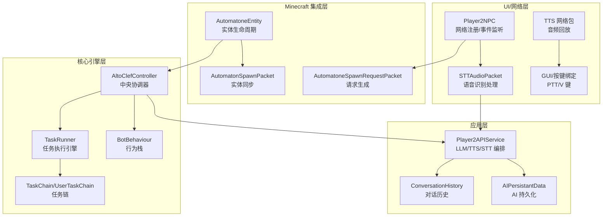
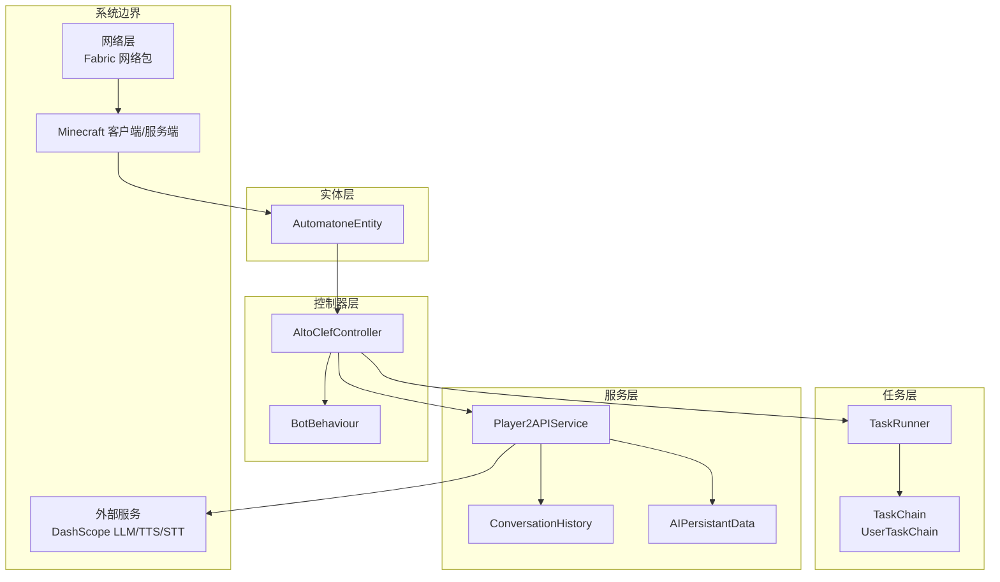
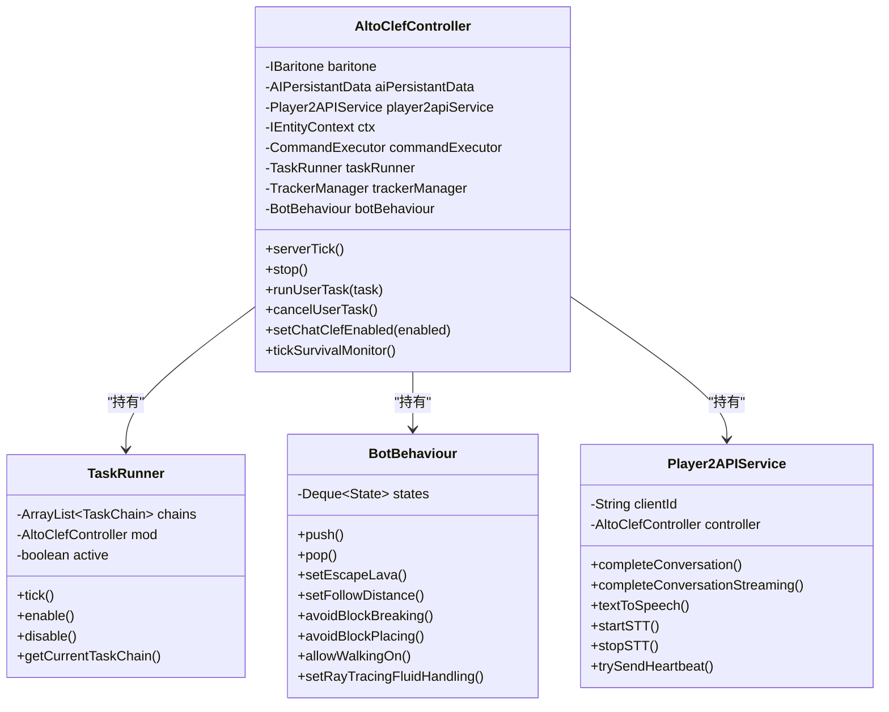
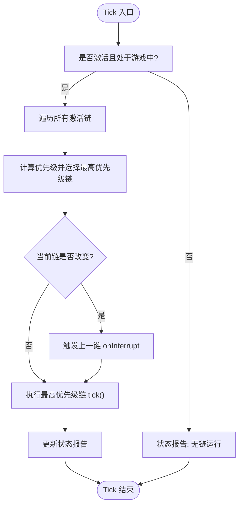
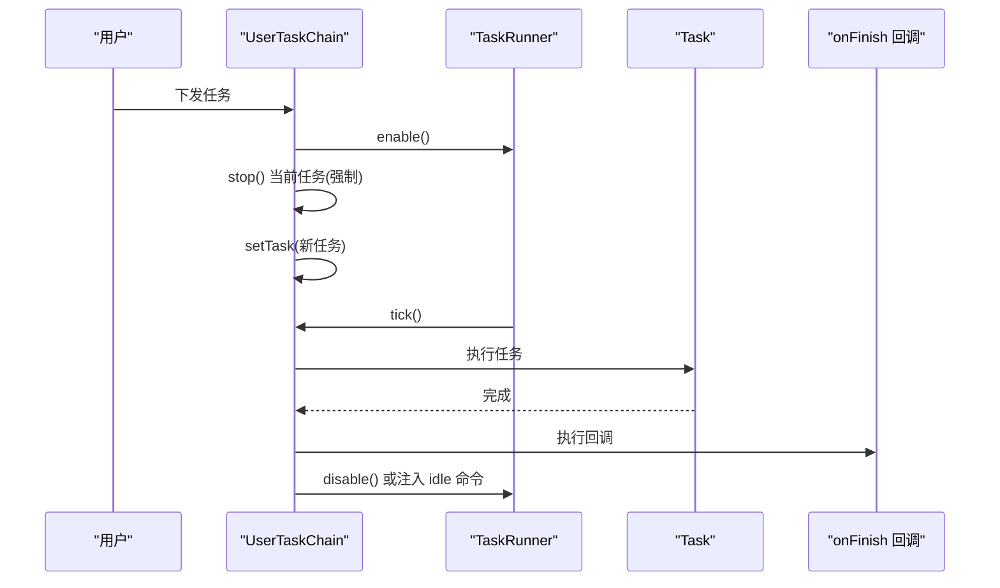
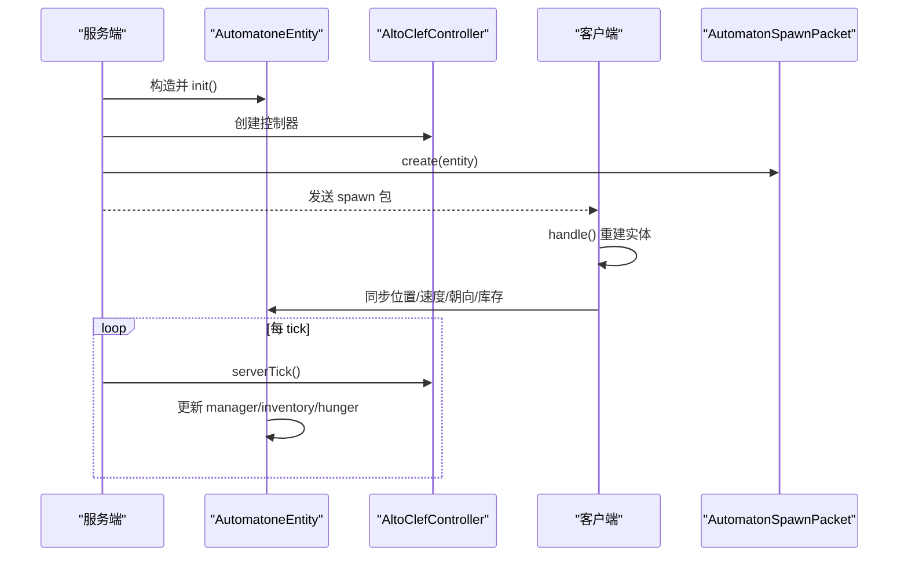
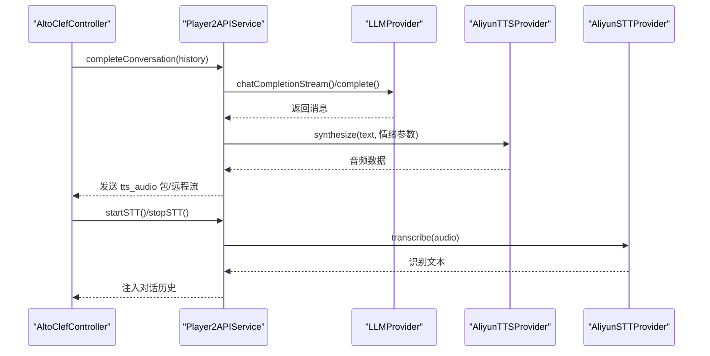
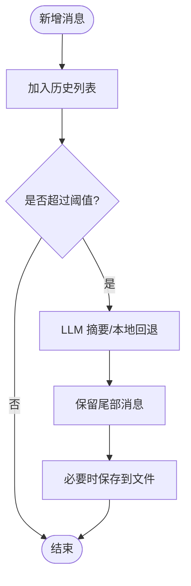
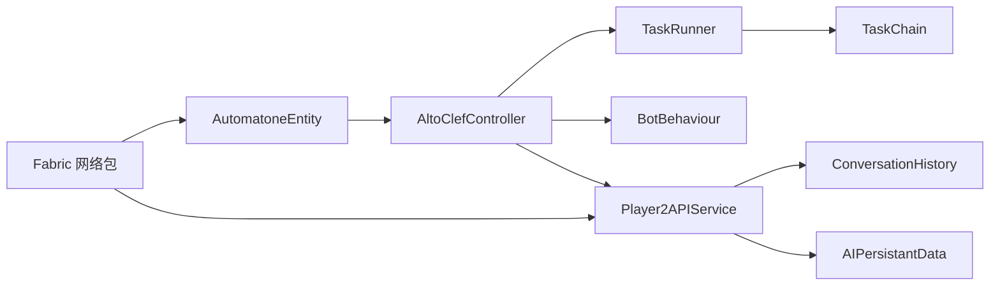

# 核心系统架构

<cite>
**本文引用的文件**
- [AltoClefController.java](file://src/main/java/adris/altoclef/AltoClefController.java)
- [TaskRunner.java](file://src/main/java/adris/altoclef/tasksystem/TaskRunner.java)
- [TaskChain.java](file://src/main/java/adris/altoclef/tasksystem/TaskChain.java)
- [UserTaskChain.java](file://src/main/java/adris/altoclef/chains/UserTaskChain.java)
- [AutomatoneEntity.java](file://src/main/java/com/goodbird/player2npc/companion/AutomatoneEntity.java)
- [Player2NPC.java](file://src/main/java/com/goodbird/player2npc/Player2NPC.java)
- [Player2APIService.java](file://src/main/java/adris/altoclef/player2api/Player2APIService.java)
- [AIPersistantData.java](file://src/main/java/adris/altoclef/player2api/AIPersistantData.java)
- [ConversationHistory.java](file://src/main/java/adris/altoclef/player2api/ConversationHistory.java)
- [AutomatonSpawnPacket.java](file://src/main/java/com/goodbird/player2npc/network/AutomatonSpawnPacket.java)
- [AutomatoneSpawnRequestPacket.java](file://src/main/java/com/goodbird/player2npc/network/AutomatoneSpawnRequestPacket.java)
- [BotBehaviour.java](file://src/main/java/adris/altoclef/BotBehaviour.java)
- [playerengine-llm-default.json](file://src/main/resources/playerengine-llm-default.json)
- [README.md](file://README.md)
</cite>

## 目录
1. [引言](#引言)
2. [项目结构](#项目结构)
3. [核心组件](#核心组件)
4. [架构总览](#架构总览)
5. [详细组件分析](#详细组件分析)
6. [依赖关系分析](#依赖关系分析)
7. [性能考虑](#性能考虑)
8. [故障排除指南](#故障排除指南)
9. [结论](#结论)
10. [附录](#附录)

## 引言
本文件面向 AI NPC 系统的架构文档，围绕四层分层架构进行系统化梳理：UI/网络层、Minecraft 集成层、应用层、核心引擎层。重点阐释 AltoClefController 作为中央协调器的角色、TaskRunner 任务执行引擎的优先级调度机制、AutomatoneEntity NPC 实体的生命周期管理，以及系统边界、技术决策与性能优化策略。文档同时提供架构图与组件关系图，帮助开发者快速理解系统设计与扩展点。

## 项目结构
系统采用模块化分层组织，核心包结构如下：
- UI/网络层：负责玩家交互、语音输入输出、网络包收发与渲染
- Minecraft 集成层：实体定义、渲染与生命周期管理
- 应用层：对话管理、AI 持久化数据、LLM/TTS/STT 服务编排
- 核心引擎层：任务系统、行为栈、Baritone 寻路集成

**图表来源**
- [Player2NPC.java:48-66](file://src/main/java/com/goodbird/player2npc/Player2NPC.java#L48-L66)
- [AutomatonSpawnRequestPacket.java:57-66](file://src/main/java/com/goodbird/player2npc/network/AutomatoneSpawnRequestPacket.java#L57-L66)
- [AutomatonSpawnPacket.java:100-120](file://src/main/java/com/goodbird/player2npc/network/AutomatonSpawnPacket.java#L100-L120)
- [AutomatoneEntity.java:73-99](file://src/main/java/com/goodbird/player2npc/companion/AutomatoneEntity.java#L73-L99)
- [AltoClefController.java:101-152](file://src/main/java/adris/altoclef/AltoClefController.java#L101-L152)
- [TaskRunner.java:22-58](file://src/main/java/adris/altoclef/tasksystem/TaskRunner.java#L22-L58)
- [TaskChain.java:16-36](file://src/main/java/adris/altoclef/tasksystem/TaskChain.java#L16-L36)
- [UserTaskChain.java:144-180](file://src/main/java/adris/altoclef/chains/UserTaskChain.java#L144-L180)
- [BotBehaviour.java:224-341](file://src/main/java/adris/altoclef/BotBehaviour.java#L224-L341)
- [Player2APIService.java:35-46](file://src/main/java/adris/altoclef/player2api/Player2APIService.java#L35-L46)
- [ConversationHistory.java:16-46](file://src/main/java/adris/altoclef/player2api/ConversationHistory.java#L16-L46)
- [AIPersistantData.java:24-44](file://src/main/java/adris/altoclef/player2api/AIPersistantData.java#L24-L44)

**章节来源**
- [README.md:496-562](file://README.md#L496-L562)

## 核心组件
- AltoClefController：系统中央协调器，负责初始化任务链、行为栈、追踪器、Baritone 设置与命令系统，统一调度 serverTick 生命周期与生存监控。
- TaskRunner：任务执行引擎，维护任务链集合，按优先级选择当前活动链并驱动其 tick。
- TaskChain/UserTaskChain：任务链抽象与用户任务链实现，封装任务优先级、中断与完成回调，支持距离监控与自动回归。
- AutomatoneEntity：NPC 实体，继承 LivingEntity 并实现 IAutomatone/IInventoryProvider/IInteractionManagerProvider/IHungerManagerProvider，负责实体同步、控制器生命周期与拾取逻辑。
- Player2APIService：应用层服务编排，封装 LLM 对话、TTS 合成、STT 启停与心跳上报，支持情绪感知的 TTS 参数动态调整。
- AIPersistantData：AI 持久化数据容器，管理对话历史、角色与灵魂档案、增量摘要与令牌预算分配。
- Player2NPC：Mod 初始化入口，注册实体类型、网络包处理器与服务器 tick 回调。

**章节来源**
- [AltoClefController.java:53-152](file://src/main/java/adris/altoclef/AltoClefController.java#L53-L152)
- [TaskRunner.java:9-98](file://src/main/java/adris/altoclef/tasksystem/TaskRunner.java#L9-L98)
- [TaskChain.java:7-51](file://src/main/java/adris/altoclef/tasksystem/TaskChain.java#L7-L51)
- [UserTaskChain.java:14-236](file://src/main/java/adris/altoclef/chains/UserTaskChain.java#L14-L236)
- [AutomatoneEntity.java:50-313](file://src/main/java/com/goodbird/player2npc/companion/AutomatoneEntity.java#L50-L313)
- [Player2APIService.java:35-274](file://src/main/java/adris/altoclef/player2api/Player2APIService.java#L35-L274)
- [AIPersistantData.java:24-149](file://src/main/java/adris/altoclef/player2api/AIPersistantData.java#L24-L149)
- [Player2NPC.java:25-66](file://src/main/java/com/goodbird/player2npc/Player2NPC.java#L25-L66)

## 架构总览
系统采用“实体-控制器-任务-行为-服务”的分层设计。实体层负责渲染与网络同步；控制器层负责 Tick 驱动与子系统编排；任务层负责优先级调度与中断切换；行为层负责可堆叠的寻路策略；服务层负责外部 LLM/TTS/STT 的统一编排与资源管理。

**图表来源**
- [Player2NPC.java:48-66](file://src/main/java/com/goodbird/player2npc/Player2NPC.java#L48-L66)
- [AutomatoneEntity.java:73-99](file://src/main/java/com/goodbird/player2npc/companion/AutomatoneEntity.java#L73-L99)
- [AltoClefController.java:101-152](file://src/main/java/adris/altoclef/AltoClefController.java#L101-L152)
- [TaskRunner.java:22-58](file://src/main/java/adris/altoclef/tasksystem/TaskRunner.java#L22-L58)
- [TaskChain.java:16-36](file://src/main/java/adris/altoclef/tasksystem/TaskChain.java#L16-L36)
- [UserTaskChain.java:144-180](file://src/main/java/adris/altoclef/chains/UserTaskChain.java#L144-L180)
- [Player2APIService.java:35-46](file://src/main/java/adris/altoclef/player2api/Player2APIService.java#L35-L46)
- [ConversationHistory.java:16-46](file://src/main/java/adris/altoclef/player2api/ConversationHistory.java#L16-L46)
- [AIPersistantData.java:24-44](file://src/main/java/adris/altoclef/player2api/AIPersistantData.java#L24-L44)

## 详细组件分析

### AltoClefController：中央协调器
- 职责
  - 组装并初始化任务链、行为栈、追踪器、Baritone 设置与命令系统
  - 统一 serverTick 生命周期，驱动输入控制、存储追踪、区块扫描、任务执行与心跳上报
  - 提供 NPC 生存监控（低血量自动进食、求救语音）
  - 管理 AI 持久化数据与 Player2API 服务
- 关键交互
  - 与 TaskRunner 协作进行任务优先级选择与中断
  - 与 BotBehaviour 堆叠/弹出行为状态
  - 与 Player2APIService 协作进行心跳与对话编排
- 设计要点
  - 将 Baritone 设置与自定义设置解耦，通过 Extra Baritone Settings 注入策略
  - 通过 Settings 动态注入可丢弃物品列表与闲置命令

**图表来源**
- [AltoClefController.java:53-152](file://src/main/java/adris/altoclef/AltoClefController.java#L53-L152)
- [TaskRunner.java:9-98](file://src/main/java/adris/altoclef/tasksystem/TaskRunner.java#L9-L98)
- [BotBehaviour.java:22-343](file://src/main/java/adris/altoclef/BotBehaviour.java#L22-L343)
- [Player2APIService.java:35-274](file://src/main/java/adris/altoclef/player2api/Player2APIService.java#L35-L274)

**章节来源**
- [AltoClefController.java:101-152](file://src/main/java/adris/altoclef/AltoClefController.java#L101-L152)
- [AltoClefController.java:154-210](file://src/main/java/adris/altoclef/AltoClefController.java#L154-L210)
- [AltoClefController.java:223-245](file://src/main/java/adris/altoclef/AltoClefController.java#L223-L245)

### TaskRunner 任务执行引擎
- 设计模式
  - 优先级驱动：遍历所有激活的任务链，选择最高优先级链执行
  - 中断通知：当当前链被更高优先级链打断时，触发 onInterrupt 回调
  - 生命周期：enable/disable 控制整体运行状态，清空所有链的 stop
- 数据流
  - TaskChain.tick() 生成任务序列，TaskRunner 选择并执行
  - 状态报告用于调试与监控

**图表来源**
- [TaskRunner.java:22-58](file://src/main/java/adris/altoclef/tasksystem/TaskRunner.java#L22-L58)
- [TaskChain.java:16-36](file://src/main/java/adris/altoclef/tasksystem/TaskChain.java#L16-L36)

**章节来源**
- [TaskRunner.java:22-84](file://src/main/java/adris/altoclef/tasksystem/TaskRunner.java#L22-L84)

### UserTaskChain 用户任务链
- 职责
  - 执行用户下发的任务，支持强制停止与重新设置任务
  - 距离监控：超过阈值自动回归、警告提示
  - 任务进度语音反馈与空闲命令注入
- 关键机制
  - userCommandActive 标志提升优先级，抵御 MobDefenseChain 抢占
  - 运行空闲任务时注入 idle 命令
  - 任务完成回调触发 onFinish 与后续空闲状态

**图表来源**
- [UserTaskChain.java:144-214](file://src/main/java/adris/altoclef/chains/UserTaskChain.java#L144-L214)
- [TaskRunner.java:64-84](file://src/main/java/adris/altoclef/tasksystem/TaskRunner.java#L64-L84)

**章节来源**
- [UserTaskChain.java:66-115](file://src/main/java/adris/altoclef/chains/UserTaskChain.java#L66-L115)
- [UserTaskChain.java:144-214](file://src/main/java/adris/altoclef/chains/UserTaskChain.java#L144-L214)

### AutomatoneEntity NPC 实体生命周期
- 生命周期
  - 服务端创建控制器并问候，客户端接收 spawn 包创建实体
  - tick 中更新交互管理器、库存与饥饿管理，服务端 tick 控制器
  - 自动拾取、近战攻击、朝向同步与渲染速度插值
- 同步机制
  - getAddEntityPacket 返回自定义 spawn 包，携带角色与库存信息
  - 客户端 handle 中重建实体、同步位置/速度/朝向与库存

**图表来源**
- [AutomatoneEntity.java:73-99](file://src/main/java/com/goodbird/player2npc/companion/AutomatoneEntity.java#L73-L99)
- [AutomatoneEntity.java:164-177](file://src/main/java/com/goodbird/player2npc/companion/AutomatoneEntity.java#L164-L177)
- [AutomatonSpawnPacket.java:70-93](file://src/main/java/com/goodbird/player2npc/network/AutomatonSpawnPacket.java#L70-L93)
- [AutomatonSpawnPacket.java:100-120](file://src/main/java/com/goodbird/player2npc/network/AutomatonSpawnPacket.java#L100-L120)

**章节来源**
- [AutomatoneEntity.java:78-91](file://src/main/java/com/goodbird/player2npc/companion/AutomatoneEntity.java#L78-L91)
- [AutomatoneEntity.java:164-177](file://src/main/java/com/goodbird/player2npc/companion/AutomatoneEntity.java#L164-L177)
- [AutomatonSpawnPacket.java:100-120](file://src/main/java/com/goodbird/player2npc/network/AutomatonSpawnPacket.java#L100-L120)

### Player2APIService 应用层服务编排
- 职责
  - LLM 对话：构造消息数组，调用 active provider，支持流式与非流式
  - TTS 合成：根据配置与情绪状态动态调整语速/音调，发送音频包或远程流
  - STT 启停：向远端发起/结束录音，返回识别文本
  - 心跳上报：周期性发送健康检查请求
- 关键点
  - Provider 注册表与配置加载，支持本地/远程模式切换
  - 情绪感知的 TTS 参数动态调整，增强表现力

**图表来源**
- [Player2APIService.java:48-118](file://src/main/java/adris/altoclef/player2api/Player2APIService.java#L48-L118)
- [Player2APIService.java:120-231](file://src/main/java/adris/altoclef/player2api/Player2APIService.java#L120-L231)
- [Player2APIService.java:233-256](file://src/main/java/adris/altoclef/player2api/Player2APIService.java#L233-L256)

**章节来源**
- [Player2APIService.java:120-200](file://src/main/java/adris/altoclef/player2api/Player2APIService.java#L120-L200)
- [Player2APIService.java:202-231](file://src/main/java/adris/altoclef/player2api/Player2APIService.java#L202-L231)

### AIPersistantData 与 ConversationHistory
- AIPersistantData
  - 维护角色、灵魂档案与增量摘要器
  - 构建系统提示，支持按角色与命令集定制
  - 包装并压缩对话历史，应用令牌预算分配
- ConversationHistory
  - 支持文件持久化与本地摘要回退
  - 分层压缩与尾部保留，保障上下文连续性
  - 包装最新消息状态（世界/代理/调试信息）

**图表来源**
- [AIPersistantData.java:59-128](file://src/main/java/adris/altoclef/player2api/AIPersistantData.java#L59-L128)
- [ConversationHistory.java:48-105](file://src/main/java/adris/altoclef/player2api/ConversationHistory.java#L48-L105)
- [ConversationHistory.java:107-134](file://src/main/java/adris/altoclef/player2api/ConversationHistory.java#L107-L134)

**章节来源**
- [AIPersistantData.java:37-44](file://src/main/java/adris/altoclef/player2api/AIPersistantData.java#L37-L44)
- [AIPersistantData.java:129-149](file://src/main/java/adris/altoclef/player2api/AIPersistantData.java#L129-L149)
- [ConversationHistory.java:181-212](file://src/main/java/adris/altoclef/player2api/ConversationHistory.java#L181-L212)

## 依赖关系分析
- 组件耦合
  - AltoClefController 与 TaskRunner、BotBehaviour、Player2APIService 高内聚低耦合
  - TaskRunner 仅依赖 TaskChain 抽象，便于扩展新链
  - Player2APIService 通过 Provider 注册表解耦 LLM/TTS/STT 实现
- 外部依赖
  - Fabric 网络 API、Baritone 寻路 API、DashScope 服务
- 循环依赖
  - 未发现直接循环依赖；网络包与实体同步通过 Fabric 事件解耦

**图表来源**
- [AltoClefController.java:101-152](file://src/main/java/adris/altoclef/AltoClefController.java#L101-L152)
- [TaskRunner.java:60-62](file://src/main/java/adris/altoclef/tasksystem/TaskRunner.java#L60-L62)
- [Player2APIService.java:35-46](file://src/main/java/adris/altoclef/player2api/Player2APIService.java#L35-L46)
- [AutomatoneEntity.java:73-99](file://src/main/java/com/goodbird/player2npc/companion/AutomatoneEntity.java#L73-L99)
- [Player2NPC.java:48-66](file://src/main/java/com/goodbird/player2npc/Player2NPC.java#L48-L66)

**章节来源**
- [Player2NPC.java:48-66](file://src/main/java/com/goodbird/player2npc/Player2NPC.java#L48-L66)
- [AutomatonSpawnPacket.java:70-93](file://src/main/java/com/goodbird/player2npc/network/AutomatonSpawnPacket.java#L70-L93)

## 性能考虑
- 任务调度
  - TaskRunner 仅在激活且 inGame 时执行，避免空转
  - 优先级选择与中断通知减少无效任务切换开销
- 对话历史
  - 分层压缩与令牌预算分配控制 LLM 输入规模，避免超预算
  - 文件持久化与本地摘要回退降低网络调用频率
- 网络与渲染
  - 自定义 spawn 包压缩传输字段，客户端重建实体
  - TTS 本地合成与远程流两种模式，按配置选择最优路径
- 寻路与行为
  - BotBehaviour 通过状态栈快速切换策略，避免重复初始化
  - Baritone 设置与 Extra 设置分离，减少频繁变更成本

[本节为通用指导，无需特定文件引用]

## 故障排除指南
- 无法生成 NPC
  - 检查网络包注册与实体注册是否成功
  - 确认 spawn 请求包处理逻辑与角色数据完整性
- 对话无响应
  - 检查 LLM Provider 配置与 API Key
  - 查看心跳上报与服务可用性
- TTS 无声
  - 检查 TTS 配置与情绪参数覆盖
  - 确认音频包发送与客户端播放
- STT 识别为空
  - 检查录音时长与网络连通性
  - 确认服务端 STT 包处理与识别结果注入

**章节来源**
- [AutomatoneSpawnRequestPacket.java:57-66](file://src/main/java/com/goodbird/player2npc/network/AutomatoneSpawnRequestPacket.java#L57-L66)
- [Player2APIService.java:120-200](file://src/main/java/adris/altoclef/player2api/Player2APIService.java#L120-L200)
- [Player2APIService.java:233-256](file://src/main/java/adris/altoclef/player2api/Player2APIService.java#L233-L256)

## 结论
该系统通过清晰的四层分层架构实现了从 UI/网络到核心引擎的完整闭环：AltoClefController 作为中央协调器，TaskRunner 提供稳定的优先级调度，UserTaskChain 实现用户意图的可靠执行，AutomatoneEntity 完成实体生命周期与网络同步，Player2APIService 将 LLM/TTS/STT 有机整合。配合 AIPersistantData 与 ConversationHistory 的上下文管理，系统在可扩展性、可维护性与性能之间取得平衡，适合进一步扩展多 NPC 协作、多模态交互与复杂任务编排。

## 附录
- 配置文件
  - playerengine-llm-default.json：提供 LLM/TTS/STT 默认配置模板与注释说明
- 扩展建议
  - 新增 LLM Provider：实现 Provider 接口并注册到注册表
  - 新增任务链：继承 TaskChain 并在控制器中注册
  - 新增网络包：遵循 Fabric PacketType 规范，确保客户端/服务端一致

**章节来源**
- [playerengine-llm-default.json:1-89](file://src/main/resources/playerengine-llm-default.json#L1-L89)
- [README.md:564-681](file://README.md#L564-L681)