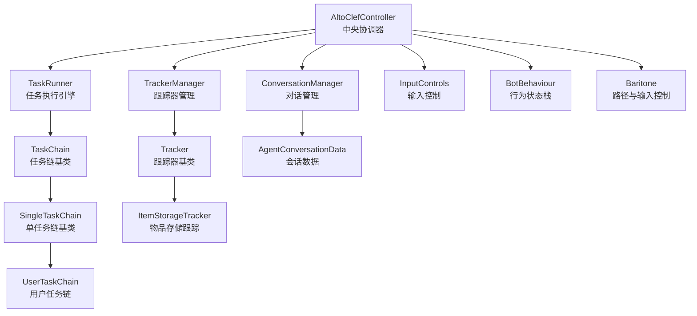
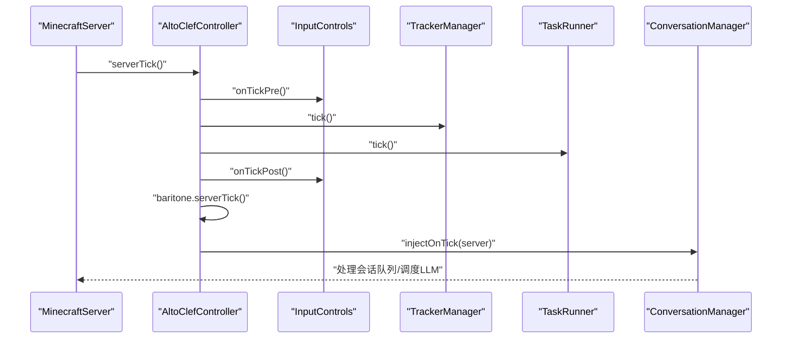
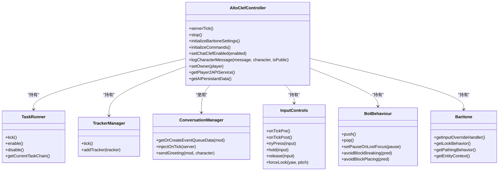
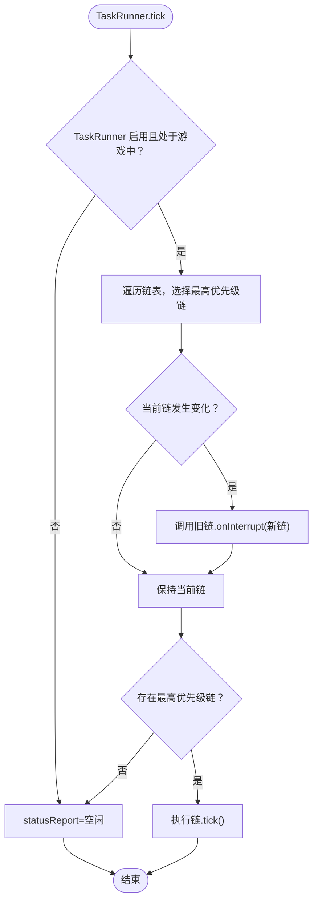
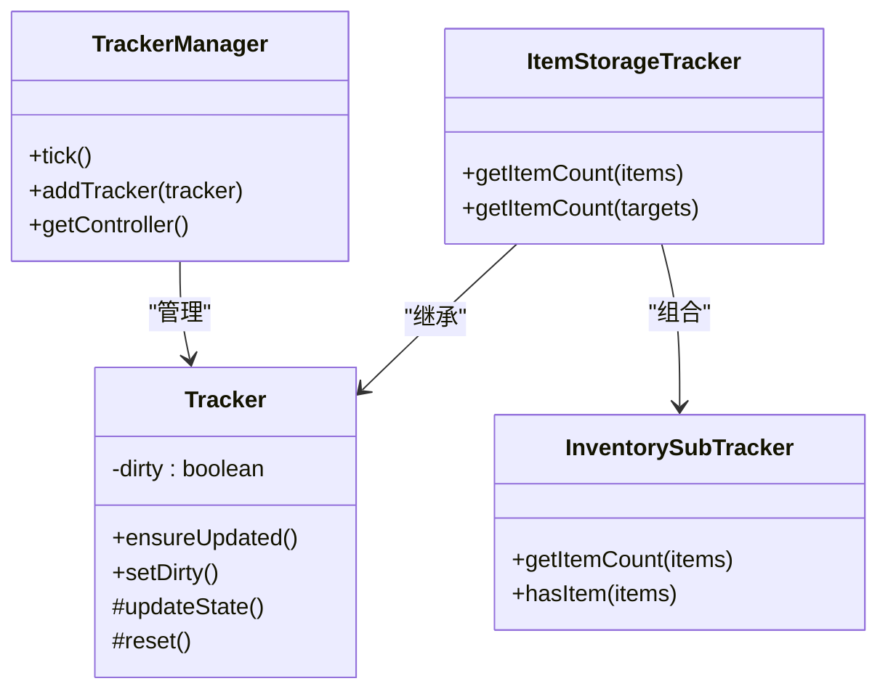
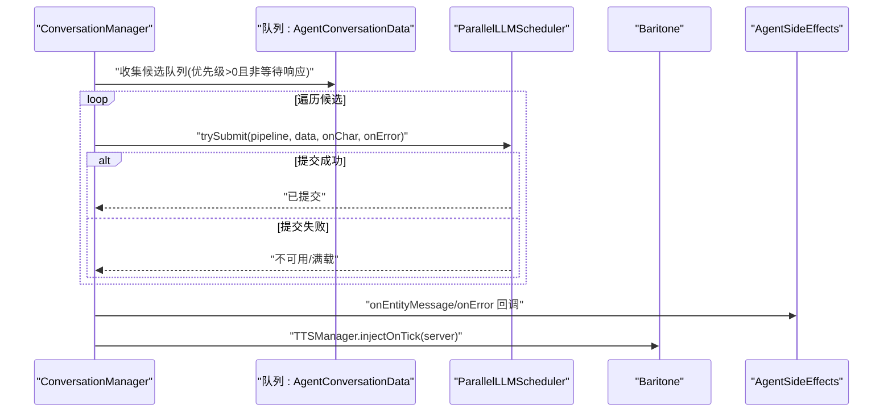
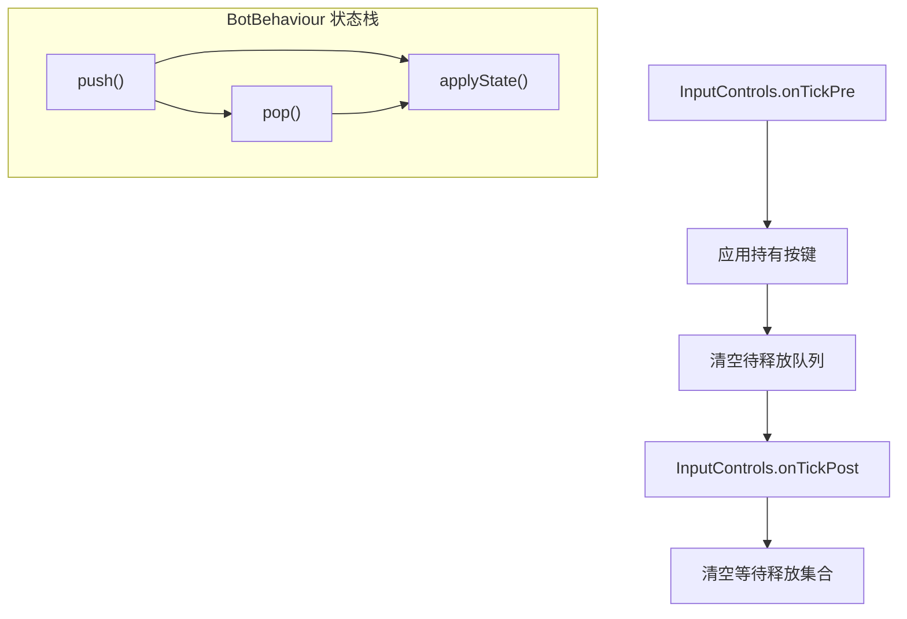
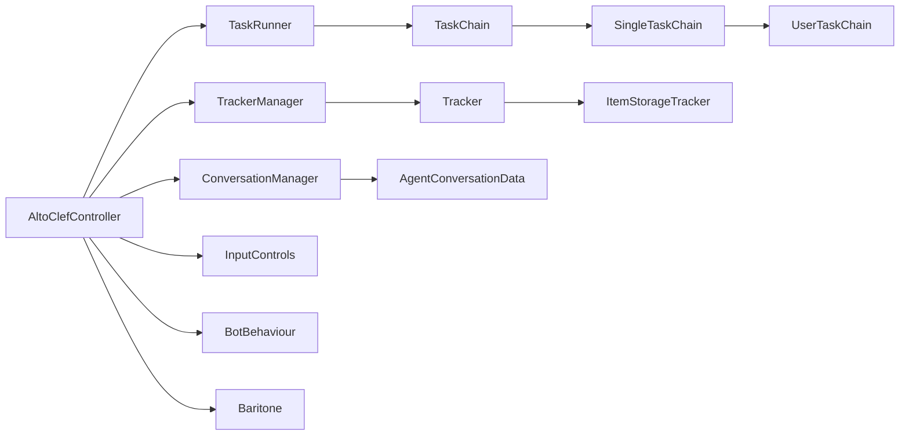

# 核心组件关系

<cite>
**本文引用的文件**
- [AltoClefController.java](file://src/main/java/adris/altoclef/AltoClefController.java)
- [TaskRunner.java](file://src/main/java/adris/altoclef/tasksystem/TaskRunner.java)
- [TaskChain.java](file://src/main/java/adris/altoclef/tasksystem/TaskChain.java)
- [SingleTaskChain.java](file://src/main/java/adris/altoclef/chains/SingleTaskChain.java)
- [UserTaskChain.java](file://src/main/java/adris/altoclef/chains/UserTaskChain.java)
- [Task.java](file://src/main/java/adris/altoclef/tasksystem/Task.java)
- [TrackerManager.java](file://src/main/java/adris/altoclef/trackers/TrackerManager.java)
- [Tracker.java](file://src/main/java/adris/altoclef/trackers/Tracker.java)
- [ItemStorageTracker.java](file://src/main/java/adris/altoclef/trackers/storage/ItemStorageTracker.java)
- [ConversationManager.java](file://src/main/java/adris/altoclef/player2api/manager/ConversationManager.java)
- [AgentConversationData.java](file://src/main/java/adris/altoclef/player2api/AgentConversationData.java)
- [AIPersistantData.java](file://src/main/java/adris/altoclef/player2api/AIPersistantData.java)
- [InputControls.java](file://src/main/java/adris/altoclef/control/InputControls.java)
- [BotBehaviour.java](file://src/main/java/adris/altoclef/BotBehaviour.java)
- [Baritone.java](file://src/main/java/baritone/Baritone.java)
</cite>

## 目录
1. [简介](#简介)
2. [项目结构](#项目结构)
3. [核心组件](#核心组件)
4. [架构总览](#架构总览)
5. [详细组件分析](#详细组件分析)
6. [依赖关系分析](#依赖关系分析)
7. [性能考量](#性能考量)
8. [故障排查指南](#故障排查指南)
9. [结论](#结论)
10. [附录](#附录)

## 简介
本文件聚焦于 AltoClefController 中央协调器与其管理的核心子系统之间的关系与协作机制，涵盖任务执行引擎（TaskRunner）、对话管理（ConversationManager）、跟踪器管理（TrackerManager）等模块。文档详细解释组件间的依赖关系、生命周期管理、事件传递机制、初始化顺序、资源共享策略以及异常处理流程，并通过多种图示展示组件交互与调用链路，同时提供扩展点与自定义接口说明。

## 项目结构
AltoClefController 位于核心包中，围绕其构建的任务系统、跟踪器系统与 AI 对话系统共同构成 NPC 的行为中枢。下图给出与本文件相关的关键文件在项目中的位置映射。

图表来源
- [AltoClefController.java:101-152](file://src/main/java/adris/altoclef/AltoClefController.java#L101-L152)
- [TaskRunner.java:17-20](file://src/main/java/adris/altoclef/tasksystem/TaskRunner.java#L17-L20)
- [TaskChain.java:11-14](file://src/main/java/adris/altoclef/tasksystem/TaskChain.java#L11-L14)
- [SingleTaskChain.java:17-20](file://src/main/java/adris/altoclef/chains/SingleTaskChain.java#L17-L20)
- [UserTaskChain.java:37-39](file://src/main/java/adris/altoclef/chains/UserTaskChain.java#L37-L39)
- [TrackerManager.java:11-13](file://src/main/java/adris/altoclef/trackers/TrackerManager.java#L11-L13)
- [Tracker.java:9-11](file://src/main/java/adris/altoclef/trackers/Tracker.java#L9-L11)
- [ItemStorageTracker.java:25-30](file://src/main/java/adris/altoclef/trackers/storage/ItemStorageTracker.java#L25-L30)
- [ConversationManager.java:75-82](file://src/main/java/adris/altoclef/player2api/manager/ConversationManager.java#L75-L82)
- [AgentConversationData.java:82-84](file://src/main/java/adris/altoclef/player2api/AgentConversationData.java#L82-L84)
- [Baritone.java:89-104](file://src/main/java/baritone/Baritone.java#L89-L104)

章节来源
- [AltoClefController.java:101-152](file://src/main/java/adris/altoclef/AltoClefController.java#L101-L152)

## 核心组件
- 中央协调器：AltoClefController 负责装配与编排各子系统，统一调度 Tick、命令执行、AI 对话与资源跟踪。
- 任务执行引擎：TaskRunner 统一调度多个 TaskChain，按优先级选择当前执行链并驱动其 Tick。
- 任务链体系：TaskChain 抽象出可插拔的任务执行单元；SingleTaskChain 提供单任务执行语义；UserTaskChain 为用户命令链路提供专用逻辑（如距离监控、空闲回退）。
- 跟踪器管理：TrackerManager 统一管理各类 Tracker，负责周期性刷新与重置；Tracker 基类提供脏标记与更新契约。
- 对话管理：ConversationManager 负责聊天事件注入、会话队列管理与 LLM 并行调度；AgentConversationData 表达单个 NPC 的会话状态与优先级。
- 输入与行为：InputControls 提供按键与视角强制控制；BotBehaviour 通过状态栈封装 Baritone 设置的临时修改与恢复。
- 外部集成：Baritone 提供实体上下文、输入覆盖、路径行为等底层能力。

章节来源
- [AltoClefController.java:53-152](file://src/main/java/adris/altoclef/AltoClefController.java#L53-L152)
- [TaskRunner.java:9-98](file://src/main/java/adris/altoclef/tasksystem/TaskRunner.java#L9-L98)
- [TaskChain.java:7-50](file://src/main/java/adris/altoclef/tasksystem/TaskChain.java#L7-L50)
- [SingleTaskChain.java:11-95](file://src/main/java/adris/altoclef/chains/SingleTaskChain.java#L11-L95)
- [UserTaskChain.java:14-236](file://src/main/java/adris/altoclef/chains/UserTaskChain.java#L14-L236)
- [TrackerManager.java:6-42](file://src/main/java/adris/altoclef/trackers/TrackerManager.java#L6-L42)
- [Tracker.java:5-31](file://src/main/java/adris/altoclef/trackers/Tracker.java#L5-L31)
- [ItemStorageTracker.java:21-38](file://src/main/java/adris/altoclef/trackers/storage/ItemStorageTracker.java#L21-L38)
- [ConversationManager.java:27-201](file://src/main/java/adris/altoclef/player2api/manager/ConversationManager.java#L27-L201)
- [AgentConversationData.java:82-115](file://src/main/java/adris/altoclef/player2api/AgentConversationData.java#L82-L115)
- [InputControls.java:11-54](file://src/main/java/adris/altoclef/control/InputControls.java#L11-L54)
- [BotBehaviour.java:22-343](file://src/main/java/adris/altoclef/BotBehaviour.java#L22-L343)
- [Baritone.java:89-104](file://src/main/java/baritone/Baritone.java#L89-L104)

## 架构总览
AltoClefController 在构造函数中完成组件装配与设置初始化，随后在每 tick 中驱动输入控制、跟踪器、扫描器、任务执行、Baritone Tick 与心跳上报。AI 对话通过静态注册的服务器 tick 回调进行注入处理。

图表来源
- [AltoClefController.java:154-170](file://src/main/java/adris/altoclef/AltoClefController.java#L154-L170)
- [AltoClefController.java:208-210](file://src/main/java/adris/altoclef/AltoClefController.java#L208-L210)
- [InputControls.java:44-52](file://src/main/java/adris/altoclef/control/InputControls.java#L44-L52)
- [TrackerManager.java:15-31](file://src/main/java/adris/altoclef/trackers/TrackerManager.java#L15-L31)
- [TaskRunner.java:22-58](file://src/main/java/adris/altoclef/tasksystem/TaskRunner.java#L22-L58)
- [ConversationManager.java:174-189](file://src/main/java/adris/altoclef/player2api/manager/ConversationManager.java#L174-L189)

## 详细组件分析

### 中央协调器 AltoClefController
- 职责：装配与编排任务、跟踪器、输入控制、行为状态、AI 对话与持久化数据；提供统一的 Tick 驱动与停止逻辑。
- 初始化顺序要点：
  - 先创建命令执行器、任务运行器、跟踪器管理器与若干链路实例；
  - 初始化 Baritone 设置与行为；
  - 最后初始化 AI 相关组件（会话队列数据、持久化数据、服务）。
- 生命周期管理：
  - serverTick：驱动输入、跟踪器、任务、Baritone 与心跳；
  - stop：取消当前任务链、禁用任务运行器、清理输入覆盖。
- 事件传递：
  - 静态注册 END_SERVER_TICK，统一注入对话处理；
  - 通过 ConversationManager 将用户聊天与 AI 字符消息广播至附近 NPC。
- 异常处理：
  - 命令初始化失败时捕获异常并打印堆栈；
  - 会话锁超时自动释放；
  - 任务失败通过 Task.fail 触发停止与日志记录。

图表来源
- [AltoClefController.java:53-152](file://src/main/java/adris/altoclef/AltoClefController.java#L53-L152)
- [TaskRunner.java:9-98](file://src/main/java/adris/altoclef/tasksystem/TaskRunner.java#L9-L98)
- [TrackerManager.java:6-42](file://src/main/java/adris/altoclef/trackers/TrackerManager.java#L6-L42)
- [ConversationManager.java:27-201](file://src/main/java/adris/altoclef/player2api/manager/ConversationManager.java#L27-L201)
- [InputControls.java:11-54](file://src/main/java/adris/altoclef/control/InputControls.java#L11-L54)
- [BotBehaviour.java:22-343](file://src/main/java/adris/altoclef/BotBehaviour.java#L22-L343)
- [Baritone.java:89-104](file://src/main/java/baritone/Baritone.java#L89-L104)

章节来源
- [AltoClefController.java:101-152](file://src/main/java/adris/altoclef/AltoClefController.java#L101-L152)
- [AltoClefController.java:154-210](file://src/main/java/adris/altoclef/AltoClefController.java#L154-L210)
- [AltoClefController.java:212-253](file://src/main/java/adris/altoclef/AltoClefController.java#L212-L253)

### 任务执行引擎与任务链
- TaskRunner：维护任务链集合，按优先级选择当前链并驱动其 Tick；支持启用/禁用与状态报告。
- TaskChain：抽象任务链，提供优先级、激活状态、Tick 与中断回调；SingleTaskChain 提供单任务执行语义与切换逻辑；UserTaskChain 扩展用户命令链，包含距离监控、空闲回退与进度语音反馈。
- Task：任务基类，支持启动、Tick、停止、中断、失败与树形子任务管理。

图表来源
- [TaskRunner.java:22-58](file://src/main/java/adris/altoclef/tasksystem/TaskRunner.java#L22-L58)
- [TaskChain.java:16-35](file://src/main/java/adris/altoclef/tasksystem/TaskChain.java#L16-L35)
- [SingleTaskChain.java:22-44](file://src/main/java/adris/altoclef/chains/SingleTaskChain.java#L22-L44)
- [UserTaskChain.java:144-180](file://src/main/java/adris/altoclef/chains/UserTaskChain.java#L144-L180)

章节来源
- [TaskRunner.java:9-98](file://src/main/java/adris/altoclef/tasksystem/TaskRunner.java#L9-L98)
- [TaskChain.java:7-50](file://src/main/java/adris/altoclef/tasksystem/TaskChain.java#L7-L50)
- [SingleTaskChain.java:11-95](file://src/main/java/adris/altoclef/chains/SingleTaskChain.java#L11-L95)
- [UserTaskChain.java:14-236](file://src/main/java/adris/altoclef/chains/UserTaskChain.java#L14-L236)
- [Task.java:41-104](file://src/main/java/adris/altoclef/tasksystem/Task.java#L41-L104)

### 跟踪器管理与资源跟踪
- TrackerManager：统一管理 Tracker 列表，在 Tick 中标记脏位并触发重置（离开游戏时）。
- Tracker：抽象跟踪器，提供脏标记与 ensureUpdated 更新契约；具体实现负责状态刷新与重置。
- ItemStorageTracker：组合 InventorySubTracker 与 ContainerSubTracker，提供物品计数与容器跟踪能力。

图表来源
- [TrackerManager.java:6-42](file://src/main/java/adris/altoclef/trackers/TrackerManager.java#L6-L42)
- [Tracker.java:5-31](file://src/main/java/adris/altoclef/trackers/Tracker.java#L5-L31)
- [ItemStorageTracker.java:21-38](file://src/main/java/adris/altoclef/trackers/storage/ItemStorageTracker.java#L21-L38)
- [InventorySubTracker.java:19-45](file://src/main/java/adris/altoclef/trackers/storage/InventorySubTracker.java#L19-L45)

章节来源
- [TrackerManager.java:6-42](file://src/main/java/adris/altoclef/trackers/TrackerManager.java#L6-L42)
- [Tracker.java:5-31](file://src/main/java/adris/altoclef/trackers/Tracker.java#L5-L31)
- [ItemStorageTracker.java:21-38](file://src/main/java/adris/altoclef/trackers/storage/ItemStorageTracker.java#L21-L38)

### 对话管理与会话数据
- ConversationManager：维护每个 NPC 的 AgentConversationData 队列，按优先级与锁状态调度 LLM；提供广播与距离过滤；在服务器 Tick 注入回调中统一处理。
- AgentConversationData：表达单个 NPC 的会话状态、优先级计算、处理超时与错误处理；支持字符消息与错误回调。
- AIPersistantData：封装会话历史包装、分层压缩与系统提示更新。

图表来源
- [ConversationManager.java:152-189](file://src/main/java/adris/altoclef/player2api/manager/ConversationManager.java#L152-L189)
- [AgentConversationData.java:91-115](file://src/main/java/adris/altoclef/player2api/AgentConversationData.java#L91-L115)
- [AIPersistantData.java:59-80](file://src/main/java/adris/altoclef/player2api/AIPersistantData.java#L59-L80)

章节来源
- [ConversationManager.java:27-201](file://src/main/java/adris/altoclef/player2api/manager/ConversationManager.java#L27-L201)
- [AgentConversationData.java:82-115](file://src/main/java/adris/altoclef/player2api/AgentConversationData.java#L82-L115)
- [AIPersistantData.java:59-80](file://src/main/java/adris/altoclef/player2api/AIPersistantData.java#L59-L80)

### 输入控制与行为状态
- InputControls：提供按键强制按下/保持/释放与视角强制旋转；在 Tick 前后分别处理一次性按键与释放集合。
- BotBehaviour：通过状态栈保存/应用 Baritone 设置（如避免放置/破坏、工具使用、全局启发式等），支持临时修改与恢复。

图表来源
- [InputControls.java:44-52](file://src/main/java/adris/altoclef/control/InputControls.java#L44-L52)
- [InputControls.java:20-38](file://src/main/java/adris/altoclef/control/InputControls.java#L20-L38)
- [BotBehaviour.java:187-222](file://src/main/java/adris/altoclef/BotBehaviour.java#L187-L222)
- [BotBehaviour.java:265-340](file://src/main/java/adris/altoclef/BotBehaviour.java#L265-L340)

章节来源
- [InputControls.java:11-54](file://src/main/java/adris/altoclef/control/InputControls.java#L11-L54)
- [BotBehaviour.java:22-343](file://src/main/java/adris/altoclef/BotBehaviour.java#L22-L343)

## 依赖关系分析
- 组件耦合与内聚：
  - AltoClefController 作为高内聚协调者，对 TaskRunner、TrackerManager、ConversationManager、InputControls、BotBehaviour、Baritone 等形成强依赖但低耦合（通过接口与控制器访问）。
  - TaskRunner 与 TaskChain 之间为松耦合的策略组合，便于扩展新的任务链。
  - TrackerManager 与 Tracker 采用组合与继承分离职责，便于按需扩展跟踪器。
- 直接与间接依赖：
  - TaskRunner 依赖 TaskChain；TaskChain 依赖 TaskRunner 以注册自身。
  - UserTaskChain 依赖 TaskRunner 与 Task；UserTaskChain 与 TaskRunner 形成直接协作。
  - ConversationManager 依赖 AgentConversationData 与并行调度器；AltoClefController 通过静态方法注入其 Tick。
  - InputControls 与 BotBehaviour 依赖 Baritone 的输入覆盖与行为组件。
- 循环依赖：
  - 未发现循环依赖；各方向依赖均为单向。
- 外部依赖：
  - Baritone 提供实体上下文、输入覆盖、路径行为等；Fabric 事件用于聊天注入。

图表来源
- [AltoClefController.java:53-152](file://src/main/java/adris/altoclef/AltoClefController.java#L53-L152)
- [TaskRunner.java:60-62](file://src/main/java/adris/altoclef/tasksystem/TaskRunner.java#L60-L62)
- [TaskChain.java:11-14](file://src/main/java/adris/altoclef/tasksystem/TaskChain.java#L11-L14)
- [SingleTaskChain.java:17-20](file://src/main/java/adris/altoclef/chains/SingleTaskChain.java#L17-L20)
- [UserTaskChain.java:37-39](file://src/main/java/adris/altoclef/chains/UserTaskChain.java#L37-L39)
- [TrackerManager.java:33-36](file://src/main/java/adris/altoclef/trackers/TrackerManager.java#L33-L36)
- [Tracker.java:9-11](file://src/main/java/adris/altoclef/trackers/Tracker.java#L9-L11)
- [ItemStorageTracker.java:25-30](file://src/main/java/adris/altoclef/trackers/storage/ItemStorageTracker.java#L25-L30)
- [ConversationManager.java:75-82](file://src/main/java/adris/altoclef/player2api/manager/ConversationManager.java#L75-L82)
- [AgentConversationData.java:82-84](file://src/main/java/adris/altoclef/player2api/AgentConversationData.java#L82-L84)

章节来源
- [AltoClefController.java:53-152](file://src/main/java/adris/altoclef/AltoClefController.java#L53-L152)
- [TaskRunner.java:60-62](file://src/main/java/adris/altoclef/tasksystem/TaskRunner.java#L60-L62)
- [TaskChain.java:11-14](file://src/main/java/adris/altoclef/tasksystem/TaskChain.java#L11-L14)
- [SingleTaskChain.java:17-20](file://src/main/java/adris/altoclef/chains/SingleTaskChain.java#L17-L20)
- [UserTaskChain.java:37-39](file://src/main/java/adris/altoclef/chains/UserTaskChain.java#L37-L39)
- [TrackerManager.java:33-36](file://src/main/java/adris/altoclef/trackers/TrackerManager.java#L33-L36)
- [Tracker.java:9-11](file://src/main/java/adris/altoclef/trackers/Tracker.java#L9-L11)
- [ItemStorageTracker.java:25-30](file://src/main/java/adris/altoclef/trackers/storage/ItemStorageTracker.java#L25-L30)
- [ConversationManager.java:75-82](file://src/main/java/adris/altoclef/player2api/manager/ConversationManager.java#L75-L82)
- [AgentConversationData.java:82-84](file://src/main/java/adris/altoclef/player2api/AgentConversationData.java#L82-L84)

## 性能考量
- 任务链优先级选择：TaskRunner 在每次 Tick 中遍历所有链，时间复杂度 O(N)；建议控制链数量或引入索引优化。
- 跟踪器批量刷新：TrackerManager 在 Tick 中统一标记脏位，避免重复计算；建议在 Tracker.updateState 中做增量更新。
- 会话调度并发：ConversationManager 使用并行调度器，应根据 LLM 资源限制合理配置并发度，避免阻塞。
- 输入控制抖动：InputControls 在 Tick 前后处理一次性按键，避免持续按键导致的输入抖动。

## 故障排查指南
- 命令初始化失败：检查命令系统初始化异常并确认日志输出。
- 会话锁超时：若长时间无响应，ConversationManager 会自动释放锁；检查 LLM 服务可用性与网络延迟。
- 任务中断与失败：Task.fail 会停止任务并记录原因；检查任务前置条件与外部状态变化。
- 输入覆盖冲突：确保 InputControls 的一次性按键与持有按键逻辑正确，避免与常规输入冲突。
- 行为状态栈异常：BotBehaviour 的 push/pop 必须成对调用；若状态栈为空，系统会记录错误并自动恢复。

章节来源
- [AltoClefController.java:247-253](file://src/main/java/adris/altoclef/AltoClefController.java#L247-L253)
- [ConversationManager.java:36-52](file://src/main/java/adris/altoclef/player2api/manager/ConversationManager.java#L36-L52)
- [Task.java:79-82](file://src/main/java/adris/altoclef/tasksystem/Task.java#L79-L82)
- [InputControls.java:20-38](file://src/main/java/adris/altoclef/control/InputControls.java#L20-L38)
- [BotBehaviour.java:200-213](file://src/main/java/adris/altoclef/BotBehaviour.java#L200-L213)

## 结论
AltoClefController 通过清晰的装配与 Tick 驱动，将任务执行、资源跟踪、对话处理与输入控制有机整合。其设计强调可插拔的任务链、可扩展的跟踪器与可并发的会话调度，具备良好的可维护性与扩展性。遵循本文所述初始化顺序、资源共享策略与异常处理流程，可有效提升系统的稳定性与性能。

## 附录
- 扩展点与自定义接口
  - 新增任务链：继承 TaskChain 或 SingleTaskChain，实现优先级与 Tick 逻辑，并在构造时注册到 TaskRunner。
  - 新增跟踪器：继承 Tracker，实现 updateState 与 reset，并在构造时注册到 TrackerManager。
  - 自定义对话处理：通过 ConversationManager 的队列与调度器扩展消息处理与错误回调。
  - 自定义行为策略：通过 BotBehaviour 的状态栈 push/pop 临时修改 Baritone 设置，并在需要时恢复。
  - 自定义输入策略：通过 InputControls 的按键与视角控制实现精细输入模拟。