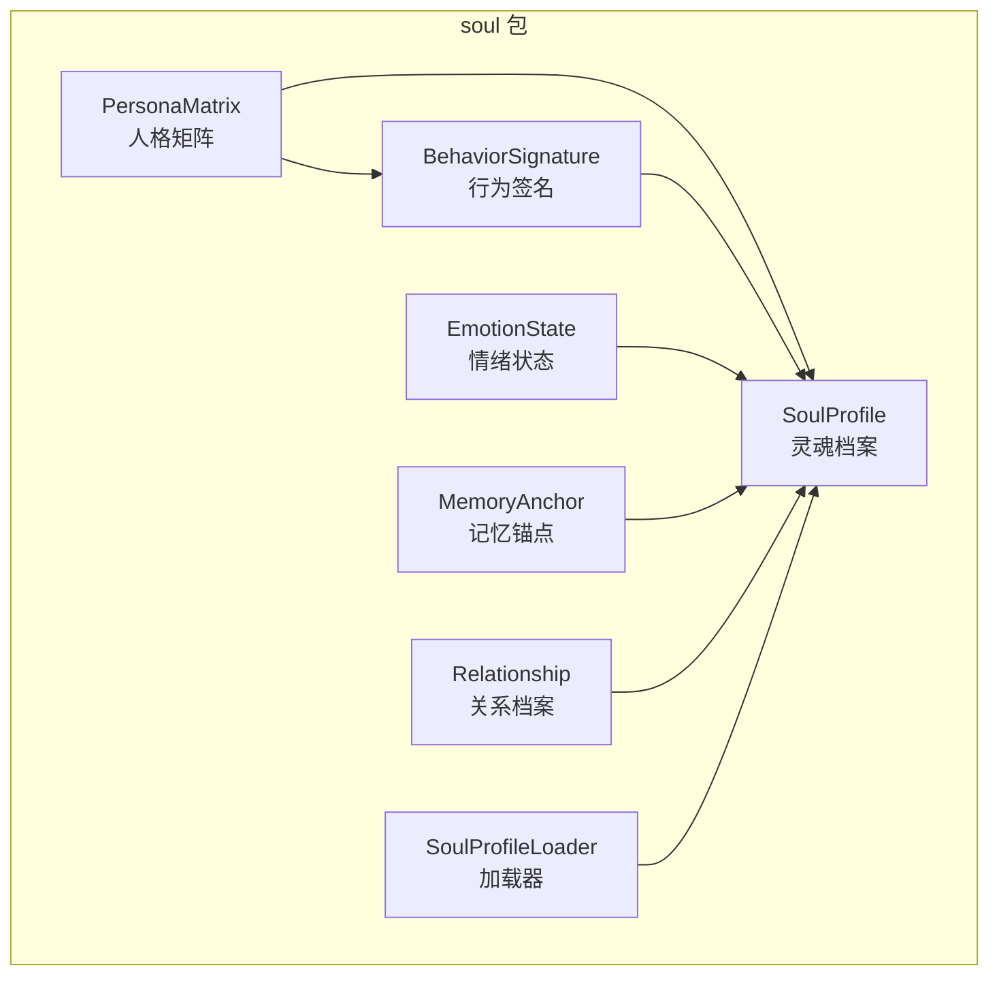
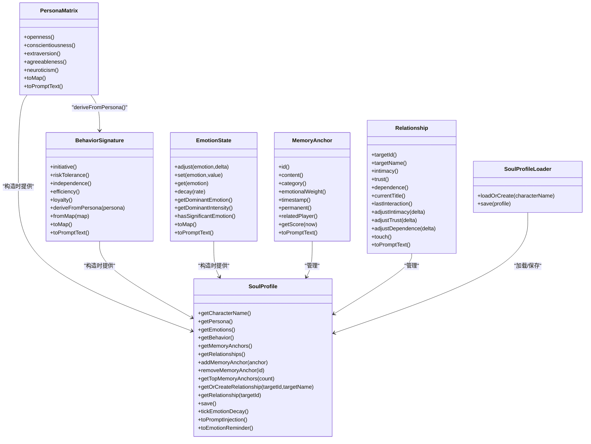
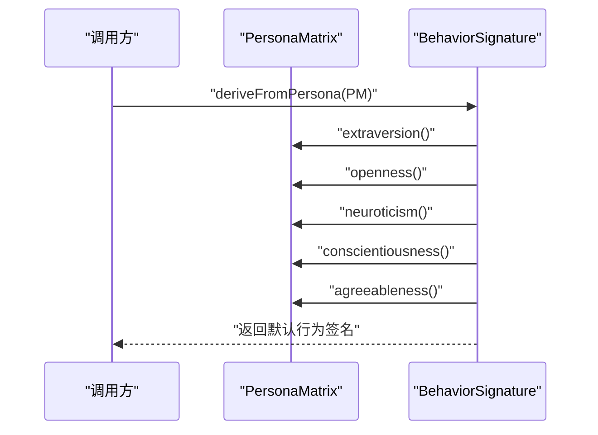
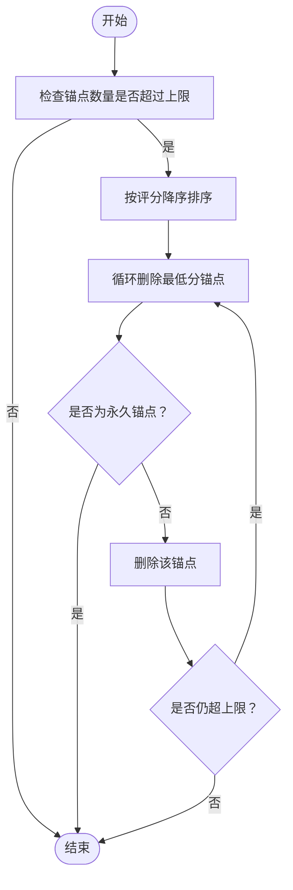
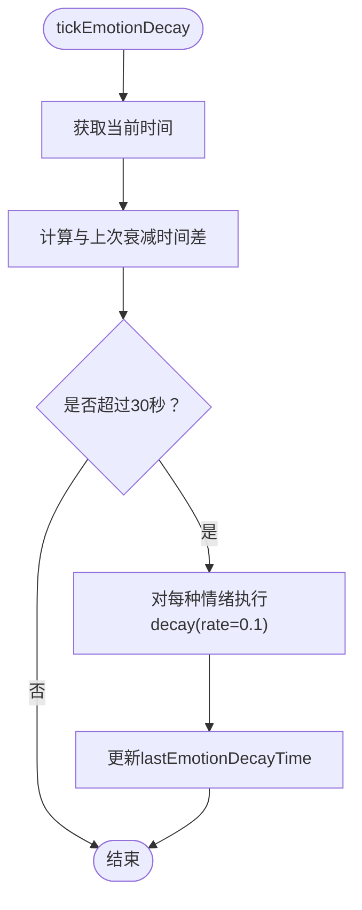
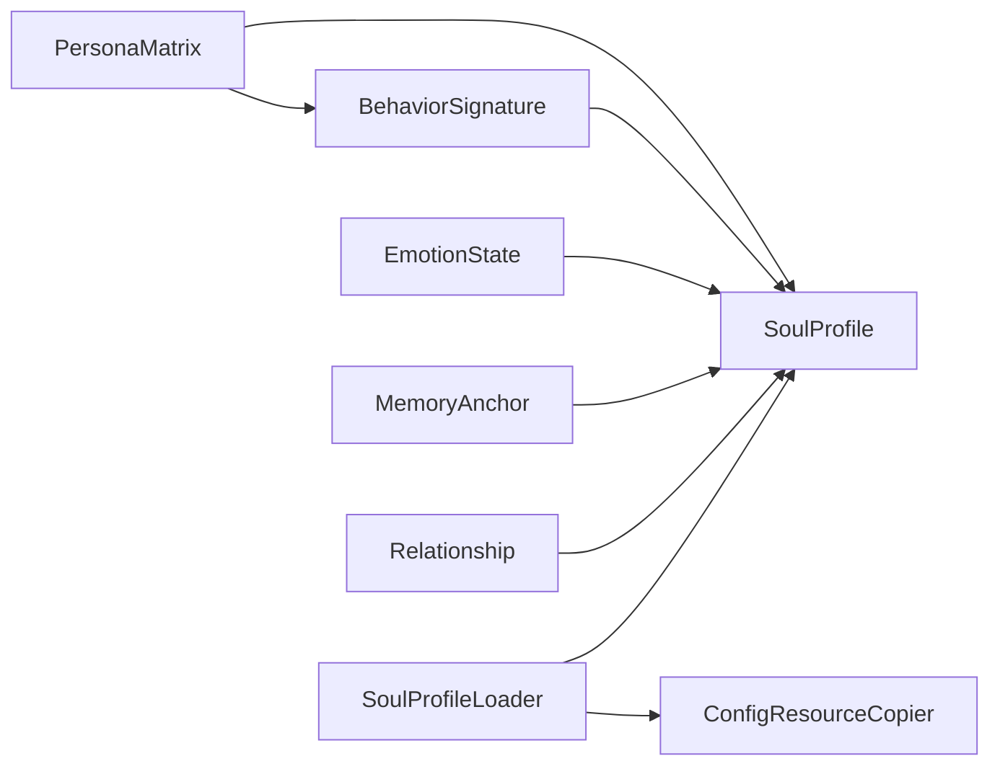

# 人格矩阵

<cite>
**本文引用的文件**
- [PersonaMatrix.java](file://src/main/java/adris/altoclef/player2api/soul/PersonaMatrix.java)
- [BehaviorSignature.java](file://src/main/java/adris/altoclef/player2api/soul/BehaviorSignature.java)
- [SoulProfile.java](file://src/main/java/adris/altoclef/player2api/soul/SoulProfile.java)
- [SoulProfileLoader.java](file://src/main/java/adris/altoclef/player2api/soul/SoulProfileLoader.java)
- [EmotionState.java](file://src/main/java/adris/altoclef/player2api/soul/EmotionState.java)
- [MemoryAnchor.java](file://src/main/java/adris/altoclef/player2api/soul/MemoryAnchor.java)
- [Relationship.java](file://src/main/java/adris/altoclef/player2api/soul/Relationship.java)
- [soul_Luna.json](file://src/main/resources/soul/soul_Luna.json)
- [soul_小悠.json](file://src/main/resources/soul/soul_小悠.json)
- [NPCMemoryCommand.java](file://src/main/java/adris/altoclef/commands/NPCMemoryCommand.java)
- [ConfigResourceCopier.java](file://src/main/java/adris/altoclef/player2api/utils/ConfigResourceCopier.java)
</cite>

## 目录
1. [简介](#简介)
2. [项目结构](#项目结构)
3. [核心组件](#核心组件)
4. [架构总览](#架构总览)
5. [详细组件分析](#详细组件分析)
6. [依赖关系分析](#依赖关系分析)
7. [性能考量](#性能考量)
8. [故障排查指南](#故障排查指南)
9. [结论](#结论)
10. [附录](#附录)

## 简介
本文件面向PersonaMatrix（人格矩阵）与SoulProfile（灵魂档案）的整体设计与实现，系统阐述：
- 如何定义与存储NPC的个性特征（大五人格模型）、行为倾向与价值观
- 人格矩阵在SoulProfile中的作用，以及如何通过deriveFromPersona()从人格矩阵派生行为签名
- 人格特征的配置选项、权重分配机制与动态调整策略
- 具体的人格矩阵配置示例、不同人格类型的实现案例与扩展开发指南
- 人格一致性维护、冲突处理与性能优化等关键技术问题

## 项目结构
围绕“人格矩阵”与“灵魂档案”的核心代码位于player2api/soul包下，配合配置文件与命令系统，形成可持久化、可交互、可扩展的NPC人格系统。

图表来源
- [PersonaMatrix.java:10-109](file://src/main/java/adris/altoclef/player2api/soul/PersonaMatrix.java#L10-L109)
- [BehaviorSignature.java:10-124](file://src/main/java/adris/altoclef/player2api/soul/BehaviorSignature.java#L10-L124)
- [SoulProfile.java:14-173](file://src/main/java/adris/altoclef/player2api/soul/SoulProfile.java#L14-L173)
- [SoulProfileLoader.java:25-216](file://src/main/java/adris/altoclef/player2api/soul/SoulProfileLoader.java#L25-L216)
- [EmotionState.java:9-128](file://src/main/java/adris/altoclef/player2api/soul/EmotionState.java#L9-L128)
- [MemoryAnchor.java:8-61](file://src/main/java/adris/altoclef/player2api/soul/MemoryAnchor.java#L8-L61)
- [Relationship.java:8-70](file://src/main/java/adris/altoclef/player2api/soul/Relationship.java#L8-L70)

章节来源
- [PersonaMatrix.java:10-109](file://src/main/java/adris/altoclef/player2api/soul/PersonaMatrix.java#L10-L109)
- [BehaviorSignature.java:10-124](file://src/main/java/adris/altoclef/player2api/soul/BehaviorSignature.java#L10-L124)
- [SoulProfile.java:14-173](file://src/main/java/adris/altoclef/player2api/soul/SoulProfile.java#L14-L173)
- [SoulProfileLoader.java:25-216](file://src/main/java/adris/altoclef/player2api/soul/SoulProfileLoader.java#L25-L216)

## 核心组件
- 人格矩阵（PersonaMatrix）：基于大五人格模型（开放性、尽责性、外向性、宜人性、神经质），每个维度范围[-100, +100]，用于刻画NPC的个性特征。
- 行为签名（BehaviorSignature）：从人格矩阵派生的行为倾向集合（主动性、风险承受、独立性、效率、忠诚度），同样范围[-100, +100]，用于指导NPC行动偏好。
- 灵魂档案（SoulProfile）：NPC的灵魂核心容器，聚合人格矩阵、情绪状态、行为签名、记忆锚点与关系图谱，并负责持久化与提示注入。
- 情绪状态（EmotionState）：8种基础情绪（joy, sadness, anger, fear, surprise, disgust, trust, anticipation），强度范围[0.0, 1.0]，支持自然衰减与主导情绪判定。
- 记忆锚点（MemoryAnchor）：独立于对话历史的永久性情感记忆，按情感权重与时效性评分，最多保留有限数量。
- 关系档案（Relationship）：NPC与特定玩家/实体的关系状态（亲密度、信任度、依赖度），并根据亲密度动态更新称谓。
- 加载器（SoulProfileLoader）：负责从JSON配置文件加载/保存SoulProfile，支持默认模板复制与回退策略。
- 配置文件（soul_Luna.json、soul_小悠.json）：提供人格矩阵、初始情绪、行为签名与运行时字段的示例配置。
- 命令（NPCMemoryCommand）：提供添加、列出、删除、清空记忆锚点的运行时管理能力。

章节来源
- [PersonaMatrix.java:10-109](file://src/main/java/adris/altoclef/player2api/soul/PersonaMatrix.java#L10-L109)
- [BehaviorSignature.java:10-124](file://src/main/java/adris/altoclef/player2api/soul/BehaviorSignature.java#L10-L124)
- [SoulProfile.java:14-173](file://src/main/java/adris/altoclef/player2api/soul/SoulProfile.java#L14-L173)
- [EmotionState.java:9-128](file://src/main/java/adris/altoclef/player2api/soul/EmotionState.java#L9-L128)
- [MemoryAnchor.java:8-61](file://src/main/java/adris/altoclef/player2api/soul/MemoryAnchor.java#L8-L61)
- [Relationship.java:8-70](file://src/main/java/adris/altoclef/player2api/soul/Relationship.java#L8-L70)
- [SoulProfileLoader.java:25-216](file://src/main/java/adris/altoclef/player2api/soul/SoulProfileLoader.java#L25-L216)
- [soul_Luna.json:1-61](file://src/main/resources/soul/soul_Luna.json#L1-L61)
- [soul_小悠.json:1-61](file://src/main/resources/soul/soul_小悠.json#L1-L61)
- [NPCMemoryCommand.java:16-106](file://src/main/java/adris/altoclef/commands/NPCMemoryCommand.java#L16-L106)

## 架构总览
SoulProfile作为中枢，将人格矩阵与行为签名解耦，前者决定后者，后者指导NPC行为；同时通过情绪状态与记忆锚点增强一致性与情境适应性；关系档案提供社交维度；加载器保证配置持久化与可恢复。

图表来源
- [PersonaMatrix.java:10-109](file://src/main/java/adris/altoclef/player2api/soul/PersonaMatrix.java#L10-L109)
- [BehaviorSignature.java:10-124](file://src/main/java/adris/altoclef/player2api/soul/BehaviorSignature.java#L10-L124)
- [SoulProfile.java:14-173](file://src/main/java/adris/altoclef/player2api/soul/SoulProfile.java#L14-L173)
- [SoulProfileLoader.java:25-216](file://src/main/java/adris/altoclef/player2api/soul/SoulProfileLoader.java#L25-L216)
- [EmotionState.java:9-128](file://src/main/java/adris/altoclef/player2api/soul/EmotionState.java#L9-L128)
- [MemoryAnchor.java:8-61](file://src/main/java/adris/altoclef/player2api/soul/MemoryAnchor.java#L8-L61)
- [Relationship.java:8-70](file://src/main/java/adris/altoclef/player2api/soul/Relationship.java#L8-L70)

## 详细组件分析

### 人格矩阵（PersonaMatrix）
- 设计原理
  - 基于大五人格模型，每个维度范围[-100, +100]，0为中性。
  - 提供fromMap()与toMap()用于序列化/反序列化，toPromptText()用于注入LLM提示词。
- 数据结构与复杂度
  - 字段访问O(1)，toMap()/toPromptText()线性遍历常数次（5维），空间O(1)。
- 关键实现要点
  - clamp()确保值域稳定，避免越界。
  - toPromptText()根据阈值生成行为指导文本，便于LLM理解。
- 与行为签名的关系
  - 行为签名通过deriveFromPersona()将人格矩阵映射为行为倾向。

章节来源
- [PersonaMatrix.java:10-109](file://src/main/java/adris/altoclef/player2api/soul/PersonaMatrix.java#L10-L109)

### 行为签名（BehaviorSignature）
- 设计原理
  - 从人格矩阵派生，默认映射规则体现维度间的心理关联（例如外向性影响主动性、尽责性影响独立性与效率、宜人性影响忠诚度、开放性与神经质反向影响风险承受）。
  - 支持手动覆盖，以满足特定角色需求。
- 数据结构与复杂度
  - 字段访问O(1)，deriveFromPersona()与toMap()/toPromptText()均为O(1)。
- 关键实现要点
  - clamp()确保值域稳定。
  - toPromptText()根据阈值生成行为指导文本，便于LLM理解。

章节来源
- [BehaviorSignature.java:10-124](file://src/main/java/adris/altoclef/player2api/soul/BehaviorSignature.java#L10-L124)

### 灵魂档案（SoulProfile）
- 设计原理
  - 聚合人格矩阵、情绪状态、行为签名、记忆锚点与关系图谱，提供持久化与提示注入能力。
  - 构造时自动从人格矩阵派生行为签名；支持定时情绪衰减；提供top记忆锚点与关系查询。
- 数据结构与复杂度
  - 内存锚点列表采用CopyOnWriteArrayList，读多写少场景友好；清理算法O(n log n)排序+线性删除。
  - 关系图谱采用ConcurrentHashMap，支持并发读写。
- 关键实现要点
  - toPromptInjection()整合人格、情绪、记忆锚点、关系与行为签名，形成注入LLM的系统提示。
  - toEmotionReminder()生成简短情绪提醒，辅助对话一致性。
  - save()委托SoulProfileLoader进行持久化。

章节来源
- [SoulProfile.java:14-173](file://src/main/java/adris/altoclef/player2api/soul/SoulProfile.java#L14-L173)

### 情绪状态（EmotionState）
- 设计原理
  - 8种基础情绪，强度范围[0.0, 1.0]，支持单次调整幅度限制（±0.25）防止瞬时爆表。
  - decay()按给定速率衰减，促进自然恢复。
  - getDominantEmotion()/getDominantIntensity()用于识别主导情绪，驱动对话语气。
- 数据结构与复杂度
  - Map访问O(1)，decay()线性遍历8种情绪，O(1)。
- 关键实现要点
  - clamp()确保强度合法。
  - toPromptText()输出主导情绪及其建议语调，便于LLM风格化表达。

章节来源
- [EmotionState.java:9-128](file://src/main/java/adris/altoclef/player2api/soul/EmotionState.java#L9-L128)

### 记忆锚点（MemoryAnchor）
- 设计原理
  - 独立于对话历史的永久性情感记忆，支持分类（event、preference、relationship、trauma）与情感权重。
  - getScore(now)综合情感权重与时效性（7天衰减），用于筛选与排序。
  - 最多保留固定数量（默认20），超出时按评分淘汰低分非永久锚点。
- 数据结构与复杂度
  - getScore()O(1)，清理时排序O(n log n)+线性扫描O(n)。
- 关键实现要点
  - permanent锚点永不删除，确保关键记忆留存。
  - toPromptText()简洁输出内容与关联信息，便于注入提示。

章节来源
- [MemoryAnchor.java:8-61](file://src/main/java/adris/altoclef/player2api/soul/MemoryAnchor.java#L8-L61)
- [SoulProfile.java:66-100](file://src/main/java/adris/altoclef/player2api/soul/SoulProfile.java#L66-L100)

### 关系档案（Relationship）
- 设计原理
  - 记录与特定玩家的亲密度、信任度、依赖度，动态更新称谓（如master/best_friend、close_friend、friend、acquaintance、distrusted、enemy）。
  - touch()记录最近互动时间，支持后续衰减或重连逻辑。
- 数据结构与复杂度
  - 字段访问O(1)，updateTitle()O(1)。
- 关键实现要点
  - clamp()确保值域稳定。
  - toPromptText()输出关系状态与建议态度，便于LLM社交表现。

章节来源
- [Relationship.java:8-70](file://src/main/java/adris/altoclef/player2api/soul/Relationship.java#L8-L70)

### 加载器（SoulProfileLoader）
- 设计原理
  - 优先从运行时配置目录加载；若不存在则从classpath资源复制默认模板，再加载。
  - 支持保存与加载所有字段（人格矩阵、情绪、行为签名、记忆锚点、关系）。
  - 回退策略：加载失败时创建中性人格的默认SoulProfile。
- 关计要点
  - ensureConfigExists()统一配置复制流程，避免重复代码。
  - sanitizeFileName()确保文件名安全。

章节来源
- [SoulProfileLoader.java:25-216](file://src/main/java/adris/altoclef/player2api/soul/SoulProfileLoader.java#L25-L216)
- [ConfigResourceCopier.java:18-59](file://src/main/java/adris/altoclef/player2api/utils/ConfigResourceCopier.java#L18-L59)

### 配置示例与不同人格类型
- 示例文件
  - [soul_Luna.json:1-61](file://src/main/resources/soul/soul_Luna.json#L1-L61)：展示高尽责性、中等外向性与较低神经质的角色，行为签名偏向高效与独立。
  - [soul_小悠.json:1-61](file://src/main/resources/soul/soul_小悠.json#L1-L61)：展示高外向性与较高宜人性的角色，行为签名偏向主动与忠诚。
- 不同人格类型的实现案例
  - 高尽责性型：强调效率与独立，适合需要稳定执行任务的NPC。
  - 高外向性型：强调主动与社交，适合需要互动与引导的NPC。
  - 高宜人性型：强调合作与忠诚，适合需要建立深厚关系的NPC。
- 扩展开发指南
  - 在配置文件中调整大五维度与初始情绪，即可快速生成新的人格类型。
  - 若需微调行为签名，可在配置文件中直接覆盖behaviorSignature字段，或通过代码在运行时调整。

章节来源
- [soul_Luna.json:1-61](file://src/main/resources/soul/soul_Luna.json#L1-L61)
- [soul_小悠.json:1-61](file://src/main/resources/soul/soul_小悠.json#L1-L61)

### 从人格矩阵派生行为签名（deriveFromPersona）
- 映射规则
  - 主动性 ← 外向性
  - 风险承受 ← 开放性 − 神经质/2
  - 独立性 ← 尽责性
  - 效率 ← 尽责性
  - 忠诚度 ← 宜人性
- 实现流程

图表来源
- [BehaviorSignature.java:30-43](file://src/main/java/adris/altoclef/player2api/soul/BehaviorSignature.java#L30-L43)
- [PersonaMatrix.java:49-53](file://src/main/java/adris/altoclef/player2api/soul/PersonaMatrix.java#L49-L53)

章节来源
- [BehaviorSignature.java:27-55](file://src/main/java/adris/altoclef/player2api/soul/BehaviorSignature.java#L27-L55)
- [PersonaMatrix.java:19-25](file://src/main/java/adris/altoclef/player2api/soul/PersonaMatrix.java#L19-L25)

### 记忆锚点评分与一致性维护
- 评分公式
  - recency = max(0, 1 − Δt/(7天))
  - score = emotionalWeight×0.6 + recency×0.4
- 维护策略
  - 按score降序保留，超过上限时删除最低分且非永久锚点。
  - permanent锚点永不删除，确保关键记忆留存。
- 流程图

图表来源
- [SoulProfile.java:81-91](file://src/main/java/adris/altoclef/player2api/soul/SoulProfile.java#L81-L91)
- [MemoryAnchor.java:50-54](file://src/main/java/adris/altoclef/player2api/soul/MemoryAnchor.java#L50-L54)

章节来源
- [SoulProfile.java:66-100](file://src/main/java/adris/altoclef/player2api/soul/SoulProfile.java#L66-L100)
- [MemoryAnchor.java:46-54](file://src/main/java/adris/altoclef/player2api/soul/MemoryAnchor.java#L46-L54)

### 情绪自然衰减与冲突处理
- 衰减策略
  - 每30秒衰减一次，每次衰减rate=0.1，加速恢复。
- 冲突处理
  - 单次调整幅度限制±0.25，避免瞬时情绪爆表。
  - 主导情绪强度阈值0.3用于判断是否显著，toEmotionReminder()仅在显著时输出。
- 流程图

图表来源
- [SoulProfile.java:120-126](file://src/main/java/adris/altoclef/player2api/soul/SoulProfile.java#L120-L126)
- [EmotionState.java:58-63](file://src/main/java/adris/altoclef/player2api/soul/EmotionState.java#L58-L63)

章节来源
- [SoulProfile.java:118-127](file://src/main/java/adris/altoclef/player2api/soul/SoulProfile.java#L118-L127)
- [EmotionState.java:36-48](file://src/main/java/adris/altoclef/player2api/soul/EmotionState.java#L36-L48)

## 依赖关系分析
- 组件耦合
  - PersonaMatrix与BehaviorSignature：单向依赖，通过deriveFromPersona()建立派生关系。
  - SoulProfile聚合多个子模块，但各子模块之间无直接依赖，降低耦合。
  - MemoryAnchor与Relationship通过SoulProfile间接管理，保持数据一致性。
- 外部依赖
  - Gson用于JSON序列化/反序列化。
  - Log4j用于日志记录。
  - Minecraft服务器端命令系统用于运行时管理记忆锚点。

图表来源
- [SoulProfileLoader.java:25-216](file://src/main/java/adris/altoclef/player2api/soul/SoulProfileLoader.java#L25-L216)
- [ConfigResourceCopier.java:18-59](file://src/main/java/adris/altoclef/player2api/utils/ConfigResourceCopier.java#L18-L59)

章节来源
- [SoulProfileLoader.java:25-216](file://src/main/java/adris/altoclef/player2api/soul/SoulProfileLoader.java#L25-L216)
- [ConfigResourceCopier.java:18-59](file://src/main/java/adris/altoclef/player2api/utils/ConfigResourceCopier.java#L18-L59)

## 性能考量
- 时间复杂度
  - 记忆锚点清理：排序O(n log n)，删除O(n)，总体O(n log n)。
  - 情绪衰减：每30秒一次，衰减O(1)。
  - 关系查询：ConcurrentHashMap读写O(1)均摊。
- 空间复杂度
  - 记忆锚点上限固定（默认20），避免无限增长。
  - 情绪状态固定8种，空间O(1)。
- 优化建议
  - 将记忆锚点评分缓存（如LRU）以减少重复计算。
  - 在高频tick中延迟或批量处理情绪衰减，避免频繁IO。
  - 使用更高效的序列化库（如Kryo）替代Gson以提升加载/保存性能。

## 故障排查指南
- 加载失败回退
  - 现象：无法从配置文件加载，日志报错。
  - 处理：加载器会创建中性人格的默认SoulProfile，确保系统可用。
- 记忆锚点过多
  - 现象：提示过长或性能下降。
  - 处理：系统自动清理最低分非永久锚点；可通过命令清理或设置permanent锚点。
- 情绪异常波动
  - 现象：情绪瞬时过高或过低。
  - 处理：单次调整幅度限制±0.25；若持续异常，检查事件触发逻辑或调低触发强度。
- 行为签名与期望不符
  - 现象：派生结果与预期不一致。
  - 处理：可在配置文件中直接覆盖behaviorSignature字段，或在运行时通过代码调整。

章节来源
- [SoulProfileLoader.java:42-57](file://src/main/java/adris/altoclef/player2api/soul/SoulProfileLoader.java#L42-L57)
- [SoulProfile.java:66-100](file://src/main/java/adris/altoclef/player2api/soul/SoulProfile.java#L66-L100)
- [EmotionState.java:36-48](file://src/main/java/adris/altoclef/player2api/soul/EmotionState.java#L36-L48)
- [BehaviorSignature.java:45-55](file://src/main/java/adris/altoclef/player2api/soul/BehaviorSignature.java#L45-L55)

## 结论
PersonaMatrix与SoulProfile共同构建了可配置、可持久化、可扩展的NPC人格系统。通过大五人格模型刻画个性，借助行为签名指导行动，结合情绪状态与记忆锚点维持一致性，辅以关系档案增强社交表现。加载器与命令系统保障了配置的灵活性与运行时可维护性。该体系既满足了当前需求，也为未来扩展提供了清晰路径。

## 附录
- 运行时管理命令
  - /npc_memory add <content>：添加记忆锚点
  - /npc_memory list：列出所有锚点
  - /npc_memory remove <id>：删除指定锚点
  - /npc_memory clear：清除非永久锚点
- 默认模板复制
  - 若运行时配置缺失，系统会从classpath复制默认模板至run/config/目录，确保首次使用即有配置。

章节来源
- [NPCMemoryCommand.java:16-106](file://src/main/java/adris/altoclef/commands/NPCMemoryCommand.java#L16-L106)
- [ConfigResourceCopier.java:29-37](file://src/main/java/adris/altoclef/player2api/utils/ConfigResourceCopier.java#L29-L37)