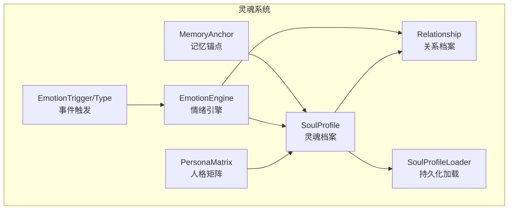
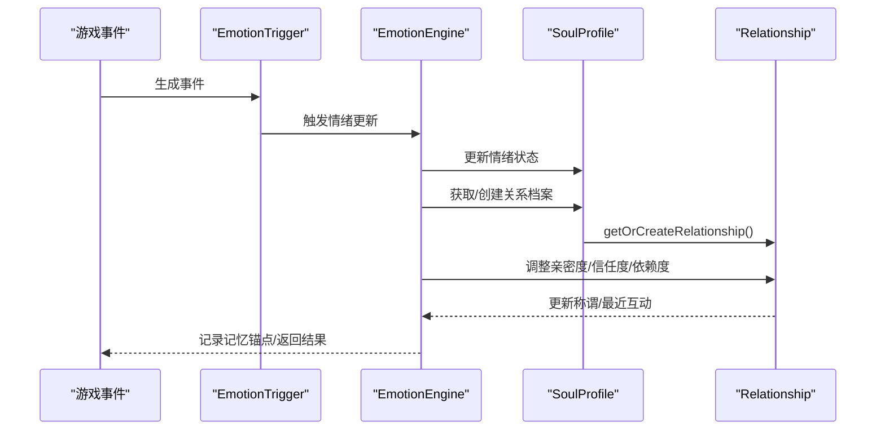
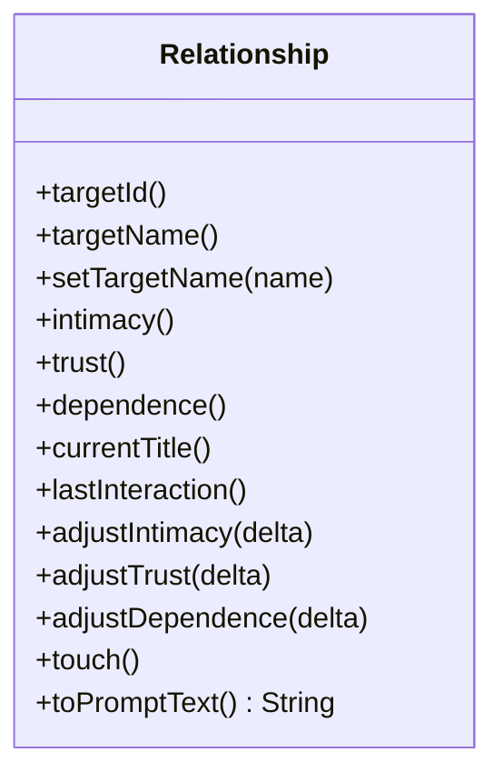
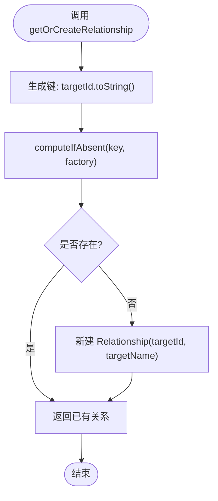
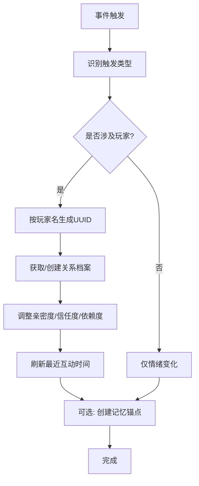
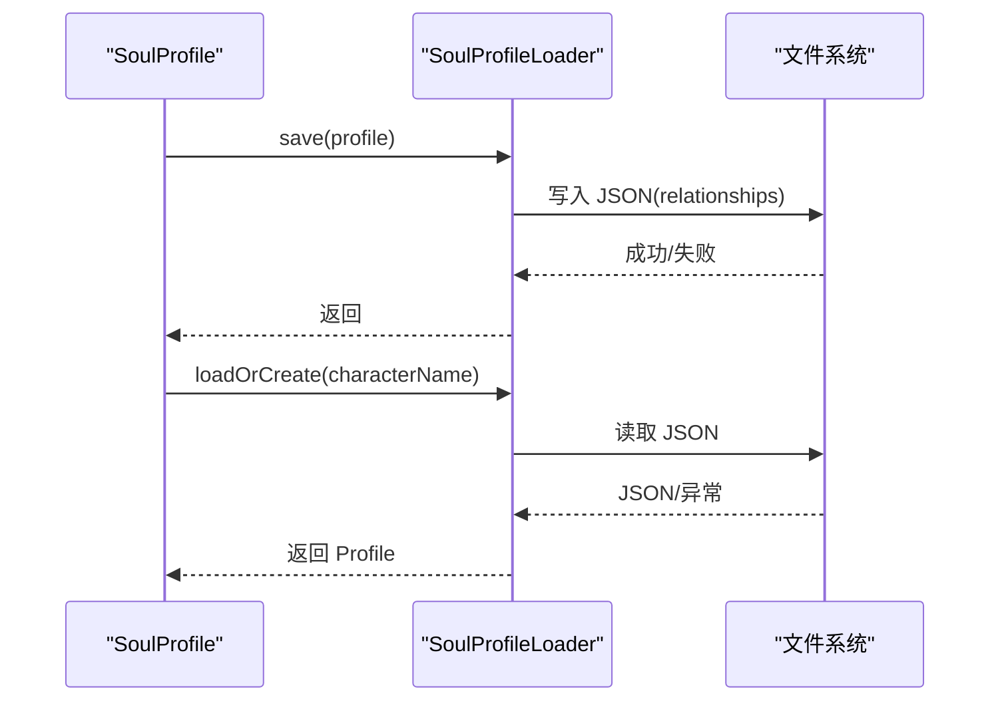
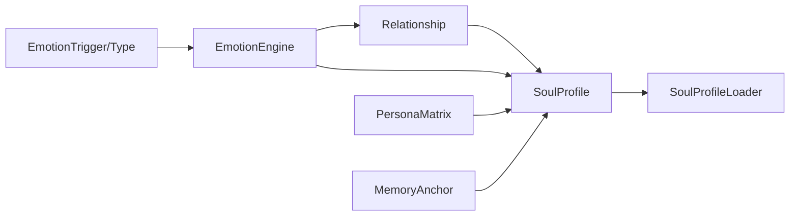

# 关系图谱

<cite>
**本文引用的文件**
- [Relationship.java](file://src/main/java/adris/altoclef/player2api/soul/Relationship.java)
- [SoulProfile.java](file://src/main/java/adris/altoclef/player2api/soul/SoulProfile.java)
- [EmotionEngine.java](file://src/main/java/adris/altoclef/player2api/soul/EmotionEngine.java)
- [SoulProfileLoader.java](file://src/main/java/adris/altoclef/player2api/soul/SoulProfileLoader.java)
- [EmotionTrigger.java](file://src/main/java/adris/altoclef/player2api/soul/EmotionTrigger.java)
- [EmotionTriggerType.java](file://src/main/java/adris/altoclef/player2api/soul/EmotionTriggerType.java)
- [MemoryAnchor.java](file://src/main/java/adris/altoclef/player2api/soul/MemoryAnchor.java)
- [PersonaMatrix.java](file://src/main/java/adris/altoclef/player2api/soul/PersonaMatrix.java)
- [AI_NPC项目整体架构概览.md](file://docs/AI_NPC项目整体架构概览.md)
- [AI_NPC灵魂特质交互优化方案.md](file://docs/AI_NPC灵魂特质交互优化方案.md)
</cite>

## 目录
1. [简介](#简介)
2. [项目结构](#项目结构)
3. [核心组件](#核心组件)
4. [架构总览](#架构总览)
5. [详细组件分析](#详细组件分析)
6. [依赖分析](#依赖分析)
7. [性能考量](#性能考量)
8. [故障排查指南](#故障排查指南)
9. [结论](#结论)
10. [附录](#附录)

## 简介
本文件围绕“关系图谱（Relationship）”展开，系统性阐述其设计原理、实现机制与在多玩家环境中的管理策略。重点覆盖：
- 关系档案的数据结构与演进规则
- getOrCreateRelationship() 的懒加载与并发安全
- 关系评分与动态调整策略
- 关系建立的触发条件、互动影响因素与深化路径
- 多玩家关系管理、冲突处理与群体关系动态
- 关系可视化、统计分析与个性化响应
- 持久化、并发安全与性能优化

## 项目结构
关系图谱位于“灵魂系统（Soul System）”子模块中，与人格矩阵、情绪状态、记忆锚点、行为签名共同构成 NPC 的“灵魂状态”。核心文件如下：
- Relationship：关系档案的最小单元
- SoulProfile：承载 NPC 的灵魂状态，包含关系图谱
- EmotionEngine：基于事件驱动的关系演化与情绪联动
- SoulProfileLoader：关系数据的持久化与加载
- EmotionTrigger/EmotionTriggerType：事件来源与分类
- MemoryAnchor/PersonaMatrix：辅助关系演化的上下文要素

**图表来源**
- [SoulProfile.java:14-55](file://src/main/java/adris/altoclef/player2api/soul/SoulProfile.java#L14-L55)
- [Relationship.java:8-30](file://src/main/java/adris/altoclef/player2api/soul/Relationship.java#L8-L30)
- [EmotionEngine.java:11-171](file://src/main/java/adris/altoclef/player2api/soul/EmotionEngine.java#L11-L171)
- [SoulProfileLoader.java:25-130](file://src/main/java/adris/altoclef/player2api/soul/SoulProfileLoader.java#L25-L130)
- [EmotionTrigger.java:6-19](file://src/main/java/adris/altoclef/player2api/soul/EmotionTrigger.java#L6-L19)
- [EmotionTriggerType.java:6-39](file://src/main/java/adris/altoclef/player2api/soul/EmotionTriggerType.java#L6-L39)

**章节来源**
- [SoulProfile.java:14-55](file://src/main/java/adris/altoclef/player2api/soul/SoulProfile.java#L14-L55)
- [AI_NPC项目整体架构概览.md:527-570](file://docs/AI_NPC项目整体架构概览.md#L527-L570)

## 核心组件
- Relationship：封装单个玩家/实体的关系档案，包含目标ID、名称、亲密度、信任度、依赖度、当前称谓、最近互动时间，并提供调整与标题映射。
- SoulProfile：聚合人格、情绪、记忆锚点与关系图谱，提供 getOrCreateRelationship() 的懒加载接口，负责将关系注入 Prompt。
- EmotionEngine：根据 EmotionTriggerType 分类应用情绪变化，同时联动关系档案的亲密度、信任度与依赖度调整。
- SoulProfileLoader：负责关系数据的序列化与反序列化，确保关系状态可持久化。
- EmotionTrigger/EmotionTriggerType：事件来源与类型枚举，驱动关系与情绪的动态演化。
- MemoryAnchor/PersonaMatrix：提供关系演化的背景权重与倾向性，增强关系的合理性与一致性。

**章节来源**
- [Relationship.java:8-69](file://src/main/java/adris/altoclef/player2api/soul/Relationship.java#L8-L69)
- [SoulProfile.java:101-116](file://src/main/java/adris/altoclef/player2api/soul/SoulProfile.java#L101-L116)
- [EmotionEngine.java:17-182](file://src/main/java/adris/altoclef/player2api/soul/EmotionEngine.java#L17-L182)
- [SoulProfileLoader.java:107-130](file://src/main/java/adris/altoclef/player2api/soul/SoulProfileLoader.java#L107-L130)
- [EmotionTriggerType.java:6-39](file://src/main/java/adris/altoclef/player2api/soul/EmotionTriggerType.java#L6-L39)

## 架构总览
关系图谱在 NPC 灵魂系统中的位置与交互如下：

**图表来源**
- [EmotionEngine.java:17-182](file://src/main/java/adris/altoclef/player2api/soul/EmotionEngine.java#L17-L182)
- [SoulProfile.java:101-105](file://src/main/java/adris/altoclef/player2api/soul/SoulProfile.java#L101-L105)
- [Relationship.java:32-44](file://src/main/java/adris/altoclef/player2api/soul/Relationship.java#L32-L44)

## 详细组件分析

### Relationship：关系档案
- 数据字段
  - 目标ID与名称：唯一标识关系对象
  - 亲密度、信任度、依赖度：三元情感指标，范围[-100, 100]
  - 当前称谓：基于亲密度映射的口语化称呼
  - 最近互动时间：用于关系活性与提示
- 关键方法
  - adjustIntimacy/trust/dependence：调整对应指标并进行边界裁剪
  - updateTitle：根据亲密度区间映射称谓
  - toPromptText：生成可用于 LLM Prompt 的关系描述
  - touch：刷新最近互动时间
- 设计要点
  - 指标边界裁剪保证稳定性
  - 称谓映射提供自然语言提示
  - toPromptText 为对话与行为提供上下文

**图表来源**
- [Relationship.java:8-69](file://src/main/java/adris/altoclef/player2api/soul/Relationship.java#L8-L69)

**章节来源**
- [Relationship.java:8-69](file://src/main/java/adris/altoclef/player2api/soul/Relationship.java#L8-L69)

### SoulProfile：关系图谱容器
- 关系图谱存储
  - 使用并发安全的 Map 存储关系，键为 UUID 字符串，值为 Relationship
- 关系访问
  - getOrCreateRelationship：基于 computeIfAbsent 的懒加载，避免重复创建
  - getRelationship：直接查询
- Prompt 注入
  - toPromptInjection：将关系描述注入 LLM Prompt，辅助个性化响应
- 持久化
  - save：委托 SoulProfileLoader 保存关系数据

**图表来源**
- [SoulProfile.java:101-105](file://src/main/java/adris/altoclef/player2api/soul/SoulProfile.java#L101-L105)

**章节来源**
- [SoulProfile.java:27-28](file://src/main/java/adris/altoclef/player2api/soul/SoulProfile.java#L27-L28)
- [SoulProfile.java:101-109](file://src/main/java/adris/altoclef/player2api/soul/SoulProfile.java#L101-L109)
- [SoulProfile.java:133-159](file://src/main/java/adris/altoclef/player2api/soul/SoulProfile.java#L133-L159)

### EmotionEngine：关系演化引擎
- 事件驱动
  - 基于 EmotionTriggerType 的分支，对不同事件施加情绪变化
- 关系联动
  - 针对玩家称赞、责备、攻击、送礼、死亡等事件，分别调整亲密度、信任度、依赖度
  - 使用 updateRelationshipByName：以玩家名派生稳定 UUID，获取/创建关系并调整指标
- 记忆锚点
  - 针对创伤事件创建记忆锚点，强化关系演化的长期影响

**图表来源**
- [EmotionEngine.java:23-182](file://src/main/java/adris/altoclef/player2api/soul/EmotionEngine.java#L23-L182)

**章节来源**
- [EmotionEngine.java:17-182](file://src/main/java/adris/altoclef/player2api/soul/EmotionEngine.java#L17-L182)
- [EmotionTriggerType.java:6-39](file://src/main/java/adris/altoclef/player2api/soul/EmotionTriggerType.java#L6-L39)

### 持久化与加载：SoulProfileLoader
- 保存
  - 将关系列表序列化为 JSON 数组，包含目标ID、名称、三元指标、称谓与最近互动时间
- 加载
  - 从 JSON 反序列化关系，重建 Relationship 对象并放入 Map
- 文件策略
  - 优先加载运行时配置目录下的文件，不存在则从资源模板复制默认配置

**图表来源**
- [SoulProfileLoader.java:62-130](file://src/main/java/adris/altoclef/player2api/soul/SoulProfileLoader.java#L62-L130)
- [SoulProfileLoader.java:132-211](file://src/main/java/adris/altoclef/player2api/soul/SoulProfileLoader.java#L132-L211)

**章节来源**
- [SoulProfileLoader.java:62-130](file://src/main/java/adris/altoclef/player2api/soul/SoulProfileLoader.java#L62-L130)
- [SoulProfileLoader.java:193-207](file://src/main/java/adris/altoclef/player2api/soul/SoulProfileLoader.java#L193-L207)

### 关系建立与深化：触发条件与影响因素
- 触发条件
  - 玩家互动事件：称赞、责备、攻击、送礼、死亡、加入/离开
  - 环境与游戏事件：日出/日落、下雨/打雷、发现稀有物品、进入危险区域、任务成败
- 影响因素
  - 人格矩阵：外向性影响快乐程度，宜人性影响共情，神经质影响恐惧阈值
  - 记忆锚点：强化或削弱关系的长期权重
- 深化路径
  - 亲密度提升 → 称谓升级 → 更多信任与依赖 → 个性化响应与自主行为

**章节来源**
- [EmotionEngine.java:23-182](file://src/main/java/adris/altoclef/player2api/soul/EmotionEngine.java#L23-L182)
- [PersonaMatrix.java:58-94](file://src/main/java/adris/altoclef/player2api/soul/PersonaMatrix.java#L58-L94)
- [MemoryAnchor.java:46-59](file://src/main/java/adris/altoclef/player2api/soul/MemoryAnchor.java#L46-L59)

### 多玩家关系管理与冲突处理
- 多玩家管理
  - 每个玩家/实体拥有独立的 Relationship，键为 UUID 字符串，避免交叉污染
  - 使用并发 Map 与 computeIfAbsent 保证线程安全
- 冲突与动态
  - 不同玩家事件可能对同一 NPC 产生相反影响，需通过累计权重与时间衰减平衡
  - 建议引入“关系评分函数”，综合亲密度、信任度、依赖度与时间因子，形成统一的优先级

**章节来源**
- [SoulProfile.java:27-28](file://src/main/java/adris/altoclef/player2api/soul/SoulProfile.java#L27-L28)
- [SoulProfile.java:101-105](file://src/main/java/adris/altoclef/player2api/soul/SoulProfile.java#L101-L105)

### 可视化、统计与个性化响应
- 可视化
  - 将关系指标与称谓映射为 UI 文本或图标，便于玩家理解 NPC 态度
- 统计分析
  - 按玩家维度统计平均亲密度、信任度分布，识别关系热点与冷点
- 个性化响应
  - 通过 toPromptText 将关系状态注入 LLM，使 NPC 的语言与行为随关系变化

**章节来源**
- [Relationship.java:46-64](file://src/main/java/adris/altoclef/player2api/soul/Relationship.java#L46-L64)
- [SoulProfile.java:133-159](file://src/main/java/adris/altoclef/player2api/soul/SoulProfile.java#L133-L159)

## 依赖分析
- 组件耦合
  - Relationship 与 SoulProfile：前者为后者容器中的元素
  - EmotionEngine 依赖 SoulProfile 获取/创建关系并调整指标
  - SoulProfileLoader 依赖 Relationship 的序列化字段
- 外部依赖
  - 并发集合：ConcurrentHashMap/CopyOnWriteArrayList 保障多线程安全
  - JSON 序列化：Gson 用于关系数据的持久化

**图表来源**
- [SoulProfile.java:14-55](file://src/main/java/adris/altoclef/player2api/soul/SoulProfile.java#L14-L55)
- [EmotionEngine.java:17-182](file://src/main/java/adris/altoclef/player2api/soul/EmotionEngine.java#L17-L182)
- [SoulProfileLoader.java:107-120](file://src/main/java/adris/altoclef/player2api/soul/SoulProfileLoader.java#L107-L120)

**章节来源**
- [SoulProfile.java:14-55](file://src/main/java/adris/altoclef/player2api/soul/SoulProfile.java#L14-L55)
- [SoulProfileLoader.java:107-120](file://src/main/java/adris/altoclef/player2api/soul/SoulProfileLoader.java#L107-L120)

## 性能考量
- 懒加载与并发
  - computeIfAbsent 与 ConcurrentHashMap 减少锁竞争，适合高频访问
- 序列化成本
  - 关系列表规模可控，建议限制最大数量并定期清理低分关系
- 时间衰减
  - 通过最近互动时间与记忆锚点时效性控制关系活性，避免无限膨胀

[本节为通用性能建议，无需具体文件引用]

## 故障排查指南
- 关系未更新
  - 检查事件是否正确生成与传递至 EmotionEngine
  - 确认 updateRelationshipByName 的玩家名是否可解析为稳定 UUID
- 并发异常
  - 确保使用 getOrCreateRelationship 的并发安全路径
- 持久化失败
  - 检查配置目录权限与 JSON 结构一致性
- 称谓不生效
  - 核对亲密度阈值映射与 toPromptText 输出

**章节来源**
- [EmotionEngine.java:173-182](file://src/main/java/adris/altoclef/player2api/soul/EmotionEngine.java#L173-L182)
- [SoulProfileLoader.java:62-130](file://src/main/java/adris/altoclef/player2api/soul/SoulProfileLoader.java#L62-L130)
- [Relationship.java:37-44](file://src/main/java/adris/altoclef/player2api/soul/Relationship.java#L37-L44)

## 结论
关系图谱通过“事件驱动 + 指标演进 + 上下文融合”的方式，实现了 NPC 与玩家之间的动态关系。结合人格矩阵、记忆锚点与行为签名，关系不仅具备可观察的数值变化，还能在对话与行为层面体现个性化与一致性。未来可在关系评分函数、冲突消解与群体关系动态方面进一步优化，以支撑更大规模的多人交互场景。

[本节为总结性内容，无需具体文件引用]

## 附录

### 关系评分与动态调整策略（建议）
- 评分函数
  - score = f(intimacy, trust, dependence, recency, weight)
  - 权重可来自记忆锚点情感权重与人格倾向
- 动态调整
  - 事件发生后，按权重对指标进行增量调整并裁剪至[-100, 100]
  - 定期衰减以避免关系固化

[本节为概念性建议，无需具体文件引用]

### 多玩家环境下的群体关系动态（建议）
- 群体冲突
  - 引入“关系影响力矩阵”，衡量玩家间关系对 NPC 的相对权重
- 优先级策略
  - 基于最近互动时间与影响力权重，对 NPC 的响应进行加权聚合

[本节为概念性建议，无需具体文件引用]