# 情感引擎

<cite>
**本文引用的文件**
- [EmotionEngine.java](file://src/main/java/adris/altoclef/player2api/soul/EmotionEngine.java)
- [EmotionState.java](file://src/main/java/adris/altoclef/player2api/soul/EmotionState.java)
- [EmotionTrigger.java](file://src/main/java/adris/altoclef/player2api/soul/EmotionTrigger.java)
- [EmotionTriggerType.java](file://src/main/java/adris/altoclef/player2api/soul/EmotionTriggerType.java)
- [SoulProfile.java](file://src/main/java/adris/altoclef/player2api/soul/SoulProfile.java)
- [MemoryAnchor.java](file://src/main/java/adris/altoclef/player2api/soul/MemoryAnchor.java)
- [Relationship.java](file://src/main/java/adris/altoclef/player2api/soul/Relationship.java)
- [PersonaMatrix.java](file://src/main/java/adris/altoclef/player2api/soul/PersonaMatrix.java)
- [BehaviorSignature.java](file://src/main/java/adris/altoclef/player2api/soul/BehaviorSignature.java)
- [SoulProfileLoader.java](file://src/main/java/adris/altoclef/player2api/soul/SoulProfileLoader.java)
- [AgentConversationData.java](file://src/main/java/adris/altoclef/player2api/AgentConversationData.java)
- [EntityDeathEvent.java](file://src/main/java/adris/altoclef/eventbus/events/EntityDeathEvent.java)
- [PlayerDamageEvent.java](file://src/main/java/adris/altoclef/eventbus/events/PlayerDamageEvent.java)
</cite>

## 目录
1. [简介](#简介)
2. [项目结构](#项目结构)
3. [核心组件](#核心组件)
4. [架构总览](#架构总览)
5. [详细组件分析](#详细组件分析)
6. [依赖分析](#依赖分析)
7. [性能考虑](#性能考虑)
8. [故障排查指南](#故障排查指南)
9. [结论](#结论)
10. [附录](#附录)

## 简介
本技术文档围绕情感引擎系统展开，系统采用事件驱动架构，通过“情感触发器”驱动“情感状态”的变化，并结合“人格矩阵”“行为签名”“记忆锚点”“关系档案”等模块，形成完整的NPC心理世界与对话表达闭环。文档重点解释以下内容：
- 情感产生、维持、衰减与表达的机制
- tickEmotionDecay() 自然衰减算法与情感强度计算
- 不同类型情感触发器的触发条件与响应机制
- 情感状态对NPC行为与对话的影响
- 配置选项、调试方法与性能优化策略
- 完整的情感模拟示例、常见问题解决方案与扩展开发指南

## 项目结构
情感引擎位于 player2api/soul 包内，围绕“触发器-状态-档案-持久化”主线组织代码；同时在 AgentConversationData 中接入事件总线与LLM提示词注入，实现从游戏事件到NPC情感表达的闭环。

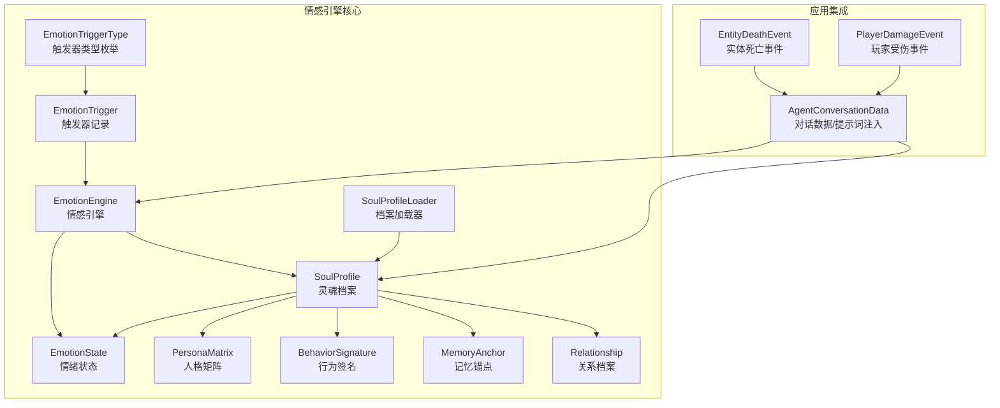

图表来源
- [EmotionEngine.java:17-171](file://src/main/java/adris/altoclef/player2api/soul/EmotionEngine.java#L17-L171)
- [SoulProfile.java:118-126](file://src/main/java/adris/altoclef/player2api/soul/SoulProfile.java#L118-L126)
- [SoulProfileLoader.java:35-57](file://src/main/java/adris/altoclef/player2api/soul/SoulProfileLoader.java#L35-L57)
- [AgentConversationData.java:197-200](file://src/main/java/adris/altoclef/player2api/AgentConversationData.java#L197-L200)

章节来源
- [EmotionEngine.java:11-171](file://src/main/java/adris/altoclef/player2api/soul/EmotionEngine.java#L11-L171)
- [SoulProfile.java:14-173](file://src/main/java/adris/altoclef/player2api/soul/SoulProfile.java#L14-L173)
- [SoulProfileLoader.java:25-130](file://src/main/java/adris/altoclef/player2api/soul/SoulProfileLoader.java#L25-L130)
- [AgentConversationData.java:197-200](file://src/main/java/adris/altoclef/player2api/AgentConversationData.java#L197-L200)

## 核心组件
- 情感触发器类型（EmotionTriggerType）：定义所有可导致NPC情绪变化的游戏事件类别，如玩家互动、环境事件、游戏事件、任务事件、社交事件等。
- 情感触发器（EmotionTrigger）：封装触发事件的类型及上下文信息（如玩家名、物品名、物品价值）。
- 情绪状态（EmotionState）：维护8种基础情绪（joy、sadness、anger、fear、surprise、disgust、trust、anticipation），提供调整、衰减、主导情绪识别与提示文本生成。
- 情感引擎（EmotionEngine）：根据触发器类型与人格矩阵，对情绪状态进行增量调整，并更新关系与记忆锚点。
- 灵魂档案（SoulProfile）：聚合人格矩阵、情绪状态、行为签名、记忆锚点与关系图谱，负责自然衰减、提示词注入与持久化。
- 记忆锚点（MemoryAnchor）：独立于对话历史的长期情感记忆，带分类、情感权重与时效评分。
- 关系档案（Relationship）：记录NPC与特定玩家/实体的关系状态（亲密度、信任度、依赖度）与称谓演进。
- 人格矩阵（PersonaMatrix）：基于大五人格模型的静态特征集合，决定情绪反应与行为倾向。
- 行为签名（BehaviorSignature）：从人格矩阵推导的行动偏好集合，影响NPC的主动性、风险承受、独立性、效率与忠诚度。
- 档案加载器（SoulProfileLoader）：负责从资源文件加载或保存JSON配置，支持默认模板复制与回退策略。

章节来源
- [EmotionTriggerType.java:6-39](file://src/main/java/adris/altoclef/player2api/soul/EmotionTriggerType.java#L6-L39)
- [EmotionTrigger.java:6-19](file://src/main/java/adris/altoclef/player2api/soul/EmotionTrigger.java#L6-L19)
- [EmotionState.java:9-127](file://src/main/java/adris/altoclef/player2api/soul/EmotionState.java#L9-L127)
- [EmotionEngine.java:11-183](file://src/main/java/adris/altoclef/player2api/soul/EmotionEngine.java#L11-L183)
- [SoulProfile.java:14-173](file://src/main/java/adris/altoclef/player2api/soul/SoulProfile.java#L14-L173)
- [MemoryAnchor.java:8-60](file://src/main/java/adris/altoclef/player2api/soul/MemoryAnchor.java#L8-L60)
- [Relationship.java:8-69](file://src/main/java/adris/altoclef/player2api/soul/Relationship.java#L8-L69)
- [PersonaMatrix.java:10-110](file://src/main/java/adris/altoclef/player2api/soul/PersonaMatrix.java#L10-L110)
- [BehaviorSignature.java:10-123](file://src/main/java/adris/altoclef/player2api/soul/BehaviorSignature.java#L10-L123)
- [SoulProfileLoader.java:25-216](file://src/main/java/adris/altoclef/player2api/soul/SoulProfileLoader.java#L25-L216)

## 架构总览
情感引擎采用事件驱动架构：外部事件（如任务完成/失败、玩家伤害、实体死亡等）通过AgentConversationData转换为EmotionTrigger，交由EmotionEngine根据SoulProfile的人格矩阵与当前情绪状态进行调整，随后更新记忆锚点与关系，并通过SoulProfile的提示词注入接口将当前情感状态注入LLM系统提示词，从而影响NPC的对话风格与表达。

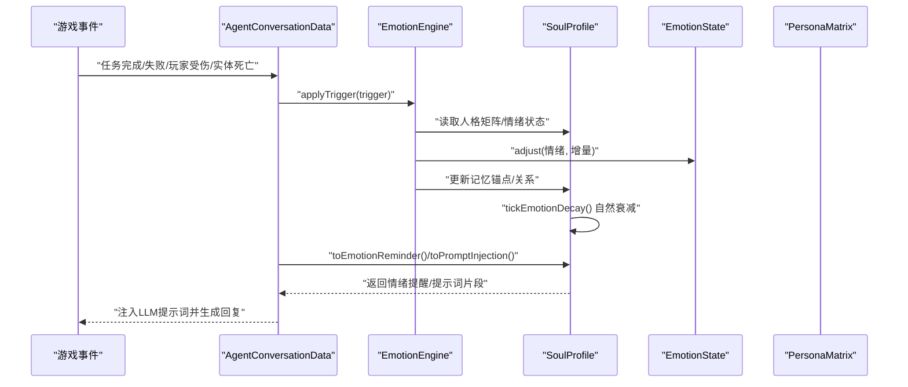

图表来源
- [AgentConversationData.java:337-376](file://src/main/java/adris/altoclef/player2api/AgentConversationData.java#L337-L376)
- [EmotionEngine.java:17-171](file://src/main/java/adris/altoclef/player2api/soul/EmotionEngine.java#L17-L171)
- [SoulProfile.java:120-126](file://src/main/java/adris/altoclef/player2api/soul/SoulProfile.java#L120-L126)

## 详细组件分析

### 组件一：情感状态管理（EmotionState）
- 数据结构：内部以键值映射存储8种基础情绪，初始均为0.0，上限1.0，下限0.0。
- 调整策略：单次调整幅度限制在±0.25以内，避免情绪瞬时爆表；提供绝对设置与相对调整两种接口。
- 主导情绪：遍历找出最高强度情绪及其强度阈值（>0.3f视为显著）。
- 提示文本：仅输出强度>5%的情绪，并在主导情绪强度>50%时附加对话语气指导。

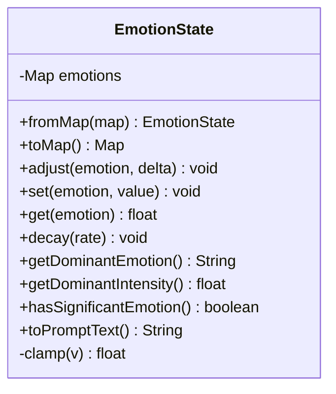

图表来源
- [EmotionState.java:9-127](file://src/main/java/adris/altoclef/player2api/soul/EmotionState.java#L9-L127)

章节来源
- [EmotionState.java:9-127](file://src/main/java/adris/altoclef/player2api/soul/EmotionState.java#L9-L127)

### 组件二：情感触发器与触发类型（EmotionTrigger、EmotionTriggerType）
- 触发器类型覆盖：
  - 玩家互动：称赞、责备、攻击、送礼、玩家死亡、玩家加入/离开
  - 环境事件：日出、日落、下雨、打雷
  - 游戏事件：发现钻石、稀有物品、进入洞穴/下界/末地、苦力怕靠近、低血量
  - 任务事件：完成、失败、取消
  - 社交事件：遇到新NPC、被其他NPC问候
- 触发器记录：携带触发类型与上下文（玩家名、物品名、物品价值），便于引擎按需使用。

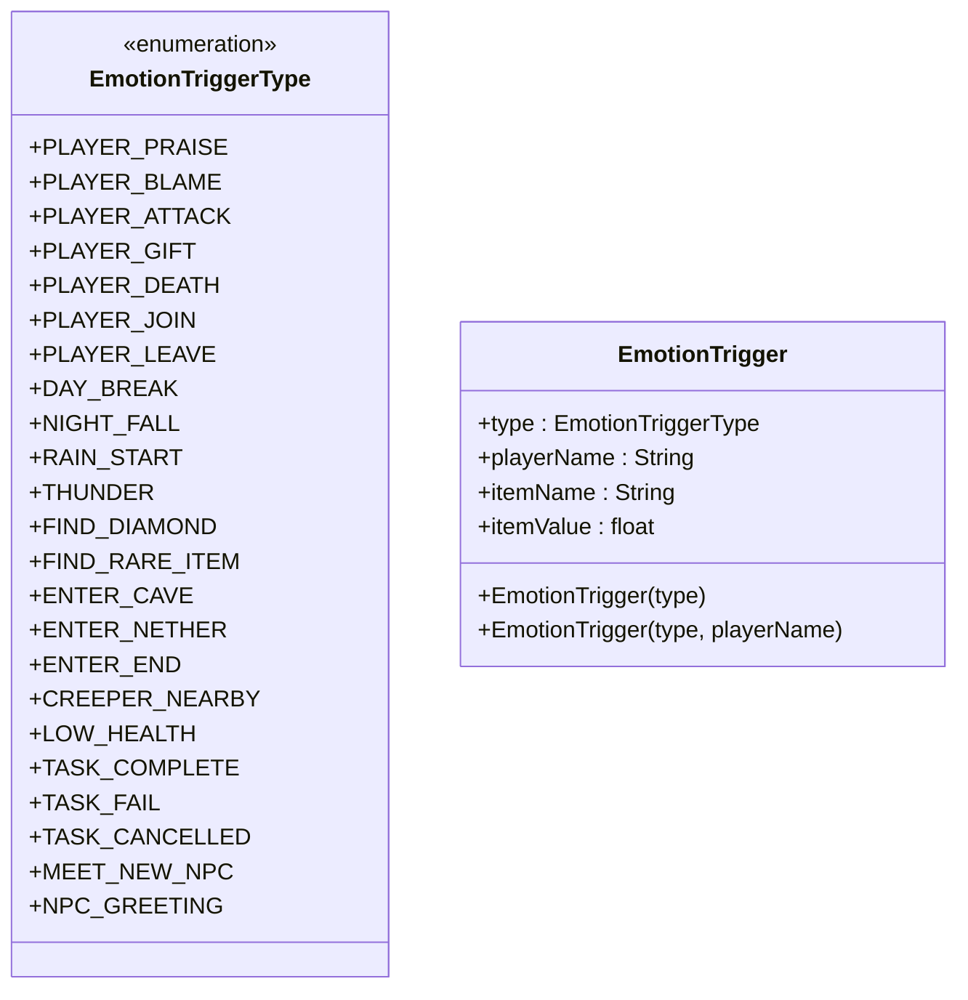

图表来源
- [EmotionTriggerType.java:6-39](file://src/main/java/adris/altoclef/player2api/soul/EmotionTriggerType.java#L6-L39)
- [EmotionTrigger.java:6-19](file://src/main/java/adris/altoclef/player2api/soul/EmotionTrigger.java#L6-L19)

章节来源
- [EmotionTriggerType.java:6-39](file://src/main/java/adris/altoclef/player2api/soul/EmotionTriggerType.java#L6-L39)
- [EmotionTrigger.java:6-19](file://src/main/java/adris/altoclef/player2api/soul/EmotionTrigger.java#L6-L19)

### 组件三：情感引擎（EmotionEngine）
- 控制流：根据触发器类型分支，读取人格矩阵与当前情绪状态，对目标情绪进行增量调整；部分事件同步更新关系与记忆锚点；最后记录日志并输出主导情绪信息。
- 人格影响：不同维度（外向性、宜人性、神经质、尽责性）对情绪反应强度与方向产生加权影响。
- 关系与记忆：根据玩家名生成稳定UUID，更新关系档案；对重要事件创建记忆锚点，保留高分锚点并按时间衰减。

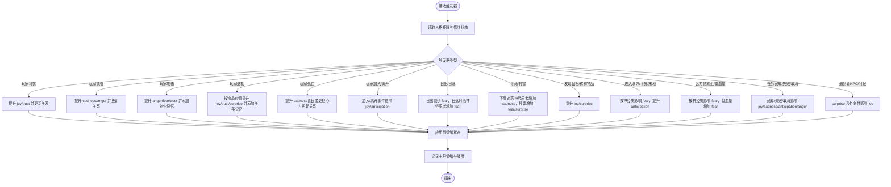

图表来源
- [EmotionEngine.java:17-171](file://src/main/java/adris/altoclef/player2api/soul/EmotionEngine.java#L17-L171)

章节来源
- [EmotionEngine.java:17-171](file://src/main/java/adris/altoclef/player2api/soul/EmotionEngine.java#L17-L171)

### 组件四：灵魂档案与自然衰减（SoulProfile）
- 自然衰减：每30秒对所有情绪执行0.1的衰减，使情绪随时间平滑回归基线，加速恢复。
- 提示词注入：将人格、情绪、记忆锚点、关系与行为倾向拼接为系统提示词片段，供LLM使用。
- 情绪提醒：当存在显著情绪时，生成简短提醒，指导对话语气与措辞。

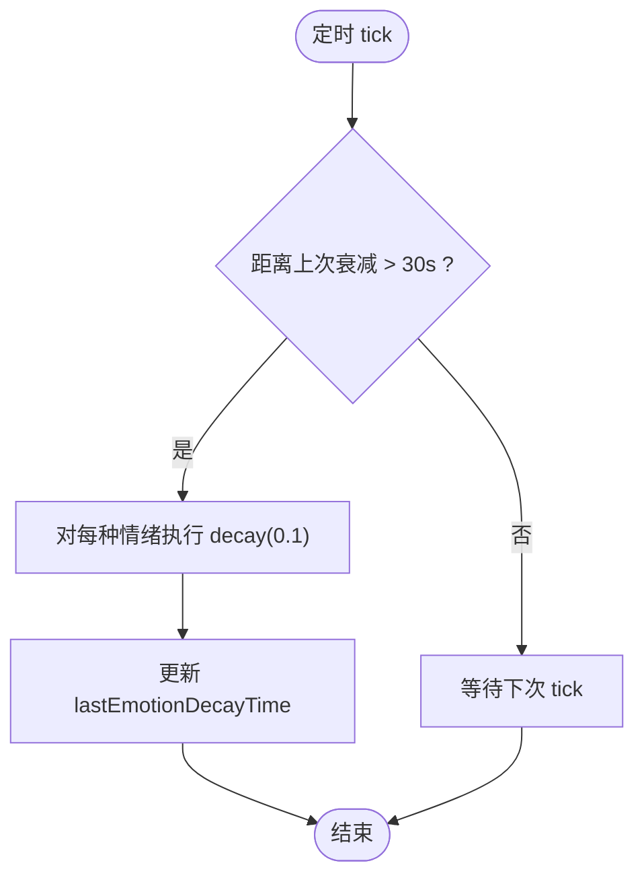

图表来源
- [SoulProfile.java:120-126](file://src/main/java/adris/altoclef/player2api/soul/SoulProfile.java#L120-L126)

章节来源
- [SoulProfile.java:118-173](file://src/main/java/adris/altoclef/player2api/soul/SoulProfile.java#L118-L173)

### 组件五：记忆锚点与关系档案（MemoryAnchor、Relationship）
- 记忆锚点：带分类（如trauma、relationship）、情感权重与时间戳，按权重与时效评分计算综合分数，保留高分锚点并限制数量。
- 关系档案：以亲密度为核心，动态更新称谓（如stranger/friend/close_friend/master/best_friend/enemy），并记录信任度与依赖度。

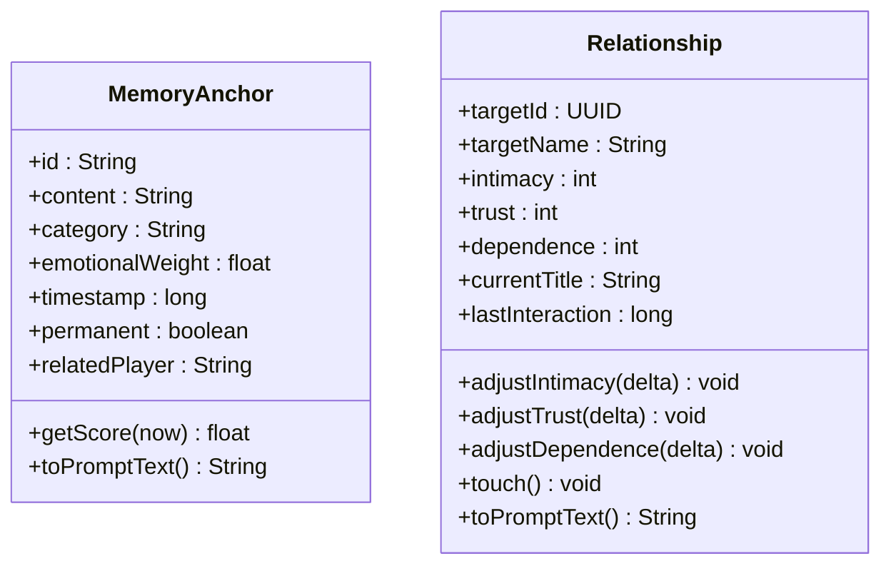

图表来源
- [MemoryAnchor.java:8-60](file://src/main/java/adris/altoclef/player2api/soul/MemoryAnchor.java#L8-L60)
- [Relationship.java:8-69](file://src/main/java/adris/altoclef/player2api/soul/Relationship.java#L8-L69)

章节来源
- [MemoryAnchor.java:8-60](file://src/main/java/adris/altoclef/player2api/soul/MemoryAnchor.java#L8-L60)
- [Relationship.java:8-69](file://src/main/java/adris/altoclef/player2api/soul/Relationship.java#L8-L69)

### 组件六：人格矩阵与行为签名（PersonaMatrix、BehaviorSignature）
- 人格矩阵：基于大五人格模型（开放性、尽责性、外向性、宜人性、神经质），每个维度范围[-100, +100]，用于指导情绪反应与行为倾向。
- 行为签名：从人格矩阵推导而来，包含主动性、风险承受、独立性、效率与忠诚度，作为NPC行动偏好的量化指标。

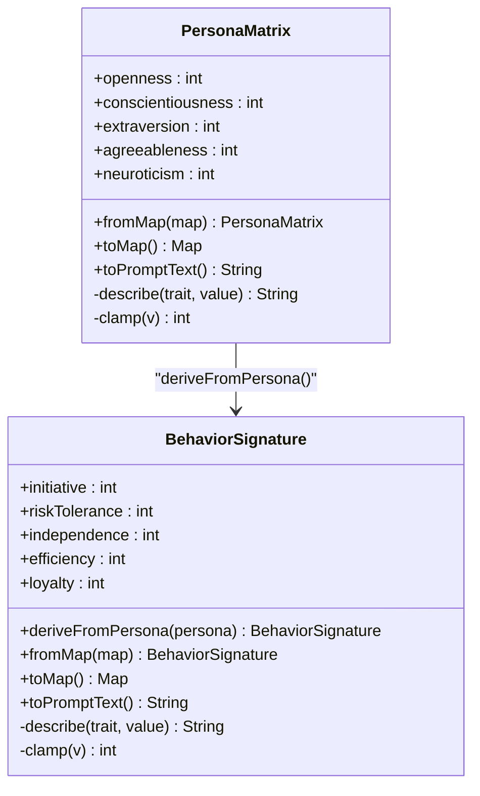

图表来源
- [PersonaMatrix.java:10-110](file://src/main/java/adris/altoclef/player2api/soul/PersonaMatrix.java#L10-L110)
- [BehaviorSignature.java:10-123](file://src/main/java/adris/altoclef/player2api/soul/BehaviorSignature.java#L10-L123)

章节来源
- [PersonaMatrix.java:10-110](file://src/main/java/adris/altoclef/player2api/soul/PersonaMatrix.java#L10-L110)
- [BehaviorSignature.java:10-123](file://src/main/java/adris/altoclef/player2api/soul/BehaviorSignature.java#L10-L123)

### 组件七：档案加载与保存（SoulProfileLoader）
- 加载策略：优先从运行时配置目录加载；若不存在则从classpath资源复制默认模板后再加载；失败时回退至中性人格。
- 保存策略：将人格矩阵、情绪状态、行为签名、记忆锚点与关系序列化为JSON，写入配置目录。

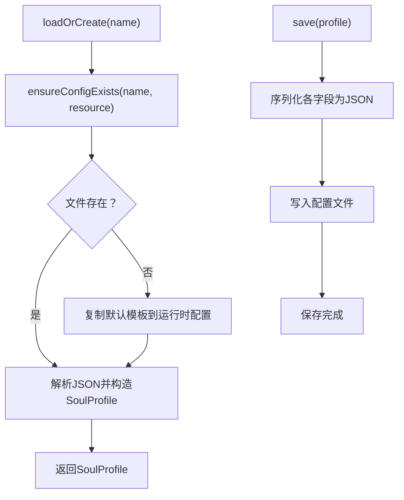

图表来源
- [SoulProfileLoader.java:35-130](file://src/main/java/adris/altoclef/player2api/soul/SoulProfileLoader.java#L35-L130)

章节来源
- [SoulProfileLoader.java:25-216](file://src/main/java/adris/altoclef/player2api/soul/SoulProfileLoader.java#L25-L216)

### 组件八：应用集成与事件注入（AgentConversationData、事件类）
- 事件到触发器：AgentConversationData在任务完成/失败等关键节点创建EmotionTrigger并调用EmotionEngine.applyTrigger。
- 提示词注入：在LLM请求前，将SoulProfile生成的情绪提醒与完整提示词注入系统消息，影响对话风格。
- 事件桥接：EntityDeathEvent、PlayerDamageEvent等事件类为外部事件提供统一载体，便于在AgentConversationData中转换为情感触发器。

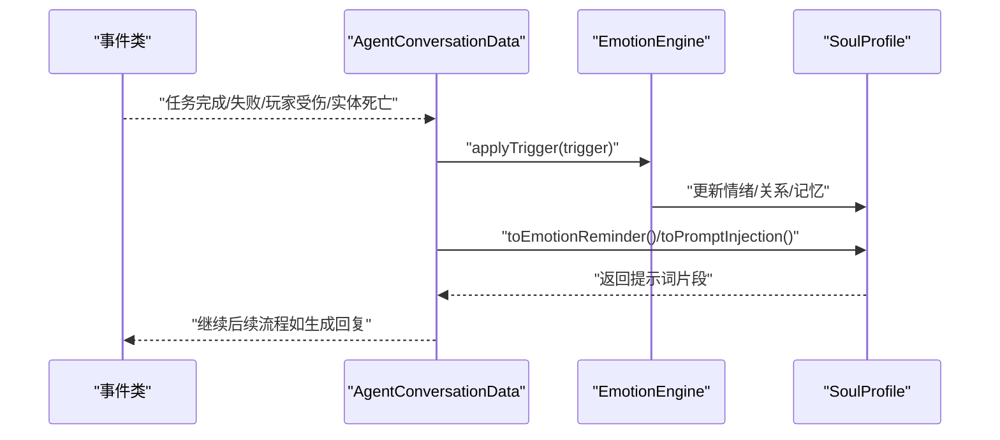

图表来源
- [AgentConversationData.java:337-376](file://src/main/java/adris/altoclef/player2api/AgentConversationData.java#L337-L376)
- [EntityDeathEvent.java:6-14](file://src/main/java/adris/altoclef/eventbus/events/EntityDeathEvent.java#L6-L14)
- [PlayerDamageEvent.java:6-16](file://src/main/java/adris/altoclef/eventbus/events/PlayerDamageEvent.java#L6-L16)

章节来源
- [AgentConversationData.java:197-200](file://src/main/java/adris/altoclef/player2api/AgentConversationData.java#L197-L200)
- [EntityDeathEvent.java:6-14](file://src/main/java/adris/altoclef/eventbus/events/EntityDeathEvent.java#L6-L14)
- [PlayerDamageEvent.java:6-16](file://src/main/java/adris/altoclef/eventbus/events/PlayerDamageEvent.java#L6-L16)

## 依赖分析
- 内聚性：情感引擎内部高度内聚，EmotionEngine仅依赖SoulProfile与其子对象（EmotionState、PersonaMatrix），逻辑清晰。
- 耦合性：AgentConversationData与EmotionEngine耦合通过触发器类型与applyTrigger方法，事件类与AgentConversationData之间为弱耦合（事件桥接）。
- 外部依赖：SoulProfileLoader依赖文件系统与JSON序列化；日志使用Log4j；并发容器用于状态与关系存储。

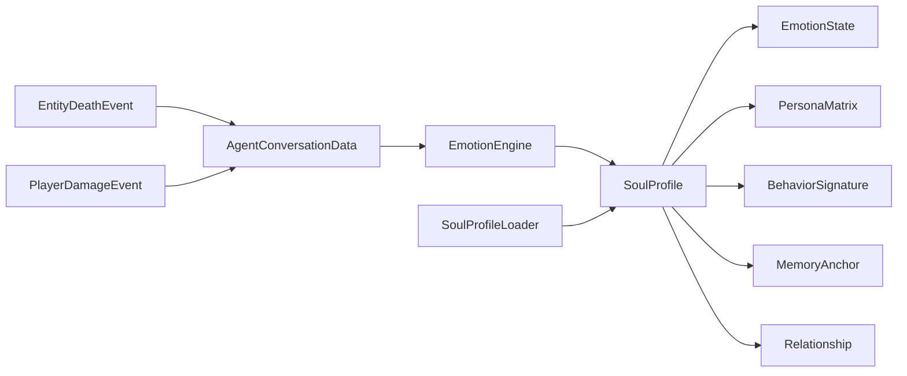

图表来源
- [AgentConversationData.java:19-26](file://src/main/java/adris/altoclef/player2api/AgentConversationData.java#L19-L26)
- [EmotionEngine.java:17-21](file://src/main/java/adris/altoclef/player2api/soul/EmotionEngine.java#L17-L21)
- [SoulProfileLoader.java:62-130](file://src/main/java/adris/altoclef/player2api/soul/SoulProfileLoader.java#L62-L130)

章节来源
- [AgentConversationData.java:19-26](file://src/main/java/adris/altoclef/player2api/AgentConversationData.java#L19-L26)
- [EmotionEngine.java:17-21](file://src/main/java/adris/altoclef/player2api/soul/EmotionEngine.java#L17-L21)
- [SoulProfileLoader.java:62-130](file://src/main/java/adris/altoclef/player2api/soul/SoulProfileLoader.java#L62-L130)

## 性能考虑
- 情绪衰减频率：每30秒一次，衰减值0.1，平衡恢复速度与CPU开销。
- 单次调整幅度限制：避免高频事件导致情绪波动过大，降低不必要的重渲染与提示词重组成本。
- 并发安全：情绪状态与关系使用并发容器，保证多线程场景下的稳定性。
- 记忆锚点裁剪：限制最大锚点数并按评分删除低分非永久锚点，控制内存占用。
- I/O优化：档案加载/保存采用Gson序列化与文件写入，建议在空闲时段或批量操作时执行，避免频繁I/O。

## 故障排查指南
- 情绪未变化：检查触发器是否正确传递到EmotionEngine.applyTrigger，确认SoulProfile非空且人格矩阵初始化正常。
- 情绪异常升高：检查单次调整是否超过±0.25限制，确认触发器类型分支逻辑是否正确累加。
- 记忆锚点过多：检查cleanupOldAnchors逻辑与MAX_MEMORY_ANCHORS阈值，确保高分锚点被保留。
- 关系未更新：确认玩家名到UUID映射是否稳定，临时方案使用nameUUIDFromBytes生成UUID，实际部署建议传入真实UUID。
- 持久化失败：检查配置目录权限与JSON格式，查看SoulProfileLoader错误日志并确认回退路径。
- 对话风格不符：检查toPromptInjection与toEmotionReminder生成的提示词片段，确认主导情绪阈值与语气描述逻辑。

章节来源
- [EmotionEngine.java:17-171](file://src/main/java/adris/altoclef/player2api/soul/EmotionEngine.java#L17-L171)
- [SoulProfile.java:68-91](file://src/main/java/adris/altoclef/player2api/soul/SoulProfile.java#L68-L91)
- [SoulProfileLoader.java:127-129](file://src/main/java/adris/altoclef/player2api/soul/SoulProfileLoader.java#L127-L129)

## 结论
情感引擎通过事件驱动的方式，将复杂的游戏事件转化为可解释、可追踪、可持久化的情绪变化，并以人格矩阵与行为签名为基础，形成稳定的NPC心理模型。配合记忆锚点与关系档案，系统实现了从短期情绪波动到长期情感记忆的全生命周期管理。通过合理的衰减策略、并发安全设计与提示词注入机制，情感引擎能够有效提升NPC对话的真实感与一致性。

## 附录

### 配置选项与参数
- 情绪衰减周期：30秒
- 情绪衰减值：0.1
- 单次情绪调整幅度限制：±0.25
- 记忆锚点最大数量：20
- 提示词中记忆锚点展示数量：5
- 情绪显著阈值：>0.3
- 主导情绪显著阈值：>0.5

章节来源
- [SoulProfile.java:16-17](file://src/main/java/adris/altoclef/player2api/soul/SoulProfile.java#L16-L17)
- [SoulProfile.java:120-126](file://src/main/java/adris/altoclef/player2api/soul/SoulProfile.java#L120-L126)
- [EmotionState.java:36-42](file://src/main/java/adris/altoclef/player2api/soul/EmotionState.java#L36-L42)
- [SoulProfile.java:93-98](file://src/main/java/adris/altoclef/player2api/soul/SoulProfile.java#L93-L98)

### 调试方法
- 日志观察：关注EmotionEngine中的INFO日志，查看触发器类型与主导情绪强度。
- 情绪可视化：在AgentConversationData中打印toEmotionReminder与toPromptInjection结果，验证情绪对提示词的影响。
- 档案检查：定期检查配置目录下的JSON文件，确认人格矩阵、情绪状态、记忆锚点与关系是否符合预期。

章节来源
- [EmotionEngine.java:165-170](file://src/main/java/adris/altoclef/player2api/soul/EmotionEngine.java#L165-L170)
- [AgentConversationData.java:197-200](file://src/main/java/adris/altoclef/player2api/AgentConversationData.java#L197-L200)
- [SoulProfileLoader.java:123-126](file://src/main/java/adris/altoclef/player2api/soul/SoulProfileLoader.java#L123-L126)

### 性能优化策略
- 合理安排事件频率：避免短时间内连续触发相同类型事件，减少重复调整。
- 批量处理：在任务批处理或离线阶段集中执行情感更新与保存。
- 缓存热点：对常用提示词片段进行缓存，减少重复拼接与序列化开销。
- I/O合并：将多个保存操作合并为一次写入，降低磁盘压力。

### 情感模拟示例（步骤说明）
- 步骤1：创建触发器（如任务完成）
- 步骤2：调用EmotionEngine.applyTrigger(soul, trigger)
- 步骤3：SoulProfile.tickEmotionDecay()按30秒周期衰减
- 步骤4：AgentConversationData生成toEmotionReminder与toPromptInjection
- 步骤5：将提示词注入LLM，生成受当前情绪影响的回复

章节来源
- [AgentConversationData.java:337-376](file://src/main/java/adris/altoclef/player2api/AgentConversationData.java#L337-L376)
- [EmotionEngine.java:17-171](file://src/main/java/adris/altoclef/player2api/soul/EmotionEngine.java#L17-L171)
- [SoulProfile.java:120-126](file://src/main/java/adris/altoclef/player2api/soul/SoulProfile.java#L120-L126)

### 常见问题与解决方案
- 问题：情绪不随事件变化
  - 解决：确认触发器类型与上下文正确传递，检查applyTrigger入口与分支逻辑
- 问题：情绪持续不降
  - 解决：检查tickEmotionDecay是否被调用，确认时间间隔与衰减值
- 问题：记忆锚点不生效
  - 解决：检查getScore评分与时效衰减逻辑，确认MAX_MEMORY_ANCHORS裁剪策略
- 问题：关系未更新
  - 解决：确认玩家名到UUID映射稳定，必要时改为传入真实UUID

章节来源
- [EmotionEngine.java:17-171](file://src/main/java/adris/altoclef/player2api/soul/EmotionEngine.java#L17-L171)
- [SoulProfile.java:81-91](file://src/main/java/adris/altoclef/player2api/soul/SoulProfile.java#L81-L91)
- [SoulProfile.java:120-126](file://src/main/java/adris/altoclef/player2api/soul/SoulProfile.java#L120-L126)

### 扩展开发指南
- 新增触发器类型：在EmotionTriggerType中添加枚举值，在EmotionEngine.switch分支中补充对应逻辑
- 新增情绪维度：在EmotionState中扩展键集合并调整clamp范围，注意保持与提示词生成逻辑一致
- 新增人格维度：在PersonaMatrix与BehaviorSignature中扩展维度与推导规则
- 新增记忆分类：在MemoryAnchor中扩展分类与评分策略，确保与现有筛选逻辑兼容
- 新增关系维度：在Relationship中扩展状态项与称谓映射，更新toPromptText描述

章节来源
- [EmotionTriggerType.java:6-39](file://src/main/java/adris/altoclef/player2api/soul/EmotionTriggerType.java#L6-L39)
- [EmotionEngine.java:23-163](file://src/main/java/adris/altoclef/player2api/soul/EmotionEngine.java#L23-L163)
- [EmotionState.java:10-20](file://src/main/java/adris/altoclef/player2api/soul/EmotionState.java#L10-L20)
- [PersonaMatrix.java:19-25](file://src/main/java/adris/altoclef/player2api/soul/PersonaMatrix.java#L19-L25)
- [BehaviorSignature.java:19-42](file://src/main/java/adris/altoclef/player2api/soul/BehaviorSignature.java#L19-L42)
- [MemoryAnchor.java:17-36](file://src/main/java/adris/altoclef/player2api/soul/MemoryAnchor.java#L17-L36)
- [Relationship.java:17-21](file://src/main/java/adris/altoclef/player2api/soul/Relationship.java#L17-L21)