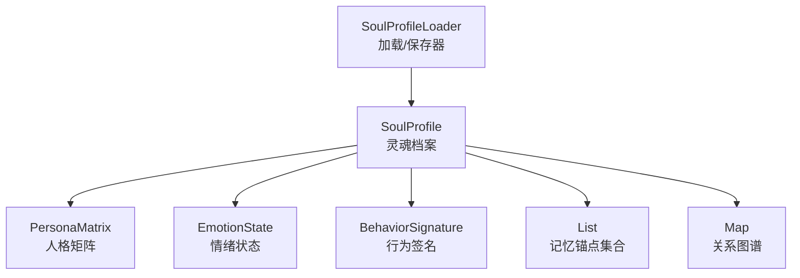
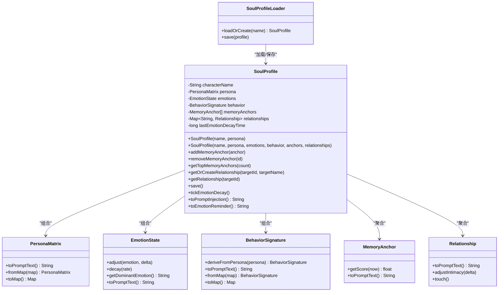
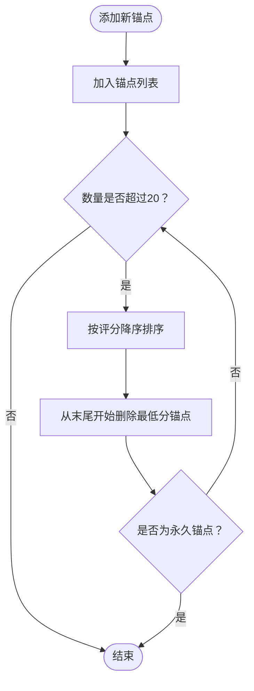
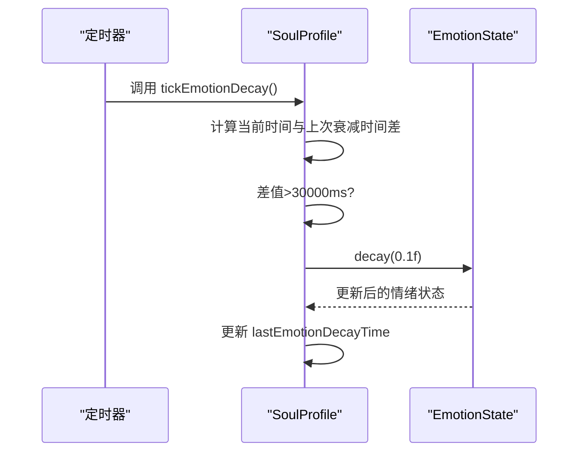
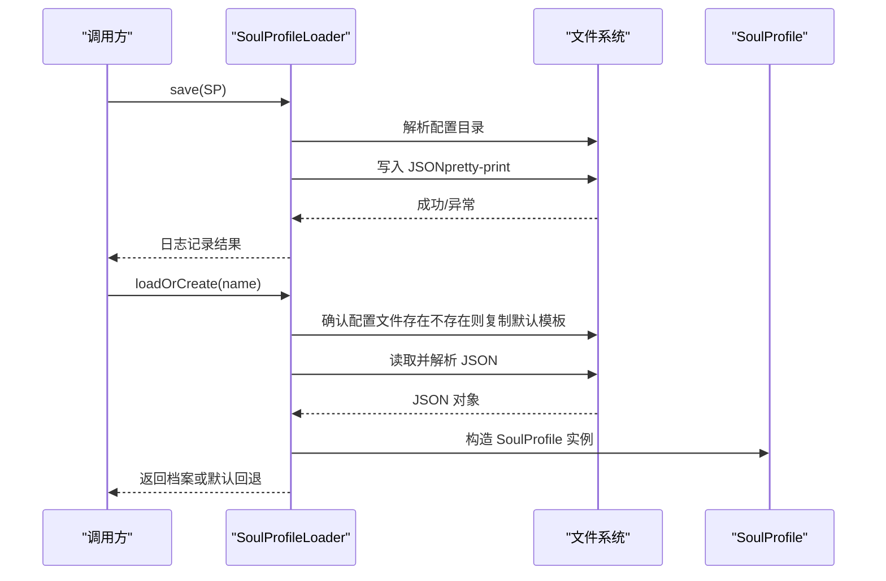
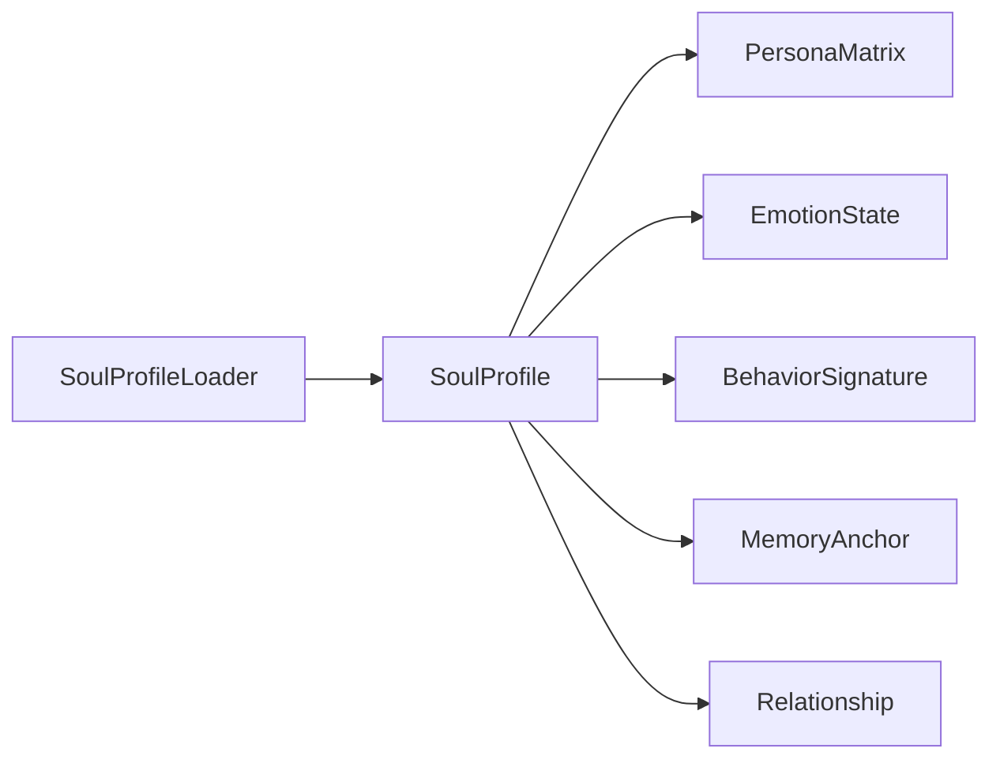

# 灵魂档案

<cite>
**本文引用的文件**
- [SoulProfile.java](file://src/main/java/adris/altoclef/player2api/soul/SoulProfile.java)
- [PersonaMatrix.java](file://src/main/java/adris/altoclef/player2api/soul/PersonaMatrix.java)
- [EmotionState.java](file://src/main/java/adris/altoclef/player2api/soul/EmotionState.java)
- [BehaviorSignature.java](file://src/main/java/adris/altoclef/player2api/soul/BehaviorSignature.java)
- [MemoryAnchor.java](file://src/main/java/adris/altoclef/player2api/soul/MemoryAnchor.java)
- [Relationship.java](file://src/main/java/adris/altoclef/player2api/soul/Relationship.java)
- [SoulProfileLoader.java](file://src/main/java/adris/altoclef/player2api/soul/SoulProfileLoader.java)
</cite>

## 目录
1. [简介](#简介)
2. [项目结构](#项目结构)
3. [核心组件](#核心组件)
4. [架构总览](#架构总览)
5. [详细组件分析](#详细组件分析)
6. [依赖分析](#依赖分析)
7. [性能考虑](#性能考虑)
8. [故障排查指南](#故障排查指南)
9. [结论](#结论)
10. [附录](#附录)

## 简介
本文件围绕 NPC 灵魂核心聚合类“灵魂档案”（SoulProfile）进行系统化技术文档整理。重点阐述其设计理念、数据结构、处理流程与持久化机制，并给出构造函数重载、内存管理策略（最大记忆锚点数量）、情感自然衰减机制（30 秒间隔衰减 0.1）、prompt 注入与情绪提醒方法的使用场景与输出格式说明。同时提供完整代码示例路径、最佳实践与性能优化建议，帮助开发者快速理解并正确使用该模块。

## 项目结构
SoulProfile 所在包位于 player2api/soul 下，围绕“人格矩阵（PersonaMatrix）+ 情绪状态（EmotionState）+ 行为签名（BehaviorSignature）+ 记忆锚点（MemoryAnchor）+ 关系图谱（Relationship）”构建 NPC 的内在心理与行为特征。持久化通过 SoulProfileLoader 使用 JSON 文件完成。

图表来源
- [SoulProfile.java:14-55](file://src/main/java/adris/altoclef/player2api/soul/SoulProfile.java#L14-L55)
- [SoulProfileLoader.java:62-130](file://src/main/java/adris/altoclef/player2api/soul/SoulProfileLoader.java#L62-L130)

章节来源
- [SoulProfile.java:14-55](file://src/main/java/adris/altoclef/player2api/soul/SoulProfile.java#L14-L55)
- [SoulProfileLoader.java:35-57](file://src/main/java/adris/altoclef/player2api/soul/SoulProfileLoader.java#L35-L57)

## 核心组件
- 人格矩阵（PersonaMatrix）：基于“大五人格”模型，维度包括开放性、尽责性、外向性、宜人性、神经质，值域 -100~+100，支持映射转换与 prompt 文本生成。
- 情绪状态（EmotionState）：包含 joy、sadness、anger、fear、surprise、disgust、trust、anticipation 八种基础情绪，强度 0.0~1.0，支持调整、衰减、主导情绪识别与 prompt 文本生成。
- 行为签名（BehaviorSignature）：基于人格矩阵推导出的 NPC 行为偏好，维度包括主动性、风险承受、独立性、效率倾向、忠诚度，值域 -100~+100。
- 记忆锚点（MemoryAnchor）：独立于对话历史的永久性情感记忆单元，包含内容、类别、情感权重、时间戳、是否永久、关联玩家等字段；提供评分计算（情感权重×时效性）。
- 关系图谱（Relationship）：记录 NPC 与特定玩家/实体的关系状态，包括亲密度、信任度、依赖度、当前称谓、最近互动时间等，支持根据亲密度动态更新称谓。

章节来源
- [PersonaMatrix.java:10-109](file://src/main/java/adris/altoclef/player2api/soul/PersonaMatrix.java#L10-L109)
- [EmotionState.java:9-127](file://src/main/java/adris/altoclef/player2api/soul/EmotionState.java#L9-L127)
- [BehaviorSignature.java:10-123](file://src/main/java/adris/altoclef/player2api/soul/BehaviorSignature.java#L10-L123)
- [MemoryAnchor.java:8-60](file://src/main/java/adris/altoclef/player2api/soul/MemoryAnchor.java#L8-L60)
- [Relationship.java:8-69](file://src/main/java/adris/altoclef/player2api/soul/Relationship.java#L8-L69)

## 架构总览
SoulProfile 作为聚合根，负责：
- 组合上述五大子系统；
- 提供记忆锚点的增删与清理策略（最多 20 条，按评分淘汰低分非永久锚点）；
- 提供关系的创建与查询；
- 提供情绪自然衰减（30 秒间隔，衰减 0.1）；
- 提供 toPromptInjection() 与 toEmotionReminder() 两大输出接口，用于 LLM prompt 注入与用户消息提醒。

图表来源
- [SoulProfile.java:14-174](file://src/main/java/adris/altoclef/player2api/soul/SoulProfile.java#L14-L174)
- [PersonaMatrix.java:58-94](file://src/main/java/adris/altoclef/player2api/soul/PersonaMatrix.java#L58-L94)
- [EmotionState.java:36-122](file://src/main/java/adris/altoclef/player2api/soul/EmotionState.java#L36-L122)
- [BehaviorSignature.java:30-108](file://src/main/java/adris/altoclef/player2api/soul/BehaviorSignature.java#L30-L108)
- [MemoryAnchor.java:50-59](file://src/main/java/adris/altoclef/player2api/soul/MemoryAnchor.java#L50-L59)
- [Relationship.java:46-64](file://src/main/java/adris/altoclef/player2api/soul/Relationship.java#L46-L64)
- [SoulProfileLoader.java:35-130](file://src/main/java/adris/altoclef/player2api/soul/SoulProfileLoader.java#L35-L130)

## 详细组件分析

### 构造函数与初始化
- 重载一：仅提供角色名与人格矩阵，其余组件自动初始化（情绪状态为空白、行为签名由人格矩阵推导、时间戳初始化）。
- 重载二：显式传入所有子组件，允许外部注入已有状态；若某参数为 null，则使用默认构造。

章节来源
- [SoulProfile.java:33-55](file://src/main/java/adris/altoclef/player2api/soul/SoulProfile.java#L33-L55)

### 内存管理策略：记忆锚点上限与清理
- 最大锚点数量：20 条。
- 清理策略：
  - 按当前时间计算各锚点评分（情感权重×0.6 + 时效性×0.4），评分越高越优先保留；
  - 若超过上限，从最低分开始删除，但保留永久锚点（permanent=true）。
- 获取顶部锚点：提供 getTopMemoryAnchors(count) 返回按评分排序后的前 N 条。

图表来源
- [SoulProfile.java:68-91](file://src/main/java/adris/altoclef/player2api/soul/SoulProfile.java#L68-L91)
- [MemoryAnchor.java:50-54](file://src/main/java/adris/altoclef/player2api/soul/MemoryAnchor.java#L50-L54)

章节来源
- [SoulProfile.java:68-98](file://src/main/java/adris/altoclef/player2api/soul/SoulProfile.java#L68-L98)
- [MemoryAnchor.java:50-54](file://src/main/java/adris/altoclef/player2api/soul/MemoryAnchor.java#L50-L54)

### 情绪自然衰减机制
- 触发条件：每 30 秒检查一次，若超过阈值则触发一次衰减；
- 衰减方式：对每种基础情绪减去固定衰减值（0.1），并限制下限为 0.0；
- 适用场景：避免 NPC 情绪长期固化，保持动态变化。

图表来源
- [SoulProfile.java:120-126](file://src/main/java/adris/altoclef/player2api/soul/SoulProfile.java#L120-L126)
- [EmotionState.java:58-63](file://src/main/java/adris/altoclef/player2api/soul/EmotionState.java#L58-L63)

章节来源
- [SoulProfile.java:120-126](file://src/main/java/adris/altoclef/player2api/soul/SoulProfile.java#L120-L126)
- [EmotionState.java:58-63](file://src/main/java/adris/altoclef/player2api/soul/EmotionState.java#L58-L63)

### 持久化保存机制
- 保存位置：运行时配置目录下的 soul_{角色名}.json；
- 保存内容：角色名、人格矩阵、情绪状态、行为签名、记忆锚点数组、关系数组；
- 加载策略：优先从运行时配置加载；若不存在则从资源模板复制默认文件后再加载；失败时回退为中性人格的默认档案。

图表来源
- [SoulProfileLoader.java:62-130](file://src/main/java/adris/altoclef/player2api/soul/SoulProfileLoader.java#L62-L130)
- [SoulProfileLoader.java:35-57](file://src/main/java/adris/altoclef/player2api/soul/SoulProfileLoader.java#L35-L57)

章节来源
- [SoulProfileLoader.java:62-130](file://src/main/java/adris/altoclef/player2api/soul/SoulProfileLoader.java#L62-L130)
- [SoulProfileLoader.java:35-57](file://src/main/java/adris/altoclef/player2api/soul/SoulProfileLoader.java#L35-L57)

### toPromptInjection() 使用场景与输出格式
- 使用场景：
  - 在与 LLM 对话前，将 NPC 的人格、当前情绪、记忆锚点、关系、行为倾向注入到 system prompt 中，确保回复风格一致且有依据；
  - 适合在对话会话开始时一次性注入，或在关键节点（如重大事件后）重新注入以更新上下文。
- 输出结构要点：
  - 固定标题块包裹；
  - 依次拼接：人格描述、情绪描述、记忆锚点（取前若干条，不足则提示暂无）、关系（取一个示例）、行为倾向描述；
  - 每段末尾换行，最终闭合标题块。

章节来源
- [SoulProfile.java:133-159](file://src/main/java/adris/altoclef/player2api/soul/SoulProfile.java#L133-L159)

### toEmotionReminder() 使用场景与输出格式
- 使用场景：
  - 在用户消息中插入简短的情绪提醒，引导 NPC 以当前主导情绪调整语气与措辞；
  - 仅当存在显著情绪（强度阈值以上）时返回非空字符串，否则返回空串。
- 输出格式：
  - 形如“当前情绪状态：{主导情绪}(强度%)。请让这种感受影响你的语调与措辞。”
  - 强度以百分比显示，便于 LLM 参考。

章节来源
- [SoulProfile.java:164-172](file://src/main/java/adris/altoclef/player2api/soul/SoulProfile.java#L164-L172)
- [EmotionState.java:88-90](file://src/main/java/adris/altoclef/player2api/soul/EmotionState.java#L88-L90)

### 关系图谱与行为签名
- 关系（Relationship）：
  - 支持调整亲密度、信任度、依赖度，并根据亲密度动态更新称谓；
  - 提供 toPromptText() 用于将关系状态与指导语注入 prompt。
- 行为签名（BehaviorSignature）：
  - 可由人格矩阵推导而来，也可从外部注入；
  - 提供 toPromptText() 生成行为倾向描述与指导语。

章节来源
- [Relationship.java:32-64](file://src/main/java/adris/altoclef/player2api/soul/Relationship.java#L32-L64)
- [BehaviorSignature.java:30-108](file://src/main/java/adris/altoclef/player2api/soul/BehaviorSignature.java#L30-L108)

## 依赖分析
- 内聚性：SoulProfile 将五大子系统聚合为单一可序列化对象，内聚度高；
- 耦合性：与 EmotionState、MemoryAnchor、Relationship、BehaviorSignature 存在组合关系；持久化依赖 SoulProfileLoader；
- 并发安全：记忆锚点采用 CopyOnWriteArrayList，关系图谱采用 ConcurrentHashMap，保证多线程读写安全；
- 循环依赖：未发现循环依赖，模块职责清晰。

图表来源
- [SoulProfile.java:14-55](file://src/main/java/adris/altoclef/player2api/soul/SoulProfile.java#L14-L55)
- [SoulProfileLoader.java:62-130](file://src/main/java/adris/altoclef/player2api/soul/SoulProfileLoader.java#L62-L130)

章节来源
- [SoulProfile.java:14-55](file://src/main/java/adris/altoclef/player2api/soul/SoulProfile.java#L14-L55)
- [SoulProfileLoader.java:62-130](file://src/main/java/adris/altoclef/player2api/soul/SoulProfileLoader.java#L62-L130)

## 性能考虑
- 记忆锚点清理：
  - 排序复杂度 O(n log n)，在上限 20 条规模下开销可控；
  - 建议在批量新增后统一触发清理，避免频繁排序。
- 情绪衰减：
  - tickEmotionDecay() 为常数时间操作，频率建议控制在 30 秒一次；
  - 可结合心跳管理器集中调度，减少重复计算。
- 并发访问：
  - CopyOnWriteArrayList 适合读多写少场景；写入时会产生拷贝，应避免高频写入；
  - 关系图谱并发安全，但频繁修改亲密度可能引发竞争，建议合并更新。
- 序列化：
  - JSON 保存使用 Gson，建议在空闲时段或任务间隙执行，避免阻塞主线程。

## 故障排查指南
- 加载失败：
  - 现象：日志报错并回退默认档案；
  - 处理：检查配置文件格式与字段完整性，确认资源模板已成功复制到运行时目录。
- 情绪异常：
  - 现象：情绪值溢出或过低；
  - 处理：确认单次调整幅度限制与衰减逻辑，避免极端输入。
- 记忆锚点丢失：
  - 现象：超过上限后低分非永久锚点被清理；
  - 处理：合理设置情感权重与时间戳，必要时标记重要锚点为永久。
- 关系称谓不更新：
  - 现象：亲密度变更后称谓未变化；
  - 处理：确认是否调用了更新称谓的内部逻辑，或在外部层面对称谓字段进行刷新。

章节来源
- [SoulProfileLoader.java:47-56](file://src/main/java/adris/altoclef/player2api/soul/SoulProfileLoader.java#L47-L56)
- [EmotionState.java:36-48](file://src/main/java/adris/altoclef/player2api/soul/EmotionState.java#L36-L48)
- [SoulProfile.java:81-91](file://src/main/java/adris/altoclef/player2api/soul/SoulProfile.java#L81-L91)

## 结论
SoulProfile 通过“人格矩阵 + 情绪状态 + 行为签名 + 记忆锚点 + 关系图谱”的组合，构建了 NPC 的内在心理与行为特征体系。其设计强调可持久化、可扩展与并发安全，配合 prompt 注入与情绪提醒机制，能够稳定地支撑 LLM 对话中的角色一致性与情感表达。遵循本文的最佳实践与性能建议，可在保证体验的同时提升系统稳定性与可维护性。

## 附录

### 代码示例（路径指引）
- 创建与初始化（重载一）：
  - [SoulProfile.java:33-39](file://src/main/java/adris/altoclef/player2api/soul/SoulProfile.java#L33-L39)
- 创建与初始化（重载二）：
  - [SoulProfile.java:41-55](file://src/main/java/adris/altoclef/player2api/soul/SoulProfile.java#L41-L55)
- 添加记忆锚点与清理：
  - [SoulProfile.java:68-91](file://src/main/java/adris/altoclef/player2api/soul/SoulProfile.java#L68-L91)
- 获取关系与创建关系：
  - [SoulProfile.java:102-109](file://src/main/java/adris/altoclef/player2api/soul/SoulProfile.java#L102-L109)
- 情绪自然衰减：
  - [SoulProfile.java:120-126](file://src/main/java/adris/altoclef/player2api/soul/SoulProfile.java#L120-L126)
- 持久化保存：
  - [SoulProfile.java:114-116](file://src/main/java/adris/altoclef/player2api/soul/SoulProfile.java#L114-L116)
  - [SoulProfileLoader.java:62-130](file://src/main/java/adris/altoclef/player2api/soul/SoulProfileLoader.java#L62-L130)
- 生成 prompt 注入文本：
  - [SoulProfile.java:133-159](file://src/main/java/adris/altoclef/player2api/soul/SoulProfile.java#L133-L159)
- 生成情绪提醒：
  - [SoulProfile.java:164-172](file://src/main/java/adris/altoclef/player2api/soul/SoulProfile.java#L164-L172)

### 最佳实践与性能优化建议
- 控制记忆锚点增长节奏：避免在短时间内大量新增锚点，建议批处理或延迟写入。
- 合理设置情感权重：对重要事件赋予更高情感权重，提高其在 prompt 中的影响力。
- 使用心跳管理器统一调度 tickEmotionDecay()，降低重复计算成本。
- 在 UI 或对话层复用 toPromptInjection() 与 toEmotionReminder() 的结果，避免重复生成。
- 对关系更新采用事务式合并（如批量调整亲密度、信任度），减少并发冲突。