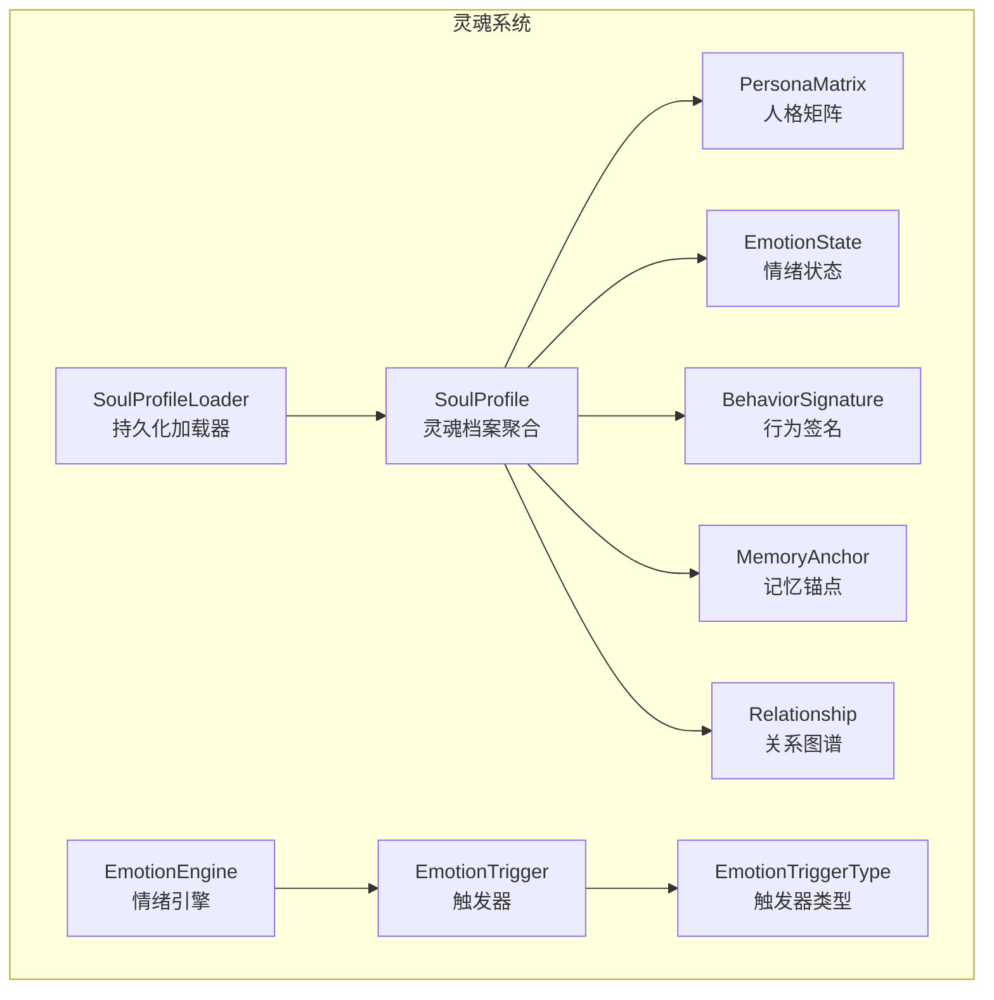
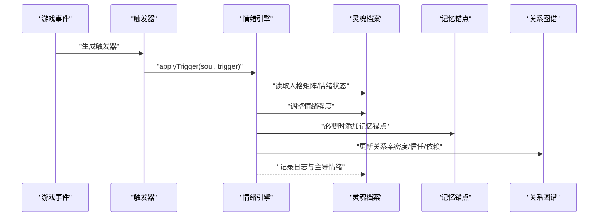
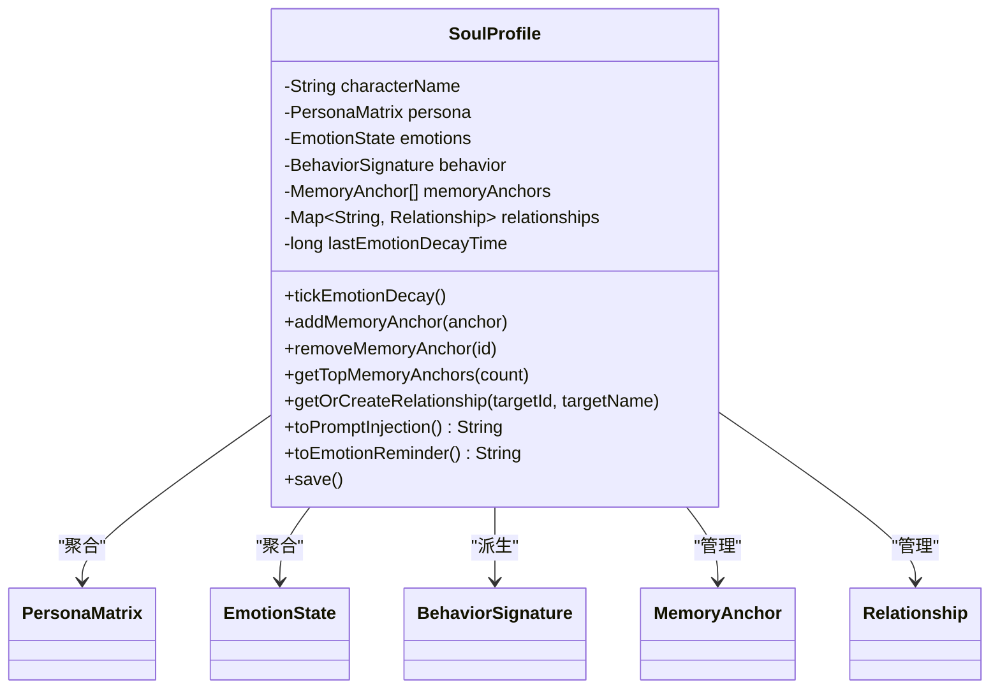
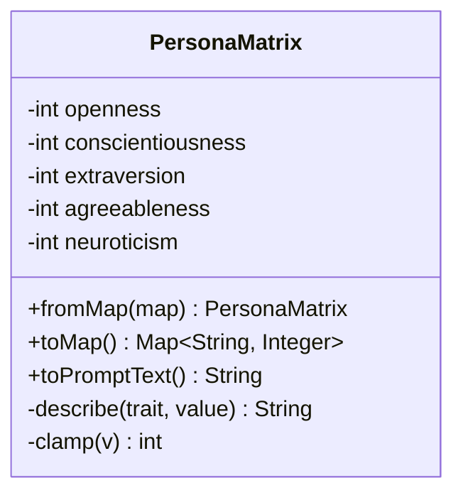
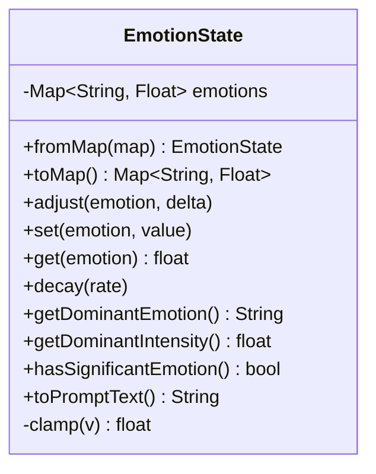
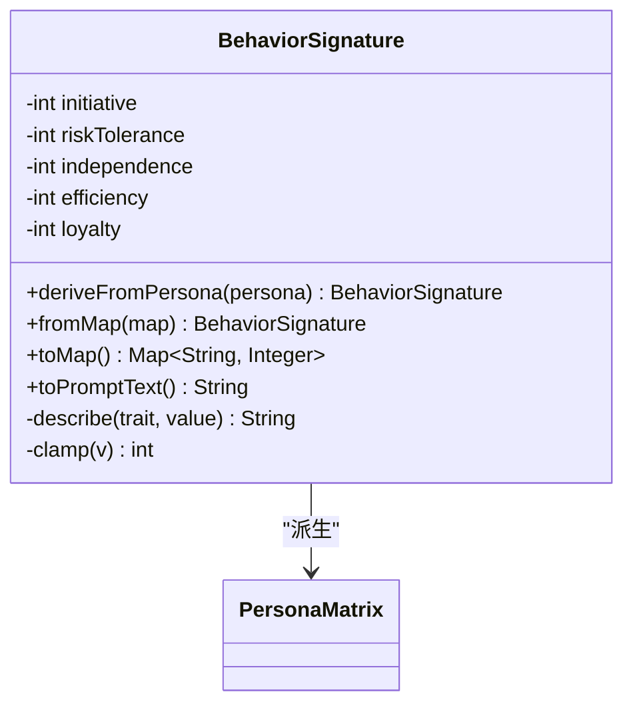
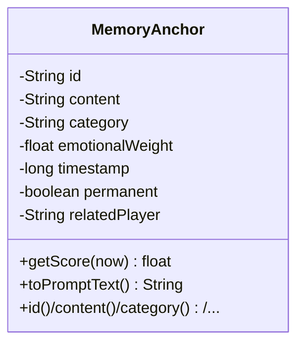
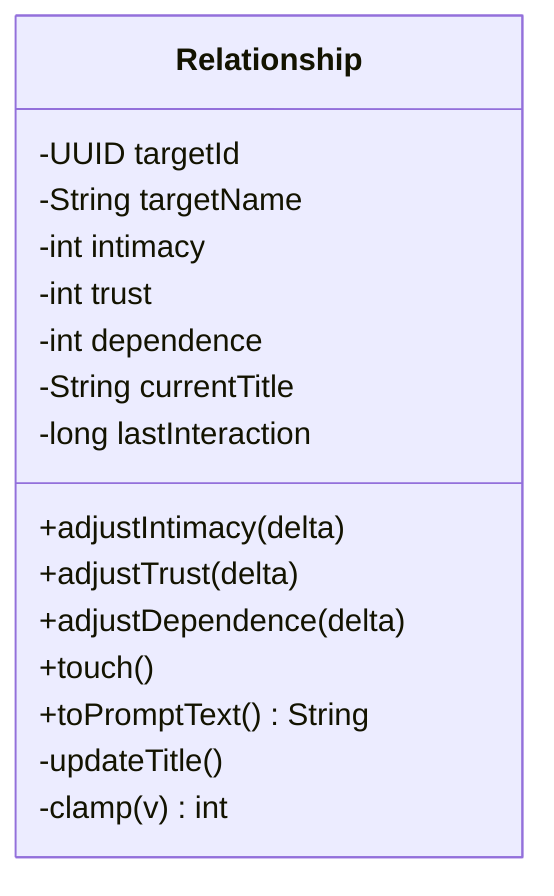
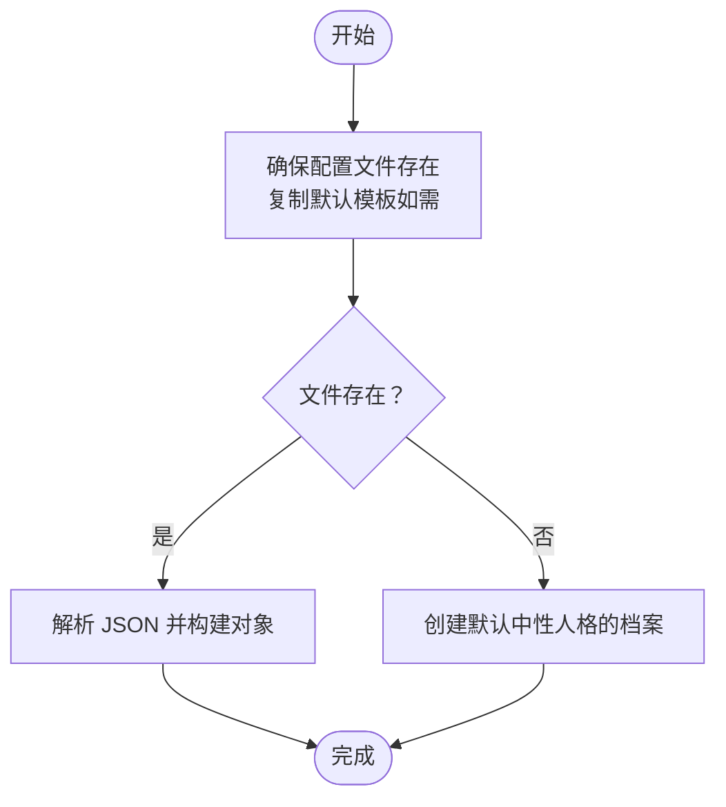
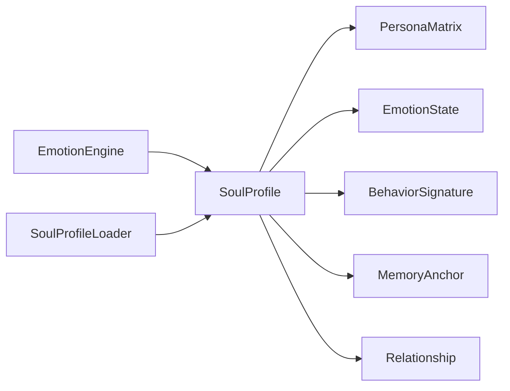

# 灵魂系统

<cite>
**本文引用的文件**   
- [SoulProfile.java](file://src/main/java/adris/altoclef/player2api/soul/SoulProfile.java)
- [PersonaMatrix.java](file://src/main/java/adris/altoclef/player2api/soul/PersonaMatrix.java)
- [EmotionState.java](file://src/main/java/adris/altoclef/player2api/soul/EmotionState.java)
- [EmotionEngine.java](file://src/main/java/adris/altoclef/player2api/soul/EmotionEngine.java)
- [EmotionTrigger.java](file://src/main/java/adris/altoclef/player2api/soul/EmotionTrigger.java)
- [EmotionTriggerType.java](file://src/main/java/adris/altoclef/player2api/soul/EmotionTriggerType.java)
- [MemoryAnchor.java](file://src/main/java/adris/altoclef/player2api/soul/MemoryAnchor.java)
- [Relationship.java](file://src/main/java/adris/altoclef/player2api/soul/Relationship.java)
- [BehaviorSignature.java](file://src/main/java/adris/altoclef/player2api/soul/BehaviorSignature.java)
- [SoulProfileLoader.java](file://src/main/java/adris/altoclef/player2api/soul/SoulProfileLoader.java)
- [soul_Luna.json](file://src/main/resources/soul/soul_Luna.json)
- [soul_小悠.json](file://src/main/resources/soul/soul_小悠.json)
- [NPCMemoryCommand.java](file://src/main/java/adris/altoclef/commands/NPCMemoryCommand.java)
</cite>

## 目录
1. [简介](#简介)
2. [项目结构](#项目结构)
3. [核心组件](#核心组件)
4. [架构总览](#架构总览)
5. [详细组件分析](#详细组件分析)
6. [依赖分析](#依赖分析)
7. [性能考量](#性能考量)
8. [故障排查指南](#故障排查指南)
9. [结论](#结论)
10. [附录](#附录)

## 简介
本文件系统性阐述“灵魂系统”的设计理念与实现机制，涵盖灵魂档案聚合、人格矩阵、情绪状态、行为签名、记忆锚点、关系图谱以及事件驱动的情绪引擎与触发器。文档同时提供配置示例、数据结构说明、扩展开发指南，并总结情感表达优化、记忆持久化与关系管理的最佳实践及常见问题的性能优化建议。

## 项目结构
灵魂系统位于模块路径 player2api/soul 下，围绕 NPC 的“灵魂”抽象构建，包含以下关键文件：
- 灵魂档案聚合：SoulProfile
- 人格建模：PersonaMatrix
- 情绪建模：EmotionState
- 行为建模：BehaviorSignature
- 触发器与引擎：EmotionTrigger、EmotionTriggerType、EmotionEngine
- 记忆锚点：MemoryAnchor
- 关系图谱：Relationship
- 持久化：SoulProfileLoader
- 示例配置：soul_Luna.json、soul_小悠.json
- 内存管理命令：NPCMemoryCommand



图表来源
- [SoulProfile.java:14-174](file://src/main/java/adris/altoclef/player2api/soul/SoulProfile.java#L14-L174)
- [PersonaMatrix.java:10-110](file://src/main/java/adris/altoclef/player2api/soul/PersonaMatrix.java#L10-L110)
- [EmotionState.java:9-128](file://src/main/java/adris/altoclef/player2api/soul/EmotionState.java#L9-L128)
- [BehaviorSignature.java:10-124](file://src/main/java/adris/altoclef/player2api/soul/BehaviorSignature.java#L10-L124)
- [MemoryAnchor.java:8-61](file://src/main/java/adris/altoclef/player2api/soul/MemoryAnchor.java#L8-L61)
- [Relationship.java:8-70](file://src/main/java/adris/altoclef/player2api/soul/Relationship.java#L8-L70)
- [EmotionTrigger.java:6-19](file://src/main/java/adris/altoclef/player2api/soul/EmotionTrigger.java#L6-L19)
- [EmotionTriggerType.java:6-39](file://src/main/java/adris/altoclef/player2api/soul/EmotionTriggerType.java#L6-L39)
- [EmotionEngine.java:11-184](file://src/main/java/adris/altoclef/player2api/soul/EmotionEngine.java#L11-L184)
- [SoulProfileLoader.java:25-217](file://src/main/java/adris/altoclef/player2api/soul/SoulProfileLoader.java#L25-L217)

章节来源
- [SoulProfile.java:14-174](file://src/main/java/adris/altoclef/player2api/soul/SoulProfile.java#L14-L174)
- [SoulProfileLoader.java:25-217](file://src/main/java/adris/altoclef/player2api/soul/SoulProfileLoader.java#L25-L217)

## 核心组件
- 灵魂档案聚合（SoulProfile）：聚合人格、情绪、行为、记忆与关系，负责情绪自然衰减、记忆锚点清理与提示注入。
- 人格矩阵（PersonaMatrix）：基于大五人格模型（OCEAN），维度范围[-100,100]，用于生成 Prompt 文本与派生行为签名。
- 情绪状态（EmotionState）：8 种基础情绪，强度范围[0.0,1.0]，支持调整、衰减与主导情绪判定。
- 行为签名（BehaviorSignature）：从人格矩阵派生，默认维度[-100,100]，用于生成 Prompt 行为倾向指导。
- 记忆锚点（MemoryAnchor）：独立于对话的历史情感记忆，带情感权重与时效评分，支持永久锚点与按评分清理。
- 关系图谱（Relationship）：以 UUID 为键，记录亲密度、信任度、依赖度与称谓，随互动更新。
- 情绪引擎（EmotionEngine）：根据触发器类型与人格矩阵调整情绪，同时更新关系。
- 触发器与类型（EmotionTrigger/EmotionTriggerType）：封装触发事件及其参数，枚举定义全部可感知事件。
- 持久化加载器（SoulProfileLoader）：从资源模板复制并加载 JSON 配置，支持保存与回退策略。

章节来源
- [SoulProfile.java:14-174](file://src/main/java/adris/altoclef/player2api/soul/SoulProfile.java#L14-L174)
- [PersonaMatrix.java:10-110](file://src/main/java/adris/altoclef/player2api/soul/PersonaMatrix.java#L10-L110)
- [EmotionState.java:9-128](file://src/main/java/adris/altoclef/player2api/soul/EmotionState.java#L9-L128)
- [BehaviorSignature.java:10-124](file://src/main/java/adris/altoclef/player2api/soul/BehaviorSignature.java#L10-L124)
- [MemoryAnchor.java:8-61](file://src/main/java/adris/altoclef/player2api/soul/MemoryAnchor.java#L8-L61)
- [Relationship.java:8-70](file://src/main/java/adris/altoclef/player2api/soul/Relationship.java#L8-L70)
- [EmotionEngine.java:11-184](file://src/main/java/adris/altoclef/player2api/soul/EmotionEngine.java#L11-L184)
- [EmotionTrigger.java:6-19](file://src/main/java/adris/altoclef/player2api/soul/EmotionTrigger.java#L6-L19)
- [EmotionTriggerType.java:6-39](file://src/main/java/adris/altoclef/player2api/soul/EmotionTriggerType.java#L6-L39)
- [SoulProfileLoader.java:25-217](file://src/main/java/adris/altoclef/player2api/soul/SoulProfileLoader.java#L25-L217)

## 架构总览
灵魂系统采用“事件驱动 + 状态聚合”的架构：
- 事件来源：游戏事件（如昼夜、天气、遭遇、任务等）转化为触发器。
- 引擎处理：情绪引擎依据触发器与人格矩阵更新情绪状态，并联动关系与记忆锚点。
- Prompt 注入：灵魂档案将人格、情绪、记忆、关系与行为倾向整合为系统提示文本，供 LLM 使用。
- 持久化：通过加载器将当前状态序列化至 JSON 文件，支持运行时配置与回退。



图表来源
- [EmotionEngine.java:17-171](file://src/main/java/adris/altoclef/player2api/soul/EmotionEngine.java#L17-L171)
- [SoulProfile.java:120-126](file://src/main/java/adris/altoclef/player2api/soul/SoulProfile.java#L120-L126)
- [MemoryAnchor.java:17-36](file://src/main/java/adris/altoclef/player2api/soul/MemoryAnchor.java#L17-L36)
- [Relationship.java:17-21](file://src/main/java/adris/altoclef/player2api/soul/Relationship.java#L17-L21)

## 详细组件分析

### 灵魂档案聚合（SoulProfile）
- 职责
  - 聚合人格矩阵、情绪状态、行为签名、记忆锚点与关系图谱。
  - 提供情绪自然衰减（约 30 秒一次）、记忆锚点上限清理（最多 20 条，按评分保留）与提示注入。
- 关键点
  - 行为签名由人格矩阵派生，确保一致性。
  - 记忆锚点按情感权重与时效评分排序，删除最低分且非永久锚点。
  - 提示注入包含人格、情绪、记忆锚点（取前 5 条）、关系与行为倾向。
- 典型调用
  - tickEmotionDecay：周期性衰减情绪。
  - addMemoryAnchor/removeMemoryAnchor：管理记忆锚点。
  - toPromptInjection/toEmotionReminder：生成 Prompt 文本。



图表来源
- [SoulProfile.java:14-174](file://src/main/java/adris/altoclef/player2api/soul/SoulProfile.java#L14-L174)

章节来源
- [SoulProfile.java:14-174](file://src/main/java/adris/altoclef/player2api/soul/SoulProfile.java#L14-L174)

### 人格矩阵（PersonaMatrix）
- 设计理念
  - 基于大五人格模型（开放性、尽责性、外向性、宜人性、神经质），维度[-100,100]。
  - 提供 toPromptText 生成人格描述与行为指导，便于注入 LLM。
- 数据结构
  - 字段：openness、conscientiousness、extraversion、agreeableness、neuroticism。
  - 工具方法：fromMap、toMap、clamp。
- 复杂度
  - 构造与转换均为 O(1)；toPromptText 为 O(1) 输出拼接。



图表来源
- [PersonaMatrix.java:10-110](file://src/main/java/adris/altoclef/player2api/soul/PersonaMatrix.java#L10-L110)

章节来源
- [PersonaMatrix.java:10-110](file://src/main/java/adris/altoclef/player2api/soul/PersonaMatrix.java#L10-L110)

### 情绪状态（EmotionState）
- 设计理念
  - 8 种基础情绪（joy、sadness、anger、fear、surprise、disgust、trust、anticipation），强度[0.0,1.0]。
  - 单次调整限制在±0.25，防止瞬时爆炸；支持自然衰减与主导情绪判定。
- 数据结构
  - ConcurrentHashMap 存储情绪键值对。
  - 工具方法：adjust/set/get、decay、getDominantEmotion/getDominantIntensity、hasSignificantEmotion、toPromptText。
- 复杂度
  - adjust/set/get 为 O(1)；decay 对 8 个键遍历为 O(1)。



图表来源
- [EmotionState.java:9-128](file://src/main/java/adris/altoclef/player2api/soul/EmotionState.java#L9-L128)

章节来源
- [EmotionState.java:9-128](file://src/main/java/adris/altoclef/player2api/soul/EmotionState.java#L9-L128)

### 行为签名（BehaviorSignature）
- 设计理念
  - 从人格矩阵派生：initiative 受外向性影响；riskTolerance 受开放性与神经质反向影响；independence/efficiency 受尽责性影响；loyalty 受宜人性影响。
  - 提供 toPromptText 生成行为倾向指导。
- 数据结构
  - 字段：initiative、riskTolerance、independence、efficiency、loyalty。
  - 工具方法：deriveFromPersona、fromMap、toMap、describe、clamp。



图表来源
- [BehaviorSignature.java:10-124](file://src/main/java/adris/altoclef/player2api/soul/BehaviorSignature.java#L10-L124)
- [PersonaMatrix.java:10-110](file://src/main/java/adris/altoclef/player2api/soul/PersonaMatrix.java#L10-L110)

章节来源
- [BehaviorSignature.java:10-124](file://src/main/java/adris/altoclef/player2api/soul/BehaviorSignature.java#L10-L124)

### 记忆锚点（MemoryAnchor）
- 设计理念
  - 独立于对话历史的永久性情感记忆单元，带分类（event/preference/relationship/trauma）、情感权重与相关玩家信息。
  - 评分 = 情感权重×0.6 + 时效性×0.4，永久锚点评分为 1.0。
- 数据结构
  - 字段：id、content、category、emotionalWeight、timestamp、permanent、relatedPlayer。
  - 方法：getScore、toPromptText。
- 复杂度
  - getScore 为 O(1)；排序与清理按锚点数量 O(n log n)。



图表来源
- [MemoryAnchor.java:8-61](file://src/main/java/adris/altoclef/player2api/soul/MemoryAnchor.java#L8-L61)

章节来源
- [MemoryAnchor.java:8-61](file://src/main/java/adris/altoclef/player2api/soul/MemoryAnchor.java#L8-L61)

### 关系图谱（Relationship）
- 设计理念
  - 以 UUID 为键，记录与目标玩家/实体的亲密度、信任度、依赖度与当前称谓。
  - 亲密度决定称谓等级；最近互动时间用于追踪活跃度。
- 数据结构
  - 字段：targetId、targetName、intimacy、trust、dependence、currentTitle、lastInteraction。
  - 方法：adjustIntimacy/adjustTrust/adjustDependence、touch、toPromptText、clamp。
- 复杂度
  - 更新与称谓切换为 O(1)；toPromptText 为 O(1)。



图表来源
- [Relationship.java:8-70](file://src/main/java/adris/altoclef/player2api/soul/Relationship.java#L8-L70)

章节来源
- [Relationship.java:8-70](file://src/main/java/adris/altoclef/player2api/soul/Relationship.java#L8-L70)

### 情绪引擎与触发器（EmotionEngine/EmotionTrigger/EmotionTriggerType）
- 设计理念
  - 事件驱动：将游戏事件映射为触发器，情绪引擎依据触发器与人格矩阵调整情绪，并更新关系与记忆锚点。
  - 触发器类型覆盖玩家互动、环境事件、游戏事件、任务事件与社交事件。
- 数据结构
  - EmotionTrigger：type、playerName、itemName、itemValue。
  - EmotionTriggerType：枚举所有事件类型。
  - EmotionEngine.applyTrigger：根据类型分支调整情绪与关系。
- 复杂度
  - 分支处理为 O(1)；日志输出为 O(1)。

```mermaid
classDiagram
class EmotionTrigger {
+type : EmotionTriggerType
+playerName : String
+itemName : String
+itemValue : float
}
class EmotionTriggerType {
<<enumeration>>
"PLAYER_*"
"DAY_BREAK/NIGHT_FALL"
"RAIN_START/THUNDER"
"FIND_*"
"ENTER_*"
"CREEPER_NEARBY/LOW_HEALTH"
"TASK_*"
"MEET_NEW_NPC/NPC_GREETING"
}
class EmotionEngine {
+applyTrigger(soul, trigger)
-updateRelationshipByName(...)
}
EmotionEngine --> EmotionTrigger : "消费"
EmotionTrigger --> EmotionTriggerType : "使用"
```

图表来源
- [EmotionTrigger.java:6-19](file://src/main/java/adris/altoclef/player2api/soul/EmotionTrigger.java#L6-L19)
- [EmotionTriggerType.java:6-39](file://src/main/java/adris/altoclef/player2api/soul/EmotionTriggerType.java#L6-L39)
- [EmotionEngine.java:17-182](file://src/main/java/adris/altoclef/player2api/soul/EmotionEngine.java#L17-L182)

章节来源
- [EmotionTrigger.java:6-19](file://src/main/java/adris/altoclef/player2api/soul/EmotionTrigger.java#L6-L19)
- [EmotionTriggerType.java:6-39](file://src/main/java/adris/altoclef/player2api/soul/EmotionTriggerType.java#L6-L39)
- [EmotionEngine.java:17-182](file://src/main/java/adris/altoclef/player2api/soul/EmotionEngine.java#L17-L182)

### 持久化加载器（SoulProfileLoader）
- 设计理念
  - 优先从运行时目录加载用户自定义配置；若不存在则从资源模板复制默认文件后再加载。
  - 支持保存当前灵魂状态为 JSON，包含人格、情绪、行为、记忆锚点与关系。
- 数据结构
  - loadOrCreate：确保配置存在并加载。
  - save：序列化为 JSON 并写入文件。
  - loadFromFile：从 JSON 反序列化。
- 复杂度
  - 保存/加载为 O(n)（n 为锚点与关系数量）。



图表来源
- [SoulProfileLoader.java:35-57](file://src/main/java/adris/altoclef/player2api/soul/SoulProfileLoader.java#L35-L57)
- [SoulProfileLoader.java:132-211](file://src/main/java/adris/altoclef/player2api/soul/SoulProfileLoader.java#L132-L211)

章节来源
- [SoulProfileLoader.java:25-217](file://src/main/java/adris/altoclef/player2api/soul/SoulProfileLoader.java#L25-L217)

## 依赖分析
- 组件耦合
  - SoulProfile 聚合 PersonaMatrix、EmotionState、BehaviorSignature、MemoryAnchor、Relationship，耦合度高但职责清晰。
  - EmotionEngine 仅依赖触发器与灵魂档案，解耦良好。
  - MemoryAnchor/Relationship 为纯数据结构，低耦合。
- 外部依赖
  - JSON 序列化（Gson）、日志（Log4j）、并发容器（ConcurrentHashMap/CopyOnWriteArrayList）。
- 循环依赖
  - 未发现循环依赖；关系更新通过 SoulProfile 的 getOrCreateRelationship 实现间接访问。



图表来源
- [EmotionEngine.java:17-182](file://src/main/java/adris/altoclef/player2api/soul/EmotionEngine.java#L17-L182)
- [SoulProfile.java:14-174](file://src/main/java/adris/altoclef/player2api/soul/SoulProfile.java#L14-L174)
- [SoulProfileLoader.java:62-130](file://src/main/java/adris/altoclef/player2api/soul/SoulProfileLoader.java#L62-L130)

章节来源
- [SoulProfile.java:14-174](file://src/main/java/adris/altoclef/player2api/soul/SoulProfile.java#L14-L174)
- [EmotionEngine.java:17-182](file://src/main/java/adris/altoclef/player2api/soul/EmotionEngine.java#L17-L182)
- [SoulProfileLoader.java:62-130](file://src/main/java/adris/altoclef/player2api/soul/SoulProfileLoader.java#L62-L130)

## 性能考量
- 情绪衰减
  - 默认每 30 秒衰减一次，衰减率 0.1，平衡真实感与性能。
- 记忆锚点清理
  - 限制最大数量为 20，按评分排序后删除最低分非永久锚点，避免无限增长。
- 并发安全
  - 使用 CopyOnWriteArrayList 与 ConcurrentHashMap，保证多线程读写安全。
- JSON 序列化
  - 仅在保存/加载阶段进行，避免频繁 IO；建议批量保存或延迟保存。
- 建议
  - 对高频事件（如昼夜、天气）可合并触发，减少重复计算。
  - 对情绪调整设置阈值，避免微小波动导致频繁日志与提示注入。

[本节为通用性能建议，不直接分析具体文件]

## 故障排查指南
- 情绪异常高涨或持续不降
  - 检查触发器是否被频繁触发（如昼夜循环）。
  - 确认情绪衰减逻辑是否正常（tickEmotionDecay）。
- 记忆锚点过多或无法清理
  - 检查清理逻辑（cleanupOldAnchors）与评分计算（getScore）。
  - 使用 /npc_memory 命令验证锚点状态与 ID。
- 关系未更新
  - 确认触发器是否携带 playerName，引擎是否调用 updateRelationshipByName。
- 配置加载失败
  - 查看 SoulProfileLoader 的回退逻辑与日志错误信息。
  - 确认 JSON 字段与枚举类型一致。

章节来源
- [SoulProfile.java:120-126](file://src/main/java/adris/altoclef/player2api/soul/SoulProfile.java#L120-L126)
- [SoulProfile.java:81-91](file://src/main/java/adris/altoclef/player2api/soul/SoulProfile.java#L81-L91)
- [NPCMemoryCommand.java:16-107](file://src/main/java/adris/altoclef/commands/NPCMemoryCommand.java#L16-L107)
- [SoulProfileLoader.java:42-56](file://src/main/java/adris/altoclef/player2api/soul/SoulProfileLoader.java#L42-L56)

## 结论
灵魂系统通过“事件驱动 + 状态聚合”的设计，实现了 NPC 的情感模拟、记忆持久化与关系演化。人格矩阵与行为签名确保一致性，情绪引擎与触发器体系提供丰富的交互场景，记忆锚点与关系图谱增强长期体验。配合完善的持久化与命令行工具，开发者可以灵活定制与调试 NPC 的“灵魂”。

[本节为总结性内容，不直接分析具体文件]

## 附录

### 配置示例与说明
- 默认模板位置
  - 资源目录：src/main/resources/soul/soul_Luna.json、soul_小悠.json
- 字段说明（节选）
  - characterName：角色名
  - personaMatrix：大五人格维度（openness/conscientiousness/extraversion/agreeableness/neuroticism）
  - emotions：初始情绪状态（joy/sadness/anger/fear/surprise/disgust/trust/anticipation）
  - behaviorSignature：行为倾向（initiative/riskTolerance/independence/efficiency/loyalty）
  - memoryAnchors：运行时维护的记忆锚点数组
  - relationships：运行时维护的关系数组
- 修改生效方式
  - 修改后保存，重启游戏生效；也可在游戏中使用 /npc_memory 命令管理记忆。

章节来源
- [soul_Luna.json:1-61](file://src/main/resources/soul/soul_Luna.json#L1-L61)
- [soul_小悠.json:1-61](file://src/main/resources/soul/soul_小悠.json#L1-L61)

### 数据结构速览
- PersonaMatrix：5 个整数维度，范围[-100,100]
- EmotionState：8 个浮点情绪，范围[0.0,1.0]
- BehaviorSignature：5 个整数维度，范围[-100,100]
- MemoryAnchor：字符串标识、内容、分类、情感权重、时间戳、是否永久、相关玩家
- Relationship：UUID 键、名称、intimacy/trust/dependence、称谓、最近互动时间

章节来源
- [PersonaMatrix.java:19-53](file://src/main/java/adris/altoclef/player2api/soul/PersonaMatrix.java#L19-L53)
- [EmotionState.java:32-52](file://src/main/java/adris/altoclef/player2api/soul/EmotionState.java#L32-L52)
- [BehaviorSignature.java:19-71](file://src/main/java/adris/altoclef/player2api/soul/BehaviorSignature.java#L19-L71)
- [MemoryAnchor.java:17-44](file://src/main/java/adris/altoclef/player2api/soul/MemoryAnchor.java#L17-L44)
- [Relationship.java:17-30](file://src/main/java/adris/altoclef/player2api/soul/Relationship.java#L17-L30)

### 扩展开发指南
- 新增触发器类型
  - 在 EmotionTriggerType 中新增枚举值，并在 EmotionEngine.applyTrigger 中添加分支处理。
- 自定义情绪调整规则
  - 在对应分支中调用 e.adjust(...) 或 e.set(...)，并结合人格矩阵进行加权。
- 新增记忆锚点类别
  - 在 MemoryAnchor.category 中扩展分类，并在 SoulProfile.toPromptInjection 中补充提示文本。
- 关系演化的业务规则
  - 在 updateRelationshipByName 中扩展亲密度/信任/依赖的变化逻辑。
- 持久化扩展
  - 在 SoulProfileLoader 中增加字段序列化与反序列化逻辑，保持向后兼容。

章节来源
- [EmotionTriggerType.java:6-39](file://src/main/java/adris/altoclef/player2api/soul/EmotionTriggerType.java#L6-L39)
- [EmotionEngine.java:23-163](file://src/main/java/adris/altoclef/player2api/soul/EmotionEngine.java#L23-L163)
- [MemoryAnchor.java:11-15](file://src/main/java/adris/altoclef/player2api/soul/MemoryAnchor.java#L11-L15)
- [SoulProfileLoader.java:68-120](file://src/main/java/adris/altoclef/player2api/soul/SoulProfileLoader.java#L68-L120)

### 常见问题与优化建议
- 情感表达优化
  - 使用 toEmotionReminder 生成简短情绪提醒，指导对话语气与措辞。
  - 控制情绪调整幅度（单次±0.25），避免过度波动。
- 记忆持久化
  - 定期保存（save），避免频繁 IO；对大量锚点采用评分清理策略。
  - 使用 /npc_memory 命令进行人工干预与调试。
- 关系管理最佳实践
  - 以亲密度为主导称谓更新，信任与依赖作为辅助；避免单一维度过拟合。
  - 对高频互动事件（如玩家加入/离开）设置合理增量，保持关系演化的自然节奏。

章节来源
- [SoulProfile.java:164-172](file://src/main/java/adris/altoclef/player2api/soul/SoulProfile.java#L164-L172)
- [EmotionState.java:36-42](file://src/main/java/adris/altoclef/player2api/soul/EmotionState.java#L36-L42)
- [NPCMemoryCommand.java:16-107](file://src/main/java/adris/altoclef/commands/NPCMemoryCommand.java#L16-L107)