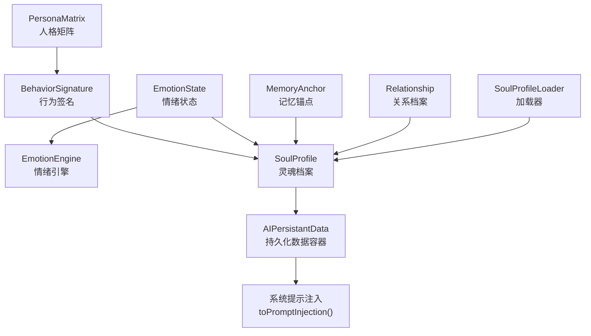
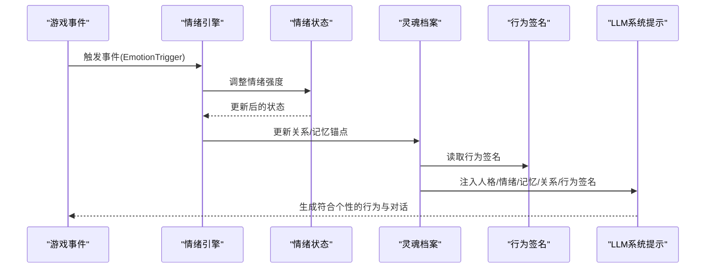
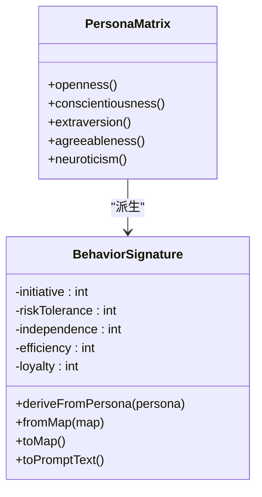
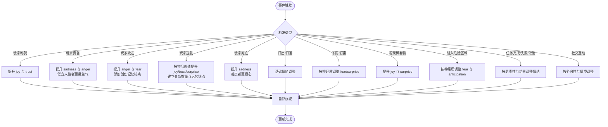
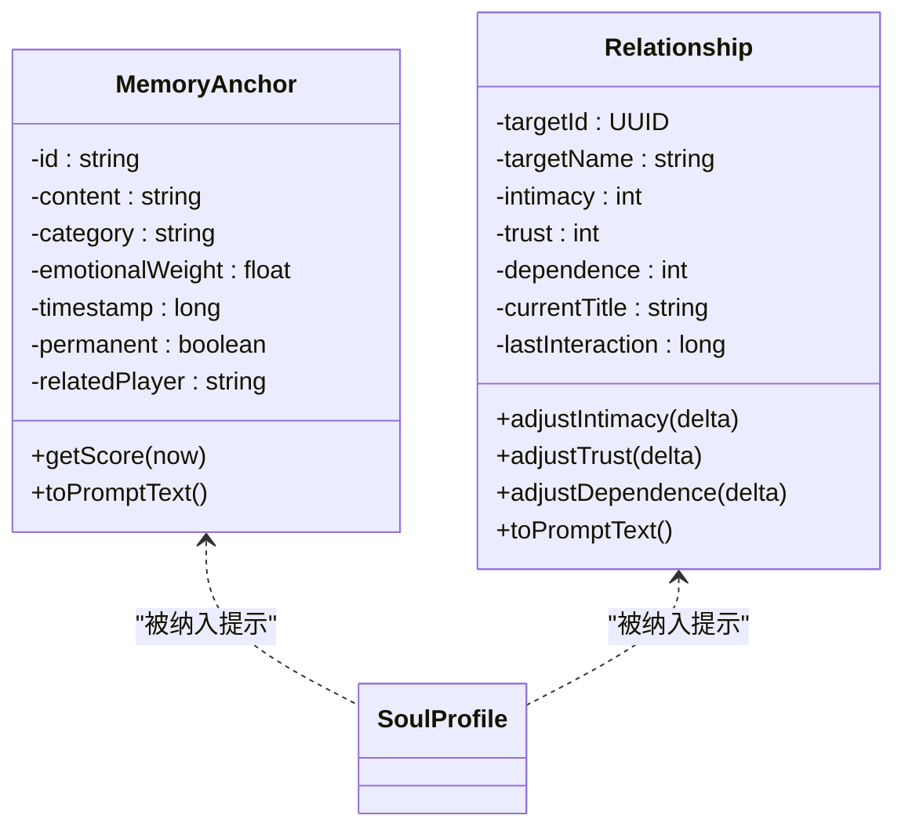
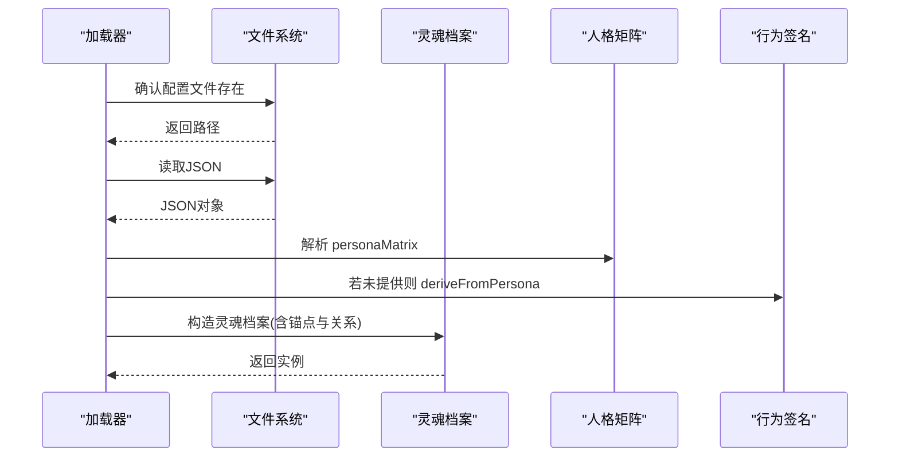
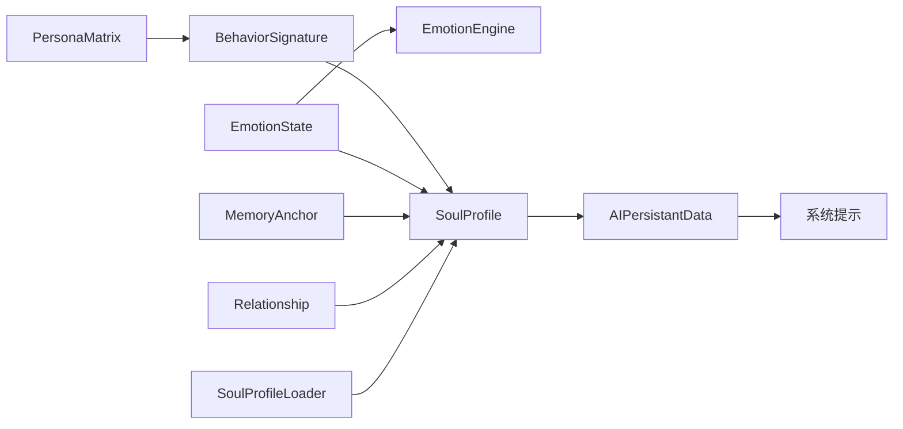
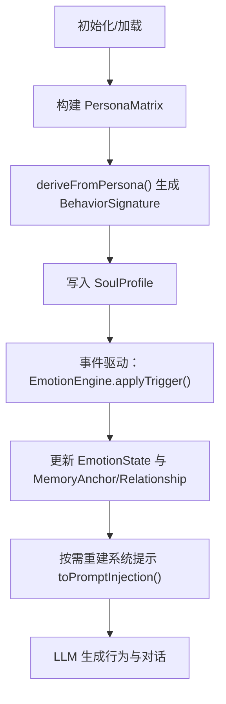

# 行为签名

<cite>
**本文引用的文件**
- [BehaviorSignature.java](file://src/main/java/adris/altoclef/player2api/soul/BehaviorSignature.java)
- [PersonaMatrix.java](file://src/main/java/adris/altoclef/player2api/soul/PersonaMatrix.java)
- [EmotionEngine.java](file://src/main/java/adris/altoclef/player2api/soul/EmotionEngine.java)
- [EmotionState.java](file://src/main/java/adris/altoclef/player2api/soul/EmotionState.java)
- [EmotionTrigger.java](file://src/main/java/adris/altoclef/player2api/soul/EmotionTrigger.java)
- [EmotionTriggerType.java](file://src/main/java/adris/altoclef/player2api/soul/EmotionTriggerType.java)
- [MemoryAnchor.java](file://src/main/java/adris/altoclef/player2api/soul/MemoryAnchor.java)
- [Relationship.java](file://src/main/java/adris/altoclef/player2api/soul/Relationship.java)
- [SoulProfile.java](file://src/main/java/adris/altoclef/player2api/soul/SoulProfile.java)
- [SoulProfileLoader.java](file://src/main/java/adris/altoclef/player2api/soul/SoulProfileLoader.java)
- [soul_Luna.json](file://src/main/resources/soul/soul_Luna.json)
- [soul_小悠.json](file://src/main/resources/soul/soul_小悠.json)
- [AIPersistantData.java](file://src/main/java/adris/altoclef/player2api/AIPersistantData.java)
</cite>

## 目录
1. [引言](#引言)
2. [项目结构](#项目结构)
3. [核心组件](#核心组件)
4. [架构总览](#架构总览)
5. [详细组件分析](#详细组件分析)
6. [依赖分析](#依赖分析)
7. [性能考量](#性能考量)
8. [故障排查指南](#故障排查指南)
9. [结论](#结论)
10. [附录](#附录)

## 引言
本技术文档聚焦“行为签名（Behavior Signature）”在AI NPC系统中的设计与实现，系统性阐述其从“人格矩阵（PersonaMatrix）”派生的行为模式与决策规则，以及在NPC日常行为、任务执行与社交互动中的作用机制。文档还涵盖行为签名的生成算法、更新策略、个性化定制方法，提供配置示例、调试技巧与性能考量，并总结行为一致性保证、冲突解决与动态调整的最佳实践，以应对行为预测准确性、响应延迟与资源消耗等关键挑战。

## 项目结构
行为签名体系位于“soul”子模块，围绕“人格矩阵—情绪引擎—行为签名—灵魂档案—持久化”的链路组织，配合“对话历史与系统提示”的注入，形成NPC在LLM驱动下的稳定而富有个性的行为输出。

图表来源
- [PersonaMatrix.java:10-53](file://src/main/java/adris/altoclef/player2api/soul/PersonaMatrix.java#L10-L53)
- [BehaviorSignature.java:30-43](file://src/main/java/adris/altoclef/player2api/soul/BehaviorSignature.java#L30-L43)
- [EmotionState.java:9-20](file://src/main/java/adris/altoclef/player2api/soul/EmotionState.java#L9-L20)
- [EmotionEngine.java:11-171](file://src/main/java/adris/altoclef/player2api/soul/EmotionEngine.java#L11-L171)
- [SoulProfile.java:14-55](file://src/main/java/adris/altoclef/player2api/soul/SoulProfile.java#L14-L55)
- [MemoryAnchor.java:8-25](file://src/main/java/adris/altoclef/player2api/soul/MemoryAnchor.java#L8-L25)
- [Relationship.java:8-21](file://src/main/java/adris/altoclef/player2api/soul/Relationship.java#L8-L21)
- [SoulProfileLoader.java:25-57](file://src/main/java/adris/altoclef/player2api/soul/SoulProfileLoader.java#L25-L57)
- [AIPersistantData.java:12-28](file://src/main/java/adris/altoclef/player2api/AIPersistantData.java#L12-L28)

章节来源
- [SoulProfile.java:14-55](file://src/main/java/adris/altoclef/player2api/soul/SoulProfile.java#L14-L55)
- [SoulProfileLoader.java:25-57](file://src/main/java/adris/altoclef/player2api/soul/SoulProfileLoader.java#L25-L57)

## 核心组件
- 人格矩阵（PersonaMatrix）：基于大五人格模型（OCEAN），定义开放性、尽责性、外向性、宜人性、神经质五个维度，范围-100~+100，作为行为签名与情绪反应的基础。
- 行为签名（BehaviorSignature）：从人格矩阵派生，包含主动性、风险承受、独立性、效率倾向、忠诚度五个维度，范围-100~+100；支持从映射构造与序列化，提供面向LLM的提示文本。
- 情绪状态（EmotionState）：八种基础情绪（joy、sadness、anger、fear、surprise、disgust、trust、anticipation），强度0.0~1.0，支持自然衰减与显著情绪检测。
- 情绪引擎（EmotionEngine）：根据事件触发器（EmotionTriggerType）对情绪状态进行调整，并更新关系档案与记忆锚点。
- 记忆锚点（MemoryAnchor）：持久化的情感记忆单元，按情感权重与时效性打分，参与系统提示注入。
- 关系档案（Relationship）：记录NPC与玩家之间的亲密度、信任度、依赖度及称谓，随互动演进。
- 灵魂档案（SoulProfile）：聚合人格矩阵、情绪状态、行为签名、记忆锚点与关系图谱，负责提示注入与情绪自然衰减。
- 加载器（SoulProfileLoader）：负责从JSON配置文件加载与保存灵魂档案，支持默认模板复制与回退。
- 持久化数据容器（AIPersistantData）：封装对话历史与系统提示，结合灵魂档案动态更新系统提示。

章节来源
- [PersonaMatrix.java:10-53](file://src/main/java/adris/altoclef/player2api/soul/PersonaMatrix.java#L10-L53)
- [BehaviorSignature.java:10-71](file://src/main/java/adris/altoclef/player2api/soul/BehaviorSignature.java#L10-L71)
- [EmotionState.java:9-52](file://src/main/java/adris/altoclef/player2api/soul/EmotionState.java#L9-L52)
- [EmotionEngine.java:11-171](file://src/main/java/adris/altoclef/player2api/soul/EmotionEngine.java#L11-L171)
- [MemoryAnchor.java:8-54](file://src/main/java/adris/altoclef/player2api/soul/MemoryAnchor.java#L8-L54)
- [Relationship.java:8-44](file://src/main/java/adris/altoclef/player2api/soul/Relationship.java#L8-L44)
- [SoulProfile.java:14-159](file://src/main/java/adris/altoclef/player2api/soul/SoulProfile.java#L14-L159)
- [SoulProfileLoader.java:25-130](file://src/main/java/adris/altoclef/player2api/soul/SoulProfileLoader.java#L25-L130)
- [AIPersistantData.java:12-28](file://src/main/java/adris/altoclef/player2api/AIPersistantData.java#L12-L28)

## 架构总览
行为签名贯穿NPC的“感知—评估—决策—执行—反馈”闭环：人格矩阵决定行为倾向，情绪引擎根据事件动态调整情绪，灵魂档案整合所有状态并注入系统提示，最终驱动LLM生成符合个性与情境的对话与行为。

图表来源
- [EmotionEngine.java:17-171](file://src/main/java/adris/altoclef/player2api/soul/EmotionEngine.java#L17-L171)
- [EmotionState.java:36-63](file://src/main/java/adris/altoclef/player2api/soul/EmotionState.java#L36-L63)
- [SoulProfile.java:133-159](file://src/main/java/adris/altoclef/player2api/soul/SoulProfile.java#L133-L159)
- [BehaviorSignature.java:73-108](file://src/main/java/adris/altoclef/player2api/soul/BehaviorSignature.java#L73-L108)

## 详细组件分析

### 行为签名（BehaviorSignature）
- 设计目的：将抽象的人格特征转化为可操作的行为倾向，指导NPC在空闲、任务与社交场景中的决策与表现。
- 实现原理：从PersonaMatrix派生，默认映射关系为：
  - 主动性 ← 外向性
  - 风险承受 ← 开放性 − 神经质/2
  - 独立性 ← 尽责性
  - 效率倾向 ← 尽责性
  - 忠诚度 ← 宜人性
- 数据结构与复杂度：常量时间派生与转换，线性时间序列化（遍历5个维度）。
- 错误处理与边界：统一使用夹紧函数将值约束在-100~+100范围内。
- 提示文本：生成行为倾向描述与基于阈值的指导语句，供LLM参考。

图表来源
- [PersonaMatrix.java:10-53](file://src/main/java/adris/altoclef/player2api/soul/PersonaMatrix.java#L10-L53)
- [BehaviorSignature.java:30-43](file://src/main/java/adris/altoclef/player2api/soul/BehaviorSignature.java#L30-L43)

章节来源
- [BehaviorSignature.java:10-123](file://src/main/java/adris/altoclef/player2api/soul/BehaviorSignature.java#L10-L123)

### 情绪引擎（EmotionEngine）与情绪状态（EmotionState）
- 设计目的：根据游戏事件触发器对NPC的情绪状态进行实时调整，体现个性化的心理反应与关系演化。
- 实现原理：
  - 情绪状态：八种基础情绪，强度0.0~1.0，支持单次调整上限±0.25，自然衰减速率可控。
  - 情绪引擎：针对不同触发类型（玩家互动、环境事件、游戏事件、任务事件、社交事件）调整情绪强度，并更新关系与记忆锚点。
- 冲突与一致性：通过夹紧与衰减机制避免情绪溢出与长期滞留；主导情绪阈值（>0.3）用于判断是否注入情绪提醒。

图表来源
- [EmotionEngine.java:23-163](file://src/main/java/adris/altoclef/player2api/soul/EmotionEngine.java#L23-L163)
- [EmotionState.java:36-63](file://src/main/java/adris/altoclef/player2api/soul/EmotionState.java#L36-L63)

章节来源
- [EmotionEngine.java:11-184](file://src/main/java/adris/altoclef/player2api/soul/EmotionEngine.java#L11-L184)
- [EmotionState.java:9-127](file://src/main/java/adris/altoclef/player2api/soul/EmotionState.java#L9-L127)

### 记忆锚点（MemoryAnchor）与关系档案（Relationship）
- 记忆锚点：记录重要情感事件，带分类、情感权重与关联玩家信息；按情感权重与时效性（7天衰减）综合评分，支持清理策略。
- 关系档案：记录与玩家的亲密度、信任度、依赖度与称谓，随互动演进并影响对话与行为倾向。

图表来源
- [MemoryAnchor.java:8-54](file://src/main/java/adris/altoclef/player2api/soul/MemoryAnchor.java#L8-L54)
- [Relationship.java:8-64](file://src/main/java/adris/altoclef/player2api/soul/Relationship.java#L8-L64)

章节来源
- [MemoryAnchor.java:8-61](file://src/main/java/adris/altoclef/player2api/soul/MemoryAnchor.java#L8-L61)
- [Relationship.java:8-70](file://src/main/java/adris/altoclef/player2api/soul/Relationship.java#L8-L70)

### 灵魂档案（SoulProfile）与加载器（SoulProfileLoader）
- 灵魂档案：聚合人格矩阵、情绪状态、行为签名、记忆锚点与关系图谱；提供系统提示注入（toPromptInjection）、情绪提醒（toEmotionReminder）、记忆锚点筛选与情绪自然衰减。
- 加载器：从运行时配置目录加载或复制默认模板，支持保存与回退至中性人格。

图表来源
- [SoulProfileLoader.java:35-57](file://src/main/java/adris/altoclef/player2api/soul/SoulProfileLoader.java#L35-L57)
- [SoulProfileLoader.java:132-211](file://src/main/java/adris/altoclef/player2api/soul/SoulProfileLoader.java#L132-L211)
- [SoulProfile.java:33-55](file://src/main/java/adris/altoclef/player2api/soul/SoulProfile.java#L33-L55)

章节来源
- [SoulProfile.java:14-174](file://src/main/java/adris/altoclef/player2api/soul/SoulProfile.java#L14-L174)
- [SoulProfileLoader.java:25-217](file://src/main/java/adris/altoclef/player2api/soul/SoulProfileLoader.java#L25-L217)

### 与对话系统集成（AIPersistantData）
- 将系统提示注入到对话历史基底，确保每次对话都携带当前的灵魂状态（人格、情绪、记忆、关系、行为签名），并在必要时动态更新。

章节来源
- [AIPersistantData.java:12-28](file://src/main/java/adris/altoclef/player2api/AIPersistantData.java#L12-L28)
- [AIPersistantData.java:67-71](file://src/main/java/adris/altoclef/player2api/AIPersistantData.java#L67-L71)

## 依赖分析
- 组件耦合与内聚：行为签名与人格矩阵强耦合（直接派生），与情绪状态弱耦合（仅读取阈值与提示），与记忆锚点与关系通过灵魂档案间接耦合。
- 外部依赖：加载器依赖文件系统与JSON解析库；对话系统依赖持久化数据容器与提示生成器。
- 循环依赖：未见循环依赖，职责清晰。

图表来源
- [PersonaMatrix.java:10-53](file://src/main/java/adris/altoclef/player2api/soul/PersonaMatrix.java#L10-L53)
- [BehaviorSignature.java:30-43](file://src/main/java/adris/altoclef/player2api/soul/BehaviorSignature.java#L30-L43)
- [EmotionEngine.java:11-171](file://src/main/java/adris/altoclef/player2api/soul/EmotionEngine.java#L11-L171)
- [SoulProfile.java:14-55](file://src/main/java/adris/altoclef/player2api/soul/SoulProfile.java#L14-L55)
- [SoulProfileLoader.java:25-57](file://src/main/java/adris/altoclef/player2api/soul/SoulProfileLoader.java#L25-L57)
- [AIPersistantData.java:12-28](file://src/main/java/adris/altoclef/player2api/AIPersistantData.java#L12-L28)

## 性能考量
- 时间复杂度
  - 行为签名派生：O(1)
  - 情绪调整：单次O(1)，批量衰减O(|情绪种类|)
  - 记忆锚点清理：O(n log n)（排序），n为锚点数
- 空间复杂度
  - 情绪状态：固定大小Map（8个键）
  - 记忆锚点：线性增长，受最大数量限制
- 资源优化建议
  - 合理设置记忆锚点上限与衰减周期，避免内存膨胀
  - 控制事件触发频率与情绪调整幅度，减少不必要的系统提示重建
  - 在批量事件场景中合并情绪更新与提示注入，降低I/O与序列化开销

## 故障排查指南
- 行为签名异常
  - 症状：行为与预期不符
  - 排查：检查人格矩阵输入范围与夹紧逻辑；确认派生公式是否被覆盖；核对行为签名的提示文本阈值
- 情绪持续高涨或低迷
  - 症状：主导情绪强度长期高于阈值
  - 排查：检查事件触发类型是否过度；确认衰减周期与速率；核对情绪调整上限
- 记忆锚点过多或过旧
  - 症状：提示文本冗长或相关性下降
  - 排查：检查清理策略与评分函数；确认永久锚点数量
- 关系演进异常
  - 症状：亲密度/信任度变化不符合互动
  - 排查：核对关系更新逻辑与玩家名称/UUID映射
- 配置加载失败
  - 症状：无法加载或回退至默认
  - 排查：检查配置文件路径与权限；核对JSON格式与字段名

章节来源
- [BehaviorSignature.java:120-122](file://src/main/java/adris/altoclef/player2api/soul/BehaviorSignature.java#L120-L122)
- [EmotionState.java:36-42](file://src/main/java/adris/altoclef/player2api/soul/EmotionState.java#L36-L42)
- [SoulProfile.java:81-91](file://src/main/java/adris/altoclef/player2api/soul/SoulProfile.java#L81-L91)
- [SoulProfileLoader.java:42-56](file://src/main/java/adris/altoclef/player2api/soul/SoulProfileLoader.java#L42-L56)

## 结论
行为签名通过“人格矩阵—情绪引擎—行为签名—灵魂档案—系统提示”的闭环，将抽象的人格特征转化为可解释、可追踪、可定制的行为倾向。该体系在NPC日常行为、任务执行与社交互动中提供一致且富有个性的输出，同时具备良好的扩展性与稳定性。通过合理的配置、调试与性能优化，可在保证行为预测准确性的同时，降低响应延迟与资源消耗。

## 附录

### 行为签名生成与更新流程

图表来源
- [PersonaMatrix.java:19-25](file://src/main/java/adris/altoclef/player2api/soul/PersonaMatrix.java#L19-L25)
- [BehaviorSignature.java:30-43](file://src/main/java/adris/altoclef/player2api/soul/BehaviorSignature.java#L30-L43)
- [SoulProfile.java:33-55](file://src/main/java/adris/altoclef/player2api/soul/SoulProfile.java#L33-L55)
- [EmotionEngine.java:17-171](file://src/main/java/adris/altoclef/player2api/soul/EmotionEngine.java#L17-L171)

### 配置示例与个性化定制
- 默认模板位置：resources/soul/*.json
- 示例文件：
  - [soul_Luna.json:1-61](file://src/main/resources/soul/soul_Luna.json#L1-L61)
  - [soul_小悠.json:1-61](file://src/main/resources/soul/soul_小悠.json#L1-L61)
- 定制要点
  - 人格矩阵：根据角色定位调整OCEAN各维度
  - 初始情绪：按角色性格设定基础情绪分布
  - 行为签名：可手动覆盖派生值以强化特定倾向
  - 记忆锚点与关系：通过游戏内命令与事件触发积累

章节来源
- [soul_Luna.json:1-61](file://src/main/resources/soul/soul_Luna.json#L1-L61)
- [soul_小悠.json:1-61](file://src/main/resources/soul/soul_小悠.json#L1-L61)

### 调试技巧
- 日志观察：关注情绪引擎的日志输出，识别主导情绪与触发事件
- 提示注入：打印toPromptInjection()输出，验证人格、情绪、记忆、关系与行为签名的拼接
- 事件追踪：为关键触发类型增加断点或日志，确认情绪调整与关系/记忆更新
- 性能监控：统计事件频率、提示重建次数与序列化耗时，定位瓶颈

章节来源
- [EmotionEngine.java:165-171](file://src/main/java/adris/altoclef/player2api/soul/EmotionEngine.java#L165-L171)
- [SoulProfile.java:133-159](file://src/main/java/adris/altoclef/player2api/soul/SoulProfile.java#L133-L159)