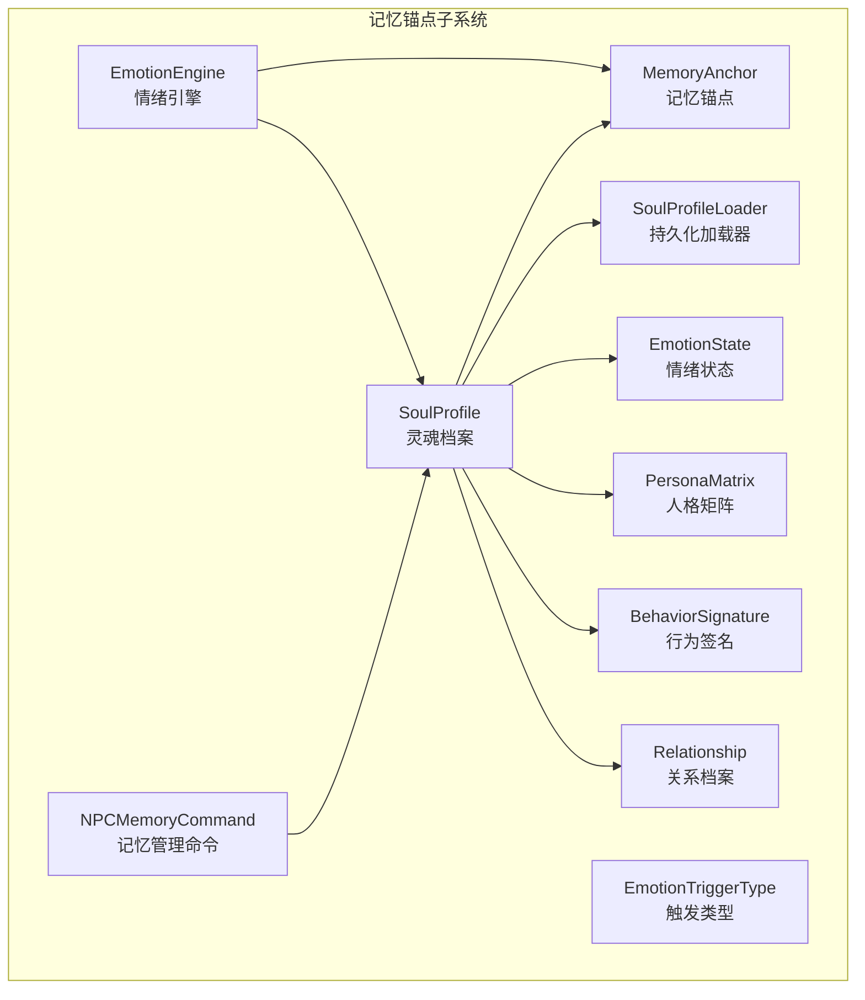
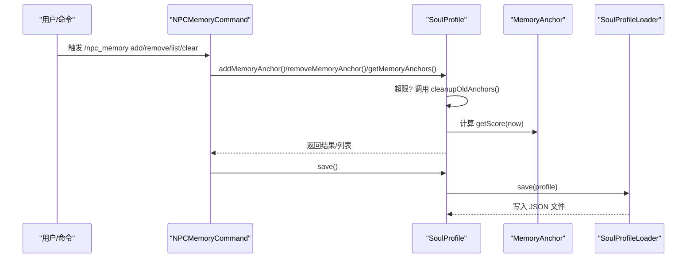
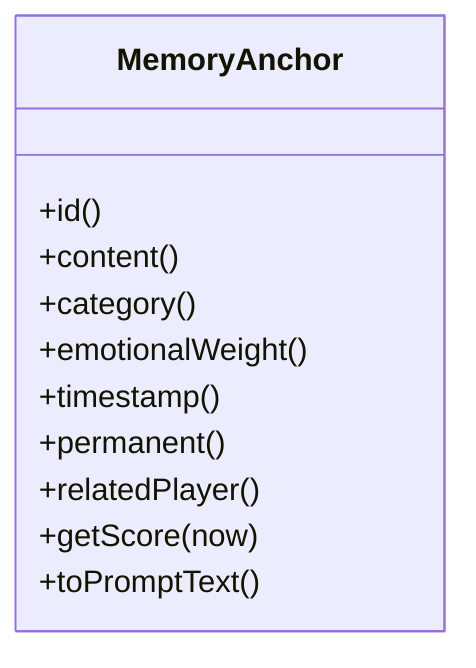
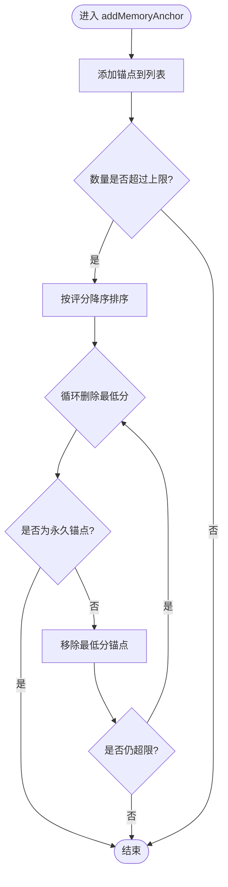
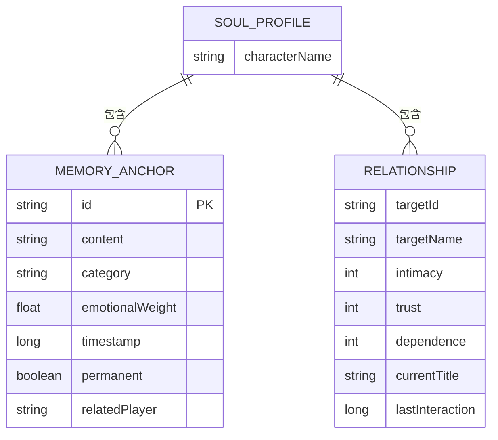
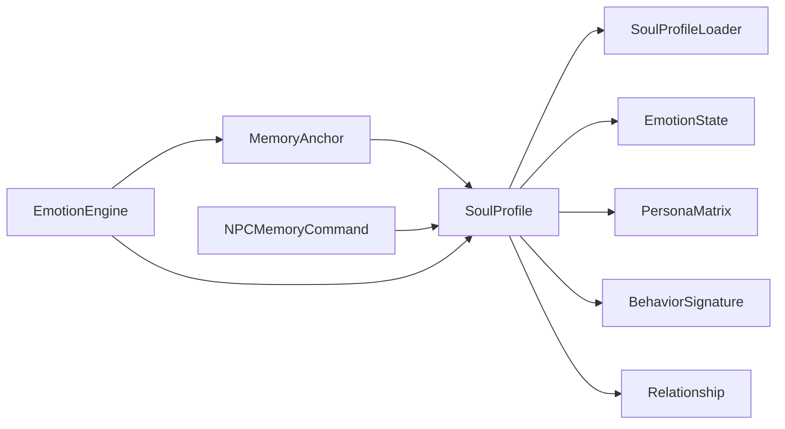

# 记忆锚点

<cite>
**本文引用的文件**
- [MemoryAnchor.java](file://src/main/java/adris/altoclef/player2api/soul/MemoryAnchor.java)
- [SoulProfile.java](file://src/main/java/adris/altoclef/player2api/soul/SoulProfile.java)
- [SoulProfileLoader.java](file://src/main/java/adris/altoclef/player2api/soul/SoulProfileLoader.java)
- [NPCMemoryCommand.java](file://src/main/java/adris/altoclef/commands/NPCMemoryCommand.java)
- [EmotionEngine.java](file://src/main/java/adris/altoclef/player2api/soul/EmotionEngine.java)
- [EmotionTrigger.java](file://src/main/java/adris/altoclef/player2api/soul/EmotionTrigger.java)
- [EmotionTriggerType.java](file://src/main/java/adris/altoclef/player2api/soul/EmotionTriggerType.java)
- [EmotionState.java](file://src/main/java/adris/altoclef/player2api/soul/EmotionState.java)
- [PersonaMatrix.java](file://src/main/java/adris/altoclef/player2api/soul/PersonaMatrix.java)
- [BehaviorSignature.java](file://src/main/java/adris/altoclef/player2api/soul/BehaviorSignature.java)
- [Relationship.java](file://src/main/java/adris/altoclef/player2api/soul/Relationship.java)
</cite>

## 目录
1. [简介](#简介)
2. [项目结构](#项目结构)
3. [核心组件](#核心组件)
4. [架构总览](#架构总览)
5. [组件详解](#组件详解)
6. [依赖关系分析](#依赖关系分析)
7. [性能与容量管理](#性能与容量管理)
8. [故障排查指南](#故障排查指南)
9. [结论](#结论)
10. [附录](#附录)

## 简介
本文件围绕“记忆锚点（MemoryAnchor）”展开，系统阐述其设计理念、实现机制与使用方式，覆盖记忆的创建、存储、评分与清理策略；解释生命周期管理（永久与临时记忆）、检索与注入提示词流程；给出 addMemoryAnchor()、cleanupOldAnchors()、getTopMemoryAnchors() 的使用指南；并提供配置项、存储格式、持久化方法以及高级能力（质量评估、重要性排序、情感关联）的实现建议。同时，针对容量管理、性能优化与数据一致性等关键问题提出解决方案。

## 项目结构
记忆锚点位于“soul”子系统中，与“人格矩阵（PersonaMatrix）”、“情绪状态（EmotionState）”、“行为签名（BehaviorSignature）”、“关系（Relationship）”共同构成 NPC 的“灵魂档案（SoulProfile）”。命令层提供对记忆锚点的增删查清操作，持久化层负责 JSON 文件的读写。

图表来源
- [MemoryAnchor.java:1-61](file://src/main/java/adris/altoclef/player2api/soul/MemoryAnchor.java#L1-L61)
- [SoulProfile.java:1-174](file://src/main/java/adris/altoclef/player2api/soul/SoulProfile.java#L1-L174)
- [SoulProfileLoader.java:1-217](file://src/main/java/adris/altoclef/player2api/soul/SoulProfileLoader.java#L1-L217)
- [NPCMemoryCommand.java:1-107](file://src/main/java/adris/altoclef/commands/NPCMemoryCommand.java#L1-L107)
- [EmotionEngine.java:1-184](file://src/main/java/adris/altoclef/player2api/soul/EmotionEngine.java#L1-L184)
- [EmotionTriggerType.java:1-40](file://src/main/java/adris/altoclef/player2api/soul/EmotionTriggerType.java#L1-L40)
- [EmotionState.java:1-128](file://src/main/java/adris/altoclef/player2api/soul/EmotionState.java#L1-L128)
- [PersonaMatrix.java:1-110](file://src/main/java/adris/altoclef/player2api/soul/PersonaMatrix.java#L1-L110)
- [BehaviorSignature.java:1-124](file://src/main/java/adris/altoclef/player2api/soul/BehaviorSignature.java#L1-L124)
- [Relationship.java:1-70](file://src/main/java/adris/altoclef/player2api/soul/Relationship.java#L1-L70)

章节来源
- [SoulProfile.java:1-174](file://src/main/java/adris/altoclef/player2api/soul/SoulProfile.java#L1-L174)
- [SoulProfileLoader.java:1-217](file://src/main/java/adris/altoclef/player2api/soul/SoulProfileLoader.java#L1-L217)
- [NPCMemoryCommand.java:1-107](file://src/main/java/adris/altoclef/commands/NPCMemoryCommand.java#L1-L107)

## 核心组件
- 记忆锚点（MemoryAnchor）：独立于对话历史的永久性情感记忆单元，包含内容、类别、情感权重、时间戳、是否永久、关联玩家等字段，并提供评分算法与提示词注入文本。
- 灵魂档案（SoulProfile）：承载 NPC 的人格、情绪、行为、记忆锚点与关系图谱，提供记忆锚点的增删、清理与检索接口，并负责持久化保存。
- 持久化加载器（SoulProfileLoader）：负责从 JSON 文件加载与保存灵魂档案，包含记忆锚点在内的完整结构序列化。
- 记忆管理命令（NPCMemoryCommand）：提供命令式入口，支持添加、列出、按前缀删除、批量清理非永久锚点。
- 情绪引擎（EmotionEngine）：根据各类游戏事件触发器更新情绪状态，并在必要时创建创伤/关系类记忆锚点。
- 其他支撑类：人格矩阵、行为签名、关系档案、情绪状态、触发类型等，共同参与记忆锚点的质量评估与排序。

章节来源
- [MemoryAnchor.java:1-61](file://src/main/java/adris/altoclef/player2api/soul/MemoryAnchor.java#L1-L61)
- [SoulProfile.java:1-174](file://src/main/java/adris/altoclef/player2api/soul/SoulProfile.java#L1-L174)
- [SoulProfileLoader.java:1-217](file://src/main/java/adris/altoclef/player2api/soul/SoulProfileLoader.java#L1-L217)
- [NPCMemoryCommand.java:1-107](file://src/main/java/adris/altoclef/commands/NPCMemoryCommand.java#L1-L107)
- [EmotionEngine.java:1-184](file://src/main/java/adris/altoclef/player2api/soul/EmotionEngine.java#L1-L184)

## 架构总览
记忆锚点贯穿“创建—存储—评分—检索—注入”的闭环：外部命令或内部事件创建锚点，写入内存列表；超过容量阈值时触发清理；定期或注入前按评分排序；最终将高分锚点注入到 LLM 的系统提示词中。

图表来源
- [NPCMemoryCommand.java:24-99](file://src/main/java/adris/altoclef/commands/NPCMemoryCommand.java#L24-L99)
- [SoulProfile.java:68-98](file://src/main/java/adris/altoclef/player2api/soul/SoulProfile.java#L68-L98)
- [SoulProfileLoader.java:62-130](file://src/main/java/adris/altoclef/player2api/soul/SoulProfileLoader.java#L62-L130)
- [MemoryAnchor.java:50-54](file://src/main/java/adris/altoclef/player2api/soul/MemoryAnchor.java#L50-L54)

## 组件详解

### 记忆锚点（MemoryAnchor）
- 设计理念
  - 独立于对话历史的“永久性情感记忆”，强调可解释性与稳定性。
  - 通过情感权重与时间衰减共同决定记忆的重要性与留存概率。
- 数据结构与字段
  - 标识符、内容、类别、情感权重、时间戳、是否永久、关联玩家。
- 评分算法
  - 若为永久锚点，评分为固定上限。
  - 否则采用“情感权重×0.6 + 时效性×0.4”，其中时效性按7天线性衰减至0。
- 提示词注入
  - 输出简洁文本，便于注入到 LLM 的系统提示词中。

图表来源
- [MemoryAnchor.java:8-60](file://src/main/java/adris/altoclef/player2api/soul/MemoryAnchor.java#L8-L60)

章节来源
- [MemoryAnchor.java:1-61](file://src/main/java/adris/altoclef/player2api/soul/MemoryAnchor.java#L1-L61)

### 灵魂档案（SoulProfile）
- 记忆锚点管理
  - addMemoryAnchor()：添加后若超限自动触发清理。
  - removeMemoryAnchor()：按 ID 移除。
  - getTopMemoryAnchors(count)：按评分降序返回前 N 个锚点。
- 清理策略（cleanupOldAnchors）
  - 按评分排序，优先保留高分锚点；当超出上限时，从最低分开始删除，但跳过永久锚点。
- 注入提示词
  - 生成“记忆锚点”段落，仅注入前若干高分锚点，避免提示词过长。

图表来源
- [SoulProfile.java:68-91](file://src/main/java/adris/altoclef/player2api/soul/SoulProfile.java#L68-L91)

章节来源
- [SoulProfile.java:14-174](file://src/main/java/adris/altoclef/player2api/soul/SoulProfile.java#L14-L174)

### 持久化与存储格式（SoulProfileLoader）
- 存储格式
  - JSON 文件，包含角色名、人格矩阵、情绪状态、行为签名、记忆锚点数组、关系数组。
  - 记忆锚点字段：id、content、category、emotionalWeight、timestamp、permanent、relatedPlayer。
- 加载与保存
  - 优先从运行时配置目录加载；不存在则从资源模板复制后加载。
  - 保存时使用缩进格式化，便于人工审阅。

图表来源
- [SoulProfileLoader.java:92-121](file://src/main/java/adris/altoclef/player2api/soul/SoulProfileLoader.java#L92-L121)
- [SoulProfile.java:24-28](file://src/main/java/adris/altoclef/player2api/soul/SoulProfile.java#L24-L28)

章节来源
- [SoulProfileLoader.java:1-217](file://src/main/java/adris/altoclef/player2api/soul/SoulProfileLoader.java#L1-L217)

### 记忆管理命令（NPCMemoryCommand）
- 功能
  - add：创建手动类锚点并保存。
  - list：列出全部锚点（含永久标记、情感权重、ID 前缀）。
  - remove：按 ID 前缀匹配删除。
  - clear：批量删除非永久锚点并保存。
- 使用建议
  - 添加时可结合当前场景设置情感权重与关联玩家，便于后续检索与注入。

章节来源
- [NPCMemoryCommand.java:1-107](file://src/main/java/adris/altoclef/commands/NPCMemoryCommand.java#L1-L107)

### 情绪引擎与事件触发（EmotionEngine、EmotionTrigger、EmotionTriggerType）
- 触发类型
  - 玩家互动、环境事件、游戏事件、任务事件、社交事件等。
- 引擎行为
  - 根据触发类型更新情绪状态，并在需要时创建创伤/关系类记忆锚点。
  - 可结合人格矩阵与情绪状态进行更精细的情绪调节与记忆注入。

章节来源
- [EmotionEngine.java:1-184](file://src/main/java/adris/altoclef/player2api/soul/EmotionEngine.java#L1-L184)
- [EmotionTrigger.java:1-20](file://src/main/java/adris/altoclef/player2api/soul/EmotionTrigger.java#L1-L20)
- [EmotionTriggerType.java:1-40](file://src/main/java/adris/altoclef/player2api/soul/EmotionTriggerType.java#L1-L40)

### 高级能力与实现指南
- 记忆质量评估
  - 评分函数综合情感权重与时效性，既保证重要事件不被遗忘，也避免陈旧信息占用空间。
- 重要性排序
  - 按评分降序排列，注入提示词时仅取前若干条，确保上下文有效。
- 情感关联
  - 情绪引擎在事件发生时自动创建情感类记忆锚点，增强角色行为的一致性与可预测性。
- 持久化与一致性
  - 保存时一次性写入完整 JSON，避免部分写入导致的数据损坏；加载时进行容错处理并回退到默认配置。

章节来源
- [MemoryAnchor.java:46-59](file://src/main/java/adris/altoclef/player2api/soul/MemoryAnchor.java#L46-L59)
- [SoulProfile.java:93-98](file://src/main/java/adris/altoclef/player2api/soul/SoulProfile.java#L93-L98)
- [SoulProfileLoader.java:62-130](file://src/main/java/adris/altoclef/player2api/soul/SoulProfileLoader.java#L62-L130)
- [EmotionEngine.java:48-67](file://src/main/java/adris/altoclef/player2api/soul/EmotionEngine.java#L48-L67)

## 依赖关系分析
- MemoryAnchor 依赖于时间戳与情感权重进行评分，是 SoulProfile 清理与检索的核心依据。
- SoulProfile 依赖 MemoryAnchor 的评分进行容量控制与提示词注入。
- SoulProfileLoader 依赖 MemoryAnchor 的字段进行序列化与反序列化。
- NPCMemoryCommand 依赖 SoulProfile 的增删查接口。
- EmotionEngine 依赖 MemoryAnchor 创建情感类记忆锚点，并与情绪状态协同工作。

图表来源
- [SoulProfile.java:14-174](file://src/main/java/adris/altoclef/player2api/soul/SoulProfile.java#L14-L174)
- [SoulProfileLoader.java:1-217](file://src/main/java/adris/altoclef/player2api/soul/SoulProfileLoader.java#L1-L217)
- [NPCMemoryCommand.java:1-107](file://src/main/java/adris/altoclef/commands/NPCMemoryCommand.java#L1-L107)
- [EmotionEngine.java:1-184](file://src/main/java/adris/altoclef/player2api/soul/EmotionEngine.java#L1-L184)

章节来源
- [SoulProfile.java:1-174](file://src/main/java/adris/altoclef/player2api/soul/SoulProfile.java#L1-L174)
- [SoulProfileLoader.java:1-217](file://src/main/java/adris/altoclef/player2api/soul/SoulProfileLoader.java#L1-L217)
- [NPCMemoryCommand.java:1-107](file://src/main/java/adris/altoclef/commands/NPCMemoryCommand.java#L1-L107)
- [EmotionEngine.java:1-184](file://src/main/java/adris/altoclef/player2api/soul/EmotionEngine.java#L1-L184)

## 性能与容量管理
- 容量上限与清理
  - 默认最多保留固定数量的记忆锚点；超过上限时按评分排序，优先删除最低分且非永久锚点。
- 评分与检索
  - 评分函数简单高效，适合在每次检索前进行排序；建议在高频调用场景下缓存最近一次排序结果。
- 并发与一致性
  - 记忆锚点列表采用并发安全容器，清理与检索过程需注意排序与删除的原子性，避免竞态条件。
- I/O 优化
  - 持久化采用一次性写入，减少磁盘碎片与锁竞争；建议在空闲时段或批量变更后统一保存。

章节来源
- [SoulProfile.java:16-17](file://src/main/java/adris/altoclef/player2api/soul/SoulProfile.java#L16-L17)
- [SoulProfile.java:81-91](file://src/main/java/adris/altoclef/player2api/soul/SoulProfile.java#L81-L91)
- [SoulProfileLoader.java:62-130](file://src/main/java/adris/altoclef/player2api/soul/SoulProfileLoader.java#L62-L130)

## 故障排查指南
- 记忆未生效
  - 检查是否超过容量上限且被清理；确认情感权重与时间戳是否合理。
- 记忆无法删除
  - 确认 ID 前缀是否正确；检查是否为永久锚点（永久锚点不会被自动清理）。
- 注入提示词为空
  - 确认是否存在高分锚点；检查提示词注入逻辑是否正确调用 getTopMemoryAnchors。
- 持久化失败
  - 检查配置目录权限与磁盘空间；查看日志输出定位异常。

章节来源
- [NPCMemoryCommand.java:61-93](file://src/main/java/adris/altoclef/commands/NPCMemoryCommand.java#L61-L93)
- [SoulProfile.java:93-98](file://src/main/java/adris/altoclef/player2api/soul/SoulProfile.java#L93-L98)
- [SoulProfileLoader.java:122-130](file://src/main/java/adris/altoclef/player2api/soul/SoulProfileLoader.java#L122-L130)

## 结论
记忆锚点通过“情感权重 + 时效性”的评分机制，实现了对重要事件与偏好信息的稳定保留；配合容量控制与提示词注入，确保了上下文的有效性与一致性。借助命令与事件驱动，记忆锚点能够持续演进，支撑 NPC 的长期行为一致性与个性化表达。

## 附录

### API 与方法速览
- addMemoryAnchor(MemoryAnchor)
  - 添加锚点并自动检查容量，必要时触发清理。
  - 参考路径：[SoulProfile.java:68-75](file://src/main/java/adris/altoclef/player2api/soul/SoulProfile.java#L68-L75)
- cleanupOldAnchors()
  - 按评分降序排序并删除最低分非永久锚点，直至不超过上限。
  - 参考路径：[SoulProfile.java:81-91](file://src/main/java/adris/altoclef/player2api/soul/SoulProfile.java#L81-L91)
- getTopMemoryAnchors(int)
  - 返回指定数量的高分锚点，供提示词注入使用。
  - 参考路径：[SoulProfile.java:93-98](file://src/main/java/adris/altoclef/player2api/soul/SoulProfile.java#L93-L98)
- MemoryAnchor.getScore(now)
  - 计算锚点评分，用于排序与清理。
  - 参考路径：[MemoryAnchor.java:50-54](file://src/main/java/adris/altoclef/player2api/soul/MemoryAnchor.java#L50-L54)
- NPCMemoryCommand
  - 提供 add/list/remove/clear 四类操作，便于调试与演示。
  - 参考路径：[NPCMemoryCommand.java:24-99](file://src/main/java/adris/altoclef/commands/NPCMemoryCommand.java#L24-L99)

### 配置与存储要点
- 存储位置
  - 运行时配置目录下的 soul_{角色名}.json。
  - 参考路径：[SoulProfileLoader.java:62-66](file://src/main/java/adris/altoclef/player2api/soul/SoulProfileLoader.java#L62-L66)
- 字段说明
  - 记忆锚点：id、content、category、emotionalWeight、timestamp、permanent、relatedPlayer。
  - 参考路径：[SoulProfileLoader.java:92-105](file://src/main/java/adris/altoclef/player2api/soul/SoulProfileLoader.java#L92-L105)