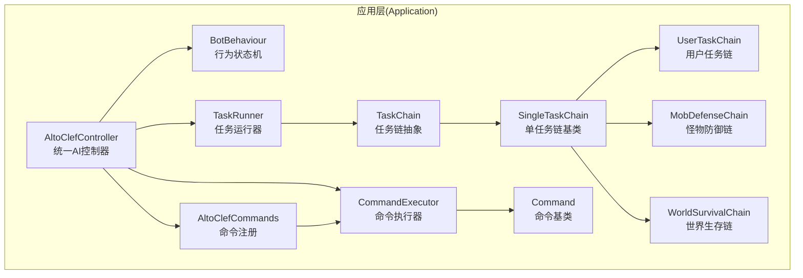
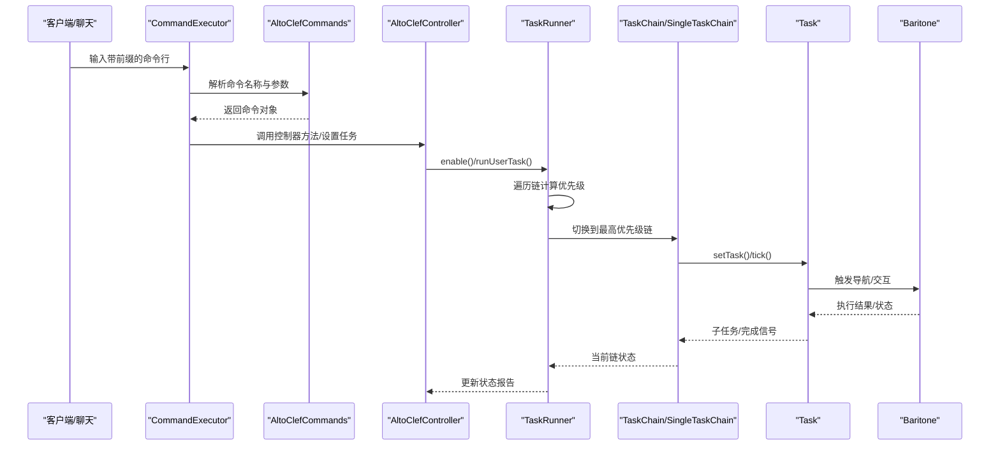
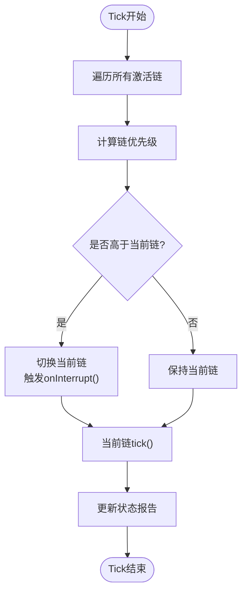
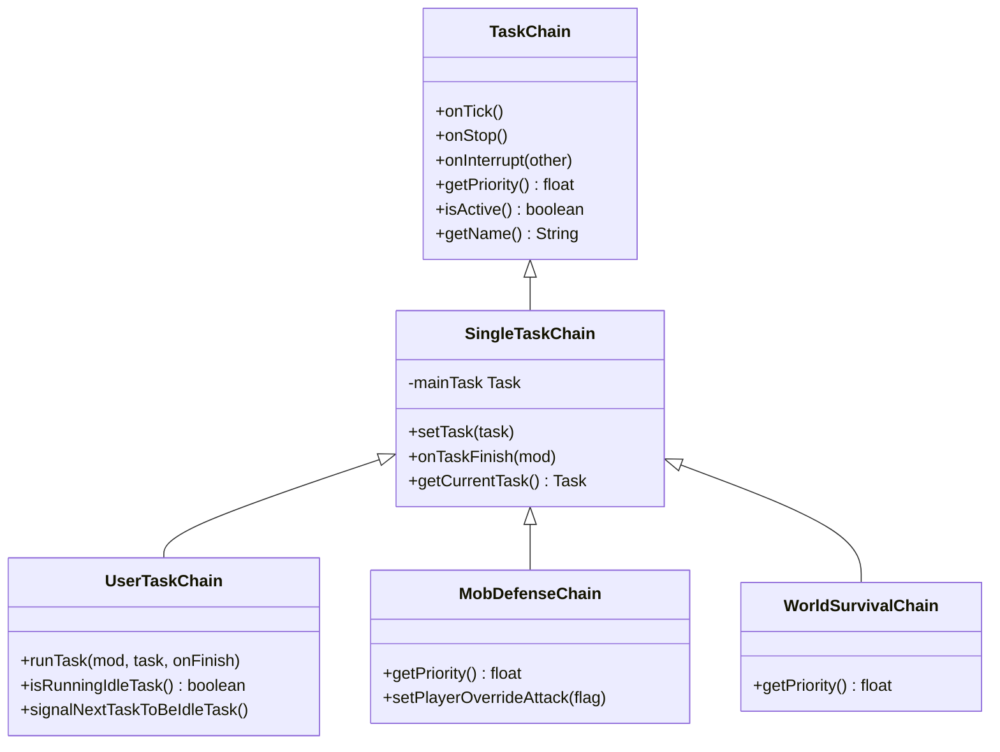
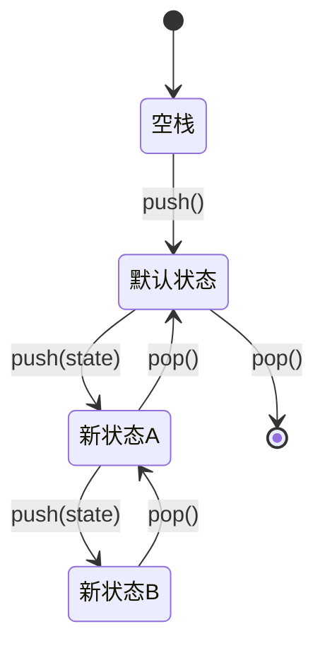
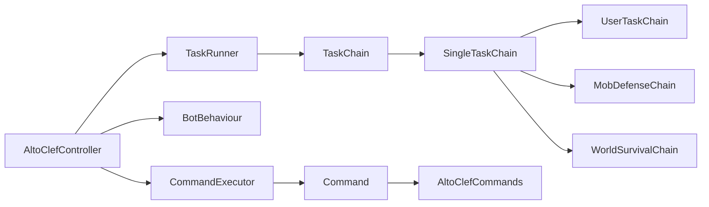

# Application层

<cite>
**本文引用的文件**
- [AltoClefController.java](file://src/main/java/adris/altoclef/AltoClefController.java)
- [BotBehaviour.java](file://src/main/java/adris/altoclef/BotBehaviour.java)
- [TaskRunner.java](file://src/main/java/adris/altoclef/tasksystem/TaskRunner.java)
- [TaskChain.java](file://src/main/java/adris/altoclef/tasksystem/TaskChain.java)
- [Task.java](file://src/main/java/adris/altoclef/tasksystem/Task.java)
- [SingleTaskChain.java](file://src/main/java/adris/altoclef/chains/SingleTaskChain.java)
- [UserTaskChain.java](file://src/main/java/adris/altoclef/chains/UserTaskChain.java)
- [MobDefenseChain.java](file://src/main/java/adris/altoclef/chains/MobDefenseChain.java)
- [WorldSurvivalChain.java](file://src/main/java/adris/altoclef/chains/WorldSurvivalChain.java)
- [CommandExecutor.java](file://src/main/java/adris/altoclef/commandsystem/CommandExecutor.java)
- [Command.java](file://src/main/java/adris/altoclef/commandsystem/Command.java)
- [AltoClefCommands.java](file://src/main/java/adris/altoclef/AltoClefCommands.java)
- [FollowPlayerTask.java](file://src/main/java/adris/altoclef/tasks/movement/FollowPlayerTask.java)
- [KillEntitiesTask.java](file://src/main/java/adris/altoclef/tasks/entity/KillEntitiesTask.java)
</cite>

## 目录
1. [简介](#简介)
2. [项目结构](#项目结构)
3. [核心组件](#核心组件)
4. [架构总览](#架构总览)
5. [详细组件分析](#详细组件分析)
6. [依赖分析](#依赖分析)
7. [性能考虑](#性能考虑)
8. [故障排查指南](#故障排查指南)
9. [结论](#结论)

## 简介
本文件面向Application层，系统化阐述统一AI行为控制器AltoClefController如何协调任务调度系统（TaskRunner、TaskChain、Task基类）、行为链系统（UserTaskChain、MobDefenseChain、WorldSurvivalChain等）、AI行为状态机（BotBehaviour状态管理与行为参数栈），以及命令执行系统（CommandExecutor、Command、AltoClefCommands注册）。文档重点解释任务优先级调度机制、行为链竞争执行原理、AI状态转换逻辑与指令解析执行流程，并通过图示与路径引用帮助读者快速定位实现位置。

## 项目结构
Application层位于adris/altoclef包下，围绕AltoClefController为中心，向上提供对外接口（命令、设置、持久化数据），向下组织任务系统与行为链，同时桥接Baritone导航与自研控制模块。



图表来源
- [AltoClefController.java:83-134](file://src/main/java/adris/altoclef/AltoClefController.java#L83-L134)
- [TaskRunner.java:17-20](file://src/main/java/adris/altoclef/tasksystem/TaskRunner.java#L17-L20)
- [TaskChain.java:11-14](file://src/main/java/adris/altoclef/tasksystem/TaskChain.java#L11-L14)
- [SingleTaskChain.java:17-20](file://src/main/java/adris/altoclef/chains/SingleTaskChain.java#L17-L20)
- [UserTaskChain.java:36-38](file://src/main/java/adris/altoclef/chains/UserTaskChain.java#L36-L38)
- [MobDefenseChain.java:105-107](file://src/main/java/adris/altoclef/chains/MobDefenseChain.java#L105-L107)
- [WorldSurvivalChain.java:33-35](file://src/main/java/adris/altoclef/chains/WorldSurvivalChain.java#L33-L35)
- [CommandExecutor.java:16-18](file://src/main/java/adris/altoclef/commandsystem/CommandExecutor.java#L16-L18)
- [Command.java:13-17](file://src/main/java/adris/altoclef/commandsystem/Command.java#L13-L17)
- [AltoClefCommands.java:30-57](file://src/main/java/adris/altoclef/AltoClefCommands.java#L30-L57)

章节来源
- [AltoClefController.java:83-134](file://src/main/java/adris/altoclef/AltoClefController.java#L83-L134)

## 核心组件
- 统一控制器AltoClefController：负责初始化各子系统（任务运行器、行为链、追踪器、输入控制、命令执行器、持久化数据），在服务端tick中驱动执行，并暴露统一访问入口。
- 任务系统：TaskRunner按优先级选择当前活跃链；TaskChain定义链生命周期与优先级；Task为具体可中断的原子任务单元。
- 行为链系统：SingleTaskChain封装单任务执行与切换；UserTaskChain处理用户下发任务与距离监控；MobDefenseChain处理战斗与防御；WorldSurvivalChain处理溺水、着火、地狱门卡住等紧急生存场景。
- 行为状态机BotBehaviour：以栈式状态管理封装Baritone行为参数（如避让策略、工具使用、射线流体处理等），支持入栈/出栈恢复。
- 命令执行系统：CommandExecutor解析“前缀+分号分段”的命令行，按顺序执行多个命令；Command定义命令抽象与参数解析；AltoClefCommands集中注册可用命令。

章节来源
- [AltoClefController.java:53-134](file://src/main/java/adris/altoclef/AltoClefController.java#L53-L134)
- [TaskRunner.java:9-20](file://src/main/java/adris/altoclef/tasksystem/TaskRunner.java#L9-L20)
- [TaskChain.java:7-14](file://src/main/java/adris/altoclef/tasksystem/TaskChain.java#L7-L14)
- [Task.java:8-16](file://src/main/java/adris/altoclef/tasksystem/Task.java#L8-L16)
- [SingleTaskChain.java:11-20](file://src/main/java/adris/altoclef/chains/SingleTaskChain.java#L11-L20)
- [UserTaskChain.java:14-38](file://src/main/java/adris/altoclef/chains/UserTaskChain.java#L14-L38)
- [MobDefenseChain.java:74-107](file://src/main/java/adris/altoclef/chains/MobDefenseChain.java#L74-L107)
- [WorldSurvivalChain.java:27-35](file://src/main/java/adris/altoclef/chains/WorldSurvivalChain.java#L27-L35)
- [BotBehaviour.java:22-29](file://src/main/java/adris/altoclef/BotBehaviour.java#L22-L29)
- [CommandExecutor.java:11-18](file://src/main/java/adris/altoclef/commandsystem/CommandExecutor.java#L11-L18)
- [Command.java:6-17](file://src/main/java/adris/altoclef/commandsystem/Command.java#L6-L17)
- [AltoClefCommands.java:29-57](file://src/main/java/adris/altoclef/AltoClefCommands.java#L29-L57)

## 架构总览
Application层通过AltoClefController串联各子系统，形成“命令—行为链—任务—导航/控制”的闭环。命令经CommandExecutor解析后触发行为链或直接运行用户任务；行为链根据优先级竞争成为当前执行链；单任务链内部维护单一主任务并支持子任务树；TaskRunner在每tick比较所有链的优先级并切换当前链；BotBehaviour通过状态栈动态调整导航参数。



图表来源
- [CommandExecutor.java:58-76](file://src/main/java/adris/altoclef/commandsystem/CommandExecutor.java#L58-L76)
- [AltoClefCommands.java:30-57](file://src/main/java/adris/altoclef/AltoClefCommands.java#L30-L57)
- [AltoClefController.java:203-214](file://src/main/java/adris/altoclef/AltoClefController.java#L203-L214)
- [TaskRunner.java:22-58](file://src/main/java/adris/altoclef/tasksystem/TaskRunner.java#L22-L58)
- [SingleTaskChain.java:54-67](file://src/main/java/adris/altoclef/chains/SingleTaskChain.java#L54-L67)
- [Task.java:17-50](file://src/main/java/adris/altoclef/tasksystem/Task.java#L17-L50)

## 详细组件分析

### 统一控制器 AltoClefController
- 职责
  - 初始化：命令执行器、任务运行器、行为链集合、追踪器、输入控制、额外控制器、持久化数据与AI服务。
  - Tick：在服务端tick中依次驱动输入控制、追踪器、扫描器、任务运行器、Baritone与心跳上报；同时进行情绪衰减。
  - 设置与配置：加载模组设置，注入Baritone额外设置（如避免放置/破坏、抛射物MLG等）。
  - 对外接口：获取实体、世界、交互控制器、Baritone实例、任务运行器、行为链、命令执行器等。
- 关键点
  - 在启用任务时调用BotBehaviour.push()以入栈新状态，禁用时pop()恢复。
  - 用户任务链支持“空闲命令”回退与自动返回拥有者逻辑。

章节来源
- [AltoClefController.java:83-134](file://src/main/java/adris/altoclef/AltoClefController.java#L83-L134)
- [AltoClefController.java:136-150](file://src/main/java/adris/altoclef/AltoClefController.java#L136-L150)
- [AltoClefController.java:171-193](file://src/main/java/adris/altoclef/AltoClefController.java#L171-L193)
- [AltoClefController.java:203-214](file://src/main/java/adris/altoclef/AltoClefController.java#L203-L214)

### 任务调度系统
- TaskRunner
  - 机制：每tick遍历所有已激活链，按getPriority()取最大优先级链作为当前链；若优先级变化则触发onInterrupt()通知旧链。
  - 生命周期：enable()入栈BotBehaviour状态并关闭“失去焦点暂停”；disable()弹栈并停止所有链。
- TaskChain/SingleTaskChain
  - TaskChain：抽象链，提供onTick/onStop/onInterrupt/getPriority/isActive/getName等接口；内部缓存当前tick的任务序列。
  - SingleTaskChain：维护mainTask，setTask()时若不相等则停止旧任务并重置；支持interrupted标记与onTaskFinish回调。
- Task
  - 抽象任务：首次tick执行onStart()；随后循环onTick()返回子任务并递归tick；支持stop()/interrupt()与失败fail()。
  - 可被强制打断：ITaskCanForce接口决定是否允许更高优先级打断。



图表来源
- [TaskRunner.java:22-58](file://src/main/java/adris/altoclef/tasksystem/TaskRunner.java#L22-L58)
- [TaskChain.java:16-36](file://src/main/java/adris/altoclef/tasksystem/TaskChain.java#L16-L36)
- [SingleTaskChain.java:23-44](file://src/main/java/adris/altoclef/chains/SingleTaskChain.java#L23-L44)
- [Task.java:17-50](file://src/main/java/adris/altoclef/tasksystem/Task.java#L17-L50)

章节来源
- [TaskRunner.java:9-98](file://src/main/java/adris/altoclef/tasksystem/TaskRunner.java#L9-L98)
- [TaskChain.java:7-51](file://src/main/java/adris/altoclef/tasksystem/TaskChain.java#L7-L51)
- [SingleTaskChain.java:11-96](file://src/main/java/adris/altoclef/chains/SingleTaskChain.java#L11-L96)
- [Task.java:8-181](file://src/main/java/adris/altoclef/tasksystem/Task.java#L8-L181)

### 行为链系统
- UserTaskChain
  - 优先级固定为较高值，确保用户任务优先执行。
  - 运行期间监控与拥有者距离，超过阈值自动返回并播报进度；支持“空闲任务”回退与语音反馈。
  - runTask()强制停止旧任务再设置新任务，避免相等任务被跳过。
- MobDefenseChain
  - 动态评估危险度（药水、末影螨、苦力怕、箭矢、龙之息等），在安全前提下进行强制力场/盾牌/逃跑/击杀。
  - 优先级受玩家攻击覆盖限制，避免与用户任务冲突。
- WorldSurvivalChain
  - 处理溺水、着火、用水灭火、地狱门卡住等紧急生存场景，优先级最高以保障存活。



图表来源
- [TaskChain.java:7-51](file://src/main/java/adris/altoclef/tasksystem/TaskChain.java#L7-L51)
- [SingleTaskChain.java:11-96](file://src/main/java/adris/altoclef/chains/SingleTaskChain.java#L11-L96)
- [UserTaskChain.java:14-223](file://src/main/java/adris/altoclef/chains/UserTaskChain.java#L14-L223)
- [MobDefenseChain.java:74-684](file://src/main/java/adris/altoclef/chains/MobDefenseChain.java#L74-L684)
- [WorldSurvivalChain.java:27-167](file://src/main/java/adris/altoclef/chains/WorldSurvivalChain.java#L27-L167)

章节来源
- [UserTaskChain.java:64-223](file://src/main/java/adris/altoclef/chains/UserTaskChain.java#L64-L223)
- [MobDefenseChain.java:152-407](file://src/main/java/adris/altoclef/chains/MobDefenseChain.java#L152-L407)
- [WorldSurvivalChain.java:42-106](file://src/main/java/adris/altoclef/chains/WorldSurvivalChain.java#L42-L106)

### AI行为状态机 BotBehaviour
- 设计
  - 使用双端队列维护状态栈，每个状态保存Baritone参数快照（跟随距离、是否允许对玩家施加力场、是否允许游泳穿过岩浆、避让破坏/放置策略、全局启发式等）。
  - 支持push()/push(state)/pop()，pop()会恢复上一个状态的参数。
- 用途
  - 在TaskRunner.enable()/disable()时入栈/出栈，保证链切换时行为参数正确恢复。
  - 提供便捷方法设置避让策略、保护物品、射线流体处理等。



图表来源
- [BotBehaviour.java:187-213](file://src/main/java/adris/altoclef/BotBehaviour.java#L187-L213)
- [BotBehaviour.java:224-342](file://src/main/java/adris/altoclef/BotBehaviour.java#L224-L342)
- [TaskRunner.java:64-84](file://src/main/java/adris/altoclef/tasksystem/TaskRunner.java#L64-L84)

章节来源
- [BotBehaviour.java:22-343](file://src/main/java/adris/altoclef/BotBehaviour.java#L22-L343)
- [TaskRunner.java:64-84](file://src/main/java/adris/altoclef/tasksystem/TaskRunner.java#L64-L84)

### 命令执行系统
- CommandExecutor
  - 前缀识别：以模组设置中的命令前缀开头。
  - 解析与执行：按“;”分割命令段，逐段查找命令并执行；异常时收集错误信息并继续后续命令。
  - 注册：通过AltoClefCommands集中注册命令。
- Command
  - 定义命令名、描述与参数解析器；run()负责装载参数并调用call()。
- AltoClefCommands
  - 注册Get/Eat/Follow/Farm/Fish等常用命令。

```mermaid
sequenceDiagram
participant U as "用户"
participant EX as "CommandExecutor"
participant REG as "AltoClefCommands"
participant CMD as "Command"
participant MOD as "AltoClefController"
U->>EX : 输入 "前缀 + 命令1;命令2;..."
EX->>REG : 解析命令名称
REG-->>EX : 返回命令对象数组
EX->>CMD : 逐个run(mod, args, onFinish)
CMD->>MOD : 调用控制器业务逻辑
MOD-->>CMD : 执行结果/状态
CMD-->>EX : 完成回调
EX-->>U : 输出日志/错误
```

图表来源
- [CommandExecutor.java:58-92](file://src/main/java/adris/altoclef/commandsystem/CommandExecutor.java#L58-L92)
- [AltoClefCommands.java:30-57](file://src/main/java/adris/altoclef/AltoClefCommands.java#L30-L57)
- [Command.java:19-30](file://src/main/java/adris/altoclef/commandsystem/Command.java#L19-L30)

章节来源
- [CommandExecutor.java:11-121](file://src/main/java/adris/altoclef/commandsystem/CommandExecutor.java#L11-L121)
- [Command.java:6-61](file://src/main/java/adris/altoclef/commandsystem/Command.java#L6-L61)
- [AltoClefCommands.java:29-59](file://src/main/java/adris/altoclef/AltoClefCommands.java#L29-L59)

## 依赖分析
- 控制器依赖
  - AltoClefController依赖TaskRunner、BotBehaviour、CommandExecutor、各类行为链与追踪器，形成强聚合关系。
- 任务系统耦合
  - TaskRunner与TaskChain/SingleTaskChain强耦合；Task与Baritone交互紧密。
- 命令系统
  - CommandExecutor依赖Command注册表；AltoClefCommands集中注册，降低分散耦合。



图表来源
- [AltoClefController.java:83-134](file://src/main/java/adris/altoclef/AltoClefController.java#L83-L134)
- [TaskRunner.java:17-20](file://src/main/java/adris/altoclef/tasksystem/TaskRunner.java#L17-L20)
- [TaskChain.java:11-14](file://src/main/java/adris/altoclef/tasksystem/TaskChain.java#L11-L14)
- [SingleTaskChain.java:17-20](file://src/main/java/adris/altoclef/chains/SingleTaskChain.java#L17-L20)
- [CommandExecutor.java:16-18](file://src/main/java/adris/altoclef/commandsystem/CommandExecutor.java#L16-L18)
- [AltoClefCommands.java:30-57](file://src/main/java/adris/altoclef/AltoClefCommands.java#L30-L57)

章节来源
- [AltoClefController.java:83-134](file://src/main/java/adris/altoclef/AltoClefController.java#L83-L134)
- [TaskRunner.java:9-98](file://src/main/java/adris/altoclef/tasksystem/TaskRunner.java#L9-L98)
- [CommandExecutor.java:11-121](file://src/main/java/adris/altoclef/commandsystem/CommandExecutor.java#L11-L121)

## 性能考虑
- 任务优先级与链切换
  - TaskRunner每tick遍历所有链计算优先级，建议行为链合理设置优先级，避免频繁切换导致状态抖动。
- 单任务链与子任务
  - SingleTaskChain在setTask()时强制停止旧任务，防止“相等任务”被跳过；但频繁切换仍可能带来开销，应合并相近任务。
- 导航参数入栈/出栈
  - BotBehaviour在TaskRunner.enable()/disable()时入栈/出栈，避免全局参数污染；注意不要过度频繁切换链。
- 命令解析
  - CommandExecutor按分号串行执行命令，异常会被捕获并继续；建议命令粒度适中，避免过长链导致阻塞。

## 故障排查指南
- 任务未执行或被跳过
  - 检查UserTaskChain.runTask()是否被调用且强制停止旧任务；确认Task.equals()实现是否正确区分不同参数。
  - 参考路径：[UserTaskChain.java:133-168](file://src/main/java/adris/altoclef/chains/UserTaskChain.java#L133-L168)，[Task.java:134-136](file://src/main/java/adris/altoclef/tasksystem/Task.java#L134-L136)
- 优先级竞争导致链切换频繁
  - 查看各行为链getPriority()实现，确认是否误设高/低优先级；必要时在TaskRunner.disable()前后检查状态栈。
  - 参考路径：[TaskRunner.java:22-58](file://src/main/java/adris/altoclef/tasksystem/TaskRunner.java#L22-L58)，[BotBehaviour.java:187-213](file://src/main/java/adris/altoclef/BotBehaviour.java#L187-L213)
- 命令无法解析或报错
  - 确认命令前缀与注册项；查看CommandExecutor的异常收集逻辑；检查命令参数格式。
  - 参考路径：[CommandExecutor.java:58-92](file://src/main/java/adris/altoclef/commandsystem/CommandExecutor.java#L58-L92)，[AltoClefCommands.java:30-57](file://src/main/java/adris/altoclef/AltoClefCommands.java#L30-L57)
- 用户任务链距离过远自动返回
  - 检查UserTaskChain的距离阈值与自动返回逻辑；确认isStopping标志位是否被正确清理。
  - 参考路径：[UserTaskChain.java:72-114](file://src/main/java/adris/altoclef/chains/UserTaskChain.java#L72-L114)，[UserTaskChain.java:151-165](file://src/main/java/adris/altoclef/chains/UserTaskChain.java#L151-L165)

## 结论
Application层以AltoClefController为核心，通过BotBehaviour的状态栈管理、TaskRunner的优先级调度、SingleTaskChain的单任务执行模型与CommandExecutor的命令解析，构建了稳定而灵活的AI行为体系。行为链在不同场景下竞争优先级，确保用户任务、生存需求与战斗防御得到恰当响应；同时通过Baritone的导航能力与自研控制模块实现复杂动作的组合执行。该设计既保证了模块内聚，又便于扩展新的行为链与命令。