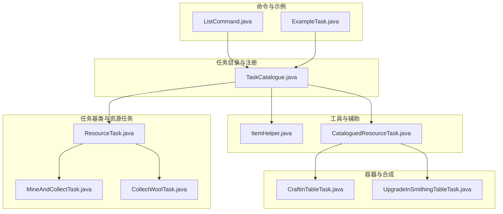
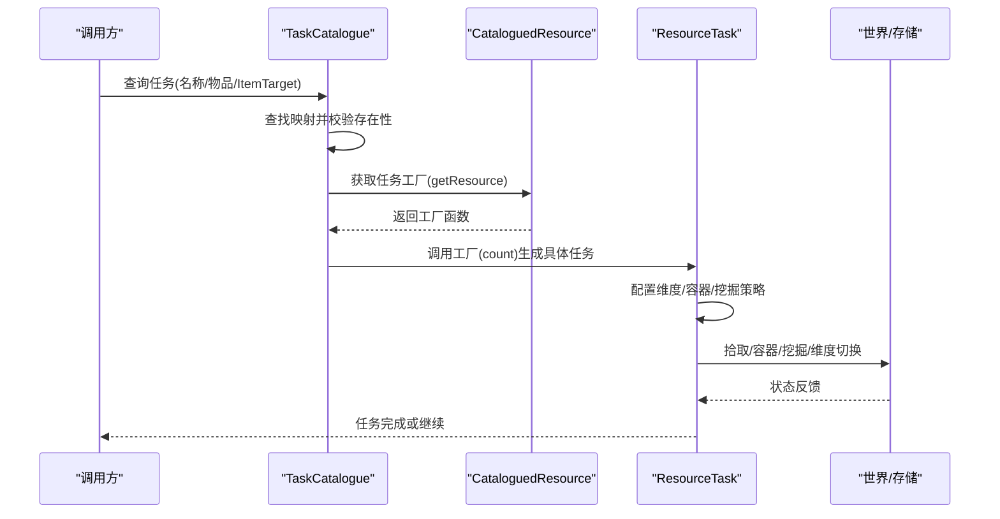
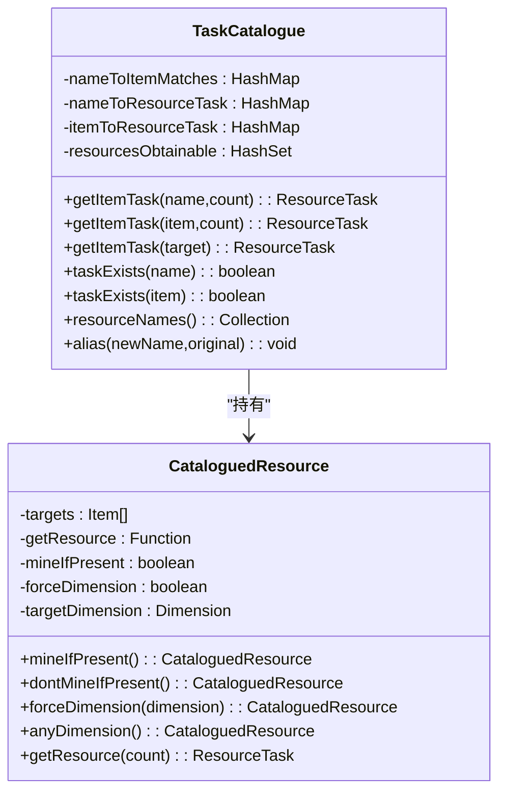
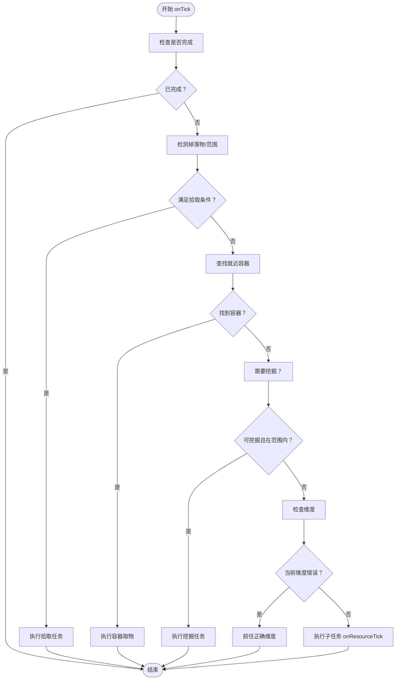
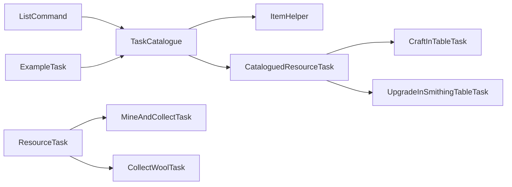

# 任务目录系统

<cite>
**本文档引用的文件**
- [TaskCatalogue.java](file://src/main/java/adris/altoclef/TaskCatalogue.java)
- [ResourceTask.java](file://src/main/java/adris/altoclef/tasks/ResourceTask.java)
- [CollectWoolTask.java](file://src/main/java/adris/altoclef/tasks/resources/CollectWoolTask.java)
- [ItemHelper.java](file://src/main/java/adris/altoclef/util/helpers/ItemHelper.java)
- [CataloguedResourceTask.java](file://src/main/java/adris/altoclef/tasks/squashed/CataloguedResourceTask.java)
- [ListCommand.java](file://src/main/java/adris/altoclef/commands/ListCommand.java)
- [ExampleTask.java](file://src/main/java/adris/altoclef/tasks/examples/ExampleTask.java)
- [MineAndCollectTask.java](file://src/main/java/adris/altoclef/tasks/resources/MineAndCollectTask.java)
- [CraftInTableTask.java](file://src/main/java/adris/altoclef/tasks/container/CraftInTableTask.java)
- [UpgradeInSmithingTableTask.java](file://src/main/java/adris/altoclef/tasks/container/UpgradeInSmithingTableTask.java)
</cite>

## 目录
1. [简介](#简介)
2. [项目结构](#项目结构)
3. [核心组件](#核心组件)
4. [架构总览](#架构总览)
5. [详细组件分析](#详细组件分析)
6. [依赖关系分析](#依赖关系分析)
7. [性能考虑](#性能考虑)
8. [故障排除指南](#故障排除指南)
9. [结论](#结论)
10. [附录](#附录)

## 简介
本文件为任务目录系统（TaskCatalogue）的详细架构文档。该系统负责统一管理游戏中可获取资源的任务清单，提供任务注册、分类管理、动态加载与查询能力，并通过任务元数据与依赖解析实现跨模块协作。系统支持按名称或物品匹配查询、维度强制与容器收集策略、以及复合任务的“压缩”优化，确保在复杂任务链中高效完成目标。

## 项目结构
任务目录系统位于主模块的顶层包中，围绕以下关键路径组织：
- 核心目录与任务注册：src/main/java/adris/altoclef/TaskCatalogue.java
- 资源任务基类与行为：src/main/java/adris/altoclef/tasks/ResourceTask.java
- 具体资源任务示例：src/main/java/adris/altoclef/tasks/resources/*.java
- 工具与辅助类：src/main/java/adris/altoclef/util/helpers/ItemHelper.java
- 复合任务压缩器：src/main/java/adris/altoclef/tasks/squashed/CataloguedResourceTask.java
- 命令与示例：src/main/java/adris/altoclef/commands/* 与 src/main/java/adris/altoclef/tasks/examples/*

**图表来源**
- [TaskCatalogue.java:95-1031](file://src/main/java/adris/altoclef/TaskCatalogue.java#L95-L1031)
- [ResourceTask.java:31-242](file://src/main/java/adris/altoclef/tasks/ResourceTask.java#L31-L242)
- [MineAndCollectTask.java:39-361](file://src/main/java/adris/altoclef/tasks/resources/MineAndCollectTask.java#L39-L361)
- [CollectWoolTask.java:18-89](file://src/main/java/adris/altoclef/tasks/resources/CollectWoolTask.java#L18-L89)
- [ItemHelper.java:23-1452](file://src/main/java/adris/altoclef/util/helpers/ItemHelper.java#L23-L1452)
- [CataloguedResourceTask.java:18-134](file://src/main/java/adris/altoclef/tasks/squashed/CataloguedResourceTask.java#L18-L134)
- [CraftInTableTask.java:26-162](file://src/main/java/adris/altoclef/tasks/container/CraftInTableTask.java#L26-L162)
- [UpgradeInSmithingTableTask.java:22-131](file://src/main/java/adris/altoclef/tasks/container/UpgradeInSmithingTableTask.java#L22-L131)
- [ListCommand.java:10-22](file://src/main/java/adris/altoclef/commands/ListCommand.java#L10-L22)
- [ExampleTask.java:12-68](file://src/main/java/adris/altoclef/tasks/examples/ExampleTask.java#L12-L68)

**章节来源**
- [TaskCatalogue.java:95-1031](file://src/main/java/adris/altoclef/TaskCatalogue.java#L95-L1031)
- [ResourceTask.java:31-242](file://src/main/java/adris/altoclef/tasks/ResourceTask.java#L31-L242)

## 核心组件
- 任务目录（TaskCatalogue）
  - 维护名称到任务资源映射、物品到任务资源映射、可获取物品集合等内部索引。
  - 提供注册方法（put）、查询方法（getItemTask、taskExists、resourceNames）、别名（alias）与维度控制（forceDimension/anyDimension）。
  - 内部类 CataloguedResource 封装任务工厂函数与维度/挖掘策略配置。
- 资源任务基类（ResourceTask）
  - 定义资源型任务的生命周期与通用行为：拾取掉落物、从容器取物、就近挖掘、维度切换等。
  - 支持强制维度、容器收集开关、挖掘优先策略等。
- 工具与辅助（ItemHelper）
  - 提供颜色化物品、木料类型等批量枚举与转换工具，支撑目录中的多变体注册。
- 复合任务压缩（CataloguedResourceTask）
  - 将多个独立任务合并为更高效的执行序列，减少重复开销；内置针对合成与锻造的压缩器。

**章节来源**
- [TaskCatalogue.java:95-1031](file://src/main/java/adris/altoclef/TaskCatalogue.java#L95-L1031)
- [ResourceTask.java:31-242](file://src/main/java/adris/altoclef/tasks/ResourceTask.java#L31-L242)
- [ItemHelper.java:23-1452](file://src/main/java/adris/altoclef/util/helpers/ItemHelper.java#L23-L1452)
- [CataloguedResourceTask.java:18-134](file://src/main/java/adris/altoclef/tasks/squashed/CataloguedResourceTask.java#L18-L134)

## 架构总览
任务目录系统采用“注册-查询-执行”的分层架构：
- 注册层：在静态初始化块中集中注册所有可获取资源，构建名称/物品到任务工厂的映射。
- 查询层：对外暴露统一查询接口，支持按名称、物品或 ItemTarget 查询，自动处理别名与多变体。
- 执行层：返回的具体任务对象继承 ResourceTask，具备统一的拾取、容器、挖掘与维度控制逻辑。
- 压缩层：对复合任务进行压缩，提升执行效率。

**图表来源**
- [TaskCatalogue.java:150-176](file://src/main/java/adris/altoclef/TaskCatalogue.java#L150-L176)
- [TaskCatalogue.java:983-1029](file://src/main/java/adris/altoclef/TaskCatalogue.java#L983-L1029)
- [ResourceTask.java:66-168](file://src/main/java/adris/altoclef/tasks/ResourceTask.java#L66-L168)

## 详细组件分析

### 任务目录（TaskCatalogue）
- 设计目的
  - 统一管理可获取资源的任务清单，提供稳定的查询接口与扩展点，屏蔽底层任务实现细节。
- 关键职责
  - 注册：put/简单注册、挖掘注册、剪羊毛/作物/熔炼/锻造/怪物掉落等专用注册器。
  - 查询：按名称/物品/ItemTarget获取任务；判断是否存在；列出可获取资源名称。
  - 元数据：维度强制/不限制、是否允许挖掘、可获取物品集合。
  - 别名：alias 支持重定向，便于向后兼容与简化调用。
- 动态加载与扩展
  - 通过静态初始化集中注册，新增资源只需在对应注册器中添加条目即可。
  - CataloguedResource 提供链式配置（forceDimension/dontMineIfPresent/anyDimension），便于扩展不同场景。
- 代码示例（路径）
  - 注册一个基础资源任务：[TaskCatalogue.java:101-132](file://src/main/java/adris/altoclef/TaskCatalogue.java#L101-L132)
  - 注册一个挖掘任务：[TaskCatalogue.java:198-210](file://src/main/java/adris/altoclef/TaskCatalogue.java#L198-L210)
  - 注册一个熔炼任务：[TaskCatalogue.java:268-272](file://src/main/java/adris/altoclef/TaskCatalogue.java#L268-L272)
  - 注册一个锻造升级任务：[TaskCatalogue.java:278-282](file://src/main/java/adris/altoclef/TaskCatalogue.java#L278-L282)
  - 注册一个怪物掉落任务：[TaskCatalogue.java:288-294](file://src/main/java/adris/altoclef/TaskCatalogue.java#L288-L294)
  - 注册一个作物任务：[TaskCatalogue.java:305-311](file://src/main/java/adris/altoclef/TaskCatalogue.java#L305-L311)
  - 注册一组木制品任务（含维度限制）：[TaskCatalogue.java:498-507](file://src/main/java/adris/altoclef/TaskCatalogue.java#L498-L507)
  - 创建别名：[TaskCatalogue.java:383-390](file://src/main/java/adris/altoclef/TaskCatalogue.java#L383-L390)

**图表来源**
- [TaskCatalogue.java:95-1031](file://src/main/java/adris/altoclef/TaskCatalogue.java#L95-L1031)

**章节来源**
- [TaskCatalogue.java:95-1031](file://src/main/java/adris/altoclef/TaskCatalogue.java#L95-L1031)

### 资源任务基类（ResourceTask）
- 设计目的
  - 为所有资源型任务提供统一的生命周期与行为框架，包括拾取、容器、挖掘与维度控制。
- 关键行为
  - 生命周期：onStart/onTick/onStop，支持中断与强制。
  - 拾取优先：检测掉落物并在范围内拾取。
  - 容器取物：就近容器扫描与取物。
  - 挖掘策略：根据需求判定是否就近挖掘，支持最小工具等级要求。
  - 维度控制：可强制进入指定维度，自动切换传送门或维度目标。
- 代码示例（路径）
  - 生命周期与拾取流程：[ResourceTask.java:66-168](file://src/main/java/adris/altoclef/tasks/ResourceTask.java#L66-L168)
  - 维度切换与强制维度：[ResourceTask.java:202-214](file://src/main/java/adris/altoclef/tasks/ResourceTask.java#L202-L214)
  - 挖掘触发条件与范围判定：[ResourceTask.java:136-159](file://src/main/java/adris/altoclef/tasks/ResourceTask.java#L136-L159)

**图表来源**
- [ResourceTask.java:74-168](file://src/main/java/adris/altoclef/tasks/ResourceTask.java#L74-L168)

**章节来源**
- [ResourceTask.java:31-242](file://src/main/java/adris/altoclef/tasks/ResourceTask.java#L31-L242)

### 示例任务与命令集成
- 示例任务（ExampleTask）
  - 展示如何通过 TaskCatalogue 获取工具与材料，再执行放置方块等操作。
  - 代码示例（路径）：[ExampleTask.java:31-41](file://src/main/java/adris/altoclef/tasks/examples/ExampleTask.java#L31-L41)
- 列表命令（ListCommand）
  - 输出所有可获取资源名称列表，便于调试与验证目录完整性。
  - 代码示例（路径）：[ListCommand.java:16-20](file://src/main/java/adris/altoclef/commands/ListCommand.java#L16-L20)

**章节来源**
- [ExampleTask.java:12-68](file://src/main/java/adris/altoclef/tasks/examples/ExampleTask.java#L12-L68)
- [ListCommand.java:10-22](file://src/main/java/adris/altoclef/commands/ListCommand.java#L10-L22)

### 具体任务实现与依赖解析
- 挖掘与收集（MineAndCollectTask）
  - 根据需求判定工具等级，就近挖掘并收集掉落物；支持范围超时与黑名单机制。
  - 代码示例（路径）：[MineAndCollectTask.java:94-105](file://src/main/java/adris/altoclef/tasks/resources/MineAndCollectTask.java#L94-L105)
- 剪羊毛与采集（CollectWoolTask）
  - 优先尝试直接挖掘羊毛方块，否则在错误维度时先去正确维度，最后通过剪刀或击杀获取。
  - 代码示例（路径）：[CollectWoolTask.java:58-72](file://src/main/java/adris/altoclef/tasks/resources/CollectWoolTask.java#L58-L72)
- 合成任务（CraftInTableTask）
  - 自动寻找工作台，收集所需材料，执行合成；若无工作台则先获取。
  - 代码示例（路径）：[CraftInTableTask.java:64-140](file://src/main/java/adris/altoclef/tasks/container/CraftInTableTask.java#L64-L140)
- 锻造升级（UpgradeInSmithingTableTask）
  - 使用模板与材料在铁砧工作台升级物品，必要时先卸下装备。
  - 代码示例（路径）：[UpgradeInSmithingTableTask.java:51-99](file://src/main/java/adris/altoclef/tasks/container/UpgradeInSmithingTableTask.java#L51-L99)

**章节来源**
- [MineAndCollectTask.java:39-361](file://src/main/java/adris/altoclef/tasks/resources/MineAndCollectTask.java#L39-L361)
- [CollectWoolTask.java:18-89](file://src/main/java/adris/altoclef/tasks/resources/CollectWoolTask.java#L18-L89)
- [CraftInTableTask.java:26-162](file://src/main/java/adris/altoclef/tasks/container/CraftInTableTask.java#L26-L162)
- [UpgradeInSmithingTableTask.java:22-131](file://src/main/java/adris/altoclef/tasks/container/UpgradeInSmithingTableTask.java#L22-L131)

## 依赖关系分析
- 组件耦合
  - TaskCatalogue 依赖 ItemHelper 进行颜色/木料等批量枚举与转换。
  - ResourceTask 及其子类依赖控制器与世界扫描器进行状态查询与执行。
  - CataloguedResourceTask 依赖 TaskCatalogue 的查询接口与压缩器。
- 外部依赖
  - 与 Baritone 的路径与交互行为集成，用于寻路与执行动作。
  - 与存储系统交互，跟踪掉落物、容器与库存变化。

**图表来源**
- [TaskCatalogue.java:95-1031](file://src/main/java/adris/altoclef/TaskCatalogue.java#L95-L1031)
- [ItemHelper.java:23-1452](file://src/main/java/adris/altoclef/util/helpers/ItemHelper.java#L23-L1452)
- [CataloguedResourceTask.java:18-134](file://src/main/java/adris/altoclef/tasks/squashed/CataloguedResourceTask.java#L18-L134)
- [ResourceTask.java:31-242](file://src/main/java/adris/altoclef/tasks/ResourceTask.java#L31-L242)
- [MineAndCollectTask.java:39-361](file://src/main/java/adris/altoclef/tasks/resources/MineAndCollectTask.java#L39-L361)
- [CollectWoolTask.java:18-89](file://src/main/java/adris/altoclef/tasks/resources/CollectWoolTask.java#L18-L89)
- [CraftInTableTask.java:26-162](file://src/main/java/adris/altoclef/tasks/container/CraftInTableTask.java#L26-L162)
- [UpgradeInSmithingTableTask.java:22-131](file://src/main/java/adris/altoclef/tasks/container/UpgradeInSmithingTableTask.java#L22-L131)
- [ListCommand.java:10-22](file://src/main/java/adris/altoclef/commands/ListCommand.java#L10-L22)
- [ExampleTask.java:12-68](file://src/main/java/adris/altoclef/tasks/examples/ExampleTask.java#L12-L68)

**章节来源**
- [TaskCatalogue.java:95-1031](file://src/main/java/adris/altoclef/TaskCatalogue.java#L95-L1031)
- [ItemHelper.java:23-1452](file://src/main/java/adris/altoclef/util/helpers/ItemHelper.java#L23-L1452)
- [ResourceTask.java:31-242](file://src/main/java/adris/altoclef/tasks/ResourceTask.java#L31-L242)

## 性能考虑
- 查询与缓存
  - 名称/物品到任务资源的映射为哈希表，查询时间复杂度近似 O(1)，适合高频调用。
- 任务压缩
  - CataloguedResourceTask 对同类任务（如合成/锻造）进行压缩，减少重复开销与路径规划次数。
- 拾取与容器策略
  - ResourceTask 在范围内优先拾取掉落物，避免不必要的移动；容器取物仅在限定范围内生效，降低扫描成本。
- 维度控制
  - 通过 CataloguedResource 的 forceDimension/anyDimension 预设维度策略，减少运行时判断与切换。

## 故障排除指南
- 任务不存在
  - 现象：查询返回空或警告日志。
  - 排查：确认名称拼写与别名是否正确；使用 resourceNames() 列出可用项。
  - 参考路径：[TaskCatalogue.java:150-158](file://src/main/java/adris/altoclef/TaskCatalogue.java#L150-L158)
- 维度错误导致无法执行
  - 现象：任务在错误维度卡住。
  - 排查：确认 CataloguedResource 是否设置了强制维度；检查 ResourceTask 的 isInWrongDimension 逻辑。
  - 参考路径：[TaskCatalogue.java:1005-1014](file://src/main/java/adris/altoclef/TaskCatalogue.java#L1005-L1014)、[ResourceTask.java:202-208](file://src/main/java/adris/altoclef/tasks/ResourceTask.java#L202-L208)
- 挖掘范围超时
  - 现象：长时间未找到目标后任务提前结束。
  - 排查：检查 MineAndCollectTask 的范围超时阈值与黑名单机制。
  - 参考路径：[MineAndCollectTask.java:265-285](file://src/main/java/adris/altoclef/tasks/resources/MineAndCollectTask.java#L265-L285)
- 合成/升级缺少材料
  - 现象：CraftInTableTask/UpgradeInSmithingTableTask 回退到收集材料。
  - 排查：确认 CollectRecipeCataloguedResourcesTask 或 CataloguedResourceTask 是否正确收集所需物品。
  - 参考路径：[CraftInTableTask.java:69-71](file://src/main/java/adris/altoclef/tasks/container/CraftInTableTask.java#L69-L71)、[UpgradeInSmithingTableTask.java:60-62](file://src/main/java/adris/altoclef/tasks/container/UpgradeInSmithingTableTask.java#L60-L62)

**章节来源**
- [TaskCatalogue.java:150-158](file://src/main/java/adris/altoclef/TaskCatalogue.java#L150-L158)
- [ResourceTask.java:202-208](file://src/main/java/adris/altoclef/tasks/ResourceTask.java#L202-L208)
- [MineAndCollectTask.java:265-285](file://src/main/java/adris/altoclef/tasks/resources/MineAndCollectTask.java#L265-L285)
- [CraftInTableTask.java:69-71](file://src/main/java/adris/altoclef/tasks/container/CraftInTableTask.java#L69-L71)
- [UpgradeInSmithingTableTask.java:60-62](file://src/main/java/adris/altoclef/tasks/container/UpgradeInSmithingTableTask.java#L60-L62)

## 结论
任务目录系统通过集中注册、统一查询与灵活的元数据配置，实现了对复杂资源任务的高效管理与执行。结合 ResourceTask 的通用行为与 CataloguedResourceTask 的压缩优化，系统在保证可扩展性的同时提升了执行效率。建议在新增资源时遵循现有注册器模式，并合理设置维度与挖掘策略，以获得最佳体验。

## 附录

### 常用接口与示例（路径）
- 注册新任务（示例）
  - 基础资源注册：[TaskCatalogue.java:101-132](file://src/main/java/adris/altoclef/TaskCatalogue.java#L101-L132)
  - 挖掘任务注册：[TaskCatalogue.java:198-210](file://src/main/java/adris/altoclef/TaskCatalogue.java#L198-L210)
  - 熔炼任务注册：[TaskCatalogue.java:268-272](file://src/main/java/adris/altoclef/TaskCatalogue.java#L268-L272)
  - 锻造升级任务注册：[TaskCatalogue.java:278-282](file://src/main/java/adris/altoclef/TaskCatalogue.java#L278-L282)
  - 怪物掉落任务注册：[TaskCatalogue.java:288-294](file://src/main/java/adris/altoclef/TaskCatalogue.java#L288-L294)
  - 作物任务注册：[TaskCatalogue.java:305-311](file://src/main/java/adris/altoclef/TaskCatalogue.java#L305-L311)
  - 木制品任务注册（含维度）：[TaskCatalogue.java:498-507](file://src/main/java/adris/altoclef/TaskCatalogue.java#L498-L507)
  - 创建别名：[TaskCatalogue.java:383-390](file://src/main/java/adris/altoclef/TaskCatalogue.java#L383-L390)
- 查询任务
  - 按名称/物品/ItemTarget 查询：[TaskCatalogue.java:150-176](file://src/main/java/adris/altoclef/TaskCatalogue.java#L150-L176)
  - 判断是否存在：[TaskCatalogue.java:178-184](file://src/main/java/adris/altoclef/TaskCatalogue.java#L178-L184)
  - 列出可获取资源名称：[TaskCatalogue.java:186-188](file://src/main/java/adris/altoclef/TaskCatalogue.java#L186-L188)
- 使用示例
  - 示例任务中获取工具与材料：[ExampleTask.java:31-41](file://src/main/java/adris/altoclef/tasks/examples/ExampleTask.java#L31-L41)
  - 列出所有可获取资源：[ListCommand.java:16-20](file://src/main/java/adris/altoclef/commands/ListCommand.java#L16-L20)