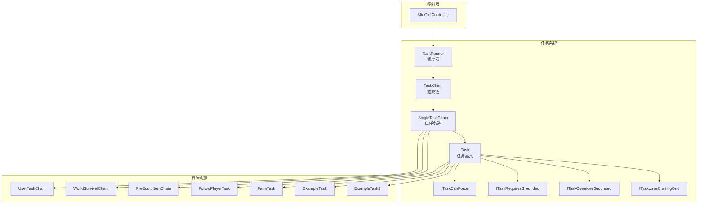
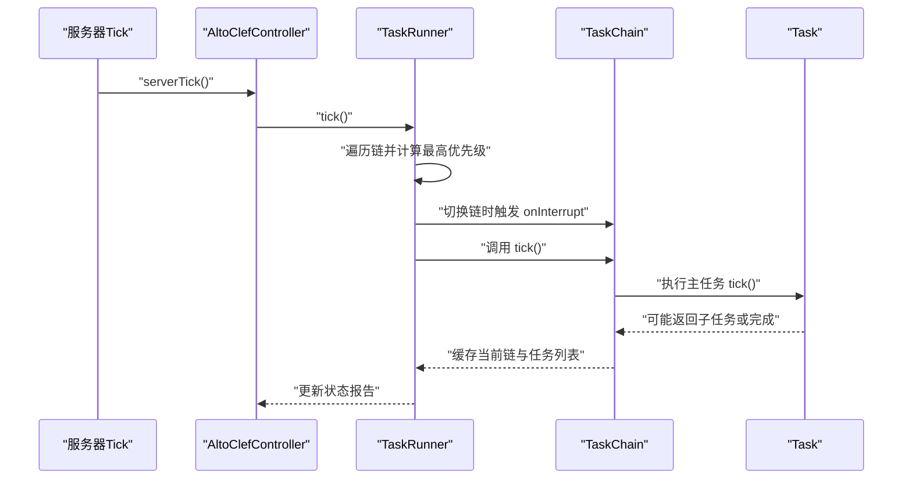
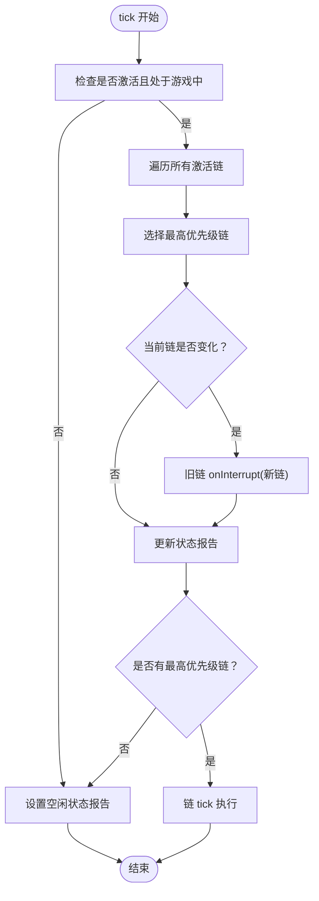
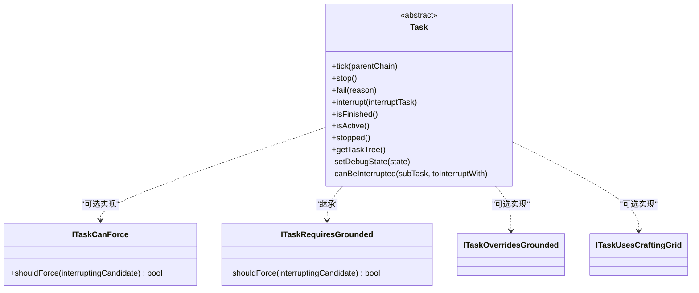
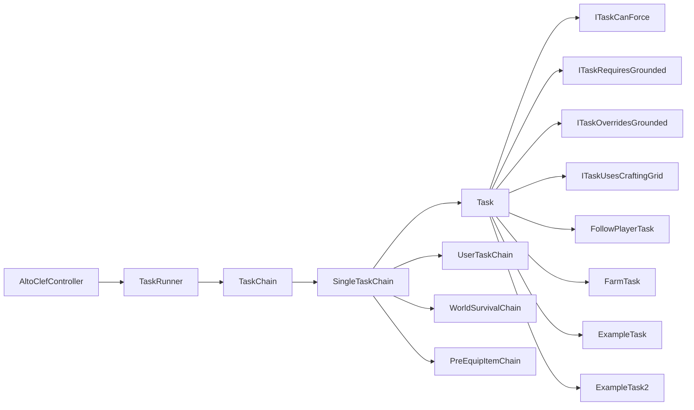

# 任务调度系统

<cite>
**本文引用的文件**
- [TaskRunner.java](file://src/main/java/adris/altoclef/tasksystem/TaskRunner.java)
- [TaskChain.java](file://src/main/java/adris/altoclef/tasksystem/TaskChain.java)
- [Task.java](file://src/main/java/adris/altoclef/tasksystem/Task.java)
- [SingleTaskChain.java](file://src/main/java/adris/altoclef/chains/SingleTaskChain.java)
- [UserTaskChain.java](file://src/main/java/adris/altoclef/chains/UserTaskChain.java)
- [WorldSurvivalChain.java](file://src/main/java/adris/altoclef/chains/WorldSurvivalChain.java)
- [PreEquipItemChain.java](file://src/main/java/adris/altoclef/chains/PreEquipItemChain.java)
- [ITaskCanForce.java](file://src/main/java/adris/altoclef/tasksystem/ITaskCanForce.java)
- [ITaskOverridesGrounded.java](file://src/main/java/adris/altoclef/tasksystem/ITaskOverridesGrounded.java)
- [ITaskRequiresGrounded.java](file://src/main/java/adris/altoclef/tasksystem/ITaskRequiresGrounded.java)
- [ITaskUsesCraftingGrid.java](file://src/main/java/adris/altoclef/tasksystem/ITaskUsesCraftingGrid.java)
- [ExampleTask.java](file://src/main/java/adris/altoclef/tasks/examples/ExampleTask.java)
- [ExampleTask2.java](file://src/main/java/adris/altoclef/tasks/examples/ExampleTask2.java)
- [FollowPlayerTask.java](file://src/main/java/adris/altoclef/tasks/movement/FollowPlayerTask.java)
- [FarmTask.java](file://src/main/java/adris/altoclef/tasks/misc/FarmTask.java)
- [AltoClefController.java](file://src/main/java/adris/altoclef/AltoClefController.java)
</cite>

## 目录
1. [简介](#简介)
2. [项目结构](#项目结构)
3. [核心组件](#核心组件)
4. [架构总览](#架构总览)
5. [详细组件分析](#详细组件分析)
6. [依赖分析](#依赖分析)
7. [性能考虑](#性能考虑)
8. [故障排查指南](#故障排查指南)
9. [结论](#结论)
10. [附录：示例与最佳实践](#附录示例与最佳实践)

## 简介
本文件面向任务调度系统，围绕 TaskRunner 任务调度器、TaskChain 任务链设计模式、Task 基类的抽象设计展开，系统性阐述任务优先级队列、并发执行控制、任务状态管理、链式调用与条件执行逻辑，并提供可操作的示例路径与性能优化建议，帮助开发者快速上手并扩展自定义任务与任务链。

## 项目结构
任务调度系统位于模块路径 adris.altoclef 的 tasksystem 与 chains 包中，配合控制器 AltoClefController 在服务端 Tick 中驱动执行。核心文件如下：
- 调度器与链：TaskRunner、TaskChain、SingleTaskChain
- 任务基类与接口：Task、ITaskCanForce、ITaskRequiresGrounded、ITaskOverridesGrounded、ITaskUsesCraftingGrid
- 典型任务与链：UserTaskChain、WorldSurvivalChain、PreEquipItemChain、FollowPlayerTask、FarmTask、ExampleTask、ExampleTask2
- 控制器入口：AltoClefController（在 serverTick 中统一调度）

图表来源
- [TaskRunner.java:1-98](file://src/main/java/adris/altoclef/tasksystem/TaskRunner.java#L1-L98)
- [TaskChain.java:1-51](file://src/main/java/adris/altoclef/tasksystem/TaskChain.java#L1-L51)
- [SingleTaskChain.java:1-96](file://src/main/java/adris/altoclef/chains/SingleTaskChain.java#L1-L96)
- [Task.java:1-181](file://src/main/java/adris/altoclef/tasksystem/Task.java#L1-L181)
- [UserTaskChain.java:1-223](file://src/main/java/adris/altoclef/chains/UserTaskChain.java#L1-L223)
- [WorldSurvivalChain.java:1-167](file://src/main/java/adris/altoclef/chains/WorldSurvivalChain.java#L1-L167)
- [PreEquipItemChain.java:1-63](file://src/main/java/adris/altoclef/chains/PreEquipItemChain.java#L1-L63)
- [FollowPlayerTask.java:1-75](file://src/main/java/adris/altoclef/tasks/movement/FollowPlayerTask.java#L1-L75)
- [FarmTask.java:1-67](file://src/main/java/adris/altoclef/tasks/misc/FarmTask.java#L1-L67)
- [ExampleTask.java:1-68](file://src/main/java/adris/altoclef/tasks/examples/ExampleTask.java#L1-L68)
- [ExampleTask2.java:1-70](file://src/main/java/adris/altoclef/tasks/examples/ExampleTask2.java#L1-L70)
- [AltoClefController.java:135-149](file://src/main/java/adris/altoclef/AltoClefController.java#L135-L149)

章节来源
- [AltoClefController.java:82-133](file://src/main/java/adris/altoclef/AltoClefController.java#L82-L133)
- [AltoClefController.java:135-149](file://src/main/java/adris/altoclef/AltoClefController.java#L135-L149)

## 核心组件
- TaskRunner：全局调度器，负责在每帧遍历所有 TaskChain，选择最高优先级链并驱动其执行；支持启用/禁用、中断切换、状态报告。
- TaskChain：任务链抽象，封装链的生命周期（onTick/onStop）、优先级与激活状态、名称、以及向当前链注入任务的能力。
- SingleTaskChain：单任务链基类，负责设置与执行单一主任务，处理任务完成回调、打断与重置。
- Task：任务基类，定义任务生命周期（start/tick/stop/fail）、子任务嵌套与中断策略、调试状态与树形展示、超时检测等。
- 接口族：ITaskCanForce/ITaskRequiresGrounded/ITaskOverridesGrounded/ITaskUsesCraftingGrid 提供任务间强制中断判定、地面状态要求、使用工作台等能力标记。

章节来源
- [TaskRunner.java:9-98](file://src/main/java/adris/altoclef/tasksystem/TaskRunner.java#L9-L98)
- [TaskChain.java:7-51](file://src/main/java/adris/altoclef/tasksystem/TaskChain.java#L7-L51)
- [SingleTaskChain.java:11-96](file://src/main/java/adris/altoclef/chains/SingleTaskChain.java#L11-L96)
- [Task.java:8-181](file://src/main/java/adris/altoclef/tasksystem/Task.java#L8-L181)
- [ITaskCanForce.java:1-6](file://src/main/java/adris/altoclef/tasksystem/ITaskCanForce.java#L1-L6)
- [ITaskRequiresGrounded.java:1-16](file://src/main/java/adris/altoclef/tasksystem/ITaskRequiresGrounded.java#L1-L16)
- [ITaskOverridesGrounded.java:1-5](file://src/main/java/adris/altoclef/tasksystem/ITaskOverridesGrounded.java#L1-L5)
- [ITaskUsesCraftingGrid.java:1-5](file://src/main/java/adris/altoclef/tasksystem/ITaskUsesCraftingGrid.java#L1-L5)

## 架构总览
调度主循环在控制器的 serverTick 中触发，TaskRunner 遍历所有已注册链，按优先级选择当前链并驱动其执行；链内部通过 SingleTaskChain 管理单一主任务，任务可返回子任务形成嵌套执行树；任务中断策略由 Task 内部的 canBeInterrupted 与 ITaskCanForce/ITaskRequiresGrounded 协同决定。

图表来源
- [AltoClefController.java:135-149](file://src/main/java/adris/altoclef/AltoClefController.java#L135-L149)
- [TaskRunner.java:22-58](file://src/main/java/adris/altoclef/tasksystem/TaskRunner.java#L22-L58)
- [TaskChain.java:16-36](file://src/main/java/adris/altoclef/tasksystem/TaskChain.java#L16-L36)
- [SingleTaskChain.java:22-44](file://src/main/java/adris/altoclef/chains/SingleTaskChain.java#L22-L44)
- [Task.java:17-50](file://src/main/java/adris/altoclef/tasksystem/Task.java#L17-L50)

## 详细组件分析

### TaskRunner 调度器
- 作用：维护链集合、选择最高优先级链、处理链切换中断、提供启用/禁用与状态报告。
- 关键点：
  - 优先级选择：遍历所有激活链，取最大优先级链作为当前链。
  - 切换中断：当当前链变更时，旧链收到 onInterrupt 回调，便于清理或保存上下文。
  - 生命周期：enable/disable 时对行为栈进行 push/pop，确保输入接管与恢复。
  - 状态报告：根据当前链名与优先级生成可读状态字符串。

图表来源
- [TaskRunner.java:22-58](file://src/main/java/adris/altoclef/tasksystem/TaskRunner.java#L22-L58)

章节来源
- [TaskRunner.java:9-98](file://src/main/java/adris/altoclef/tasksystem/TaskRunner.java#L9-L98)

### TaskChain 抽象链
- 作用：封装链的生命周期、优先级、激活状态、名称；在 tick 时清空并收集当前链的任务列表，供外部查询。
- 关键点：
  - 缓存任务列表：tick 前清空，onTick 实现中通过 addTaskToChain 注入任务。
  - 中断回调：onInterrupt 用于链间切换时的清理或保存。
  - 抽象方法：getPriority/isActive/getName 等由具体链实现。

章节来源
- [TaskChain.java:7-51](file://src/main/java/adris/altoclef/tasksystem/TaskChain.java#L7-L51)

### SingleTaskChain 单任务链
- 作用：管理单一主任务，负责任务设置、重置、完成回调、打断与状态判断。
- 关键点：
  - setTask：若新旧任务不相等则停止旧任务并重置新任务；记录日志与启动信息。
  - onTick：若主任务未完成且未被停止，则持续 tick；完成后触发 onTaskFinish。
  - 中断：onInterrupt 将 interrupted 标记置位并中断主任务。

章节来源
- [SingleTaskChain.java:11-96](file://src/main/java/adris/altoclef/chains/SingleTaskChain.java#L11-L96)

### UserTaskChain 用户任务链
- 作用：承载用户下发的任务，提供任务完成后的回调、空闲信号、距离监控与自动返回逻辑。
- 关键点：
  - runTask：强制停止当前任务后设置新任务，重置 isStopping 与距离检查计时。
  - onTaskFinish：根据配置决定是否进入空闲态并执行空闲命令，触发回调。
  - 距离监控：超过阈值自动取消任务并跟随玩家返回。

章节来源
- [UserTaskChain.java:14-223](file://src/main/java/adris/altoclef/chains/UserTaskChain.java#L14-L223)

### WorldSurvivalChain 生存链
- 作用：在危险情况下（如着火、熔岩）自动切换到生存相关任务，优先级高。
- 关键点：
  - getPriority：根据环境状态动态返回优先级，必要时设置主任务。
  - 自救逻辑：水桶灭火、逃离熔岩、避免溺水、处理传送门卡住等。

章节来源
- [WorldSurvivalChain.java:27-167](file://src/main/java/adris/altoclef/chains/WorldSurvivalChain.java#L27-L167)

### PreEquipItemChain 预备装备链
- 作用：在路径规划阶段预判需要近战武器时提前装备，提升安全性。
- 关键点：
  - getPriority：低优先级常驻检查，仅在满足条件时触发装备动作。

章节来源
- [PreEquipItemChain.java:13-63](file://src/main/java/adris/altoclef/chains/PreEquipItemChain.java#L13-L63)

### Task 任务基类
- 作用：定义任务生命周期、子任务嵌套、中断策略、调试状态与树形展示、超时检测。
- 关键点：
  - 生命周期：first/active/stopped 状态机，start/tick/stop/fail 控制执行。
  - 子任务：onTick 可返回子任务，Task 会递归 tick 子任务；支持中断与清理。
  - 中断策略：canBeInterrupted 结合 ITaskCanForce/ITaskRequiresGrounded 判定是否允许强制中断。
  - 超时检测：thisOrChildAreTimedOut 用于识别 TimeoutWanderTask 等超时任务。

图表来源
- [Task.java:8-181](file://src/main/java/adris/altoclef/tasksystem/Task.java#L8-L181)
- [ITaskCanForce.java:1-6](file://src/main/java/adris/altoclef/tasksystem/ITaskCanForce.java#L1-L6)
- [ITaskRequiresGrounded.java:1-16](file://src/main/java/adris/altoclef/tasksystem/ITaskRequiresGrounded.java#L1-L16)
- [ITaskOverridesGrounded.java:1-5](file://src/main/java/adris/altoclef/tasksystem/ITaskOverridesGrounded.java#L1-L5)
- [ITaskUsesCraftingGrid.java:1-5](file://src/main/java/adris/altoclef/tasksystem/ITaskUsesCraftingGrid.java#L1-L5)

章节来源
- [Task.java:8-181](file://src/main/java/adris/altoclef/tasksystem/Task.java#L8-L181)

### 示例任务与链
- ExampleTask：演示多步骤任务编排（拾取工具、获取材料、放置方块），展示任务完成条件与子任务切换。
- ExampleTask2：基于扫描器寻找目标并移动，若未找到则进入 TimeoutWanderTask 寻找。
- FollowPlayerTask：跟随指定玩家，动态选择移动或接近实体。
- FarmTask：委托 Baritone 的农场进程持续执行。

章节来源
- [ExampleTask.java:12-68](file://src/main/java/adris/altoclef/tasks/examples/ExampleTask.java#L12-L68)
- [ExampleTask2.java:14-70](file://src/main/java/adris/altoclef/tasks/examples/ExampleTask2.java#L14-L70)
- [FollowPlayerTask.java:11-75](file://src/main/java/adris/altoclef/tasks/movement/FollowPlayerTask.java#L11-L75)
- [FarmTask.java:8-67](file://src/main/java/adris/altoclef/tasks/misc/FarmTask.java#L8-L67)

## 依赖分析
- 组件耦合：
  - TaskRunner 与 TaskChain：一对多关系，TaskChain 通过构造函数注册到 TaskRunner。
  - SingleTaskChain 与 Task：单任务链持有并驱动一个主任务。
  - Task 与接口族：通过接口实现任务间强制中断与能力标记。
- 外部依赖：
  - 控制器 AltoClefController：在 serverTick 中统一调度 TaskRunner。
  - Baritone：部分任务（如农场、路径）依赖其进程与输入控制。

图表来源
- [AltoClefController.java:82-133](file://src/main/java/adris/altoclef/AltoClefController.java#L82-L133)
- [TaskRunner.java:17-20](file://src/main/java/adris/altoclef/tasksystem/TaskRunner.java#L17-L20)
- [TaskChain.java:11-14](file://src/main/java/adris/altoclef/tasksystem/TaskChain.java#L11-L14)
- [SingleTaskChain.java:17-20](file://src/main/java/adris/altoclef/chains/SingleTaskChain.java#L17-L20)

章节来源
- [AltoClefController.java:82-133](file://src/main/java/adris/altoclef/AltoClefController.java#L82-L133)
- [TaskRunner.java:17-20](file://src/main/java/adris/altoclef/tasksystem/TaskRunner.java#L17-L20)
- [TaskChain.java:11-14](file://src/main/java/adris/altoclef/tasksystem/TaskChain.java#L11-L14)
- [SingleTaskChain.java:17-20](file://src/main/java/adris/altoclef/chains/SingleTaskChain.java#L17-L20)

## 性能考虑
- 优先级选择复杂度：每帧遍历链集合，时间复杂度 O(N)；建议控制链数量或采用分层调度。
- 任务树深度：子任务嵌套过深可能导致频繁中断与状态切换，应尽量扁平化任务组合。
- 中断判定开销：canBeInterrupted 会遍历任务树，建议在任务实现中避免冗余的 canForce 判定。
- I/O 与外部进程：依赖 Baritone 的路径规划与输入控制，注意批处理与节流，避免高频刷新。
- 日志与调试：大量调试输出会影响帧率，建议在生产环境降低日志级别。

## 故障排查指南
- 任务无法开始或立即结束：
  - 检查任务的 isActive()/isFinished() 返回值与 onStart()/onTick() 的实现。
  - 参考路径：[Task.java:17-50](file://src/main/java/adris/altoclef/tasksystem/Task.java#L17-L50)
- 任务被意外中断：
  - 检查中断策略与 ITaskCanForce/ITaskRequiresGrounded 的实现，确认 shouldForce 条件。
  - 参考路径：[Task.java:152-164](file://src/main/java/adris/altoclef/tasksystem/Task.java#L152-L164)
- 链切换异常：
  - 确认 TaskChain 的 getPriority()/isActive() 是否正确，以及 onInterrupt 的清理逻辑。
  - 参考路径：[TaskChain.java:32-36](file://src/main/java/adris/altoclef/tasksystem/TaskChain.java#L32-L36)
- 调度器未运行：
  - 确认 TaskRunner.enable() 已调用，且控制器处于游戏中。
  - 参考路径：[TaskRunner.java:64-71](file://src/main/java/adris/altoclef/tasksystem/TaskRunner.java#L64-L71)，[AltoClefController.java:135-149](file://src/main/java/adris/altoclef/AltoClefController.java#L135-L149)

章节来源
- [Task.java:17-50](file://src/main/java/adris/altoclef/tasksystem/Task.java#L17-L50)
- [Task.java:152-164](file://src/main/java/adris/altoclef/tasksystem/Task.java#L152-L164)
- [TaskChain.java:32-36](file://src/main/java/adris/altoclef/tasksystem/TaskChain.java#L32-L36)
- [TaskRunner.java:64-71](file://src/main/java/adris/altoclef/tasksystem/TaskRunner.java#L64-L71)
- [AltoClefController.java:135-149](file://src/main/java/adris/altoclef/AltoClefController.java#L135-L149)

## 结论
该任务调度系统以 TaskRunner 为核心，通过 TaskChain/SingleTaskChain 实现链式任务编排，Task 基类提供统一的生命周期与中断模型。系统具备清晰的优先级选择、链间中断与状态管理机制，适合扩展为多链并行、条件执行与复杂任务组合的智能代理。

## 附录：示例与最佳实践

### 如何创建自定义任务
- 继承 Task 并实现生命周期方法：
  - onStart：初始化行为栈、保护物品、设置状态。
  - onTick：根据控制器状态返回下一步子任务或完成条件。
  - onStop：清理行为栈、释放资源。
  - isFinished：定义任务完成条件。
  - isEqual/toDebugString：用于任务相等性与调试显示。
- 示例参考路径：
  - [ExampleTask.java:12-68](file://src/main/java/adris/altoclef/tasks/examples/ExampleTask.java#L12-L68)
  - [ExampleTask2.java:14-70](file://src/main/java/adris/altoclef/tasks/examples/ExampleTask2.java#L14-L70)

### 如何实现任务链组合
- 使用 SingleTaskChain 设置主任务并处理完成回调：
  - setTask：安全地切换主任务，必要时强制停止旧任务。
  - onTaskFinish：执行回调、空闲态切换、清理状态。
- 示例参考路径：
  - [SingleTaskChain.java:54-74](file://src/main/java/adris/altoclef/chains/SingleTaskChain.java#L54-L74)
  - [UserTaskChain.java:133-201](file://src/main/java/adris/altoclef/chains/UserTaskChain.java#L133-L201)

### 如何处理任务依赖关系
- 通过 onTick 返回子任务形成依赖链，Task 会递归执行并支持中断。
- 对于需要强制中断的场景，实现 ITaskCanForce 或 ITaskRequiresGrounded：
  - [ITaskCanForce.java:1-6](file://src/main/java/adris/altoclef/tasksystem/ITaskCanForce.java#L1-L6)
  - [ITaskRequiresGrounded.java:1-16](file://src/main/java/adris/altoclef/tasksystem/ITaskRequiresGrounded.java#L1-L16)

### 性能优化与最佳实践
- 合理设置链优先级：危险链（如生存链）应具有更高优先级，避免被低优先级链覆盖。
- 减少任务树深度：尽量将复杂逻辑拆分为多个短任务，减少 canBeInterrupted 的遍历成本。
- 控制日志量：在生产环境降低调试日志频率，避免影响帧率。
- 任务相等性：在 isEqual 中精确比较关键参数，避免不必要的重复执行。
- 参考路径：
  - [WorldSurvivalChain.java:42-106](file://src/main/java/adris/altoclef/chains/WorldSurvivalChain.java#L42-L106)
  - [Task.java:152-164](file://src/main/java/adris/altoclef/tasksystem/Task.java#L152-L164)