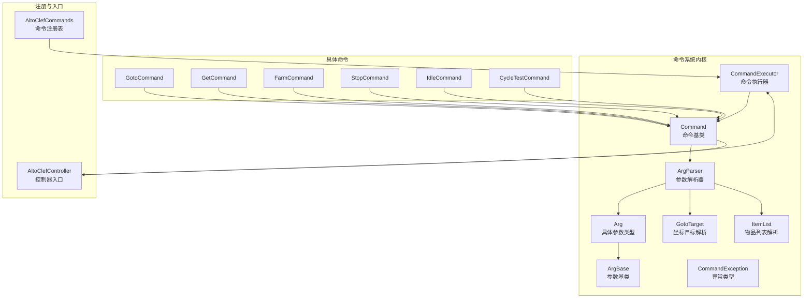
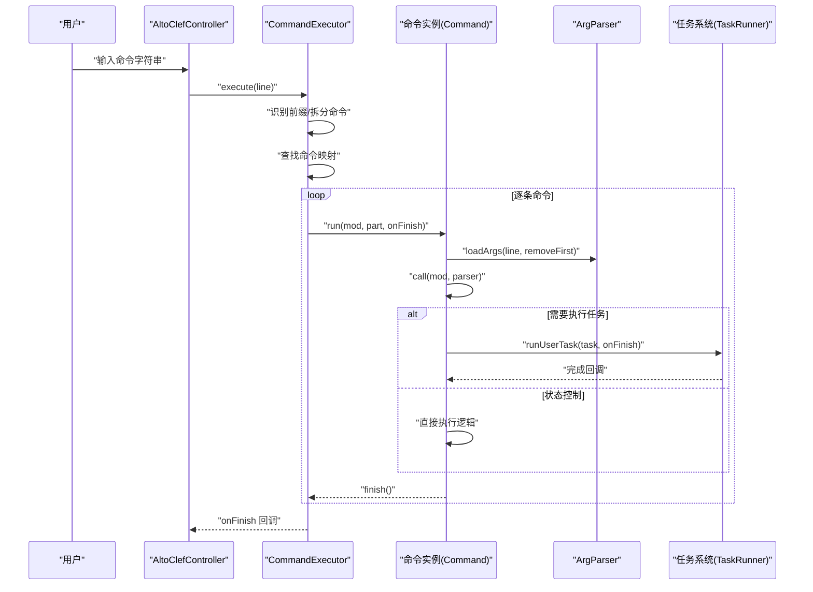
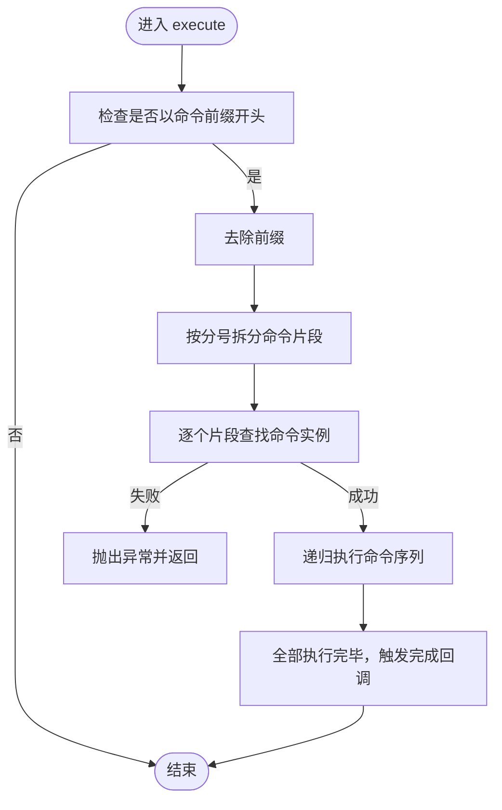
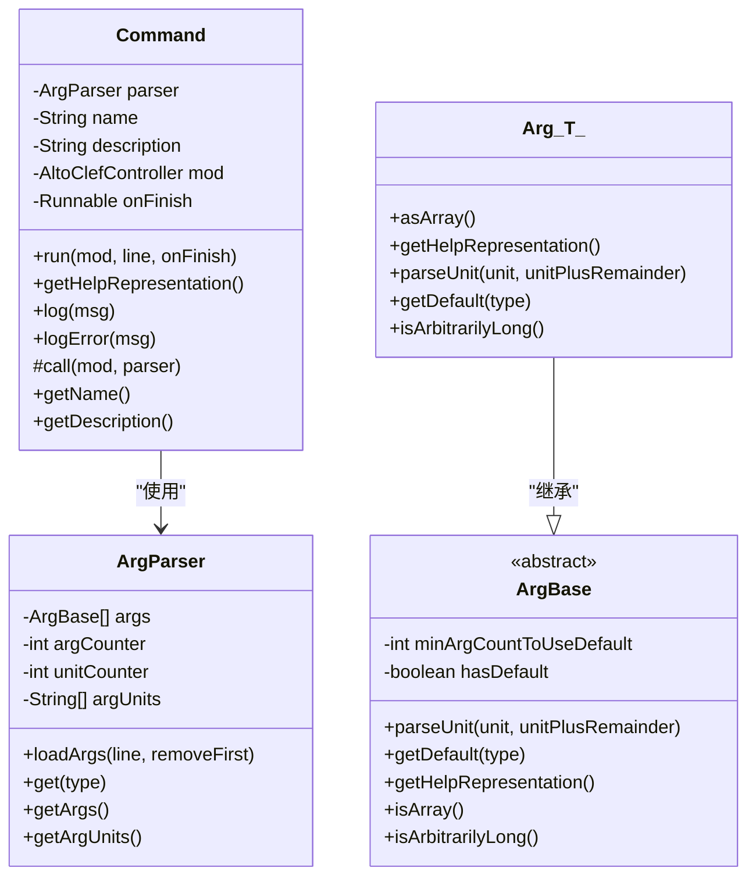
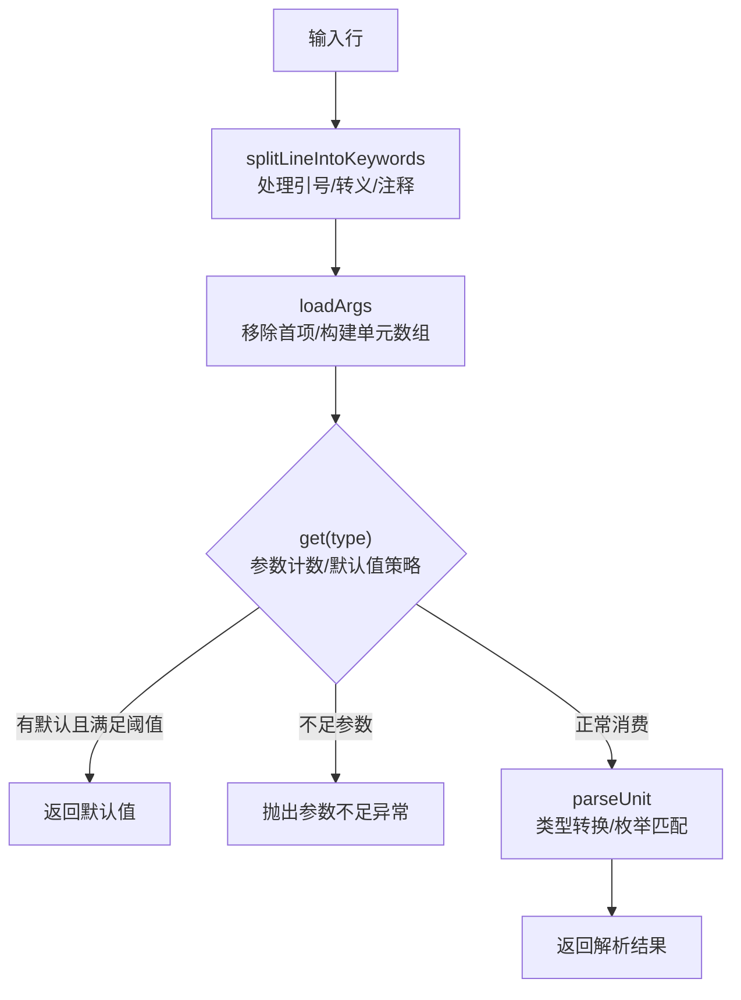
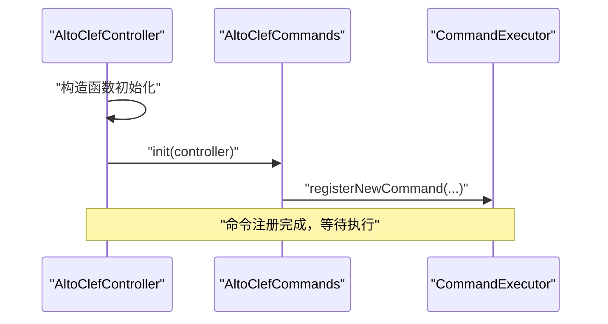
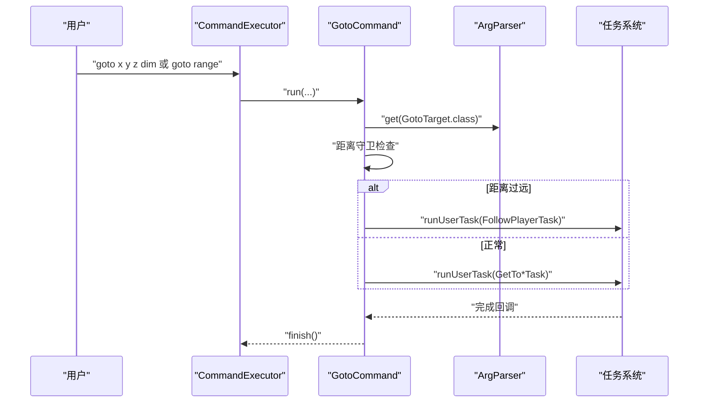
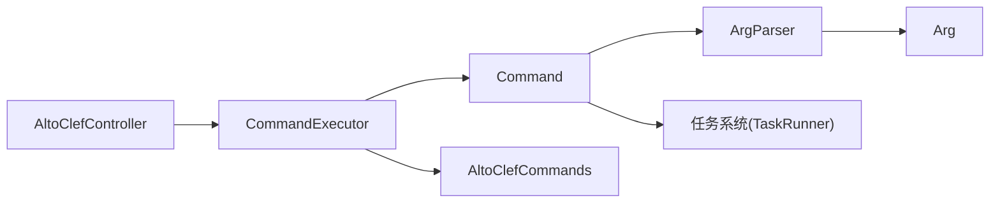

# 命令执行系统

<cite>
**本文引用的文件**
- [CommandExecutor.java](file://src/main/java/adris/altoclef/commandsystem/CommandExecutor.java)
- [Command.java](file://src/main/java/adris/altoclef/commandsystem/Command.java)
- [ArgBase.java](file://src/main/java/adris/altoclef/commandsystem/ArgBase.java)
- [Arg.java](file://src/main/java/adris/altoclef/commandsystem/Arg.java)
- [ArgParser.java](file://src/main/java/adris/altoclef/commandsystem/ArgParser.java)
- [CommandException.java](file://src/main/java/adris/altoclef/commandsystem/CommandException.java)
- [GotoTarget.java](file://src/main/java/adris/altoclef/commandsystem/GotoTarget.java)
- [ItemList.java](file://src/main/java/adris/altoclef/commandsystem/ItemList.java)
- [AltoClefCommands.java](file://src/main/java/adris/altoclef/AltoClefCommands.java)
- [AltoClefController.java](file://src/main/java/adris/altoclef/AltoClefController.java)
- [GotoCommand.java](file://src/main/java/adris/altoclef/commands/GotoCommand.java)
- [GetCommand.java](file://src/main/java/adris/altoclef/commands/GetCommand.java)
- [FarmCommand.java](file://src/main/java/adris/altoclef/commands/FarmCommand.java)
- [StopCommand.java](file://src/main/java/adris/altoclef/commands/StopCommand.java)
- [IdleCommand.java](file://src/main/java/adris/altoclef/commands/IdleCommand.java)
- [CycleTestCommand.java](file://src/main/java/adris/altoclef/commands/random/CycleTestCommand.java)
</cite>

## 目录
1. [简介](#简介)
2. [项目结构](#项目结构)
3. [核心组件](#核心组件)
4. [架构总览](#架构总览)
5. [详细组件分析](#详细组件分析)
6. [依赖分析](#依赖分析)
7. [性能考量](#性能考量)
8. [故障排查指南](#故障排查指南)
9. [结论](#结论)
10. [附录：扩展与实践指南](#附录扩展与实践指南)

## 简介
本文件面向命令执行系统，围绕 CommandExecutor 命令执行器的解析与执行流程展开，涵盖参数解析、权限验证（通过控制器接口）、执行调度机制；同时深入解析 Command 命令基类的设计模式（命令注册、参数定义、执行回调），以及 AltoClefCommands 命令注册表的管理方式（命令发现、加载与生命周期）。文末提供扩展机制、安全考虑与调试技巧，并以具体代码示例路径指引读者快速上手。

## 项目结构
命令系统位于模块“adris.altoclef”下，核心代码分布于以下包：
- 命令系统内核：commandsystem（命令执行器、命令抽象、参数解析）
- 具体命令实现：commands（大量业务命令）
- 注册入口：AltoClefCommands（集中注册）
- 控制器入口：AltoClefController（初始化命令系统）

图表来源
- [AltoClefController.java:194-200](file://src/main/java/adris/altoclef/AltoClefController.java#L194-L200)
- [AltoClefCommands.java:30-57](file://src/main/java/adris/altoclef/AltoClefCommands.java#L30-L57)
- [CommandExecutor.java:11-121](file://src/main/java/adris/altoclef/commandsystem/CommandExecutor.java#L11-L121)
- [Command.java:6-61](file://src/main/java/adris/altoclef/commandsystem/Command.java#L6-L61)
- [ArgBase.java:5-44](file://src/main/java/adris/altoclef/commandsystem/ArgBase.java#L5-L44)
- [Arg.java:3-171](file://src/main/java/adris/altoclef/commandsystem/Arg.java#L3-L171)
- [ArgParser.java:6-106](file://src/main/java/adris/altoclef/commandsystem/ArgParser.java#L6-L106)
- [GotoTarget.java:7-102](file://src/main/java/adris/altoclef/commandsystem/GotoTarget.java#L7-L102)
- [ItemList.java:9-90](file://src/main/java/adris/altoclef/commandsystem/ItemList.java#L9-L90)

章节来源
- [AltoClefController.java:52-133](file://src/main/java/adris/altoclef/AltoClefController.java#L52-L133)
- [AltoClefCommands.java:29-59](file://src/main/java/adris/altoclef/AltoClefCommands.java#L29-L59)

## 核心组件
- CommandExecutor：负责命令前缀识别、命令拆分、命令查找、递归执行与异常传播。
- Command：命令抽象基类，封装参数解析器、帮助信息生成、执行回调与日志工具。
- ArgBase/Arg：参数基类与泛型参数类型，支持默认值、数组参数、枚举解析与帮助表示。
- ArgParser：将输入行解析为关键字序列，按顺序消费参数单元，支持引号与注释处理。
- GotoTarget/ItemList：特定参数类型的解析器，用于复杂参数的容错与提示。
- AltoClefCommands：集中注册命令到执行器。
- AltoClefController：初始化命令执行器与注册表，并在设置变更时触发默认行为。

章节来源
- [CommandExecutor.java:11-121](file://src/main/java/adris/altoclef/commandsystem/CommandExecutor.java#L11-L121)
- [Command.java:6-61](file://src/main/java/adris/altoclef/commandsystem/Command.java#L6-L61)
- [ArgBase.java:5-44](file://src/main/java/adris/altoclef/commandsystem/ArgBase.java#L5-L44)
- [Arg.java:3-171](file://src/main/java/adris/altoclef/commandsystem/Arg.java#L3-L171)
- [ArgParser.java:6-106](file://src/main/java/adris/altoclef/commandsystem/ArgParser.java#L6-L106)
- [GotoTarget.java:22-68](file://src/main/java/adris/altoclef/commandsystem/GotoTarget.java#L22-L68)
- [ItemList.java:16-88](file://src/main/java/adris/altoclef/commandsystem/ItemList.java#L16-L88)
- [AltoClefCommands.java:30-57](file://src/main/java/adris/altoclef/AltoClefCommands.java#L30-L57)
- [AltoClefController.java:82-133](file://src/main/java/adris/altoclef/AltoClefController.java#L82-L133)

## 架构总览
命令执行链路从用户输入开始，经由控制器注入的 CommandExecutor 完成前缀识别、命令拆分与查找，随后逐条命令调用其执行回调，完成任务调度或状态控制。

图表来源
- [AltoClefController.java:194-200](file://src/main/java/adris/altoclef/AltoClefController.java#L194-L200)
- [CommandExecutor.java:58-76](file://src/main/java/adris/altoclef/commandsystem/CommandExecutor.java#L58-L76)
- [CommandExecutor.java:38-56](file://src/main/java/adris/altoclef/commandsystem/CommandExecutor.java#L38-L56)
- [Command.java:19-24](file://src/main/java/adris/altoclef/commandsystem/Command.java#L19-L24)
- [ArgParser.java:57-67](file://src/main/java/adris/altoclef/commandsystem/ArgParser.java#L57-L67)

## 详细组件分析

### CommandExecutor 命令执行器
职责与流程
- 前缀识别：根据控制器设置判断是否为客户端命令。
- 命令拆分：以分号分隔多段命令，逐段查找命令实例。
- 递归执行：逐条命令执行，异常捕获后拼接帮助信息并传递给回调。
- 注册管理：维护命令名称到命令实例的映射，支持查询与遍历。

关键点
- 异常传播：捕获命令内部异常，附加帮助信息后回调给上层。
- 命令查找：支持空行跳过与命令名裁剪（首个空白前）。
- 执行回调：每条命令完成后触发回调，最终在所有命令执行完毕后回调完成。

图表来源
- [CommandExecutor.java:58-76](file://src/main/java/adris/altoclef/commandsystem/CommandExecutor.java#L58-L76)
- [CommandExecutor.java:94-111](file://src/main/java/adris/altoclef/commandsystem/CommandExecutor.java#L94-L111)
- [CommandExecutor.java:38-56](file://src/main/java/adris/altoclef/commandsystem/CommandExecutor.java#L38-L56)

章节来源
- [CommandExecutor.java:11-121](file://src/main/java/adris/altoclef/commandsystem/CommandExecutor.java#L11-L121)

### Command 命令基类与设计模式
职责与模式
- 参数解析：构造时绑定 ArgParser，运行时统一加载参数并调用抽象执行方法。
- 帮助信息：基于参数定义生成帮助表示，便于错误提示与用户指导。
- 日志工具：提供消息与错误日志输出。
- 执行回调：子类实现 call 方法，接收控制器与解析器，完成任务调度或状态控制。

图表来源
- [Command.java:6-61](file://src/main/java/adris/altoclef/commandsystem/Command.java#L6-L61)
- [ArgParser.java:6-106](file://src/main/java/adris/altoclef/commandsystem/ArgParser.java#L6-L106)
- [ArgBase.java:5-44](file://src/main/java/adris/altoclef/commandsystem/ArgBase.java#L5-L44)
- [Arg.java:3-171](file://src/main/java/adris/altoclef/commandsystem/Arg.java#L3-L171)

章节来源
- [Command.java:6-61](file://src/main/java/adris/altoclef/commandsystem/Command.java#L6-L61)
- [ArgBase.java:5-44](file://src/main/java/adris/altoclef/commandsystem/ArgBase.java#L5-L44)
- [Arg.java:3-171](file://src/main/java/adris/altoclef/commandsystem/Arg.java#L3-L171)
- [ArgParser.java:6-106](file://src/main/java/adris/altoclef/commandsystem/ArgParser.java#L6-L106)

### 参数解析器与参数类型
- ArgParser：支持引号包裹、反斜杠转义、注释截断、关键字分割等，确保复杂参数正确解析。
- Arg<T>：支持基础类型、枚举、ItemList、GotoTarget 等，提供默认值与最小参数阈值策略。
- GotoTarget/ItemList：对复杂参数进行容错解析与友好提示，提升易用性。

图表来源
- [ArgParser.java:18-55](file://src/main/java/adris/altoclef/commandsystem/ArgParser.java#L18-L55)
- [ArgParser.java:57-96](file://src/main/java/adris/altoclef/commandsystem/ArgParser.java#L57-L96)
- [Arg.java:97-149](file://src/main/java/adris/altoclef/commandsystem/Arg.java#L97-L149)
- [GotoTarget.java:22-68](file://src/main/java/adris/altoclef/commandsystem/GotoTarget.java#L22-L68)
- [ItemList.java:16-88](file://src/main/java/adris/altoclef/commandsystem/ItemList.java#L16-L88)

章节来源
- [ArgParser.java:6-106](file://src/main/java/adris/altoclef/commandsystem/ArgParser.java#L6-L106)
- [Arg.java:3-171](file://src/main/java/adris/altoclef/commandsystem/Arg.java#L3-L171)
- [GotoTarget.java:7-102](file://src/main/java/adris/altoclef/commandsystem/GotoTarget.java#L7-L102)
- [ItemList.java:9-90](file://src/main/java/adris/altoclef/commandsystem/ItemList.java#L9-L90)

### 命令注册表与生命周期
- 注册入口：AltoClefCommands.init 将命令实例批量注册到执行器。
- 生命周期：AltoClefController 在构造阶段初始化命令执行器并在设置加载后触发默认行为。

图表来源
- [AltoClefController.java:82-133](file://src/main/java/adris/altoclef/AltoClefController.java#L82-L133)
- [AltoClefController.java:194-200](file://src/main/java/adris/altoclef/AltoClefController.java#L194-L200)
- [AltoClefCommands.java:30-57](file://src/main/java/adris/altoclef/AltoClefCommands.java#L30-L57)

章节来源
- [AltoClefCommands.java:29-59](file://src/main/java/adris/altoclef/AltoClefCommands.java#L29-L59)
- [AltoClefController.java:194-200](file://src/main/java/adris/altoclef/AltoClefController.java#L194-L200)

### 典型命令示例与执行流程

#### GotoCommand：坐标导航
- 参数：GotoTarget（支持多种坐标形式与维度）
- 流程：解析目标、距离守卫校验、选择移动任务、提交任务执行

图表来源
- [GotoCommand.java:42-64](file://src/main/java/adris/altoclef/commands/GotoCommand.java#L42-L64)
- [GotoTarget.java:22-68](file://src/main/java/adris/altoclef/commandsystem/GotoTarget.java#L22-L68)
- [ArgParser.java:69-96](file://src/main/java/adris/altoclef/commandsystem/ArgParser.java#L69-L96)

章节来源
- [GotoCommand.java:20-66](file://src/main/java/adris/altoclef/commands/GotoCommand.java#L20-L66)

#### GetCommand：资源获取与合成
- 参数：ItemList（支持单个或数组形式）
- 流程：解析物品清单、预判库存满足度、选择单一或聚合任务、提交执行

章节来源
- [GetCommand.java:15-68](file://src/main/java/adris/altoclef/commands/GetCommand.java#L15-L68)
- [ItemList.java:16-88](file://src/main/java/adris/altoclef/commandsystem/ItemList.java#L16-L88)

#### FarmCommand：农场自动化
- 参数：整数范围
- 流程：解析范围与当前位置，创建农场任务并提交执行

章节来源
- [FarmCommand.java:12-29](file://src/main/java/adris/altoclef/commands/FarmCommand.java#L12-L29)

#### StopCommand/IdleCommand/CycleTestCommand：状态与演示命令
- StopCommand：停止任务运行链
- IdleCommand：站立不动
- CycleTestCommand：演示性循环任务

章节来源
- [StopCommand.java:7-18](file://src/main/java/adris/altoclef/commands/StopCommand.java#L7-L18)
- [IdleCommand.java:8-18](file://src/main/java/adris/altoclef/commands/IdleCommand.java#L8-L18)
- [CycleTestCommand.java:8-18](file://src/main/java/adris/altoclef/commands/random/CycleTestCommand.java#L8-L18)

## 依赖分析
- 组件耦合
  - CommandExecutor 依赖 AltoClefController 获取命令前缀与执行上下文。
  - Command 依赖 ArgParser 进行参数解析，依赖控制器执行任务。
  - 具体命令依赖任务系统完成实际动作。
- 外部依赖
  - 日志框架：用于记录命令执行与警告信息。
  - 任务系统：命令执行的最终落点。

图表来源
- [AltoClefController.java:82-133](file://src/main/java/adris/altoclef/AltoClefController.java#L82-L133)
- [CommandExecutor.java:11-121](file://src/main/java/adris/altoclef/commandsystem/CommandExecutor.java#L11-L121)
- [Command.java:6-61](file://src/main/java/adris/altoclef/commandsystem/Command.java#L6-L61)
- [ArgParser.java:6-106](file://src/main/java/adris/altoclef/commandsystem/ArgParser.java#L6-L106)

章节来源
- [AltoClefController.java:52-133](file://src/main/java/adris/altoclef/AltoClefController.java#L52-L133)
- [CommandExecutor.java:11-121](file://src/main/java/adris/altoclef/commandsystem/CommandExecutor.java#L11-L121)

## 性能考量
- 解析开销：ArgParser 的关键字分割与引号处理为 O(n)，建议避免超长连续参数。
- 递归执行：命令串行执行，异常会阻断后续命令，注意合理组织命令顺序。
- 任务调度：命令最终委托任务系统执行，应避免频繁切换任务导致的上下文切换成本。
- 默认值策略：合理设置最小参数阈值，减少不必要的参数传递与解析分支。

## 故障排查指南
常见问题与定位
- 命令不存在：执行器在找不到命令时抛出异常，检查命令名称与注册表。
- 参数不足/过多：ArgParser 会在参数数量不合法时抛出异常，检查帮助信息与参数定义。
- 类型解析失败：Arg<T> 对基础类型与枚举进行严格转换，检查输入格式与大小写。
- 坐标/物品解析错误：GotoTarget/ItemList 提供容错与模糊匹配提示，参考异常消息修正输入。

定位步骤
- 查看命令执行日志与警告信息。
- 使用命令帮助表示确认参数格式。
- 分步执行命令串，定位具体失败片段。
- 参考异常消息中的帮助信息与参数定义。

章节来源
- [CommandExecutor.java:38-56](file://src/main/java/adris/altoclef/commandsystem/CommandExecutor.java#L38-L56)
- [ArgParser.java:69-96](file://src/main/java/adris/altoclef/commandsystem/ArgParser.java#L69-L96)
- [Arg.java:97-149](file://src/main/java/adris/altoclef/commandsystem/Arg.java#L97-L149)
- [GotoTarget.java:22-68](file://src/main/java/adris/altoclef/commandsystem/GotoTarget.java#L22-L68)
- [ItemList.java:16-88](file://src/main/java/adris/altoclef/commandsystem/ItemList.java#L16-L88)

## 结论
该命令执行系统以 CommandExecutor 为核心，结合 Command 抽象与 ArgParser 参数解析，形成清晰的命令注册、解析与执行链路。通过 AltoClefCommands 集中注册与 AltoClefController 生命周期管理，系统具备良好的可扩展性与可维护性。建议在扩展新命令时遵循现有参数定义与异常处理模式，确保一致的用户体验与稳定性。

## 附录：扩展与实践指南

### 如何创建自定义命令
- 继承 Command，定义命令名称、描述与参数列表。
- 在 call 中使用 ArgParser.get 获取参数，完成业务逻辑与任务提交。
- 通过 AltoClefCommands.init 注册命令实例。

参考路径
- [Command.java:13-24](file://src/main/java/adris/altoclef/commandsystem/Command.java#L13-L24)
- [ArgParser.java:69-96](file://src/main/java/adris/altoclef/commandsystem/ArgParser.java#L69-L96)
- [AltoClefCommands.java:30-57](file://src/main/java/adris/altoclef/AltoClefCommands.java#L30-L57)

### 实现参数验证与处理
- 使用 Arg<T> 的默认值与最小参数阈值策略，减少边界条件处理。
- 对复杂参数类型（如 GotoTarget/ItemList）利用内置解析与提示，提升健壮性。
- 在命令中进行业务级校验（如距离守卫），必要时提前拒绝并给出替代方案。

参考路径
- [Arg.java:25-35](file://src/main/java/adris/altoclef/commandsystem/Arg.java#L25-L35)
- [GotoCommand.java:46-61](file://src/main/java/adris/altoclef/commands/GotoCommand.java#L46-L61)
- [GotoTarget.java:22-68](file://src/main/java/adris/altoclef/commandsystem/GotoTarget.java#L22-L68)
- [ItemList.java:16-88](file://src/main/java/adris/altoclef/commandsystem/ItemList.java#L16-L88)

### 处理命令异常
- 在命令内部捕获并包装异常，提供帮助信息与参数提示。
- 利用 CommandExecutor 的异常传播机制，确保上层统一处理。

参考路径
- [Command.java:51](file://src/main/java/adris/altoclef/commandsystem/Command.java#L51)
- [CommandExecutor.java:52-54](file://src/main/java/adris/altoclef/commandsystem/CommandExecutor.java#L52-L54)
- [CommandException.java:3-12](file://src/main/java/adris/altoclef/commandsystem/CommandException.java#L3-L12)

### 安全考虑
- 输入校验：严格限制参数数量与类型，避免越界与类型转换异常。
- 权限与边界：在命令中加入业务边界检查（如距离守卫），防止不当行为。
- 日志审计：使用统一日志接口记录命令执行与异常，便于追踪。

### 调试技巧
- 启用日志：关注命令执行与警告信息，定位问题根因。
- 分步执行：将复杂命令串拆分为多个简单命令，逐步验证。
- 帮助信息：使用命令帮助表示核对参数格式与默认值。