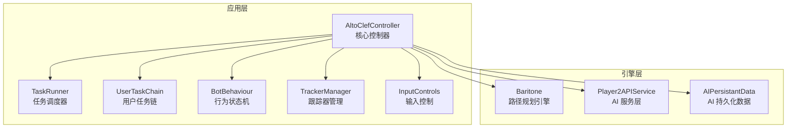
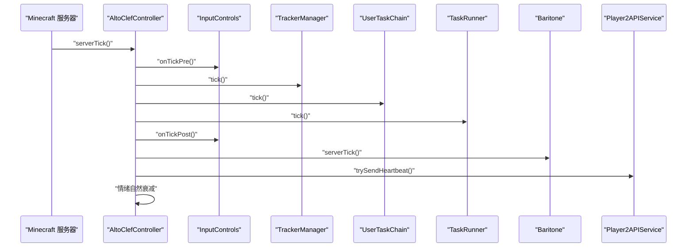
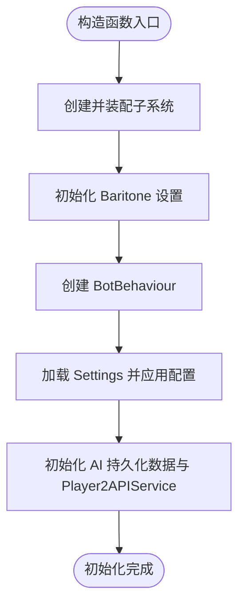
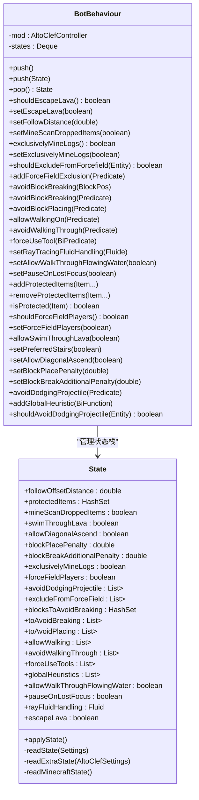
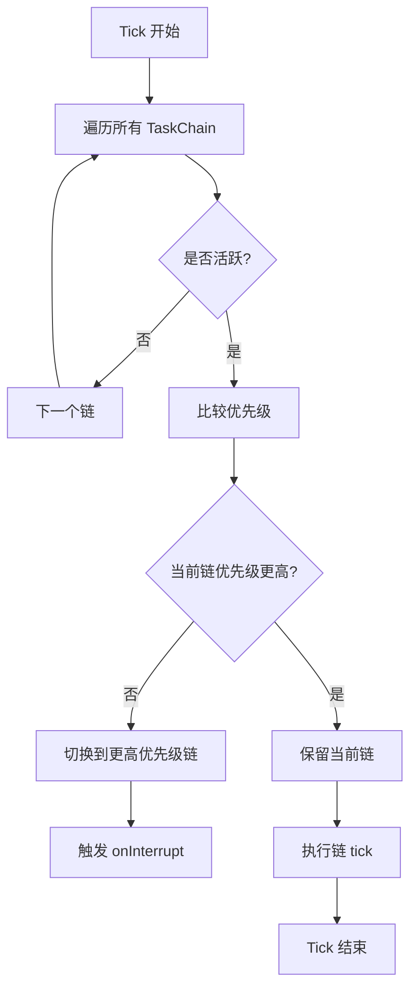
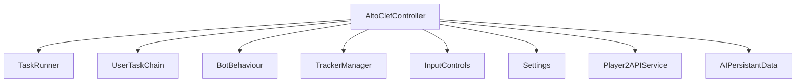

# 核心控制器

<cite>
**本文引用的文件**
- [AltoClefController.java](file://src/main/java/adris/altoclef/AltoClefController.java)
- [BotBehaviour.java](file://src/main/java/adris/altoclef/BotBehaviour.java)
- [TaskRunner.java](file://src/main/java/adris/altoclef/tasksystem/TaskRunner.java)
- [UserTaskChain.java](file://src/main/java/adris/altoclef/chains/UserTaskChain.java)
- [TrackerManager.java](file://src/main/java/adris/altoclef/trackers/TrackerManager.java)
- [InputControls.java](file://src/main/java/adris/altoclef/control/InputControls.java)
- [Settings.java](file://src/main/java/adris/altoclef/Settings.java)
- [AIPersistantData.java](file://src/main/java/adris/altoclef/player2api/AIPersistantData.java)
- [Player2APIService.java](file://src/main/java/adris/altoclef/player2api/Player2APIService.java)
- [PlayerEngineClient.java](file://src/main/java/adris/altoclef/PlayerEngineClient.java)
- [README.md](file://README.md)
- [AI_NPC项目整体架构概览.md](file://docs/AI_NPC项目整体架构概览.md)
</cite>

## 目录
1. [简介](#简介)
2. [项目结构](#项目结构)
3. [核心组件](#核心组件)
4. [架构总览](#架构总览)
5. [详细组件分析](#详细组件分析)
6. [依赖分析](#依赖分析)
7. [性能考量](#性能考量)
8. [故障排查指南](#故障排查指南)
9. [结论](#结论)
10. [附录](#附录)

## 简介
本文件围绕核心控制器 AltoClefController 的架构与实现进行深入剖析，重点阐述其作为 AI 大脑的统一管理职责，包括如何协调 Baritone 路径规划、任务执行、行为链管理、跟踪器系统等子系统；详细说明控制器的初始化流程、服务器 Tick 循环机制、状态管理与生命周期控制；解释 BotBehaviour 状态机的设计原理（行为参数栈、状态转换逻辑与优先级调度机制）；并提供控制器与其他组件的交互关系图与状态转换图，帮助读者全面理解该控制器在 AI NPC 系统中的中枢地位。

## 项目结构
AltoClefController 位于 adris/altoclef 包中，是 AI NPC 任务系统与 Baritone 寻路引擎之间的桥梁。其职责涵盖：
- 初始化与装配：创建并装配 TaskRunner、UserTaskChain、BotBehaviour、TrackerManager、InputControls、PlayerExtraController、SlotHandler 等子系统
- Tick 循环：在每 tick 内部驱动输入控制、跟踪器、扫描器、任务执行、Baritone tick 以及心跳上报
- 行为参数管理：通过 BotBehaviour 的状态栈对 Baritone 的行为参数进行动态调整
- 生命周期控制：提供启用/禁用、暂停/恢复、停止等控制接口
- 与外部系统集成：与 Player2APIService、AIPersistantData 等进行数据与服务交互

图表来源
- [AltoClefController.java:53-134](file://src/main/java/adris/altoclef/AltoClefController.java#L53-L134)
- [TaskRunner.java:9-21](file://src/main/java/adris/altoclef/tasksystem/TaskRunner.java#L9-L21)
- [UserTaskChain.java:14-38](file://src/main/java/adris/altoclef/chains/UserTaskChain.java#L14-L38)
- [BotBehaviour.java:22-29](file://src/main/java/adris/altoclef/BotBehaviour.java#L22-L29)
- [TrackerManager.java:6-13](file://src/main/java/adris/altoclef/trackers/TrackerManager.java#L6-L13)
- [InputControls.java:11-18](file://src/main/java/adris/altoclef/control/InputControls.java#L11-L18)
- [Player2APIService.java:35-46](file://src/main/java/adris/altoclef/player2api/Player2APIService.java#L35-L46)
- [AIPersistantData.java:12-28](file://src/main/java/adris/altoclef/player2api/AIPersistantData.java#L12-L28)

章节来源
- [AltoClefController.java:53-134](file://src/main/java/adris/altoclef/AltoClefController.java#L53-L134)
- [AI_NPC项目整体架构概览.md:404-438](file://docs/AI_NPC项目整体架构概览.md#L404-L438)

## 核心组件
- AltoClefController：统一管理 AI 行为与子系统，负责初始化、Tick 循环、状态管理与生命周期控制
- TaskRunner：任务调度器，按优先级选择当前活跃链并驱动其执行
- UserTaskChain：用户任务链，承载 LLM 生成的用户指令任务，具备距离监控与自动返回机制
- BotBehaviour：行为状态机，维护行为参数栈，动态调整 Baritone 的行为参数
- TrackerManager：跟踪器管理器，统一驱动各类跟踪器的脏标记与重置
- InputControls：输入控制，封装对 Baritone 输入覆盖处理器的操作
- Settings：Mod 配置管理，提供行为参数与资源策略等配置项
- Player2APIService 与 AIPersistantData：与外部 AI 服务层与持久化数据交互

章节来源
- [AltoClefController.java:53-134](file://src/main/java/adris/altoclef/AltoClefController.java#L53-L134)
- [TaskRunner.java:9-21](file://src/main/java/adris/altoclef/tasksystem/TaskRunner.java#L9-L21)
- [UserTaskChain.java:14-38](file://src/main/java/adris/altoclef/chains/UserTaskChain.java#L14-L38)
- [BotBehaviour.java:22-29](file://src/main/java/adris/altoclef/BotBehaviour.java#L22-L29)
- [TrackerManager.java:6-13](file://src/main/java/adris/altoclef/trackers/TrackerManager.java#L6-L13)
- [InputControls.java:11-18](file://src/main/java/adris/altoclef/control/InputControls.java#L11-L18)
- [Settings.java:32-357](file://src/main/java/adris/altoclef/Settings.java#L32-L357)
- [AIPersistantData.java:12-71](file://src/main/java/adris/altoclef/player2api/AIPersistantData.java#L12-L71)
- [Player2APIService.java:35-274](file://src/main/java/adris/altoclef/player2api/Player2APIService.java#L35-L274)

## 架构总览
AltoClefController 作为 AI NPC 的“大脑”，在每 tick 内部顺序驱动多个子系统，形成如下控制流：
- 输入控制预处理
- 跟踪器与扫描器 tick
- 任务执行 tick
- 输入控制后处理
- Baritone serverTick
- 心跳上报与情绪衰减

图表来源
- [AltoClefController.java:136-150](file://src/main/java/adris/altoclef/AltoClefController.java#L136-L150)
- [InputControls.java:44-52](file://src/main/java/adris/altoclef/control/InputControls.java#L44-L52)
- [TrackerManager.java:15-31](file://src/main/java/adris/altoclef/trackers/TrackerManager.java#L15-L31)
- [UserTaskChain.java:64-70](file://src/main/java/adris/altoclef/chains/UserTaskChain.java#L64-L70)
- [TaskRunner.java:22-58](file://src/main/java/adris/altoclef/tasksystem/TaskRunner.java#L22-L58)
- [Player2APIService.java:258-263](file://src/main/java/adris/altoclef/player2api/Player2APIService.java#L258-L263)

章节来源
- [AltoClefController.java:136-150](file://src/main/java/adris/altoclef/AltoClefController.java#L136-L150)
- [AI_NPC项目整体架构概览.md:701-774](file://docs/AI_NPC项目整体架构概览.md#L701-L774)

## 详细组件分析

### 初始化流程
AltoClefController 的构造函数完成以下关键步骤：
- 创建并装配子系统：CommandExecutor、TaskRunner、TrackerManager、UserTaskChain、MobDefenseChain、PlayerInteractionFixChain、MLGBucketFallChain、UnstuckChain、PreEquipItemChain、WorldSurvivalChain、FoodChain、PlayerDefenseChain、ItemStorageTracker、EntityTracker、BlockScanner、SimpleChunkTracker、MiscBlockTracker、CraftingRecipeTracker、EntityStuckTracker、UserBlockRangeTracker、InputControls、SlotHandler、PlayerExtraController
- 初始化 Baritone 设置：设置行走、破坏、放置、水处理、随机视角等参数
- 初始化 BotBehaviour：创建行为状态机实例
- 加载与应用 Settings：读取配置并动态调整 Baritone 的可丢弃物品列表与避障策略
- 初始化 AI 持久化数据与 Player2APIService：建立与 LLM/TTS/STT 的服务通道

图表来源
- [AltoClefController.java:83-134](file://src/main/java/adris/altoclef/AltoClefController.java#L83-L134)
- [Settings.java:149-151](file://src/main/java/adris/altoclef/Settings.java#L149-L151)

章节来源
- [AltoClefController.java:83-134](file://src/main/java/adris/altoclef/AltoClefController.java#L83-L134)
- [Settings.java:149-151](file://src/main/java/adris/altoclef/Settings.java#L149-L151)

### 服务器 Tick 循环机制
- Tick 顺序：输入控制预处理 → 跟踪器与扫描器 tick → 任务执行 tick → 输入控制后处理 → Baritone serverTick → 心跳上报 → 情绪自然衰减
- 关键点：
  - InputControls 的 onTickPre/onTickPost 用于在 tick 前后正确释放按键状态
  - TrackerManager 在游戏状态切换时重置跟踪器
  - TaskRunner 选择最高优先级链并驱动其执行
  - Player2APIService 定期发送心跳，维持与外部服务的连接
  - AI 持久化数据中的情绪状态每 tick 进行自然衰减

章节来源
- [AltoClefController.java:136-150](file://src/main/java/adris/altoclef/AltoClefController.java#L136-L150)
- [InputControls.java:44-52](file://src/main/java/adris/altoclef/control/InputControls.java#L44-L52)
- [TrackerManager.java:15-31](file://src/main/java/adris/altoclef/trackers/TrackerManager.java#L15-L31)
- [TaskRunner.java:22-58](file://src/main/java/adris/altoclef/tasksystem/TaskRunner.java#L22-L58)
- [Player2APIService.java:258-263](file://src/main/java/adris/altoclef/player2api/Player2APIService.java#L258-L263)
- [AIPersistantData.java:12-71](file://src/main/java/adris/altoclef/player2api/AIPersistantData.java#L12-L71)

### 状态管理与生命周期控制
- 启用/禁用：TaskRunner.enable/disable 会推入/弹出 BotBehaviour 的状态栈，确保行为参数在启用/禁用期间正确恢复
- 暂停/恢复：通过 setPaused/isPaused 控制 tick 内的行为链执行
- 停止：stop() 会取消用户任务、停止当前任务链、禁用任务执行器、强制取消路径行为并清空输入覆盖

章节来源
- [TaskRunner.java:64-84](file://src/main/java/adris/altoclef/tasksystem/TaskRunner.java#L64-L84)
- [AltoClefController.java:160-169](file://src/main/java/adris/altoclef/AltoClefController.java#L160-L169)

### BotBehaviour 状态机设计
BotBehaviour 采用“状态栈”模式，将行为参数以状态对象的形式压栈/弹栈，实现动态调整与回滚：
- 状态栈：Deque<State>，支持 push/pop
- 状态对象包含：跟随距离、受保护物品、掉落物品扫描、游泳穿越熔岩、对角上升、放置/破坏惩罚、独采矿物、强制驱逐玩家、投射物规避、强制步行/禁止穿行、工具使用策略、全局启发式、允许流动水穿行、失去焦点暂停、射线流体处理、熔岩逃生等
- 状态读取/应用：从 Baritone Settings 与 AltoClefSettings 读取当前状态，并将当前状态写回到引擎设置中

图表来源
- [BotBehaviour.java:22-343](file://src/main/java/adris/altoclef/BotBehaviour.java#L22-L343)

章节来源
- [BotBehaviour.java:22-343](file://src/main/java/adris/altoclef/BotBehaviour.java#L22-L343)

### 任务执行与优先级调度
- TaskRunner：每 tick 遍历所有 TaskChain，选择最高优先级的活跃链执行，并在链切换时触发 onInterrupt
- UserTaskChain：用户任务链具有最高优先级（50），承载 LLM 生成的用户指令；具备距离监控与自动返回机制，超过阈值时自动取消当前任务并返回到拥有者身边
- Settings：提供行为参数与策略配置，如空闲命令、死亡命令、食物阈值、丢弃物品策略等

图表来源
- [TaskRunner.java:22-58](file://src/main/java/adris/altoclef/tasksystem/TaskRunner.java#L22-L58)
- [UserTaskChain.java:123-168](file://src/main/java/adris/altoclef/chains/UserTaskChain.java#L123-L168)
- [Settings.java:149-151](file://src/main/java/adris/altoclef/Settings.java#L149-L151)

章节来源
- [TaskRunner.java:22-58](file://src/main/java/adris/altoclef/tasksystem/TaskRunner.java#L22-L58)
- [UserTaskChain.java:64-114](file://src/main/java/adris/altoclef/chains/UserTaskChain.java#L64-L114)
- [Settings.java:149-151](file://src/main/java/adris/altoclef/Settings.java#L149-L151)

### 输入控制与行为参数联动
- InputControls：封装对 Baritone 输入覆盖处理器的操作，提供按键按压、长按、释放与强制旋转等能力
- BotBehaviour：通过状态栈将行为参数写入 Baritone Settings 与 AltoClefSettings，实现动态行为调整（如允许穿行、工具使用策略、全局启发式等）

章节来源
- [InputControls.java:20-52](file://src/main/java/adris/altoclef/control/InputControls.java#L20-L52)
- [BotBehaviour.java:265-341](file://src/main/java/adris/altoclef/BotBehaviour.java#L265-L341)

### 与外部系统的交互
- Player2APIService：负责与 LLM/TTS/STT 服务交互，定期发送心跳，支持同步/流式对话完成，TTS 合成与音频传输
- AIPersistantData：管理 AI 持久化数据，包括对话历史、角色信息与灵魂档案，负责构建系统 Prompt 并随拥有者变更更新

章节来源
- [Player2APIService.java:48-118](file://src/main/java/adris/altoclef/player2api/Player2APIService.java#L48-L118)
- [AIPersistantData.java:22-71](file://src/main/java/adris/altoclef/player2api/AIPersistantData.java#L22-L71)

## 依赖分析
AltoClefController 与各子系统之间的依赖关系如下：
- 依赖 TaskRunner：驱动任务链执行
- 依赖 UserTaskChain：承载用户指令任务
- 依赖 BotBehaviour：动态调整行为参数
- 依赖 TrackerManager：统一驱动跟踪器
- 依赖 InputControls：输入控制
- 依赖 Settings：行为参数与策略
- 依赖 Player2APIService 与 AIPersistantData：外部 AI 服务与持久化数据

图表来源
- [AltoClefController.java:53-134](file://src/main/java/adris/altoclef/AltoClefController.java#L53-L134)
- [TaskRunner.java:9-21](file://src/main/java/adris/altoclef/tasksystem/TaskRunner.java#L9-L21)
- [UserTaskChain.java:14-38](file://src/main/java/adris/altoclef/chains/UserTaskChain.java#L14-L38)
- [BotBehaviour.java:22-29](file://src/main/java/adris/altoclef/BotBehaviour.java#L22-L29)
- [TrackerManager.java:6-13](file://src/main/java/adris/altoclef/trackers/TrackerManager.java#L6-L13)
- [InputControls.java:11-18](file://src/main/java/adris/altoclef/control/InputControls.java#L11-L18)
- [Settings.java:32-357](file://src/main/java/adris/altoclef/Settings.java#L32-L357)
- [Player2APIService.java:35-46](file://src/main/java/adris/altoclef/player2api/Player2APIService.java#L35-L46)
- [AIPersistantData.java:12-28](file://src/main/java/adris/altoclef/player2api/AIPersistantData.java#L12-L28)

章节来源
- [AltoClefController.java:53-134](file://src/main/java/adris/altoclef/AltoClefController.java#L53-L134)

## 性能考量
- 异步化与串行化：LLM 与 TTS 调用通过独立线程池异步执行，避免阻塞主线程（Server Tick）
- 任务链优先级：通过 TaskRunner 的优先级选择机制，确保高优先级链（如用户任务链）在合适时机抢占执行
- 状态栈最小化：BotBehaviour 的状态栈只在启用/禁用时弹出/压入，避免频繁写入引擎设置
- 跟踪器批量处理：TrackerManager 在 tick 中统一设置脏标记，减少重复计算

## 故障排查指南
- 任务无法执行或卡住：检查 TaskRunner 是否处于启用状态，确认最高优先级链是否活跃
- 行为参数未生效：确认 BotBehaviour 的状态栈是否正确压入/弹出，以及状态对象是否正确写回引擎设置
- 输入控制异常：检查 InputControls 的按键状态是否在 onTickPre/onTickPost 中正确释放
- 心跳失败：检查 Player2APIService 的心跳发送逻辑与网络连通性
- 情绪不衰减：确认 AI 持久化数据中的情绪状态是否每 tick 调用 tickEmotionDecay

章节来源
- [TaskRunner.java:64-84](file://src/main/java/adris/altoclef/tasksystem/TaskRunner.java#L64-L84)
- [BotBehaviour.java:187-213](file://src/main/java/adris/altoclef/BotBehaviour.java#L187-L213)
- [InputControls.java:44-52](file://src/main/java/adris/altoclef/control/InputControls.java#L44-L52)
- [Player2APIService.java:258-263](file://src/main/java/adris/altoclef/player2api/Player2APIService.java#L258-L263)
- [AIPersistantData.java:12-71](file://src/main/java/adris/altoclef/player2api/AIPersistantData.java#L12-L71)

## 结论
AltoClefController 作为 AI NPC 的核心控制器，承担着统一管理 AI 行为、协调多子系统、驱动 Tick 循环与生命周期控制的职责。通过 BotBehaviour 的状态栈机制与 TaskRunner 的优先级调度，控制器实现了灵活且可扩展的 AI 决策与执行体系。配合 Player2APIService 与 AIPersistantData，控制器能够与外部 LLM/TTS/STT 服务无缝集成，为玩家提供自然、智能且富有情感的 NPC 伙伴体验。

## 附录
- 项目整体架构与扩展指南可参考 [AI_NPC项目整体架构概览.md](file://docs/AI_NPC项目整体架构概览.md)
- 项目 README 提供了运行与配置说明 [README.md](file://README.md)