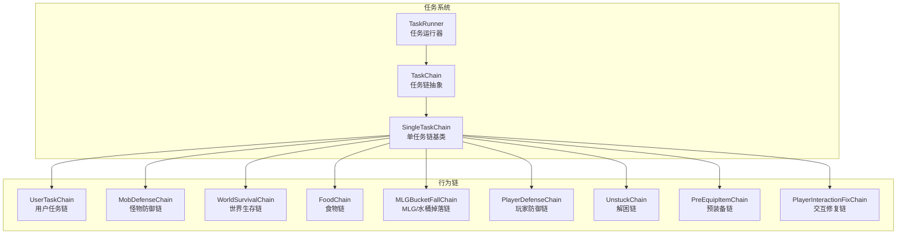
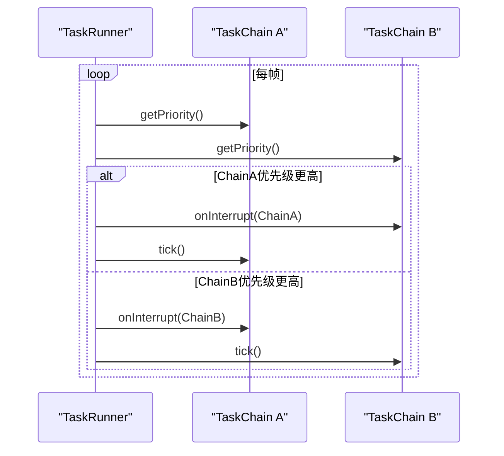
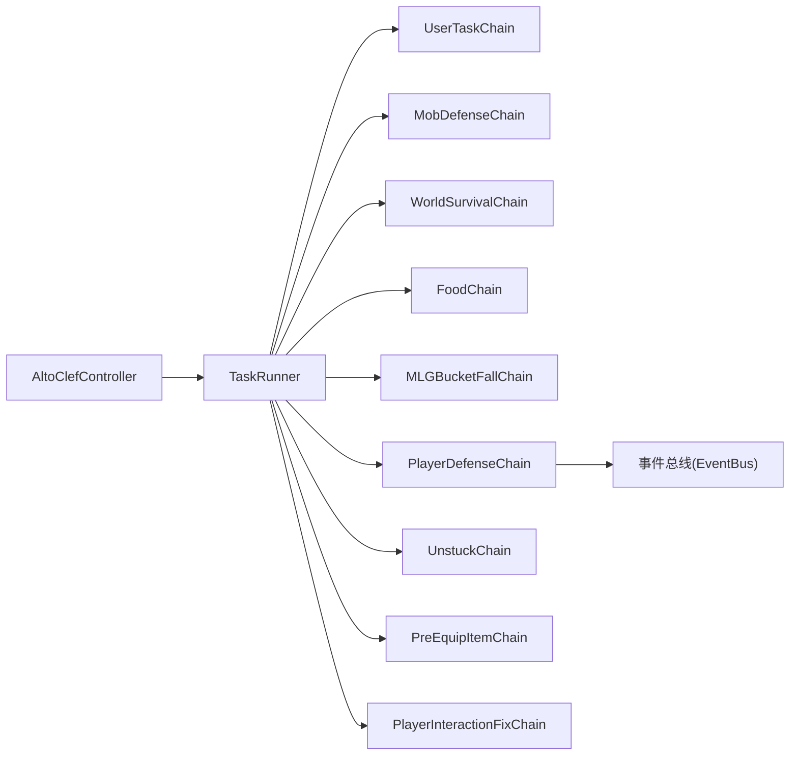

# 行为链系统

<cite>
**本文引用的文件**
- [AltoClefController.java](file://src/main/java/adris/altoclef/AltoClefController.java)
- [TaskRunner.java](file://src/main/java/adris/altoclef/tasksystem/TaskRunner.java)
- [TaskChain.java](file://src/main/java/adris/altoclef/tasksystem/TaskChain.java)
- [SingleTaskChain.java](file://src/main/java/adris/altoclef/chains/SingleTaskChain.java)
- [UserTaskChain.java](file://src/main/java/adris/altoclef/chains/UserTaskChain.java)
- [MobDefenseChain.java](file://src/main/java/adris/altoclef/chains/MobDefenseChain.java)
- [WorldSurvivalChain.java](file://src/main/java/adris/altoclef/chains/WorldSurvivalChain.java)
- [FoodChain.java](file://src/main/java/adris/altoclef/chains/FoodChain.java)
- [MLGBucketFallChain.java](file://src/main/java/adris/altoclef/chains/MLGBucketFallChain.java)
- [PlayerDefenseChain.java](file://src/main/java/adris/altoclef/chains/PlayerDefenseChain.java)
- [UnstuckChain.java](file://src/main/java/adris/altoclef/chains/UnstuckChain.java)
- [PreEquipItemChain.java](file://src/main/java/adris/altoclef/chains/PreEquipItemChain.java)
- [PlayerInteractionFixChain.java](file://src/main/java/adris/altoclef/chains/PlayerInteractionFixChain.java)
</cite>

## 目录
1. [简介](#简介)
2. [项目结构](#项目结构)
3. [核心组件](#核心组件)
4. [架构总览](#架构总览)
5. [详细组件分析](#详细组件分析)
6. [依赖关系分析](#依赖关系分析)
7. [性能考量](#性能考量)
8. [故障排查指南](#故障排查指南)
9. [结论](#结论)
10. [附录：扩展与实践](#附录扩展与实践)

## 简介
本文件系统性阐述行为链（Task Chain）体系在 AI NPC 中的架构与运行机制，重点覆盖以下方面：
- 链间竞争执行与优先级比较、冲突解决与资源分配策略
- 各类预定义行为链的功能特性与使用场景：用户任务链、怪物防御链、世界生存链、食物链、MLG/水桶掉落链、玩家防御链、解困链、预装备链、交互修复链
- 行为链的激活条件、执行时机与停止机制
- 自定义行为链的创建方法、链间协作与冲突处理范式
- 扩展机制与性能优化建议

## 项目结构
行为链系统围绕“任务链抽象 + 任务运行器”的分层设计展开：
- 抽象层：TaskChain 定义统一接口；SingleTaskChain 提供单任务模式的通用逻辑
- 运行层：TaskRunner 负责扫描各链优先级、选择最高优先级链并驱动其 tick
- 应用层：具体行为链（如 UserTaskChain、MobDefenseChain 等）根据环境状态计算优先级并设置当前任务

图表来源
- [TaskChain.java:1-51](file://src/main/java/adris/altoclef/tasksystem/TaskChain.java#L1-L51)
- [SingleTaskChain.java:1-96](file://src/main/java/adris/altoclef/chains/SingleTaskChain.java#L1-L96)
- [TaskRunner.java:1-98](file://src/main/java/adris/altoclef/tasksystem/TaskRunner.java#L1-L98)
- [UserTaskChain.java:1-223](file://src/main/java/adris/altoclef/chains/UserTaskChain.java#L1-L223)
- [MobDefenseChain.java:1-684](file://src/main/java/adris/altoclef/chains/MobDefenseChain.java#L1-L684)
- [WorldSurvivalChain.java:1-167](file://src/main/java/adris/altoclef/chains/WorldSurvivalChain.java#L1-L167)
- [FoodChain.java:1-229](file://src/main/java/adris/altoclef/chains/FoodChain.java#L1-L229)
- [MLGBucketFallChain.java:1-139](file://src/main/java/adris/altoclef/chains/MLGBucketFallChain.java#L1-L139)
- [PlayerDefenseChain.java:1-189](file://src/main/java/adris/altoclef/chains/PlayerDefenseChain.java#L1-L189)
- [UnstuckChain.java:1-163](file://src/main/java/adris/altoclef/chains/UnstuckChain.java#L1-L163)
- [PreEquipItemChain.java:1-63](file://src/main/java/adris/altoclef/chains/PreEquipItemChain.java#L1-L63)
- [PlayerInteractionFixChain.java:1-138](file://src/main/java/adris/altoclef/chains/PlayerInteractionFixChain.java#L1-L138)

章节来源
- [AltoClefController.java:82-133](file://src/main/java/adris/altoclef/AltoClefController.java#L82-L133)
- [TaskRunner.java:22-58](file://src/main/java/adris/altoclef/tasksystem/TaskRunner.java#L22-L58)
- [TaskChain.java:16-36](file://src/main/java/adris/altoclef/tasksystem/TaskChain.java#L16-L36)

## 核心组件
- TaskChain：所有行为链的抽象基类，定义生命周期钩子（tick、stop、interrupt）、优先级计算与活跃度判断
- SingleTaskChain：继承自 TaskChain，封装“单一主任务”模式，负责任务切换、中断与完成回调
- TaskRunner：全局调度器，按帧遍历所有已注册链，选择最高优先级链执行，并在链切换时触发 interrupt

章节来源
- [TaskChain.java:7-51](file://src/main/java/adris/altoclef/tasksystem/TaskChain.java#L7-L51)
- [SingleTaskChain.java:11-96](file://src/main/java/adris/altoclef/chains/SingleTaskChain.java#L11-L96)
- [TaskRunner.java:9-98](file://src/main/java/adris/altoclef/tasksystem/TaskRunner.java#L9-L98)

## 架构总览
行为链系统采用“链优先级竞争 + 单任务执行”的控制流模型。每帧 TaskRunner 遍历所有链，调用其 getPriority 计算优先级，取最大者作为当前链。若当前链发生变化，则向旧链发送 onInterrupt，随后新链开始 tick。

图表来源
- [TaskRunner.java:22-58](file://src/main/java/adris/altoclef/tasksystem/TaskRunner.java#L22-L58)
- [TaskChain.java:26-36](file://src/main/java/adris/altoclef/tasksystem/TaskChain.java#L26-L36)

## 详细组件分析

### 用户任务链 UserTaskChain
- 角色定位：面向用户的显式任务执行链，负责接收用户下发的任务并驱动执行
- 关键机制
  - 优先级固定为中高优先级，确保用户任务能打断低优先级链
  - 在 runTask 中强制停止当前任务后再设置新任务，避免“相等任务”导致的状态停滞
  - 距离监控：当 NPC 与所有者距离超过阈值时，自动取消当前任务并返回所有者
  - 空闲处理：任务完成后可选择进入空闲命令或保持停止状态
- 典型用途：跟随、采集、合成、移动等用户直接发起的任务

章节来源
- [UserTaskChain.java:36-223](file://src/main/java/adris/altoclef/chains/UserTaskChain.java#L36-L223)
- [SingleTaskChain.java:54-94](file://src/main/java/adris/altoclef/chains/SingleTaskChain.java#L54-L94)

### 怪物防御链 MobDefenseChain
- 角色定位：AI 的生存与战斗链，基于威胁评估动态选择逃跑、格挡、攻击或力场压制
- 关键机制
  - 威胁评估：综合血量、敌方类型、投射物接近度、是否处于火/药水伤害区域等
  - 优先级上限：当玩家显式发出攻击指令时，限制自身攻击优先级以避免与用户任务冲突
  - 力场压制：对近身/投射物进行强制引导，必要时启用盾牌
  - 多种子任务：逃跑、 Dodge 投射物、击杀敌人、灭火等
- 典型用途：应对群体 mob、投射物、火焰、药水等即时威胁

章节来源
- [MobDefenseChain.java:105-684](file://src/main/java/adris/altoclef/chains/MobDefenseChain.java#L105-L684)
- [SingleTaskChain.java:54-94](file://src/main/java/adris/altoclef/chains/SingleTaskChain.java#L54-L94)

### 世界生存链 WorldSurvivalChain
- 角色定位：处理环境危险（溺水、着火、地狱门卡住）的即时生存链
- 关键机制
  - 溺水规避：在缺氧且未路径规划时持续跳跃
  - 火灾处理：靠近火焰时自动扑灭；可用水桶自救
  - 地狱门卡滞：检测卡在传送门中且非用户主动进入时，执行安全位移
- 典型用途：在极端环境下保障 NPC 生存

章节来源
- [WorldSurvivalChain.java:27-167](file://src/main/java/adris/altoclef/chains/WorldSurvivalChain.java#L27-L167)
- [SingleTaskChain.java:54-94](file://src/main/java/adris/altoclef/chains/SingleTaskChain.java#L54-L94)

### 食物链 FoodChain
- 角色定位：饥饿与饱和度管理链，保证 AI 在安全前提下维持能量水平
- 关键机制
  - 食物评分：综合饥饿恢复、饱和度增益与浪费程度，选择最优食物
  - 触发条件：低于阈值、健康过低、着火/凋零效果、完美适配等情况
  - 交互暂停：进食期间暂停其他交互，必要时补盾
- 典型用途：在不干扰战斗/防御的前提下维持最佳输出状态

章节来源
- [FoodChain.java:23-229](file://src/main/java/adris/altoclef/chains/FoodChain.java#L23-L229)
- [SingleTaskChain.java:54-94](file://src/main/java/adris/altoclef/chains/SingleTaskChain.java#L54-L94)

### MLG/水桶掉落链 MLGBucketFallChain
- 角色定位：处理高处掉落与异常浮空状态的链
- 关键机制
  - 掉落检测：通过速度阈值判定是否处于危险掉落
  - MLG 执行：放置水桶并回收水桶，减少摔落伤害
  - 药物辅助：在极低持续漂浮效果下使用瞬移食物
- 典型用途：防止摔落伤害与异常状态

章节来源
- [MLGBucketFallChain.java:21-139](file://src/main/java/adris/altoclef/chains/MLGBucketFallChain.java#L21-L139)
- [SingleTaskChain.java:54-94](file://src/main/java/adris/altoclef/chains/SingleTaskChain.java#L54-L94)

### 玩家防御链 PlayerDefenseChain
- 角色定位：针对其他玩家的反击链，基于事件驱动的记忆化策略
- 关键机制
  - 事件订阅：监听伤害与挥砍事件，记录潜在攻击者
  - 记忆窗口：基于时间窗口决定是否进入“攻击”状态
  - 攻击目标锁定：找到最近且多次攻击的玩家后发起反击
- 典型用途：保护玩家领地与人身安全

章节来源
- [PlayerDefenseChain.java:19-189](file://src/main/java/adris/altoclef/chains/PlayerDefenseChain.java#L19-L189)
- [TaskChain.java:32-36](file://src/main/java/adris/altoclef/tasksystem/TaskChain.java#L32-L36)

### 解困链 UnstuckChain
- 角色定位：检测并解决卡顿问题（如被水/粉末雪卡住、吃货卡顿、端口框架卡住）
- 关键机制
  - 位置历史：记录大量位置点，识别静止不动的卡顿
  - 分类处理：不同卡顿场景对应不同解法（离开水、破坏方块、随机位移）
  - 与食物链联动：检测“吃货卡顿”，临时中止进食
- 典型用途：提升鲁棒性与可恢复性

章节来源
- [UnstuckChain.java:21-163](file://src/main/java/adris/altoclef/chains/UnstuckChain.java#L21-L163)
- [SingleTaskChain.java:54-94](file://src/main/java/adris/altoclef/chains/SingleTaskChain.java#L54-L94)

### 预装备链 PreEquipItemChain
- 角色定位：在路径规划前自动检查并预装合适的武器/工具，减少路径中断
- 关键机制
  - 路径扫描：读取当前路径的破坏/放置需求，提前更换合适物品
  - 条件限制：避免在进食/路径规划中打断
- 典型用途：提高路径效率与连贯性

章节来源
- [PreEquipItemChain.java:13-63](file://src/main/java/adris/altoclef/chains/PreEquipItemChain.java#L13-L63)
- [SingleTaskChain.java:54-94](file://src/main/java/adris/altoclef/chains/SingleTaskChain.java#L54-L94)

### 交互修复链 PlayerInteractionFixChain
- 角色定位：修正输入与交互异常（如潜行误持、光标堆叠、工具切换）
- 关键机制
  - 工具优化：在安全时机自动更换更优工具
  - 潜行管理：避免与特定动作（如坐姿）冲突
  - 光标清理：定时将光标中的物品归仓或丢弃
- 典型用途：提升交互稳定性与一致性

章节来源
- [PlayerInteractionFixChain.java:22-138](file://src/main/java/adris/altoclef/chains/PlayerInteractionFixChain.java#L22-L138)
- [TaskChain.java:32-36](file://src/main/java/adris/altoclef/tasksystem/TaskChain.java#L32-L36)

## 依赖关系分析
- 注册与初始化：AltoClefController 在构造函数中实例化并注册所有行为链到 TaskRunner
- 运行时依赖：TaskRunner 仅依赖 TaskChain 的抽象接口；具体链之间通过优先级竞争，无直接耦合
- 事件驱动：PlayerDefenseChain 通过事件总线订阅伤害/挥砍事件，体现松耦合的观察者模式

图表来源
- [AltoClefController.java:88-96](file://src/main/java/adris/altoclef/AltoClefController.java#L88-L96)
- [TaskRunner.java:60-62](file://src/main/java/adris/altoclef/tasksystem/TaskRunner.java#L60-L62)
- [PlayerDefenseChain.java:33-39](file://src/main/java/adris/altoclef/chains/PlayerDefenseChain.java#L33-L39)

章节来源
- [AltoClefController.java:82-133](file://src/main/java/adris/altoclef/AltoClefController.java#L82-L133)
- [TaskRunner.java:22-58](file://src/main/java/adris/altoclef/tasksystem/TaskRunner.java#L22-L58)

## 性能考量
- 优先级扫描复杂度：每帧 O(N) 遍历所有链计算优先级，N 为链数量。建议控制链数量与优先级计算开销
- 任务切换成本：频繁切换任务会触发 stop/reset，应尽量合并相近功能的链或降低切换频率
- 并发与锁：部分链涉及实体/投影追踪，注意避免并发修改与死锁
- 输入与交互：在高频率交互（如拾取、格挡）时，合理暂停其他交互以避免冲突
- 日志与调试：在生产环境中适当降低日志级别，避免影响帧率

## 故障排查指南
- 任务“卡住”或重复：确认是否因“相等任务”导致 setTask 未触发 stop；UserTaskChain 在 runTask 中强制停止旧任务
- 链切换异常：检查 TaskRunner 的链间 interrupt 流程，确保旧链正确释放资源
- 防御链优先级过高：当玩家主动攻击时，防御链会限制自身攻击优先级，避免与用户任务冲突
- 食物链与防御链冲突：食物链在防御/地狱门等场景会暂停进食，确保生存优先
- MLG/水桶链误触发：检查掉落判定阈值与水桶放置/回收逻辑
- 解困链无效：确认卡顿检测条件（位置历史、水/粉末雪、端口框架）是否满足

章节来源
- [UserTaskChain.java:147-164](file://src/main/java/adris/altoclef/chains/UserTaskChain.java#L147-L164)
- [TaskRunner.java:37-48](file://src/main/java/adris/altoclef/tasksystem/TaskRunner.java#L37-L48)
- [MobDefenseChain.java:152-167](file://src/main/java/adris/altoclef/chains/MobDefenseChain.java#L152-L167)
- [FoodChain.java:67-83](file://src/main/java/adris/altoclef/chains/FoodChain.java#L67-L83)
- [MLGBucketFallChain.java:128-137](file://src/main/java/adris/altoclef/chains/MLGBucketFallChain.java#L128-L137)
- [UnstuckChain.java:72-147](file://src/main/java/adris/altoclef/chains/UnstuckChain.java#L72-L147)

## 结论
行为链系统通过“链优先级竞争 + 单任务执行”的模式实现了灵活而稳定的 AI 控制流。各链职责清晰、边界明确，既可通过优先级上限与事件机制避免冲突，又能在复杂环境下协同工作。结合合理的扩展与优化策略，可进一步提升 AI NPC 的智能性与鲁棒性。

## 附录：扩展与实践

### 如何创建自定义行为链
- 继承 SingleTaskChain 或 TaskChain
- 实现 getPriority：根据环境状态返回优先级
- 实现 setTask：在 getPriority 中设置当前主任务
- 实现 onTaskFinish：任务完成后清理与后续处理
- 在控制器中注册到 TaskRunner

参考路径
- [SingleTaskChain.java:54-94](file://src/main/java/adris/altoclef/chains/SingleTaskChain.java#L54-L94)
- [TaskChain.java:32-36](file://src/main/java/adris/altoclef/tasksystem/TaskChain.java#L32-L36)

### 链间协作与冲突处理范式
- 优先级上限：在存在用户任务时，防御链限制自身优先级，避免抢占
- 任务中断：TaskRunner 切换链时触发 onInterrupt，旧链应释放资源
- 事件驱动：对输入/状态变化采用事件订阅，降低耦合
- 状态隔离：每个链维护自身状态，避免互相污染

参考路径
- [TaskRunner.java:37-48](file://src/main/java/adris/altoclef/tasksystem/TaskRunner.java#L37-L48)
- [MobDefenseChain.java:152-167](file://src/main/java/adris/altoclef/chains/MobDefenseChain.java#L152-L167)
- [PlayerDefenseChain.java:33-39](file://src/main/java/adris/altoclef/chains/PlayerDefenseChain.java#L33-L39)

### 资源分配与执行时机
- 输入暂停：在需要高精度交互（如格挡、MLG）时暂停其他交互
- 路径安全：在路径规划安全时再进行工具切换/装备预热
- 时间窗口：利用计时器控制交互节奏，避免过于频繁

参考路径
- [MobDefenseChain.java:259-278](file://src/main/java/adris/altoclef/chains/MobDefenseChain.java#L259-L278)
- [MLGBucketFallChain.java:62-82](file://src/main/java/adris/altoclef/chains/MLGBucketFallChain.java#L62-L82)
- [PreEquipItemChain.java:28-50](file://src/main/java/adris/altoclef/chains/PreEquipItemChain.java#L28-L50)

### 性能优化建议
- 合理划分链：将高频但轻量的链（如交互修复）与低频重计算链（如路径规划）分离
- 减少任务切换：合并相近功能，避免频繁 stop/reset
- 缓存与复用：对优先级计算结果进行短期缓存，避免重复计算
- 异步与批处理：对非实时性操作（如库存刷新）采用定时批处理