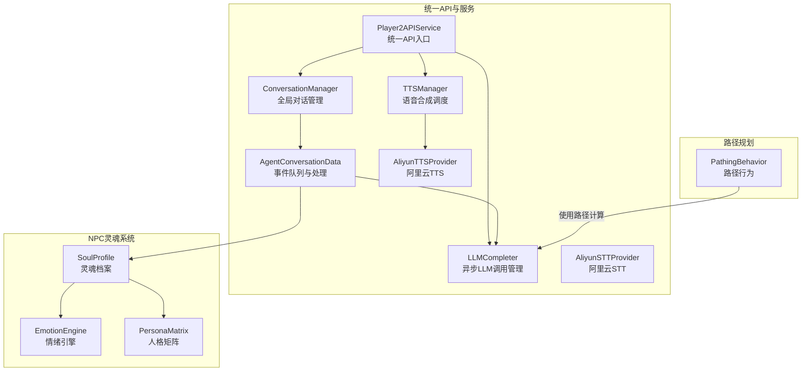
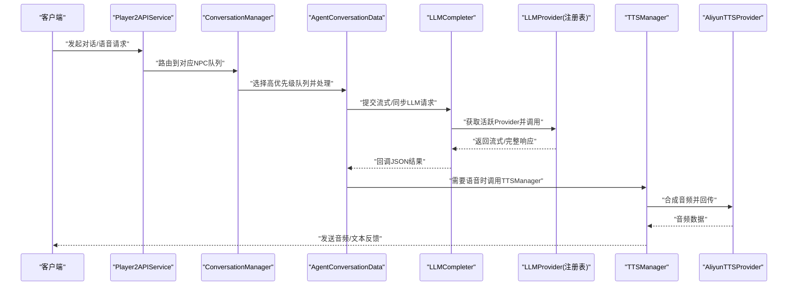
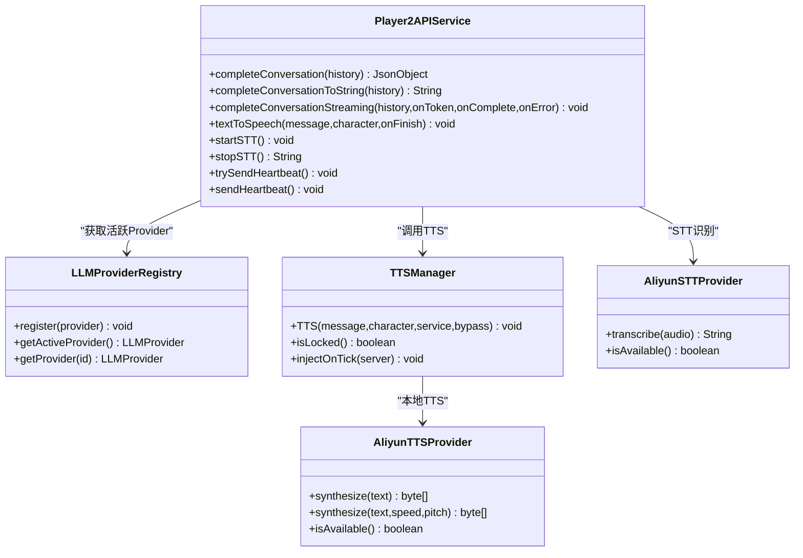
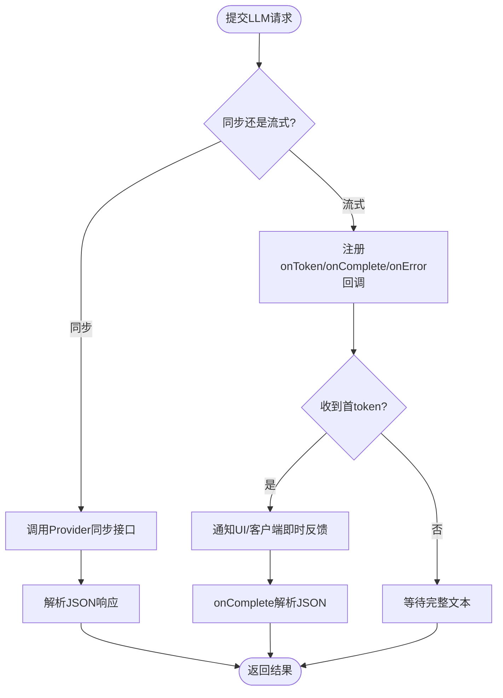
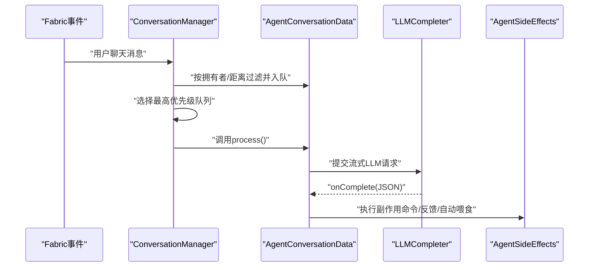
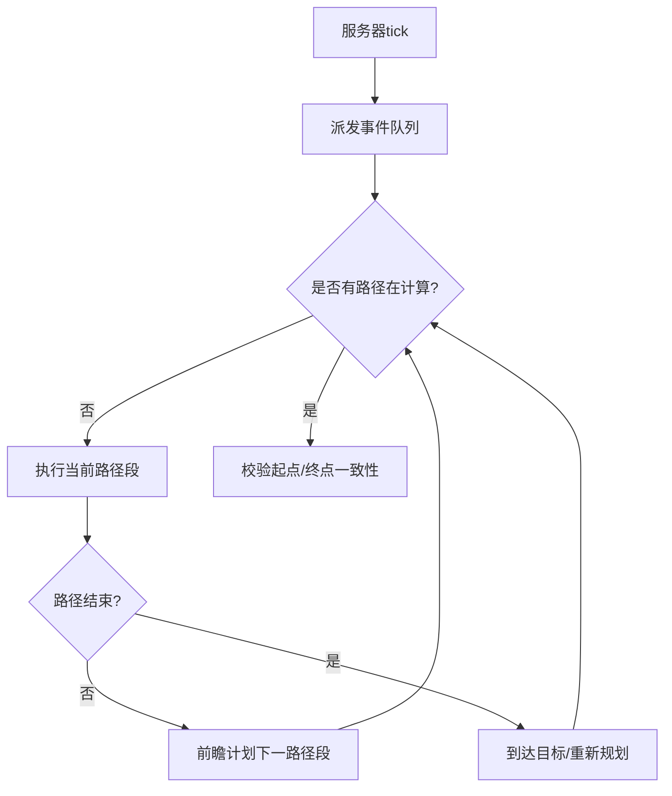
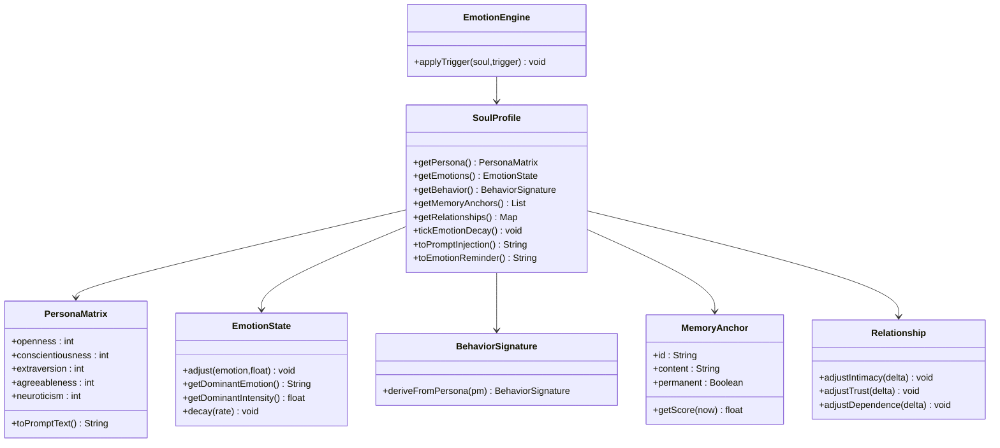
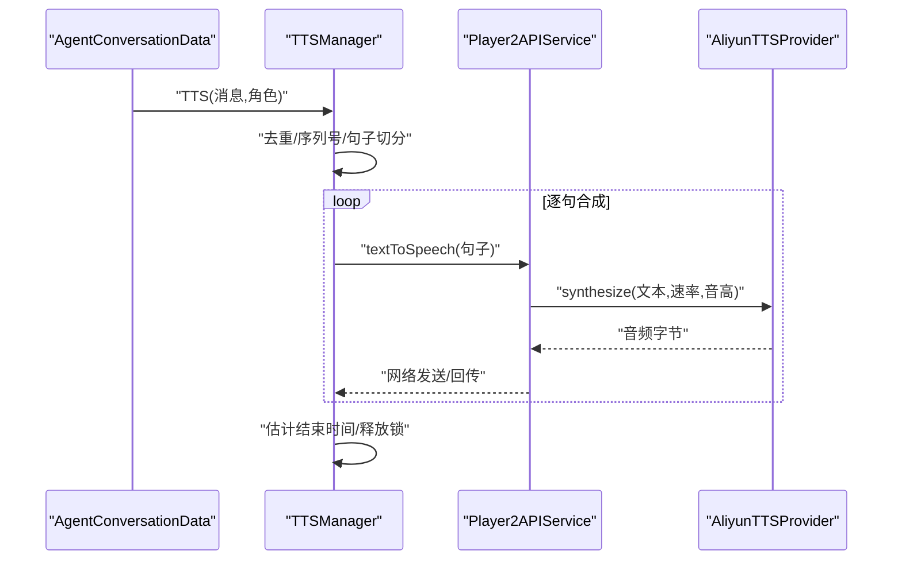
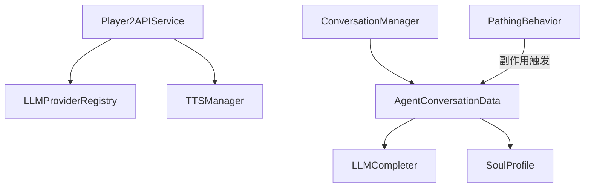

# Core Engine & Service层

<cite>
**本文引用的文件**
- [Player2APIService.java](file://src/main/java/adris/altoclef/player2api/Player2APIService.java)
- [LLMCompleter.java](file://src/main/java/adris/altoclef/player2api/LLMCompleter.java)
- [ConversationManager.java](file://src/main/java/adris/altoclef/player2api/manager/ConversationManager.java)
- [AgentConversationData.java](file://src/main/java/adris/altoclef/player2api/AgentConversationData.java)
- [LLMProviderRegistry.java](file://src/main/java/adris/altoclef/player2api/llm/LLMProviderRegistry.java)
- [SoulProfile.java](file://src/main/java/adris/altoclef/player2api/soul/SoulProfile.java)
- [EmotionEngine.java](file://src/main/java/adris/altoclef/player2api/soul/EmotionEngine.java)
- [PersonaMatrix.java](file://src/main/java/adris/altoclef/player2api/soul/PersonaMatrix.java)
- [TTSManager.java](file://src/main/java/adris/altoclef/player2api/manager/TTSManager.java)
- [AliyunTTSProvider.java](file://src/main/java/adris/altoclef/player2api/tts/AliyunTTSProvider.java)
- [AliyunSTTProvider.java](file://src/main/java/adris/altoclef/player2api/stt/AliyunSTTProvider.java)
- [PathingBehavior.java](file://src/main/java/baritone/behavior/PathingBehavior.java)
</cite>

## 目录
1. [引言](#引言)
2. [项目结构](#项目结构)
3. [核心组件](#核心组件)
4. [架构总览](#架构总览)
5. [详细组件分析](#详细组件分析)
6. [依赖分析](#依赖分析)
7. [性能考虑](#性能考虑)
8. [故障排查指南](#故障排查指南)
9. [结论](#结论)
10. [附录](#附录)

## 引言
本文件聚焦于Core Engine & Service层，系统性阐述统一API服务入口（Player2APIService）、LLM推理引擎（LLMCompleter异步调用管理、LLM Provider策略模式）、对话管理系统（ConversationManager全局单例、AgentConversationData事件队列）、路径规划引擎（Baritone核心引擎、PathingBehavior路径行为、A*寻路算法）、NPC灵魂系统（SoulProfile核心聚合、EmotionEngine情绪引擎、PersonaMatrix人格矩阵）与语音处理服务（TTSManager语音合成调度、AliyunTTSProvider语音合成、AliyunSTTProvider语音识别）的架构设计、异步处理机制、性能优化策略与扩展接口。文档旨在帮助开发者快速理解并高效扩展AI NPC系统的基础能力。

## 项目结构
Core Engine & Service层主要分布在以下包中：
- 统一API与服务：adris.altoclef.player2api.*
- 对话与状态：adris.altoclef.player2api.manager.*、adris.altoclef.player2api.soul.*
- 路径规划：baritone.behavior.PathingBehavior 与 baritone.pathing.calc.*
- 语音服务：adris.altoclef.player2api.tts.*、adris.altoclef.player2api.stt.*

图表来源
- [Player2APIService.java:1-274](file://src/main/java/adris/altoclef/player2api/Player2APIService.java#L1-L274)
- [LLMCompleter.java:1-226](file://src/main/java/adris/altoclef/player2api/LLMCompleter.java#L1-L226)
- [ConversationManager.java:1-206](file://src/main/java/adris/altoclef/player2api/manager/ConversationManager.java#L1-L206)
- [AgentConversationData.java:1-590](file://src/main/java/adris/altoclef/player2api/AgentConversationData.java#L1-L590)
- [TTSManager.java:1-168](file://src/main/java/adris/altoclef/player2api/manager/TTSManager.java#L1-L168)
- [AliyunTTSProvider.java:1-113](file://src/main/java/adris/altoclef/player2api/tts/AliyunTTSProvider.java#L1-L113)
- [AliyunSTTProvider.java:1-172](file://src/main/java/adris/altoclef/player2api/stt/AliyunSTTProvider.java#L1-L172)
- [PathingBehavior.java:1-526](file://src/main/java/baritone/behavior/PathingBehavior.java#L1-L526)
- [SoulProfile.java:1-174](file://src/main/java/adris/altoclef/player2api/soul/SoulProfile.java#L1-L174)
- [EmotionEngine.java:1-184](file://src/main/java/adris/altoclef/player2api/soul/EmotionEngine.java#L1-L184)
- [PersonaMatrix.java:1-110](file://src/main/java/adris/altoclef/player2api/soul/PersonaMatrix.java#L1-L110)

章节来源
- [Player2APIService.java:1-274](file://src/main/java/adris/altoclef/player2api/Player2APIService.java#L1-L274)
- [LLMCompleter.java:1-226](file://src/main/java/adris/altoclef/player2api/LLMCompleter.java#L1-L226)
- [ConversationManager.java:1-206](file://src/main/java/adris/altoclef/player2api/manager/ConversationManager.java#L1-L206)
- [AgentConversationData.java:1-590](file://src/main/java/adris/altoclef/player2api/AgentConversationData.java#L1-L590)
- [TTSManager.java:1-168](file://src/main/java/adris/altoclef/player2api/manager/TTSManager.java#L1-L168)
- [AliyunTTSProvider.java:1-113](file://src/main/java/adris/altoclef/player2api/tts/AliyunTTSProvider.java#L1-L113)
- [AliyunSTTProvider.java:1-172](file://src/main/java/adris/altoclef/player2api/stt/AliyunSTTProvider.java#L1-L172)
- [PathingBehavior.java:1-526](file://src/main/java/baritone/behavior/PathingBehavior.java#L1-L526)
- [SoulProfile.java:1-174](file://src/main/java/adris/altoclef/player2api/soul/SoulProfile.java#L1-L174)
- [EmotionEngine.java:1-184](file://src/main/java/adris/altoclef/player2api/soul/EmotionEngine.java#L1-L184)
- [PersonaMatrix.java:1-110](file://src/main/java/adris/altoclef/player2api/soul/PersonaMatrix.java#L1-L110)

## 核心组件
- 统一API服务入口（Player2APIService）：封装LLM聊天补全、流式输出、TTS/STT调用与心跳上报，作为对外统一入口协调各子系统。
- LLM推理引擎（LLMCompleter + Provider策略）：以单线程异步执行器管理LLM调用，支持同步与流式两种模式，内置超时与锁控制，保障并发安全。
- 对话管理系统（ConversationManager + AgentConversationData）：全局单例管理多NPC事件队列，按优先级与距离选择处理目标，注入情绪提醒与状态上下文，驱动AgentSideEffects执行副作用。
- 路径规划引擎（Baritone PathingBehavior + A*）：基于A*的路径搜索与分段执行，支持计划前瞻、拼接与取消，与PlayerEngine线程池协作。
- NPC灵魂系统（SoulProfile + EmotionEngine + PersonaMatrix）：以“大五”人格为基底，结合记忆锚点、关系图谱与行为签名，动态生成prompt注入与情绪衰减。
- 语音处理服务（TTSManager + AliyunTTSProvider/STT）：TTSManager负责去重、序列号、句子切分与全局节流；AliyunTTSProvider/STT提供云端语音合成与识别能力。

章节来源
- [Player2APIService.java:1-274](file://src/main/java/adris/altoclef/player2api/Player2APIService.java#L1-L274)
- [LLMCompleter.java:1-226](file://src/main/java/adris/altoclef/player2api/LLMCompleter.java#L1-L226)
- [ConversationManager.java:1-206](file://src/main/java/adris/altoclef/player2api/manager/ConversationManager.java#L1-L206)
- [AgentConversationData.java:1-590](file://src/main/java/adris/altoclef/player2api/AgentConversationData.java#L1-L590)
- [PathingBehavior.java:1-526](file://src/main/java/baritone/behavior/PathingBehavior.java#L1-L526)
- [SoulProfile.java:1-174](file://src/main/java/adris/altoclef/player2api/soul/SoulProfile.java#L1-L174)
- [EmotionEngine.java:1-184](file://src/main/java/adris/altoclef/player2api/soul/EmotionEngine.java#L1-L184)
- [PersonaMatrix.java:1-110](file://src/main/java/adris/altoclef/player2api/soul/PersonaMatrix.java#L1-L110)
- [TTSManager.java:1-168](file://src/main/java/adris/altoclef/player2api/manager/TTSManager.java#L1-L168)
- [AliyunTTSProvider.java:1-113](file://src/main/java/adris/altoclef/player2api/tts/AliyunTTSProvider.java#L1-L113)
- [AliyunSTTProvider.java:1-172](file://src/main/java/adris/altoclef/player2api/stt/AliyunSTTProvider.java#L1-L172)

## 架构总览
下图展示了Core Engine & Service层的关键交互：统一API入口协调LLM与语音服务；对话管理器驱动AgentConversationData进行事件处理与副作用执行；路径行为与A*算法在后台持续计算与执行；灵魂系统贯穿对话与行为决策，提供情绪与人格注入。

图表来源
- [Player2APIService.java:1-274](file://src/main/java/adris/altoclef/player2api/Player2APIService.java#L1-L274)
- [ConversationManager.java:1-206](file://src/main/java/adris/altoclef/player2api/manager/ConversationManager.java#L1-L206)
- [AgentConversationData.java:1-590](file://src/main/java/adris/altoclef/player2api/AgentConversationData.java#L1-L590)
- [LLMCompleter.java:1-226](file://src/main/java/adris/altoclef/player2api/LLMCompleter.java#L1-L226)
- [LLMProviderRegistry.java:1-80](file://src/main/java/adris/altoclef/player2api/llm/LLMProviderRegistry.java#L1-L80)
- [TTSManager.java:1-168](file://src/main/java/adris/altoclef/player2api/manager/TTSManager.java#L1-L168)
- [AliyunTTSProvider.java:1-113](file://src/main/java/adris/altoclef/player2api/tts/AliyunTTSProvider.java#L1-L113)

## 详细组件分析

### 统一API服务入口（Player2APIService）
- 职责
  - 提供LLM聊天补全（同步/字符串/流式）、TTS/STT调用与心跳上报。
  - 根据配置决定本地或远程模式，本地模式下结合情绪参数动态调整TTS速率与音高。
- 关键流程
  - 流式对话：委托LLMProviderRegistry获取活跃Provider，调用其流式接口，首token回调用于即时反馈。
  - TTS：本地模式优先，根据SoulProfile情绪状态动态调整语速/音高；失败时回退显示聊天消息。
  - STT：启动/停止识别，返回转写文本。
- 扩展点
  - 新增Provider：通过LLMProviderRegistry注册新实现。
  - 新增语音服务：实现TTS/STT Provider并接入TTSManager/AliyunTTSProvider/AliyunSTTProvider。

图表来源
- [Player2APIService.java:1-274](file://src/main/java/adris/altoclef/player2api/Player2APIService.java#L1-L274)
- [LLMProviderRegistry.java:1-80](file://src/main/java/adris/altoclef/player2api/llm/LLMProviderRegistry.java#L1-L80)
- [TTSManager.java:1-168](file://src/main/java/adris/altoclef/player2api/manager/TTSManager.java#L1-L168)
- [AliyunTTSProvider.java:1-113](file://src/main/java/adris/altoclef/player2api/tts/AliyunTTSProvider.java#L1-L113)
- [AliyunSTTProvider.java:1-172](file://src/main/java/adris/altoclef/player2api/stt/AliyunSTTProvider.java#L1-L172)

章节来源
- [Player2APIService.java:1-274](file://src/main/java/adris/altoclef/player2api/Player2APIService.java#L1-L274)
- [LLMProviderRegistry.java:1-80](file://src/main/java/adris/altoclef/player2api/llm/LLMProviderRegistry.java#L1-L80)
- [TTSManager.java:1-168](file://src/main/java/adris/altoclef/player2api/manager/TTSManager.java#L1-L168)
- [AliyunTTSProvider.java:1-113](file://src/main/java/adris/altoclef/player2api/tts/AliyunTTSProvider.java#L1-L113)
- [AliyunSTTProvider.java:1-172](file://src/main/java/adris/altoclef/player2api/stt/AliyunSTTProvider.java#L1-L172)

### LLM推理引擎（LLMCompleter异步调用管理、LLM Provider策略模式）
- LLMCompleter
  - 单线程异步执行器，保证LLM调用串行化，避免竞争条件。
  - 支持同步与流式两种模式，首token回调用于即时反馈。
  - 内置超时与锁控制，防止长时间占用。
- Provider策略
  - LLMProviderRegistry集中注册与选择Provider，支持回退至可用Provider。
  - 支持远程/本地多种实现（如Qwen、OpenAI兼容、本地Ollama等）。

图表来源
- [LLMCompleter.java:1-226](file://src/main/java/adris/altoclef/player2api/LLMCompleter.java#L1-L226)
- [LLMProviderRegistry.java:1-80](file://src/main/java/adris/altoclef/player2api/llm/LLMProviderRegistry.java#L1-L80)

章节来源
- [LLMCompleter.java:1-226](file://src/main/java/adris/altoclef/player2api/LLMCompleter.java#L1-L226)
- [LLMProviderRegistry.java:1-80](file://src/main/java/adris/altoclef/player2api/llm/LLMProviderRegistry.java#L1-L80)

### 对话管理系统（ConversationManager全局单例、AgentConversationData事件队列）
- ConversationManager
  - 全局ConcurrentHashMap维护每个NPC的AgentConversationData队列。
  - 基于Fabric事件订阅用户聊天消息，按关键字（召唤/求救/攻击）广播或定向路由。
  - 注入锁与节流，避免并发冲突与过度响应。
- AgentConversationData
  - 队列容量上限与去重，最小响应间隔与强制响应（关键字拦截）。
  - 注入世界/代理状态、情绪提醒与记忆锚点摘要，包装为ConversationHistory。
  - 流式LLM处理完成后，触发AgentSideEffects执行副作用（命令执行、反馈消息、自动喂食等）。

图表来源
- [ConversationManager.java:1-206](file://src/main/java/adris/altoclef/player2api/manager/ConversationManager.java#L1-L206)
- [AgentConversationData.java:1-590](file://src/main/java/adris/altoclef/player2api/AgentConversationData.java#L1-L590)
- [LLMCompleter.java:1-226](file://src/main/java/adris/altoclef/player2api/LLMCompleter.java#L1-L226)

章节来源
- [ConversationManager.java:1-206](file://src/main/java/adris/altoclef/player2api/manager/ConversationManager.java#L1-L206)
- [AgentConversationData.java:1-590](file://src/main/java/adris/altoclef/player2api/AgentConversationData.java#L1-L590)

### 路径规划引擎（Baritone核心引擎、PathingBehavior路径行为、A*寻路算法）
- PathingBehavior
  - 服务器端tick驱动，维护当前/下一路径段，支持暂停/取消/拼接。
  - 通过A*路径查找器计算路径，支持计划前瞻与失败回退。
  - 与PlayerEngine线程池协作，异步执行路径计算，避免主线程阻塞。
- A*寻路
  - 基于启发函数与节点代价评估，支持分段路径与拼接，提升实时性与鲁棒性。

图表来源
- [PathingBehavior.java:1-526](file://src/main/java/baritone/behavior/PathingBehavior.java#L1-L526)

章节来源
- [PathingBehavior.java:1-526](file://src/main/java/baritone/behavior/PathingBehavior.java#L1-L526)

### NPC灵魂系统（SoulProfile核心聚合、EmotionEngine情绪引擎、PersonaMatrix人格矩阵）
- PersonaMatrix（大五人格）
  - 开放性、尽责性、外向性、宜人性、神经质，范围±100，生成prompt指导与行为倾向。
- EmotionEngine
  - 基于游戏事件触发器（如被赞扬/责备/攻击/送礼/死亡/天气/昼夜等）更新情绪强度与关系。
- SoulProfile
  - 聚合人格、情绪、行为签名、记忆锚点与关系图谱，提供prompt注入与情绪提醒。
  - 定期情绪衰减，记忆锚点按评分清理，保留高价值记忆。

图表来源
- [SoulProfile.java:1-174](file://src/main/java/adris/altoclef/player2api/soul/SoulProfile.java#L1-L174)
- [EmotionEngine.java:1-184](file://src/main/java/adris/altoclef/player2api/soul/EmotionEngine.java#L1-L184)
- [PersonaMatrix.java:1-110](file://src/main/java/adris/altoclef/player2api/soul/PersonaMatrix.java#L1-L110)

章节来源
- [SoulProfile.java:1-174](file://src/main/java/adris/altoclef/player2api/soul/SoulProfile.java#L1-L174)
- [EmotionEngine.java:1-184](file://src/main/java/adris/altoclef/player2api/soul/EmotionEngine.java#L1-L184)
- [PersonaMatrix.java:1-110](file://src/main/java/adris/altoclef/player2api/soul/PersonaMatrix.java#L1-L110)

### 语音处理服务（TTSManager语音合成调度、AliyunTTSProvider语音合成、AliyunSTTProvider语音识别）
- TTSManager
  - 单线程顺序合成句子，序列号去重旧任务，估计播放时长释放锁，全局节流避免刷屏。
  - 句子切分支持中文句号/英文句点/换行等，提升播放连贯性。
- AliyunTTSProvider
  - 基于DashScope CosyVoice，WAV 22050Hz Mono 16bit格式，支持速率/音高覆盖。
- AliyunSTTProvider
  - 基于DashScope Gummy，PCM/WAV输入，分块发送，WebSocket识别，支持部分/最终结果。

图表来源
- [TTSManager.java:1-168](file://src/main/java/adris/altoclef/player2api/manager/TTSManager.java#L1-L168)
- [Player2APIService.java:1-274](file://src/main/java/adris/altoclef/player2api/Player2APIService.java#L1-L274)
- [AliyunTTSProvider.java:1-113](file://src/main/java/adris/altoclef/player2api/tts/AliyunTTSProvider.java#L1-L113)

章节来源
- [TTSManager.java:1-168](file://src/main/java/adris/altoclef/player2api/manager/TTSManager.java#L1-L168)
- [Player2APIService.java:1-274](file://src/main/java/adris/altoclef/player2api/Player2APIService.java#L1-L274)
- [AliyunTTSProvider.java:1-113](file://src/main/java/adris/altoclef/player2api/tts/AliyunTTSProvider.java#L1-L113)
- [AliyunSTTProvider.java:1-172](file://src/main/java/adris/altoclef/player2api/stt/AliyunSTTProvider.java#L1-L172)

## 依赖分析
- 组件耦合
  - Player2APIService对LLMProviderRegistry与TTSManager存在直接依赖，体现统一入口职责。
  - AgentConversationData依赖LLMCompleter与SoulProfile，贯穿对话与情绪注入。
  - PathingBehavior独立于LLM层，但可被AgentSideEffects间接驱动执行移动/路径相关命令。
- 外部依赖
  - Fabric事件系统用于用户消息订阅。
  - DashScope SDK用于阿里云TTS/STT。
  - Gson用于JSON解析与构建。

图表来源
- [Player2APIService.java:1-274](file://src/main/java/adris/altoclef/player2api/Player2APIService.java#L1-L274)
- [LLMProviderRegistry.java:1-80](file://src/main/java/adris/altoclef/player2api/llm/LLMProviderRegistry.java#L1-L80)
- [TTSManager.java:1-168](file://src/main/java/adris/altoclef/player2api/manager/TTSManager.java#L1-L168)
- [ConversationManager.java:1-206](file://src/main/java/adris/altoclef/player2api/manager/ConversationManager.java#L1-L206)
- [AgentConversationData.java:1-590](file://src/main/java/adris/altoclef/player2api/AgentConversationData.java#L1-L590)
- [SoulProfile.java:1-174](file://src/main/java/adris/altoclef/player2api/soul/SoulProfile.java#L1-L174)
- [PathingBehavior.java:1-526](file://src/main/java/baritone/behavior/PathingBehavior.java#L1-L526)

章节来源
- [Player2APIService.java:1-274](file://src/main/java/adris/altoclef/player2api/Player2APIService.java#L1-L274)
- [LLMProviderRegistry.java:1-80](file://src/main/java/adris/altoclef/player2api/llm/LLMProviderRegistry.java#L1-L80)
- [TTSManager.java:1-168](file://src/main/java/adris/altoclef/player2api/manager/TTSManager.java#L1-L168)
- [ConversationManager.java:1-206](file://src/main/java/adris/altoclef/player2api/manager/ConversationManager.java#L1-L206)
- [AgentConversationData.java:1-590](file://src/main/java/adris/altoclef/player2api/AgentConversationData.java#L1-L590)
- [SoulProfile.java:1-174](file://src/main/java/adris/altoclef/player2api/soul/SoulProfile.java#L1-L174)
- [PathingBehavior.java:1-526](file://src/main/java/baritone/behavior/PathingBehavior.java#L1-L526)

## 性能考虑
- 异步与串行化
  - LLMCompleter使用单线程执行器，避免Provider并发问题；流式首token回调降低感知延迟。
- 去重与节流
  - TTSManager采用序列号去重旧任务、全局节流与重复消息去重，避免语音刷屏。
  - AgentConversationData最小响应间隔与强制响应（关键字拦截），平衡实时性与稳定性。
- 资源估算
  - TTSManager基于字符数估算播放时长，合理释放锁，减少阻塞。
  - PathingBehavior的前瞻计划与拼接减少重复计算，提升路径连续性。
- 状态与记忆
  - SoulProfile的记忆锚点上限与评分清理，避免无限增长；情绪自然衰减降低长期负担。

## 故障排查指南
- LLM调用异常
  - 检查Provider可用性与配置；确认LLMProviderRegistry是否正确回退。
  - 关注LLMCompleter超时日志，必要时增加超时阈值或优化上游响应。
- 对话卡顿
  - 检查ConversationManager锁状态与队列长度；确认AgentConversationData最小响应间隔生效。
  - 关注AgentSideEffects执行耗时，避免阻塞主线程。
- 语音问题
  - 确认AliyunTTSProvider可用性与API Key配置；检查TTSManager去重/节流策略。
  - 若出现空音频，检查文本长度与格式（WAV头剥离逻辑）。
- 路径规划失败
  - 查看PathingBehavior事件日志（CALC_FAILED/CALC_FINISHED等）；检查A*参数与地图加载状态。

章节来源
- [LLMCompleter.java:1-226](file://src/main/java/adris/altoclef/player2api/LLMCompleter.java#L1-L226)
- [TTSManager.java:1-168](file://src/main/java/adris/altoclef/player2api/manager/TTSManager.java#L1-L168)
- [AliyunTTSProvider.java:1-113](file://src/main/java/adris/altoclef/player2api/tts/AliyunTTSProvider.java#L1-L113)
- [PathingBehavior.java:1-526](file://src/main/java/baritone/behavior/PathingBehavior.java#L1-L526)

## 结论
Core Engine & Service层通过统一API入口、策略化的Provider体系、严格的异步与锁控制、以及情绪与人格驱动的灵魂系统，为AI NPC提供了稳定、可扩展且高性能的基础能力。路径规划与语音服务进一步完善了NPC的行动与交互体验。未来可在Provider生态、记忆检索与情感建模方面持续演进，以适配更复杂的场景需求。

## 附录
- 关键流程参考路径
  - [统一API服务入口:1-274](file://src/main/java/adris/altoclef/player2api/Player2APIService.java#L1-L274)
  - [LLM异步调用管理:1-226](file://src/main/java/adris/altoclef/player2api/LLMCompleter.java#L1-L226)
  - [对话管理与事件队列:1-206](file://src/main/java/adris/altoclef/player2api/manager/ConversationManager.java#L1-L206)
  - [Agent事件处理与副作用:1-590](file://src/main/java/adris/altoclef/player2api/AgentConversationData.java#L1-L590)
  - [路径行为与A*:1-526](file://src/main/java/baritone/behavior/PathingBehavior.java#L1-L526)
  - [NPC灵魂系统:1-174](file://src/main/java/adris/altoclef/player2api/soul/SoulProfile.java#L1-L174)
  - [语音合成与识别:1-168](file://src/main/java/adris/altoclef/player2api/manager/TTSManager.java#L1-L168)