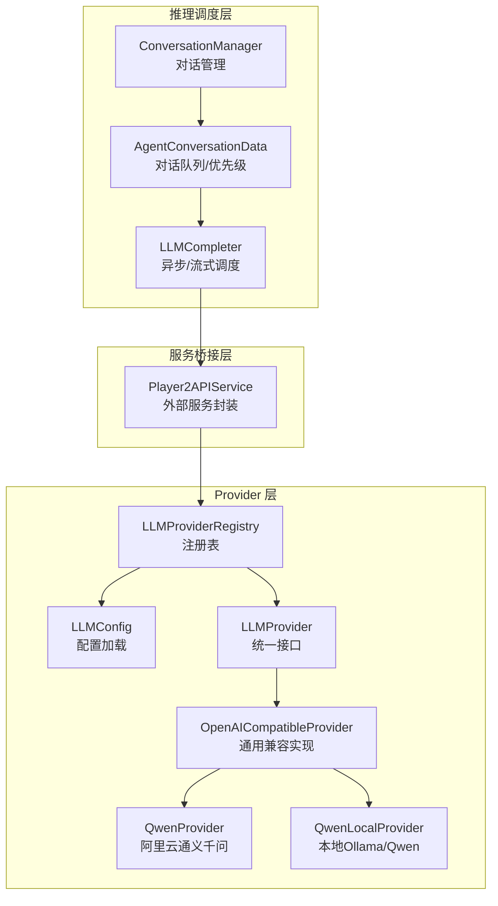
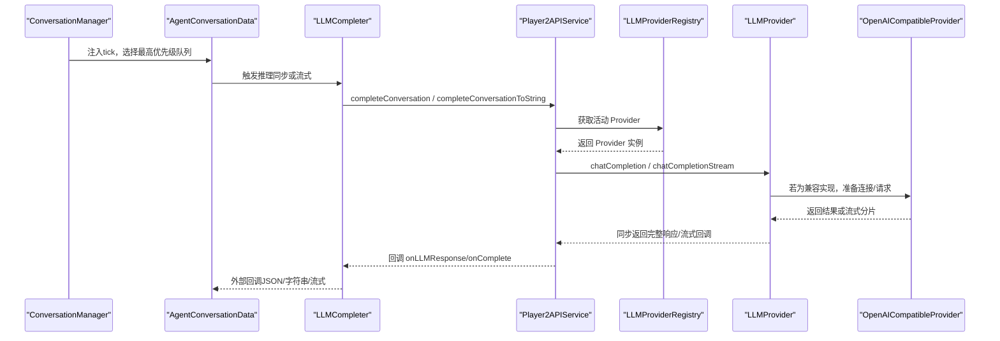
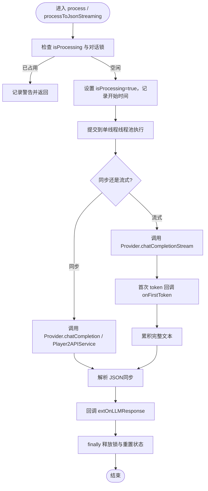
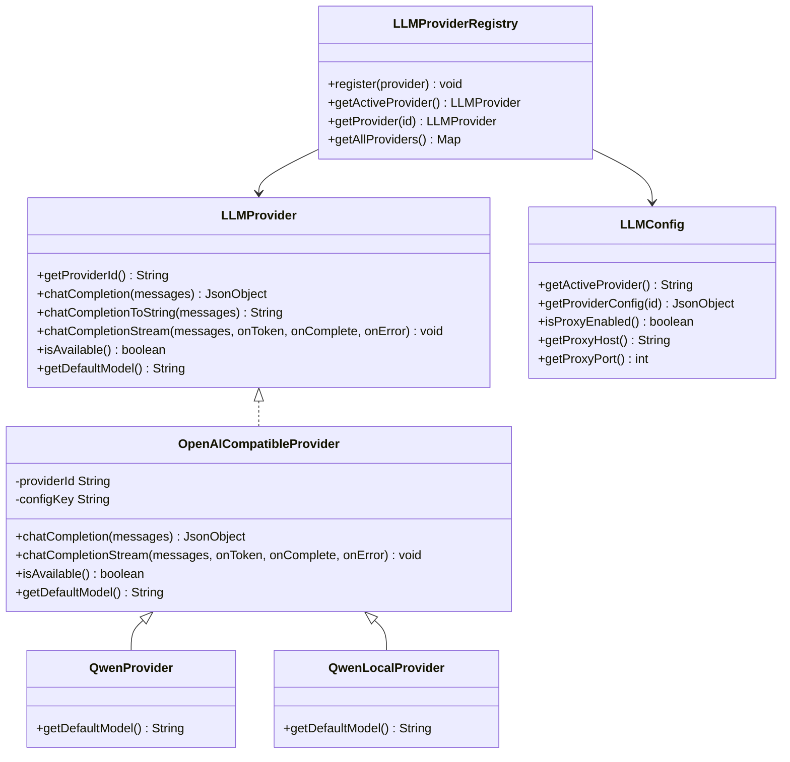
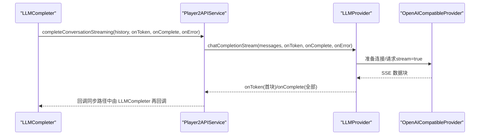
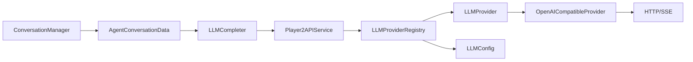

# LLM推理引擎

<cite>
**本文引用的文件**
- [LLMCompleter.java](file://src/main/java/adris/altoclef/player2api/LLMCompleter.java)
- [LLMProvider.java](file://src/main/java/adris/altoclef/player2api/llm/LLMProvider.java)
- [LLMProviderRegistry.java](file://src/main/java/adris/altoclef/player2api/llm/LLMProviderRegistry.java)
- [LLMConfig.java](file://src/main/java/adris/altoclef/player2api/llm/LLMConfig.java)
- [OpenAICompatibleProvider.java](file://src/main/java/adris/altoclef/player2api/llm/impl/OpenAICompatibleProvider.java)
- [QwenProvider.java](file://src/main/java/adris/altoclef/player2api/llm/impl/QwenProvider.java)
- [QwenLocalProvider.java](file://src/main/java/adris/altoclef/player2api/llm/impl/QwenLocalProvider.java)
- [Player2APIService.java](file://src/main/java/adris/altoclef/player2api/Player2APIService.java)
- [ConversationManager.java](file://src/main/java/adris/altoclef/player2api/manager/ConversationManager.java)
- [AgentConversationData.java](file://src/main/java/adris/altoclef/player2api/AgentConversationData.java)
- [ConversationHistory.java](file://src/main/java/adris/altoclef/player2api/ConversationHistory.java)
- [Utils.java](file://src/main/java/adris/altoclef/player2api/utils/Utils.java)
- [playerengine-llm-default.json](file://src/main/resources/playerengine-llm-default.json)
</cite>

## 目录
1. [简介](#简介)
2. [项目结构](#项目结构)
3. [核心组件](#核心组件)
4. [架构总览](#架构总览)
5. [详细组件分析](#详细组件分析)
6. [依赖关系分析](#依赖关系分析)
7. [性能考量](#性能考量)
8. [故障排查指南](#故障排查指南)
9. [结论](#结论)
10. [附录](#附录)

## 简介
本文件面向“LLM推理引擎”的技术文档，聚焦以下目标：
- 深入解释 LLMCompleter 异步调用管理机制与并发控制
- 解析 LLM Provider 策略模式架构与注册表动态加载/切换
- 详解多种 LLM 实现（QwenProvider、OpenAI 兼容、QwenLocal 本地 Ollama）
- 详述异步流式对话完成（completeConversationStreaming）的回调机制、错误处理策略、性能优化与扩展接口
- 给出自定义 Provider 实现、配置管理最佳实践与调试技巧

## 项目结构
围绕 LLM 推理的核心模块分布如下：
- 推理调度与异步管理：LLMCompleter、ConversationManager、AgentConversationData
- Provider 抽象与注册：LLMProvider、LLMProviderRegistry、LLMConfig
- 具体实现：OpenAICompatibleProvider、QwenProvider、QwenLocalProvider
- 服务桥接：Player2APIService（对外部服务的封装）
- 工具与配置：Utils、playerengine-llm-default.json

图表来源
- [ConversationManager.java:27-206](file://src/main/java/adris/altoclef/player2api/manager/ConversationManager.java#L27-L206)
- [AgentConversationData.java:32-200](file://src/main/java/adris/altoclef/player2api/AgentConversationData.java#L32-L200)
- [LLMCompleter.java:16-226](file://src/main/java/adris/altoclef/player2api/LLMCompleter.java#L16-L226)
- [LLMProviderRegistry.java:16-80](file://src/main/java/adris/altoclef/player2api/llm/LLMProviderRegistry.java#L16-L80)
- [LLMConfig.java:19-104](file://src/main/java/adris/altoclef/player2api/llm/LLMConfig.java#L19-L104)
- [LLMProvider.java:11-67](file://src/main/java/adris/altoclef/player2api/llm/LLMProvider.java#L11-L67)
- [OpenAICompatibleProvider.java:24-226](file://src/main/java/adris/altoclef/player2api/llm/impl/OpenAICompatibleProvider.java#L24-L226)
- [QwenProvider.java:11-22](file://src/main/java/adris/altoclef/player2api/llm/impl/QwenProvider.java#L11-L22)
- [QwenLocalProvider.java:12-23](file://src/main/java/adris/altoclef/player2api/llm/impl/QwenLocalProvider.java#L12-L23)
- [Player2APIService.java:35-274](file://src/main/java/adris/altoclef/player2api/Player2APIService.java#L35-L274)

章节来源
- [ConversationManager.java:27-206](file://src/main/java/adris/altoclef/player2api/manager/ConversationManager.java#L27-L206)
- [AgentConversationData.java:32-200](file://src/main/java/adris/altoclef/player2api/AgentConversationData.java#L32-L200)
- [LLMCompleter.java:16-226](file://src/main/java/adris/altoclef/player2api/LLMCompleter.java#L16-L226)
- [LLMProviderRegistry.java:16-80](file://src/main/java/adris/altoclef/player2api/llm/LLMProviderRegistry.java#L16-L80)
- [LLMConfig.java:19-104](file://src/main/java/adris/altoclef/player2api/llm/LLMConfig.java#L19-L104)
- [LLMProvider.java:11-67](file://src/main/java/adris/altoclef/player2api/llm/LLMProvider.java#L11-L67)
- [OpenAICompatibleProvider.java:24-226](file://src/main/java/adris/altoclef/player2api/llm/impl/OpenAICompatibleProvider.java#L24-L226)
- [QwenProvider.java:11-22](file://src/main/java/adris/altoclef/player2api/llm/impl/QwenProvider.java#L11-L22)
- [QwenLocalProvider.java:12-23](file://src/main/java/adris/altoclef/player2api/llm/impl/QwenLocalProvider.java#L12-L23)
- [Player2APIService.java:35-274](file://src/main/java/adris/altoclef/player2api/Player2APIService.java#L35-L274)

## 核心组件
- LLMProvider：统一抽象，定义提供者的标识、可用性、默认模型、同步与流式接口
- OpenAICompatibleProvider：通用 OpenAI 兼容实现，支持 HTTP 请求、SSE 流式解析、代理与超时控制
- QwenProvider：阿里云通义千问，继承兼容实现，覆盖 providerId、配置键与默认模型
- QwenLocalProvider：本地 Ollama/Qwen，继承兼容实现，默认指向本地 v1 端点
- LLMProviderRegistry：单例注册表，内置注册并按配置选择活动 Provider，支持回退逻辑
- LLMConfig：从资源复制并加载配置文件，暴露 activeProvider、各 Provider 配置、代理与 TTS/STT 子配置
- Player2APIService：对外部服务的封装，负责将对话历史转换为消息数组并调用 Provider 或外部 HTTP 接口
- LLMCompleter：异步调度器，封装线程池、锁与回调，支持 JSON/字符串两种输出与流式回调
- ConversationManager：全局对话管理，维护队列、优先级、锁与注入 tick 处理
- AgentConversationData：单个 NPC 的事件队列、优先级计算、强制响应与问候绕过逻辑
- Utils：通用工具，含 JSON 清洗与解析、占位符替换等

章节来源
- [LLMProvider.java:11-67](file://src/main/java/adris/altoclef/player2api/llm/LLMProvider.java#L11-L67)
- [OpenAICompatibleProvider.java:24-226](file://src/main/java/adris/altoclef/player2api/llm/impl/OpenAICompatibleProvider.java#L24-L226)
- [QwenProvider.java:11-22](file://src/main/java/adris/altoclef/player2api/llm/impl/QwenProvider.java#L11-L22)
- [QwenLocalProvider.java:12-23](file://src/main/java/adris/altoclef/player2api/llm/impl/QwenLocalProvider.java#L12-L23)
- [LLMProviderRegistry.java:16-80](file://src/main/java/adris/altoclef/player2api/llm/LLMProviderRegistry.java#L16-L80)
- [LLMConfig.java:19-104](file://src/main/java/adris/altoclef/player2api/llm/LLMConfig.java#L19-L104)
- [Player2APIService.java:35-274](file://src/main/java/adris/altoclef/player2api/Player2APIService.java#L35-L274)
- [LLMCompleter.java:16-226](file://src/main/java/adris/altoclef/player2api/LLMCompleter.java#L16-L226)
- [ConversationManager.java:27-206](file://src/main/java/adris/altoclef/player2api/manager/ConversationManager.java#L27-L206)
- [AgentConversationData.java:32-200](file://src/main/java/adris/altoclef/player2api/AgentConversationData.java#L32-L200)
- [Utils.java:13-104](file://src/main/java/adris/altoclef/player2api/utils/Utils.java#L13-L104)

## 架构总览
下图展示了从对话事件到 Provider 调用与回调的完整链路，包括同步与流式两种路径。

图表来源
- [ConversationManager.java:152-191](file://src/main/java/adris/altoclef/player2api/manager/ConversationManager.java#L152-L191)
- [AgentConversationData.java:109-200](file://src/main/java/adris/altoclef/player2api/AgentConversationData.java#L109-L200)
- [LLMCompleter.java:24-226](file://src/main/java/adris/altoclef/player2api/LLMCompleter.java#L24-L226)
- [Player2APIService.java:109-118](file://src/main/java/adris/altoclef/player2api/Player2APIService.java#L109-L118)
- [LLMProviderRegistry.java:49-70](file://src/main/java/adris/altoclef/player2api/llm/LLMProviderRegistry.java#L49-L70)
- [LLMProvider.java:21-59](file://src/main/java/adris/altoclef/player2api/llm/LLMProvider.java#L21-L59)
- [OpenAICompatibleProvider.java:112-225](file://src/main/java/adris/altoclef/player2api/llm/impl/OpenAICompatibleProvider.java#L112-L225)

## 详细组件分析

### LLMCompleter 异步调用与流式回调
- 并发与锁
  - 使用单线程线程池顺序执行推理，避免竞争
  - 通过内部状态与超时（默认 60 秒）保障异常恢复
  - 对话锁（ConversationManager.Lock）在处理期间阻塞新对话，防止竞态
- 同步路径
  - 支持返回 JsonObject 与 String 两种输出
  - 将 Provider 返回结果转交外部回调，并在 finally 中释放锁与重置状态
- 流式路径
  - 通过 onToken 首次回调触发“首 token”反馈（如“NPC 正在回复…”）
  - 将流式拼接的文本在完成后解析为 JSON，再回调外部
  - 错误回调统一处理 Provider 抛出的异常
- 超时与恢复
  - isAvailible 会在超时后强制重置状态，避免死锁

图表来源
- [LLMCompleter.java:24-226](file://src/main/java/adris/altoclef/player2api/LLMCompleter.java#L24-L226)
- [Player2APIService.java:109-118](file://src/main/java/adris/altoclef/player2api/Player2APIService.java#L109-L118)
- [OpenAICompatibleProvider.java:143-209](file://src/main/java/adris/altoclef/player2api/llm/impl/OpenAICompatibleProvider.java#L143-L209)

章节来源
- [LLMCompleter.java:16-226](file://src/main/java/adris/altoclef/player2api/LLMCompleter.java#L16-L226)
- [ConversationManager.java:30-53](file://src/main/java/adris/altoclef/player2api/manager/ConversationManager.java#L30-L53)

### LLM Provider 策略模式与注册表
- 策略模式
  - LLMProvider 定义统一接口：getProviderId、chatCompletion、chatCompletionToString、chatCompletionStream、isAvailable、getDefaultModel
  - OpenAICompatibleProvider 提供通用 HTTP/SSE 实现，子类仅需覆盖 providerId、configKey 与默认模型
- 注册表
  - LLMProviderRegistry 单例，内置注册 Qwen、OpenAI 兼容、QwenLocal
  - getActiveProvider 优先使用配置中的 activeProvider，若不可用则回退到首个可用 Provider
- 配置驱动
  - LLMConfig 加载 playerengine-llm.json，支持代理、TTS/STT 子配置与各 Provider 的开关、URL、密钥、模型、温度、最大 token 等

图表来源
- [LLMProvider.java:11-67](file://src/main/java/adris/altoclef/player2api/llm/LLMProvider.java#L11-L67)
- [OpenAICompatibleProvider.java:24-226](file://src/main/java/adris/altoclef/player2api/llm/impl/OpenAICompatibleProvider.java#L24-L226)
- [QwenProvider.java:11-22](file://src/main/java/adris/altoclef/player2api/llm/impl/QwenProvider.java#L11-L22)
- [QwenLocalProvider.java:12-23](file://src/main/java/adris/altoclef/player2api/llm/impl/QwenLocalProvider.java#L12-L23)
- [LLMProviderRegistry.java:16-80](file://src/main/java/adris/altoclef/player2api/llm/LLMProviderRegistry.java#L16-L80)
- [LLMConfig.java:19-104](file://src/main/java/adris/altoclef/player2api/llm/LLMConfig.java#L19-L104)

章节来源
- [LLMProvider.java:11-67](file://src/main/java/adris/altoclef/player2api/llm/LLMProvider.java#L11-L67)
- [OpenAICompatibleProvider.java:24-226](file://src/main/java/adris/altoclef/player2api/llm/impl/OpenAICompatibleProvider.java#L24-L226)
- [QwenProvider.java:11-22](file://src/main/java/adris/altoclef/player2api/llm/impl/QwenProvider.java#L11-L22)
- [QwenLocalProvider.java:12-23](file://src/main/java/adris/altoclef/player2api/llm/impl/QwenLocalProvider.java#L12-L23)
- [LLMProviderRegistry.java:16-80](file://src/main/java/adris/altoclef/player2api/llm/LLMProviderRegistry.java#L16-L80)
- [LLMConfig.java:19-104](file://src/main/java/adris/altoclef/player2api/llm/LLMConfig.java#L19-L104)

### 多种 LLM 实现
- QwenProvider（阿里云通义千问）
  - 继承 OpenAICompatibleProvider，providerId 与 configKey 为 “qwen”
  - 默认模型为 “qwen-plus”，API 地址指向 DashScope 兼容端点
- OpenAICompatibleProvider（通用兼容）
  - 构建 OpenAI 兼容格式请求体（model/messages/max_tokens/temperature/stream）
  - 支持代理（HTTP 代理）、超时、SSE 流式解析、错误码透传
  - isAvailable 依据配置中的 enabled 与 apiKey 是否有效
- QwenLocalProvider（本地 Ollama/Qwen）
  - 继承 OpenAICompatibleProvider，providerId 与 configKey 为 “qwen_local”
  - 默认模型为 “qwen2.5:7b”，默认 API 地址为 “http://localhost:11434/v1”

章节来源
- [QwenProvider.java:11-22](file://src/main/java/adris/altoclef/player2api/llm/impl/QwenProvider.java#L11-L22)
- [OpenAICompatibleProvider.java:24-226](file://src/main/java/adris/altoclef/player2api/llm/impl/OpenAICompatibleProvider.java#L24-L226)
- [QwenLocalProvider.java:12-23](file://src/main/java/adris/altoclef/player2api/llm/impl/QwenLocalProvider.java#L12-L23)

### 流式对话完成（completeConversationStreaming）回调机制
- 调用链
  - Player2APIService.completeConversationStreaming 将消息数组交给 LLMProvider.chatCompletionStream
  - OpenAICompatibleProvider.chatCompletionStream 以 SSE 方式读取数据流，逐块解析 choices.delta.content
  - 首块到达时触发 onToken（可用于首字节延迟反馈），全部完成后触发 onComplete
- 错误处理
  - HTTP 状态码非 2xx 时抛出异常并回调 onError
  - SSE 解析异常与 JSON 解析异常均被捕获并回调 onError
- JSON 解析
  - LLMCompleter 在流式完成后尝试解析完整文本为 JSON；失败时回调错误信息

图表来源
- [Player2APIService.java:109-118](file://src/main/java/adris/altoclef/player2api/Player2APIService.java#L109-L118)
- [LLMCompleter.java:181-211](file://src/main/java/adris/altoclef/player2api/LLMCompleter.java#L181-L211)
- [OpenAICompatibleProvider.java:143-209](file://src/main/java/adris/altoclef/player2api/llm/impl/OpenAICompatibleProvider.java#L143-L209)

章节来源
- [Player2APIService.java:109-118](file://src/main/java/adris/altoclef/player2api/Player2APIService.java#L109-L118)
- [LLMCompleter.java:181-211](file://src/main/java/adris/altoclef/player2api/LLMCompleter.java#L181-L211)
- [OpenAICompatibleProvider.java:143-209](file://src/main/java/adris/altoclef/player2api/llm/impl/OpenAICompatibleProvider.java#L143-L209)

### 错误处理策略
- Provider 层
  - HTTP 非 2xx 状态码直接抛出异常，包含响应体内容
  - SSE 解析失败或首块缺失时记录警告并继续尝试
- LLMCompleter 层
  - 外部回调异常被捕获并记录，但不影响最终状态释放
  - 流式完成后 JSON 解析失败时回调错误信息
- ConversationManager/AgentConversationData
  - 对话锁超时自动释放，避免阻塞
  - 最小响应间隔（3 秒）避免刷屏

章节来源
- [OpenAICompatibleProvider.java:129-132](file://src/main/java/adris/altoclef/player2api/llm/impl/OpenAICompatibleProvider.java#L129-L132)
- [OpenAICompatibleProvider.java:154-164](file://src/main/java/adris/altoclef/player2api/llm/impl/OpenAICompatibleProvider.java#L154-L164)
- [LLMCompleter.java:65-82](file://src/main/java/adris/altoclef/player2api/LLMCompleter.java#L65-L82)
- [LLMCompleter.java:162-180](file://src/main/java/adris/altoclef/player2api/LLMCompleter.java#L162-L180)
- [LLMCompleter.java:197-200](file://src/main/java/adris/altoclef/player2api/LLMCompleter.java#L197-L200)
- [ConversationManager.java:36-53](file://src/main/java/adris/altoclef/player2api/manager/ConversationManager.java#L36-L53)
- [AgentConversationData.java:124-129](file://src/main/java/adris/altoclef/player2api/AgentConversationData.java#L124-L129)

### 性能优化与扩展接口
- 性能优化
  - 单线程执行器保证串行化，避免 Provider 并发竞争
  - SSE 流式解析，首块即反馈，改善感知延迟
  - 最小响应间隔与对话锁共同避免过度调用
  - 代理支持与超时控制提升网络鲁棒性
- 扩展接口
  - 自定义 Provider：实现 LLMProvider 接口，或继承 OpenAICompatibleProvider 以获得通用 HTTP/SSE 能力
  - 注册新 Provider：在 LLMProviderRegistry.registerBuiltins 中加入实例，或通过外部注册方法添加
  - 配置扩展：在 playerengine-llm.json 中新增 Provider 节点，设置 enabled、apiUrl、apiKey、model、maxTokens、temperature 等

章节来源
- [LLMProvider.java:11-67](file://src/main/java/adris/altoclef/player2api/llm/LLMProvider.java#L11-L67)
- [OpenAICompatibleProvider.java:24-226](file://src/main/java/adris/altoclef/player2api/llm/impl/OpenAICompatibleProvider.java#L24-L226)
- [LLMProviderRegistry.java:32-38](file://src/main/java/adris/altoclef/player2api/llm/LLMProviderRegistry.java#L32-L38)
- [playerengine-llm-default.json:1-89](file://src/main/resources/playerengine-llm-default.json#L1-L89)

## 依赖关系分析
- 组件耦合
  - LLMCompleter 依赖 Player2APIService 与 ConversationManager.Lock
  - Player2APIService 依赖 LLMProviderRegistry 与 LLMProvider
  - LLMProviderRegistry 依赖 LLMConfig 与具体 Provider 实现
  - AgentConversationData 依赖 LLMCompleter 与 ConversationHistory
- 外部依赖
  - HTTP 连接与 SSE 解析（OpenAICompatibleProvider）
  - 日志框架（Log4j）

图表来源
- [LLMCompleter.java:16-226](file://src/main/java/adris/altoclef/player2api/LLMCompleter.java#L16-L226)
- [Player2APIService.java:35-274](file://src/main/java/adris/altoclef/player2api/Player2APIService.java#L35-L274)
- [LLMProviderRegistry.java:16-80](file://src/main/java/adris/altoclef/player2api/llm/LLMProviderRegistry.java#L16-L80)
- [LLMProvider.java:11-67](file://src/main/java/adris/altoclef/player2api/llm/LLMProvider.java#L11-L67)
- [OpenAICompatibleProvider.java:24-226](file://src/main/java/adris/altoclef/player2api/llm/impl/OpenAICompatibleProvider.java#L24-L226)
- [AgentConversationData.java:32-200](file://src/main/java/adris/altoclef/player2api/AgentConversationData.java#L32-L200)
- [ConversationManager.java:27-206](file://src/main/java/adris/altoclef/player2api/manager/ConversationManager.java#L27-L206)
- [LLMConfig.java:19-104](file://src/main/java/adris/altoclef/player2api/llm/LLMConfig.java#L19-L104)

章节来源
- [LLMCompleter.java:16-226](file://src/main/java/adris/altoclef/player2api/LLMCompleter.java#L16-L226)
- [Player2APIService.java:35-274](file://src/main/java/adris/altoclef/player2api/Player2APIService.java#L35-L274)
- [LLMProviderRegistry.java:16-80](file://src/main/java/adris/altoclef/player2api/llm/LLMProviderRegistry.java#L16-L80)
- [LLMProvider.java:11-67](file://src/main/java/adris/altoclef/player2api/llm/LLMProvider.java#L11-L67)
- [OpenAICompatibleProvider.java:24-226](file://src/main/java/adris/altoclef/player2api/llm/impl/OpenAICompatibleProvider.java#L24-L226)
- [AgentConversationData.java:32-200](file://src/main/java/adris/altoclef/player2api/AgentConversationData.java#L32-L200)
- [ConversationManager.java:27-206](file://src/main/java/adris/altoclef/player2api/manager/ConversationManager.java#L27-L206)
- [LLMConfig.java:19-104](file://src/main/java/adris/altoclef/player2api/llm/LLMConfig.java#L19-L104)

## 性能考量
- 线程模型
  - 单线程执行器避免 Provider 并发竞争，适合大多数场景
  - 如需更高吞吐，可考虑多 Completer 实例或线程池扩容（需评估 Provider 并发能力）
- 网络与流式
  - SSE 流式显著降低首字节延迟，建议优先使用
  - 合理设置 maxTokens 与 temperature，平衡质量与延迟
- 超时与恢复
  - 60 秒超时与自动解锁保障系统稳定性
- 缓存与去重
  - 最小响应间隔与反馈去重减少重复输出

## 故障排查指南
- 常见问题定位
  - Provider 不可用：检查 LLMConfig 中对应 Provider 的 enabled 与 apiKey
  - HTTP 错误：查看 OpenAICompatibleProvider 的状态码与响应体日志
  - 流式解析失败：确认 API 返回格式符合 OpenAI 兼容规范（SSE data 行）
  - 对话卡死：检查 isProcessing 与对话锁是否超时自动释放
- 调试技巧
  - 启用详细日志，关注请求体与响应体摘要
  - 使用最小配置验证（仅开启一个 Provider）
  - 通过 Utils.parseCleanedJson 的回退逻辑验证非 JSON 输出的兜底行为
  - 在本地 Ollama 环境下验证 QwenLocalProvider 的连通性

章节来源
- [OpenAICompatibleProvider.java:129-132](file://src/main/java/adris/altoclef/player2api/llm/impl/OpenAICompatibleProvider.java#L129-L132)
- [OpenAICompatibleProvider.java:154-164](file://src/main/java/adris/altoclef/player2api/llm/impl/OpenAICompatibleProvider.java#L154-L164)
- [LLMCompleter.java:213-225](file://src/main/java/adris/altoclef/player2api/LLMCompleter.java#L213-L225)
- [Utils.java:61-88](file://src/main/java/adris/altoclef/player2api/utils/Utils.java#L61-L88)

## 结论
本引擎采用“策略模式 + 注册表 + 配置驱动”的架构，结合 LLMCompleter 的异步与流式回调，实现了高可扩展、易维护的 LLM 推理通道。通过 OpenAI 兼容实现与多 Provider 支持，既能对接云端服务也能适配本地模型；配合对话锁与最小响应间隔等机制，兼顾了实时性与稳定性。扩展新 Provider 与切换 Provider 的成本较低，便于在不同部署环境下灵活选择。

## 附录

### 自定义 LLM Provider 实现步骤
- 实现 LLMProvider 接口或继承 OpenAICompatibleProvider
  - 覆盖 getProviderId、getDefaultModel
  - 若为 OpenAI 兼容，复用 chatCompletion/chatCompletionStream 的通用实现
- 在 LLMProviderRegistry.registerBuiltins 中注册实例
- 在 playerengine-llm.json 中新增 Provider 节点，设置 enabled、apiUrl、apiKey、model、maxTokens、temperature 等
- 通过 LLMConfig.reload 或重启应用使配置生效

章节来源
- [LLMProvider.java:11-67](file://src/main/java/adris/altoclef/player2api/llm/LLMProvider.java#L11-L67)
- [OpenAICompatibleProvider.java:24-226](file://src/main/java/adris/altoclef/player2api/llm/impl/OpenAICompatibleProvider.java#L24-L226)
- [LLMProviderRegistry.java:32-38](file://src/main/java/adris/altoclef/player2api/llm/LLMProviderRegistry.java#L32-L38)
- [LLMConfig.java:49-77](file://src/main/java/adris/altoclef/player2api/llm/LLMConfig.java#L49-L77)
- [playerengine-llm-default.json:1-89](file://src/main/resources/playerengine-llm-default.json#L1-L89)

### 配置管理最佳实践
- 将 API Key 保存在安全位置，避免提交到公共仓库
- 优先使用本地模型（QwenLocal）进行开发与测试，减少网络依赖
- 合理设置 maxTokens 与 temperature，平衡生成质量与成本
- 启用代理仅在必要时开启，避免额外延迟

章节来源
- [playerengine-llm-default.json:1-89](file://src/main/resources/playerengine-llm-default.json#L1-L89)
- [LLMConfig.java:37-77](file://src/main/java/adris/altoclef/player2api/llm/LLMConfig.java#L37-L77)

### 调试技巧清单
- 打开日志，观察请求体与响应体摘要
- 使用最小配置快速定位问题
- 验证流式回调的首块触发与完整文本解析
- 检查对话锁与最小响应间隔是否导致延迟

章节来源
- [OpenAICompatibleProvider.java:76-80](file://src/main/java/adris/altoclef/player2api/llm/impl/OpenAICompatibleProvider.java#L76-L80)
- [LLMCompleter.java:192-199](file://src/main/java/adris/altoclef/player2api/LLMCompleter.java#L192-L199)
- [ConversationManager.java:36-53](file://src/main/java/adris/altoclef/player2api/manager/ConversationManager.java#L36-L53)
- [AgentConversationData.java:124-129](file://src/main/java/adris/altoclef/player2api/AgentConversationData.java#L124-L129)