# NPC灵魂系统

<cite>
**本文引用的文件**
- [SoulProfile.java](file://src/main/java/adris/altoclef/player2api/soul/SoulProfile.java)
- [EmotionEngine.java](file://src/main/java/adris/altoclef/player2api/soul/EmotionEngine.java)
- [PersonaMatrix.java](file://src/main/java/adris/altoclef/player2api/soul/PersonaMatrix.java)
- [EmotionState.java](file://src/main/java/adris/altoclef/player2api/soul/EmotionState.java)
- [BehaviorSignature.java](file://src/main/java/adris/altoclef/player2api/soul/BehaviorSignature.java)
- [MemoryAnchor.java](file://src/main/java/adris/altoclef/player2api/soul/MemoryAnchor.java)
- [Relationship.java](file://src/main/java/adris/altoclef/player2api/soul/Relationship.java)
- [EmotionTrigger.java](file://src/main/java/adris/altoclef/player2api/soul/EmotionTrigger.java)
- [EmotionTriggerType.java](file://src/main/java/adris/altoclef/player2api/soul/EmotionTriggerType.java)
- [SoulProfileLoader.java](file://src/main/java/adris/altoclef/player2api/soul/SoulProfileLoader.java)
- [soul_Luna.json](file://src/main/resources/soul/soul_Luna.json)
- [soul_小悠.json](file://src/main/resources/soul/soul_小悠.json)
- [NPCMemoryCommand.java](file://src/main/java/adris/altoclef/commands/NPCMemoryCommand.java)
- [AI_NPC项目整体架构概览.md](file://docs/AI_NPC项目整体架构概览.md)
- [AI_NPC灵魂特质交互优化方案.md](file://docs/AI_NPC灵魂特质交互优化方案.md)
</cite>

## 目录
1. [简介](#简介)
2. [项目结构](#项目结构)
3. [核心组件](#核心组件)
4. [架构总览](#架构总览)
5. [详细组件分析](#详细组件分析)
6. [依赖关系分析](#依赖关系分析)
7. [性能考量](#性能考量)
8. [故障排查指南](#故障排查指南)
9. [结论](#结论)
10. [附录](#附录)

## 简介
本文件面向NPC灵魂系统，围绕SoulProfile核心聚合模型、EmotionEngine情绪引擎事件驱动机制、PersonaMatrix人格矩阵构建、EmotionState情绪状态管理、BehaviorSignature行为签名系统、MemoryAnchor记忆锚点和Relationship关系图谱进行深入技术说明。文档同时给出情绪计算算法、人格特质形成过程、记忆持久化机制、关系动态演化与行为决策树的实现要点，并提供扩展人格特征、自定义情绪触发器、实现记忆检索与关系管理的最佳实践路径。

## 项目结构
本系统位于player2api/soul包下，采用“数据模型 + 引擎 + 加载器”的分层设计：
- 数据模型：PersonaMatrix、EmotionState、BehaviorSignature、MemoryAnchor、Relationship
- 引擎：EmotionEngine（事件驱动的情绪计算）
- 聚合：SoulProfile（聚合上述模型并提供Prompt注入、持久化等能力）
- 加载器：SoulProfileLoader（JSON读写与默认模板复制）
- 示例配置：resources/soul/*.json
- 命令入口：NPCMemoryCommand（内存锚点管理）

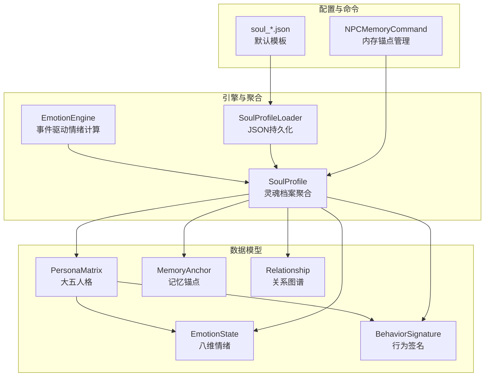

图表来源
- [SoulProfile.java:14-174](file://src/main/java/adris/altoclef/player2api/soul/SoulProfile.java#L14-L174)
- [EmotionEngine.java:11-184](file://src/main/java/adris/altoclef/player2api/soul/EmotionEngine.java#L11-L184)
- [PersonaMatrix.java:10-110](file://src/main/java/adris/altoclef/player2api/soul/PersonaMatrix.java#L10-L110)
- [EmotionState.java:9-128](file://src/main/java/adris/altoclef/player2api/soul/EmotionState.java#L9-L128)
- [BehaviorSignature.java:10-124](file://src/main/java/adris/altoclef/player2api/soul/BehaviorSignature.java#L10-L124)
- [MemoryAnchor.java:8-61](file://src/main/java/adris/altoclef/player2api/soul/MemoryAnchor.java#L8-L61)
- [Relationship.java:8-70](file://src/main/java/adris/altoclef/player2api/soul/Relationship.java#L8-L70)
- [SoulProfileLoader.java:25-217](file://src/main/java/adris/altoclef/player2api/soul/SoulProfileLoader.java#L25-L217)
- [soul_Luna.json:1-61](file://src/main/resources/soul/soul_Luna.json#L1-L61)
- [soul_小悠.json:1-61](file://src/main/resources/soul/soul_小悠.json#L1-L61)
- [NPCMemoryCommand.java:16-107](file://src/main/java/adris/altoclef/commands/NPCMemoryCommand.java#L16-L107)

章节来源
- [AI_NPC项目整体架构概览.md:574-596](file://docs/AI_NPC项目整体架构概览.md#L574-L596)

## 核心组件
- SoulProfile：NPC灵魂聚合根对象，负责情绪衰减、记忆锚点管理、关系管理、Prompt注入与持久化。
- EmotionEngine：事件驱动的情绪计算引擎，依据EmotionTriggerType对EmotionState进行调整，并联动关系演化。
- PersonaMatrix：基于大五人格模型的静态人格矩阵，提供Prompt文本与行为指导。
- EmotionState：八维情绪状态容器，支持调整、衰减、主导情绪识别与Prompt文本生成。
- BehaviorSignature：从PersonaMatrix派生的行为偏好签名，涵盖主动性、风险承受、独立性、效率与忠诚度。
- MemoryAnchor：情感记忆锚点，具备评分计算、时效衰减与永久标记。
- Relationship：与玩家/实体的关系档案，包含亲密度、信任度、依赖度与称谓演化。
- EmotionTrigger/EmotionTriggerType：事件触发器与枚举，统一抽象导致情绪变化的游戏事件。
- SoulProfileLoader：JSON配置文件的加载与保存，支持默认模板复制与回退策略。
- NPCMemoryCommand：游戏内命令，用于添加、列出、删除与清空记忆锚点。

章节来源
- [SoulProfile.java:14-174](file://src/main/java/adris/altoclef/player2api/soul/SoulProfile.java#L14-L174)
- [EmotionEngine.java:11-184](file://src/main/java/adris/altoclef/player2api/soul/EmotionEngine.java#L11-L184)
- [PersonaMatrix.java:10-110](file://src/main/java/adris/altoclef/player2api/soul/PersonaMatrix.java#L10-L110)
- [EmotionState.java:9-128](file://src/main/java/adris/altoclef/player2api/soul/EmotionState.java#L9-L128)
- [BehaviorSignature.java:10-124](file://src/main/java/adris/altoclef/player2api/soul/BehaviorSignature.java#L10-L124)
- [MemoryAnchor.java:8-61](file://src/main/java/adris/altoclef/player2api/soul/MemoryAnchor.java#L8-L61)
- [Relationship.java:8-70](file://src/main/java/adris/altoclef/player2api/soul/Relationship.java#L8-L70)
- [EmotionTrigger.java:6-19](file://src/main/java/adris/altoclef/player2api/soul/EmotionTrigger.java#L6-L19)
- [EmotionTriggerType.java:6-39](file://src/main/java/adris/altoclef/player2api/soul/EmotionTriggerType.java#L6-L39)
- [SoulProfileLoader.java:25-217](file://src/main/java/adris/altoclef/player2api/soul/SoulProfileLoader.java#L25-L217)
- [NPCMemoryCommand.java:16-107](file://src/main/java/adris/altoclef/commands/NPCMemoryCommand.java#L16-L107)

## 架构总览
系统采用“事件驱动 + 模型聚合 + Prompt注入”的架构：
- 事件层：EmotionTriggerType定义事件类型，EmotionEngine作为事件处理器。
- 模型层：PersonaMatrix、EmotionState、BehaviorSignature、MemoryAnchor、Relationship构成NPC内在状态。
- 聚合层：SoulProfile协调各模型，提供Prompt注入与持久化。
- 存储层：SoulProfileLoader负责JSON读写与默认模板复制。
- 交互层：NPCMemoryCommand提供运行时记忆管理；AI侧通过Prompt注入获得NPC状态。

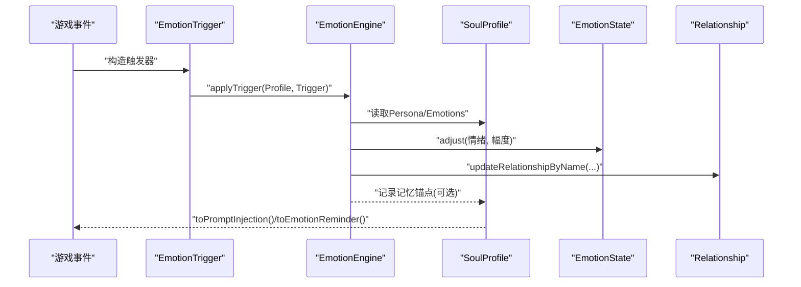

图表来源
- [EmotionEngine.java:17-171](file://src/main/java/adris/altoclef/player2api/soul/EmotionEngine.java#L17-L171)
- [SoulProfile.java:114-172](file://src/main/java/adris/altoclef/player2api/soul/SoulProfile.java#L114-L172)
- [Relationship.java:17-35](file://src/main/java/adris/altoclef/player2api/soul/Relationship.java#L17-L35)

## 详细组件分析

### SoulProfile（灵魂档案）
- 职责
  - 聚合PersonaMatrix、EmotionState、BehaviorSignature、MemoryAnchor、Relationship。
  - 提供toPromptInjection与toEmotionReminder，用于LLM Prompt注入。
  - 提供记忆锚点的增删查与清理策略，限制最大数量并按评分保留。
  - 提供关系的创建与查询，支持按UUID映射。
  - 提供tickEmotionDecay，定时进行情绪自然衰减。
  - 提供save，委托SoulProfileLoader进行持久化。
- 关键流程
  - 记忆锚点清理：按评分排序，超过上限时删除最低分且非永久锚点。
  - 情绪衰减：每30秒衰减一次，衰减率可控。
  - Prompt注入：按顺序输出人格、情绪、记忆锚点Top-N、关系与行为签名。

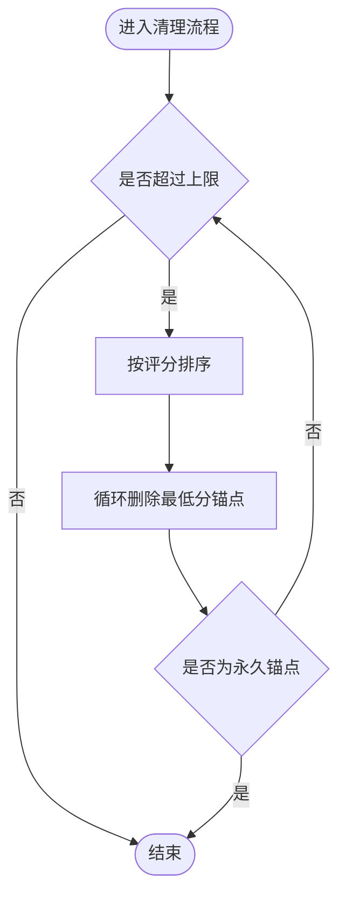

图表来源
- [SoulProfile.java:81-91](file://src/main/java/adris/altoclef/player2api/soul/SoulProfile.java#L81-L91)

章节来源
- [SoulProfile.java:14-174](file://src/main/java/adris/altoclef/player2api/soul/SoulProfile.java#L14-L174)

### EmotionEngine（情绪引擎）
- 职责
  - 根据EmotionTriggerType对EmotionState进行调整。
  - 结合PersonaMatrix中的特质（如宜人性、尽责性、神经质）对情绪变化进行调节。
  - 在关键事件（如被攻击、收到礼物、玩家死亡）时创建MemoryAnchor并更新关系。
- 情绪计算算法
  - 单次调整幅度限制在±0.25以内，防止瞬时爆炸。
  - 情绪自然衰减按给定速率线性衰减至0。
  - 主导情绪通过遍历获取最高强度情绪键。
- 关键事件处理
  - 玩家称赞：提升喜悦与信任，关系亲密度+。
  - 玩家责备：提升悲伤与愤怒，低宜人性者更易生气。
  - 玩家攻击：提升愤怒、信任下降、恐惧上升，并创建创伤记忆锚点。
  - 玩家送礼：按物品价值提升喜悦、信任与惊讶，并创建关系记忆锚点。
  - 玩家死亡：根据宜人性决定是否增加恐惧。
  - 环境事件：昼夜交替、天气变化对恐惧与期待产生影响。
  - 任务事件：完成/失败/取消分别影响喜悦与愤怒。
  - 社交事件：遇到新NPC或被问候对惊讶与外向性相关情绪产生影响。

```mermaid
flowchart TD
EStart(["接收触发器"]) --> Switch{"匹配触发器类型"}
Switch --> Praise["PLAYER_PRAISE<br/>joy+=, trust+="]
Switch --> Blame["PLAYER_BLAME<br/>sadness+, anger+<br/>低宜人性者+anger"]
Switch --> Attack["PLAYER_ATTACK<br/>anger+, trust-, fear+<br/>创建创伤锚点"]
Switch --> Gift["PLAYER_GIFT<br/>joy+, trust+, surprise+<br/>创建关系锚点"]
Switch --> Death["PLAYER_DEATH<br/>sadness+<br/>低宜人性+恐惧"]
Switch --> Join["PLAYER_JOIN<br/>joy+, anticipation+"]
Switch --> Leave["PLAYER_LEAVE<br/>sadness+"]
Switch --> Day["DAY_BREAK<br/>joy+, fear-"]
Switch --> Night["NIGHT_FALL<br/>低神经质-fear+, anticipation+"]
Switch --> Rain["RAIN_START<br/>高神经质+ sadness"]
Switch --> Thunder["THUNDER<br/>fear+, surprise+<br/>恐惧随神经质增强"]
Switch --> FindD["FIND_DIAMOND<br/>joy+, surprise+"]
Switch --> FindR["FIND_RARE_ITEM<br/>joy+, surprise+"]
Switch --> Cave["ENTER_CAVE<br/>高神经质+fear+, anticipation+"]
Switch --> Nether["ENTER_NETHER<br/>fear+, anticipation+<br/>恐惧随神经质增强"]
Switch --> EndD["ENTER_END<br/>fear+, anticipation+"]
Switch --> Creeper["CREEPER_NEARBY<br/>高神经质+fear+, surprise+"]
Switch --> Health["LOW_HEALTH<br/>fear+, 高神经质+fear+"]
Switch --> TaskC["TASK_COMPLETE<br/>joy+, anticipation+"]
Switch --> TaskF["TASK_FAIL<br/>sadness+, 高尽责者+anger"]
Switch --> TaskX["TASK_CANCELLED<br/>sadness+, anticipation-"]
Switch --> Meet["MEET_NEW_NPC<br/>surprise+, 外向者+joy"]
Switch --> Greet["NPC_GREETING<br/>外向者+joy"]
Praise --> Apply["应用到EmotionState"]
Blame --> Apply
Attack --> Apply
Gift --> Apply
Death --> Apply
Join --> Apply
Leave --> Apply
Day --> Apply
Night --> Apply
Rain --> Apply
Thunder --> Apply
FindD --> Apply
FindR --> Apply
Cave --> Apply
Nether --> Apply
EndD --> Apply
Creeper --> Apply
Health --> Apply
TaskC --> Apply
TaskF --> Apply
TaskX --> Apply
Meet --> Apply
Greet --> Apply
Apply --> RelUpdate["更新关系(可选)"]
RelUpdate --> End(["结束"])
```

图表来源
- [EmotionEngine.java:23-171](file://src/main/java/adris/altoclef/player2api/soul/EmotionEngine.java#L23-L171)
- [EmotionState.java:36-90](file://src/main/java/adris/altoclef/player2api/soul/EmotionState.java#L36-L90)

章节来源
- [EmotionEngine.java:11-184](file://src/main/java/adris/altoclef/player2api/soul/EmotionEngine.java#L11-L184)
- [EmotionState.java:9-128](file://src/main/java/adris/altoclef/player2api/soul/EmotionState.java#L9-L128)

### PersonaMatrix（人格矩阵）
- 职责
  - 维护大五人格五个维度：开放性、尽责性、外向性、宜人性、神经质。
  - 提供toMap/fromMap用于序列化与反序列化。
  - 生成Prompt文本，包含维度数值与基于维度的行为指导。
- 人格特质形成过程
  - 通过配置文件初始化，或在运行时由SoulProfileLoader加载。
  - 通过BehaviorSignature.deriveFromPersona从人格矩阵推导行为签名。

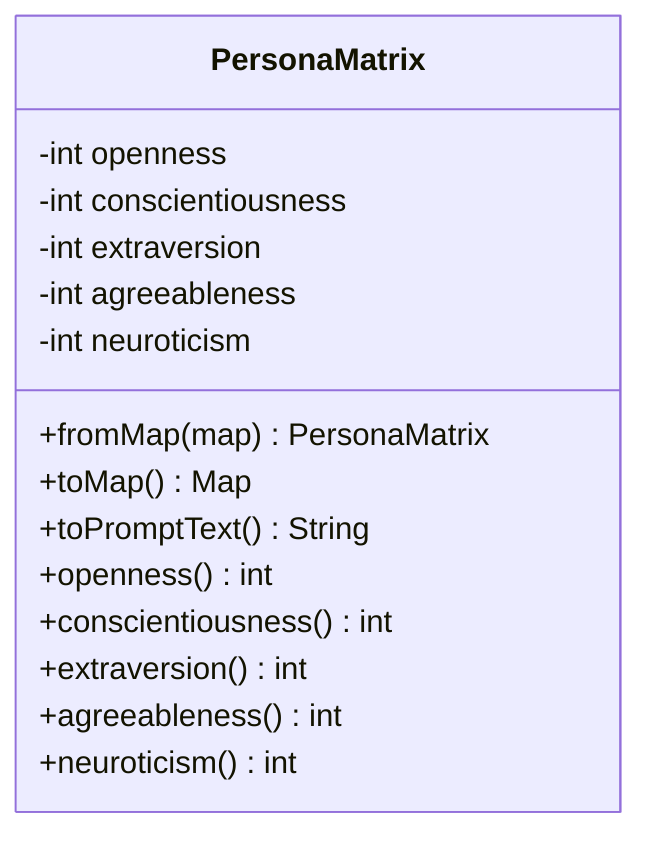

图表来源
- [PersonaMatrix.java:10-110](file://src/main/java/adris/altoclef/player2api/soul/PersonaMatrix.java#L10-L110)

章节来源
- [PersonaMatrix.java:10-110](file://src/main/java/adris/altoclef/player2api/soul/PersonaMatrix.java#L10-L110)

### EmotionState（情绪状态）
- 职责
  - 维护八种基础情绪：joy、sadness、anger、fear、surprise、disgust、trust、anticipation。
  - 提供adjust/set/get/descent方法，支持单次幅度限制与全局衰减。
  - 提供getDominantEmotion/getDominantIntensity/hasSignificantEmotion用于主导情绪判定。
  - 生成Prompt文本，包含当前情绪与基于主导情绪的对话指导。
- 复杂度
  - adjust/set/get均为O(1)。
  - decay遍历常数个键，复杂度O(1)。
  - 主导情绪查找O(1)（固定8个键）。

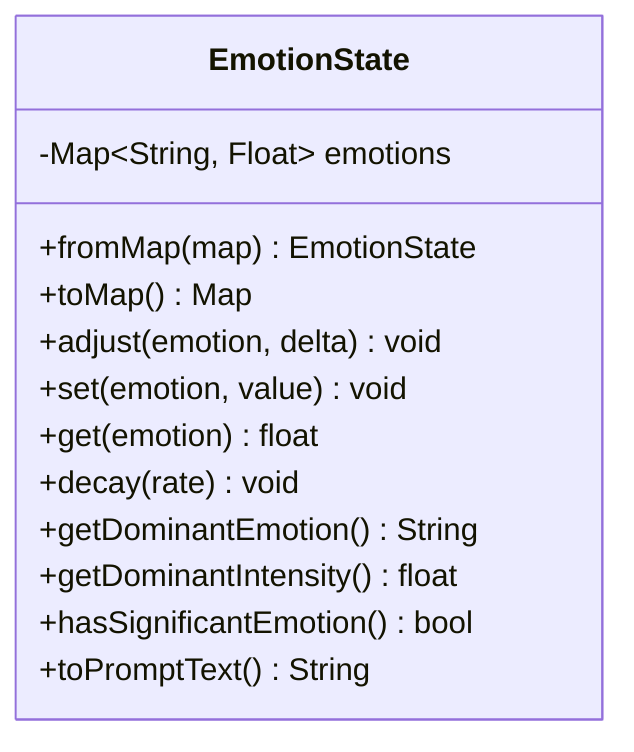

图表来源
- [EmotionState.java:9-128](file://src/main/java/adris/altoclef/player2api/soul/EmotionState.java#L9-L128)

章节来源
- [EmotionState.java:9-128](file://src/main/java/adris/altoclef/player2api/soul/EmotionState.java#L9-L128)

### BehaviorSignature（行为签名）
- 职责
  - 从PersonaMatrix派生默认行为签名：主动性、风险承受、独立性、效率、忠诚度。
  - 提供fromMap/toMap与Prompt文本生成。
- 行为决策树
  - 主动性受外向性影响，外向者更易主动。
  - 风险承受受开放性与神经质共同影响，开放性越高、神经质越低，越愿意承担风险。
  - 独立性与尽责性正相关，尽责者更倾向于自主决策。
  - 效率倾向与尽责性正相关，尽责者更关注任务完成质量与速度。
  - 忠诚度与宜人性正相关，宜人性高者更偏向保护与服务他人。

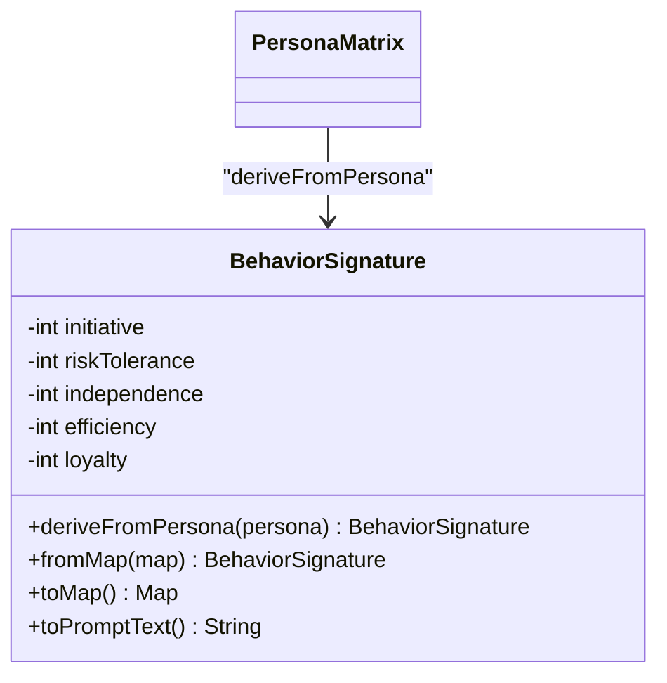

图表来源
- [BehaviorSignature.java:10-124](file://src/main/java/adris/altoclef/player2api/soul/BehaviorSignature.java#L10-L124)
- [PersonaMatrix.java:10-110](file://src/main/java/adris/altoclef/player2api/soul/PersonaMatrix.java#L10-L110)

章节来源
- [BehaviorSignature.java:10-124](file://src/main/java/adris/altoclef/player2api/soul/BehaviorSignature.java#L10-L124)

### MemoryAnchor（记忆锚点）
- 职责
  - 记录重要情感事件，具备分类、情感权重、时间戳、永久标记与关联玩家。
  - 提供getScore计算评分，综合情感权重与时效衰减（7天内衰减至0）。
  - 支持永久锚点（permanent=true），不受清理策略影响。
- 记忆持久化
  - 通过SoulProfileLoader保存到JSON，包含id、content、category、emotionalWeight、timestamp、permanent、relatedPlayer。

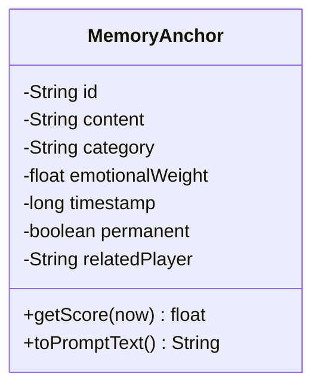

图表来源
- [MemoryAnchor.java:8-61](file://src/main/java/adris/altoclef/player2api/soul/MemoryAnchor.java#L8-L61)
- [SoulProfileLoader.java:92-105](file://src/main/java/adris/altoclef/player2api/soul/SoulProfileLoader.java#L92-L105)

章节来源
- [MemoryAnchor.java:8-61](file://src/main/java/adris/altoclef/player2api/soul/MemoryAnchor.java#L8-L61)
- [SoulProfileLoader.java:92-105](file://src/main/java/adris/altoclef/player2api/soul/SoulProfileLoader.java#L92-L105)

### Relationship（关系图谱）
- 职责
  - 维护与目标玩家/实体的关系：intimacy、trust、dependence。
  - 根据亲密度自动更新称谓currentTitle。
  - 提供toPromptText生成关系描述与建议。
- 动态演化
  - 通过EmotionEngine.updateRelationshipByName按事件类型调整三元变量，并更新最近互动时间。
  - 称谓随亲密度区间变化：敌人、 distrust、acquaintance、friend、close_friend、master/best_friend。

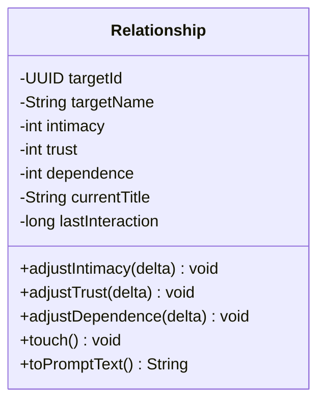

图表来源
- [Relationship.java:8-70](file://src/main/java/adris/altoclef/player2api/soul/Relationship.java#L8-L70)
- [EmotionEngine.java:173-182](file://src/main/java/adris/altoclef/player2api/soul/EmotionEngine.java#L173-L182)

章节来源
- [Relationship.java:8-70](file://src/main/java/adris/altoclef/player2api/soul/Relationship.java#L8-L70)
- [EmotionEngine.java:173-182](file://src/main/java/adris/altoclef/player2api/soul/EmotionEngine.java#L173-L182)

### EmotionTrigger/EmotionTriggerType（事件触发器）
- 职责
  - EmotionTrigger封装触发器类型与上下文（玩家名、物品名、物品价值）。
  - EmotionTriggerType枚举定义所有可能的触发事件，覆盖玩家互动、环境事件、游戏事件、任务事件与社交事件。
- 使用方式
  - 在事件发生时构造EmotionTrigger并调用EmotionEngine.applyTrigger。
  - 在NPCMemoryCommand中可直接创建MemoryAnchor并添加到SoulProfile。

章节来源
- [EmotionTrigger.java:6-19](file://src/main/java/adris/altoclef/player2api/soul/EmotionTrigger.java#L6-L19)
- [EmotionTriggerType.java:6-39](file://src/main/java/adris/altoclef/player2api/soul/EmotionTriggerType.java#L6-L39)
- [NPCMemoryCommand.java:16-107](file://src/main/java/adris/altoclef/commands/NPCMemoryCommand.java#L16-L107)

### SoulProfileLoader（持久化加载器）
- 职责
  - loadOrCreate：优先从运行时配置目录加载，不存在则从classpath资源复制默认模板后再加载。
  - save：将PersonaMatrix、EmotionState、BehaviorSignature、MemoryAnchor、Relationship序列化为JSON。
  - loadFromFile：从JSON反序列化各模型并构建SoulProfile。
- 默认模板
  - resources/soul/soul_Luna.json与soul_小悠.json提供默认配置示例。

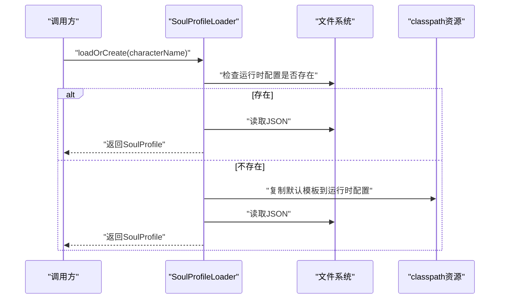

图表来源
- [SoulProfileLoader.java:35-57](file://src/main/java/adris/altoclef/player2api/soul/SoulProfileLoader.java#L35-L57)
- [soul_Luna.json:1-61](file://src/main/resources/soul/soul_Luna.json#L1-L61)
- [soul_小悠.json:1-61](file://src/main/resources/soul/soul_小悠.json#L1-L61)

章节来源
- [SoulProfileLoader.java:25-217](file://src/main/java/adris/altoclef/player2api/soul/SoulProfileLoader.java#L25-L217)

## 依赖关系分析
- 内聚性
  - 每个模型职责单一：PersonaMatrix专注人格、EmotionState专注情绪、BehaviorSignature专注行为、MemoryAnchor专注记忆、Relationship专注关系。
- 耦合性
  - EmotionEngine依赖SoulProfile与PersonaMatrix/EmotionState，耦合集中在事件处理逻辑。
  - SoulProfile聚合多个模型，耦合度较高但职责清晰。
  - SoulProfileLoader仅依赖模型的序列化接口，耦合度低。
- 外部依赖
  - JSON序列化使用Gson。
  - 日志使用Log4j。
  - UUID用于关系映射。

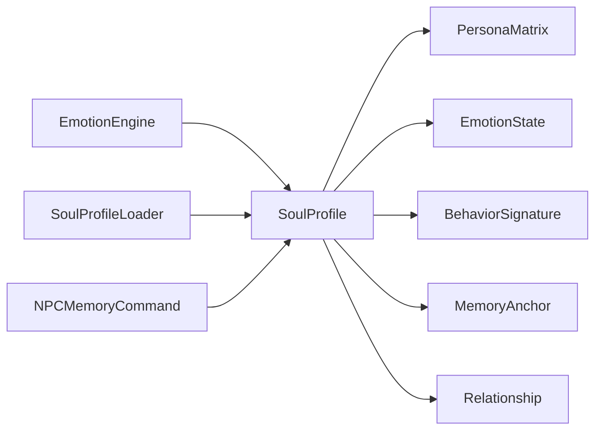

图表来源
- [EmotionEngine.java:17-171](file://src/main/java/adris/altoclef/player2api/soul/EmotionEngine.java#L17-L171)
- [SoulProfile.java:19-28](file://src/main/java/adris/altoclef/player2api/soul/SoulProfile.java#L19-L28)
- [SoulProfileLoader.java:62-130](file://src/main/java/adris/altoclef/player2api/soul/SoulProfileLoader.java#L62-L130)
- [NPCMemoryCommand.java:29-46](file://src/main/java/adris/altoclef/commands/NPCMemoryCommand.java#L29-L46)

章节来源
- [EmotionEngine.java:11-184](file://src/main/java/adris/altoclef/player2api/soul/EmotionEngine.java#L11-L184)
- [SoulProfile.java:14-174](file://src/main/java/adris/altoclef/player2api/soul/SoulProfile.java#L14-L174)
- [SoulProfileLoader.java:25-217](file://src/main/java/adris/altoclef/player2api/soul/SoulProfileLoader.java#L25-L217)
- [NPCMemoryCommand.java:16-107](file://src/main/java/adris/altoclef/commands/NPCMemoryCommand.java#L16-L107)

## 性能考量
- 线程安全
  - MemoryAnchor列表使用CopyOnWriteArrayList，适合读多写少场景。
  - 关系映射使用ConcurrentHashMap，支持并发访问。
  - 情绪Map使用ConcurrentHashMap，保证并发一致性。
- 时间复杂度
  - EmotionState的adjust/set/get/descent为O(1)。
  - 主导情绪查找O(1)（固定8个键）。
  - 记忆锚点清理按评分排序O(n log n)，但n有限（MAX_MEMORY_ANCHORS=20）。
- I/O开销
  - JSON读写在save/load时进行，建议批量操作或异步化以降低主线程阻塞。
- 建议
  - 将SoulProfileLoader.save改为异步调度，避免频繁写盘。
  - 对频繁触发的事件（如心跳tick）合并情绪衰减与关系更新。

[本节为通用性能讨论，不直接分析具体文件]

## 故障排查指南
- 加载失败
  - 现象：无法从配置文件加载，回退到默认中性人格。
  - 排查：检查运行时配置目录是否存在对应JSON；确认字段完整；查看日志错误信息。
  - 参考
    - [SoulProfileLoader.java:42-56](file://src/main/java/adris/altoclef/player2api/soul/SoulProfileLoader.java#L42-L56)
- 记忆锚点异常
  - 现象：记忆锚点过多或无法清理。
  - 排查：确认MAX_MEMORY_ANCHORS阈值与cleanupOldAnchors逻辑；检查是否有永久锚点阻止清理。
  - 参考
    - [SoulProfile.java:81-91](file://src/main/java/adris/altoclef/player2api/soul/SoulProfile.java#L81-L91)
- 情绪异常
  - 现象：情绪不衰减或瞬时爆炸。
  - 排查：确认tickEmotionDecay调用频率；检查adjust单次幅度限制；确认decay速率设置。
  - 参考
    - [SoulProfile.java:120-126](file://src/main/java/adris/altoclef/player2api/soul/SoulProfile.java#L120-L126)
    - [EmotionState.java:36-63](file://src/main/java/adris/altoclef/player2api/soul/EmotionState.java#L36-L63)
- 关系异常
  - 现象：关系不更新或称谓不正确。
  - 排查：确认updateRelationshipByName调用链；检查intimacy阈值与称谓映射。
  - 参考
    - [EmotionEngine.java:173-182](file://src/main/java/adris/altoclef/player2api/soul/EmotionEngine.java#L173-L182)
    - [Relationship.java:37-44](file://src/main/java/adris/altoclef/player2api/soul/Relationship.java#L37-L44)

章节来源
- [SoulProfileLoader.java:42-56](file://src/main/java/adris/altoclef/player2api/soul/SoulProfileLoader.java#L42-L56)
- [SoulProfile.java:81-91](file://src/main/java/adris/altoclef/player2api/soul/SoulProfile.java#L81-L91)
- [EmotionState.java:36-63](file://src/main/java/adris/altoclef/player2api/soul/EmotionState.java#L36-L63)
- [EmotionEngine.java:173-182](file://src/main/java/adris/altoclef/player2api/soul/EmotionEngine.java#L173-L182)
- [Relationship.java:37-44](file://src/main/java/adris/altoclef/player2api/soul/Relationship.java#L37-L44)

## 结论
NPC灵魂系统通过SoulProfile聚合模型与EmotionEngine事件驱动机制，实现了稳定的人格表达、情绪演算、记忆持久化与关系动态演化。系统采用分层设计与明确的职责边界，既便于扩展（如新增触发器类型、行为签名维度），又易于维护（JSON配置与默认模板）。建议在实际部署中结合异步持久化与批处理策略，进一步提升性能与稳定性。

[本节为总结性内容，不直接分析具体文件]

## 附录

### 最佳实践：扩展人格特征
- 新增维度
  - 在PersonaMatrix中添加新维度字段与clamp约束。
  - 更新toMap/fromMap与toPromptText，确保Prompt与序列化一致。
  - 在BehaviorSignature中添加派生逻辑，将新维度映射到行为签名。
  - 参考
    - [PersonaMatrix.java:19-47](file://src/main/java/adris/altoclef/player2api/soul/PersonaMatrix.java#L19-L47)
    - [BehaviorSignature.java:30-43](file://src/main/java/adris/altoclef/player2api/soul/BehaviorSignature.java#L30-L43)
- 自定义Prompt
  - 在PersonaMatrix.toPromptText中追加描述与行为指导，保持语言简洁一致。

章节来源
- [PersonaMatrix.java:19-47](file://src/main/java/adris/altoclef/player2api/soul/PersonaMatrix.java#L19-L47)
- [BehaviorSignature.java:30-43](file://src/main/java/adris/altoclef/player2api/soul/BehaviorSignature.java#L30-L43)

### 最佳实践：自定义情绪触发器
- 新增触发器类型
  - 在EmotionTriggerType中添加新枚举值。
  - 在EmotionEngine.switch分支中添加对应处理逻辑，结合PersonaMatrix特性进行微调。
  - 在需要时创建MemoryAnchor并调用SoulProfile.addMemoryAnchor。
  - 参考
    - [EmotionTriggerType.java:6-39](file://src/main/java/adris/altoclef/player2api/soul/EmotionTriggerType.java#L6-L39)
    - [EmotionEngine.java:23-171](file://src/main/java/adris/altoclef/player2api/soul/EmotionEngine.java#L23-L171)
- 触发器构造
  - 使用EmotionTrigger构造函数传入type与上下文，调用applyTrigger。
  - 参考
    - [EmotionTrigger.java:6-19](file://src/main/java/adris/altoclef/player2api/soul/EmotionTrigger.java#L6-L19)

章节来源
- [EmotionTriggerType.java:6-39](file://src/main/java/adris/altoclef/player2api/soul/EmotionTriggerType.java#L6-L39)
- [EmotionEngine.java:23-171](file://src/main/java/adris/altoclef/player2api/soul/EmotionEngine.java#L23-L171)
- [EmotionTrigger.java:6-19](file://src/main/java/adris/altoclef/player2api/soul/EmotionTrigger.java#L6-L19)

### 最佳实践：实现记忆检索
- 查询Top-N记忆锚点
  - 使用SoulProfile.getTopMemoryAnchors(count)按评分排序返回Top-N。
  - 参考
    - [SoulProfile.java:93-98](file://src/main/java/adris/altoclef/player2api/soul/SoulProfile.java#L93-L98)
- 计算记忆评分
  - 使用MemoryAnchor.getScore(now)综合情感权重与时效衰减。
  - 参考
    - [MemoryAnchor.java:50-54](file://src/main/java/adris/altoclef/player2api/soul/MemoryAnchor.java#L50-L54)

章节来源
- [SoulProfile.java:93-98](file://src/main/java/adris/altoclef/player2api/soul/SoulProfile.java#L93-L98)
- [MemoryAnchor.java:50-54](file://src/main/java/adris/altoclef/player2api/soul/MemoryAnchor.java#L50-L54)

### 最佳实践：关系管理
- 创建或获取关系
  - 使用SoulProfile.getOrCreateRelationship(targetId, targetName)按UUID映射创建或获取关系。
  - 参考
    - [SoulProfile.java:102-105](file://src/main/java/adris/altoclef/player2api/soul/SoulProfile.java#L102-L105)
- 更新关系
  - 通过EmotionEngine.updateRelationshipByName按事件类型调整intimacy、trust、dependence。
  - 参考
    - [EmotionEngine.java:173-182](file://src/main/java/adris/altoclef/player2api/soul/EmotionEngine.java#L173-L182)
- Prompt注入
  - 使用Relationship.toPromptText将关系状态注入LLM提示词。
  - 参考
    - [Relationship.java:46-64](file://src/main/java/adris/altoclef/player2api/soul/Relationship.java#L46-L64)

章节来源
- [SoulProfile.java:102-105](file://src/main/java/adris/altoclef/player2api/soul/SoulProfile.java#L102-L105)
- [EmotionEngine.java:173-182](file://src/main/java/adris/altoclef/player2api/soul/EmotionEngine.java#L173-L182)
- [Relationship.java:46-64](file://src/main/java/adris/altoclef/player2api/soul/Relationship.java#L46-L64)

### 配置示例参考
- 默认模板
  - Luna与小悠的配置文件展示了人格矩阵、初始情绪状态、行为签名、运行时字段等结构。
  - 参考
    - [soul_Luna.json:1-61](file://src/main/resources/soul/soul_Luna.json#L1-L61)
    - [soul_小悠.json:1-61](file://src/main/resources/soul/soul_小悠.json#L1-L61)

章节来源
- [soul_Luna.json:1-61](file://src/main/resources/soul/soul_Luna.json#L1-L61)
- [soul_小悠.json:1-61](file://src/main/resources/soul/soul_小悠.json#L1-L61)