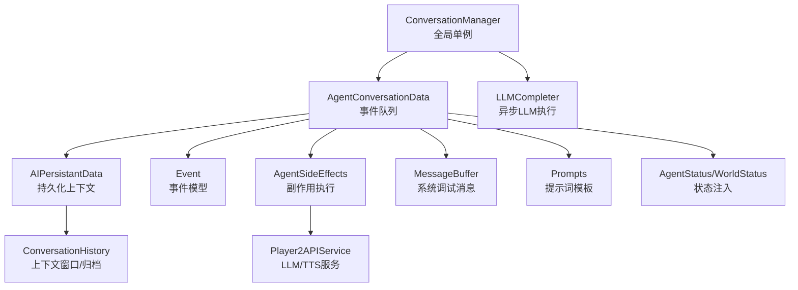
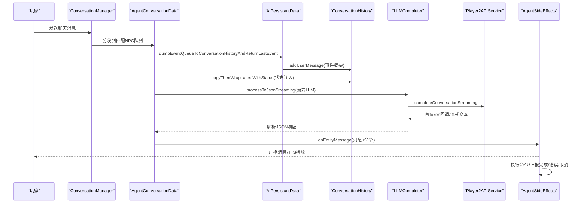
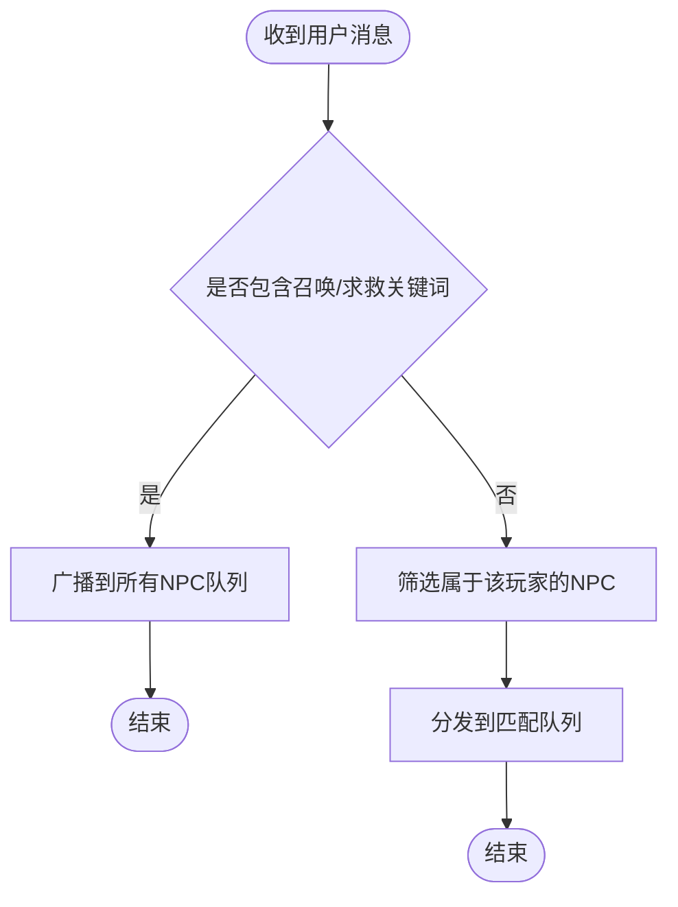
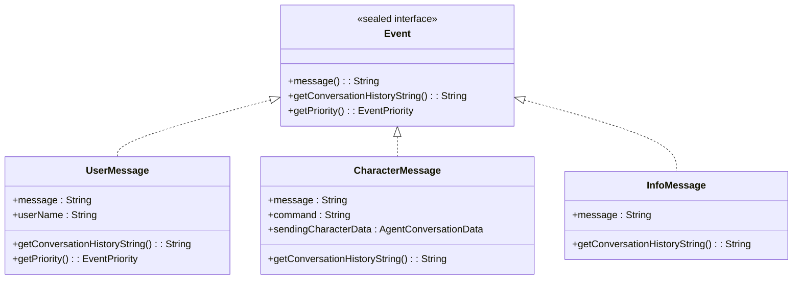
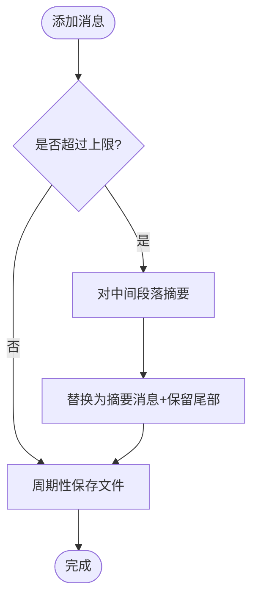
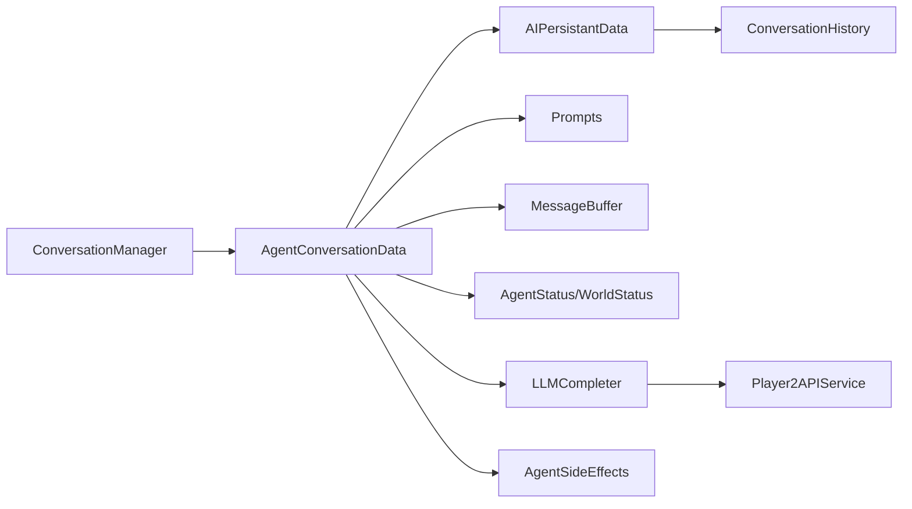

# 对话管理系统

<cite>
**本文引用的文件**
- [ConversationManager.java](file://src/main/java/adris/altoclef/player2api/manager/ConversationManager.java)
- [AgentConversationData.java](file://src/main/java/adris/altoclef/player2api/AgentConversationData.java)
- [ConversationHistory.java](file://src/main/java/adris/altoclef/player2api/ConversationHistory.java)
- [Prompts.java](file://src/main/java/adris/altoclef/player2api/Prompts.java)
- [MessageBuffer.java](file://src/main/java/adris/altoclef/player2api/MessageBuffer.java)
- [Event.java](file://src/main/java/adris/altoclef/player2api/Event.java)
- [AIPersistantData.java](file://src/main/java/adris/altoclef/player2api/AIPersistantData.java)
- [LLMCompleter.java](file://src/main/java/adris/altoclef/player2api/LLMCompleter.java)
- [AgentSideEffects.java](file://src/main/java/adris/altoclef/player2api/AgentSideEffects.java)
- [Player2APIService.java](file://src/main/java/adris/altoclef/player2api/Player2APIService.java)
- [AgentStatus.java](file://src/main/java/adris/altoclef/player2api/status/AgentStatus.java)
- [WorldStatus.java](file://src/main/java/adris/altoclef/player2api/status/WorldStatus.java)
- [Utils.java](file://src/main/java/adris/altoclef/player2api/utils/Utils.java)
</cite>

## 目录
1. [简介](#简介)
2. [项目结构](#项目结构)
3. [核心组件](#核心组件)
4. [架构总览](#架构总览)
5. [详细组件分析](#详细组件分析)
6. [依赖关系分析](#依赖关系分析)
7. [性能考量](#性能考量)
8. [故障排查指南](#故障排查指南)
9. [结论](#结论)
10. [附录](#附录)

## 简介
本文件面向“对话管理系统”的技术文档，围绕全局单例式对话管理器、事件队列与对话历史、提示词模板、消息缓冲区与状态封装，系统阐述多轮对话的状态管理、消息序列化/反序列化、上下文窗口管理与连贯性保障，并提供对话流程控制、消息过滤规则、性能优化策略与扩展自定义对话处理器的方法。

## 项目结构
对话管理相关模块位于 player2api 子包，采用“职责分层 + 状态封装”的组织方式：
- 管理层：ConversationManager（全局单例）、LLMCompleter（异步LLM执行器）
- 数据层：AIPersistantData（持久化对话上下文）、ConversationHistory（上下文窗口与归档）
- 事件层：Event（用户消息、角色消息、信息消息）与 AgentConversationData（每个NPC的事件队列与处理逻辑）
- 输出层：AgentSideEffects（副作用执行）、TTS（语音合成）、Player2APIService（LLM/TTS服务接口）
- 辅助层：Prompts（提示词模板）、MessageBuffer（系统调试消息缓冲）、状态对象（AgentStatus/WorldStatus）

图表来源
- [ConversationManager.java:26-202](file://src/main/java/adris/altoclef/player2api/manager/ConversationManager.java#L26-L202)
- [AgentConversationData.java:32-590](file://src/main/java/adris/altoclef/player2api/AgentConversationData.java#L32-L590)
- [AIPersistantData.java:12-71](file://src/main/java/adris/altoclef/player2api/AIPersistantData.java#L12-L71)
- [ConversationHistory.java:16-288](file://src/main/java/adris/altoclef/player2api/ConversationHistory.java#L16-L288)
- [Event.java:3-65](file://src/main/java/adris/altoclef/player2api/Event.java#L3-L65)
- [AgentSideEffects.java:21-184](file://src/main/java/adris/altoclef/player2api/AgentSideEffects.java#L21-L184)
- [Player2APIService.java:35-274](file://src/main/java/adris/altoclef/player2api/Player2APIService.java#L35-L274)
- [MessageBuffer.java:5-36](file://src/main/java/adris/altoclef/player2api/MessageBuffer.java#L5-L36)
- [Prompts.java:10-523](file://src/main/java/adris/altoclef/player2api/Prompts.java#L10-L523)
- [AgentStatus.java:6-24](file://src/main/java/adris/altoclef/player2api/status/AgentStatus.java#L6-L24)
- [WorldStatus.java:5-20](file://src/main/java/adris/altoclef/player2api/status/WorldStatus.java#L5-L20)

章节来源
- [ConversationManager.java:26-202](file://src/main/java/adris/altoclef/player2api/manager/ConversationManager.java#L26-L202)
- [AgentConversationData.java:32-590](file://src/main/java/adris/altoclef/player2api/AgentConversationData.java#L32-L590)
- [AIPersistantData.java:12-71](file://src/main/java/adris/altoclef/player2api/AIPersistantData.java#L12-L71)
- [ConversationHistory.java:16-288](file://src/main/java/adris/altoclef/player2api/ConversationHistory.java#L16-L288)
- [Event.java:3-65](file://src/main/java/adris/altoclef/player2api/Event.java#L3-L65)
- [AgentSideEffects.java:21-184](file://src/main/java/adris/altoclef/player2api/AgentSideEffects.java#L21-L184)
- [Player2APIService.java:35-274](file://src/main/java/adris/altoclef/player2api/Player2APIService.java#L35-L274)
- [MessageBuffer.java:5-36](file://src/main/java/adris/altoclef/player2api/MessageBuffer.java#L5-L36)
- [Prompts.java:10-523](file://src/main/java/adris/altoclef/player2api/Prompts.java#L10-L523)
- [AgentStatus.java:6-24](file://src/main/java/adris/altoclef/player2api/status/AgentStatus.java#L6-L24)
- [WorldStatus.java:5-20](file://src/main/java/adris/altoclef/player2api/status/WorldStatus.java#L5-L20)

## 核心组件
- 全局单例：ConversationManager 提供初始化、事件入口、调度与锁机制，负责跨NPC的事件分发与LLM调度。
- 事件队列：AgentConversationData 维护每个NPC的事件队列、优先级计算、强制响应拦截、最小响应间隔、反馈去重与救援两阶段等。
- 对话历史：AIPersistantData + ConversationHistory 负责系统提示词注入、用户消息写入、助手消息写入、上下文截断与归档。
- 提示词模板：Prompts 提供系统提示词生成、命令列表注入、中文指令映射与行为规范。
- 消息缓冲：MessageBuffer 保存系统调试消息，参与上下文包装。
- LLM执行：LLMCompleter 提供同步/流式LLM调用、首token回调、并发锁与超时保护。
- 副作用：AgentSideEffects 将LLM输出转化为聊天广播、TTS播放与命令执行，并上报完成/错误/取消状态。
- 状态封装：AgentStatus/WorldStatus 将实体状态与世界状态注入最新用户消息，提升LLM决策质量。

章节来源
- [ConversationManager.java:26-202](file://src/main/java/adris/altoclef/player2api/manager/ConversationManager.java#L26-L202)
- [AgentConversationData.java:32-590](file://src/main/java/adris/altoclef/player2api/AgentConversationData.java#L32-L590)
- [AIPersistantData.java:12-71](file://src/main/java/adris/altoclef/player2api/AIPersistantData.java#L12-L71)
- [ConversationHistory.java:16-288](file://src/main/java/adris/altoclef/player2api/ConversationHistory.java#L16-L288)
- [Prompts.java:10-523](file://src/main/java/adris/altoclef/player2api/Prompts.java#L10-L523)
- [MessageBuffer.java:5-36](file://src/main/java/adris/altoclef/player2api/MessageBuffer.java#L5-L36)
- [LLMCompleter.java:16-226](file://src/main/java/adris/altoclef/player2api/LLMCompleter.java#L16-L226)
- [AgentSideEffects.java:21-184](file://src/main/java/adris/altoclef/player2api/AgentSideEffects.java#L21-L184)
- [AgentStatus.java:6-24](file://src/main/java/adris/altoclef/player2api/status/AgentStatus.java#L6-L24)
- [WorldStatus.java:5-20](file://src/main/java/adris/altoclef/player2api/status/WorldStatus.java#L5-L20)

## 架构总览
对话系统以 ConversationManager 为中心，通过事件驱动的方式将用户消息与AI角色消息汇聚到各NPC的 AgentConversationData 队列；队列根据优先级与时间戳选择处理；处理前将世界与代理状态注入到最新用户消息；随后通过 LLMCompleter 流式调用外部LLM服务，解析JSON响应；AgentSideEffects 将消息广播给玩家并执行对应命令，同时上报完成/错误/取消状态，驱动情绪与反馈机制。

图表来源
- [ConversationManager.java:114-190](file://src/main/java/adris/altoclef/player2api/manager/ConversationManager.java#L114-L190)
- [AgentConversationData.java:109-272](file://src/main/java/adris/altoclef/player2api/AgentConversationData.java#L109-L272)
- [AIPersistantData.java:43-58](file://src/main/java/adris/altoclef/player2api/AIPersistantData.java#L43-L58)
- [ConversationHistory.java:227-256](file://src/main/java/adris/altoclef/player2api/ConversationHistory.java#L227-L256)
- [LLMCompleter.java:121-211](file://src/main/java/adris/altoclef/player2api/LLMCompleter.java#L121-L211)
- [Player2APIService.java:109-118](file://src/main/java/adris/altoclef/player2api/Player2APIService.java#L109-L118)
- [AgentSideEffects.java:40-64](file://src/main/java/adris/altoclef/player2api/AgentSideEffects.java#L40-L64)

## 详细组件分析

### ConversationManager 全局单例设计
- 初始化与事件入口
  - 通过服务器聊天事件订阅，将用户消息封装为 UserMessage 并分发至队列。
  - 提供 onAICharacterMessage，将其他NPC的消息广播给相近范围内的AgentConversationData。
- 事件分发规则
  - 召唤/求救关键词：广播给所有NPC（忽略拥有者限制）。
  - 普通用户消息：仅分发给属于该玩家的NPC（基于拥有者匹配）。
- 调度与锁
  - 注入 tick 时调用 process，按优先级选择队列进行处理。
  - 通过 Lock 机制防止 onLLMResponse 未完成时重复处理，支持超时自动释放。
- 全局状态
  - 使用 ConcurrentHashMap 存储每个NPC的 AgentConversationData，支持多NPC并发处理。

图表来源
- [ConversationManager.java:93-129](file://src/main/java/adris/altoclef/player2api/manager/ConversationManager.java#L93-L129)

章节来源
- [ConversationManager.java:26-202](file://src/main/java/adris/altoclef/player2api/manager/ConversationManager.java#L26-L202)

### AgentConversationData 事件队列机制
- 事件模型
  - Event 为密封接口，包含 UserMessage、CharacterMessage、InfoMessage 三类。
  - 事件具有优先级（低/普通/高/紧急），用于队列调度。
- 队列与优先级
  - 使用 ConcurrentLinkedDeque 作为线程安全队列。
  - 优先级 = 时间戳权重 × 最大事件紧急程度，避免饥饿。
- 强制响应拦截
  - 救援/攻击/召唤关键词拦截：立即终止当前任务，执行 follow_owner 后再攻击最近敌对生物。
- greeting 特殊处理
  - 首次问候绕过LLM，直接使用角色 greetingInfo。
- 最小响应间隔与去重
  - 最小响应间隔3秒，避免LLM刷屏。
  - 重复事件去重，防止抖动。
- 状态注入与提醒
  - 将世界状态、代理状态、系统调试消息与提醒注入最新用户消息，提升LLM上下文质量。
- 副作用与反馈
  - 命令完成/错误/取消分别触发不同反馈与情绪变化。
  - 自动给予食物：get 命令完成后自动构建 give 命令并执行。

图表来源
- [Event.java:3-65](file://src/main/java/adris/altoclef/player2api/Event.java#L3-L65)

章节来源
- [AgentConversationData.java:32-590](file://src/main/java/adris/altoclef/player2api/AgentConversationData.java#L32-L590)
- [Event.java:3-65](file://src/main/java/adris/altoclef/player2api/Event.java#L3-L65)

### ConversationHistory 对话历史管理
- 上下文窗口与截断
  - 最大历史条目限制，定期对中间段落进行摘要归档，保留系统提示与尾部最新消息。
- 文件持久化
  - 基于角色名生成文件路径，周期性保存与加载，避免重启丢失。
- 系统提示词注入
  - setBaseSystemPrompt 动态更新系统提示词，支持角色描述与命令列表注入。
- 包装最新消息
  - copyThenWrapLatestWithStatus 将世界状态、代理状态、调试消息与提醒注入最新用户消息内容。

图表来源
- [ConversationHistory.java:48-94](file://src/main/java/adris/altoclef/player2api/ConversationHistory.java#L48-L94)

章节来源
- [ConversationHistory.java:16-288](file://src/main/java/adris/altoclef/player2api/ConversationHistory.java#L16-L288)
- [AIPersistantData.java:43-58](file://src/main/java/adris/altoclef/player2api/AIPersistantData.java#L43-L58)

### Prompts 提示词模板系统
- 系统提示词生成
  - 注入角色描述、有效命令列表、拥有者用户名与灵魂特质（可选）。
- 中文指令映射
  - 提供中文到命令的严格映射表，确保LLM输出符合游戏命令规范。
- 行为规范与优先级
  - 明确命令优先级、沉默规则、及时反馈原则、泛化采集规则与交付规则。
- 结构生成提示词
  - 提供建筑DSL生成提示词，用于将自然语言描述转换为可执行的构造程序。

章节来源
- [Prompts.java:10-523](file://src/main/java/adris/altoclef/player2api/Prompts.java#L10-L523)
- [AIPersistantData.java:22-28](file://src/main/java/adris/altoclef/player2api/AIPersistantData.java#L22-L28)

### MessageBuffer 消息缓冲区
- 简单环形缓冲：保存系统调试消息，达到上限后丢弃最早消息。
- 导出格式：导出为字符串数组形式，便于注入到最新用户消息中。

章节来源
- [MessageBuffer.java:5-36](file://src/main/java/adris/altoclef/player2api/MessageBuffer.java#L5-L36)

### AgentSideEffects 副作用执行
- 消息广播与TTS
  - 将角色消息广播给在线玩家，并根据是否为问候语触发TTS。
- 命令执行
  - 将命令前缀规范化，执行命令并上报完成/错误/取消状态。
  - 对 follow/attack/idle 等持久命令不覆盖 LookAtOwnerTask。
  - 对 @stop 与 @attack 进行特殊处理（停止标志与防御抑制）。
- 进度播报
  - speakProgress 将进度消息转为TTS并显示给玩家。

章节来源
- [AgentSideEffects.java:21-184](file://src/main/java/adris/altoclef/player2api/AgentSideEffects.java#L21-L184)

### LLMCompleter 异步LLM执行
- 同步/流式调用
  - processToJson、processToString、processToJsonStreaming 三种模式。
- 并发与锁
  - 单线程执行器，防止并发冲突；通过 ConversationManager.Lock 控制全局锁。
- 超时保护
  - 超时自动释放锁并重置状态，避免死锁。
- 首token回调
  - 流式模式下首次token到达时通知UI反馈（如“NPC正在思考…”）。

章节来源
- [LLMCompleter.java:16-226](file://src/main/java/adris/altoclef/player2api/LLMCompleter.java#L16-L226)
- [ConversationManager.java:35-52](file://src/main/java/adris/altoclef/player2api/manager/ConversationManager.java#L35-L52)

### Player2APIService 服务接口
- LLM调用
  - completeConversation/completeConversationToString：发送消息数组到服务端，解析返回的JSON或纯文本。
  - completeConversationStreaming：基于注册的LLMProvider进行流式调用。
- TTS集成
  - 本地模式下通过阿里云TTS进行语音合成，根据情绪动态调整语速与音高，并通过网络包发送音频到客户端。

章节来源
- [Player2APIService.java:35-274](file://src/main/java/adris/altoclef/player2api/Player2APIService.java#L35-L274)

### 状态封装与注入
- AgentStatus/WorldStatus
  - 将位置、血量、饥饿、饱和、物品栏、任务状态、氧气、护甲、模式、天气、维度、出生点、附近方块、敌对生物、玩家、其他NPC、主人危险等级、难度与时长等信息封装为JSON字符串，注入到最新用户消息中，增强LLM决策依据。

章节来源
- [AgentStatus.java:6-24](file://src/main/java/adris/altoclef/player2api/status/AgentStatus.java#L6-L24)
- [WorldStatus.java:5-20](file://src/main/java/adris/altoclef/player2api/status/WorldStatus.java#L5-L20)

## 依赖关系分析
- 组件耦合
  - ConversationManager 与 AgentConversationData 通过 UUID 映射耦合，实现多NPC隔离。
  - AgentConversationData 依赖 AIPersistantData/ConversationHistory/Prompts/MessageBuffer/AgentStatus/WorldStatus。
  - LLMCompleter 依赖 Player2APIService，受 ConversationManager.Lock 控制。
  - AgentSideEffects 依赖 AgentConversationData 与 CommandExecutor，负责命令执行与反馈。
- 外部依赖
  - Fabric 服务器消息事件、网络包传输、日志框架。
  - LLMProviderRegistry 提供流式LLM实现。

图表来源
- [ConversationManager.java:26-202](file://src/main/java/adris/altoclef/player2api/manager/ConversationManager.java#L26-L202)
- [AgentConversationData.java:32-590](file://src/main/java/adris/altoclef/player2api/AgentConversationData.java#L32-L590)
- [AIPersistantData.java:12-71](file://src/main/java/adris/altoclef/player2api/AIPersistantData.java#L12-L71)
- [ConversationHistory.java:16-288](file://src/main/java/adris/altoclef/player2api/ConversationHistory.java#L16-L288)
- [Prompts.java:10-523](file://src/main/java/adris/altoclef/player2api/Prompts.java#L10-L523)
- [MessageBuffer.java:5-36](file://src/main/java/adris/altoclef/player2api/MessageBuffer.java#L5-L36)
- [AgentStatus.java:6-24](file://src/main/java/adris/altoclef/player2api/status/AgentStatus.java#L6-L24)
- [WorldStatus.java:5-20](file://src/main/java/adris/altoclef/player2api/status/WorldStatus.java#L5-L20)
- [LLMCompleter.java:16-226](file://src/main/java/adris/altoclef/player2api/LLMCompleter.java#L16-L226)
- [Player2APIService.java:35-274](file://src/main/java/adris/altoclef/player2api/Player2APIService.java#L35-L274)
- [AgentSideEffects.java:21-184](file://src/main/java/adris/altoclef/player2api/AgentSideEffects.java#L21-L184)

## 性能考量
- 队列与调度
  - 使用时间戳权重与最大事件紧急程度组合的优先级，避免低优先事件长期不被处理。
- 响应节流
  - 最小响应间隔3秒，降低LLM调用频率与网络开销。
- 去重与限长
  - 事件队列最大长度限制与重复事件去重，减少无效处理。
- 上下文截断与摘要
  - 定期对中间段落进行摘要归档，控制上下文长度，避免超出模型上下文限制。
- 流式LLM
  - 首token回调提前反馈，改善用户体验；流式完成后再解析JSON，避免阻塞主线程。
- 缓冲与文件持久化
  - MessageBuffer 与 ConversationHistory 文件持久化，平衡内存占用与历史保留。

[本节为通用性能建议，无需特定文件引用]

## 故障排查指南
- LLM响应异常
  - 检查 LLMCompleter 是否处于处理中且超时，确认锁状态是否正确释放。
  - 查看 Player2APIService 的响应解析与异常分支，确认返回格式是否符合预期。
- 命令执行失败
  - 通过 AgentSideEffects 的错误回调查看具体错误信息，并确认命令前缀与参数是否正确。
- 消息未广播或TTS未播放
  - 检查 AgentSideEffects 的广播与TTS调用路径，确认玩家在线状态与TTS配置。
- 上下文过长
  - 检查 ConversationHistory 的截断与摘要逻辑，确认是否正确触发归档。

章节来源
- [LLMCompleter.java:24-94](file://src/main/java/adris/altoclef/player2api/LLMCompleter.java#L24-L94)
- [Player2APIService.java:48-103](file://src/main/java/adris/altoclef/player2api/Player2APIService.java#L48-L103)
- [AgentSideEffects.java:133-143](file://src/main/java/adris/altoclef/player2api/AgentSideEffects.java#L133-L143)
- [ConversationHistory.java:48-94](file://src/main/java/adris/altoclef/player2api/ConversationHistory.java#L48-L94)

## 结论
该对话管理系统通过全局单例的 ConversationManager 实现跨NPC的统一调度，结合 AgentConversationData 的事件队列与优先级机制，配合 AIPersistantData/ConversationHistory 的上下文管理与提示词模板，实现了稳定的多轮对话与连贯性保障。LLMCompleter 的流式调用与锁机制确保了并发安全与用户体验，AgentSideEffects 将LLM输出转化为实际的游戏行为与语音反馈，形成完整的闭环。

[本节为总结性内容，无需特定文件引用]

## 附录

### 对话流程控制示例（步骤说明）
- 用户发送消息 → ConversationManager 分发到匹配NPC队列
- AgentConversationData 评估优先级与拦截条件（救援/攻击/召唤）
- 若非强制响应：将世界/代理状态与调试消息注入最新用户消息
- LLMCompleter 流式调用外部服务，解析JSON响应
- AgentSideEffects 广播消息、播放TTS、执行命令并上报状态

章节来源
- [ConversationManager.java:114-190](file://src/main/java/adris/altoclef/player2api/manager/ConversationManager.java#L114-L190)
- [AgentConversationData.java:109-272](file://src/main/java/adris/altoclef/player2api/AgentConversationData.java#L109-L272)
- [AgentSideEffects.java:40-64](file://src/main/java/adris/altoclef/player2api/AgentSideEffects.java#L40-L64)

### 消息过滤规则
- 召唤/求救关键词：广播到所有NPC，绕过拥有者检查。
- 普通用户消息：仅分发给拥有者匹配的NPC。
- 信息消息与命令反馈：按需注入到队列，避免无限循环。

章节来源
- [ConversationManager.java:93-129](file://src/main/java/adris/altoclef/player2api/manager/ConversationManager.java#L93-L129)
- [Event.java:42-50](file://src/main/java/adris/altoclef/player2api/Event.java#L42-L50)

### 性能优化策略
- 事件队列限长与去重
- 最小响应间隔
- 上下文摘要归档
- 流式LLM与首token反馈
- 缓存与文件持久化

章节来源
- [AgentConversationData.java:283-292](file://src/main/java/adris/altoclef/player2api/AgentConversationData.java#L283-L292)
- [AgentConversationData.java:123-129](file://src/main/java/adris/altoclef/player2api/AgentConversationData.java#L123-L129)
- [ConversationHistory.java:48-94](file://src/main/java/adris/altoclef/player2api/ConversationHistory.java#L48-L94)
- [LLMCompleter.java:121-211](file://src/main/java/adris/altoclef/player2api/LLMCompleter.java#L121-L211)
- [MessageBuffer.java:13-18](file://src/main/java/adris/altoclef/player2api/MessageBuffer.java#L13-L18)

### 扩展自定义对话处理器方法
- 新增事件类型：在 Event 接口下新增记录类型，并在 AgentConversationData 中处理。
- 自定义提示词：在 Prompts 中扩展系统提示词模板，注入新字段或规则。
- 自定义命令：在 CommandExecutor 中注册新命令，AgentSideEffects 中处理其副作用。
- 自定义LLM提供者：通过 LLMProviderRegistry 注册新的流式LLM实现，LLMCompleter 与 Player2APIService 保持兼容。

章节来源
- [Event.java:3-65](file://src/main/java/adris/altoclef/player2api/Event.java#L3-L65)
- [Prompts.java:203-237](file://src/main/java/adris/altoclef/player2api/Prompts.java#L203-L237)
- [AgentSideEffects.java:70-144](file://src/main/java/adris/altoclef/player2api/AgentSideEffects.java#L70-L144)
- [Player2APIService.java:109-118](file://src/main/java/adris/altoclef/player2api/Player2APIService.java#L109-L118)