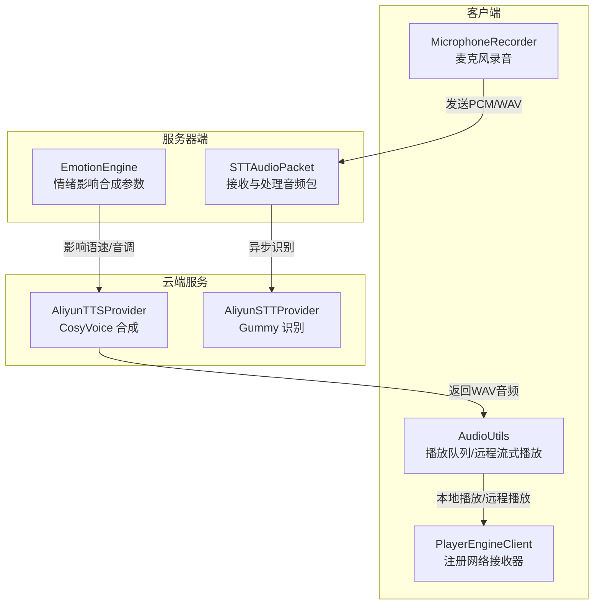
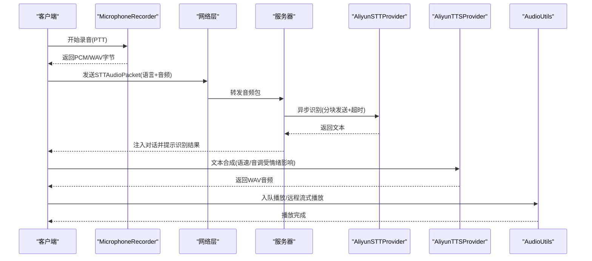
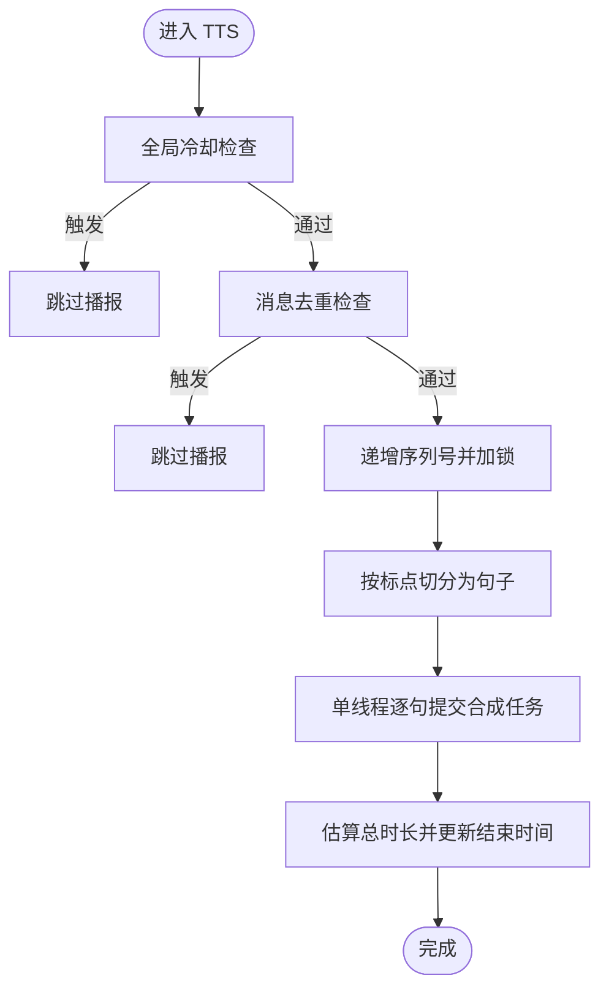
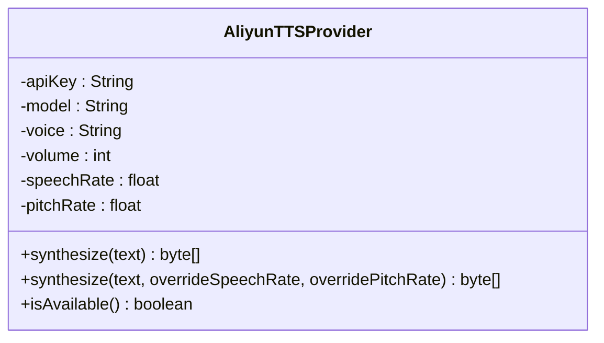
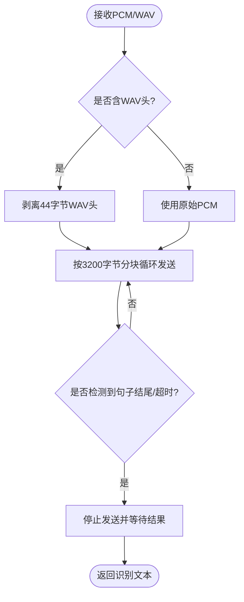
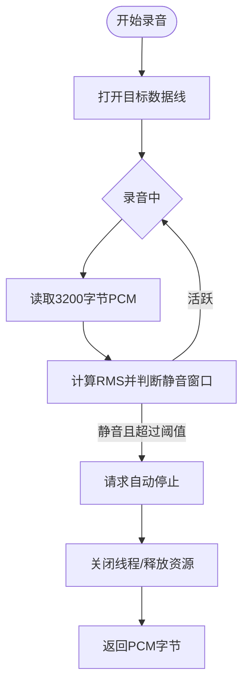
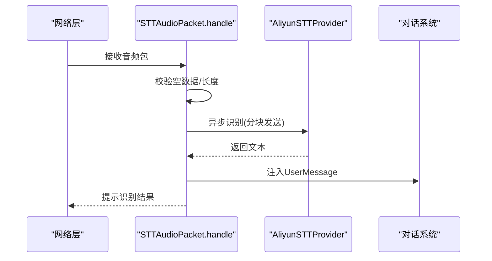
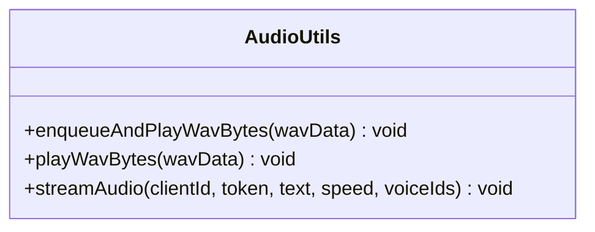
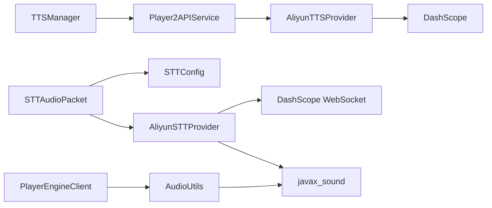

# 语音处理服务

<cite>
**本文引用的文件**
- [TTSManager.java](file://src/main/java/adris/altoclef/player2api/manager/TTSManager.java)
- [AliyunTTSProvider.java](file://src/main/java/adris/altoclef/player2api/tts/AliyunTTSProvider.java)
- [TTSConfig.java](file://src/main/java/adris/altoclef/player2api/tts/TTSConfig.java)
- [AliyunSTTProvider.java](file://src/main/java/adris/altoclef/player2api/stt/AliyunSTTProvider.java)
- [STTConfig.java](file://src/main/java/adris/altoclef/player2api/stt/STTConfig.java)
- [MicrophoneRecorder.java](file://src/main/java/com/goodbird/player2npc/client/audio/MicrophoneRecorder.java)
- [STTAudioPacket.java](file://src/main/java/com/goodbird/player2npc/network/STTAudioPacket.java)
- [AudioUtils.java](file://src/main/java/adris/altoclef/player2api/utils/AudioUtils.java)
- [playerengine-llm-default.json](file://src/main/resources/playerengine-llm-default.json)
- [PlayerEngineClient.java](file://src/main/java/adris/altoclef/PlayerEngineClient.java)
- [EmotionEngine.java](file://src/main/java/adris/altoclef/player2api/soul/EmotionEngine.java)
- [HTTPUtils.java](file://src/main/java/adris/altoclef/player2api/utils/HTTPUtils.java)
</cite>

## 目录
1. [简介](#简介)
2. [项目结构](#项目结构)
3. [核心组件](#核心组件)
4. [架构总览](#架构总览)
5. [组件详解](#组件详解)
6. [依赖关系分析](#依赖关系分析)
7. [性能与优化](#性能与优化)
8. [故障排查指南](#故障排查指南)
9. [结论](#结论)
10. [附录：配置与示例路径](#附录配置与示例路径)

## 简介
本文件面向“语音处理服务”的技术文档，围绕以下核心模块进行深入解析：
- TTSManager：语音合成调度与去重、序列化流水线控制
- AliyunTTSProvider：阿里云 CosyVoice 语音合成提供者
- TTSConfig：TTS 配置管理与回退机制
- AliyunSTTProvider：阿里云 Gummy 实时语音识别提供者
- STTConfig：STT 配置管理与回退机制
- MicrophoneRecorder：麦克风录音与 VAD 自动停止
- STTAudioPacket：服务器端接收与处理 STT 音频包
- AudioUtils：音频播放队列与远程流式播放
- EmotionEngine：情绪感知对语音合成参数的影响
- HTTPUtils：通用 HTTP 请求封装

文档同时涵盖语音流式传输、音频数据包处理、情绪感知的语音合成参数调节、STT 实时识别与网络传输优化，并提供具体代码示例的路径指引。

## 项目结构
语音处理相关代码主要分布在如下包与文件中：
- player2api/manager：TTSManager
- player2api/tts：AliyunTTSProvider、TTSConfig
- player2api/stt：AliyunSTTProvider、STTConfig
- player2api/utils：AudioUtils、HTTPUtils
- player2api/soul：EmotionEngine
- player2api：Player2APIService（用于远程模式）
- client/audio：MicrophoneRecorder
- network：STTAudioPacket
- resources：playerengine-llm-default.json（配置模板）

图表来源
- [MicrophoneRecorder.java:1-200](file://src/main/java/com/goodbird/player2npc/client/audio/MicrophoneRecorder.java#L1-L200)
- [STTAudioPacket.java:1-134](file://src/main/java/com/goodbird/player2npc/network/STTAudioPacket.java#L1-L134)
- [AliyunTTSProvider.java:1-113](file://src/main/java/adris/altoclef/player2api/tts/AliyunTTSProvider.java#L1-L113)
- [AliyunSTTProvider.java:1-172](file://src/main/java/adris/altoclef/player2api/stt/AliyunSTTProvider.java#L1-L172)
- [AudioUtils.java:1-170](file://src/main/java/adris/altoclef/player2api/utils/AudioUtils.java#L1-L170)
- [PlayerEngineClient.java:36-64](file://src/main/java/adris/altoclef/PlayerEngineClient.java#L36-L64)
- [EmotionEngine.java:1-184](file://src/main/java/adris/altoclef/player2api/soul/EmotionEngine.java#L1-L184)

章节来源
- [TTSManager.java:1-168](file://src/main/java/adris/altoclef/player2api/manager/TTSManager.java#L1-L168)
- [AliyunTTSProvider.java:1-113](file://src/main/java/adris/altoclef/player2api/tts/AliyunTTSProvider.java#L1-L113)
- [TTSConfig.java:1-102](file://src/main/java/adris/altoclef/player2api/tts/TTSConfig.java#L1-L102)
- [AliyunSTTProvider.java:1-172](file://src/main/java/adris/altoclef/player2api/stt/AliyunSTTProvider.java#L1-L172)
- [STTConfig.java:1-78](file://src/main/java/adris/altoclef/player2api/stt/STTConfig.java#L1-L78)
- [MicrophoneRecorder.java:1-200](file://src/main/java/com/goodbird/player2npc/client/audio/MicrophoneRecorder.java#L1-L200)
- [STTAudioPacket.java:1-134](file://src/main/java/com/goodbird/player2npc/network/STTAudioPacket.java#L1-L134)
- [AudioUtils.java:1-170](file://src/main/java/adris/altoclef/player2api/utils/AudioUtils.java#L1-L170)
- [playerengine-llm-default.json:1-89](file://src/main/resources/playerengine-llm-default.json#L1-L89)
- [PlayerEngineClient.java:36-64](file://src/main/java/adris/altoclef/PlayerEngineClient.java#L36-L64)
- [EmotionEngine.java:1-184](file://src/main/java/adris/altoclef/player2api/soul/EmotionEngine.java#L1-L184)
- [HTTPUtils.java:1-88](file://src/main/java/adris/altoclef/player2api/utils/HTTPUtils.java#L1-L88)

## 核心组件
- TTSManager：负责消息去重、序列号控制、句子级流水线与锁释放
- AliyunTTSProvider：基于 DashScope CosyVoice 的同步（非流式）WAV 合成
- TTSConfig：从配置文件读取 TTS 设置，支持回退到 LLM 提供者的 API Key
- AliyunSTTProvider：基于 DashScope Gummy 的实时识别，支持 PCM/WAV 输入
- STTConfig：从配置文件读取 STT 设置，支持回退到 LLM 提供者的 API Key
- MicrophoneRecorder：PTT 录音，16kHz/16bit/Mono，带 VAD 自动停止
- STTAudioPacket：服务器端接收音频包，异步识别并注入对话系统
- AudioUtils：WAV 播放队列与远程流式播放
- EmotionEngine：根据事件调整 NPC 情绪，间接影响语速/音调等合成参数
- HTTPUtils：统一的 HTTP 请求封装与错误处理

章节来源
- [TTSManager.java:35-168](file://src/main/java/adris/altoclef/player2api/manager/TTSManager.java#L35-L168)
- [AliyunTTSProvider.java:19-113](file://src/main/java/adris/altoclef/player2api/tts/AliyunTTSProvider.java#L19-L113)
- [TTSConfig.java:13-102](file://src/main/java/adris/altoclef/player2api/tts/TTSConfig.java#L13-L102)
- [AliyunSTTProvider.java:23-172](file://src/main/java/adris/altoclef/player2api/stt/AliyunSTTProvider.java#L23-L172)
- [STTConfig.java:13-78](file://src/main/java/adris/altoclef/player2api/stt/STTConfig.java#L13-L78)
- [MicrophoneRecorder.java:21-200](file://src/main/java/com/goodbird/player2npc/client/audio/MicrophoneRecorder.java#L21-L200)
- [STTAudioPacket.java:28-134](file://src/main/java/com/goodbird/player2npc/network/STTAudioPacket.java#L28-L134)
- [AudioUtils.java:37-170](file://src/main/java/adris/altoclef/player2api/utils/AudioUtils.java#L37-L170)
- [EmotionEngine.java:11-184](file://src/main/java/adris/altoclef/player2api/soul/EmotionEngine.java#L11-L184)
- [HTTPUtils.java:20-88](file://src/main/java/adris/altoclef/player2api/utils/HTTPUtils.java#L20-L88)

## 架构总览
下图展示了从麦克风录音到云端识别与合成、再到本地播放的整体流程。

图表来源
- [MicrophoneRecorder.java:62-153](file://src/main/java/com/goodbird/player2npc/client/audio/MicrophoneRecorder.java#L62-L153)
- [STTAudioPacket.java:39-121](file://src/main/java/com/goodbird/player2npc/network/STTAudioPacket.java#L39-L121)
- [AliyunSTTProvider.java:47-154](file://src/main/java/adris/altoclef/player2api/stt/AliyunSTTProvider.java#L47-L154)
- [AliyunTTSProvider.java:50-104](file://src/main/java/adris/altoclef/player2api/tts/AliyunTTSProvider.java#L50-L104)
- [AudioUtils.java:49-104](file://src/main/java/adris/altoclef/player2api/utils/AudioUtils.java#L49-L104)

## 组件详解

### TTSManager：语音合成调度与去重
- 功能要点
  - 全局冷却与消息去重，避免重复播报与刷屏
  - 句子级拆分与序列号控制，防止过期任务抢占
  - 单线程串行执行，确保客户端顺序播放、低延迟
  - 基于字符长度估算结束时间，释放锁以允许后续播报
- 关键行为
  - splitIntoSentences：按句号、感叹号、问号等标点切分
  - 当前序列号 currentSequence：丢弃过期任务
  - estimatedEndTime：基于字符数估算播放时长
- 适用场景
  - NPC 对话、任务进度播报、多段落文本的流畅播报

图表来源
- [TTSManager.java:94-153](file://src/main/java/adris/altoclef/player2api/manager/TTSManager.java#L94-L153)

章节来源
- [TTSManager.java:35-168](file://src/main/java/adris/altoclef/player2api/manager/TTSManager.java#L35-L168)

### AliyunTTSProvider：阿里云 CosyVoice 语音合成
- 能力概述
  - 同步（非流式）合成，返回完整 WAV 数据（22050Hz/单声道/16bit）
  - 支持音量、语速、音调参数
  - 文本长度限制与请求清理
- 参数与格式
  - 音频格式：WAV 22050Hz 单声道 16bit
  - 语速/音调：可通过合成方法覆盖
  - 文本上限：超过限制将截断
- 可用性检查
  - 通过 isAvailable 判断 API Key 是否有效

图表来源
- [AliyunTTSProvider.java:19-113](file://src/main/java/adris/altoclef/player2api/tts/AliyunTTSProvider.java#L19-L113)

章节来源
- [AliyunTTSProvider.java:19-113](file://src/main/java/adris/altoclef/player2api/tts/AliyunTTSProvider.java#L19-L113)

### TTSConfig：TTS 配置管理与回退
- 配置来源
  - 读取 playerengine-llm.json 中的 tts 段
  - 若未单独配置 API Key，则回退到 qwen 提供者的 API Key
- 默认值
  - 模型：cosyvoice-v3-flash
  - 语音：longanhuan
  - 音量：50
  - 语速：1.0
  - 音调：1.0
- 工厂方法
  - createProvider：直接创建 AliyunTTSProvider 实例

章节来源
- [TTSConfig.java:13-102](file://src/main/java/adris/altoclef/player2api/tts/TTSConfig.java#L13-L102)
- [playerengine-llm-default.json:52-67](file://src/main/resources/playerengine-llm-default.json#L52-L67)

### AliyunSTTProvider：阿里云 Gummy 实时识别
- 能力概述
  - 接收 PCM 或 WAV 音频（16kHz/16bit/单声道）
  - 分块发送（约100ms/块），支持中断与超时
  - 返回最终识别文本，支持部分中间结果日志
- 关键细节
  - WAV 头部剥离：自动识别并去除 44 字节 WAV 头
  - 分块大小：3200 字节（16kHz/16bit/单声道，约100ms）
  - 超时：最多等待 30 秒
- 可用性检查
  - 通过 isAvailable 判断 API Key 是否有效

图表来源
- [AliyunSTTProvider.java:47-154](file://src/main/java/adris/altoclef/player2api/stt/AliyunSTTProvider.java#L47-L154)

章节来源
- [AliyunSTTProvider.java:23-172](file://src/main/java/adris/altoclef/player2api/stt/AliyunSTTProvider.java#L23-L172)

### STTConfig：STT 配置管理与回退
- 配置来源
  - 读取 playerengine-llm.json 中的 stt 段
  - 若未单独配置 API Key，则回退到 qwen 提供者的 API Key
- 默认值
  - 模型：gummy-chat-v1
  - 语言：zh
- 属性访问器
  - isEnabled/getApiKey/getModel/getLanguage

章节来源
- [STTConfig.java:13-78](file://src/main/java/adris/altoclef/player2api/stt/STTConfig.java#L13-L78)
- [playerengine-llm-default.json:69-77](file://src/main/resources/playerengine-llm-default.json#L69-L77)

### MicrophoneRecorder：麦克风录音与 VAD
- 录音格式
  - 16kHz、16bit、单声道、有符号、小端序
- VAD 自动停止
  - 最短录音时间：500ms
  - 连续静音阈值：1200ms
  - RMS 静音阈值：150.0
- 安全上限
  - 最大录音时长：60s
- 输出
  - 返回 PCM 字节数组，供 STT 使用

图表来源
- [MicrophoneRecorder.java:62-153](file://src/main/java/com/goodbird/player2npc/client/audio/MicrophoneRecorder.java#L62-L153)

章节来源
- [MicrophoneRecorder.java:21-200](file://src/main/java/com/goodbird/player2npc/client/audio/MicrophoneRecorder.java#L21-L200)

### STTAudioPacket：服务器端音频包处理
- 包格式
  - UTF 语言（最多16字）、VarInt 音频长度、字节数组
- 校验与拒绝
  - 空数据直接忽略
  - 音频长度小于 32000 字节（约1秒）时拒绝并提示
- 异步处理
  - 在独立线程中加载 STT 配置、校验可用性、执行识别
- 结果注入
  - 识别成功后注入对话系统为用户消息，并在聊天栏提示

图表来源
- [STTAudioPacket.java:39-121](file://src/main/java/com/goodbird/player2npc/network/STTAudioPacket.java#L39-L121)
- [AliyunSTTProvider.java:47-154](file://src/main/java/adris/altoclef/player2api/stt/AliyunSTTProvider.java#L47-L154)

章节来源
- [STTAudioPacket.java:28-134](file://src/main/java/com/goodbird/player2npc/network/STTAudioPacket.java#L28-L134)

### AudioUtils：音频播放与远程流式播放
- WAV 播放队列
  - enqueueAndPlayWavBytes：将多个 WAV 片段排队，串行播放
  - playWavBytes：直接播放 WAV 字节（含 WAV 头）
- 远程流式播放（player2-remote 模式）
  - streamAudio：向 https://api.player2.game 发起流式 TTS 请求并播放

图表来源
- [AudioUtils.java:37-170](file://src/main/java/adris/altoclef/player2api/utils/AudioUtils.java#L37-L170)

章节来源
- [AudioUtils.java:37-170](file://src/main/java/adris/altoclef/player2api/utils/AudioUtils.java#L37-L170)

### EmotionEngine：情绪感知的语音合成参数调节
- 触发类型
  - 玩家赞扬、责备、攻击、送礼、死亡、加入/离开、昼夜更替、天气变化、发现稀有物品、进入危险区域、健康状态、任务完成/失败/取消、遇到新 NPC 等
- 参数影响
  - 情绪强度与主导情感随事件变化
  - 语速与音调参数可被情绪系统覆盖（在 TTSConfig 中体现）
- 日志输出
  - 记录每次情绪更新及主导情感强度

章节来源
- [EmotionEngine.java:11-184](file://src/main/java/adris/altoclef/player2api/soul/EmotionEngine.java#L11-L184)
- [playerengine-llm-default.json:63-66](file://src/main/resources/playerengine-llm-default.json#L63-L66)

### PlayerEngineClient：网络接收器注册
- 注册两个全局接收器
  - tts_audio：接收云端合成的 WAV 音频，入队播放
  - stream_tts：player2-remote 模式的远程流式播放入口

章节来源
- [PlayerEngineClient.java:36-64](file://src/main/java/adris/altoclef/PlayerEngineClient.java#L36-L64)

### HTTPUtils：通用 HTTP 请求封装
- 能力
  - 统一的 GET/POST 请求、响应解析、错误抛出
  - 支持自定义请求头
- 错误处理
  - HTTP 4xx 抛出 HttpApiException
  - 其他非 200 响应抛出 IOException

章节来源
- [HTTPUtils.java:20-88](file://src/main/java/adris/altoclef/player2api/utils/HTTPUtils.java#L20-L88)

## 依赖关系分析
- 组件耦合
  - TTSManager 依赖 Player2APIService 的 textToSpeech 回调（在外部实现中）
  - AliyunTTSProvider 依赖 DashScope SDK
  - STTAudioPacket 依赖 STTConfig/AliyunSTTProvider
  - AudioUtils 与客户端网络接收器配合
- 外部依赖
  - DashScope WebSocket 基础地址在静态初始化中设置
  - javax.sound.sampled 用于本地音频播放

图表来源
- [TTSManager.java:94-153](file://src/main/java/adris/altoclef/player2api/manager/TTSManager.java#L94-L153)
- [AliyunTTSProvider.java:29-32](file://src/main/java/adris/altoclef/player2api/tts/AliyunTTSProvider.java#L29-L32)
- [STTAudioPacket.java:66-93](file://src/main/java/com/goodbird/player2npc/network/STTAudioPacket.java#L66-L93)
- [PlayerEngineClient.java:36-64](file://src/main/java/adris/altoclef/PlayerEngineClient.java#L36-L64)
- [AudioUtils.java:76-104](file://src/main/java/adris/altoclef/player2api/utils/AudioUtils.java#L76-L104)

章节来源
- [TTSManager.java:35-168](file://src/main/java/adris/altoclef/player2api/manager/TTSManager.java#L35-L168)
- [AliyunTTSProvider.java:19-113](file://src/main/java/adris/altoclef/player2api/tts/AliyunTTSProvider.java#L19-L113)
- [STTAudioPacket.java:28-134](file://src/main/java/com/goodbird/player2npc/network/STTAudioPacket.java#L28-L134)
- [PlayerEngineClient.java:36-64](file://src/main/java/adris/altoclef/PlayerEngineClient.java#L36-L64)
- [AudioUtils.java:37-170](file://src/main/java/adris/altoclef/player2api/utils/AudioUtils.java#L37-L170)

## 性能与优化
- 流式传输与分块发送
  - STT 分块大小 3200 字节，约 100ms，兼顾实时性与网络开销
  - 速率限制：每块间 sleep 20ms，避免 CPU 过载
- 播放队列与串行播放
  - AudioUtils 使用队列串行播放，避免重叠与撕裂
  - sentence-level pipeline：TTSManager 将长文本按句拆分，逐句合成与播放
- 去重与冷却
  - TTSManager 的全局冷却与去重，防止刷屏与资源浪费
- 静音检测与安全上限
  - MicrophoneRecorder 的 VAD 防止无效音频上传
  - 最大录音时长限制，避免内存与网络压力
- 配置回退
  - TTSConfig/STTConfig 支持从 LLM 提供者回退 API Key，减少重复配置

[本节为通用性能建议，不直接分析特定文件]

## 故障排查指南
- STT 识别失败
  - 检查音频长度是否小于 32000 字节（约 1 秒）
  - 确认 API Key 配置正确且未以 sk-your- 开头
  - 查看日志中的识别错误信息
- TTS 合成失败
  - 检查文本是否为空或过长（超过 10000 字符会被截断）
  - 确认 DashScope WebSocket 地址已正确设置
- 播放异常
  - WAV 播放失败通常与音频格式或设备权限有关
  - 远程流式播放需确保网络可达与鉴权头正确
- 配置问题
  - 确认 playerengine-llm.json 中 tts/stt 段存在且字段完整
  - 若未单独配置 API Key，确认 qwen 提供者已正确填写

章节来源
- [STTAudioPacket.java:56-121](file://src/main/java/com/goodbird/player2npc/network/STTAudioPacket.java#L56-L121)
- [AliyunSTTProvider.java:47-154](file://src/main/java/adris/altoclef/player2api/stt/AliyunSTTProvider.java#L47-L154)
- [AliyunTTSProvider.java:50-104](file://src/main/java/adris/altoclef/player2api/tts/AliyunTTSProvider.java#L50-L104)
- [AudioUtils.java:76-104](file://src/main/java/adris/altoclef/player2api/utils/AudioUtils.java#L76-L104)
- [playerengine-llm-default.json:52-77](file://src/main/resources/playerengine-llm-default.json#L52-L77)

## 结论
该语音处理服务以清晰的职责划分实现了从录音、识别、合成到播放的完整链路。通过 TTSManager 的去重与流水线控制、AliyunTTSProvider 的高质量 CosyVoice 合成、STTAudioPacket 的异步识别与注入，以及 MicrophoneRecorder 的 VAD 优化，系统在保证实时性的同时具备良好的稳定性与可扩展性。结合 EmotionEngine 的情绪感知，语音合成参数可动态调整，进一步提升 NPC 表达的真实感与沉浸感。

[本节为总结性内容，不直接分析特定文件]

## 附录：配置与示例路径
- 配置文件位置与字段
  - [playerengine-llm-default.json:52-87](file://src/main/resources/playerengine-llm-default.json#L52-L87)
- TTS 合成示例（路径）
  - [AliyunTTSProvider.synthesize(...):50-104](file://src/main/java/adris/altoclef/player2api/tts/AliyunTTSProvider.java#L50-L104)
- STT 识别示例（路径）
  - [AliyunSTTProvider.transcribe(...):47-154](file://src/main/java/adris/altoclef/player2api/stt/AliyunSTTProvider.java#L47-L154)
- 录音与 VAD 示例（路径）
  - [MicrophoneRecorder.startRecording()/stopRecording():62-153](file://src/main/java/com/goodbird/player2npc/client/audio/MicrophoneRecorder.java#L62-L153)
- 播放队列与远程流式播放（路径）
  - [AudioUtils.enqueueAndPlayWavBytes(...):49-67](file://src/main/java/adris/altoclef/player2api/utils/AudioUtils.java#L49-L67)
  - [AudioUtils.streamAudio(...):110-168](file://src/main/java/adris/altoclef/player2api/utils/AudioUtils.java#L110-L168)
- 情绪影响合成参数（路径）
  - [EmotionEngine.applyTrigger(...):17-171](file://src/main/java/adris/altoclef/player2api/soul/EmotionEngine.java#L17-L171)
- HTTP 请求封装（路径）
  - [HTTPUtils.sendRequest(...):23-55](file://src/main/java/adris/altoclef/player2api/utils/HTTPUtils.java#L23-L55)