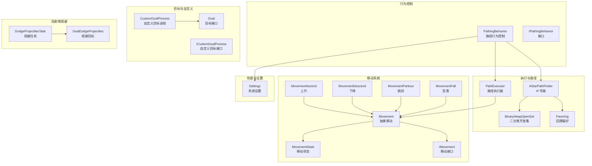
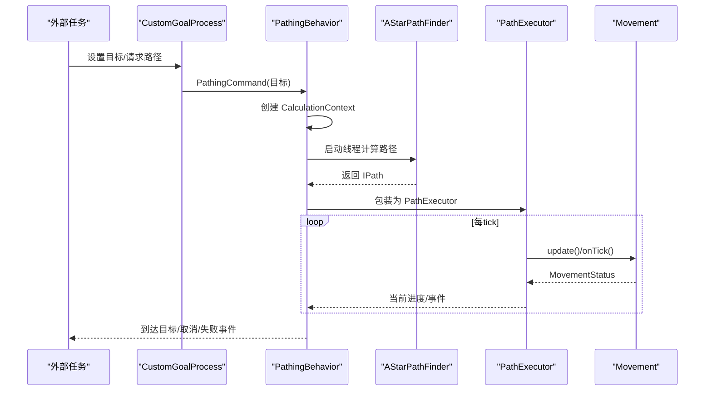
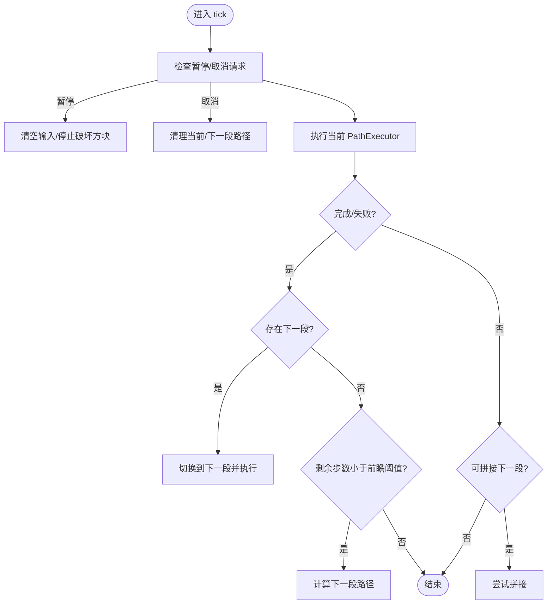
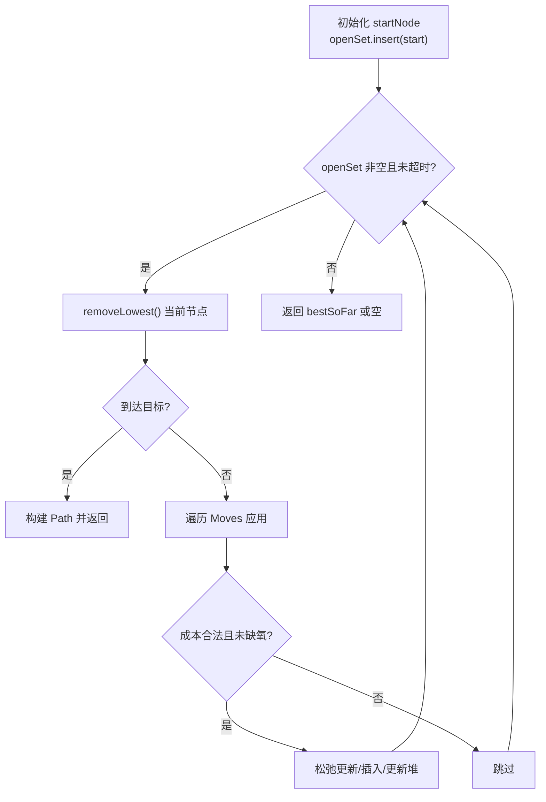
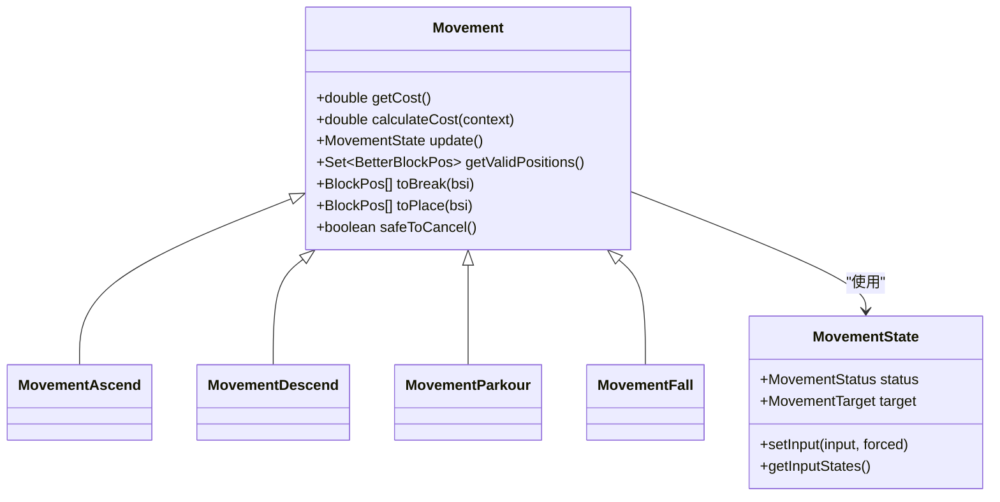
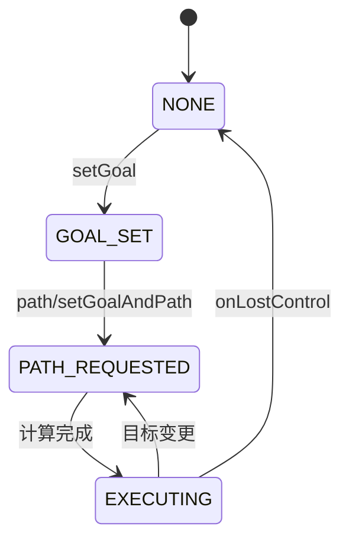
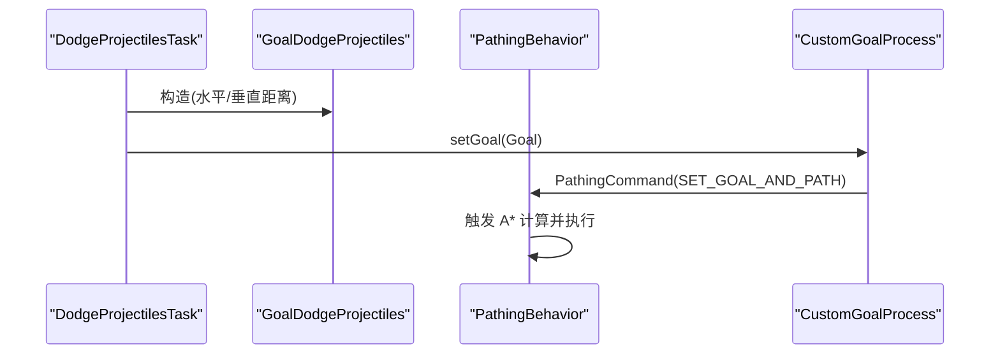
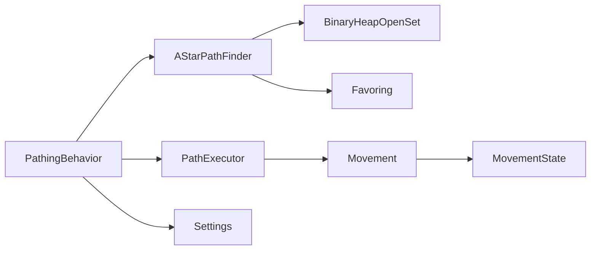

# 路径行为系统

<cite>
**本文引用的文件**
- [PathingBehavior.java](file://src/main/java/baritone/behavior/PathingBehavior.java)
- [IPathingBehavior.java](file://src/main/java/baritone/api/behavior/IPathingBehavior.java)
- [PathExecutor.java](file://src/main/java/baritone/pathing/path/PathExecutor.java)
- [AStarPathFinder.java](file://src/main/java/baritone/pathing/calc/AStarPathFinder.java)
- [BinaryHeapOpenSet.java](file://src/main/java/baritone/pathing/calc/openset/BinaryHeapOpenSet.java)
- [Movement.java](file://src/main/java/baritone/pathing/movement/Movement.java)
- [MovementState.java](file://src/main/java/baritone/pathing/movement/MovementState.java)
- [IMovement.java](file://src/main/java/baritone/api/pathing/movement/IMovement.java)
- [Goal.java](file://src/main/java/baritone/api/pathing/goals/Goal.java)
- [CustomGoalProcess.java](file://src/main/java/baritone/process/CustomGoalProcess.java)
- [ICustomGoalProcess.java](file://src/main/java/baritone/api/process/ICustomGoalProcess.java)
- [MovementAscend.java](file://src/main/java/baritone/pathing/movement/movements/MovementAscend.java)
- [MovementDescend.java](file://src/main/java/baritone/pathing/movement/movements/MovementDescend.java)
- [MovementParkour.java](file://src/main/java/baritone/pathing/movement/movements/MovementParkour.java)
- [MovementFall.java](file://src/main/java/baritone/pathing/movement/movements/MovementFall.java)
- [Favoring.java](file://src/main/java/baritone/utils/pathing/Favoring.java)
- [Settings.java](file://src/main/java/baritone/api/Settings.java)
- [DodgeProjectilesTask.java](file://src/main/java/adris/altoclef/tasks/movement/DodgeProjectilesTask.java)
- [GoalDodgeProjectiles.java](file://src/main/java/adris/altoclef/util/baritone/GoalDodgeProjectiles.java)
- [Baritone.java](file://src/main/java/baritone/Baritone.java)
</cite>

## 目录
1. [简介](#简介)
2. [项目结构](#项目结构)
3. [核心组件](#核心组件)
4. [架构总览](#架构总览)
5. [详细组件分析](#详细组件分析)
6. [依赖分析](#依赖分析)
7. [性能考量](#性能考量)
8. [故障排查指南](#故障排查指南)
9. [结论](#结论)
10. [附录：实践示例与最佳实践](#附录实践示例与最佳实践)

## 简介
本技术文档围绕路径行为系统展开，系统以 Baritone 核心引擎为基础，聚焦以下关键能力：
- PathingBehavior 路径行为控制：负责路径规划生命周期管理、分段路径拼接、事件派发与取消策略。
- A* 寻路算法实现：基于启发式搜索与优先队列，结合回溯偏好与世界边界约束，提供高效路径生成。
- Movement 移动类型系统：抽象出 Movement 接口及多种具体移动（上升、下降、横移、跳跃等），统一输入与状态机。
- CustomGoalProcess 自定义目标处理：允许外部任务动态设置目标并触发路径计算。
- 路径计算优化与避障：通过回溯偏好、最小改进再传播、空区块边界限制等策略提升性能与稳定性。
- 避障与状态转换：在执行器中对偏移路径、超时、阻断进行检测与恢复；Movement 层面实现安全取消与输入覆盖。
- Goal 组合逻辑与 Projectile 躲避策略：通过 Goal 接口扩展组合目标，结合任务层实现箭矢等投射物规避。

## 项目结构
路径行为系统主要分布在以下包与类中：
- 行为控制：behavior.PathingBehavior、api.behavior.IPathingBehavior
- 执行器：pathing.path.PathExecutor
- 寻路：pathing.calc.AStarPathFinder、calc.openset.BinaryHeapOpenSet
- 移动系统：pathing.movement.* 及其具体实现 movments.*
- 目标接口：api.pathing.goals.Goal
- 自定义目标：process.CustomGoalProcess、api.process.ICustomGoalProcess
- 性能与偏好：utils.pathing.Favoring、api.Settings
- 投射物规避：tasks.movement.DodgeProjectilesTask、util.baritone.GoalDodgeProjectiles

**图表来源**
- [PathingBehavior.java:29-526](file://src/main/java/baritone/behavior/PathingBehavior.java#L29-L526)
- [PathExecutor.java:38-477](file://src/main/java/baritone/pathing/path/PathExecutor.java#L38-L477)
- [AStarPathFinder.java:16-168](file://src/main/java/baritone/pathing/calc/AStarPathFinder.java#L16-L168)
- [BinaryHeapOpenSet.java:6-104](file://src/main/java/baritone/pathing/calc/openset/BinaryHeapOpenSet.java#L6-L104)
- [Movement.java:25-276](file://src/main/java/baritone/pathing/movement/Movement.java#L25-L276)
- [MovementState.java:10-63](file://src/main/java/baritone/pathing/movement/MovementState.java#L10-L63)
- [IMovement.java:6-24](file://src/main/java/baritone/api/pathing/movement/IMovement.java#L6-L24)
- [Goal.java:5-22](file://src/main/java/baritone/api/pathing/goals/Goal.java#L5-L22)
- [CustomGoalProcess.java:11-97](file://src/main/java/baritone/process/CustomGoalProcess.java#L11-L97)
- [ICustomGoalProcess.java:5-16](file://src/main/java/baritone/api/process/ICustomGoalProcess.java#L5-L16)
- [Favoring.java:10-39](file://src/main/java/baritone/utils/pathing/Favoring.java#L10-L39)
- [Settings.java:96-125](file://src/main/java/baritone/api/Settings.java#L96-L125)
- [DodgeProjectilesTask.java:8-44](file://src/main/java/adris/altoclef/tasks/movement/DodgeProjectilesTask.java#L8-L44)
- [GoalDodgeProjectiles.java:12-27](file://src/main/java/adris/altoclef/util/baritone/GoalDodgeProjectiles.java#L12-L27)

**章节来源**
- [PathingBehavior.java:29-526](file://src/main/java/baritone/behavior/PathingBehavior.java#L29-L526)
- [AStarPathFinder.java:16-168](file://src/main/java/baritone/pathing/calc/AStarPathFinder.java#L16-L168)

## 核心组件
- PathingBehavior：路径行为控制中枢，协调目标设定、路径计算线程、当前/下一段路径执行、事件派发与取消策略。
- PathExecutor：单段路径执行器，负责每一步 Movement 的状态推进、偏移路径检测、超时与阻断处理。
- AStarPathFinder：A* 启发式搜索实现，使用二叉堆开放集，支持回溯偏好、最小改进再传播与空区块边界限制。
- Movement/MovementState：移动抽象与状态机，统一输入覆盖、旋转目标、安全取消与缓存。
- Goal/CustomGoalProcess：目标接口与自定义目标进程，支持外部任务设置目标并触发路径。
- Favoring/Settings：路径偏好与性能参数，如回溯成本系数、最小改进阈值、超时与计划前瞻等。

**章节来源**
- [IPathingBehavior.java:11-53](file://src/main/java/baritone/api/behavior/IPathingBehavior.java#L11-L53)
- [PathingBehavior.java:29-526](file://src/main/java/baritone/behavior/PathingBehavior.java#L29-L526)
- [PathExecutor.java:38-477](file://src/main/java/baritone/pathing/path/PathExecutor.java#L38-L477)
- [AStarPathFinder.java:16-168](file://src/main/java/baritone/pathing/calc/AStarPathFinder.java#L16-L168)
- [Movement.java:25-276](file://src/main/java/baritone/pathing/movement/Movement.java#L25-L276)
- [MovementState.java:10-63](file://src/main/java/baritone/pathing/movement/MovementState.java#L10-L63)
- [Goal.java:5-22](file://src/main/java/baritone/api/pathing/goals/Goal.java#L5-L22)
- [CustomGoalProcess.java:11-97](file://src/main/java/baritone/process/CustomGoalProcess.java#L11-L97)

## 架构总览
路径行为系统的运行流程如下：
- 外部任务通过 CustomGoalProcess 设置 Goal 并请求路径。
- PathingBehavior 在独立线程中启动 AStarPathFinder 计算路径，返回 PathExecutor。
- PathExecutor 按步驱动 Movement，更新 MovementState，处理旋转与输入覆盖。
- 执行过程中检测偏移路径、超时与阻断，必要时取消或提前拼接下一段路径。
- PathingBehavior 协调当前/下一段路径、事件派发与性能参数。

**图表来源**
- [CustomGoalProcess.java:19-78](file://src/main/java/baritone/process/CustomGoalProcess.java#L19-L78)
- [PathingBehavior.java:404-502](file://src/main/java/baritone/behavior/PathingBehavior.java#L404-L502)
- [AStarPathFinder.java:26-166](file://src/main/java/baritone/pathing/calc/AStarPathFinder.java#L26-L166)
- [PathExecutor.java:68-224](file://src/main/java/baritone/pathing/path/PathExecutor.java#L68-L224)
- [Movement.java:96-124](file://src/main/java/baritone/pathing/movement/Movement.java#L96-L124)

## 详细组件分析

### PathingBehavior 路径行为控制
- 生命周期管理：接收 PathingCommand，创建 CalculationContext，启动路径计算线程，维护当前/下一段路径。
- 分段路径拼接：在当前路径结束时尝试拼接下一段，若接近目标则提前规划下一段。
- 事件派发：通过 LinkedBlockingQueue 收集 PathEvent，在合适时机派发至 GameEventHandler。
- 取消与暂停：提供软取消、强制取消、安全取消判断，确保 Movement 安全取消。

**图表来源**
- [PathingBehavior.java:81-193](file://src/main/java/baritone/behavior/PathingBehavior.java#L81-L193)

**章节来源**
- [PathingBehavior.java:29-526](file://src/main/java/baritone/behavior/PathingBehavior.java#L29-L526)
- [IPathingBehavior.java:11-53](file://src/main/java/baritone/api/behavior/IPathingBehavior.java#L11-L53)

### A* 寻路算法实现
- 启发式搜索：使用 estimatedCostToGoal + cost 作为 combinedCost，二叉堆按 combinedCost 排序。
- 回溯偏好：Favoring 对先前路径节点施加成本系数，鼓励回溯以减少重复探索。
- 最小改进再传播：当新启发式显著改善时才更新 bestSoFar，降低无效重算。
- 边界与空区块：受世界边界与已加载区块限制，避免无效扩展；支持动态 XZ/动态 Y 移动。

**图表来源**
- [AStarPathFinder.java:26-166](file://src/main/java/baritone/pathing/calc/AStarPathFinder.java#L26-L166)
- [BinaryHeapOpenSet.java:23-102](file://src/main/java/baritone/pathing/calc/openset/BinaryHeapOpenSet.java#L23-L102)
- [Favoring.java:10-39](file://src/main/java/baritone/utils/pathing/Favoring.java#L10-L39)

**章节来源**
- [AStarPathFinder.java:16-168](file://src/main/java/baritone/pathing/calc/AStarPathFinder.java#L16-L168)
- [BinaryHeapOpenSet.java:6-104](file://src/main/java/baritone/pathing/calc/openset/BinaryHeapOpenSet.java#L6-L104)
- [Favoring.java:10-39](file://src/main/java/baritone/utils/pathing/Favoring.java#L10-L39)

### Movement 移动类型系统
- Movement 抽象：统一 src/dest、有效位置集合、挖掘/放置/行走列表缓存、成本计算与重算。
- MovementState：封装 MovementStatus、旋转目标与输入状态，支持强制旋转与输入覆盖。
- 具体移动：
  - MovementAscend：上升移动，处理放置底板、挖掘阻碍、跳跃时机与安全取消。
  - MovementDescend：下降移动，处理前排挖掘、动态坠落成本、水/桶保护与安全模式。
  - MovementParkour：跳跃移动，计算不同距离的成本与有效位置集合。
  - MovementFall：坠落移动，处理水/非水落地、桶保护与氧气消耗。

**图表来源**
- [Movement.java:25-276](file://src/main/java/baritone/pathing/movement/Movement.java#L25-L276)
- [MovementState.java:10-63](file://src/main/java/baritone/pathing/movement/MovementState.java#L10-L63)
- [MovementAscend.java:24-263](file://src/main/java/baritone/pathing/movement/movements/MovementAscend.java#L24-L263)
- [MovementDescend.java:28-272](file://src/main/java/baritone/pathing/movement/movements/MovementDescend.java#L28-L272)
- [MovementParkour.java:161-201](file://src/main/java/baritone/pathing/movement/movements/MovementParkour.java#L161-L201)
- [MovementFall.java:30-33](file://src/main/java/baritone/pathing/movement/movements/MovementFall.java#L30-L33)

**章节来源**
- [Movement.java:25-276](file://src/main/java/baritone/pathing/movement/Movement.java#L25-L276)
- [MovementState.java:10-63](file://src/main/java/baritone/pathing/movement/MovementState.java#L10-L63)
- [MovementAscend.java:24-263](file://src/main/java/baritone/pathing/movement/movements/MovementAscend.java#L24-L263)
- [MovementDescend.java:28-272](file://src/main/java/baritone/pathing/movement/movements/MovementDescend.java#L28-L272)
- [MovementParkour.java:161-201](file://src/main/java/baritone/pathing/movement/movements/MovementParkour.java#L161-L201)
- [MovementFall.java:30-33](file://src/main/java/baritone/pathing/movement/movements/MovementFall.java#L30-L33)

### CustomGoalProcess 自定义目标处理
- 状态机：NONE → GOAL_SET → PATH_REQUESTED → EXECUTING，根据状态生成 PathingCommand。
- 目标设置：setGoal 更新目标并触发状态转换；path 触发下一次路径请求。
- 进程激活：isActive 返回是否处于非 NONE 状态。

**图表来源**
- [CustomGoalProcess.java:91-97](file://src/main/java/baritone/process/CustomGoalProcess.java#L91-L97)
- [ICustomGoalProcess.java:5-16](file://src/main/java/baritone/api/process/ICustomGoalProcess.java#L5-L16)

**章节来源**
- [CustomGoalProcess.java:11-97](file://src/main/java/baritone/process/CustomGoalProcess.java#L11-L97)
- [ICustomGoalProcess.java:5-16](file://src/main/java/baritone/api/process/ICustomGoalProcess.java#L5-L16)

### Goal 组合逻辑与 Projectile 躲避策略
- Goal 接口：isInGoal/heuristic 提供目标判定与启发式评估。
- 组合目标：可通过 Goal 实现组合/复合目标（例如距离缩放、多目标择优）。
- 投射物规避：GoalDodgeProjectiles 基于玩家与投射物相对位置生成规避目标；DodgeProjectilesTask 将其注入路径行为。

**图表来源**
- [DodgeProjectilesTask.java:8-44](file://src/main/java/adris/altoclef/tasks/movement/DodgeProjectilesTask.java#L8-L44)
- [GoalDodgeProjectiles.java:12-27](file://src/main/java/adris/altoclef/util/baritone/GoalDodgeProjectiles.java#L12-L27)
- [CustomGoalProcess.java:19-78](file://src/main/java/baritone/process/CustomGoalProcess.java#L19-L78)

**章节来源**
- [Goal.java:5-22](file://src/main/java/baritone/api/pathing/goals/Goal.java#L5-L22)
- [DodgeProjectilesTask.java:8-44](file://src/main/java/adris/altoclef/tasks/movement/DodgeProjectilesTask.java#L8-L44)
- [GoalDodgeProjectiles.java:12-27](file://src/main/java/adris/altoclef/util/baritone/GoalDodgeProjectiles.java#L12-L27)

## 依赖分析
- PathingBehavior 依赖：
  - PathExecutor：执行当前/下一段路径。
  - AStarPathFinder：计算路径。
  - Favoring：回溯偏好。
  - Settings：性能与行为参数。
- PathExecutor 依赖：
  - Movement：逐步驱动。
  - MovementHelper：碰撞/可走性/工具切换等辅助。
- Movement 依赖：
  - MovementState：状态与输入。
  - BlockStateInterface：实时方块状态。
- A* 寻路依赖：
  - BinaryHeapOpenSet：优先队列。
  - Favoring：成本权重。
  - Moves：所有可能移动。

**图表来源**
- [PathingBehavior.java:404-502](file://src/main/java/baritone/behavior/PathingBehavior.java#L404-L502)
- [AStarPathFinder.java:16-168](file://src/main/java/baritone/pathing/calc/AStarPathFinder.java#L16-L168)
- [BinaryHeapOpenSet.java:6-104](file://src/main/java/baritone/pathing/calc/openset/BinaryHeapOpenSet.java#L6-L104)
- [Favoring.java:10-39](file://src/main/java/baritone/utils/pathing/Favoring.java#L10-L39)
- [PathExecutor.java:38-477](file://src/main/java/baritone/pathing/path/PathExecutor.java#L38-L477)
- [Movement.java:25-276](file://src/main/java/baritone/pathing/movement/Movement.java#L25-L276)
- [MovementState.java:10-63](file://src/main/java/baritone/pathing/movement/MovementState.java#L10-L63)
- [Settings.java:96-125](file://src/main/java/baritone/api/Settings.java#L96-L125)

**章节来源**
- [PathingBehavior.java:29-526](file://src/main/java/baritone/behavior/PathingBehavior.java#L29-L526)
- [AStarPathFinder.java:16-168](file://src/main/java/baritone/pathing/calc/AStarPathFinder.java#L16-L168)

## 性能考量
- 路径计算超时与慢速模式：通过 Settings.primaryTimeoutMS/failureTimeoutMS/slowPath/slowPathTimeoutMS 控制主/失败超时与慢速路径延迟。
- 最小改进再传播：minimumImprovementRepropagation 启用后仅在显著改善时更新启发式，减少无效重算。
- 回溯偏好系数：backtrackCostFavoringCoefficient 对先前路径节点施加成本折扣，加速收敛。
- 空区块边界限制：pathingMaxChunkBorderFetch 限制未加载区块扩展数量，避免无效搜索。
- 计划前瞻：planningTickLookahead 决定何时提前计算下一段路径，平衡延迟与稳定性。
- 执行器超时：movementTimeoutTicks 限制单步最大耗时，防止卡死。
- 开放集容量：BinaryHeapOpenSet 动态扩容，避免频繁扩容带来的额外开销。

**章节来源**
- [Settings.java:96-125](file://src/main/java/baritone/api/Settings.java#L96-L125)
- [AStarPathFinder.java:44-77](file://src/main/java/baritone/pathing/calc/AStarPathFinder.java#L44-L77)
- [PathExecutor.java:205-220](file://src/main/java/baritone/pathing/path/PathExecutor.java#L205-L220)
- [BinaryHeapOpenSet.java:11-33](file://src/main/java/baritone/pathing/calc/openset/BinaryHeapOpenSet.java#L11-L33)

## 故障排查指南
- 路径偏移与丢失：
  - PathExecutor 会检测与路径的最大距离阈值，超过阈值将取消当前路径并重新规划。
  - 若持续偏移，检查 Movement 的有效位置集合与 BlockStateInterface 缓存是否正确。
- 超时与阻断：
  - Movement 层面 safeToCancel 决定是否允许取消；执行器对单步超时进行检测并取消。
  - 检查 movementTimeoutTicks 与 Movement 的 calculateCost 是否合理。
- 目标无法到达：
  - CustomGoalProcess 状态机错误会导致无法执行；确认 setGoal/path 的调用顺序。
  - GoalDodgeProjectiles 的投射物缓存失效可能导致目标不稳定，需定期刷新。
- 寻路失败：
  - A* 在空区块过多或超时情况下返回 bestSoFar；适当增大 planAheadPrimaryTimeoutMS 或减少 pathingMaxChunkBorderFetch。
  - 检查 Favoring 权重是否导致局部震荡。

**章节来源**
- [PathExecutor.java:93-110](file://src/main/java/baritone/pathing/path/PathExecutor.java#L93-L110)
- [Movement.java:171-178](file://src/main/java/baritone/pathing/movement/Movement.java#L171-L178)
- [CustomGoalProcess.java:19-78](file://src/main/java/baritone/process/CustomGoalProcess.java#L19-L78)
- [GoalDodgeProjectiles.java:12-27](file://src/main/java/adris/altoclef/util/baritone/GoalDodgeProjectiles.java#L12-L27)
- [AStarPathFinder.java:150-166](file://src/main/java/baritone/pathing/calc/AStarPathFinder.java#L150-L166)

## 结论
路径行为系统通过 PathingBehavior 的统一调度、A* 寻路的高效探索、Movement 的细粒度控制与 CustomGoalProcess 的灵活接入，实现了稳定而高效的路径执行。配合回溯偏好、最小改进再传播与前瞻规划等优化策略，系统在复杂地形与动态环境中仍能保持良好性能与鲁棒性。对于投射物规避等高级需求，可通过 Goal 与任务层扩展实现。

## 附录：实践示例与最佳实践
- 实现自定义 Movement 类型
  - 继承 Movement，实现 calculateCost 与 calculateValidPositions，并在 updateState 中处理输入与旋转。
  - 示例参考：[MovementAscend.java:24-263](file://src/main/java/baritone/pathing/movement/movements/MovementAscend.java#L24-L263)、[MovementDescend.java:28-272](file://src/main/java/baritone/pathing/movement/movements/MovementDescend.java#L28-L272)
- 实现自定义 Goal 组合器
  - 实现 Goal 接口的 isInGoal/heuristic，并在任务层通过 CustomGoalProcess 设置目标。
  - 示例参考：[Goal.java:5-22](file://src/main/java/baritone/api/pathing/goals/Goal.java#L5-L22)、[CustomGoalProcess.java:19-78](file://src/main/java/baritone/process/CustomGoalProcess.java#L19-L78)
- 路径优化技巧
  - 合理设置 backtrackCostFavoringCoefficient 与 minimumImprovementRepropagation，减少无效重算。
  - 使用 planAheadPrimaryTimeoutMS 与 planningTickLookahead 平衡延迟与稳定性。
  - 示例参考：[Settings.java:96-125](file://src/main/java/baritone/api/Settings.java#L96-L125)、[Favoring.java:10-39](file://src/main/java/baritone/utils/pathing/Favoring.java#L10-L39)
- 性能调优方法
  - 在高负载场景启用 slowPath 并调整 slowPathTimeoutMS；监控 nodes per second 输出。
  - 适当增大 pathingMaxChunkBorderFetch 以减少空区块限制带来的剪枝。
  - 示例参考：[AStarPathFinder.java:44-77](file://src/main/java/baritone/pathing/calc/AStarPathFinder.java#L44-L77)
- Projectile 躲避策略
  - 使用 DodgeProjectilesTask 与 GoalDodgeProjectiles 动态生成规避目标。
  - 示例参考：[DodgeProjectilesTask.java:8-44](file://src/main/java/adris/altoclef/tasks/movement/DodgeProjectilesTask.java#L8-L44)、[GoalDodgeProjectiles.java:12-27](file://src/main/java/adris/altoclef/util/baritone/GoalDodgeProjectiles.java#L12-L27)

**章节来源**
- [Movement.java:25-276](file://src/main/java/baritone/pathing/movement/Movement.java#L25-L276)
- [Goal.java:5-22](file://src/main/java/baritone/api/pathing/goals/Goal.java#L5-L22)
- [CustomGoalProcess.java:19-78](file://src/main/java/baritone/process/CustomGoalProcess.java#L19-L78)
- [Settings.java:96-125](file://src/main/java/baritone/api/Settings.java#L96-L125)
- [AStarPathFinder.java:44-77](file://src/main/java/baritone/pathing/calc/AStarPathFinder.java#L44-L77)
- [DodgeProjectilesTask.java:8-44](file://src/main/java/adris/altoclef/tasks/movement/DodgeProjectilesTask.java#L8-L44)
- [GoalDodgeProjectiles.java:12-27](file://src/main/java/adris/altoclef/util/baritone/GoalDodgeProjectiles.java#L12-L27)