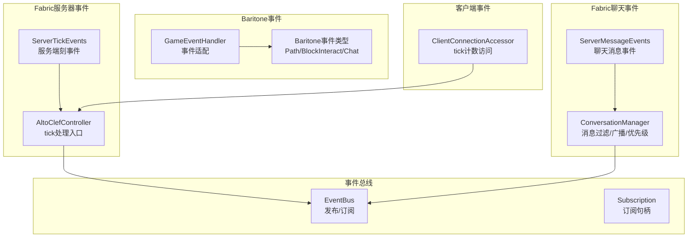
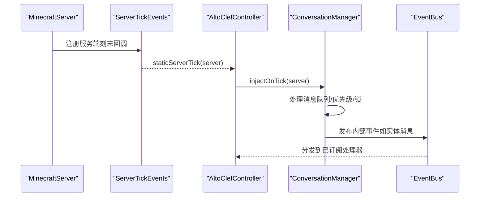
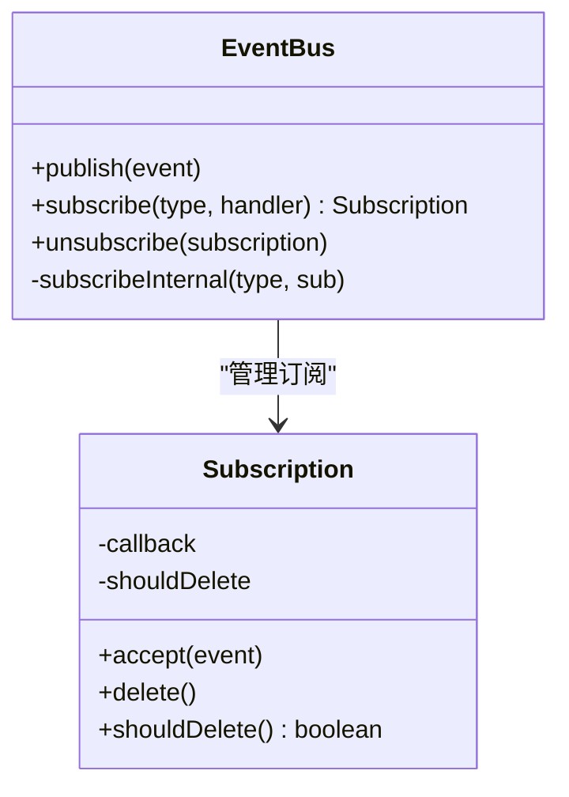
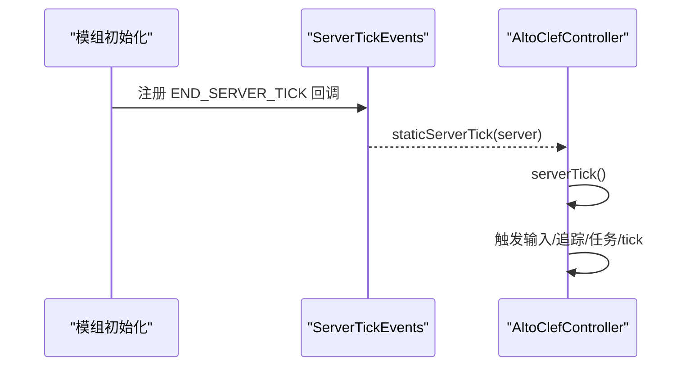
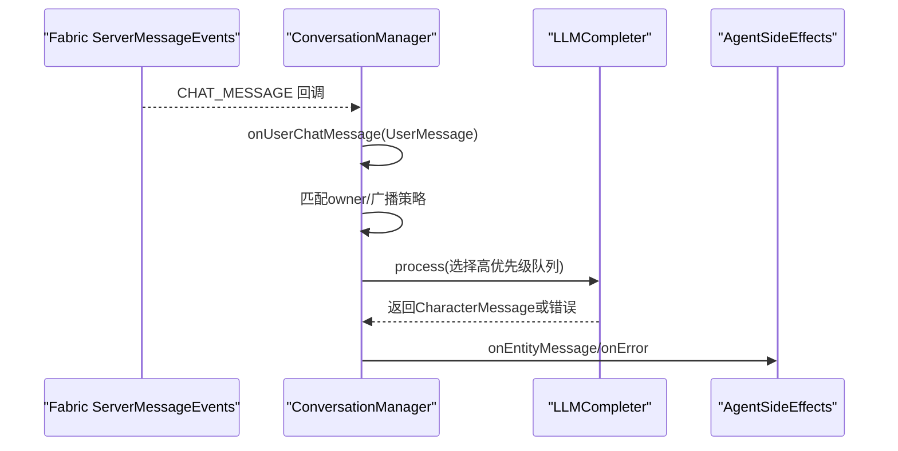
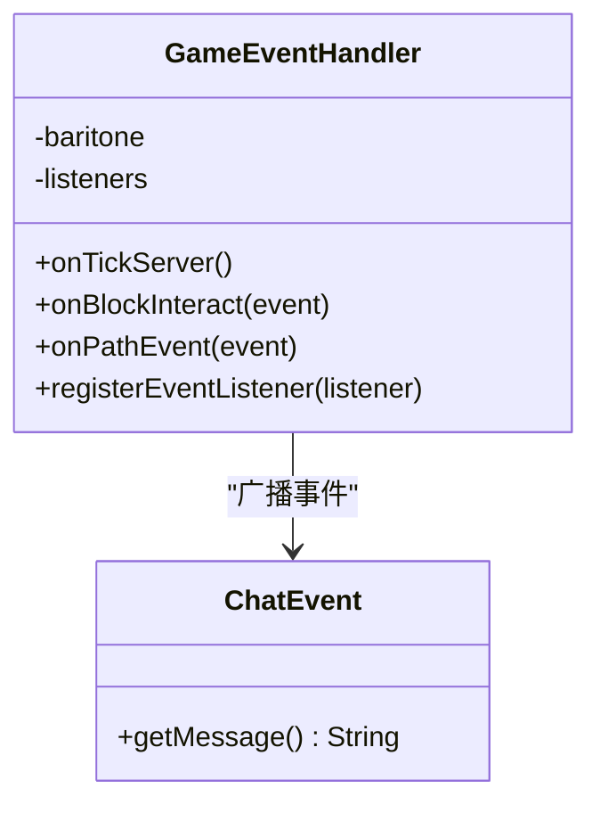
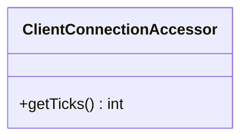
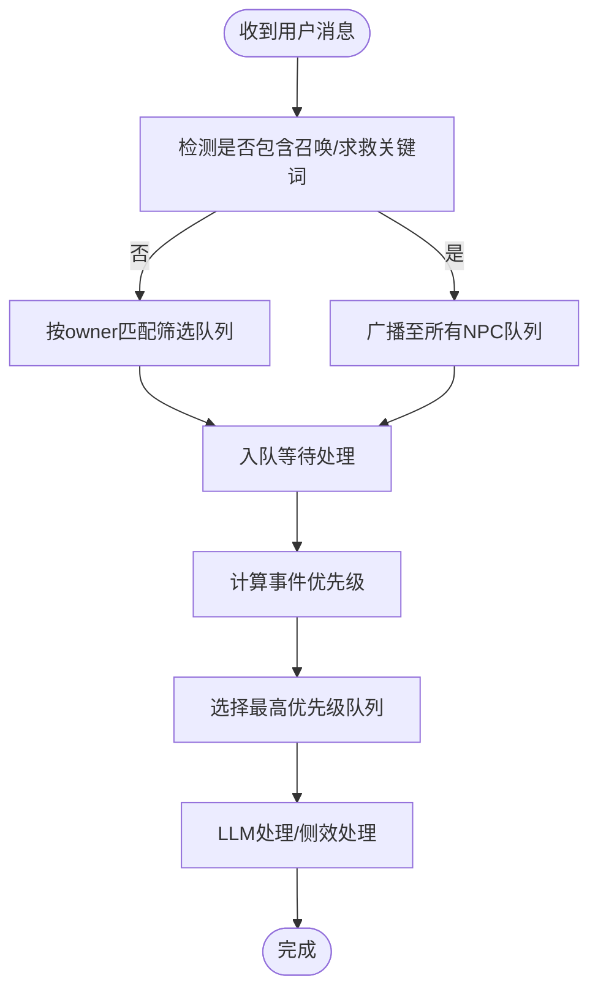
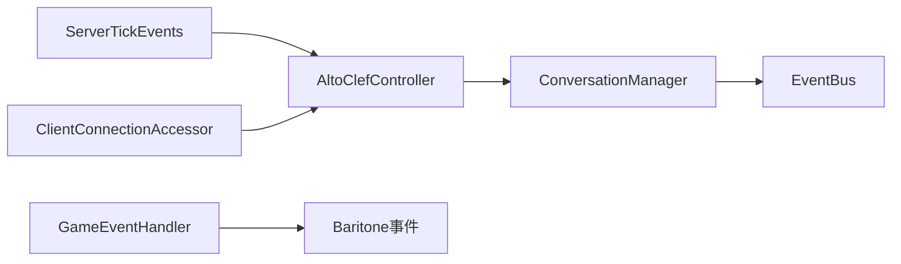

# Fabric事件监听机制

<cite>
**本文档引用的文件**
- [EventBus.java](file://src/main/java/adris/altoclef/eventbus/EventBus.java)
- [Subscription.java](file://src/main/java/adris/altoclef/eventbus/Subscription.java)
- [BlockBreakingEvent.java](file://src/main/java/adris/altoclef/eventbus/events/BlockBreakingEvent.java)
- [BlockPlaceEvent.java](file://src/main/java/adris/altoclef/eventbus/events/BlockPlaceEvent.java)
- [EntityDeathEvent.java](file://src/main/java/adris/altoclef/eventbus/events/EntityDeathEvent.java)
- [AltoClefController.java](file://src/main/java/adris/altoclef/AltoClefController.java)
- [ConversationManager.java](file://src/main/java/adris/altoclef/player2api/manager/ConversationManager.java)
- [GameEventHandler.java](file://src/main/java/baritone/event/GameEventHandler.java)
- [ChatEvent.java](file://src/main/java/baritone/api/event/events/ChatEvent.java)
- [ClientConnectionAccessor.java](file://src/main/java/adris/altoclef/mixins/ClientConnectionAccessor.java)
</cite>

## 目录
1. [简介](#简介)
2. [项目结构](#项目结构)
3. [核心组件](#核心组件)
4. [架构总览](#架构总览)
5. [详细组件分析](#详细组件分析)
6. [依赖关系分析](#依赖关系分析)
7. [性能考虑](#性能考虑)
8. [故障排除指南](#故障排除指南)
9. [结论](#结论)

## 简介
本文件系统性阐述本项目中的Fabric事件监听机制，覆盖以下方面：
- 服务器事件监听：通过Fabric生命周期事件在服务端刻末尾触发统一的tick处理流程
- 聊天消息事件：基于Fabric聊天事件与AI对话管理器的集成，支持消息过滤、优先级与广播策略
- 客户端事件处理：通过Mixin访问网络层tick计数，辅助客户端状态同步
- Baritone事件集成：通过Baritone事件总线与自定义事件适配，实现路径、交互等事件的分发
- 事件注册方式、处理器实现、异步事件处理、事件优先级管理
- 事件过滤机制、错误处理策略、性能监控等高级特性
- 提供可直接定位到源码位置的示例路径，便于开发者快速实现事件监听器

## 项目结构
围绕事件系统的关键模块分布如下：
- 自研事件总线：轻量级发布/订阅实现，支持运行时订阅、延迟订阅与删除标记
- Fabric服务器事件：在服务端刻末注册tick回调，驱动AI与任务系统
- Fabric聊天事件：捕获玩家聊天消息，进入AI对话队列与优先级调度
- Baritone事件：封装其事件总线，向监听者广播路径与交互事件
- Mixin辅助：访问客户端连接tick计数，用于客户端状态跟踪

图表来源
- [AltoClefController.java:151-157](file://src/main/java/adris/altoclef/AltoClefController.java#L151-L157)
- [ConversationManager.java:63-67](file://src/main/java/adris/altoclef/player2api/manager/ConversationManager.java#L63-L67)
- [GameEventHandler.java:21-41](file://src/main/java/baritone/event/GameEventHandler.java#L21-L41)
- [ClientConnectionAccessor.java:9-10](file://src/main/java/adris/altoclef/mixins/ClientConnectionAccessor.java#L9-L10)

章节来源
- [AltoClefController.java:151-157](file://src/main/java/adris/altoclef/AltoClefController.java#L151-L157)
- [ConversationManager.java:58-69](file://src/main/java/adris/altoclef/player2api/manager/ConversationManager.java#L58-L69)
- [GameEventHandler.java:13-47](file://src/main/java/baritone/event/GameEventHandler.java#L13-L47)
- [ClientConnectionAccessor.java:7-11](file://src/main/java/adris/altoclef/mixins/ClientConnectionAccessor.java#L7-L11)

## 核心组件
- 自研事件总线（EventBus）：提供线程安全的事件发布、订阅与延迟订阅能力；支持订阅删除标记，避免在遍历过程中修改集合
- 订阅句柄（Subscription）：封装回调与删除标记，便于外部取消订阅
- Fabric服务器刻事件（ServerTickEvents）：在服务端刻末尾注册静态回调，统一注入AI与任务tick处理
- Fabric聊天事件（ServerMessageEvents）：注册聊天消息回调，转换为内部UserMessage事件，交由ConversationManager进行过滤与优先级处理
- Baritone事件适配（GameEventHandler）：封装Baritone事件总线，向监听者广播路径事件与交互事件
- 客户端连接tick访问（ClientConnectionAccessor）：通过Mixin访问客户端Connection.tickCount，辅助客户端状态同步

章节来源
- [EventBus.java:9-68](file://src/main/java/adris/altoclef/eventbus/EventBus.java#L9-L68)
- [Subscription.java:5-24](file://src/main/java/adris/altoclef/eventbus/Subscription.java#L5-L24)
- [AltoClefController.java:151-157](file://src/main/java/adris/altoclef/AltoClefController.java#L151-L157)
- [ConversationManager.java:63-67](file://src/main/java/adris/altoclef/player2api/manager/ConversationManager.java#L63-L67)
- [GameEventHandler.java:13-47](file://src/main/java/baritone/event/GameEventHandler.java#L13-L47)
- [ClientConnectionAccessor.java:7-11](file://src/main/java/adris/altoclef/mixins/ClientConnectionAccessor.java#L7-L11)

## 架构总览
下图展示了从Fabric事件到内部事件总线与AI处理的整体流程：

图表来源
- [AltoClefController.java:151-157](file://src/main/java/adris/altoclef/AltoClefController.java#L151-L157)
- [ConversationManager.java:171-190](file://src/main/java/adris/altoclef/player2api/manager/ConversationManager.java#L171-L190)
- [EventBus.java:14-42](file://src/main/java/adris/altoclef/eventbus/EventBus.java#L14-L42)

## 详细组件分析

### 自研事件总线（EventBus）与订阅句柄（Subscription）
- 发布流程：遍历当前事件类型的订阅列表，逐个调用处理器；若处于“添加中”阶段，先批量应用待添加订阅；异常时记录并跳过
- 订阅流程：支持在事件发布期间延迟订阅；使用标记位控制删除，避免并发修改
- 删除机制：通过Subscription.delete标记，在遍历时统一清理

图表来源
- [EventBus.java:9-68](file://src/main/java/adris/altoclef/eventbus/EventBus.java#L9-L68)
- [Subscription.java:5-24](file://src/main/java/adris/altoclef/eventbus/Subscription.java#L5-L24)

章节来源
- [EventBus.java:14-61](file://src/main/java/adris/altoclef/eventbus/EventBus.java#L14-L61)
- [Subscription.java:9-23](file://src/main/java/adris/altoclef/eventbus/Subscription.java#L9-L23)

### 服务器刻事件（ServerTickEvents）与tick处理
- 在类加载时注册服务端刻末回调，确保每刻都触发统一的注入逻辑
- 回调中调用ConversationManager.injectOnTick，驱动AI与任务tick处理

图表来源
- [AltoClefController.java:151-157](file://src/main/java/adris/altoclef/AltoClefController.java#L151-L157)
- [AltoClefController.java:135-149](file://src/main/java/adris/altoclef/AltoClefController.java#L135-L149)

章节来源
- [AltoClefController.java:151-157](file://src/main/java/adris/altoclef/AltoClefController.java#L151-L157)
- [AltoClefController.java:135-149](file://src/main/java/adris/altoclef/AltoClefController.java#L135-L149)

### 聊天消息事件（ServerMessageEvents）与对话管理
- 注册Fabric聊天事件回调，将消息包装为UserMessage并交由ConversationManager处理
- 过滤与广播策略：检测召唤关键词时广播至所有NPC；否则仅发送给对应owner的NPC
- 优先级与锁：根据消息内容动态计算优先级；引入全局锁防止LLM响应前的消息处理

图表来源
- [ConversationManager.java:63-67](file://src/main/java/adris/altoclef/player2api/manager/ConversationManager.java#L63-L67)
- [ConversationManager.java:114-129](file://src/main/java/adris/altoclef/player2api/manager/ConversationManager.java#L114-L129)
- [ConversationManager.java:151-190](file://src/main/java/adris/altoclef/player2api/manager/ConversationManager.java#L151-L190)

章节来源
- [ConversationManager.java:58-69](file://src/main/java/adris/altoclef/player2api/manager/ConversationManager.java#L58-L69)
- [ConversationManager.java:114-129](file://src/main/java/adris/altoclef/player2api/manager/ConversationManager.java#L114-L129)
- [ConversationManager.java:171-190](file://src/main/java/adris/altoclef/player2api/manager/ConversationManager.java#L171-L190)

### Baritone事件集成（GameEventHandler）
- 封装Baritone事件总线，统一广播路径事件与交互事件
- 提供注册接口，供其他组件订阅

图表来源
- [GameEventHandler.java:13-47](file://src/main/java/baritone/event/GameEventHandler.java#L13-L47)
- [ChatEvent.java:5-15](file://src/main/java/baritone/api/event/events/ChatEvent.java#L5-L15)

章节来源
- [GameEventHandler.java:13-47](file://src/main/java/baritone/event/GameEventHandler.java#L13-L47)
- [ChatEvent.java:5-15](file://src/main/java/baritone/api/event/events/ChatEvent.java#L5-L15)

### 客户端事件处理（Mixin访问）
- 通过Mixin访问客户端Connection.tickCount，辅助客户端状态同步与调试

图表来源
- [ClientConnectionAccessor.java:7-11](file://src/main/java/adris/altoclef/mixins/ClientConnectionAccessor.java#L7-L11)

章节来源
- [ClientConnectionAccessor.java:7-11](file://src/main/java/adris/altoclef/mixins/ClientConnectionAccessor.java#L7-L11)

### 事件数据模型与过滤机制
- 内部事件模型：用户消息、角色消息、信息消息，支持优先级计算与历史字符串化
- 过滤与广播：基于关键词识别“召唤/求救”消息，实现全服广播；否则按owner匹配
- 优先级管理：根据消息内容动态调整优先级，确保紧急情况优先处理

图表来源
- [ConversationManager.java:95-111](file://src/main/java/adris/altoclef/player2api/manager/ConversationManager.java#L95-L111)
- [ConversationManager.java:114-129](file://src/main/java/adris/altoclef/player2api/manager/ConversationManager.java#L114-L129)
- [ConversationManager.java:151-168](file://src/main/java/adris/altoclef/player2api/manager/ConversationManager.java#L151-L168)

章节来源
- [ConversationManager.java:95-111](file://src/main/java/adris/altoclef/player2api/manager/ConversationManager.java#L95-L111)
- [ConversationManager.java:114-129](file://src/main/java/adris/altoclef/player2api/manager/ConversationManager.java#L114-L129)
- [ConversationManager.java:151-168](file://src/main/java/adris/altoclef/player2api/manager/ConversationManager.java#L151-L168)

## 依赖关系分析
- 低耦合：自研事件总线与Fabric事件解耦，通过静态回调桥接
- 松散集成：Baritone事件通过适配器广播，不直接依赖具体实现
- 并发安全：使用CopyOnWrite容器与延迟订阅机制，避免遍历过程中的并发修改

图表来源
- [AltoClefController.java:151-157](file://src/main/java/adris/altoclef/AltoClefController.java#L151-L157)
- [ConversationManager.java:63-67](file://src/main/java/adris/altoclef/player2api/manager/ConversationManager.java#L63-L67)
- [GameEventHandler.java:13-47](file://src/main/java/baritone/event/GameEventHandler.java#L13-L47)
- [ClientConnectionAccessor.java:7-11](file://src/main/java/adris/altoclef/mixins/ClientConnectionAccessor.java#L7-L11)

章节来源
- [AltoClefController.java:151-157](file://src/main/java/adris/altoclef/AltoClefController.java#L151-L157)
- [ConversationManager.java:63-67](file://src/main/java/adris/altoclef/player2api/manager/ConversationManager.java#L63-L67)
- [GameEventHandler.java:13-47](file://src/main/java/baritone/event/GameEventHandler.java#L13-L47)
- [ClientConnectionAccessor.java:7-11](file://src/main/java/adris/altoclef/mixins/ClientConnectionAccessor.java#L7-L11)

## 性能考虑
- 事件发布开销：订阅列表遍历与回调调用，建议减少不必要的订阅与高频事件发布
- 并发安全：使用延迟订阅与删除标记，避免在遍历过程中修改集合
- 优先级调度：通过优先级选择处理队列，降低低优先级事件对高优先级事件的影响
- 锁机制：引入全局锁与超时，防止长时间阻塞导致的死锁风险

## 故障排除指南
- 事件未触发：检查服务端刻事件是否正确注册与回调是否被调用
- 消息未到达：确认Fabric聊天事件回调是否注册，以及ConversationManager初始化标志
- 优先级异常：核对消息内容与优先级计算逻辑，确保关键词匹配正确
- 锁超时：关注日志中的锁超时提示，排查LLM响应链路是否正常释放锁

章节来源
- [AltoClefController.java:151-157](file://src/main/java/adris/altoclef/AltoClefController.java#L151-L157)
- [ConversationManager.java:35-52](file://src/main/java/adris/altoclef/player2api/manager/ConversationManager.java#L35-L52)
- [ConversationManager.java:171-190](file://src/main/java/adris/altoclef/player2api/manager/ConversationManager.java#L171-L190)

## 结论
本项目的事件监听机制以轻量自研事件总线为核心，结合Fabric生命周期与聊天事件，实现了服务器刻驱动的统一tick处理与AI对话管理。通过Baritone事件适配与Mixin辅助，进一步扩展了事件覆盖范围。优先级与过滤机制确保了关键场景的及时响应，而锁与超时策略则提供了稳健的错误处理保障。开发者可据此模式扩展新的事件类型与处理器，实现更丰富的交互与自动化行为。