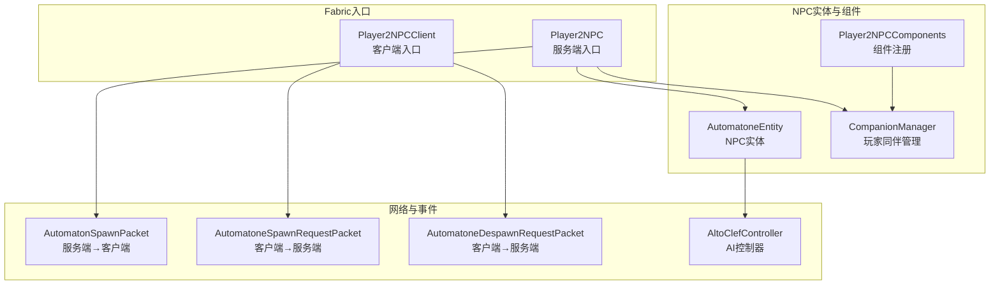
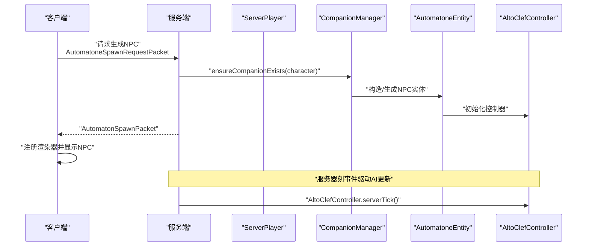
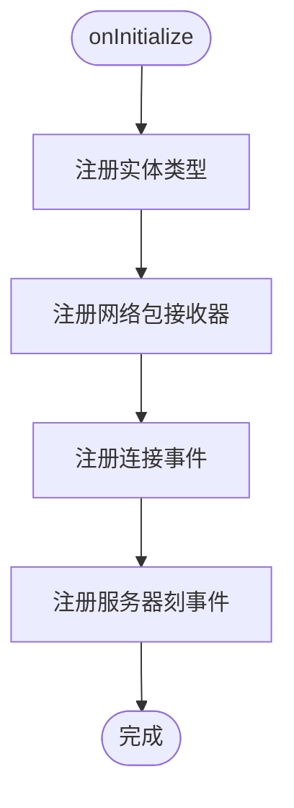
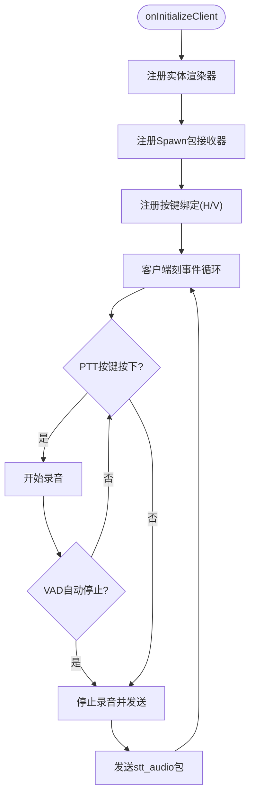
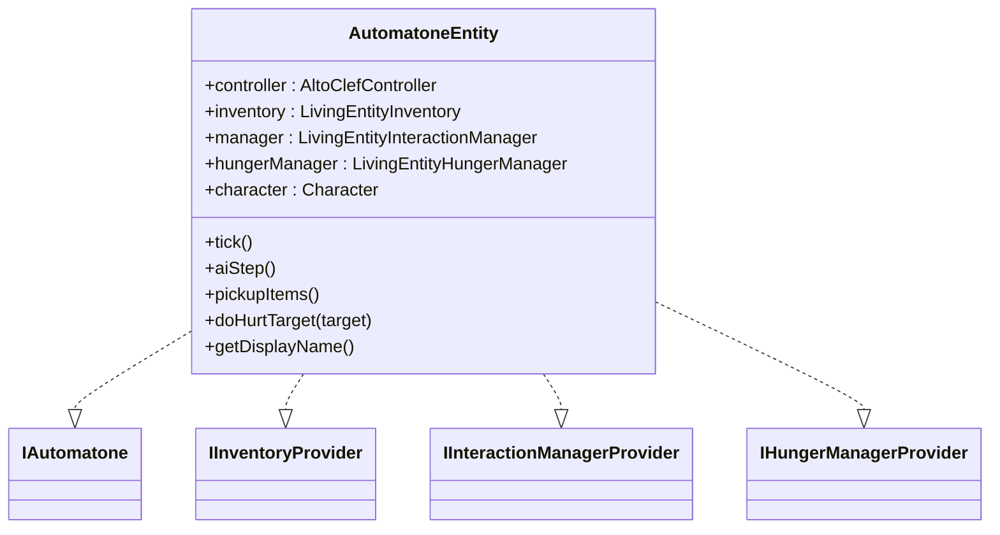
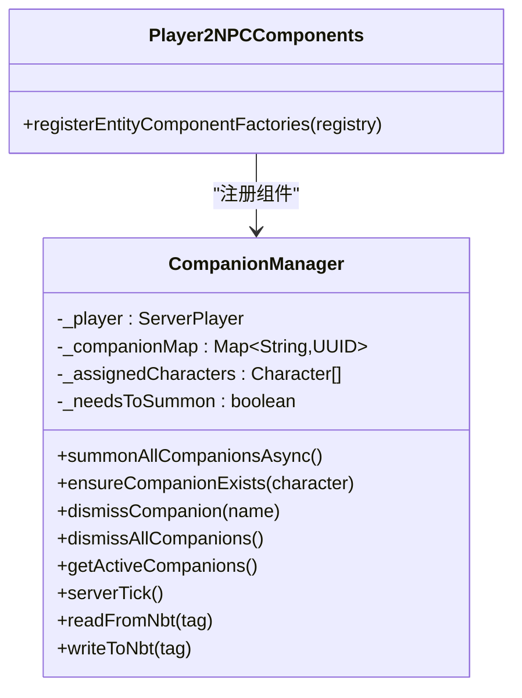
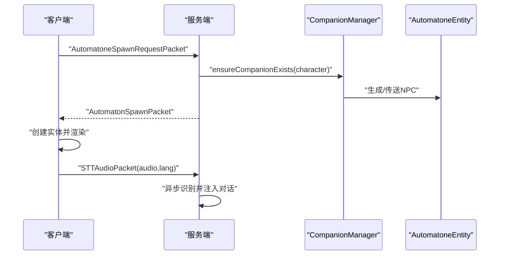
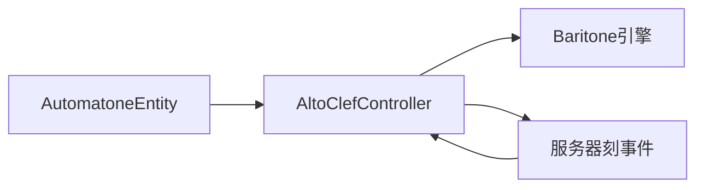
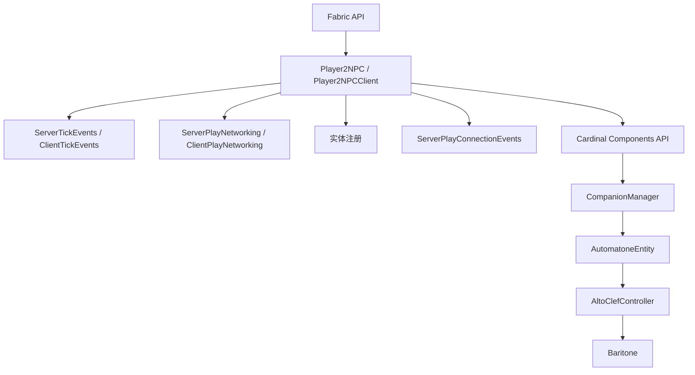

# Minecraft Integration层

<cite>
**本文引用的文件**
- [Player2NPC.java](file://src/main/java/com/goodbird/player2npc/Player2NPC.java)
- [Player2NPCClient.java](file://src/main/java/com/goodbird/player2npc/Player2NPCClient.java)
- [AutomatoneEntity.java](file://src/main/java/com/goodbird/player2npc/companion/AutomatoneEntity.java)
- [CompanionManager.java](file://src/main/java/com/goodbird/player2npc/companion/CompanionManager.java)
- [Player2NPCComponents.java](file://src/main/java/com/goodbird/player2npc/Player2NPCComponents.java)
- [AutomatonSpawnRequestPacket.java](file://src/main/java/com/goodbird/player2npc/network/AutomatoneSpawnRequestPacket.java)
- [AutomatoneDespawnRequestPacket.java](file://src/main/java/com/goodbird/player2npc/network/AutomatoneDespawnRequestPacket.java)
- [AutomatonSpawnPacket.java](file://src/main/java/com/goodbird/player2npc/network/AutomatonSpawnPacket.java)
- [fabric.mod.json](file://src/main/resources/fabric.mod.json)
- [AltoClefController.java](file://src/main/java/adris/altoclef/AltoClefController.java)
- [README.md](file://README.md)
</cite>

## 目录
1. [简介](#简介)
2. [项目结构](#项目结构)
3. [核心组件](#核心组件)
4. [架构总览](#架构总览)
5. [详细组件分析](#详细组件分析)
6. [依赖分析](#依赖分析)
7. [性能考量](#性能考量)
8. [故障排查指南](#故障排查指南)
9. [结论](#结论)
10. [附录](#附录)

## 简介
本文件面向Minecraft Integration层，系统性阐述该层如何作为桥梁连接UI层与Application层，涵盖以下主题：
- Fabric模组初始化流程（服务端入口、客户端入口）
- NPC实体管理（AutomatoneEntity实体类、CompanionManager管理器、Cardinal Components API组件系统）
- Fabric事件监听机制（服务器刻事件、聊天消息事件、实体加入事件）
- 与Baritone引擎的集成方式
- 模组生命周期管理、事件驱动架构、实体生命周期控制与模组间通信机制
- 具体的代码示例与事件流程图

## 项目结构
Integration层位于com.goodbird.player2npc包下，负责：
- 服务端：注册实体类型、网络包、连接事件与服务器刻事件
- 客户端：注册渲染器、按键绑定、网络包接收、麦克风录音与推送式说话（PTT/VAD）
- NPC实体：实现Baritone接口，承载AI控制器与库存/交互/饥饿管理
- 组件系统：通过Cardinal Components API为ServerPlayer附加CompanionManager

图表来源
- [Player2NPC.java:48-65](file://src/main/java/com/goodbird/player2npc/Player2NPC.java#L48-L65)
- [Player2NPCClient.java:36-124](file://src/main/java/com/goodbird/player2npc/Player2NPCClient.java#L36-L124)
- [AutomatoneEntity.java:50-91](file://src/main/java/com/goodbird/player2npc/companion/AutomatoneEntity.java#L50-L91)
- [CompanionManager.java:28-43](file://src/main/java/com/goodbird/player2npc/companion/CompanionManager.java#L28-L43)
- [Player2NPCComponents.java:10-16](file://src/main/java/com/goodbird/player2npc/Player2NPCComponents.java#L10-L16)
- [AutomatonSpawnPacket.java:26-98](file://src/main/java/com/goodbird/player2npc/network/AutomatonSpawnPacket.java#L26-L98)
- [AutomatoneSpawnRequestPacket.java:24-65](file://src/main/java/com/goodbird/player2npc/network/AutomatoneSpawnRequestPacket.java#L24-L65)
- [AutomatoneDespawnRequestPacket.java:21-63](file://src/main/java/com/goodbird/player2npc/network/AutomatoneDespawnRequestPacket.java#L21-L63)
- [AltoClefController.java:53-158](file://src/main/java/adris/altoclef/AltoClefController.java#L53-L158)

章节来源
- [fabric.mod.json:17-29](file://src/main/resources/fabric.mod.json#L17-L29)
- [Player2NPC.java:25-67](file://src/main/java/com/goodbird/player2npc/Player2NPC.java#L25-L67)
- [Player2NPCClient.java:23-164](file://src/main/java/com/goodbird/player2npc/Player2NPCClient.java#L23-L164)

## 核心组件
- 服务端入口：注册实体类型、网络包、连接事件与服务器刻事件
- 客户端入口：注册渲染器、按键绑定、网络包接收与音频录制
- NPC实体：实现Baritone接口，承载AI控制器与库存/交互/饥饿管理
- 组件系统：为ServerPlayer附加CompanionManager，实现玩家级NPC生命周期管理
- 网络包：Spawn/Despawn请求与响应，STT音频包

章节来源
- [Player2NPC.java:38-65](file://src/main/java/com/goodbird/player2npc/Player2NPC.java#L38-L65)
- [Player2NPCClient.java:36-124](file://src/main/java/com/goodbird/player2npc/Player2NPCClient.java#L36-L124)
- [AutomatoneEntity.java:50-177](file://src/main/java/com/goodbird/player2npc/companion/AutomatoneEntity.java#L50-L177)
- [CompanionManager.java:28-191](file://src/main/java/com/goodbird/player2npc/companion/CompanionManager.java#L28-L191)
- [Player2NPCComponents.java:10-16](file://src/main/java/com/goodbird/player2npc/Player2NPCComponents.java#L10-L16)
- [AutomatonSpawnPacket.java:26-120](file://src/main/java/com/goodbird/player2npc/network/AutomatonSpawnPacket.java#L26-L120)
- [AutomatoneSpawnRequestPacket.java:24-67](file://src/main/java/com/goodbird/player2npc/network/AutomatoneSpawnRequestPacket.java#L24-L67)
- [AutomatoneDespawnRequestPacket.java:21-65](file://src/main/java/com/goodbird/player2npc/network/AutomatoneDespawnRequestPacket.java#L21-L65)

## 架构总览
Integration层通过Fabric入口与事件系统，将UI层（按键/麦克风）与Application层（AI控制器、Baritone、LLM/TTS/STT）连接起来。其核心职责包括：
- 生命周期管理：在服务端注册实体与事件，在客户端注册渲染与按键
- 事件驱动：服务器刻事件驱动AI控制器更新，连接事件触发同伴管理
- 实体生命周期：通过CompanionManager管理NPC生成/传送/消失
- 模组间通信：通过Fabric网络包实现客户端与服务端的消息传递

图表来源
- [Player2NPC.java:48-65](file://src/main/java/com/goodbird/player2npc/Player2NPC.java#L48-L65)
- [AutomatoneSpawnRequestPacket.java:57-65](file://src/main/java/com/goodbird/player2npc/network/AutomatoneSpawnRequestPacket.java#L57-L65)
- [AutomatonSpawnPacket.java:100-120](file://src/main/java/com/goodbird/player2npc/network/AutomatonSpawnPacket.java#L100-L120)
- [AltoClefController.java:136-158](file://src/main/java/adris/altoclef/AltoClefController.java#L136-L158)

## 详细组件分析

### 服务端入口：Player2NPC
- 注册实体类型：注册AutomatoneEntity为实体类型
- 注册网络包：注册Spawn/Despawn/STT音频包的全局接收器
- 注册连接事件：玩家加入时召唤所有同伴，断开时解散所有同伴
- 注册服务器刻事件：每服务器刻驱动AI控制器更新

图表来源
- [Player2NPC.java:48-65](file://src/main/java/com/goodbird/player2npc/Player2NPC.java#L48-L65)

章节来源
- [Player2NPC.java:25-67](file://src/main/java/com/goodbird/player2npc/Player2NPC.java#L25-L67)

### 客户端入口：Player2NPCClient
- 注册渲染器：为AutomatoneEntity注册客户端渲染器
- 注册网络包：注册Spawn包接收器
- 注册按键绑定：打开角色选择界面、Push-to-Talk（PTT）
- PTT/VAD逻辑：使用GLFW原生状态检测按键，录音并发送STT音频包
- 最小录音时长校验与消息提示

图表来源
- [Player2NPCClient.java:36-124](file://src/main/java/com/goodbird/player2npc/Player2NPCClient.java#L36-L124)

章节来源
- [Player2NPCClient.java:23-164](file://src/main/java/com/goodbird/player2npc/Player2NPCClient.java#L23-L164)

### NPC实体：AutomatoneEntity
- 继承LivingEntity并实现IAutomatone/IInventoryProvider/IInteractionManagerProvider/IHungerManagerProvider
- 初始化控制器与管理器：仅在服务端创建AI控制器并发送问候
- NBT存档：保存头Yaw、库存、当前选中槽位、角色信息、拥有者UUID
- tick/aiStep：更新管理器、控制器、拾取掉落物、攻击逻辑、渲染插值
- 名称显示：优先使用角色shortName

图表来源
- [AutomatoneEntity.java:50-313](file://src/main/java/com/goodbird/player2npc/companion/AutomatoneEntity.java#L50-L313)

章节来源
- [AutomatoneEntity.java:41-313](file://src/main/java/com/goodbird/player2npc/companion/AutomatoneEntity.java#L41-L313)

### 组件系统：CompanionManager与Player2NPCComponents
- 组件注册：通过Cardinal Components API为ServerPlayer注册CompanionManager
- 玩家级NPC管理：记录角色→UUID映射，支持异步拉取角色列表、生成/传送/消失NPC
- 服务器刻驱动：在serverTick中根据标记批量生成NPC
- NBT持久化：保存同伴UUID映射

图表来源
- [CompanionManager.java:28-191](file://src/main/java/com/goodbird/player2npc/companion/CompanionManager.java#L28-L191)
- [Player2NPCComponents.java:10-16](file://src/main/java/com/goodbird/player2npc/Player2NPCComponents.java#L10-L16)

章节来源
- [CompanionManager.java:1-191](file://src/main/java/com/goodbird/player2npc/companion/CompanionManager.java#L1-L191)
- [Player2NPCComponents.java:1-17](file://src/main/java/com/goodbird/player2npc/Player2NPCComponents.java#L1-L17)

### 网络包：Spawn/Despawn与STT
- Spawn请求：客户端发送Spawn请求包，服务端确保NPC存在并生成
- Despawn请求：客户端发送Despawn请求包，服务端移除对应NPC
- Spawn响应：服务端发送Spawn包，客户端创建实体并同步状态
- STT音频：客户端发送stt_audio包，服务端异步识别并注入对话

图表来源
- [AutomatoneSpawnRequestPacket.java:57-65](file://src/main/java/com/goodbird/player2npc/network/AutomatoneSpawnRequestPacket.java#L57-L65)
- [AutomatoneDespawnRequestPacket.java:56-63](file://src/main/java/com/goodbird/player2npc/network/AutomatoneDespawnRequestPacket.java#L56-L63)
- [AutomatonSpawnPacket.java:100-120](file://src/main/java/com/goodbird/player2npc/network/AutomatonSpawnPacket.java#L100-L120)

章节来源
- [AutomatoneSpawnRequestPacket.java:1-67](file://src/main/java/com/goodbird/player2npc/network/AumatoneSpawnRequestPacket.java#L1-L67)
- [AutomatoneDespawnRequestPacket.java:1-65](file://src/main/java/com/goodbird/player2npc/network/AutomatoneDespawnRequestPacket.java#L1-L65)
- [AutomatonSpawnPacket.java:1-120](file://src/main/java/com/goodbird/player2npc/network/AutomatonSpawnPacket.java#L1-L120)

### 与Baritone引擎的集成
- NPC实体实现IAutomatone与Baritone提供的Inventory/Interaction/Hunger管理器
- 服务端每刻调用AI控制器的serverTick，进而驱动Baritone内部行为
- AI控制器在静态构造中注册服务器刻事件，确保全局tick驱动

图表来源
- [AutomatoneEntity.java:50-91](file://src/main/java/com/goodbird/player2npc/companion/AutomatoneEntity.java#L50-L91)
- [AltoClefController.java:136-158](file://src/main/java/adris/altoclef/AltoClefController.java#L136-L158)

章节来源
- [AutomatoneEntity.java:50-91](file://src/main/java/com/goodbird/player2npc/companion/AutomatoneEntity.java#L50-L91)
- [AltoClefController.java:53-158](file://src/main/java/adris/altoclef/AltoClefController.java#L53-L158)

## 依赖分析
- Fabric入口与事件：服务端/客户端分别注册事件与网络包
- 组件系统：Cardinal Components API为ServerPlayer附加CompanionManager
- Baritone集成：NPC实体实现IAutomatone与相关Provider接口
- 网络协议：自定义PacketType与Fabric网络API

图表来源
- [Player2NPC.java:48-65](file://src/main/java/com/goodbird/player2npc/Player2NPC.java#L48-L65)
- [Player2NPCClient.java:36-124](file://src/main/java/com/goodbird/player2npc/Player2NPCClient.java#L36-L124)
- [Player2NPCComponents.java:10-16](file://src/main/java/com/goodbird/player2npc/Player2NPCComponents.java#L10-L16)
- [AltoClefController.java:152-158](file://src/main/java/adris/altoclef/AltoClefController.java#L152-L158)

章节来源
- [fabric.mod.json:17-29](file://src/main/resources/fabric.mod.json#L17-L29)
- [Player2NPC.java:10-14](file://src/main/java/com/goodbird/player2npc/Player2NPC.java#L10-L14)
- [Player2NPCClient.java:8-13](file://src/main/java/com/goodbird/player2npc/Player2NPCClient.java#L8-L13)

## 性能考量
- 异步生成NPC：Character列表拉取与生成在服务器线程池中异步执行，避免阻塞
- 服务器刻驱动：AI控制器在服务器刻事件中更新，确保与游戏世界同步
- 客户端按键检测：使用GLFW原生状态检测PTT，避免KeyMapping状态重置导致的误判
- 网络包压缩：Spawn包对速度进行量化编码，降低带宽占用
- 食物/饥饿/交互：仅在必要时启用，避免不必要的tick开销

## 故障排查指南
- 无法生成NPC：检查服务端是否注册了Spawn请求包与CompanionManager
- 客户端无渲染：确认渲染器已注册且Spawn包正确到达
- PTT无效：检查按键绑定、麦克风可用性与最小录音时长
- 语音识别失败：确认STT配置、API Key与网络连通性
- NPC不回复：确认距离在64格内、AI控制器已初始化、服务器刻事件正常

章节来源
- [Player2NPC.java:52-65](file://src/main/java/com/goodbird/player2npc/Player2NPC.java#L52-L65)
- [Player2NPCClient.java:68-122](file://src/main/java/com/goodbird/player2npc/Player2NPCClient.java#L68-L122)
- [README.md:456-491](file://README.md#L456-L491)

## 结论
Integration层通过Fabric入口与事件系统，将UI层的按键/麦克风输入与Application层的AI控制器、Baritone引擎、LLM/TTS/STT服务有效连接。其设计遵循事件驱动与组件化原则，实现了NPC实体的生命周期管理、模组间通信与跨线程异步处理，为上层应用提供了稳定可靠的基础设施。

## 附录
- Fabric入口与组件注册：参见fabric.mod.json中的entrypoints与custom.cardinal-components
- AI控制器静态注册：AltoClefController在静态块中注册服务器刻事件
- README中的架构图与交互流程可作为进一步理解的参考

章节来源
- [fabric.mod.json:17-47](file://src/main/resources/fabric.mod.json#L17-L47)
- [AltoClefController.java:152-158](file://src/main/java/adris/altoclef/AltoClefController.java#L152-L158)
- [README.md:496-529](file://README.md#L496-L529)