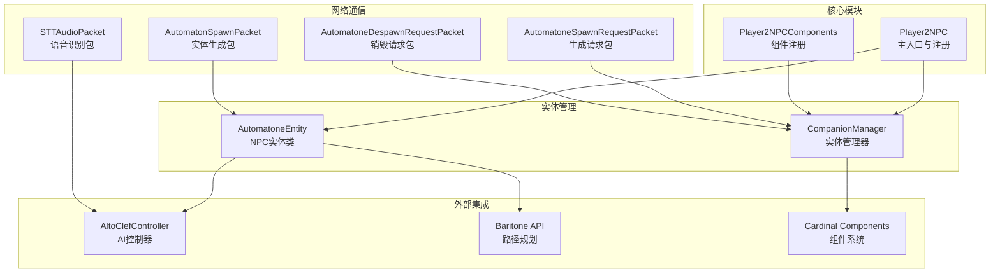
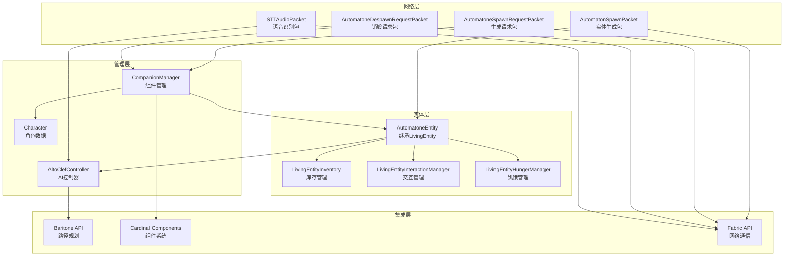
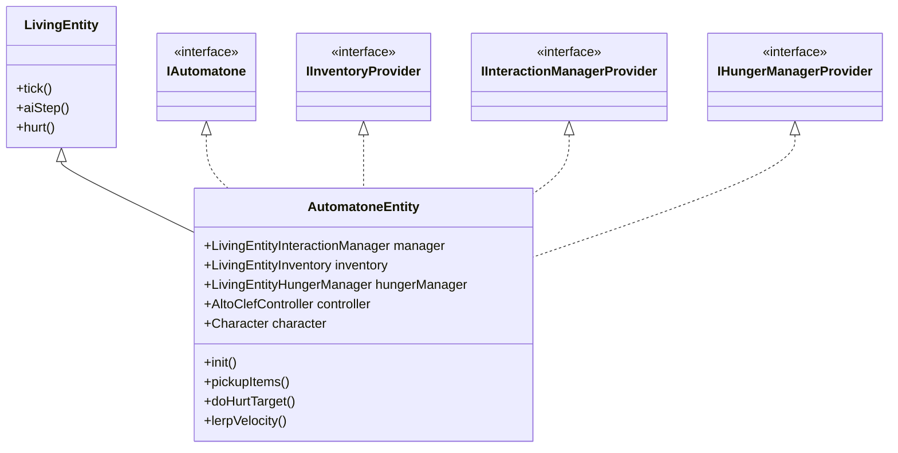
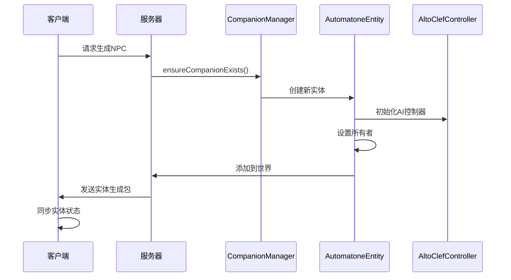
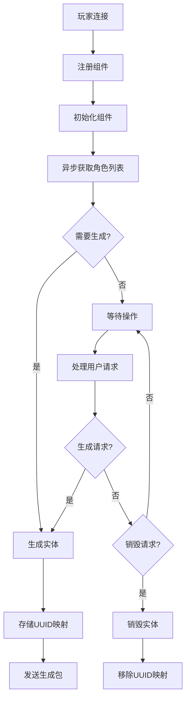
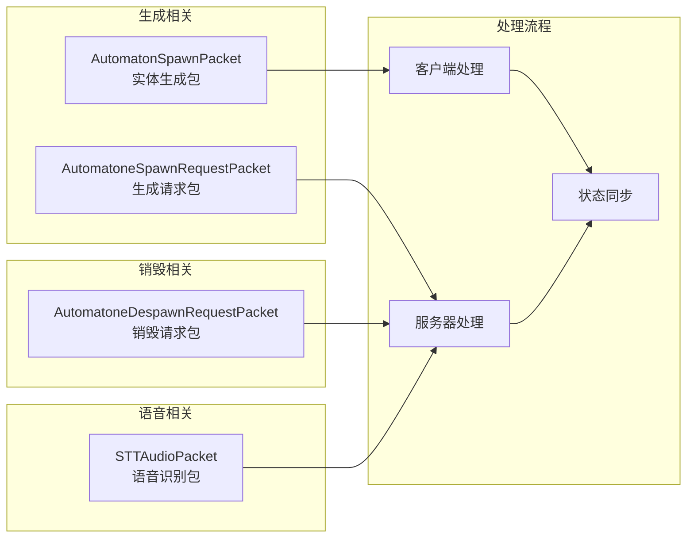
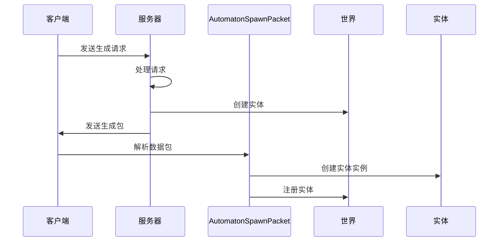
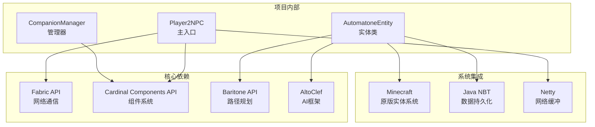

# NPC实体管理系统

<cite>
**本文档引用的文件**
- [AutomatoneEntity.java](file://src/main/java/com/goodbird/player2npc/companion/AutomatoneEntity.java)
- [CompanionManager.java](file://src/main/java/com/goodbird/player2npc/companion/CompanionManager.java)
- [Player2NPCComponents.java](file://src/main/java/com/goodbird/player2npc/Player2NPCComponents.java)
- [AutomatonSpawnPacket.java](file://src/main/java/com/goodbird/player2npc/network/AutomatonSpawnPacket.java)
- [AutomatoneDespawnRequestPacket.java](file://src/main/java/com/goodbird/player2npc/network/AutomatoneDespawnRequestPacket.java)
- [AutomatoneSpawnRequestPacket.java](file://src/main/java/com/goodbird/player2npc/network/AutomatoneSpawnRequestPacket.java)
- [Player2NPC.java](file://src/main/java/com/goodbird/player2npc/Player2NPC.java)
- [fabric.mod.json](file://src/main/resources/fabric.mod.json)
- [STTAudioPacket.java](file://src/main/java/com/goodbird/player2npc/network/STTAudioPacket.java)
</cite>

## 目录
1. [简介](#简介)
2. [项目结构](#项目结构)
3. [核心组件](#核心组件)
4. [架构总览](#架构总览)
5. [详细组件分析](#详细组件分析)
6. [依赖关系分析](#依赖关系分析)
7. [性能考虑](#性能考虑)
8. [故障排除指南](#故障排除指南)
9. [结论](#结论)
10. [附录](#附录)

## 简介
本项目是一个基于Fabric的Minecraft模组，实现了AI驱动的NPC实体管理系统。系统通过Cardinal Components API为玩家实体提供组件化扩展，支持动态创建、销毁和同步AI NPC实体，集成了AltoClef控制器提供智能行为逻辑，并通过自定义网络协议实现客户端与服务器之间的实体同步与交互。

系统主要特性包括：
- 自定义NPC实体类型AutomatoneEntity，继承LivingEntity并实现IAutomatone接口
- 基于Cardinal Components的玩家组件管理CompanionManager
- 完整的实体生命周期管理（创建、销毁、重生）
- 实体状态持久化与跨世界加载
- 与AltoClef AI框架的深度集成
- 多模态交互支持（语音识别、对话系统）

## 项目结构
项目采用模块化设计，核心代码位于com.goodbird.player2npc包下，按功能划分为以下层次：



**图表来源**
- [Player2NPC.java:1-67](file://src/main/java/com/goodbird/player2npc/Player2NPC.java#L1-L67)
- [Player2NPCComponents.java:1-17](file://src/main/java/com/goodbird/player2npc/Player2NPCComponents.java#L1-L17)

**章节来源**
- [Player2NPC.java:25-66](file://src/main/java/com/goodbird/player2npc/Player2NPC.java#L25-L66)
- [fabric.mod.json:17-47](file://src/main/resources/fabric.mod.json#L17-L47)

## 核心组件
系统由四个核心组件构成，每个组件承担特定职责并协同工作：

### 1. AutomatoneEntity - NPC实体类
继承自LivingEntity，实现IAutomatone、IInventoryProvider、IInteractionManagerProvider、IHungerManagerProvider接口，提供完整的NPC行为能力。

### 2. CompanionManager - 实体管理器
基于Cardinal Components的组件系统，负责实体的生命周期管理、状态同步和玩家关联。

### 3. Player2NPCComponents - 组件注册
实现EntityComponentInitializer接口，注册CompanionManager组件到ServerPlayer实体上。

### 4. 网络包系统
包含实体生成、销毁请求和语音识别等专用网络包，确保客户端与服务器的数据同步。

**章节来源**
- [AutomatoneEntity.java:50-116](file://src/main/java/com/goodbird/player2npc/companion/AutomatoneEntity.java#L50-L116)
- [CompanionManager.java:28-43](file://src/main/java/com/goodbird/player2npc/companion/CompanionManager.java#L28-L43)
- [Player2NPCComponents.java:10-16](file://src/main/java/com/goodbird/player2npc/Player2NPCComponents.java#L10-L16)

## 架构总览
系统采用分层架构设计，从底层到高层依次为：实体层、管理层、网络层、集成层。



**图表来源**
- [AutomatoneEntity.java:50-116](file://src/main/java/com/goodbird/player2npc/companion/AutomatoneEntity.java#L50-L116)
- [CompanionManager.java:28-43](file://src/main/java/com/goodbird/player2npc/companion/CompanionManager.java#L28-L43)
- [Player2NPC.java:38-46](file://src/main/java/com/goodbird/player2npc/Player2NPC.java#L38-L46)

## 详细组件分析

### AutomatoneEntity - NPC实体类设计
AutomatoneEntity是系统的核心实体类，实现了完整的NPC功能。

#### 设计模式与继承关系


**图表来源**
- [AutomatoneEntity.java:50-116](file://src/main/java/com/goodbird/player2npc/companion/AutomatoneEntity.java#L50-L116)

#### 核心属性与行为
- **基础属性配置**：设置最大步高0.6f，移动速度0.4f
- **管理器初始化**：创建交互管理器、库存管理和饥饿管理器
- **AI控制器**：仅在客户端初始化AltoClefController
- **物品拾取**：自动拾取3格范围内的掉落物品
- **战斗逻辑**：实现doHurtTarget方法提供攻击能力

#### 生命周期管理


**图表来源**
- [AutomatoneSpawnRequestPacket.java:57-65](file://src/main/java/com/goodbird/player2npc/network/AutomatoneSpawnRequestPacket.java#L57-L65)
- [CompanionManager.java:100-129](file://src/main/java/com/goodbird/player2npc/companion/CompanionManager.java#L100-L129)

**章节来源**
- [AutomatoneEntity.java:78-99](file://src/main/java/com/goodbird/player2npc/companion/AutomatoneEntity.java#L78-L99)
- [AutomatoneEntity.java:164-177](file://src/main/java/com/goodbird/player2npc/companion/AutomatoneEntity.java#L164-L177)

### CompanionManager - 实体管理器
CompanionManager是基于Cardinal Components的组件系统，负责管理玩家的所有NPC实体。

#### 组件注册与生命周期


**图表来源**
- [Player2NPCComponents.java:12-15](file://src/main/java/com/goodbird/player2npc/Player2NPCComponents.java#L12-L15)
- [CompanionManager.java:45-74](file://src/main/java/com/goodbird/player2npc/companion/CompanionManager.java#L45-L74)

#### 核心功能实现
- **异步角色获取**：使用CompletableFuture异步获取玩家分配的角色
- **实体生成策略**：根据角色名称生成对应NPC实体
- **状态同步**：维护角色名到实体UUID的映射表
- **持久化支持**：实现NBT序列化保存实体映射关系

**章节来源**
- [CompanionManager.java:28-43](file://src/main/java/com/goodbird/player2npc/companion/CompanionManager.java#L28-L43)
- [CompanionManager.java:169-175](file://src/main/java/com/goodbird/player2npc/companion/CompanionManager.java#L169-L175)

### 网络通信系统
系统通过自定义网络包实现客户端与服务器的数据交换。

#### 数据包类型与用途


**图表来源**
- [AutomatonSpawnPacket.java:26-52](file://src/main/java/com/goodbird/player2npc/network/AutomatonSpawnPacket.java#L26-L52)
- [AutomatoneSpawnRequestPacket.java:24-35](file://src/main/java/com/goodbird/player2npc/network/AutomatoneSpawnRequestPacket.java#L24-L35)

#### 实体生成流程


**图表来源**
- [AutomatonSpawnPacket.java:100-119](file://src/main/java/com/goodbird/player2npc/network/AutomatonSpawnPacket.java#L100-L119)
- [AutomatoneSpawnRequestPacket.java:57-65](file://src/main/java/com/goodbird/player2npc/network/AutomatoneSpawnRequestPacket.java#L57-L65)

**章节来源**
- [AutomatonSpawnPacket.java:26-98](file://src/main/java/com/goodbird/player2npc/network/AutomatonSpawnPacket.java#L26-L98)
- [AutomatoneDespawnRequestPacket.java:21-64](file://src/main/java/com/goodbird/player2npc/network/AutomatoneDespawnRequestPacket.java#L21-L64)

## 依赖关系分析

### 外部依赖关系
系统依赖多个外部库和框架：



**图表来源**
- [fabric.mod.json:33-46](file://src/main/resources/fabric.mod.json#L33-L46)
- [Player2NPC.java:38-46](file://src/main/java/com/goodbird/player2npc/Player2NPC.java#L38-L46)

### 内部模块耦合
系统采用松耦合设计，各模块间通过接口和事件进行通信：

- **低耦合设计**：实体类通过接口实现而非具体实现类依赖
- **事件驱动**：使用Fabric的事件系统处理生命周期事件
- **组件化架构**：通过Cardinal Components实现可插拔的功能模块
- **网络抽象**：自定义数据包封装网络通信细节

**章节来源**
- [Player2NPC.java:48-65](file://src/main/java/com/goodbird/player2npc/Player2NPC.java#L48-L65)
- [fabric.mod.json:26-28](file://src/main/resources/fabric.mod.json#L26-L28)

## 性能考虑

### 内存管理优化
- **实体池化**：通过UUID映射避免重复创建实体实例
- **异步处理**：角色获取和语音识别使用线程池避免阻塞主线程
- **数据压缩**：网络包中对实体位置和速度进行压缩传输

### 网络性能优化
- **批量处理**：服务器端统一处理实体生命周期事件
- **增量更新**：仅在网络包中传输必要的状态信息
- **缓存机制**：客户端缓存实体渲染状态减少计算开销

### AI性能优化
- **任务队列**：AltoClef控制器使用任务队列管理AI行为
- **优先级调度**：基于行为重要性进行任务优先级排序
- **冷却机制**：避免AI行为过于频繁导致性能问题

## 故障排除指南

### 常见问题诊断
1. **实体无法生成**
   - 检查角色数据是否正确加载
   - 验证网络包传输是否正常
   - 确认服务器端组件注册完成

2. **实体状态不同步**
   - 检查NBT序列化是否正确
   - 验证网络包解析逻辑
   - 确认客户端渲染更新

3. **AI行为异常**
   - 检查AltoClef控制器初始化
   - 验证Baritone路径规划服务
   - 确认行为树配置正确

### 调试建议
- 启用详细日志记录
- 使用断点调试网络包处理
- 监控内存使用情况
- 分析AI行为执行时间

**章节来源**
- [AutomatonSpawnPacket.java:100-119](file://src/main/java/com/goodbird/player2npc/network/AutomatonSpawnPacket.java#L100-L119)
- [CompanionManager.java:169-175](file://src/main/java/com/goodbird/player2npc/companion/CompanionManager.java#L169-L175)

## 结论
NPC实体管理系统通过模块化设计和组件化架构，成功实现了AI驱动的NPC实体管理。系统具有以下优势：

1. **架构清晰**：分层设计使代码结构易于理解和维护
2. **扩展性强**：组件化架构支持功能模块的灵活扩展
3. **性能优秀**：异步处理和缓存机制确保系统响应性
4. **集成完善**：与AltoClef和Baritone等框架深度集成

未来可以考虑的改进方向：
- 增加实体行为的可视化调试工具
- 优化AI决策算法的性能表现
- 扩展多语言支持和本地化功能
- 增强实体间的交互和社交功能

## 附录

### 最佳实践示例

#### 实体创建最佳实践
```java
// 推荐：使用构造函数创建实体
AutomatoneEntity entity = new AutomatoneEntity(world, character, owner);

// 推荐：设置合适的初始属性
entity.setMaxUpStep(0.6f);
entity.getAttribute(Attributes.MOVEMENT_SPEED).setBaseValue(0.4f);

// 推荐：正确初始化管理器
entity.init();
```

#### 状态持久化最佳实践
```java
// 推荐：在NBT中保存关键状态
@Override
public void addAdditionalSaveData(CompoundTag tag) {
    super.addAdditionalSaveData(tag);
    tag.putUUID("owner_uuid", controller.getOwner().getUUID());
    tag.put("character", CharacterUtils.writeToNBT(character));
}

// 推荐：从NBT恢复状态
@Override
public void readAdditionalSaveData(CompoundTag tag) {
    super.readAdditionalSaveData(tag);
    if (tag.contains("owner_uuid")) {
        Player owner = level().getPlayerByUUID(tag.getUUID("owner_uuid"));
        controller.setOwner(owner);
    }
}
```

#### 网络通信最佳实践
```java
// 推荐：使用Fabric API进行网络通信
ServerPlayNetworking.registerGlobalReceiver(
    SPAWN_REQUEST_PACKET_ID, 
    AutomatoneSpawnRequestPacket::handle
);

// 推荐：正确的数据包处理流程
public static void handle(MinecraftServer server, ServerPlayer player, 
                         ServerGamePacketListenerImpl handler, 
                         FriendlyByteBuf buf, PacketSender responseSender) {
    // 异步处理重任务
    server.execute(() -> {
        // 在服务器线程中处理
        CompanionManager.KEY.get(player).ensureCompanionExists(character);
    });
}
```